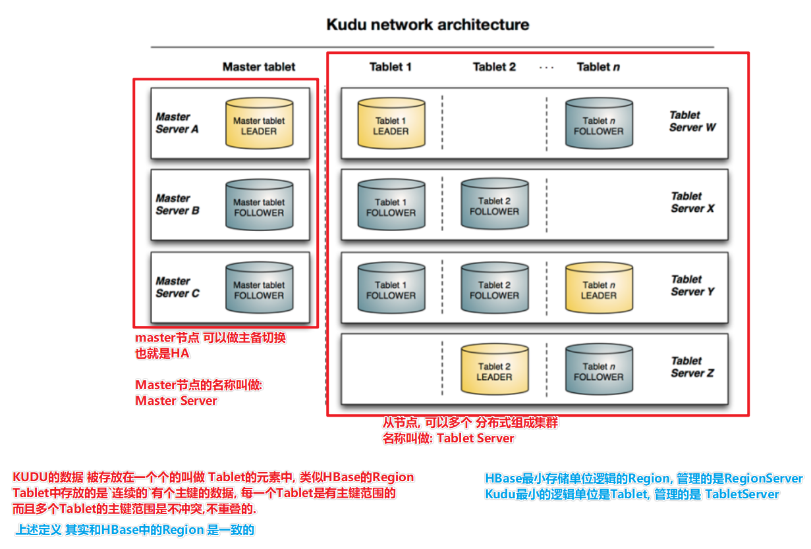
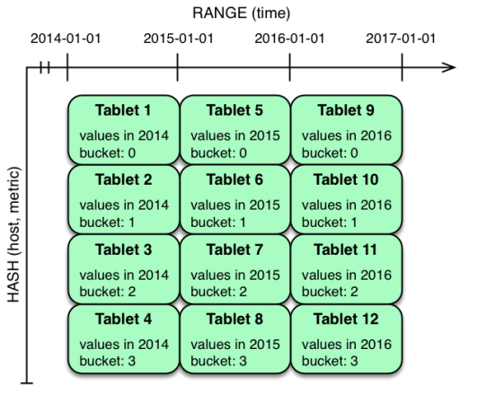

# 1- KUDU介绍

- [分布式数据库]()
- [**不依赖HDFS**]()，有自己的存储功能；和分布式功能；
- [**大规模\高吞吐(低于HDFS,高于HBAse)\ 低延迟 \ 的 数据库**](), 看起来定义和HBase是基本差不多的.


- **[Kudu]() VS [HBase]()**: 
  - 数据库 VS 数据库,  KUDU比HBase强的地方在于 **[吞吐量更高]()**, 支持数据**[增删改查更好]()**, 不差于HBase的随机读写能力

- Kudu 既有HDFS的[**高吞吐**]()(略差HDFS) 也有HBase的[**随机读写低延迟**]()能力(略差HBase)

- kudu 还是一个[**全新的设计**]()对于[**新硬件兼容性更好**](),能[**更充分的利用硬件资源**]()。（CPU 内存 硬盘等更新迭代）
  - 内存：DDR4-> DDR5
  - 硬盘：Sata->pci HDD -> SSD -> pcie(传输协议) SSD


- 总结

  - 其实Kudu我们可以把它定位成**分布式存储层**

  - 能够提供**高吞吐的写入和抽取**同时可以做**增删改查**, 对比HDFS更方便了、

  - 还能提供简单的**随机查询**

  - 如果做复杂的数据分析, Kudu可以作为存储层为Impala或SparkSQL等提供数据支撑.

    

- 目前我们接触到的一些框架:

  - **存储层面**: HDFS文件系统\HBase 数据库\ Kudu存储层框架
  - **计算层面**: Spark Flink Impala Hive(MR)  Phonix

## 1-1 列式存储

​		存储数据在强类型的columns中，适合olap和数据仓库，因为[**列存**]()，当OLAP时，读取当个字段或部分字段是，I/O次数更少比起行存，读效率高，行存读单个字段也许读整行，因为列只是一种类型，所以压缩效率比起行存的多种类型更优，减少了I/O次数;

## 1-2 raft协议 了解

​		官网没细说，kudu用[**raft协议选举master和leader tablet**]()，也决定写入操作的成功和失败，因为raft来保证副本一致性

## 1-3 [Table ]()了解

​		有schema和完全有序的主键，一个表通过主键被分割成多个tablet

## 1-4 [Tablet]() 了解

​		tablet是table的一部分，类似别的分布式框架中的分区，一个tablet的副本在多个不同tablet server(也就是节点)，任何时候，只有一个leader，所有副本都可以提供读的服务，写要求一致性在多个server间


## 1-5 [Tablet server ]()了解

​		存储tablet并对外提供服务，对于一个tablet，一个tablet server作为leader，而别的副本作为follower，只有leader可以想要写请求，所有副本可相应对请求，leader被选举使用raft协议，一个tablet server有多个tablet，一个tablet也分布在多个server上

## 1-6 [Master ]()了解

​		持续track所有的tablet，tablet server，catalog talbe和别的集群相关的元数据，在某一时刻，只有一个master是leader，如果leader宕掉，新leader将通过raft选举出来

master也coordinate客户端操作的元数据，例如，创表的适合，客户端发请求到master，master写新表的元数据到catalog table，也coordinate在tablet server上创tablet的操作

所有的master数据存储在一个tablet，副本在别的所有master，talbet server会定期向master发心跳

## 1-7 catalog table 了解

kudu元数据的中心位置（翻译这么别扭呢），存储talbe和tablet的信息，可以被访问通过master的client，api。catalog table不能直接被读或写，相反，可以被访问通过公开的元数据操作用客户端api(还是没明白，怎么才能访问，先这样写，说不定后面就明白了)，只存储两类元数据

table、tablet

## 1-8 logical replication 了解

kudu复制操作不是磁盘上数据，这是逻辑复制，而不是物理复制，有几个优点

1.虽然插入和更新通过网络传输数据，但是删除不需要移动任何数据，删除操作被发送给每个tablet server，本地执行删除

2.物理操作，例如压缩，不需要网络传输数据，这是与hdfs不同的，网络传输block以达到副本数

3.tablet不需要同时执行压缩或在同一调度中，甚至不需要保持同步，减少了高延迟的机会，由于压缩或者高负载的写

(还是没明白啥是逻辑复制)


# 2- KUDU的架构

- **[KUDU同样是 Master\Slave 主从架构]()**

- 主节点:Master

- 从节点:Slave(Tablet Server)


- 从这里也能看出, KUDU是[**分布式框架**]()([有架构, 有分布式进程组成一个大系统]()) 而不是工具(单机工具)




# 3- kudu副本介绍

- **HBase**的数据 也是[有副本]()的, HBase的数据副本 是[**基于HDFS提供**]()的. 因为HDFS是HBase的存储层.

- **Kudu** 的Tablet 是[有副本]()的, Tablet的数据是多副本存储的, 确保安全性, 多副本的能力是[**Kudu自己提供**]()的

- 也就是 Kudu的运行 [**不依赖HDFS**]()

- 因为Kudu本身就是一个[**自带存储层**]()( 不是文件系统, 而是数据库)的数据库；


# 4- kudu和hbase的区别和联系

## 4-1 前提

- [HBase]()
  - Hbase的物理模型是**master和regionserver**；
  - **regionserver存储的是region**;
  - **region里边很有很多store**;
  - **一个store对应一个[列簇]()**;
  - **一个store中有一个memstore和多个storefile;**
  - **store的底层是hfile**，hfile是hadoop的二进制文件;
  - 其中**HFile**和**HLog**是hbase两大文件存储格式，HFile用于存储数据，HLog保证可以写入到HFile中；

- [kudu]()
  - kudu 的物理模型是**master和tserver**;
  - table根据[**hash和range分区**]()，分为多个**tablet**存储到tserver中;
  - tablet分为**[leader和follower]()**，leader负责[**写**]()请求，follower负责[**读**]()请求;
  - 总结来说，(**[多对多]()**的关系)[**一个tserver可以服务多个tablet，一个tablet可以被多个tserver服务**]()（基于tablet的分区，最低为2个分区）；

## 4-2 联系

- 1、设计理念和想法是一致的；
- 2、kudu的思想是**基于hbase**的，之前cloudera公司向对hbase改造，支持大数据量更新，可是由于改动源码太大，所以todd直接开发了kudu；
- 3、**hbase基于rowkey查询** 和 **kudu基于主键查询**是很快的；


## 4-3 架构区别

- [**Kudu 不依赖于zookeeper**]()；
  - Kudu将HBase中zookeeper的功能放进了**TMaster内**，Kudu中TMaster的功能比HBase中的Master任务要多一些；
  - **kudu**所有集群的**[配置信息]()**均存储在**本地磁盘**中；
  - **Hbase**的集群**[配置信息]()**是存储在**zookeeper**中；
- Hbase将**数据持久化**这部分的功能交给了**Hadoop中的HDFS**，最终组织的数据存储在HDFS上。
- Kudu自己将存**储模块集成在自己的结构**中（**[Tserver]()**），内部的数据存储模块通过**Raft协议**来保证leader Tablet和replica Tablet内数据的**强一致性**，和数据的**高可靠性**；


## 4-4 数据存储方式


- HBase是[**面向列族式**]()的存储，每个列族都是分别存放的，HBase表设计时，很少使用设计多个列族，大多情况下是**一个列族**。这个时候的HBase的**存储结构**已经**与行式存储无太大差别**了。（[**假列存储方式**]()）
- Kudu，实现的是一个[**真正的面向列的存储方式**]()，表中的每一列都是单独存放的；所以HBase与Kudu的差异主要在于类似于[行式存储的**列族式**存储方式]()与[典型的**面向列式**的存储方式]()的差异；

## 4-5 写入和读取过程

### 4-6-1 写过程

- **HBase**写的时候，[不管是**新插入**一条数据还是**更新数据**，**都当作插入一条新数据**来进行]()；
- **Kudu**将[插入新数据  与  更新操作**分别看待**]()；
- **Kudu**表结构中必须设置一个**[唯一主键]()**，插入数据的时候必须判断一些该数据的主键是否唯一，所以插入的时候其实有一个**[读的过程]()** （[**先读-判断是否唯一-插入**]()）； 而**HBase**没有太多限制，待插入数据将**直接写进memstore**；
- HBase实现数据**可靠性**是通过将落盘的**数据写入HDFS**来实现；而Kudu是通过将数据写入和更新操作**同步在其他副本**上实现数据**可靠性**；
- 结合以上几点，可以看出[**Kudu在写的性能上相对HBase有一定的劣势**]()；

### 4-6-2 读过程

- 在HBase中，读取的数据可能有**多个版本**，所以需要结合多个storefile进行查询；Kudu数据只可能存在于一个**DiskRowset或者MemRowset**中，但是因为可能存在还未合并进原数据的更新，所以Kudu也需要结合多个**DeltaFile**进行查询；
- **HBase**写入或者更新时可以**指定timestamp**，导致storefile之间timestamp范围的规律性降低，增加了实际查询storefile的数量；**Kudu不允许**人为**指定**写入或者更新时的**timestamp**值，[DeltaFile之间timestamp连续]()，可以更快的找到需要的DeltaFile；
- HBase通过timestamp值可以直接取出数据；而Kudu实现多版本是通过保留UNDO records（已经合并过的操作）和REDO records（未合并过的操作）完成的，在一些情况下Kudu需要将base data结合UNDO records进行回滚或者结合REDO records进行合并然后才能得到真正所需要的数据；
- 结合以上三点可以得出，不管是HBase还是Kudu，在读取一条数据时都需要从多个文件中搜寻相关信息。相对于HBase，Kudu选择将插入数据和更新操作分开，一条数据只可能存在于一个DiskRowset或者memRowset中，只需要搜寻到一个rowset中存在指定数据就不用继续往下找了，用户不能设置更新和插入时的timestamp值，减少了在rowset中DeltaFile的读取数量。这样在scan的情况下可以结合列式存储的优点实现较高的读性能，特别是在更新数量较少的情况下能够有效提高scan性能；

## 4-6 其它差异

- HBase：使用的java，内存的释放通过GC来完成，在内存比较紧张时可能引发full GC进而导致服务不稳定；
- Kudu：核心模块用的C++来实现，没有full gc的风险；


# 5- Kudu分区

## 5-0 [kudu根据什么分区]()？	

- 根据[**addHashPartition**]()(List，数量)中**[list 指定的一些列]()** 来分区；
- Hbase是根据rowkey来分区；


## 5-1 分区模式

- **Hash分区**
- **Range分区**
- **混合分区**

## 5-2 Hash分区模式

- Hash分区模式,指的是:将数据中**[指定的某些列]()**取得[**Hash值**](), 然后[**余分区数**](), 得到要去的分区编号.

- 比如：
  - 比如: hadoop作为key(**[指定的一些列]()**), hash并余分区数后 得到1, 这个数据就会进入分区1, 同时 所有的Hadoop 都会进入分区1

- 好处：

  - 同样的Key(**[指定的一些列]()**), 肯定在一个分区内；
  - 查询的时候, 可以通过同样的算法进行计算, 可以快速的定位到数据在哪个分区内；
  - **数据的范围是可以不确定的**

- 坏处

  - Hash分区如果数据key不均匀, 那么分区内的数据也就不均匀
  - 也就是会产生[**数据倾斜问题**]()


## 5-3 Range分区

- Range表示的是**区间\范围**


- Range分区就是范围分区, 这个和[HBase的Region]()是一个概念.


- 在Kudu中 一个[Tablet的范围 从x -> y](),  和 HBase的Region中[rowkey的范围 从x -> y]() 是一个意思.


- 注意: 
  - Kudu中的分区范围 **[不是像HBase那样全是字符串顺序(字典顺序)]()**；
  - 具体范围的顺序 依据[**数据的类型**]()来决定；
  - 比如：[Int类型 比数字大小 ； String类型 比字符串大小]()；

- 优点:
  - 可以[**预分区**]()：可以预先根据数据的范围, 来划分分区, 这样可以更好的设计分区, 来确保数据的均匀；
  - [**数据是连续的**]()：Range分区 范围查询(连续数据)比Hash更好；

- 缺点:
  - 如果数据的范围你[**预先不知道**](), 那么用这个方式, 会导致某些数据无分区可用；（[数据倾斜]()）


## 5-4 MultiLevel 分区 - 混合分区模式



- 混合分区模式, 指的是: [将Hash分区 和 Range分区 放到一个表中]().


- 也就是一张表中有**两种分区类型**


- 混合分区可以结合 Hash分区和Range分区[**各自的特点来提供数据的存取特性**]()；
- 混合分区的**分区数** == **[Range分区 *  Hash分区]()**


# 6- Java Kudu Demo操作

## 6-1 Maven依赖

``` xml
<repositories>
    <repository>
        <id>cloudera</id>
        <url>https://repository.cloudera.com/artifactory/cloudera-repos/</url>
    </repository>
</repositories>

<dependencies>
    <dependency>
        <groupId>org.apache.kudu</groupId>
        <artifactId>kudu-client</artifactId>
        <version>1.9.0-cdh6.2.1</version>
    </dependency>

    <dependency>
        <groupId>junit</groupId>
        <artifactId>junit</artifactId>
        <version>4.12</version>
    </dependency>

    <dependency>
        <groupId>org.apache.kudu</groupId>
        <artifactId>kudu-client-tools</artifactId>
        <version>1.9.0-cdh6.2.1</version>
    </dependency>

    <!-- https://mvnrepository.com/artifact/org.apache.kudu/kudu-spark2 -->
    <dependency>
        <groupId>org.apache.kudu</groupId>
        <artifactId>kudu-spark2_2.11</artifactId>
        <version>1.9.0-cdh6.2.1</version>
    </dependency>

    <!-- https://mvnrepository.com/artifact/org.apache.spark/spark-sql -->
    <dependency>
        <groupId>org.apache.spark</groupId>
        <artifactId>spark-sql_2.11</artifactId>
        <version>2.1.0</version>
    </dependency>
</dependencies>
```


## 6-2 构建kuduClient对象

``` java
@Before
public void init(){
    // todo 构建一个kuduClient对象
    client = new KuduClient.KuduClientBuilder(masterAddress)
        .defaultSocketReadTimeoutMs(60000L).build();
}
```


## 6-3 构建一个列（自定义方法）

``` java
public ColumnSchema newColumnSchema(String name, Type type , Boolean isKey){

    ColumnSchema.ColumnSchemaBuilder builder = 
        new ColumnSchema.ColumnSchemaBuilder(name, type);
    
    builder.key(isKey);
    ColumnSchema schema = builder.build();

    return schema;
}
```


## 6-4 创建表

### 6-4-1 默认分区-hash

``` java
@Test
public void createTable() throws KuduException {

    // 构建Schema 对象
    List<ColumnSchema> columns = new ArrayList<>();
    columns.add(newColumnSchema("id", Type.INT32,true));
    columns.add(newColumnSchema("name", Type.STRING,false));
    Schema schema = new Schema(columns);

    // 构建options对象
    CreateTableOptions options = new CreateTableOptions();
    options.setNumReplicas(1);// 设置数据的副本数

    // 选择表的分区模式  设置hash 分区规则，按照id来做hash,给3个分区
    options.addHashPartitions(Collections.singletonList("id"),3);


    // 创建表
    KuduTable table = client.createTable(tableName, schema, options);
    System.out.println("table id == " + table.getTableId());

}
```

### 6-4-2 Hash分区

``` java
@Test
public void createTableByHash() throws KuduException {


    List<ColumnSchema> columns = new ArrayList();
    columns.add(newColumnSchema("id",Type.INT32,true));
    columns.add(newColumnSchema("name",Type.STRING,false));
    columns.add(newColumnSchema("age",Type.INT32,false));
    Schema schema = new Schema(columns);

    CreateTableOptions options = new CreateTableOptions();
    options.setNumReplicas(1);
    
    List<String> partitionColumns = new ArrayList<String>();
    partitionColumns.add("id");
    
    options.addHashPartitions(partitionColumns,3);

    KuduTable table = client.createTable(tableName2, schema, options);
    System.out.println("table id == " + table.getTableId());
}
```


### 6-4-3 Range分区

``` java
@Test
public void createTableByRange() throws KuduException {

    List<ColumnSchema> columns = new ArrayList<>();
    columns.add(newColumnSchema("id",Type.INT32,true));
    columns.add(newColumnSchema("name",Type.STRING,false));
    columns.add(newColumnSchema("age",Type.INT32,false));
    Schema schema = new Schema(columns);
    CreateTableOptions options = new CreateTableOptions();

    options.setNumReplicas(1);

    List<String> partitionColumns = new ArrayList<>();
    partitionColumns.add("id");
    options.setRangePartitionColumns(partitionColumns);

    int counter = 0;
    for (int i = 0; i < 10; i++) {
        PartialRow lower = new PartialRow(schema);
        lower.addInt("id" ,counter);

        counter += 10;
        PartialRow upper = new PartialRow(schema);;
        upper.addInt("id",counter);
        options.addRangePartition(lower,upper);
    }


    KuduTable rangeTable = client.createTable("rangeTable", schema, options);
    System.out.println("table id == " + rangeTable.getTableId());
}
```


### 6-4-4 混合分区 （层级分区）

``` java
@Test
public void createTableByMultiPartition() throws KuduException {
    List<ColumnSchema> columns = new ArrayList<>();
    columns.add(newColumnSchema("id",Type.INT32,true));
    columns.add(newColumnSchema("name",Type.STRING,false));
    columns.add(newColumnSchema("age",Type.INT32,false));
    Schema schema = new Schema(columns);
    CreateTableOptions options = new CreateTableOptions();
    options.setNumReplicas(1);

    List<String> partitionColumns = new ArrayList<>();
    partitionColumns.add("id");
    options.addHashPartitions(partitionColumns,3);

    options.setRangePartitionColumns(partitionColumns);

    int counter = 0;
    for (int i = 0; i < 10; i++) {

        PartialRow lower = new PartialRow(schema);
        lower.addInt("id",counter);
        counter += 10;

        PartialRow upper = new PartialRow(schema);
        upper.addInt("id",counter);

        options.addRangePartition(lower,upper);
    }


    KuduTable multiPartitionTable = client.createTable("MultiPartitionTable", schema, options);
    System.out.println("table id == " + multiPartitionTable.getTableId());
}
```


## 6-5 删除一张表

``` java
@Test
public void dropTable() throws KuduException {
    if (client.tableExists(tableName)){
        DeleteTableResponse deleteTableResponse = client.deleteTable(tableName);
        System.out.println(deleteTableResponse.getTsUUID());
    }
}
```


## 6-6 修改表结构

### 6-6-1 添加一列

``` java
@Test
public void alterTableAddColumn() throws KuduException {
    AlterTableOptions alterTableOptions = new AlterTableOptions();
    alterTableOptions.addColumn("age", Type.INT32,20);

    AlterTableResponse alterTable = client.alterTable(tableName, alterTableOptions);

    System.out.println("table id == " + alterTable.getTableId());

}
```

### 6-6-2 删除一列

``` java
 @Test
public void alterTableDropColumn() throws KuduException {
    AlterTableOptions alterTableOptions = new AlterTableOptions();
    alterTableOptions.dropColumn("age");

    AlterTableResponse alterTableResponse = 
        client.alterTable(tableName, alterTableOptions);
    
    System.out.println("table id == " + alterTableResponse.getTableId());

}
```

### 6-6-3 修改列名称

``` java
@Test
    public void alterTableRenameColumn() throws KuduException {
        AlterTableOptions alterTableOptions = new AlterTableOptions();
        alterTableOptions.renameColumn("address","age");
        AlterTableResponse alterTableResponse = 
            client.alterTable(tableName, alterTableOptions);
        
        System.out.println("table id == " + alterTableResponse.getTableId());
    }
```


## 6-7 插入单行数据

``` java
@Test
public void insertSingleData() throws KuduException {

    // todo 1- 获取操作表句柄
    KuduTable kuduTable = client.openTable(tableName);

    // todo 2- 插入数据，获取Insert对象  注意： 一个对象只能操作一条数据;
    Insert insert = kuduTable.newInsert();

    // todo 3- 获取Row对象，设置插入的值
    PartialRow row = insert.getRow();
    row.addInt("id",1);
    row.addString("name","Tom1");
    row.addInt("age",31);


    // todo 4- 获取KuduSession , 设置一些属性比如:手动刷新，用于对集群进行交互，比如表的CUD操作，插入数据
    KuduSession kuduSession = client.newSession();
    kuduSession.setFlushMode(SessionConfiguration.FlushMode.MANUAL_FLUSH);
    // 设置缓冲去的操作数  批量提交
    kuduSession.setMutationBufferSpace(100);

    kuduSession.apply(insert);

    // todo 6- 关闭连接
    kuduSession.close();

}
```


## 6-8 批量插入数据

```java
@Test
public void insertMultipleData() throws KuduException {
    // todo 1- 获取Kudu表的句柄，传递表的名称
    KuduTable kuduTable = client.openTable(tableName);

    // todo 2- 获取KuduSession会话对象
    KuduSession kuduSession = client.newSession();
    // 设置手动刷新数据到表中
    kuduSession.setFlushMode(SessionConfiguration.FlushMode.MANUAL_FLUSH);
    // 批量插入的缓冲区条目数
    kuduSession.setMutationBufferSpace(1000);

    for (int i = 1; i <= 100; i++) {

        // todo 3- 构建Insert实例对象，封装插入的每条数据，类似HBase中Put实例对象
        Insert insert = kuduTable.newInsert();
        PartialRow row = insert.getRow();
        row.addInt("id",i);
        row.addString("name","Tome" + i);
        row.addInt("age",30 + i);
        // todo 4- 加入批次中
        kuduSession.apply(insert);
    }

    // todo 6- 手动刷新，触发插入数据
    kuduSession.flush();

    // todo 6- 关闭
    kuduSession.close();
}
```

## 6-9 删除数据

```java
@Test
public void deleteTableData() throws KuduException {
    // todo 1- 获取Kudu表的句柄，传递表的名称
    KuduTable kuduTable = client.openTable(tableName);

    // todo 2- 获取KuduSession实例对象，删除数据
    KuduSession kuduSession = client.newSession();
    kuduSession.setFlushMode(SessionConfiguration.FlushMode.MANUAL_FLUSH);
    kuduSession.setMutationBufferSpace(1000);

    for (int i = 1; i <= 100 ; i++) {
        // todo 3- 获取删除数据delete对象
        Delete delete = kuduTable.newDelete();
        PartialRow row = delete.getRow();
        row.addInt("id" , i);
        kuduSession.apply(delete);
    }

    kuduSession.flush();

    kuduSession.close();

}
```


## 6-10 查询所有数据

``` java
@Test
public void selectAllData() throws KuduException {
    // todo 1- 获取Kudu Table的句柄，传递表的名称
    KuduTable kuduTable = client.openTable(tableName);

    // todo 2- 构建表的扫描器对象Scanner，类似HBase中Scan类
    KuduScanner scanner = client.newScannerBuilder(kuduTable).build();

    int counter = 1;
    // todo 3- 迭代获取数据，分批次(每个分区查询一次，封装在一起)返回查询的数据
    while (scanner.hasMoreRows()){ //否还有表的Tablet数据可以获取
        System.out.println("===================" + (counter++) + "===================");
        // todo 获取返回某批次数据，有多条数据，以迭代器形式返回
        RowResultIterator rows = scanner.nextRows();
        while (rows.hasNext()){ // 获取每个tablet中的数据
            RowResult row = rows.next();
            System.out.println(row.rowToString());
        }

    }

}
```


## 6-11 根据条件过滤查询

``` java
@Test
public void filterQueryData() throws KuduException {

    //todo 1- 获取Kudu Table的句柄，传递表的名称
    KuduTable kuduTable = client.openTable(tableName);

    //todo 2- 构建表的扫描器对象Scanner
    KuduScanner.KuduScannerBuilder builder = client.newScannerBuilder(kuduTable);

    //todo 3- 设置选取的字段：project（投影）
    List<String> columnNames = new ArrayList<String>();
    columnNames.add("age");
    builder.setProjectedColumnNames(columnNames);

    //todo 3- 设置过滤的条件：predicate（谓词）
    builder.addPredicate(KuduPredicate.newComparisonPredicate(
        newColumnSchema("age",Type.INT32,false),
        KuduPredicate.ComparisonOp.GREATER,
        100
    ));

    //todo 4- 构建kudu Scanner对象
    KuduScanner scanner = builder.build();

    //todo 6- 迭代获取数据，分批次(每个分区查询一次，封装在一起)返回查询的数据
    int counter = 1;
    while (scanner.hasMoreRows()){
        System.out.println("===================" + (counter++) + "===================");
        RowResultIterator rowResults = scanner.nextRows();
        while (rowResults.hasNext()){
            RowResult next = rowResults.next();
            System.out.println(next.rowToString());
        }
    }

}

public ColumnSchema newColumnSchema(String name, Type type , Boolean isKey){

    ColumnSchema.ColumnSchemaBuilder builder = 
        new ColumnSchema.ColumnSchemaBuilder(name, type);
    
    builder.key(isKey);
    ColumnSchema schema = builder.build();

    return schema;
}
```


## 6-12 更新数据update

``` java
@Test
public void updateData() throws KuduException {

    KuduTable kuduTable = client.openTable(tableName);
    KuduSession kuduSession = client.newSession();
    kuduSession.setFlushMode(SessionConfiguration.FlushMode.MANUAL_FLUSH);
    kuduSession.setMutationBufferSpace(1000);

    for (int i = 1; i <= 100; i++) {
        Update update = kuduTable.newUpdate();
        PartialRow row = update.getRow();
        row.addInt("id",i);
        row.addString("name","Jerry" + i);

        kuduSession.apply(update);
    }

    kuduSession.flush();


    kuduSession.close();
}
```


## 6-13 新增或更新数据upsert

``` java
@Test
public void upsertData() throws KuduException {

    KuduTable kuduTable = client.openTable(tableName);

    KuduSession kuduSession = client.newSession();

    kuduSession.setFlushMode(SessionConfiguration.FlushMode.MANUAL_FLUSH);
    kuduSession.setMutationBufferSpace(1000);

    for (int i = 91; i <= 110; i++) {

        Upsert upsert = kuduTable.newUpsert();
        PartialRow row = upsert.getRow();
        row.addInt("id",i);
        row.addString("name","Tom"+i);
        row.addInt("age",30);

        kuduSession.apply(upsert);

    }

    kuduSession.flush();

    kuduSession.close();

}
```


# 7- Spark Kudu Demo操作 [KuduContext]()

[**使用Spark 操作kudu 需要使用KuduContext 对象；**]()

## 7-1 增删改查全部代码

``` scala
package cn.itcast.kudu.spark.demo


import org.apache.kudu.client.CreateTableOptions
import org.apache.kudu.spark.kudu.KuduContext
import org.apache.spark.SparkContext
import org.apache.spark.rdd.RDD
import org.apache.spark.sql.{DataFrame, SparkSession}
import org.apache.spark.sql.types.{IntegerType, StringType, StructField, StructType}

import java.util.Collections

object SparkKuduDemo {

  case class Person(id:Int,name:String,age:Int)

  def main(args: Array[String]): Unit = {

    val spark:SparkSession = SparkSession.builder()
      .master("local[*]")
      .appName(this.getClass.getSimpleName)
      .getOrCreate();

    val sc = spark.sparkContext
    sc.setLogLevel("WARN")

    // TODO 构建kuducontext对象
    val kuduMaster = "node2.itcast.cn"
    val kuduContext = new KuduContext(kuduMaster, sc)

//    createTable(kuduContext)

//    insertData(kuduContext,sc,spark)

//    updateData(kuduContext,sc,spark)

    deleteData(kuduContext,sc,spark)
    spark.close()

  }


  /**
   * 创建表
   * @param kuduContext
   */
  def createTable(kuduContext: KuduContext):Unit = {
    val tableName = "sparkTable"

    if(!kuduContext.tableExists(tableName)){
      // todo 创建表

      // TODO 1- 定义表结构
      val schema: StructType = StructType(List(
        StructField("id", IntegerType,false),
        StructField("name", StringType),
        StructField("age", IntegerType)
      ))

      // TODO 2- 定义主键列表
      var keys = List("id")

      // TODO 3- 获取options对象设置表属性
      val options = new CreateTableOptions()

      // 3-1  设置副本数
      options.setNumReplicas(1)

      // 3-2 设置分区策略
      options.addHashPartitions(Collections.singletonList("id"),3)

      // todo 4- 创建表
      kuduContext.createTable(tableName,schema,keys,options)
    }

  }


  def insertData(kuduContext: KuduContext,sc:SparkContext,spark:SparkSession):Unit = {

    val tableName = "sparkTable"


    // todo 1- 构建数据
    val data = List(
      Person(1, "Tom1", 31),
      Person(2, "Tom2", 32),
      Person(3, "Tom3", 33),
      Person(4, "Tom4", 34),
      Person(5, "Tom5", 35))

    // todo 2- 将数据转成RDD
    val rdd: RDD[Person] = sc.makeRDD(data)

    // todo 3- 将rdd转成DataFrame
    import spark.implicits._
    val df: DataFrame = rdd.toDF()

    kuduContext.insertRows(df,tableName)
  }


  def updateData(kuduContext: KuduContext,sc: SparkContext,spark:SparkSession):Unit = {
    val tableName = "sparkTable"

    val data: List[Person] = List(Person(1, "Tom", 29))

    val rdd: RDD[Person] = sc.makeRDD(data)


    import spark.implicits._
    val df: DataFrame = rdd.toDF()

    df.show()

    kuduContext.updateRows(df,tableName)

  }

  def deleteData(kuduContext: KuduContext,sc:SparkContext,spark:SparkSession):Unit = {
    val tableName = "sparkTable"


    val rdd = sc.makeRDD(List(1))

    import spark.implicits._

    val df: DataFrame = rdd.toDF("id")

    kuduContext.deleteRows(df,tableName)
    
  }


}

```


## 7-2 创建表 kuduContext.createTable

``` scala
/**
* 创建表
* @param kuduContext
*/
def createTable(kuduContext: KuduContext):Unit = {
    val tableName = "sparkTable"

    if(!kuduContext.tableExists(tableName)){
        // todo 创建表

        // TODO 1- 定义表结构
        val schema: StructType = StructType(List(
            StructField("id", IntegerType,false),
            StructField("name", StringType),
            StructField("age", IntegerType)
        ))

        // TODO 2- 定义主键列表
        var keys = List("id")

        // TODO 3- 获取options对象设置表属性
        val options = new CreateTableOptions()

        // 3-1  设置副本数
        options.setNumReplicas(1)

        // 3-2 设置分区策略
        options.addHashPartitions(Collections.singletonList("id"),3)

        // todo 4- 创建表
        kuduContext.createTable(tableName,schema,keys,options)
    }

}
```


## 7-3 插入数据 kuduContext.insertRows

``` scala
/**
   * 插入数据
   * @param kuduContext
   * @param sc
   * @param spark
   */
def insertData(kuduContext: KuduContext,sc:SparkContext,spark:SparkSession):Unit = {

    val tableName = "sparkTable"


    // todo 1- 构建数据
    val data = List(
        Person(1, "Tom1", 31),
        Person(2, "Tom2", 32),
        Person(3, "Tom3", 33),
        Person(4, "Tom4", 34),
        Person(5, "Tom5", 35))

    // todo 2- 将数据转成RDD
    val rdd: RDD[Person] = sc.makeRDD(data)

    // todo 3- 将rdd转成DataFrame
    import spark.implicits._
    val df: DataFrame = rdd.toDF()

    kuduContext.insertRows(df,tableName)
}
```


## 7-4 更新数据 kuduContext.updateRows

``` scala
/**
   * 更新数据
   * @param kuduContext
   * @param sc
   * @param spark
   */
def updateData(kuduContext: KuduContext,sc: SparkContext,spark:SparkSession):Unit = {
    val tableName = "sparkTable"

    val data: List[Person] = List(Person(1, "Tom", 29))

    val rdd: RDD[Person] = sc.makeRDD(data)


    import spark.implicits._
    val df: DataFrame = rdd.toDF()

    df.show()

    kuduContext.updateRows(df,tableName)

}
```

## 7-5 删除数据 kuduContext.deleteRows

``` scala
def deleteData(kuduContext: KuduContext,sc:SparkContext,spark:SparkSession):Unit = {
    val tableName = "sparkTable"

    val rdd = sc.makeRDD(List(1))

    import spark.implicits._

    val df: DataFrame = rdd.toDF("id")

    kuduContext.deleteRows(df,tableName)

}
```


# 8- Spark流批统一操作Kudu read/write

## 8-1 全部代码

``` scala
package cn.itcast.kudu.spark.demo

import org.apache.spark.sql.{DataFrame, SaveMode, SparkSession}

object SparkDataFrameKuduDemo {

  case class Person(id:Int,name:String,age:Int)

  def queryData(spark: SparkSession, kuduMaster: String, tableName: String) = {
    spark.read
      .format("kudu")
      .option("kudu.master",kuduMaster)
      .option("kudu.table",tableName)
      .load()
      .show()
  }

  def insertData(spark: SparkSession, kuduMaster: String, tableName: String) = {

    import spark.implicits._
    val df: DataFrame = List(Person(1, "Tom1", 31)).toDF()
    df.show()
    df.write
      .mode(SaveMode.Append)
      .format("kudu")
      .option("kudu.master",kuduMaster)
      .option("kudu.table",tableName)
      .save()

  }

  def usingKuduBySql(spark: SparkSession, kuduMaster: String, tableName: String) = {
    import spark.implicits._

    val df: DataFrame = List(Person(9, "Tom9", 39)).toDF()
    df.createTempView("temp")

    spark.read
      .format("kudu")
      .option("kudu.master",kuduMaster)
      .option("kudu.table",tableName)
      .load()
      .createTempView("kudu")

    spark.sql("insert into kudu select * from temp")

//    spark.sql("insert into kudu values (10,'Tom10',40)")
  }

  def main(args: Array[String]): Unit = {

    val spark = SparkSession.builder()
      .appName(this.getClass.getSimpleName)
      .master("local[*]")
      .getOrCreate()

    val sc = spark.sparkContext

    sc.setLogLevel("WARN")

    val kuduMaster = "node2.itcast.cn"
    val tableName = "sparkTable"
//    queryData(spark,kuduMaster,tableName)

//    insertData(spark,kuduMaster,tableName)

    usingKuduBySql(spark,kuduMaster,tableName)

    spark.close()

  }

}

```


## 8-2 查询read format option load

``` scala
def queryData(spark: SparkSession, kuduMaster: String, tableName: String) = {
    spark.read
    .format("kudu")
    .option("kudu.master",kuduMaster)
    .option("kudu.table",tableName)
    .load()
    .show()
}
```

## 8-2 插入write-format option save

- **[注意：如果主键已经存在就是 update操作]()**

``` scala
def insertData(spark: SparkSession, kuduMaster: String, tableName: String) = {

    import spark.implicits._
    val df: DataFrame = List(Person(1, "Tom1", 31)).toDF()
    df.show()
    df.write
    .mode(SaveMode.Append)
    .format("kudu")
    .option("kudu.master",kuduMaster)
    .option("kudu.table",tableName)
    .save()

}
```


## 8-3 使用SparkSql插入数据

- **[注意： 需要先是用read方法将数据库中的内容读出来；]()** 
  - 原因：直接使用SQL 语句没有表的[**元数据**]()；

``` scala

def usingKuduBySql(spark: SparkSession, kuduMaster: String, tableName: String) = {
    import spark.implicits._

    val df: DataFrame = List(Person(9, "Tom9", 39)).toDF()
    df.createTempView("temp")

    spark.read
    .format("kudu")
    .option("kudu.master",kuduMaster)
    .option("kudu.table",tableName)
    .load()
    .createTempView("kudu")

    spark.sql("insert into kudu select * from temp")
}
```


# 9- Kudu总结

## 9-1 介绍

- 其实Kudu我们可以把它定位成**分布式存储层**
- 能够提供**高吞吐的写入和抽取**同时可以做**增删改查**, 对比HDFS更方便了、
- 还能提供简单的**随机查询**
- [如果做复杂的数据分析, Kudu可以作为存储层为Impala或SparkSQL等提供数据支撑.]()


## 9-2 Kudu VS HBase:

- 数据库 VS 数据库,  KUDU比HBase强的地方在于 **[吞吐量更高]()**, 支持数据**[增删改查更好]()**, 不差于HBase的随机读写能力;

### 9-2-1 角色对比

- [**HBase**]()
  - Hbase的物理模型是**master和regionserver**；
  - **regionserver存储的是region**;
  - **region里边很有很多store**;
  - **一个store对应一个[列簇]()**;
  - **一个store中有一个memstore和多个storefile;**
  - **store的底层是hfile**，hfile是hadoop的二进制文件;
  - 其中**HFile**和**HLog**是hbase两大文件存储格式，HFile用于存储数据，HLog保证可以写入到HFile中；

- **[Kudu]()**
  - kudu 的物理模型是**master和tserver**;
  - table根据[**hash和range分区**]()，分为多个**tablet**存储到tserver中;
  - tablet分为**[leader和follower]()**，leader负责[**写**]()请求，follower负责[**读**]()请求;
  - 总结来说，(**[多对多]()**的关系)[**一个tserver可以服务多个tablet，一个tablet可以被多个tserver服务**]()（基于tablet的分区，最低为2个分区）；

### 9-2-2 联系

- 设计理念和想法是一致的；
- kudu的思想是**基于hbase**的，kudu就是基于Hbase改造而来
- [**Kudu 不依赖于zookeeper**]()；
  - Kudu将HBase中zookeeper的功能放进了**TMaster内**，Kudu中TMaster的功能比HBase中的Master任务要多一些；
  - **kudu**所有集群的**[配置信息]()**均存储在**本地磁盘**中；
  - **Hbase**的集群**[配置信息]()**是存储在**zookeeper**中；
- Hbase 的数据备份依赖于**Hadoop中的HDFS**;
- Kudu 的数据备份自己实现；
- HBase是[**面向列族式**]()的存储，每个列族都是分别存放的，HBase表设计时，很少使用设计多个列族，大多情况下是**一个列族**。这个时候的HBase的**存储结构**已经**与行式存储无太大差别**了。（[**假列存储方式**]()）
- Kudu，实现的是一个[**真正的面向列的存储方式**]()，表中的每一列都是单独存放的；所以HBase与Kudu的差异主要在于类似于[行式存储的**列族式**存储方式]()与[典型的**面向列式**的存储方式]()的差异；

### 9-2-3 写入 和 读取过程

- 写过程 : **Hbase 写入比 Kudu快**
  - **HBase**写的时候，[不管是**新插入**一条数据还是**更新数据**，**都当作插入一条新数据**来进行]()；
  - **Kudu**将[插入新数据  与  更新操作**分别看待**]()；
  - **Kudu**表结构中必须设置一个**[唯一主键]()**，插入数据的时候必须判断一些该数据的主键是否唯一，所以插入的时候其实有一个**[读的过程]()** （[**先读-判断是否唯一-插入**]()）； 而**HBase**没有太多限制，待插入数据将**直接写进memstore**；
  - HBase实现数据**可靠性**是通过将落盘的**数据写入HDFS**来实现；而Kudu是通过将数据写入和更新操作**同步在其他副本**上实现数据**可靠性**；
  - 结合以上几点，可以看出[**Kudu在写的性能上相对HBase有一定的劣势**]()；因为kudu在写入的时候需要做一次判断；
- 读过程：

