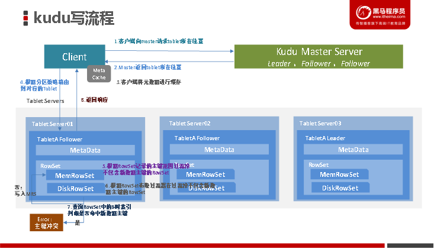

# 1- Kudu原理

- Kudu我们可以把它定位成**[分布式存储层]()**
- 能够提供**高吞吐**的写入和抽取同时可以做**增删改查**, 对比HDFS更方便了

- 还能提供简单的**随机查询**

- 如果做复杂的数据分析, Kudu可以作为存储层为**Impala或SparkSQL**等提供数据支撑.

 

- 目前我们接触到的一些框架:
  - 存储层面: HDFS文件系统\HBase 数据库\ Kudu存储层框架\Druid数据库
  - 计算层面: Spark Flink Druid Kylin Impala 
  - 工具层面： Impala Hive Phonix

 

## 1-1 表与schema

Kudu设计是**面向结构化存储**的，因此Kudu的表需要用户在建表时定义它的**Schema**信息，这些Schema信息包含：

- 列定义（含类型）

- Primary Key定义（用户指定的若干个列的有序组合）

- 数据的唯一性，依赖于用户所提供的**Primary Key**中的Column**组合**的值的唯一性。 

- Kudu提供了**Alter**命令来增删列，但位于Primary Key中的列是不允许删除的。 

- **Kudu当前并不支持二级索引。** 

 

- 大白话理解：

从用户角度来看，Kudu是一种存储**[结构化数据表的存储系统(存储层)]()**。

在一个Kudu集群中可以定义任意数量的**table**，每个table都需要预先定义好**schema**。每个table的列数是确定的，每一列都需要有名字和类型，每个表中可以把其中一列或多列定义为主键。这么看来，Kudu更像关系型数据库，而不是像HBase、Cassandra和MongoDB这些NoSQL数据库。

不过Kudu目前还不能像关系型数据一样支持二级索引。

Kudu使用确定的列类型，而不是类似于NoSQL的“**everything is byte**”（一切都是字节(HBase)）。

这可以带来两点好处： 

- 确定的**列类型**使Kudu可以进行**类型特有的编码**

- 可以提供 SQL-like 形式的元数据给其他上层查询工具使用，比如BI工具。

比如BI 连接Kudu, Kudu提供数据存储, BI做的计算和展示

 

## 1-2 kudu的底层数据模型

Kudu的底层数据文件的存储，未采用HDFS这样的较高抽象层次的分布式文件系统，而是自行开发了一套**可基于Table/Tablet/Replica视图级别的底层存储系统**

**[HBase: Table]() **

**Kudu: Table **

**[HBase: Region]() **

**Kudu: Tablet **

[**HBase: Replica(HDFS副本支持) **]()

**Kudu: Replica(自己实现) **

 

这套实现基于如下的几个设计目标：

- 可提供快速的**列式查询**(Kudu也是列式存储)

- 可支持快速的[**随机更新**]()(Kudu提供的基于二维表Schema完成数据更新)

- 可提供更为稳定的**查询性能保障**([高吞吐的能力, 抽取海量数据]())

- HDFS抽取是全量抽取, Kudu由于是列式存储, 可以抽取特定列, 以及由于是二维表结构, 还能做简单的过滤呢. 

 

- 一个Table会被分成若干个**tablet **，其中**Tablet **的数量是根据**hash **或者是**range **进行设置的

- 一个Tablet中包含**MetaData元数据信息 **和**多个RowSet信息 **，其中MetaData信息是block 和block在data中的位置。
- 一个RowSet包含**一个MemRowSet **和**多个DiskRowSet**，其中MemRowSet用于存储**insert数据和update后的数据 **，写满后会刷新到磁盘中也就是多个**DiskRowSet**中，**默认是1G刷新一次或者是2分钟 **。

- DiskRowSet用于老数据的**mutatio**（改变），比如说数据的更新操作，后台定期对DiskRowSet进行合并操作，删除历史数据和没有的数据，减少查询过程中的IO开销。

- 一个DiskRowSet包含:
  - **BloomFilter **: 快速判断[主键是否存在]()；
  - 1个**Ad_hoc Index **: 索引文件，[快速定位主键]()；
  - 多个**UndoFile **: 合并前的数据；
  - 多个**RedoFile **：合并后的数据；
  - 多个**BaseData**：基本数据；
  - 多个**DeltaMem** : 跟新的数据；

- [BloomFile]()：根据一个DiskRowSet中的key生成一个bloom filter，用于快速模糊定位某个key是否在**DiskRowSet **中存在。

- [Ad_hoc Index：]()是主键的索引，用于定位主键在DiskRowSet中的具体偏移位置。

- [BaseData]()：是MemRowSet flush下来的数据，按列存储，按**主键有序**。

- [UndoFile]()：是基于BaseData之前时间（上次flush之前）的**历史数据**，可以获得历史数据，类似mysql中的回滚日志。

- [RedoFile]()：是基于BaseData之后时间（上次flush之后）的**变更记录**，可以获得新的数据，类似mysql中的重做日志。

- [DeltaMem]()：在内存中存储**DiskRowSet中数据的更新**，写满后flush到磁盘，形成deltafile文件。

**注意： **

这里有两个在内存中处理的数据集，区别如下：

[MemRowSet]()：存储**新增 **的数据，对该内存数据集中还未flush的数据的更新；

[DeltaMem]()：对已flush到磁盘内的数据的**更新 **；

 

- MemRowSets可以对比理解成HBase中的**MemStore **, 而DiskRowSets可理解成HBase中的**HFile **。
- MemRowSets中的数据按照**行视图进行存储 **，数据结构为**B-Tree **。

- MemRowSets中的数据被Flush到磁盘之后，形成DiskRowSets。 

- DiskRowSets中的数据，按照**32MB大小为单位 **，按序**[划分]()**为一个个的DiskRowSet。 DiskRowSet中的数据按照Column进行组织，与Parquet类似。

这是Kudu可支持一些分析性查询的基础。每一个Column的数据被存储在一个相邻的数据区域，而这个数据区域进一步被细分成一个个的小的Page单元，与HBase File中的Block类似，对每一个ColumPage可采用一些Encoding算法，以及一些通用的Compression算法。 既然可对ColumPage可采用Encoding以及Compression算法，那么，对单条记录的更改就会比较困难了。

**前面提到了Kudu可支持单条记录级别的更新/删除，是如何做到的？ ** [**标记更新/删除**]()

与HBase类似，也是通过增加一条新的记录来描述这次更新/删除操作的。DiskRowSet是不可修改了，那么 KUDU 要如何应对数据的更新呢？在KUDU中，把DiskRowSet分为了两部分：

[base data]()： 负责存储基础数据

[delta stores]()：delta stores负责存储 base data 中的变更数据.

 

如上图所示，数据从 **MemRowSet ** 刷到磁盘后就形成了一份 **DiskRowSet **（只包含 base data），每份 DiskRowSet 在内存中都会有一个对应的 DeltaMemStore，负责记录此 DiskRowSet 后续的数据变更（更新、删除）。DeltaMemStore 内部维护一个 B-树索引，映射到每个 row_offset 对应的数据变更。DeltaMemStore 数据增长到一定程度后转化成二进制文件存储到磁盘，形成一个 DeltaFile，随着 base data 对应数据的不断变更，DeltaFile 逐渐增长。

## 1-3 Kudu的读写原理

### 1-3-1 工作模式

Kudu的工作模式如下图，有些在上面的内容中已经介绍了，这里简单标注一下：

 

- **每个kudu table按照hash或range分区为多个tablet**；

- **每个tablet中包含一个MemRowSet以及多个DiskRowSet；**

- **每个DiskRowSet包含BaseData以及DeltaStores；**

- **DeltaStores由多个DeltaFile和一个DeltaMemStore组成；**

- [insert请求的新增数据]()  和  [对MemRowSet中数据的update操作]()（新增的数据还没有来得及触发compaction操作再次进行更新操作的新数据 ） **会先进入到MemRowSet**；

- 当触发**flush**条件时将新增数据真正的**[持久化到磁盘的DiskRowSet]()**内；

- 对**老数据的update和delete操作**是提交到内存中的**[DeltaMemStore]()**；

- 当触发flush条件时会将更新和删除操作持久化到磁盘DiskRowSet中的DeltaFile内；
  - 此时**老数据**还在[BaseData内（逻辑/标记删除）]()；
  - **新数据**已在[DeltaFile]()内；

- 当触发**compaction 合并**条件时，将**[DeltaFile和BaseData进行合并]()**,此时老数据才真正的从磁盘内消失掉（物理删除），只留下更新后的数据记录；

### 1-3-2 **kudu的读流程**

- 客户端向Kudu Master请求**tablet所在位置**

- Kudu Master**返回tablet所在位置**

- 为了优化读取和写入，客户端将**元数据进行缓存**

- 根据主键范围过滤**目标tablet**，**请求Tablet Follower**

- 根据主键过滤scan范围，**定位DataRowSets**

- 加载BaseData，并与DeltaStores合并，**得到老数据的最新结果**

- 拼接第6步骤得到的老数据与MemRowSet数据 得到所需数据

- 将数据返回给客户端；

- 查询顺序：[MemRowSet(内存新增数据) -> DeltaMemStores（内存更新老数据）->BaseData]()

### 1-3-3 kudu的写流程 --写入MemRowSet

- 客户端向Kudu Master请求**tablet所在位置**；

- Kudu Master**返回tablet所在位置**；

- 为了优化读取和写入，客户端将**元数据进行缓存**；

- 根据**分区策略**，路由到对应Tablet，**请求Tablet Leader**；

- 根据RowSet 记录的主键范围过滤掉不包含**新增数据主键的RowSet**；

- 根据RowSet **布隆过滤器**再进行一次过滤，过滤掉不包含**新增数据主键的RowSet** （[主键是否存在]()）；

- 查询RowSet中的B树索引判断是否命中新数据主键，若命中则报错主键冲突，否则**新数据写入MemRowSet**；

- 返回响应给客户端；

### 1-3-4 kudu的更新流程 --修改至DeltaStores

- 更新删除流程与写入流程类似，区别就是最后判断是否存在主键时候的操作，若存在才能更新，不存在才能插入新数据。

- 客户端向Kudu Master**请求tablet所在位置**

- Kudu Master**返回tablet所在位置**

- 为了优化读取和写入，客户端将**元数据进行缓存**

- 根据[分区策略]()，路由到对应Tablet，**请求Tablet Leader**

- 根据RowSet记录的主键范围过滤掉不包含**修改的数据主键的RowSet**

- 根据RowSet **布隆过滤器**再进行一次过滤，过滤掉不包含**修改的数据主键的RowSet**

- 查询RowSet中的B树索引判断是否命中修改的数据主键，若命中则**修改至DeltaMemStores**，否则报错数据不存在

- 返回响应给客户端

- 后续会**定期做合并**

# 2- Kudu的优化

## 2-1 Kudu关键配置

| TabletServer 在开始拒绝所有传入的写入之前可以消耗的[最大内存量]()：memory_limit_hard_bytes=1073741824 |
| ------------------------------------------------------------ |
|                         |
| 分配给 Kudu Tablet Server [**块缓存的最大内存量**]()：block_cache_capacity_mb=512 |
|                         |

## 2-2 Kudu的使用限制

### 2-2-1主键

- 创建表后，**不能更改主键**。必须删除并重新创建表以选择新的主键；

- 创建表的时候，**主键必须放在最前边**；

- **主键不能通过 update 更新**，如果要修改主键就必须先删除行，然后重新插入。这种操作不是原子性的。（kudu的删除和插入操作无法事务）；
- **不支持自动生成主键**，可以**通过内置的 uuid 函数表示为主键值**；
- 联合主键由 kudu 编码后，大小**不能超过 16KB**；

### 2-2-2 Cells 

- 在编码或压缩之前，任何单个单元都[不得大于]() **64KB **。 

- 在 Kudu 完成内部复合键编码之后，组成复合键的单元格总共限制为 **16KB **。

- 如果插入不符合这些限制的行时会报错误并返回给客户端。

### 2-2-3 **字段**

- 默认情况下，Kudu 不允许创建超过 **300 列**的表。官方建议使用较少列的 Schema 设计以获得最佳性能。

- **不支持 CHAR、VARCHAR、DATE 和数组**等复杂类型。
- 现有列的类型和是否允许为空，一旦设置后，是不可修改的。

- Decima类型的精度不可修改。也不允许通过更改表来更改 Decima列的精度和小数位数

- 删除列不会立即回收空间。首先必须运行压缩。

### 2-2-4 表

- 表中的副本数**必须为奇数 **，**[最多为 7]()**

- 复制因子（在表创建时设置）不能更改

- 无法手动运行压缩，但是删除表将立即回收空间

### 2-2-5  其他限制

- **不支持二级索引。**
- **不支持多行事务。**

- **不支持外键。**
- 列名和表名之类的标识符仅限于有效的 UTF-8 字符串并且其最大长度为 256 个字符。

### 2-2-6  分区限制 

- 表必须根据一个主键 or 联合主键被预先切成 tablet，不支持自动切。表被创建后不支持修改分区字段，支持添加和删除 range 分区(意思分区表，分区字段需提前定义好，kudu 不会自动分)。

- 已经存在的表不支持自动重新分区，只能创建新表时指定。

- 丢失副本时，必须通过手动修复方式来恢复。

### 2-2-7  扩展建议和限制

- 建议 TabletServer 最多为 100 台。

- 建议 Master 最多 3 台。

- 建议每个 TabletServer 最大数据为 8T(压缩后)。

- 建议每台 TabletServer 的 tablet 数为 1000，最多 2000。

- 创建表的时候，建议在每个 Tablet Server 上，每个表的 Tablet 数最大为 60，也就是 3 节点的话，3 副本，创表分区最大 60，这样每个单 TabletServer 上该表的 Tablets 也就为 60。

- 建议每个 Tablet 最大为 50GB，超出后可能导致压缩和启动有问题。

- 建议单 Tablet 的大小<10GB。

### 2-2-8  守护进程

- 部署至少 4G 内存，理想情况下应超过 16GB。

- 预写日志（WAL）只能存储在一个磁盘上。

- 不能直接删除数据目录，必须使用重新格式化数据目录的方式来达到删除目的。

- TabletServer 不能修改 IP 和 PORT。

- Kudu 对 NTP 有严格要求，如果时间不同步时，Kudu 的 Master 和 TabletServer 会崩溃。

- Kudu 仅使用 NTP 进行了测试，不支持其他时间同步工具。

### 2-2-9  集群管理限制

- 不支持滚动重启。

- 建议 Kudu 集群中的最大点对点延迟为 20 毫秒。推荐的最小点对点带宽是 10GB。

- 如果要使用位置感知功能将平板服务器放置在不同的位置，官方建议先测量服务器之间的带宽和延迟，以确保它们符合上述指导原则。

- 首次启动群集时，必须同时启动所有 Master 服务。

### 2-2-10  复制和备份限制

- Kudu 当前不支持任何用于备份和还原的内置功能。鼓励用户根据需要使用 Spark 或 Impala之类的工具导出或导入表。

### 2-2-11  Impala集成限制

- 创建 Kudu 表时，建表语句中的主键字段必须在最前面。 

- Impala **无法更新主键列中的值**。

- Impala 无法使用以下命令创建 Kudu 表 **VARCHAR 或嵌套类型的列**。

- 名称包含大写字母或非 ASCII 字符的 Kudu 表在 Impala 中用作外部表时，必须分配一个**备用名称**。

- **[列名包含大写字母或非 ASCII 字符的 Kudu 表不能用作 Impala 中的外部表。可以在 Kudu 中重命名列以解决此问题。]()**
- !=和 like 谓词不会下推到 Kudu，而是由 Impala 扫描节点评估。相对于其他类型的谓语，这会导致降低性能。

- 使用 Impala 进行更新，插入和删除是非事务性的。如果查询在部分途中失败，则其部分效果不会回滚。

- 单个查询的最大并行度受限于 Table 中 Tablet 的数量。为了获得良好的分析性能，每位主机目标为 10 片或更多 tablets。

- Impala 的关键字(PARTITIONED、LOCATION、ROWFORMAT)不适用于在创建 Kudu 表时使用。

### 2-2-12  Spark集成限制

- 必须使用 JDK8，自 Kudu-1.5.0 起，Spark 2.2 是默认的依赖项版本。

- Kudu 表只能在 Spark SQL中注册为**临时表**。

- 无法使用 HiveContext 查询 Kudu 表。

