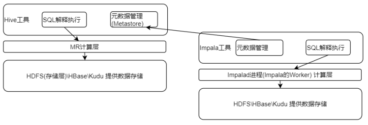
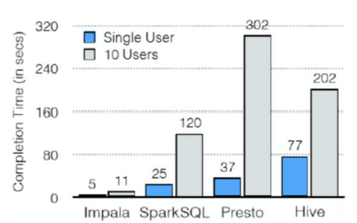
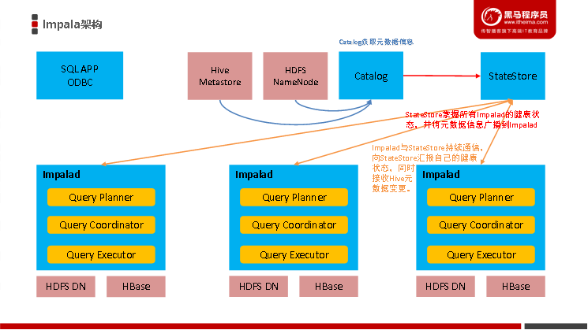
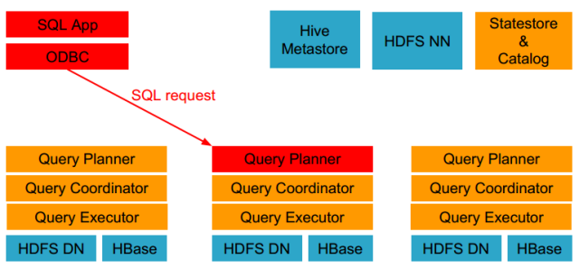
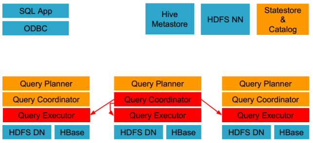
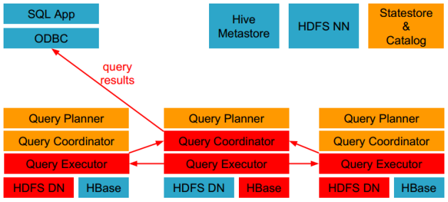

# 1- Impala 与 Hive对比

## 1-1 Hue + Hive 

- Hue + Hive 组成了**查询工具**
- Hue: UI页面, 用户入口
- Hive: **[单机]()**工具, 接受SQL **[执行MR]()**
- 用户在Hue上写SQL, 运行后, 由Hive翻译成MR 让YARN去跑MR任务
- 任务结束后,Hive将结果提供给Hue, Hue展示在页面上供用户看

 

## 1-2 Hue + Imapla

- Hue + Impala 组成**即席查询[架构]()**:
- Hue: UI页面, 用户入口
- Impala: **[分析工具(内存计算)]()**, 接受SQL作为分析条件然后在内存中计算数据(**[分布式计算]()**)
- 用户在Hue上写SQL, 运行后, 由**[Impala执行SQL]()**
- 任务结束后,Impala将结果提供给Hue, Hue展示在页面上供用户看

## 1-3 理解

- Hive : 数据由第三方提供, [**计算MR**]() 提供 自己就是一个**中间商**
- Impala: 数据由第三方提供, 计算[**由impala自己算**](), 自己就是计算工具；
- [**Impala 使用了Hive 的元数据**]() ；
- Impala 和 hive 都是sql类型的**计算工具**
- 都是对**结构化数据**进行操作

## 1-4 Impala与hive的异同

 

|                  | 数据存储        | 元数据管理              | 数据计算 | 部署形式                                         |
| ---------------- | --------------- | ----------------------- | -------- | ------------------------------------------------ |
| Hive             | HDFS\HBase\Kudu | 自己管理(Metastore服务) | YARN(MR) | 单机(HiveServer2 + Metastore2个服务进程)         |
| Impala           | HDFS\HBase\Kudu | 找Hive的Metastore提供   | 自己算   | 分布式部署,分布式Worker(Impalad进程)提供计算能力 |
| SparkSQL On Hive | HDFS\HBase\Kudu | 找Hive的Metastore提供   | 自己算   | YARN部署或StandAlone部署, 分布式的               |

# 2- Impala 与 SparkFlink对比

- SparkFlink称之为**计算引擎**, Impala称之为SQL**[分析工具]()**
- SparkFlink是**通用计算**, Impala是**SQL**[**专用计算**]()

 

Spark flink 是通用计算, 自己不存数据, 自己可以计算, 不仅能算sql, 还能算json 乃至视频音频等.

因为它们是通用计算引擎,这些引擎提供API让你自行开发 

 

Kudu的定位, Kudu是一个`存储层`, 能存,能够提供计算(第三方算它)

提供高吞吐和随机读写能力(第三方基于Kudu提供)

# 3- Impala的优缺点

## 3-1 优点

- 基于**内存运算**，不需要把中间结果写入磁盘，省掉了大量的I/O开销。
- 无需转换为Mapreduce，直接访问存储在HDFS，HBase中的数据进行作业调度，**[速度快]()**。
- 使用了支持 **Data locality（数据本地化）**的I/O调度机制，**[尽可能地将数据和计算分配在同一台机器上进行]()**，减少了网络开销。
- 支持各种文件格式，如TEXTFILE 、SEQUENCEFILE 、RCFile、Parquet。
- 可以**[访问hive的metastore]()**，使用Hive的Metastore来提供元数据管理功能。

 

## 3-2 缺点

- 对**内存的依赖大**，且完全**依赖于hive(Metastore)**。
- 实践中，分区超过1万，性能严重下降。
- 只能读取文本文件，而不能直接读取自定义二进制文件。
- 每当新的记录/文件被添加到HDFS中的数据目录时，该表需要被刷新。

# 4- Impala支持以下压缩编码：

- **[Snappy – 推荐的编码]()**，因为它在压缩率和解压速度之间有很好的**平衡性**，Snappy压缩速度很快，但是不如GZIP那样能节约更多的存储空间。Impala不支持Snappy压缩的text file
- GZIP – 压缩比很高能节约很多存储空间，Impala不支持GZIP压缩的text file
- Deflate – Impala不支持GZIP压缩的text file
- BZIP2 - Impala不支持BZIP2压缩的text file
- LZO – 只用于text file，Impala可以查询LZO压缩的text格式数据表，但是不支持insert数据，只能通过Hive来完成数据的insert

# 5- Impala的架构

## 5-1 架构图

## 5-1 架构解析-角色

- Impala**角色**主要由**Impalad**、 **State Store**、**Catalogd**和CLI组成。
- Impalad
  - ⻆⾊名称为Impala Daemon,是在每个节点上运⾏的进程，是Impala的核⼼组件，进程名是Impalad; （类似于**[worker]()**）
  - 负责读写数据⽂件，接收来⾃Impala-shell，JDBC,ODBC等的查询请求，与集群其它Impalad分布式并⾏完成查询任务，并将查询结果返回给中⼼协调者。 
  - 为了保证Impalad进程了解其它Impalad的健康状况，Impalad进程会⼀直与statestore保持通信。 
  - Impalad服务由三个模块组成：（**[去中心化]()**的管理架构）
    - **Query Planner**: **负责接收SQL查询请求,解析SQL并转换成执⾏计划**
    - **Query Coordinator: 查询协调，协调给其它节点去干活；**
    - **Query Executor: 执⾏具体任务。**	
- Impala State Store
  - 记录impalad节点的存活状态信息；
  - statestore**监控集群中Impalad的健康状况**，并将集群健康信息同步给Impalad。
  - statestore进程名为statestored。
- catalogd
  - **主要管理impalad的元数据信息**；
  - [Hive元数据更新时：更新操作通知Catalog，Catalog通过广播的方式通知其它的Impalad进程]()
  - Impala执⾏的SQL语句引发元数据发⽣变化时，catalog服务负责把这些元数据的变化同步给其它Impalad进程(⽇志验证,监控statestore进程⽇志) 
  - **catalogd会在Impala集群启动的时候加载hive元数据信息到Impala**，其他时候不会主动加载，需要使用invalidate metadata，refresh命令。 
  - catalog服务对应进程名称是**catalogd** 
  - 由于**[⼀个集群需要⼀个catalogd以及⼀个statestored进程]()**，⽽且**[catalogd进程所有请求都是经过statestored进程发送]()**，所以官⽅建议让statestored进程与catalogd进程安排**[同个节点]()**。
- CLI
  - 提供给用户查询使用的命令行工具（Impala Shell使用python实现），同时Impala还提供了Hue，JDBC， ODBC使用接口

# 6- Impapla如何执行查询

## 6-1 发送命令

- 客户端通过ODBC、JDBC、或者Impala shell向Impala集群中的任意节点发送SQL语句

## 6-2 解析、分析命令

- Impala解析和分析这个查询语句来决定集群中的哪个impalad实例来执行某个任务;
- 由**[Query Planner 生成执行计划]()**；

## 6-3 执行命令并返回结果

- 各个impalad向协调器impalad返回数据，然后由协调器impalad向client发送结果集;

# 7- Web界面

- 访问impalad的管理界面[http://node2.itcast.cn:25000/](http://node3:25000/)
- 访问statestored的管理界面[http://node2.itcast.cn:25010/](http://node3:25010/)
- 访问catalogd 的管理界面[http://node2.itcast.cn:25020/](http://node3:25020/)

# 8- 读时模式 写时模式

- 就是看[**schema**]()什么时候设计好；(什么时候有schema)

**写时模式**: 数据写入之前, 已经设计好Schema了. 比如MySQL, 先建表再写入

**读时模式**: 数据写入的时候 啥也不管就是存, 当用的时候 才赋予Schema。比如：即席查询；

比如: 先存数据到HDFS, 用的时候 Hive外部表给与Schema执行查询

 

**Hive的内部表是? 写时模式思想**

**Hive的外部表是? 读时模式思想**

