# 1- impala-shell命令参数

## 1-1 impala-shell外部命令 impala-shell -f/-i

- 所谓的外部命令指的是**不需要进入到impala-shell交互命令行**当中即可执行的命令参数；
- impala-shell –f

``` shell
impala-shell –f 文件路径 ##执行指定的sql查询文件。
```

- impala-shell -i 

``` shell
impala-shell –i 指定连接运行 #impalad 守护进程的主机。默认端口是 21000。你可以连接到集群中运行 impalad 的任意主机。
```

- impala-shell -o

``` shell
impala-shell –o  # 保存执行结果到文件当中去。
```

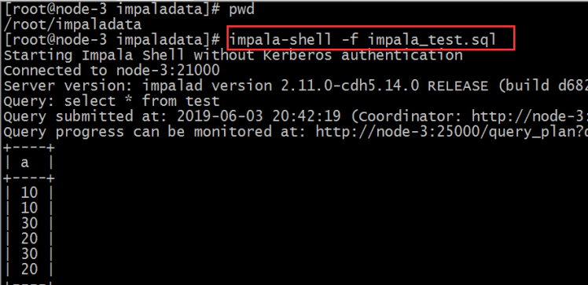


## 1-2 impala-shell内部命令

- 所谓内部命令是指，**进入impala-shell命令行**之后可以执行的语法。

### 1-2-1 help

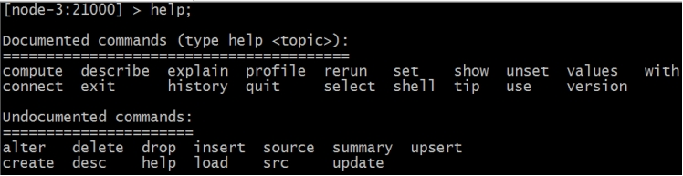 

### 1-2-2 connect hostname

- connect hostname **连接到指定的机器impalad上去执行**;

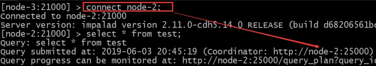 

### 1-2-3 刷新元数据 refresh 

- refresh dbname.tablename增量刷新。刷新某一张表的元数据，主要用于刷新hive当中数据表里面的数据改变的情况

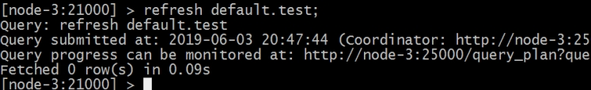 

### 1-2-4 全量刷新 invalidate metadata

- invalidate metadata全量刷新，**性能消耗较大**，主要用于hive当中[新建数据库或者数据库表的时候来进行刷新。]()

### 1-2-5 退出 quit / exit

- quit/exit命令 从Impala shell中弹出


### 1-2-6 查看执行计划 explain

- explain 命令 用于查看sql语句的执行计划。

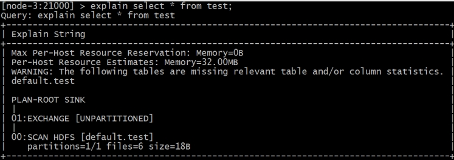 

explain的值可以设置成0,1,2,3等几个值，其中3级别是最高的，可以打印出最全的信息

**set** explain_level**=**3**;**

profile命令执行sql语句之后执行，可以打印出更加详细的执行步骤，主要用于查询结果的查看，集群的调优等。

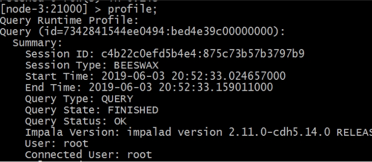 

### 1-2-7 注意：

- **注意**: 如果在[hive窗口中插入数据或者新建的数据库或者数据库表]()，那么在impala当中是[不可直接查询]()，需要执行**invalidate metadata**以通知元数据的更新；

- 在**impala-shell当中插入的数据**，在impala当中是[可以直接查询]()到的，不需要刷新数据库，其中使用的就是catalog这个服务的功能实现的，catalog是impala1.2版本之后增加的模块功能，主要作用就是同步impala之间的元数据。

- **[更新操作通知Catalog，Catalog通过广播的方式通知其它的Impalad进程]()**。默认情况下Catalog是异步加载元数据的，因此查询可能需要等待元数据加载完成之后才能进行（第一次加载）

# 2- impala sql 语法

## 2-1 数据库特定语言

### 2-1-1 创建数据库

- CREATE DATABASE语句用于在Impala中创建新数据库。

``` sql
CREATE DATABASE IF NOT EXISTS test;
## 这里，IF NOT EXISTS是一个可选的子句。如果我们使用此子句，则只有在没有具有相同名称的现有数据库时，才会创建具有给定名称的数据库。
```

- [**特别注意： 如果报错权限不足**]()

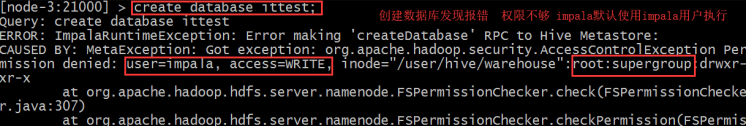

- 原因：impala默认使用impala用户执行操作，会报权限不足问题；

- [**解决办法**]()：**给HDFS指定文件夹授予权**
  1. hadoop fs **-**chmod -R 777 hdfs**://**node2.itcast.cn**:**9000**/**user**/**hive
  2. haoop 配置文件中hdfs-site.xml 中设置权限为false
  
  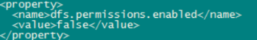

- 默认就会在hive的数仓路径下创建新的数据库名文件夹；

``` shell
/user/hive/warehouse/test.db
```

- 也可以在创建数据库的时候指定hdfs路径。需要注意该路径的权限。

``` shell
hadoop fs -mkdir -p /input/impala
hadoop fs -chmod -R 777 /input/impala 
```

``` sql
# 创建一个内部表
create  table  t3(
    id int ,
    name string ,
    age int )  
 row  format  delimited fields terminated  by  '\t' 
 location  '/input/impala/external';

# 插入数据
insert into t3 values (1,'tom',30);
```


### 2-1-2 删除数据库

- Impala的DROP DATABASE语句用于从Impala中删除数据库。 [在删除数据库之前，建议从中删除所有表]()。

```sql
drop database name;
```


- 如果使用级联删除，Impala会在删除指定数据库中的表之前删除它。

``` sql
DROP database name cascade;
```


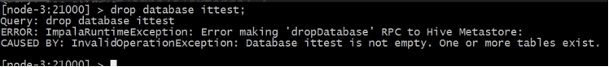 

 


## 2-2 表特定语句

### 2-2-1 创建表 

#### 2-2-1-1 普通创建表 create table 

- CREATE TABLE语句用于在Impala中的所需数据库中创建新表。 需要指定表名字并定义其列和每列的数据类型；

- impala支持的**数据类型**和hive类似，除了sql类型外，还**支持java类型**
- 语法：

``` sql
## 基本格式: 
create table IF NOT EXISTS database_name.table_name (
   column1 data_type,
   column2 data_type,
   column3 data_type,
   ………
   columnN data_type
);
```

- 案例：

``` sql
CREATE TABLE IF NOT EXISTS test.student(
    name STRING, 
    age INT, 
    contact INT)
row  format  delimited fields terminated  by  '\t' 
 location  '/input/impala/external';
```

- 注意：
  - 默认建表的数据存储路径跟hive一致。也可以在建表的时候通过[location指定具体路径]()，**需要注意hdfs权限问题**。

#### 2-2-1-2 根据老表创建新表

- 创建的时候新表会复制老表的内容

``` sql
create table user2 as select name,age from user;
```


### 2-2-2 插入数据insert

- Impala的INSERT语句有两个子句: **[into和overwrite]()**。
  - into用于插入新记录数据;
  - overwrite用于覆盖已有的记录;
- 语法：

``` sql
insert into table_name (column1, column2, column3,...columnN) values (value1, value2, value3,...valueN);
Insert into table_name values (value1, value2, value2);
```

- 案例：

``` sql
create table test.employee (
    Id INT, 
    name STRING, 
    age INT,
    address STRING, 
    salary BIGINT);
row format delimited fields terminated by '\t'
location  '/input/impala/external';
## insert into 
insert into employee VALUES (1, 'Ramesh', 32, 'Ahmedabad', 20000 );
insert into employee values (2, 'Khilan', 25, 'Delhi', 15000 );
Insert into employee values (3, 'kaushik', 23, 'Kota', 30000 );
Insert into employee values (4, 'Chaitali', 25, 'Mumbai', 35000 );
Insert into employee values (5, 'Hardik', 27, 'Bhopal', 40000 );
Insert into employee values (6, 'Komal', 22, 'MP', 32000 );

select * from employee;
+----+----------+-----+-----------+--------+
| id | name     | age | address   | salary |
+----+----------+-----+-----------+--------+
| 5  | Hardik   | 27  | Bhopal    | 40000  |
| 6  | Komal    | 22  | MP        | 32000  |
| 1  | Ramesh   | 32  | Ahmedabad | 20000  |
| 2  | Khilan   | 25  | Delhi     | 15000  |
| 4  | Chaitali | 25  | Mumbai    | 35000  |
| 3  | kaushik  | 23  | Kota      | 30000  |
+----+----------+-----+-----------+--------+
Fetched 6 row(s) in 0.24s

## overwrite覆盖子句覆盖表当中全部记录。 覆盖的记录将从表中永久删除。
Insert overwrite employee values (1, 'Ram', 26, 'Vishakhapatnam', 37000 );

select * from employee;
de978aef319f:de02675400000000
+----+------+-----+---------+--------+
| id | name | age | address | salary |
+----+------+-----+---------+--------+
| 1  | Tom  | 30  | wuhan   | 40000  |
+----+------+-----+---------+--------+
Fetched 1 row(s) in 0.11s
[node2.itcast.cn:21000] test> 
```


### 2-2-3 查询数据 select 

``` sql
select name , age,salary from employee;
+------+-----+--------+
| name | age | salary |
+------+-----+--------+
| Tom  | 30  | 40000  |
+------+-----+--------+
Fetched 1 row(s) in 0.11s
```


### 2-2-4 查看表描述describe

- impala中的describe语句用于提供表的描述。 此语句的结果包含有关表的信息，例如列名称及其数据类型。

- Describe table_name；
- 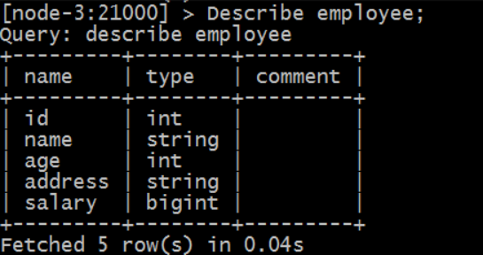
- desc  formatted  table_name;

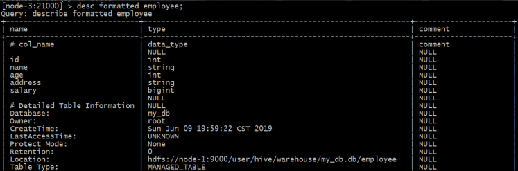


### 2-2-5 修改表alter table

#### 2-2-5-1 表重命名：

``` sql
ALTER TABLE [old_db_name.]old_table_name RENAME TO  [new_db_name.]new_table_name
```

``` sql
alter table test.employee rename to test.employee2
```

#### 2-2-5-2 向表中添加列

``` sql
ALTER TABLE name ADD COLUMNS (col_spec[, col_spec ...])
```


#### 2-2-5-3 从表中删除列

``` sql
ALTER TABLE name DROP [COLUMN] column_name
```


#### 2-2-5-4 更改列的名称和类型

``` sql
ALTER TABLE name CHANGE column_name new_name new_type
```

### 2-2-6 清空表 truncate table

``` sql
truncate table_name;
```


### 2-2-7 删除表 delete table

``` sql
DROP table database_name.table_name;
```

### 2-2-8 视图 view

- 创建视图

``` sql
Create View IF NOT EXISTS view_name as Select statement
```

``` sql
CREATE VIEW IF NOT EXISTS employee_view AS select name, age from employee;
```

- 修改视图

``` sql
Alter view employee_view as select id, name, age, address from employee;
```

- 删除视图

``` sql
DROP VIEW database_name.view_name;
```

### 2-2-9 排序order by 

``` sql
select * from table_name ORDER BY col_name [ASC|DESC] [NULLS FIRST|NULLS LAST]
```

- NULLS FIRST，表中的所有空值都排列在**顶行**; 
- NULLS LAST，包含空值的行将**最后排列**;


### 2-2-10 分组 groupby

``` sql
select data from table_name Group BY col_name;
```

### 2-2-11 having 

- Impala中的Having子句允许您指定过滤哪些组结果显示在最终结果中的条件。 
- 一般来说，[Having子句与group by子句一起使用](); 它将条件放置在由GROUP BY子句创建的组上。

### 2-2-12 l limit ,offset

``` sql
select * from employee order by id limit 3 offset 2;
```

- Impala中的limit子句用于将结果集的行数限制为所需的数，即查询的结果集不包含超过指定限制的记录。一般来说，select查询的resultset中的行从0开始;
- 使用offset子句，我们可以决定从哪里考虑输出。

### 2-2-13 with 字句

``` sql
with t1 as (select * from employee where age >25),
t2 as (select * from employee where age<24) 
select * from t1 union select * from t2;
+----+---------+-----+-----------+--------+
| id | name    | age | address   | salary |
+----+---------+-----+-----------+--------+
| 5  | Hardik  | 27  | Bhopal    | 40000  |
| 1  | Tom     | 30  | wuhan     | 40000  |
| 6  | Komal   | 22  | MP        | 32000  |
| 3  | kaushik | 23  | Kota      | 30000  |
| 1  | Ramesh  | 32  | Ahmedabad | 20000  |
+----+---------+-----+-----------+--------+
Fetched 5 row(s) in 0.34s
```

### 2-2-14 去重l distinct

``` sql
select distinct columns… from table_name;
select distinct age from employee;
```


# 3- impala数据导入方式

## 3-1 load data

- 数据准备

``` shell
# user.txt
1	hahaha	18
2	heihei	19

hadoop fs -mkdir -p /input/impala/data;
hadoop fs -put user.txt /input/impala/data;
```

- 创建表

``` sql
create table user(
    id int ,
    name string,
    age int ) 
row format delimited fields terminated by "\t";
```

- 加载数据

``` sql
load data inpath '/user/impala/user.txt' into table user;
```

- 刷新数据:如果查询不不到数据，那么需要刷新一遍数据表。

``` sql
refresh user;
```

## 3-2 插入数据 insert into values

``` sql
insert into user values (4,'Tom',21);
+----+--------+-----+
| id | name   | age |
+----+--------+-----+
| 3  | wowowo | 20  |
| 1  | hahaha | 18  |
| 2  | heihei | 19  |
| 4  | Tom    | 21  |
+----+--------+-----+
Fetched 4 row(s) in 0.11s
```

### 3-3 根据查询创建新表并加载数据

### 3-3-1 create table name as select xxxx

- 建表的字段个数、类型、**数据来自于后续的select查询语句**;

``` sql
create table user2 as select name,age from user;
```


### 3-3-2 insert into select

- 插入一张表的数据来自于后面的select查询语句返回的结果;

``` sql
insert into user3 select name,age from user;
```


# 4- impala的java开发

- 使用JDBC 大多数的数据库都是支持的. 而且语法和API上
- 是完全通用`java.sql`包里面的API的, 唯一的不同就是它们的驱动Jar包的实现不一样.

## 4-1 各个数据库的驱动与URL

- \- [**MySQL**: MySQL Connector Jar]()

``` properties
驱动：org.gjt.mm.mysql.Driver
URL：jdbc:mysql://<machine_name><:port>/dbname
注：machine_name：数据库所在的机器的位置（ip地址）；
port：端口号，默认3306
```


- \- [**Oracle**: Oracle自己的驱动jar]()

``` properties
驱动：oracle.jdbc.driver.OracleDriver
URL：jdbc:oracle:thin:@<machine_name><:port>:dbname
注：machine_name：数据库所在的机器的位置（ip地址）；
port：端口号，默认是1521
```


- \- **Hive**: 也有自己的Hive JDBC jar

``` properties
hivedriverClassName=org.apache.hive.jdbc.HiveDriver
hiveurl=jdbc:hive2://node1:10000/default
```


- \- **Impala**: 也一样, 有自己的Impala JDBC jar

``` properties
- com.cloudera.impala.jdbc41.Driver
- jdbc:impala://node2.itcast.cn:21050
```


- apache **Druid**

``` properties
- driver：org.apache.calcite.avatica.remote.Driver
- url: jdbc:avatica:remote:url=http://node01:8888/druid/v2/sql/avatica/ 
```


- clickHouse

``` properties
driver:  ru.yandex.clickhouse.ClickHouseDriver
url:  jdbc:clickhouse://node2.itcast.cn:8123/default
```


- 使用JDBC操作Impala, 就是标准的java.sql API, 把驱动包换成Impala的即可

## 4-2 maven

``` xml
<repositories>
        <repository>
            <id>cloudera</id>
            <url>https://repository.cloudera.com/artifactory/cloudera-repos/</url>
        </repository>
    </repositories>

    <dependencies>
        <dependency>
            <groupId>org.apache.kudu</groupId>
            <artifactId>kudu-client</artifactId>
            <version>1.6.0-cdh5.14.0</version>
        </dependency>

        <dependency>
            <groupId>junit</groupId>
            <artifactId>junit</artifactId>
            <version>4.12</version>
        </dependency>

        <dependency>
            <groupId>org.slf4j</groupId>
            <artifactId>slf4j-api</artifactId>
            <version>1.7.25</version>
        </dependency>

        <!--impala的jdbc操作-->
        <dependency>
            <groupId>com.cloudera</groupId>
            <artifactId>ImpalaJDBC41</artifactId>
            <version>2.6.3</version>
        </dependency>

        <!--Caused by : ClassNotFound : thrift.protocol.TPro-->
        <dependency>
            <groupId>org.apache.thrift</groupId>
            <artifactId>libfb303</artifactId>
            <version>0.9.3</version>
            <type>pom</type>
        </dependency>

        <!--Caused by : ClassNotFound : thrift.protocol.TPro-->
        <dependency>
            <groupId>org.apache.thrift</groupId>
            <artifactId>libthrift</artifactId>
            <version>0.9.3</version>
            <type>pom</type>
        </dependency>
    </dependencies>
```

## 4-3 代码

``` java
package cn.itcast;

import java.sql.*;

/**
 * 使用jdbc的方式操作impala
 */
public class ImpalaJdbcDemo {
    public static void main(String[] args) {
        Connection con = null;
        ResultSet rs = null;
        PreparedStatement ps = null;
        String JDBC_DRIVER = "com.cloudera.impala.jdbc41.Driver";
        String CONNECTION_URL = "jdbc:impala://node2.itcast.cn:21050";
        try
        {
            // 注册步骤
            Class.forName(JDBC_DRIVER);
            // 获取连接
            con = (Connection) DriverManager.getConnection(CONNECTION_URL);
            ps = con.prepareStatement("select * from t_person;");
            rs = ps.executeQuery();
            while (rs.next())
            {
                System.out.println(rs.getInt(1));
                System.out.println(rs.getString(2));
                System.out.println(rs.getInt(3));
                System.out.println(rs.getString(4));
            }
        } catch (Exception e) {
            e.printStackTrace();
        } finally {
            try {
                rs.close();
                ps.close();
                con.close();
            } catch (SQLException e) {
                e.printStackTrace();
            }
        }
    }
}
```


# 5- 使用impala操作kudu

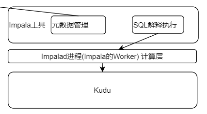


- Impala和Hive一样, [支持内部表和外部表]().

- 在Impala和Kudu集成的情况下:
  - Impala内部表: 数据存储在: HDFS(默认路径: /user/hive/warehouse), 也可以存储在Kudu
  - **内部表**表示Impala管理, **[删除内部表, 数据被删除]()**
  - Impala的**外部表**: 数据存储在 Kudu (或者HDFS 根据Location选项),**[删除外部表，数据不会被删除]()**

- Impala和Kudu的交互, 是基于Impala的外部表或者内部表作为数据存储交互。


## 5-1 创建kudu表

- 使用Impala创建新的Kudu表时，可以将该表创建为[内部表或外部表]()。

### 5-1-1 内部表

- 内部表由[Impala管理]()，当您从[Impala中删除表时，数据和表确实被删除]()。
- 当您使用Impala创建新表时，它通常是内部表。
- 在 CREATE TABLE 语句中，[**必须首先列出构成主键的列**]()。


创建表

``` sql
CREATE TABLE `my_first_table`
(
    id BIGINT,
    name STRING,
    PRIMARY KEY(id)
)
PARTITION BY HASH PARTITIONS 16
STORED AS KUDU
TBLPROPERTIES (
'kudu.num_tablet_replicas' = '1'
);
```

删除表

``` sql
drop table if exists my_first_table;
```


### 5-1-2 外部表

- 外部表（创建者**[CREATE EXTERNAL TABLE]()**）不受Impala管理;
- 并且删除此表不会将表从其源位置（此处为Kudu）丢弃。相反，它只会[去除Impala和Kudu之间的映射]()。这是Kudu提供的用于将现有表映射到Impala的语法。
- 使用java创建一个kudu表

``` java
import org.apache.kudu.ColumnSchema;
import org.apache.kudu.Schema;
import org.apache.kudu.Type;
import org.apache.kudu.client.CreateTableOptions;
import org.apache.kudu.client.KuduClient;
import org.apache.kudu.client.KuduException;

import java.util.LinkedList;
import java.util.List;

public class CreateTable {
    private static ColumnSchema newColumn(String name, Type type, boolean iskey) {
        ColumnSchema.ColumnSchemaBuilder column = new ColumnSchema.ColumnSchemaBuilder(name, type);
        column.key(iskey);
        return column.build();
    }
    public static void main(String[] args) throws KuduException {
        // master地址
        final String masteraddr = "node2.itcast.cn";
        // 创建kudu的数据库链接
        KuduClient client = new
                KuduClient.KuduClientBuilder(masteraddr).defaultSocketReadTimeoutMs(6000).build();

        // 设置表的schema
        List<ColumnSchema> columns = new LinkedList<ColumnSchema>();
        columns.add(newColumn("CompanyId", Type.INT32, true));
        columns.add(newColumn("WorkId", Type.INT32, false));
        columns.add(newColumn("Name", Type.STRING, false));
        columns.add(newColumn("Gender", Type.STRING, false));
        columns.add(newColumn("Photo", Type.STRING, false));
        Schema schema = new Schema(columns);
        //创建表时提供的所有选项
        CreateTableOptions options = new CreateTableOptions();
        // 设置表的replica备份和分区规则
        List<String> parcols = new LinkedList<String>();
        parcols.add("CompanyId");
        //设置表的备份数
        options.setNumReplicas(1);
        //设置range分区
        options.setRangePartitionColumns(parcols);

        //设置hash分区和数量
        options.addHashPartitions(parcols, 3);
        try {
            client.createTable("person", schema, options);
        } catch (KuduException e) {
            e.printStackTrace();
        }
        client.close();
    }
}
```

- 在kudu的页面上可以观察到如下信息

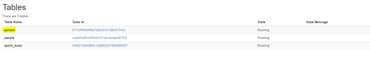

- 在impala的命令行查看表
  - 当前在impala中并没有person这个表


- 使用impala创建外部表，将kudu的表映射到impala上

``` sql
CREATE EXTERNAL TABLE `person` STORED AS KUDU
TBLPROPERTIES(
    'kudu.table_name' = 'person',
    'kudu.master_addresses' = 'node2.itcast.cn:7051')
```

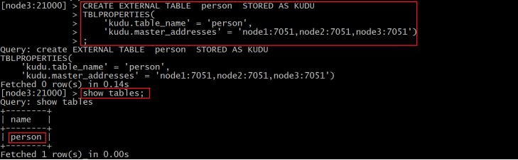

#### 5-1-2-1 项目中创建外部表映射kudu表

``` sql
CREATE DATABASE IF NOT EXISTS logistics;

CREATE EXTERNAL TABLE logistics.tbl_warehouse_transport_tool_detail
 STORED AS KUDU TBLPROPERTIES(
    'kudu.table_name' = 'tbl_warehouse_transport_tool_detail',
    'kudu.master_addresses' = 'node2.itcast.cn:7051');

CREATE EXTERNAL TABLE logistics.tbl_dot_transport_tool_detail STORED AS KUDU TBLPROPERTIES(
    'kudu.table_name' = 'tbl_dot_transport_tool_detail',
    'kudu.master_addresses' = 'node2.itcast.cn:7051');
    
    
CREATE EXTERNAL TABLE logistics.tbl_express_bill_detail STORED AS KUDU TBLPROPERTIES(
    'kudu.table_name' = 'tbl_express_bill_detail',
    'kudu.master_addresses' = 'node2.itcast.cn:7051');

CREATE EXTERNAL TABLE logistics.tbl_waybill STORED AS KUDU TBLPROPERTIES(
    'kudu.table_name' = 'tbl_waybill',
    'kudu.master_addresses' = 'node2.itcast.cn:7051');

CREATE EXTERNAL TABLE logistics.tbl_collect_package STORED AS KUDU TBLPROPERTIES(
    'kudu.table_name' = 'tbl_collect_package',
    'kudu.master_addresses' = 'node2.itcast.cn:7051');

CREATE EXTERNAL TABLE logistics.tbl_store_grid STORED AS KUDU TBLPROPERTIES(
    'kudu.table_name' = 'tbl_store_grid',
    'kudu.master_addresses' = 'node2.itcast.cn:7051');

CREATE EXTERNAL TABLE logistics.tbl_pkg STORED AS KUDU TBLPROPERTIES(
    'kudu.table_name' = 'tbl_pkg',
    'kudu.master_addresses' = 'node2.itcast.cn:7051');

CREATE EXTERNAL TABLE logistics.tbl_out_warehouse_detail STORED AS KUDU TBLPROPERTIES(
    'kudu.table_name' = 'tbl_out_warehouse_detail',
    'kudu.master_addresses' = 'node2.itcast.cn:7051');

CREATE EXTERNAL TABLE logistics.tbl_goods_rack STORED AS KUDU TBLPROPERTIES(
    'kudu.table_name' = 'tbl_goods_rack',
    'kudu.master_addresses' = 'node2.itcast.cn:7051');

CREATE EXTERNAL TABLE logistics.tbl_warehouse_receipt_detail STORED AS KUDU TBLPROPERTIES(
    'kudu.table_name' = 'tbl_warehouse_receipt_detail',
    'kudu.master_addresses' = 'node2.itcast.cn:7051');

CREATE EXTERNAL TABLE logistics.tbl_fixed_area STORED AS KUDU TBLPROPERTIES(
    'kudu.table_name' = 'tbl_fixed_area',
    'kudu.master_addresses' = 'node2.itcast.cn:7051');

CREATE EXTERNAL TABLE logistics.tbl_department STORED AS KUDU TBLPROPERTIES(
    'kudu.table_name' = 'tbl_department',
    'kudu.master_addresses' = 'node2.itcast.cn:7051');

CREATE EXTERNAL TABLE logistics.tbl_express_bill STORED AS KUDU TBLPROPERTIES(
    'kudu.table_name' = 'tbl_express_bill',
    'kudu.master_addresses' = 'node2.itcast.cn:7051');

CREATE EXTERNAL TABLE logistics.tbl_delivery_record STORED AS KUDU TBLPROPERTIES(
    'kudu.table_name' = 'tbl_delivery_record',
    'kudu.master_addresses' = 'node2.itcast.cn:7051');

CREATE EXTERNAL TABLE logistics.tbl_waybill_detail STORED AS KUDU TBLPROPERTIES(
    'kudu.table_name' = 'tbl_waybill_detail',
    'kudu.master_addresses' = 'node2.itcast.cn:7051');

CREATE EXTERNAL TABLE logistics.tbl_warehouse_emp STORED AS KUDU TBLPROPERTIES(
    'kudu.table_name' = 'tbl_warehouse_emp',
    'kudu.master_addresses' = 'node2.itcast.cn:7051');

CREATE EXTERNAL TABLE logistics.tbl_emp_info_map STORED AS KUDU TBLPROPERTIES(
    'kudu.table_name' = 'tbl_emp_info_map',
    'kudu.master_addresses' = 'node2.itcast.cn:7051');

CREATE EXTERNAL TABLE logistics.tbl_service_evaluation STORED AS KUDU TBLPROPERTIES(
    'kudu.table_name' = 'tbl_service_evaluation',
    'kudu.master_addresses' = 'node2.itcast.cn:7051');

CREATE EXTERNAL TABLE logistics.tbl_dot_transport_tool STORED AS KUDU TBLPROPERTIES(
    'kudu.table_name' = 'tbl_dot_transport_tool',
    'kudu.master_addresses' = 'node2.itcast.cn:7051');

CREATE EXTERNAL TABLE logistics.tbl_postal_standard STORED AS KUDU TBLPROPERTIES(
    'kudu.table_name' = 'tbl_postal_standard',
    'kudu.master_addresses' = 'node2.itcast.cn:7051');

CREATE EXTERNAL TABLE logistics.tbl_emp STORED AS KUDU TBLPROPERTIES(
    'kudu.table_name' = 'tbl_emp',
    'kudu.master_addresses' = 'node2.itcast.cn:7051');

CREATE EXTERNAL TABLE logistics.tbl_push_warehouse_detail STORED AS KUDU TBLPROPERTIES(
    'kudu.table_name' = 'tbl_push_warehouse_detail',
    'kudu.master_addresses' = 'node2.itcast.cn:7051');

CREATE EXTERNAL TABLE logistics.tbl_customer STORED AS KUDU TBLPROPERTIES(
    'kudu.table_name' = 'tbl_customer',
    'kudu.master_addresses' = 'node2.itcast.cn:7051');

CREATE EXTERNAL TABLE logistics.tbl_warehouse_transport_tool STORED AS KUDU TBLPROPERTIES(
    'kudu.table_name' = 'tbl_warehouse_transport_tool',
    'kudu.master_addresses' = 'node2.itcast.cn:7051');

CREATE EXTERNAL TABLE logistics.tbl_deliver_region STORED AS KUDU TBLPROPERTIES(
    'kudu.table_name' = 'tbl_deliver_region',
    'kudu.master_addresses' = 'node2.itcast.cn:7051');

CREATE EXTERNAL TABLE logistics.tbl_waybill_state_record STORED AS KUDU TBLPROPERTIES(
    'kudu.table_name' = 'tbl_waybill_state_record',
    'kudu.master_addresses' = 'node2.itcast.cn:7051');

CREATE EXTERNAL TABLE logistics.tbl_company_dot_map STORED AS KUDU TBLPROPERTIES(
    'kudu.table_name' = 'tbl_company_dot_map',
    'kudu.master_addresses' = 'node2.itcast.cn:7051');

CREATE EXTERNAL TABLE logistics.tbl_areas STORED AS KUDU TBLPROPERTIES(
    'kudu.table_name' = 'tbl_areas',
    'kudu.master_addresses' = 'node2.itcast.cn:7051');

CREATE EXTERNAL TABLE logistics.tbl_company_warehouse_map STORED AS KUDU TBLPROPERTIES(
    'kudu.table_name' = 'tbl_company_warehouse_map',
    'kudu.master_addresses' = 'node2.itcast.cn:7051');

CREATE EXTERNAL TABLE logistics.tbl_warehouse_send_vehicle STORED AS KUDU TBLPROPERTIES(
    'kudu.table_name' = 'tbl_warehouse_send_vehicle',
    'kudu.master_addresses' = 'node2.itcast.cn:7051');

CREATE EXTERNAL TABLE logistics.tbl_warehouse_vehicle_map STORED AS KUDU TBLPROPERTIES(
    'kudu.table_name' = 'tbl_warehouse_vehicle_map',
    'kudu.master_addresses' = 'node2.itcast.cn:7051');

CREATE EXTERNAL TABLE logistics.tbl_customer_detail STORED AS KUDU TBLPROPERTIES(
    'kudu.table_name' = 'tbl_customer_detail',
    'kudu.master_addresses' = 'node2.itcast.cn:7051');

CREATE EXTERNAL TABLE logistics.tbl_company STORED AS KUDU TBLPROPERTIES(
    'kudu.table_name' = 'tbl_company',
    'kudu.master_addresses' = 'node2.itcast.cn:7051');

CREATE EXTERNAL TABLE logistics.tbl_courier STORED AS KUDU TBLPROPERTIES(
    'kudu.table_name' = 'tbl_courier',
    'kudu.master_addresses' = 'node2.itcast.cn:7051');

CREATE EXTERNAL TABLE logistics.tbl_vehicle_monitor STORED AS KUDU TBLPROPERTIES(
    'kudu.table_name' = 'tbl_vehicle_monitor',
    'kudu.master_addresses' = 'node2.itcast.cn:7051');

CREATE EXTERNAL TABLE logistics.tbl_deliver_package STORED AS KUDU TBLPROPERTIES(
    'kudu.table_name' = 'tbl_deliver_package',
    'kudu.master_addresses' = 'node2.itcast.cn:7051');

CREATE EXTERNAL TABLE logistics.tbl_charge_standard STORED AS KUDU TBLPROPERTIES(
    'kudu.table_name' = 'tbl_charge_standard',
    'kudu.master_addresses' = 'node2.itcast.cn:7051');

CREATE EXTERNAL TABLE logistics.tbl_warehouse_rack_map STORED AS KUDU TBLPROPERTIES(
    'kudu.table_name' = 'tbl_warehouse_rack_map',
    'kudu.master_addresses' = 'node2.itcast.cn:7051');

CREATE EXTERNAL TABLE logistics.tbl_codes STORED AS KUDU TBLPROPERTIES(
    'kudu.table_name' = 'tbl_codes',
    'kudu.master_addresses' = 'node2.itcast.cn:7051');

CREATE EXTERNAL TABLE logistics.tbl_warehouse STORED AS KUDU TBLPROPERTIES(
    'kudu.table_name' = 'tbl_warehouse',
    'kudu.master_addresses' = 'node2.itcast.cn:7051');

CREATE EXTERNAL TABLE logistics.tbl_job STORED AS KUDU TBLPROPERTIES(
    'kudu.table_name' = 'tbl_job',
    'kudu.master_addresses' = 'node2.itcast.cn:7051');

CREATE EXTERNAL TABLE logistics.tbl_waybill_line STORED AS KUDU TBLPROPERTIES(
    'kudu.table_name' = 'tbl_waybill_line',
    'kudu.master_addresses' = 'node2.itcast.cn:7051');

CREATE EXTERNAL TABLE logistics.tbl_work_time STORED AS KUDU TBLPROPERTIES(
    'kudu.table_name' = 'tbl_work_time',
    'kudu.master_addresses' = 'node2.itcast.cn:7051');

CREATE EXTERNAL TABLE logistics.tbl_consumer_sender_info STORED AS KUDU TBLPROPERTIES(
    'kudu.table_name' = 'tbl_consumer_sender_info',
    'kudu.master_addresses' = 'node2.itcast.cn:7051');

CREATE EXTERNAL TABLE logistics.tbl_driver STORED AS KUDU TBLPROPERTIES(
    'kudu.table_name' = 'tbl_driver',
    'kudu.master_addresses' = 'node2.itcast.cn:7051');

CREATE EXTERNAL TABLE logistics.tbl_consumer_address_map STORED AS KUDU TBLPROPERTIES(
    'kudu.table_name' = 'tbl_consumer_address_map',
    'kudu.master_addresses' = 'node2.itcast.cn:7051');

CREATE EXTERNAL TABLE logistics.tbl_warehouse_receipt STORED AS KUDU TBLPROPERTIES(
    'kudu.table_name' = 'tbl_warehouse_receipt',
    'kudu.master_addresses' = 'node2.itcast.cn:7051');

CREATE EXTERNAL TABLE logistics.tbl_dot STORED AS KUDU TBLPROPERTIES(
    'kudu.table_name' = 'tbl_dot',
    'kudu.master_addresses' = 'node2.itcast.cn:7051');

CREATE EXTERNAL TABLE logistics.tbl_transport_tool STORED AS KUDU TBLPROPERTIES(
    'kudu.table_name' = 'tbl_transport_tool',
    'kudu.master_addresses' = 'node2.itcast.cn:7051');

CREATE EXTERNAL TABLE logistics.tbl_out_warehouse STORED AS KUDU TBLPROPERTIES(
    'kudu.table_name' = 'tbl_out_warehouse',
    'kudu.master_addresses' = 'node2.itcast.cn:7051');
    
    
CREATE EXTERNAL TABLE logistics.tbl_address STORED AS KUDU TBLPROPERTIES(
    'kudu.table_name' = 'tbl_address',
    'kudu.master_addresses' = 'node2.itcast.cn:7051');  
    

CREATE EXTERNAL TABLE logistics.tbl_route STORED AS KUDU TBLPROPERTIES(
    'kudu.table_name' = 'tbl_route',
    'kudu.master_addresses' = 'node2.itcast.cn:7051');

CREATE EXTERNAL TABLE logistics.tbl_push_warehouse STORED AS KUDU TBLPROPERTIES(
    'kudu.table_name' = 'tbl_push_warehouse',
    'kudu.master_addresses' = 'node2.itcast.cn:7051');

CREATE EXTERNAL TABLE logistics.tbl_company_transport_route_ma STORED AS KUDU TBLPROPERTIES(
    'kudu.table_name' = 'tbl_company_transport_route_ma',
    'kudu.master_addresses' = 'node2.itcast.cn:7051');

CREATE EXTERNAL TABLE logistics.tbl_express_package STORED AS KUDU TBLPROPERTIES(
    'kudu.table_name' = 'tbl_express_package',
    'kudu.master_addresses' = 'node2.itcast.cn:7051');
   
CREATE EXTERNAL TABLE `tbl_warehouse_detail` STORED AS KUDU TBLPROPERTIES(
    'kudu.table_name' = 'tbl_warehouse_detail',
    'kudu.master_addresses' = 'node2.itcast.cn:7051');

```


## 5-2 使用impala对kudu进行DML操作

### 5-2-1  将数据插入 Kudu 表

- impala 允许使用标准 SQL 语句将数据插入 Kudu 。

#### 5-2-1-1 插入单个值

- 创建表

``` sql
CREATE TABLE `my_first_table`
(
    id BIGINT,
    name STRING,
    PRIMARY KEY(id)
)
PARTITION BY HASH PARTITIONS 16
STORED AS KUDU
TBLPROPERTIES (
'kudu.num_tablet_replicas' = '1'
);
```

- 此示例插入单个行

``` sql
INSERT INTO my_first_table VALUES (50, "zhangsan");
```

- 查看数据

``` sql
select * from my_first_table
```

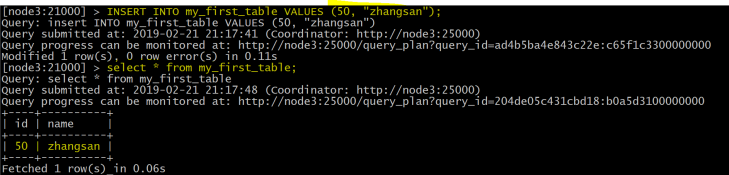

- 使用单个语句插入三行

``` sql
INSERT INTO my_first_table VALUES (1, "john"), (2, "jane"), (3, "jim");
```

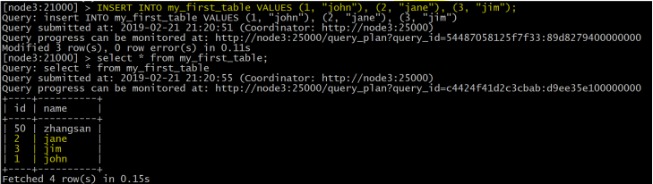


#### 5-2-1-2 批量插入Batch Insert

- 从 Impala 和 Kudu 的角度来看，通常表现最好的方法通常是使用 Impala 中的 SELECT FROM 语句导入数据

``` sql
INSERT INTO my_first_table SELECT * FROM temp1;
```


### 5-2-2 更新数据

``` sql
UPDATE my_first_table SET name="xiaowang" where id =1 ;
```

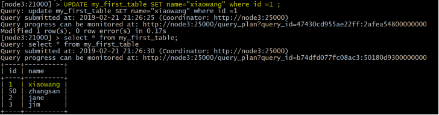

### 5-2-3 删除数据

``` sql
Delete from my_first_table where id =2;
```

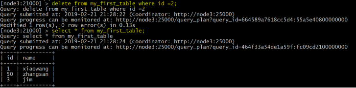


## 5-3 更改表属性

### 5-3-1重命名 Impala 映射表

- <span style="color:red;font-size:18px;font-family:黑体;">重命名impala表的时候，只会修改impala表的名字，不会修改kudu表名的名字，如果想修改kudu表名的话，需要使用impala3.3及以上版本</span>

``` sql
ALTER TABLE PERSON RENAME TO person_temp;
```

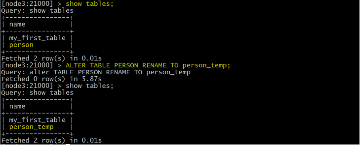

### 5-3-2 重新命名内部表的基础 Kudu 表

- 注意：[kudu.table_name属性的设置与版本有关]()
  - 在impala3.2版本中是无法修改底层的kudu表的名字的，从impala3.3开始可以修改
  - 在Impala 2.11及更低版本中，可以通过更改kudu.table_name属性来重命名基础Kudu表
  - 结论：**[在impala2.11及impala3.2之间的版本是无法修改kudu.table_name属性的]()**

- 创建内部表

``` sql
CREATE TABLE kudu_student
(
    CompanyId INT,
    WorkId INT,
    Name STRING,
    Gender STRING,
    Photo STRING,
    PRIMARY KEY(CompanyId)
    )
    PARTITION BY HASH PARTITIONS 16
    STORED AS KUDU
    TBLPROPERTIES (
    'kudu.num_tablet_replicas' = '1'
);
```

- 如果表是内部表，则可以通过更改 [kudu.table_name 属性重命名底层的 Kudu 表名;]()

``` sql
ALTER TABLE kudu_student SET TBLPROPERTIES('kudu.table_name' = 'new_student');
```

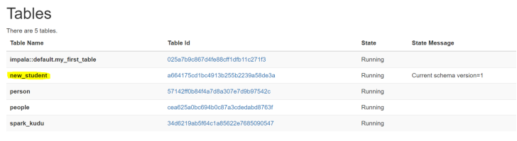


### 5-3-3 将外部表重新映射到不同的 Kudu 表

- 如果用户在使用过程中发现其他应用程序重[新命名了kudu表]()，那么此时的[外部表需要重新映射到kudu]()上；

- 创建一个外部表

``` sql
CREATE EXTERNAL TABLE external_table
    STORED AS KUDU
    TBLPROPERTIES (
    'kudu.master_addresses' = 'node2.itcast.cn:7051',
    'kudu.table_name' = 'person'
);
```

- 重新映射外部表，指向不同的kudu表

``` sql
ALTER TABLE external_table
SET TBLPROPERTIES('kudu.table_name' = 'hashTable')
```


### 5-3-4 更改 Kudu Master 地址

``` sql
ALTER TABLE my_table
SET TBLPROPERTIES('kudu.master_addresses' = 'kudu-new-master.example.com:7051');
```


### 5-3-5 将内部管理的表更改为外部

- 将内部表更改成外部表以后，删除外部表，不会影响底层的kudu表，反之如果是内部表的话，删除内部表，则底层的kudu表也会同步删除

``` sql
ALTER TABLE my_table SET TBLPROPERTIES('EXTERNAL' = 'TRUE');
```


## 5-4 补充:读时模式 写时模式

- **写时模式**: 数据**写入之前**, 已经设计好Schema了. 比如MySQL, 先建表再写入
- **读时模式**: 数据**写入的时候** 啥也不管就是存, 当用的时候 才赋予Schema
  - 比如: 先存数据到HDFS, 用的时候 Hive外部表给与Schema执行查询
- Hive的**内部**表是? 写时模式思想
- Hive的**外部**表是? 读时模式思想

 

\# 指标开发:是: 写时模式思想

\# 写时模式思想: 一切都准备好了再执行( 先有Schema后有数据)

\# 即席查询: 是: 读时模式思想, 数据就在这, 你想查啥就查啥.

 

\# 1写时模式VS2读时模式: 开发效率: 读时模式是远高于写时模式

 

\# 指标开发作为写时模式, 生产固定指标

\# 读时模式作为即席查询, 临时计算指标, 如果觉得有用, 将其转换成写时模式 进入固定开发