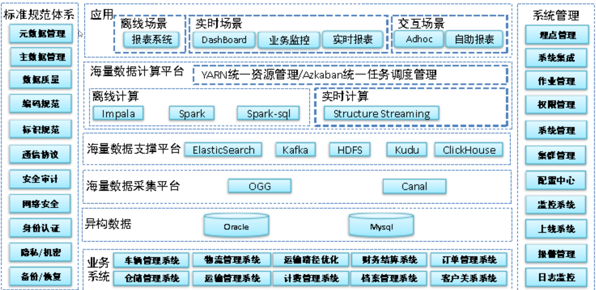
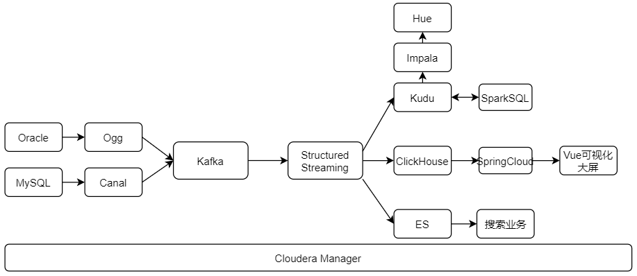

[TOC]

# 智慧数据物流平台项目总结

- 如何年薪百万回答业务问题-怎么讲项目，需要准备哪些？
  	1-我最近做的XXX项目是基于XXX集团旗下XXX业务为了完成XXXX任务实现大数据平台
  	2-使用了什么技术，达到了什么业务目标，实现了什么指标
  	3-整个项目数据量多大，集群规模多大，目前项目效果如何
  	4-接下来跟您讲一讲整个项目架构
  	5-给您说一下我在项目中负责的点是什么，讲解一个具体的指标，让您更加了解我们的项目
  	6-整个项目中遇到的哪些难题，如何应对的策略

## 1- 逻辑架构图

CDH6.2.1 + Oracle12.2 +Ogg + Mysql5.7 + canal + Kafka 2.1.0 + Hive2.1.1 + Spark2.4.5 + Kudu1.9.0 + ClickHouse0.2.2 + ES7.6.1 + Oozie 4.1.0 + Hue3.9.0 + Zookeeper 3.4.5 + Scala 2.11

## 2- 数据流程图

## 3- 项目描述

### 3-1 大概描述

​		我们这个项目叫**智慧物流平台**简称**智流平台**，不仅适用于国内的一些物流公司， 其实在国外一些物流公司也是使用相同的技术架构，只不过针对的不同的物流公司有一些特性需求而已；我们组主要负责的是国内综合性快递、物流服务商；物流公司在全国各地都有覆盖网点，经过多年的积累、经营以及布局，拥有大规模的客户群，日订单高达上千万。

### 3-2 为什么有这个项目以及需求

​		为什么会有这个项目呢？ 根据市场部的前期调研，大多数物流公司的业务主要是围绕 订单、运输，仓储、搬运装卸、包装等一系列的物流环节；而这些业务的数据管理基本都是使用的oracle 或者 mysql数据库去存储的数据；为了提高运输效率、减少物流成本、更高效满足客户服务需求，实现快速、高效、经济的物流。需要对一系列的数据根据不同的指标做出决策性分析。而传统的数据库会面临着数据存储和计算的瓶颈，原始的业务体系架构就无法满足对数据进行实时分析的需求；所以我们公司基于大数据平台来解决他们的一些需求。

​		智流平台主要完成三大需要：

​		1- 提供即席查询平台：对于物流公司的数据分析师来说，需要一个交互式查询的一个平台；

​		2- 实时展示可视化大屏展示：对于监控部门来说， 需要实时看到各种指标的展示、或者走向趋势图；

​		3- 用户实时查询订单状态：对于用户来说，需要根据订单号随时查询快递的状态；

### 3-3 项目流程图

为了实现这三大需求，我来介绍一下我们整个系统体系架构；

#### 3-3-1 数据采集：

​		主要采集业务系统中的数据，比如： **客户关系系统、订单管理系统、车辆管理系统、物流管理系统、仓储管理系统、运算管理系统、计费/财务等等一些列的系统**；但是对于我们智流平台来说数据源只有两个oracle 和 mysql 。

对于oracle 数据库我们使用的**ogg 去实时采集oracle的系统日志信息**将消息实时同步到我们kafka数据中心；

对于mysql数据库，我们使用的**canal去实时采集mysql的binlog日志信息**并将消息实时同步到我们的kafka数据中心；

#### 3-3-2 实时数仓ETL部分：

基于**structured streaming 技术** 去消费kafka中的数据，并对实时数据进行过滤、清洗、转化成样例类等操作；然后将干净的数据分别Sink到kudu 数据库、ClickHouse数据库、以及Elasticsearch 中。

这三个数据库对应的就是上面所说的三大需求：

需求一：即席查询平台，我们使用的kudu 作为数据存储，来做离线指标分析； 

需求二：实时监控指标大屏展示，我们使用的ClickHouse作为数据存储，来做实时业务指标处理；

需求三：全文检索，我们就使用的ES 作为数据存储，提供给用户随时查询订单状态；

#### 3-3-3 离线指标分析部分

离线指标分析就涉及到数仓分层，比如：ODS-> DWD-> DWS。在ETL 部分将数据Sink到kudu 的ODS层；然后**基于SparkSQL**将数据 去抽取ODS层的数据，将所有的维度表都去掉,拉宽事实表，并将拉宽后的数据重新Sink到kudu中 作为DWD层的数据，再通过对DWD层的数据进行预聚合、统计等操作最终生成DWS层的数据并Sink到kudu中；

然后我们的即席查询平台使用的是**Hue + impala数据分析工具 + kudu数据存储工具**；选择impala的原因主要有三点：1- 跟kudu天生紧密配合使用，属于同一个公司开发的产品；2- impala计算是基于内存计算的，速度快；3- 使用了Hive的元数据；

离线部分有运单主题、快递单主题、仓库主题、客户主题等等，一共大概有50多个主题以及好几百个指标。

比如：

​	快递单数（各类客户、各个渠道、各个网点、各种终端......）；

​	运单数（各个区域、各个分公司、各个网点、各种运输工具......) ;

即席查询 一些标签开发比如：

​	用户最后一次发送地址、常永的收/发货地址、常用的终端设备类型等等。

#### 3-3-4 实时监控部分

实时监控指标部分，对于监控部门来说，需要实时看到各个指标的统计数据，以及数据的走势图；

**基于ClickHouse 数据库**，其实这里我们对比过Apache Druid ，但是ApacheDruid 一般需要摄取kafka中的数据，并且Druid不支持复杂的SQL 查询；而CK查询的速度是真的快，也支持复杂的SQL 查询。最终我们选择了当下网红框架CK; 

实时部分指标比如：总网点数、各省份网点数、各个地区的收件总量分布、各个地区的快递员总量分布、各个地区的各种车辆分布等等；差不多又一百多个实时大小指标展示；

#### 3-3-5 全文检索部分

全文检索部分，我们是需要**ETL清洗后的数据Sink到ES中**，主要提供给用户**随时查询订单的状态**。比如订单数据、运单数据、客户数据等等都需要Sink到ES 中；

### 3-4 个人项目中负责的任务

- 项目初期参加架构设计和讨论；
- 基于StructuredStreaming开发实时ETL部分, 完成消费Kafka数据通过过滤清洗后将数据Sink到Kudu\ClickHouse\ES中；
- 基于SparkSQL完成离线数仓指标开发： 快递单主题、仓库主题、运单主题、客户主题、车辆主题。
  - 快递单主题
    - 最大快递单、最小快递单、平均快递单（各类客户、各个渠道、各个网点、各个终端）
    - 快递单总数、快递单走势图;
  - 仓库主题
    - 最多发车次数、最少发车次数、平均发车次数(各个仓库，各个网点，各个地区，各个公司，各个类型的包裹)
    - 各种走势图；
  - 运单主题
    - 运单总量、最大运单量、最小运单量、平均运单量(各个区域、各个公司、各个网点、各个路径、各个运输工具、各类客户)
  - 客户主题
    - 总客户数、今日新增客户数、留存数、留存率（超过180天未下单表示已经流失）、沉睡用户(3-6个月没有下单用户)、流失用户数/率(180天未下单)、活跃用户数、活跃用户率，用户单数topN ,用户平均单价；
- ClickHouse实时指标开发 ： 主要时Spark不支持ClickHouse 需要通过dataSourceV2接口自定义Sink将数据输出到ClickHouse中；
- 和Java后端同事联调、对接;

### 3-5 开发周期 人员

一期项目

周期: 半年左右

人员: 15人左右( 4-5的大数据  2 - 3的后台 2个运维 2个前端 2个测试)

### 3-6 服务器配置:

128G 内存  ；  10 * 1.2T

一共15台左右；

## 4- 项目中的难点以及解决策略

1- 第一次拿到需求时大家一致误认为这是个纯离线数仓项目； 直接将mysql 和 oracle 中的数据导出来做离线数据分析就完事了；后来才将需求对接清楚，需要实时的采集业务数据；也就是后来我们引入了ogg 和 canal这两个技术；

2- Spark官方没有整合ClickHouse数据库，需要我们自定义Sink 接口 DataSourceV2 将清洗后的数据Sink到CK中；

4- 其实还有一些可优化的地方；

- **节省资源**：使用impalaSQL替代SparkSQL，因为即席查询平台已经必须要使用impala了，在做离线数仓分析时可以直接使用impalaSQL;

- **解耦**：我们现在是面向一个主题创建的一个APP。但是这样并不解耦， 如果某个表有问题， 所有表的数据都无法正常同步到3大数据库中，最好就是一个表创建一个APP单独的同步数据；

- CK 有个新特性可以使用alter table 去直接修改或删除数据，但是这样有个缺点：每更新一条数据， 就会去更新一次数据库中的数据，这样效率是非常低的。可以是用CK 中的表引擎 **VersionedCollapsingMergeTree 去批量的更新数据**；有新增字段 sign =1 / -1   version ;

- CK最大的优点是海量源数据查询，但是输出越少越好，并且**CK 单表查询的速度是贼快**的。我们可以在ETL中将各个主题所涉及到的表拉宽之后将**拉宽表Sink到CK中**。 这样肯定会大大提高CK实时监控显示的效率；

- **体现kafka数据中心的特点**：在开发离线数仓的操作中, 将数据拉宽后直接写入了Kudu. 可以优化一下, 将拉宽后的数据反向写回Kafka这样, 这一份拉宽数据就可以给更多的地方去使用.同时, 不仅仅是拉宽, 所有的数据计算的结果都可以反向写回Kafka；Kafka中构建出数据集市, 在架构上更加方便.

  

## 5- 项目可优化点

1. 离线数仓的固定指标开发, 可以将计算层`替换为ImpalaSQL`

   因为**已经搭建了Impala的即席查询环境**, 那么Impala势必要吃一定的计算资源.

   既然已分配计算资源, 那么就**没必要再单独搞Spark做计算**了. 

   都是内存计算, 做SQL计算性能不会差太多, 但是搞SparkSQL要求提供更多的硬件资源

   对于成本来说不友好.

2. 后期可以考虑使`用CK来完成固定指标的数仓构建`, 借由CK强大的查询能力, 极大的加速数仓指标计算速度.

   甚至借由CK, 可以将整个数仓由传统T+1的离线指标, 升级到纯实时数仓.

3. SparkSQL的计算代码, 需要将单个表的计算抽取出来, 进行单独的调度, 而不是一个App完成一个层的全部表的计算.

4. 对CK的修改操作, 项目中使用的是`ALTER TABLE`的单条执行模式, 由于使用的是`VersionedCollapsingMergeTree` 可以借助Sign来完成对数据的删除或更新.

   Canal和Ogg对Update和Delete都提供老数据内容, 那么完全足够我们组装老数据Sign为`-1`的INSERT语句

   `VersionedCollapsingMergeTree`借由合并操作完成**批量更新删除**, 在海量数据操作下, 效率更高.

5. CK的`单表查询效率是最高`的(分组聚合等), 支持JOIN,但是 JOIN的性能和其单表性能比较而言 相对较弱.

   所以, 最适合CK的是`大宽表`(省JOIN)

   项目中写入CK的仅仅是`ODS`级别的原始数据, 后期可以考虑再Spark中完成数据拉宽后, 再写入CK中, 这样性能更好适用面更好.

6. 在开发离线数仓的操作中, 将数据拉宽后直接写入了Kudu. 可以优化一下, 将拉宽后的数据反向写回Kafka

   这样, 这一份拉宽数据就可以给更多的地方去使用.

   同时, 不仅仅是拉宽, 所有的数据计算的结果都可以反向写回Kafka

   在Kafka中构建出数据集市, 在架构上更加方便.

   

   

