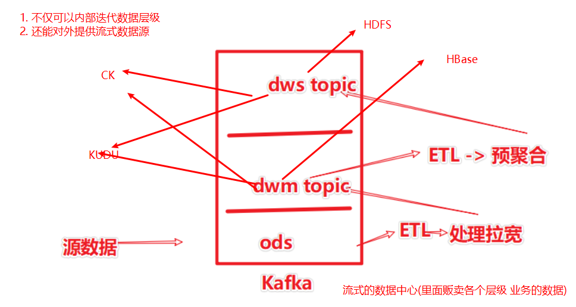
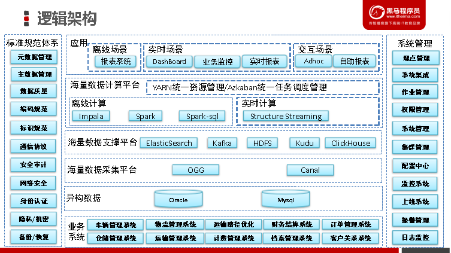
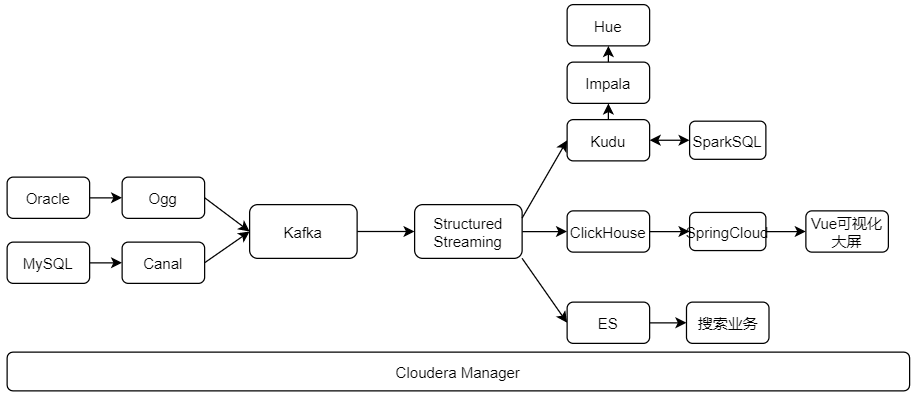
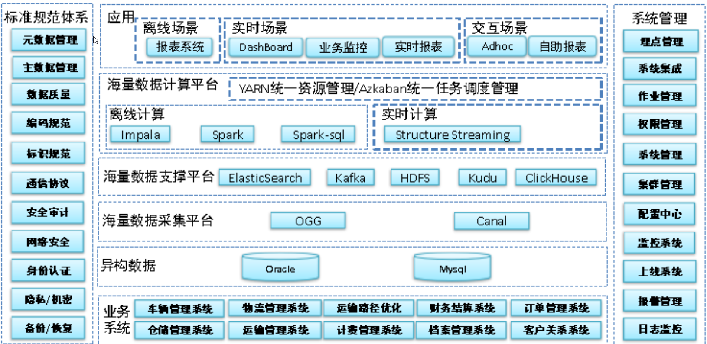

# 项目亮点

1, 基于Spark StructuredStreaming 的`流ETL`程序开发. 在Spark中完成 数据处理\清洗\格式转换等`无状态流计算`操作

​	Spark分布式内存迭代计算, 高性能

​	Spark丰富的算子提供了复杂ETL业务实现的可能

​	Spark 提供了精确一致性语义保障, 确保数据处理的稳定性

​	Flink同样可以

​	SparkStreaming也可以(不推荐, 容错等方面弱)

​	Flume也可以(但是 不推荐, 单机程序 性能稳定不足)

	> Flume是单机程序, 虽然可以开很多个进程, 但是进程之间是无状态的(没有啥关系)

2, 基于Spark StructuredStreaming 的`自定义数据源`开发, 完成自定义数据源, 将数据写入到ClickHouse中, 数据源支持

 - 增

 - 删

 - 改

   可以实时的完成对CK数据的`同步`操作.

为什么选择Spark和第一条一样, 更重点的是, Spark的精确一致性保障.

3, 基于Canal和Ogg 完成对Oracle和MySQL业务数据的`实时`同步. 并通过Spark 将数据实时同步到下游 Kudu 和 ClickHouse 以及 Es中

​	摒弃了传统的SQL查询的同步方式, 延迟高, 对数据库性能有影响

​	Canal和Ogg的方式, `高效\ 延迟低\ 对数据库无影响`, 可以将采集变成流式作业

4, Kudu Impala Hue整合 构建即席查询环境(`动态	`指标查询)

​	Kudu`存储层`, 提供列式, 结构化数据存储能力, 并有高吞吐\ 低延迟\ 支持随机检索的特点

​	Impala`计算层`, 分布式, 内存计算, 通用SQL计算框架

​	Hue 即席查询UI层

5, 基于SparkSQL完成数仓指标分析开发(`静态`指标查询).

6, 基于ClickHouse完成`实时查询环境`构建.

​	CK 就是快, 因为快, 我们将许多数据灌入CK 来提供实时查询环境

# 项目优化点

1. 离线数仓的固定指标开发, 可以将计算层`替换为ImpalaSQL`

   因为**已经搭建了Impala的即席查询环境**, 那么Impala势必要吃一定的计算资源.

   既然已分配计算资源, 那么就**没必要再单独搞Spark做计算**了. 

   都是内存计算, 做SQL计算性能不会差太多, 但是搞SparkSQL要求提供更多的硬件资源

   对于成本来说不友好.

2. 后期可以考虑使`用CK来完成固定指标的数仓构建`, 借由CK强大的查询能力, 极大的加速数仓指标计算速度.

   甚至借由CK, 可以将整个数仓由传统T+1的离线指标, 升级到纯实时数仓.

3. SparkSQL的计算代码, 需要将单个表的计算抽取出来, 进行单独的调度, 而不是一个App完成一个层的全部表的计算.

4. 对CK的修改操作, 项目中使用的是`ALTER TABLE`的单条执行模式, 由于使用的是`VersionedCollapsingMergeTree` 可以借助Sign来完成对数据的删除或更新.

   Canal和Ogg对Update和Delete都提供老数据内容, 那么完全足够我们组装老数据Sign为`-1`的INSERT语句

   `VersionedCollapsingMergeTree`借由合并操作完成**批量更新删除**, 在海量数据操作下, 效率更高.

5. CK的`单表查询效率是最高`的(分组聚合等), 支持JOIN,但是 JOIN的性能和其单表性能比较而言 相对较弱.

   所以, 最适合CK的是`大宽表`(省JOIN)

   项目中写入CK的仅仅是`ODS`级别的原始数据, 后期可以考虑再Spark中完成数据拉宽后, 再写入CK中, 这样性能更好适用面更好.

6. 在开发离线数仓的操作中, 将数据拉宽后直接写入了Kudu. 可以优化一下, 将拉宽后的数据反向写回Kafka

   这样, 这一份拉宽数据就可以给更多的地方去使用.

   同时, 不仅仅是拉宽, 所有的数据计算的结果都可以反向写回Kafka

   在Kafka中构建出数据集市, 在架构上更加方便.

   

   

# 简历点

`仁者见仁智者见智`, `提供参考`

## 项目描述

xxx物流大数据智慧平台

(可选)xxx公司是国内综合性快递、物流服务商，并在全国各地都有覆盖的网点。经过多年的积累、经营以及布局，拥有大规模的客户群，日订单达上千万。

该项目是一个综合型的大数据数据处理分析平台, 主要围绕***\*订单、运输、仓储、搬运装卸、包装以及流通加工\****等物流环节中涉及的***\*数据、信息\****等。

为企业提供了: 数据仓库\ 即席查询分析\ 实时指标计算\ 快递单全文检索\ 可视化驾驶舱仪表板等功能

​		我们这个项目叫**智慧数据物流平台**，不仅适用于国内的一些物流公司， 最主要的是在国外也是使用相同的技术架构，只不过针对的不同的物流公司有一些特性需求而已；我们组主要负责的是国内综合性快递、物流服务商，并在全国各地都有覆盖网点，经过多年的积累、经营以及布局，拥有大规模的客户群，日订单高达上千万。

​		为什么会有这个项目呢？ 根据市场部的前期调研，大多数物流公司的业务主要是围绕 订单、运输，仓储、搬运装卸、包装等一系列的物流环节；而这些业务的数据管理基本都是使用的oracle 或者 mysql数据库去存储的数据；为了提供运输效率、减少物流成本、更有效的满足客户服务需求，实现快速、高效、经济的物流。需要对一系列的数据根据不同的指标进行分析。而传统的数据会面临着数据存储和计算的瓶颈，原始的业务体系架构就无法满足对数据进行实时分析的需求；所以找到了我们公司基于大数据平台来解决他们的一些需求。

​		智流平台主要完成三大需要：

​		1- 提供即席查询平台：对于物流公司的数据分析师来说，需要一个交互式查询的一个平台；

​		2- 实时展示可视化打破：对于监控部门来说， 需要实时看到各种指标的展示、或者走向趋势图；

​		3- 用户实时查询订单状态：对于用户来说，需要根据订单号随时查询快递的状态；

 为了实现这三大需求，我来介绍一下我们整个系统体系架构；

1- 数据采集：

​		主要采集业务系统中的数据，比如： 客户关系系统、订单管理系统、车辆管理系统、物流管理系统、仓储管理系统、运算管理系统、计费/财务等等一些列的系统；但是对于我们智流平台来说数据源只有两个oracle 和 mysql 。对于oracle 数据库我们使用的ogg 去实时采集oracle的系统日志信息将消息实时同步到我们kafka数据中心；对于mysql数据库，我们使用的canal去实时采集mysql的binlog日志信息并将消息实时同步到我们的kafka数据中心；

2- 实时数仓ETL部分：

​	基于structured streaming 技术 去消费kafka中的数据，并对实时数据进行过滤、清洗、转化成样例类等操作；然后将干净的数据分别Sink到kudu 数据库、ClickHouse数据库、以及ES 中。

这三个数据库对应的就是上面所说的三大需求：

需求一：即席查询平台，我们使用的kudu 作为数据存储，来做离线指标分析； 

需求二：实时监控指标大屏展示，我们使用的ClickHouse作为数据存储，来做实时业务指标处理；

需求三：全文检索，我们就使用的ES 作为数据存储，提供给用户随时查询订单状态；

离线指标分析就涉及到数仓分层，比如：ODS-> DWD-> DWS。在ETL 部分将数据Sink到kudu 的ODS层，然后基于SparkSQL将数据 去抽取ODS层的数据，将所有的维度表都去掉,拉宽事实表，并将拉宽后的数据重新Sink到kudu中 作为DWD层的数据，再通过对DWD层的数据进行预聚合、统计等操作最终生成DWS层的数据并Sink到kudu中；然后我们的即席平台使用的是Hue + impala数据分析工具；选择impala的原因主要有两点：1- 跟kudu可以紧密的配合天生配合使用；2- impala计算是基于内存计算的，速度快；3- 使用了Hive的元数据；

离线部分有运单主题、快递单主题、仓库主题、客户主题等等，一共大概有50多个主题以及好几百个指标。

比如：

​	快递单数（各类客户、各个渠道、各个网点、各种终端......）；

​	运单数（各个区域、各个分公司、各个网点、各种运输工具......);

即席查询 一些标签开发比如：

​	用户最后一次发送地址、常永的收/发货地址、常用的终端设备类型等等。

 实时监控指标部分，对于监控部门来说，需要实时看到各个指标的统计数据，以及数据的走势图；我们使用的ClickHouse 数据库，其实这里我们对比过Apache Druid ，但是ApacheDruid 一般需要摄取kafka中的数据，并且Druid不支持复杂的SQL 查询；而CK查询的速度是真的快，也支持复杂的SQL 查询。最终我们选择了当下网红框架CK; 

实时部分指标比如：总网点数、各省份网点数、各个地区的收件总量分布、各个地区的快递员总量分布、各个地区的各种车辆分布等等；差不多又一百多个实时大小指标展示；

全文检索部分，我们是需要ETL清洗后的数据Sink到ES中，提供给用户随时查询订单的状态。比如订单数据、运单数据、客户数据等等都需要Sink到ES 中；

下面介绍一下我在该项目中负责的任务

1- 基于StructuredStreaming开发数据处理管道应用程序, 完成消费Kafka数据通过过滤清洗后将数据Sink到Kudu\ClickHouse\ES中；

2- 基于SparkSQL完成离线数仓指标开发： 快递单主题、仓库主题、运单主题、客户主题、车辆主题。

3- ClickHouse实时指标开发 ： 主要时Spark不支持ClickHouse 需要通过dataSourceV2接口自定义Sink将数据输出到ClickHouse中；

4- 和Java后端同事联调、对接;

5- 项目初期参加架构设计和讨论；

3-如何年薪百万回答业务问题-怎么讲项目，需要准备哪些？
	1-我最近做的XXX项目是基于XXX集团旗下XXX业务为了完成XXXX任务实现大数据平台
	2-使用了什么技术，达到了什么业务目标，实现了什么指标
	3-整个项目数据量多大，集群规模多大，目前项目效果如何
	4-接下来跟您讲一讲整个项目架构
	5-给您说一下我在项目中负责的点是什么，讲解一个具体的指标，让您更加了解我们的项目
	6-整个项目中遇到的哪些难题，如何应对的策略

## 项目架构(流程)

1. 基于Canal和Ogg实时采集MySQL和Oracle的数据到Kafka
2. 基于StructuredStreaming构建ETL程序, 将数据写入到Kudu\CK\ES
3. 基于SparkSQL对Kudu数据进行构建,完成离线数仓指标计算
4. 基于Kudu + Impala + Hue构建即席查询环境
5. 基于ClickHouse构建实时指标查询环境 对接 java 后台 spring cloud
6. 基于ES提供全文检索(快递单业务)
7. 使用VUE开发驾驶舱仪表板, 完成指标监控

`如有可能, 手绘一个图放到简历中也是可以的`

## 个人职责(从下面选)

1. 基于StructuredStreaming开发数据处理管道应用程序, 完成Kafka数据到Kudu\ClickHouse\ES的传输

   并负责编码自定义Spark数据源,完成数据同步到ClickHouse

2. 基于SparkSQL完成离线数仓指标开发
       快递单主题
       仓库主题
       运单主题
       客户主题
       车辆主题

3. 集群搭建\ 维护\ 调优

4. ClickHouse实时指标开发 ： 主要时Spark不支持ClickHouse 需要自定义Sink将数据输出到ClickHouse中；

5. `和Java后端同事联调\ 对接`

6. `架构设计和讨论`

7. 即席查询环境搭建和管理

# 项目中遇到什么棘手问题(面试必问)

1. 业务代码实现困难的思路: 案例:

   自定义数据源写入CK, 由于官方不提供CK源, 需要自定义

   基于DataSourceV2接口开发

2. 加机器解决性能的思路

   数据量高峰期负载较大, 扩容了SparkExecutor解决 

3. `数据倾斜问题(啥项目都问)`, 调整SQL计算, 增加随机数解决(参考: [大数据进阶AWS教程丨基于AWS云平台大规模集群千亿数据调优方案_哔哩哔哩_bilibili](https://www.bilibili.com/video/BV1Tv411B7Cf?p=5))(建议学学这个视频, `通用`回答)

> 只要面试大数据岗位, 99%都问你数据倾斜, 懂与不懂都要聊聊

# 开发周期 人员

一期项目

周期: 半年左右

人员: 15人左右( 4-5的大数据  2 ~ 3的后台 2个运维 2个前端 2个测试)

二期计划:

周期一年:

人员20人...

服务器配置:

`随意说 别过分就行`

`别过分的小`和`别过分的大`

- 逻辑架构图

# 项目总结

- 如何年薪百万回答业务问题-怎么讲项目，需要准备哪些？
  	1-我最近做的XXX项目是基于XXX集团旗下XXX业务为了完成XXXX任务实现大数据平台
  	2-使用了什么技术，达到了什么业务目标，实现了什么指标
  	3-整个项目数据量多大，集群规模多大，目前项目效果如何
  	4-接下来跟您讲一讲整个项目架构
  	5-给您说一下我在项目中负责的点是什么，讲解一个具体的指标，让您更加了解我们的项目
  	6-整个项目中遇到的哪些难题，如何应对的策略

## 1- 逻辑架构图

## 2- 数据流程图

## 3- 项目描述

### 3-1 大概描述

​		我们这个项目叫**智慧数据物流平台**简称**智流平台**，不仅适用于国内的一些物流公司， 最主要的是在国外也是使用相同的技术架构，只不过针对的不同的物流公司有一些特性需求而已；我们组主要负责的是国内综合性快递、物流服务商，并在全国各地都有覆盖网点，经过多年的积累、经营以及布局，拥有大规模的客户群，日订单高达上千万。

### 3-2 为什么有这个项目以及需求

​		为什么会有这个项目呢？ 根据市场部的前期调研，大多数物流公司的业务主要是围绕 订单、运输，仓储、搬运装卸、包装等一系列的物流环节；而这些业务的数据管理基本都是使用的oracle 或者 mysql数据库去存储的数据；为了提供运输效率、减少物流成本、更有效的满足客户服务需求，实现快速、高效、经济的物流。需要对一系列的数据根据不同的指标进行分析。而传统的数据会面临着数据存储和计算的瓶颈，原始的业务体系架构就无法满足对数据进行实时分析的需求；所以找到了我们公司基于大数据平台来解决他们的一些需求。

​		智流平台主要完成三大需要：

​		1- 提供即席查询平台：对于物流公司的数据分析师来说，需要一个交互式查询的一个平台；

​		2- 实时展示可视化打破：对于监控部门来说， 需要实时看到各种指标的展示、或者走向趋势图；

​		3- 用户实时查询订单状态：对于用户来说，需要根据订单号随时查询快递的状态；

### 3-3 项目体系架构 

为了实现这三大需求，我来介绍一下我们整个系统体系架构；

#### 3-3-1 数据采集：

​		主要采集业务系统中的数据，比如： 客户关系系统、订单管理系统、车辆管理系统、物流管理系统、仓储管理系统、运算管理系统、计费/财务等等一些列的系统；但是对于我们智流平台来说数据源只有两个oracle 和 mysql 。对于oracle 数据库我们使用的ogg 去实时采集oracle的系统日志信息将消息实时同步到我们kafka数据中心；对于mysql数据库，我们使用的canal去实时采集mysql的binlog日志信息并将消息实时同步到我们的kafka数据中心；

#### 3-3-2 实时数仓ETL部分：

基于**structured streaming 技术** 去消费kafka中的数据，并对实时数据进行过滤、清洗、转化成样例类等操作；然后将干净的数据分别Sink到kudu 数据库、ClickHouse数据库、以及ES 中。

这三个数据库对应的就是上面所说的三大需求：

需求一：即席查询平台，我们使用的kudu 作为数据存储，来做离线指标分析； 

需求二：实时监控指标大屏展示，我们使用的ClickHouse作为数据存储，来做实时业务指标处理；

需求三：全文检索，我们就使用的ES 作为数据存储，提供给用户随时查询订单状态；

#### 3-3-3 离线指标分析部分

离线指标分析就涉及到数仓分层，比如：ODS-> DWD-> DWS。在ETL 部分将数据Sink到kudu 的ODS层；然后**基于SparkSQL**将数据 去抽取ODS层的数据，将所有的维度表都去掉,拉宽事实表，并将拉宽后的数据重新Sink到kudu中 作为DWD层的数据，再通过对DWD层的数据进行预聚合、统计等操作最终生成DWS层的数据并Sink到kudu中；

然后我们的即席平台使用的是**Hue + impala数据分析工具+kudu数据存储工具**；选择impala的原因主要有三点点：1- 跟kudu可以紧密的配合天生配合使用；2- impala计算是基于内存计算的，速度快；3- 使用了Hive的元数据；

离线部分有运单主题、快递单主题、仓库主题、客户主题等等，一共大概有50多个主题以及好几百个指标。

比如：

​	快递单数（各类客户、各个渠道、各个网点、各种终端......）；

​	运单数（各个区域、各个分公司、各个网点、各种运输工具......);

即席查询 一些标签开发比如：

​	用户最后一次发送地址、常永的收/发货地址、常用的终端设备类型等等。

#### 3-3-4 实时监控指标部分

实时监控指标部分，对于监控部门来说，需要实时看到各个指标的统计数据，以及数据的走势图；

**基于ClickHouse 数据库**，其实这里我们对比过Apache Druid ，但是ApacheDruid 一般需要摄取kafka中的数据，并且Druid不支持复杂的SQL 查询；而CK查询的速度是真的快，也支持复杂的SQL 查询。最终我们选择了当下网红框架CK; 

实时部分指标比如：总网点数、各省份网点数、各个地区的收件总量分布、各个地区的快递员总量分布、各个地区的各种车辆分布等等；差不多又一百多个实时大小指标展示；

#### 3-3-5 全文检索部分

全文检索部分，我们是需要**ETL清洗后的数据Sink到ES中**，主要提供给用户**随时查询订单的状态**。比如订单数据、运单数据、客户数据等等都需要Sink到ES 中；

### 3-4 个人项目中负责的任务

- 1- 基于StructuredStreaming开发数据处理管道应用程序, 完成消费Kafka数据通过过滤清洗后将数据Sink到Kudu\ClickHouse\ES中；
- 2- 基于SparkSQL完成离线数仓指标开发： 快递单主题、仓库主题、运单主题、客户主题、车辆主题。
- 3- ClickHouse实时指标开发 ： 主要时Spark不支持ClickHouse 需要通过dataSourceV2接口自定义Sink将数据输出到ClickHouse中；
- 4- 和Java后端同事联调、对接;
- 5- 项目初期参加架构设计和讨论；

### 3-5 开发周期 人员

一期项目

周期: 半年左右

人员: 15人左右( 4-5的大数据  2 - 3的后台 2个运维 2个前端 2个测试)

### 3-6 服务器配置:

128G 内存  ；  10 * 1.2T

一共15台左右；

## 4- 项目中的难点以及解决策略

1- 第一次拿到需求时大家一致误认为这是个纯离线数仓项目； 直接将mysql 和 oracle 中的数据导出来做离线数据分析就完事了；后来才将需求对接清楚，需要实时的采集业务数据；也就是后来我们引入了ogg 和 canal这两个技术；

2- Spark官方没有整合ClickHouse数据库，需要我们自定义Sink 接口 DataSourceV2 将清洗后的数据Sink到CK中；

3- 其实还有一些课优化的地方；

- **节省资源**：使用impalaSQL替代SparkSQL，因为即席查询平台已经必须要使用impala了，在做离线数仓分析时可以直接使用impalaSQL;

- **解耦**：我们现在是面向一个主题创建的一个APP。但是这样并不解耦， 如果某个表又问题， 所有表的数据都无法正常同步到3大数据库中，最好就是一个表创建一个APP单独的同步数据；

- CK 有个新特性可以使用alter table 去直接修改或删除数据，但是这样有个缺点：每更新一条数据， 就会去更新一次数据库中的数据，这样效率是非常低的。可以是用CK 中的表引擎 **VersionedCollapsingMergeTree 去批量的更新数据**；有新增字段 sign =1 / -1   version ;

- CK最大的优点是海量源数据查询，但是输出越少越好，并且**CK 单表查询的速度是贼快**的。我们可以在ETL中将各个主题所涉及到的表拉宽之后将**拉宽表Sink到CK中**。 这样肯定会大大提高CK实时监控显示的效率；

- **体现kafka数据中心的特点**：在开发离线数仓的操作中, 将数据拉宽后直接写入了Kudu. 可以优化一下, 将拉宽后的数据反向写回Kafka这样, 这一份拉宽数据就可以给更多的地方去使用.同时, 不仅仅是拉宽, 所有的数据计算的结果都可以反向写回Kafka；Kafka中构建出数据集市, 在架构上更加方便.

  

## 5- 项目可优化点

1. 离线数仓的固定指标开发, 可以将计算层`替换为ImpalaSQL`

   因为**已经搭建了Impala的即席查询环境**, 那么Impala势必要吃一定的计算资源.

   既然已分配计算资源, 那么就**没必要再单独搞Spark做计算**了. 

   都是内存计算, 做SQL计算性能不会差太多, 但是搞SparkSQL要求提供更多的硬件资源

   对于成本来说不友好.

2. 后期可以考虑使`用CK来完成固定指标的数仓构建`, 借由CK强大的查询能力, 极大的加速数仓指标计算速度.

   甚至借由CK, 可以将整个数仓由传统T+1的离线指标, 升级到纯实时数仓.

3. SparkSQL的计算代码, 需要将单个表的计算抽取出来, 进行单独的调度, 而不是一个App完成一个层的全部表的计算.

4. 对CK的修改操作, 项目中使用的是`ALTER TABLE`的单条执行模式, 由于使用的是`VersionedCollapsingMergeTree` 可以借助Sign来完成对数据的删除或更新.

   Canal和Ogg对Update和Delete都提供老数据内容, 那么完全足够我们组装老数据Sign为`-1`的INSERT语句

   `VersionedCollapsingMergeTree`借由合并操作完成**批量更新删除**, 在海量数据操作下, 效率更高.

5. CK的`单表查询效率是最高`的(分组聚合等), 支持JOIN,但是 JOIN的性能和其单表性能比较而言 相对较弱.

   所以, 最适合CK的是`大宽表`(省JOIN)

   项目中写入CK的仅仅是`ODS`级别的原始数据, 后期可以考虑再Spark中完成数据拉宽后, 再写入CK中, 这样性能更好适用面更好.

6. 在开发离线数仓的操作中, 将数据拉宽后直接写入了Kudu. 可以优化一下, 将拉宽后的数据反向写回Kafka

   这样, 这一份拉宽数据就可以给更多的地方去使用.

   同时, 不仅仅是拉宽, 所有的数据计算的结果都可以反向写回Kafka

   在Kafka中构建出数据集市, 在架构上更加方便.

   

   

