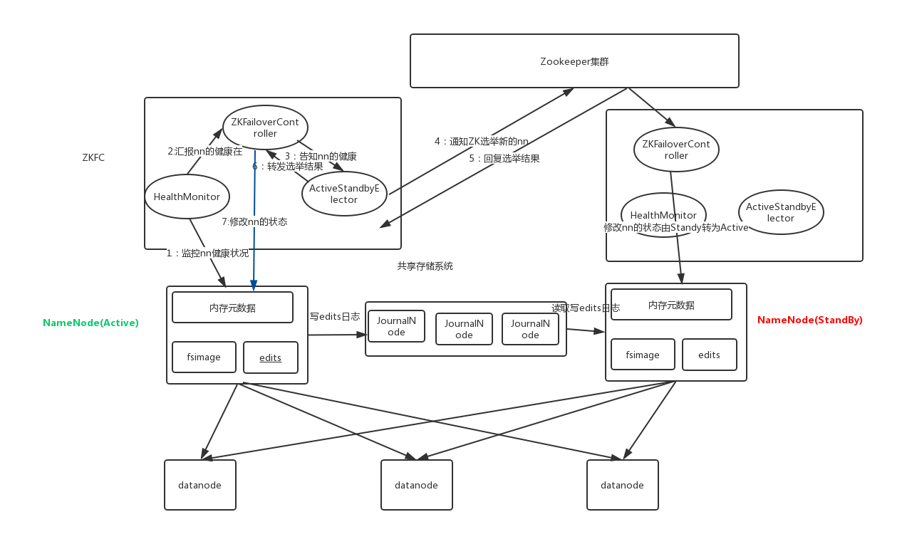

# 1- Ogg 与 Canal

## 1-1 概念与特点

- ogg和canal都是[**数据库实时数据同步的工具**]()
- 特点：
  - 能够**实时同步数据库的增删改**操作；
- 原理：
  - **ogg**是读取的 **oracle** 的数据库**系统日志**信息；
  - **canal**是读取的**mysql** 的 **binlog日志**信息；


## 1-2 与Flume对比

- canal  与 flume本质上是不同的；
- **canal 只用于mysql**: 是一个专用于 采集mysql binlog 日志的同步工具；
- **flume是[通用]()采集工具**：可以自定义source 和 sink， 中间使用channel传输event事件；
- ogg 是 **oracle公司开发的一款[通用]()的工具**；
  - ogg的通用在于:[ogg不仅仅支持oracle， 也支持如：sqlserver  和 mysql等等常见的数据库]()；


# 2- kudu

## 2-1 kudu 介绍

- 其实Kudu我们可以把它定位成**分布式存储层**;
- **一般跟Impala配合使用；**
- kudu的思想是**基于hbase**的，kudu就是基于Hbase改造而来;
- 能够提供**高吞吐的写入和抽取**同时可以做**增删改查**, 对比HDFS更方便了、
- 还能提供简单的**随机查询**
- [如果做复杂的数据分析, Kudu可以作为存储层为Impala或SparkSQL等提供数据支撑.]()

- 角色：
  - **Master**
  - **tserver             ：HBase中的regionserver**
  - **tablet               ： HBase中的region**
  - **hash/range     :   tablet根据hash 和 range分区；**
  - **memRowSet  ： 新增数据缓冲区**
  - **DeltaRowSet  ： 更新数据缓冲区**
  - **DataRowSet   ： Hbase中的storeFile**
  - **BaseData   :    Hbase 中的HFile**

## 2-2 kudu VS Hbase

- 数据库 VS 数据库,  KUDU比HBase强的地方在于 **[吞吐量更高]()**, 支持数据**[增删改查更好]()**, 不差于HBase的随机读写能力;

### 2-2-1 角色对比

- Hbase
  - Hbase的物理模型是**master和regionserver**；
  - **regionserver存储的是region**;
  - **region 可以根据rowkey 划分多个region；**  根据rowkey 分区
  - **region里边很有很多store**;
  - **一个store对应一个[列簇]()**;
  - **一个store中有一个memstore和多个storefile;**
  - **store的底层是Hfile**，hfile是hadoop的二进制文件;
  - 其中**HFile**和**HLog**是hbase两大文件存储格式，HFile用于存储数据，HLog保证可以写入到HFile中；

- Kudu
  - kudu 的物理模型是**master和tserver**;
  - table根据[**hash和range分区**]()，分为多个**tablet**存储到tserver中;
  - tablet分为**[leader和follower]()**，leader负责[**写**]()请求，follower负责[**读**]()请求;
  - 每个tablet中有一个**MemRowSet（保存新增数据）** 和 **DeltaRowSet（保存更新数据）** 
    - Hbase 中的memstore
  - 数据最终是存储在**DisRowSet ,DetaStores、BaseData**中； （Hbase中的 storeFile  、 HFile）
  - 总结来说，(**[多对多]()**的关系)[**一个tserver可以服务多个tablet，一个tablet可以被多个tserver服务**]()（基于tablet的分区，最低为2个分区）；

### 2-2-2 联系

- 设计理念和想法是一致的；
- kudu的思想是**基于hbase**的，kudu就是基于Hbase改造而来;
- [**Kudu 不依赖于zookeeper、HDFS**]()  ；
  - Kudu将HBase中zookeeper的功能放进了**TMaster内**，Kudu中TMaster的功能比HBase中的Master任务要多一些；
  - **kudu**所有集群的**[配置信息]()**均存储在**本地磁盘**中；
  - **Hbase**的集群**[配置信息]()**是存储在**zookeeper**中；
- Hbase 的数据备份依赖于**Hadoop中的HDFS**;
- Kudu 的数据备份自己实现；
- HBase是[**面向列族式**]()的存储，每个列族都是分别存放的，HBase表设计时，很少使用设计多个列族，大多情况下是**一个列族**。这个时候的HBase的**存储结构**已经**与行式存储无太大差别**了。（[**假列存储方式**]()）
- Kudu，实现的是一个[**真正的面向列的存储方式**]()，表中的每一列都是单独存放的；所以HBase与Kudu的差异主要在于类似于[行式存储的**列族式**存储方式]()与[典型的**面向列式**的存储方式]()的差异；


## 2-3 Kudu读写原理

### 2-3-1 Kudu写入过程 -写入MemRowSet

- 客户端向Kudu Master请求**tablet所在位置**；
- Kudu Master**返回tablet所在位置**；

- 为了优化读取和写入，客户端将**元数据进行缓存**；

- 根据**分区策略**，路由到对应Tablet，**请求Tablet Leader**；

- 根据RowSet 记录的主键范围过滤掉不包含**新增数据主键的RowSet**；

- 根据RowSet **布隆过滤器**再进行一次过滤，过滤掉不包含**新增数据主键的RowSet** （[主键是否存在]()）；

- 查询RowSet中的B树索引判断是否命中新数据主键，若命中则报错主键冲突，否则**新数据写入MemRowSet**；

- 返回响应给客户端；


### 2-3-2 写过程对比 : **Hbase 写入比 Kudu快**

- **HBase**写的时候，[不管是**新插入**一条数据还是**更新数据**，**都当作插入一条新数据**来进行]()；
- **Kudu**将[插入新数据  与  更新操作**分别看待**]()；
- **Kudu**表结构中必须设置一个**[唯一主键]()**，插入数据的时候必须判断一些该数据的主键是否唯一，所以插入的时候其实有一个**[读的过程]()** （[**先读-判断是否唯一-插入**]()）； 而**HBase**没有太多限制，待插入数据将**直接写进memstore**；
- HBase实现数据**可靠性**是通过将落盘的**数据写入HDFS**来实现；而Kudu是通过将数据写入和更新操作**同步在其他副本**上实现数据**可靠性**；
- 结合以上几点，可以看出[**Kudu在写的性能上相对HBase有一定的劣势**]()；因为kudu在写入的时候需要做一次判断；


### 2-3-3 Kudu更新流程 --修改至DeltaStores

- 更新删除流程与写入流程类似，区别就是最后判断是否存在主键时候的操作，若存在才能更新，不存在才能插入新数据。
- 客户端向Kudu Master**请求tablet所在位置**

- Kudu Master**返回tablet所在位置**

- 为了优化读取和写入，客户端将**元数据进行缓存**

- 根据[分区策略]()，路由到对应Tablet，**请求Tablet Leader**

- 根据RowSet记录的主键范围过滤掉不包含**修改的数据主键的RowSet**

- 根据RowSet **布隆过滤器**再进行一次过滤，过滤掉不包含**修改的数据主键的RowSet**

- 查询RowSet中的B树索引判断是否命中修改的数据主键，若命中则**修改至DeltaMemStores**，否则报错数据不存在

- 返回响应给客户端


### 2-3-4 Kudu 读数据流程

- 查询顺序：[MemRowSet(内存新增数据) -> DeltaMemStores（内存更新老数据）-> DataRowSet(文件)  ->BaseData]()

- 客户端向Kudu Master请求**tablet所在位置**

- Kudu Master**返回tablet所在位置**

- 为了优化读取和写入，客户端将**元数据进行缓存**；

- 根据主键范围过滤**目标tablet**，**请求Tablet Follower**；


# 3- Impala

## 3-1 Impala 与 Hive对比

- 理解
  - Hive : 数据由第三方提供, [**计算MR**]() 提供 自己就是一个**中间商**
  - Impala: 数据由第三方提供, 计算[**由impala自己算**](), 自己就是计算工具；
  - [**Impala 使用了Hive 的元数据**]() ；
  - Impala 和 hive 都是sql类型的**计算工具**
  - 都是对**结构化数据**进行操作

- Hue + Hive
  - Hue + Hive 组成了**查询工具**
  - Hue: UI页面, 用户入口
  - Hive: **[单机]()**工具, 接受SQL **[执行MR]()**
  - 用户在Hue上写SQL, 运行后, 由Hive翻译成MR 让YARN去跑MR任务
  - 任务结束后,Hive将结果提供给Hue, Hue展示在页面上供用户看
- Hue + Imapla
  - Hue + Impala 组成**即席查询[架构]()**:
  - Hue: UI页面, 用户入口
  - Impala: **[分析工具(内存计算)]()**, 接受SQL作为分析条件然后在内存中计算数据(**[分布式计算]()**)
  - 用户在Hue上写SQL, 运行后, 由**[Impala执行SQL]()**
  - 任务结束后,Impala将结果提供给Hue, Hue展示在页面上供用户看

## 3-2 Impala 与 SparkFlink对比

- SparkFlink称之为**计算引擎**, Impala称之为SQL**[分析工具]()**
- SparkFlink是**通用计算**, Impala是**SQL**[**专用计算**]()

## 3-3 Impala的优缺点 

- 优点：
  - 基于**内存运算**，速度快， 比sparkSql 慢；
  - 支持数据本地化的IO调度机制：**[尽可能地将数据和计算分配在同一台机器上进行]()**，减少了网络开销。
  - 可以**[访问hive的metastore]()**，使用Hive的Metastore来提供元数据管理功能。
- 缺点：
  - 自己不能存储数据，需要依赖于kudu；

## 3-4 Impala架构与角色


- Impala**角色**主要由**Impalad**、 **State Store**、**Catalogd**和CLI组成。
- Impalad
  - 是Impala的核⼼组件，进程名是Impalad; （类似于**[worker]()**） 
  - Impalad服务由三个模块组成：（**[去中心化]()**的管理架构）
    - **Query Planner**: 负责接收SQL查询请求,解析SQL并**转换成执⾏计划**
    - **Query Coordinator**: **查询协调**，协调给其它节点去干活；
    - **Query Executor: 执⾏具体任务。**	
- Impala State Store
  - 记录impalad节点的存活状态信息；
  - statestore**监控集群中Impalad的健康状况**，并将集群健康信息同步给Impalad。
- catalogd
  - **主要管理impalad的元数据信息**；
  - **[Hive元数据更新时：更新操作通知Catalog，Catalog通过广播的方式通知其它的Impalad进程]()**
- CLI
  - 提供给用户查询使用的命令行工具（Impala Shell使用python实现），同时Impala还提供了Hue，JDBC， ODBC使用接口


# 4- ClickHouse

## 4-1 ClickHouse介绍

- 面向OLAP**[列式]()**存储数据库；
- **C++** 语言开发；(性能好)
- 每台服务器每秒能处理[数亿到十亿多行]()和[数十千兆字节]()的数据；
- 允许使用**类SQL实时查询生成分析数据**报告，具有[速度快、线性可扩展、硬件高效、容错、功能丰富、高度可靠、简单易用和支持跨数据中心部署]()等特性；
- 丰富的[**数据类型**]()、[**数据库引擎和表引擎**]()；
- ClickHouse独立于Hadoop生态系统，**不依赖Hadoop的HDFS**；

## 4-2 ClickHouse特性

- 查询性能好，比HBase还快；

|          | ClickHouse | Hbase      |
| -------- | ---------- | ---------- |
| 计算量级 | 几亿行/s   | 数十万行/s |

- 支持SQL
  - **Hbase**原生[不支持SQL]()，需要借[助Kylin或者Pheonix]()，因为系统组件越多稳定性越低，维护成本越高；
  - ClickHouse支持SQL查询，[GROUP BY，JOIN ，IN，ORDER BY]()等；
  - ClickHouse[**不支持窗口函数**]()和[**相关的子查询**]()，所以一些逻辑需要开发者另想办法；

- 支持实时数据更新；
- 支持**近似计算**：（为了速度， 丢失精度也无所谓）
  - ClickHouse提供各种各样在**允许牺牲数据精度的情况下对查询进行加速的方法**；

## 4-3 ClickHouse优缺点

- 优点
  - 搞性能([查询贼拉快]())
  - 线性可扩展([分布式都支持]())
  - 硬件高新([新框架嘛, 支持新硬件]())
  - 容错 ：[**副本机制 + WAL预写日志；**]()
  - 高度可靠([不可靠谁用]())
- 缺点
  - **复杂难用**
    - **支持的数据类型太多了；**
      - **聚合类型：AggregateFunction**
      - **嵌套类型：nested (C语言中的结构体、java中的Bean)**
      - **Interval：划分时间；**
      - **IPV4/IPV6;**
  - 缺少高频率，**低延迟(类似[标记]()删除和更新)**的修改或删除已存在数据的能力。仅能用于批量删除或修改数据。
  - **没有完整的事务支持(OLAP无所谓)**
  - 有限的SQL支持，[**join实现与众不同**]()
  - **[不支持二级索引]()**
  - **[不支持窗口函数功能]()**
  - [元数据管理需要人工干预维护]()（运维）

## 4-4 ClickHouse 对比其它框架

- **Spark Flink** 是**[通用计算]()**, 各方面都能算, [都未达到极致性能](), 但是也不慢，挺快的
- **Impala**: **通用[SQL]()计算**, 各类型SQL都可以, 但也[未达到极致性能,]() 也不慢 高吞吐
- **ClickHouse**: **[非通用]()性SQL计算**, [专用场景]()SQL计算, 比如聚合场景, 在专用场景下是[极致的性能]().

- Hive
  - **缺点是慢**
  - 底层使用[**MR**]()做计算

- SparkSQL
  - 什么都能做，**通用型计算框架**，但是[性能为达到极致]()；

- Kylin
  - [空间换时间的设计思想]()；
  - **依赖** [hadoop hive zookeeper hbase]();
  - 创建[项目]()-创建[数据源]()-创建[模型-]()创建[Cube]()-执行[构建]()；
  - [**全量构建**]()（一个segment查询快）、**[增量构建]()**（多个segment查询慢）
  - 碎片（segment）管理:[手动合并、自动合并，手动删除，自动删除；]()
  - Cube优化：**剪枝优化**：[衍生维度，强制维度（减半），层级维度（N+1），联合维度(1)]()；

- Impala
  - 速度不够快
  - [分布式查询框架]()，[不能存储数据]()，使用**[hive的元数据]()**，自己[**提供计算引擎**]()，内存计算，速度快；
  - 一般跟kudu数据一起使用，兼容性非常好
  - 角色：
    - **statestore** : [管理]()每个节点[impalad](),心跳包 保证存活状态；
    - **catelog** ：[管理元数据]()（Hive中的元素 + impalad 的元素）
    - **impalad** ：执行者
    - Query **planner** : 接收sql语句，并[解析SQL生成执行计划]()；
    - Query **Coodinator** : [任务协调器]()，将任务分发给别的impalad中的queryexecutor 执行；
    - Query **executor** : 真正[执行任务]()的进程；

- Apache **Druid**
  - [**实时**数仓平台]()；
  - [不支持join,不支持DDL,不支持DML]()；
  - 实时项目一般从kafka中[摄取数据]()，[格式json;]()数据存储在HDFS,本地磁盘，kafka;
  - 数据是[**预聚合**]()；查询查询能达到亚秒级（[**位图索引**：某个值在哪些列中存在]()）；
    - **索引**组件：[overload]() [middlemanager]() ;  **摄取**数据，[创建删除表，管理segment]();
    - **存储**组件：[coordinator historical;]() 负责**数据的存储**，数据的删除，[按照时间范围chunk,每个chunck包含了多个segment,每个segment包含三部分，**时间列-指标列-维度列**]()；
    - **查询**组件：[router broker]():负责查询数据，将结果返回给客户端；

## 4-5 ClickHouse 引擎

- 日志引擎
  - **TinlyLog**
- 数据库引擎
  - Atomic
  - **Mysql: 远程的MySQL服务器中的库映射到ClickHouse中**
  - Lazy
- 表引擎 -- MergeTree系列引擎
  - **MergeTree** ： 父引擎 可以有重复的主键；
  - **ReplacingMergeTree**： 使用 [optimize]() 解决主键不能去重的问题；
  - **SummingMergeTree**： 实现[sum 预聚合]()；
  - **AggregatingMergeTree**：实现[所有**聚合函数**的预聚合]()；
  - **CollapsingMergeTree**： 添加[sign列]()== 1 或者 -1，实现[update delete]() 功能；
  - **VersionedCollapsingMergeTree**：添加了[version 列]()， 解决 [sign == -1 或者 1 乱序的问题]()；


# 5- avro

- 是一个**高性能的序列化数据传输框架**，采用**Json数据格式**；

- 数据结构丰富：

  - 8种基本类型：byte ,int ,float,double,boolean,null,string,long
  - 6种复杂类型：record(组合),map，union,fix，array等

- 开发步骤

  - **编写schema文件**   （**avsc文件**）;

    - 必须字段信息  ： **name type  fields (name type)**

  - **编译schema；** 

    

- 优点：

  - **高性能序列化数据传输**
  - **api友好**
  - 采用通用数据交互格式：**json**
  - **只传输具体数据，不传输schema**
  - **数据结构丰富**
    - 8种基本类型：byte ,int ,float,double,boolean,null,string,long
    - 6种复杂类型：**record**(组合),map，union,fix，array等

- 缺点：

  - **使用avro需要自定义序列化和反序列化方法；**


# 6- flume

## 6-1 Flume介绍

- Flume 是 Cloudera 提供的一个**高可用的**，高可靠的，**分布式的海量日志采集**、聚合和**传输工具**；
- 基于流式架构，容错性强，也很灵活简单。
- Flume可以采集数据源格式：
  - socket数据包、
  - 文件、
  - 文件夹、
  - kafka
- 采集到的数据(下沉sink)输出到：

  - HDFS、
  - Hbase、
  - Hive、
  - Kafka

## 6-2 组件架构

- Flume分布式系统中最核心的角色是agent，**agent 本身是一个 Java 进程**，一般运行在日志收集节点。flume采集系统就是**由一个个agent所连接起来形成**；
- **每一个agent相当于一个数据传递员**，内部有三个组件：
  - **Source**：采集组件，用于**跟数据源对接**，以获取数据;
  - **Sink**：下沉组件，用于往**下一级agent传递数据或者往最终存储系统传递数据**;
  - **Channel**：传输通道组件，用于**从source将数据传递到sink;**


## 6-3 数据流程

- agent三大组件：[Source 、 Channel、Sink]()

- 1- **source监控某个文件或数据流**，数据源产生新的数据;
- 2- 拿到该数据后，**将数据封装在一个Event中，并发送到channel后提交**
- 3- [**channel队列先进先出，Sink去channel队列中拉取数据**]()
- 4- **然后写入到HDFS/Kafka/或者其他的数据源,甚至是下一个Agent的Source。**


## 6-4 Flume效率低的原因

- **核心角色agent， 是使用java开发的一个进程；java进程跟C++/C进程的速度没法比**；
- **Source加载数据，会转化event，包含header和body信息，存在数据冗余;**
- **Channel存储数据时需要落盘，涉及频繁io操作，因此效率低;**


# 7- Flink CEP

## 7-1 介绍

- FlinkCEP是在Flink之上实现的**复杂事件处理（CEP）库**，它是Flink的一个分支, CEP库;
- [一个或多个由简单事件构成的事件流]()**通过一定的规则匹配**，[然后输出用户想得到的数据]()，满足规则的复杂事件；

- 优点
  - 继承了 Flink **高吞吐**的特点；
  - **查询是静态的，数据是动态的**，满足实现和连续查询的需求；
  - 擅长解决**跨事件的匹配；**
  - **Api友好；**
- 缺点：
  - **无法动态的更新规则**（痛点）

## 7-2 开发步骤：

-  **定义模式规则**
-  **将规则应用到数据流**
-  **获取符合规则的数据**

## 7-3 CEP 量词

| **类型** | **API**                             | **含义**                                                     |
| -------- | ----------------------------------- | ------------------------------------------------------------ |
| 量词API  | times() timesOrMore（） oneOrMore() | 模式发生次数 示例： **pattern.times(2,4)**，模式发生2,3,4次 模式发生大于等于N次 示例： **pattern.timesOrMore(2)**，模式发生大于等于2次 |
| 量词API  | optional()                          | 模式可以不匹配  示例： **pattern.times(2).optional()**，**模式发生2次或者0次** |
| 量词API  | greedy()                            | 模式发生越多越好 示例： **pattern.times(2).greedy()**，模式发生2次且**重复次数越多越好** |

## 7-4 CEP 条件

| **类型**    | **API** | **含义**                                                     |
| ----------- | ------- | ------------------------------------------------------------ |
| 简单条件API | where() | 模式的**条件** 示例： pattern.where(_.ruleId=43322)，模式的条件为ruleId=433322 |
| 组合条件API | or()    | 模式的**或**条件 示例： pattern.where(_.ruleId=43322).or(_.ruleId=43333)，模式条件为ruleId=43322或者43333 |
| 停止条件API | util()  | 模式发生直至X条件满足为止 示例： pattern.oneOrMore().util(condition)模式发生一次或者多次，**直至condition满足为止** |

## 7-5 CEP 模式

- 单个模式

- 组合模式

  - FlinkCEP支持事件之间的**三种临近条件**：
    - **next() notNext()** 严格临近 匹配到的事件严格地一个挨着一个出现，在事件之间没有任何未匹配到的事件。


    - **followedBy() notFollowedBy()** 宽松临近 忽略事件之间未匹配到的事件。


    - **followedByAny()** 非确定性宽松临近，进一步放宽连续性，允许额外的忽略一些匹配事件。

- consecutive 连续模式

  - 连续模式：匹配到的数据需要是**连续**出现的，如果不连续就会中断匹配。

- allowCombinations 允许连续模式

  - 允许连续模式：匹配到的数据可以是**不连续**出现的


# 8- Druid

## 8-1 ApacheDruid介绍

- apache druid是一个**实时数仓平台**；
- OLAP分析型数据库；
- 支持SQL数据库查询，性能高新；
- **摄取数据的格式为json；**
- [**不支持复杂的join查询**](),不支持DDL，不支持DML；


## 8-2 实时数仓技术架构


## 8-3 架构体系


三大组件：

- **索引组件**：
  - 主节点： overload
  - 从节点：middlemanager
  - 索引服务：
    - **负责数据的摄取；** （数据摄取的时候， 一个任务对应一个peon线程）
    - **表的创建和销毁；**
    - **管理segment**；
- **存储组件：**
  - 主节点：coordinator
  - 从节点：historical
  - 存储服务：**负责数据的存储和数据的删除**，
    - 是按照**时间范围**存储数据（**chunk**）；
    - 每一个chunk包含多个**segment**(物理概念)；
    - 每个segment包含三部分：**1-时间列；2-指标列；3-维度列**；

``` properties
1.Druid中的数据存储在被称为 DataSource 中，DataSource 类似 RDMS中的table

2.每个DataSource按照时间划分，每个时间范围称为一个 chunk（(比如按天分区，则一个chunk为一天)）。

3.在chunk中数据被分为一个或多个segment;

4.segment是数据实际存储结构，Datasource、Chunk只是一个逻辑概念;

5.每个segment都是一个单独的文件，通常包含几百万行数据;

6.segment是按照时间组织成的chunk，所以在按照时间查询数据时，效率非常高;

7.每个segment包含三部分：1-时间列；2-指标列；3-维度列;
```


## 8-4 位图索引 （支持亚秒级查询）

- Druid之所以快的原因：
  - **对数据库中的每个列的每个值做了一个位图定位**：
- **位图的数据结构**：
  - Map<key,BitMap>
    - key ： 就是维度列；
    - bitMap： 就是坐标；


## 8-5 Apache Druid角色分配

- **索引组件：管理摄取进程，创建/管理segment，创建/管理dataSource**
  - **overload（主节点）**
  - **middlemanager（从节点）**
- **存储组件:负责数据的存储和数据的删除**
  - **coordinator（主节点）:**
  - **historical（从节点）:**
- **查询组件: 接收查询请求，将结果数据返回给客户端**
  - **router（主节点）**
  - **broker（从节点）**
- **dataSource(table)**
- **chunk (每个时间范围):  一个chunck下有过个segment**
- **segment(实际存储数据的文件): 每个segment包含三部分：1-时间列；2-指标列；3-维度列；**


# 9- Kylin

## 9-1 Kylin介绍

- Kylin 是一款大数据OLAP引擎，由ebay-[**中国团队研发**]()的，是第一个真正由中国人自己主导、从零开始、自主研发、并成为Apache顶级开源项目；

- Kylin是将先将数据进行[**预处理**]()，将预处理的结果放在**HBase**中。**效率很高**；

- **优点：**

  - 可扩展的超快（亚秒级）的 OLAP 引擎

  - 交互式查询能力（**亚秒级**）

  - MOLAP **Cube 的概念(立方体)（数据预聚合：空间换时间）**

  - Cube构建好后，**会将结果数据保存在hbase里面；**

  - 通过kylin的查询服务，直**接查询Hbase,**所以查询能够实现亚秒级;

    


## 9-2 Kylin体系架构

- Kylin 依赖于 **Hadoop、Hive、Zookeeper 和 Hbase**
- 步骤：
  - **创建项目;**
  - **创建DataSource;**
  - **加载数据；**
  - **创建Model;**
  - **创建Cube;**
  - **构建Build  Cube;**
  - **Cube结果装载到HBase;**


 

## 9-3 维度与度量

- **维度**就是**观察数据的角度**，例如：
  - 电商的销售数据，可以从时间的维度来观察，也可以细化从时间和地区的维度来观察
  - 统计时，可以把维度值相同的记录聚合在一起，然后应用聚合函数做累加、平均、去重计数等聚合计算

- **度量**就是**被聚合的统计值**，也是聚合运算的结果。

## 9-4 Cube和Cuboid

-  **cube模型称之为多维立方体模型，是由多个cuboid组成**；
-  **任意一组维度进行组合（维度的数量可以是大于等于0），得到的聚合结果**，我们称之为cuboid; 
-  cuboid的数量取决于维度的数量；对于N个维度来说，**cuboid总数量 = 2 的N 次方种**
-  一个数据表 或 数据模型上的字段 它们要么是**维度**，要么是**度量**（可以被聚合）
-  **Cuboid（立方形）也成为 物化视图**
-  所有维度组合的Cuboid作为一个整体，被称为**Cube（立方体）**。一个Cube就是许多按维度聚合的物化视图的集合。

## 9-5 工作原理

Apache Kylin的工作原理是对数据模型做Cube预计算，并利用计算的结果加速查询。具体工作过程如下。

- 指定**数据模型**，定义维度和度量；

- **build**: **预计算Cube，计算所有Cuboid并保存为物化视图（存储到Hbase中）**；

- 执行查询时，读取Cuboid，运算，产生查询结果；


## 9-6 全量构建与增量构建

### 9-6-1 全量构建

- 每次构建都是全部数据（**全删全建**）；

- **Cube中只存在唯一的一个Segment**

- **该Segment没有分割时间的概念，也就没有起始时间和结束时间**


### 9-6-2 增量构建

- **只会导入新Segment指定的时间区间内的原始数据**，并只对这部分原始数据进行预计算;
- 每次构建的都是**指定的时间区间**内的原始数据；
- 每次构建**生成一个新的segment**，保存在HBase中；
- segment之间**通过时间分割**；


### 9-6-3 全量 和 增量 对比

| **全量构建**                          | **增量构建**                                                 |
| ------------------------------------- | ------------------------------------------------------------ |
| 每次更新时都需要更新**整个数据集**    | 每次只对需要**更新的时间范围进行更新**，因此离线计算量相对较小 |
| 查询时**不需要合并不同Segment**的结果 | 查询时**需要合并不同Segment的结果，因此查询性能会受影响**    |
| 不需要后续的Segment合并               | 累计一定量的Segment之后，**需要进行合并**                    |
| **适合小数据量或全表更新的Cube**      | **适合大数据量的Cube**                                       |


### 9-6-4 性能对比

- 构建：

  - 全量构建：慢；
  - 增量构建：快；

- 查询：

  - 全量查询：快；（只有一个segment）
  - 增量查询：慢；（会有多个segment，需要合并）

- 应用场景：

  - 增量：数据量大；
  - 全量：数据量小；

## 9-7 增量构建Cube过程

- **指定分割时间列**
  - 增量构建Cube的定义**必须包含一个时间维度**，用来分割不同的Segment，这样的维度称为**分割时间列**（Partition Date Column）。**就是指定一个时间范围**

- **增量构建过程**
  - (1) 在进行增量构建时，将增量部分的**起始时间和结束时间**作为增量构建请求的一部分提交给Kylin的任务引擎；
  - (2) 任务引擎会**根据起始时间和结束时间从Hive中抽取相应时间的数据**，并对这部分数据做预计算处理，并保存在Hbase中；
  - (3) **将预计算的结果封装成为一个新的Segment**，并将相应的信息保存到元数据和存储引擎中。一般来说，**增量部分的起始时间等于Cube中最后一个Segment的结束时间**。

## 9-8 Cube碎片管理(Segment管理)

- 对多个segment进行**合并操作**，也就是多个segment合并成一个segment;

  - **手动**合并；
  - **自动**合并；（合并顺序策略：**从大到小**）
    - **自动合并策略；**
    - **保留策略；**

- 对不需要的segment进行**删除**；


## 9-9 Kylin Cubeid剪枝优化

- Cube的剪枝优化是一种**试图减少额外空间占用**的方法；

- 目的就是删除多余的Cuboid;

- 优化方案：
  - **使用衍生维度；**
    - 使用衍生维度用于在有效维度内将**维度表上的[非主键]()维度排除掉**，**并使用维度表的主键（其实是事实表上相应的外键）来替代它们**。
    - Kylin会在底层[**记录维度表主键与维度表其他维度之间的映射关系**]()，以便在查询时能够动态地将维度表的主键“翻译”成这些非主键维度，并进行实时聚合。
  - **聚合组维度**
    - **强制维度（Mandatory）** 
      -  **cuboid直接减半**
    - **层级维度（Hierarchy）**
      -  如：年月日；国家省份城市。 如果是N维度使用层级 ，cuboid从2^n 减到 **n+1**
    - **联合维度（Joint）**
      - 多个维度要么同时存在，要么同时都没有；如果N个维度使用联合，**cuboid = 1；**


# 10- Spark on Yarn 流程

1. Client 运行spark-submit提交一个任务；
2. **Client向RM申请启动AM和Driver；**
3. RM选择一个NM中的Container资源容器启动AM和Driver;
4. AM向RM申请资源用于启动Executor；
5. RM返回NM列表；
6. AM连接其它的NM并在Container中启动Executor;
7. Executor 反向注册给Driver;
8. **Driver端创建两个任务：DAGScheduler 、TaskScheduler;**
9. **Driver端根据Action算子划分job,回溯RDD依赖关系构建DAG图；**
10. **DAGScheduler 将DAG图根据宽依赖划分成Stages,每个Stage划分成Task;**
11. **DAGScheduler 将每组Task提交给TaskScheduler；**
12. **TaskScheduler 将一个个task发送给NM中的executor中去执行；**
13. **TaskScheduler 还会重启失败的task任务；**
14. NM中的Executor执行完任务将结果反馈给TaskScheduler 再重复步骤11；


# 11- Zookeeper 

## 11-1 临时节点

- 临时节点只能是叶子节点（没有子节点）

- zookeeper的临时节点可以用于判断该节点上挂的任务是否还存在；如：HBase中的RegionServer上下线；

## 11-2 Zookeeper 的Watch机制

- ZooKeeper提供了分布式数据发布/订阅功能；
  - ZooKeeper允许客户端向服务端注册一个Watcher监听，当服务端的一些事件触发了这个Watcher，那么就会向指定客户端发送一个事件通知来实现分布式的通知功能

- **触发事件种类很多，如：节点创建，节点删除，节点改变，子节点改变等**。

- 总的来说可以概括Watcher为以下三个过程：
  - 客户端向服务端注册Watcher；
  - 服务端事件发生触发Watcher；
  - 客户端回调Watcher得到触发事件情况；


## 11-3 Zookeeper的选举机制-过半机制


- **第一次启动**ZK集群选出一个Leader

  - 每个主机启动都会先投票给自己；

  - 和其它主机进行投票交换(**告诉别的主机自己投票给了谁**), 但是这时会失败。因为其它node还没有起来；

  - 判断投票的票数是否过半？ 

  - 如果投票个数过半，则直接比较myid的值，谁的myid最大，谁就是Leader。

  - 如果投票过半后，Leader已经选出来了，后面的主机启动还是会投票给自己，但是它会发现Leader已经产生了。并标记自己为follwer;

  - 注意： 

    ​		**只要投票票数过半，就开始选择Leader 。 如果票数一样就是直接比较myid。**

- **Leader宕机**，重选Leader

  - 进入选举机制
  - 发出广播看有多少主机存活。存活的主机会回复ACK;  (**判断存活的主机是否过半**)
  - **如果宕机数量过半，集群就废了**。
  - 每一个存活的主机都投自己一票
  - **比较mZxid (修改事务ID)；谁的mZxid 最大， 数据最新， 谁就是Leader。（一般mZxid都是一样的）**
  - **如果mZxid都相同，则比较myid；myid最大，谁就是Leader。**

  - 注意：
    - 谁的数据最新谁就是Leader;
    - 谁的myid最大谁就是Leader；

# 12- Yarn

## 12-1 Yarn三大组件

- ResourceManager：ResourceManager**负责整个集群的资源管理和分配**，是一个**全局的资源管理系统**
- NodeManager：集群的节点，实际干活；
- ApplicationMaster ：每个应用程序都会有个AppMaster,负责任务调度；

## 12-2 Yarn 运行流程

- Client提交应用程序；
- RM分配一个Container 启动AppMaster（AM）;
- AM向RM 申请资源；
- RM返回NM和Container 列表信息；
- NM在Container中启动Executor;


## 12-3 Yarn 调度器

- FIFO Scheduler 队列调度器；
  - **按照顺序执行任务**；
- Capacity Scheduler容量调度器；
  - **将整个资源按照比例划分**；任务根据预计算的资源选择到哪个资源池中执行；
- Fair Scheduler 公平调度器；
  - **根据任务数量平均分配资源；**
  - 当第一个大job提交时，只有这一个job在运行，此时它获得了所有集群资源；当第二个小任务提交后，Fair调度器会分配一半资源给这个小任务，让这两个任务公平的共享集群资源。


# 13- HDFS

## 13-1 NameNode 的主备切换实现 

- **主备切换控制器ZKFC : 主备切换控制器ZKFC**

- NameNode 主备切换主要由 <span style="color:red;background:white;font-size:20px;font-family:楷体;">**ZKFailoverController、HealthMonitor 和 ActiveStandbyElector **</span>这 3 个组件来协同实现;



## 13-2 SecondaryNameNode工作过程

- **SecondaryNameNode的作用是合并fsimage和edits文件**。

- 第一步：**将hdfs更新记录写入一个新的文件——edits.new**。

- 第二步：**将fsimage和editlog通过http协议发送至secondary namenode。**

- 第三步：**将fsimage与editlog合并，生成一个新的文件——fsimage.ckpt**。这步之所以要在secondary namenode中进行，是**因为比较耗时**，如果在namenode中进行，或导致整个系统卡顿。

- 第四步：**将生成的fsimage.ckpt通过http协议发送至namenode**。

- 第五步：**重命名fsimage.ckpt为fsimage，edits.new为edits**。

- 第六步：等待下一次checkpoint触发SecondaryNameNode进行工作，一直这样循环操作。


# 14-Sqoop

## 14-1 sqoop的基本介绍

​		sqoop是一款apache开源产品, 主要是用于数据的导入导出的工具, 负责将数据在RDBMS和hadoop之

间数据导入导出

- 导入: 从RDBMS到Hadoop 
- 导出: 从Hadoop到RDBMS

## 14-2  Sqoop 抽取的两种方式

- **一种是原生Sqoop API，一种是 使用HCatalog API。**

- 区别：
  - **数据格式支持**： 
    - Sqoop方式支持的**数据格式较少**；
    - HCatalog支持的**数据格式多**，包括 RCFile, ORCFile, CSV, JSON和SequenceFile等格式。
  - **数据覆盖：** 
    - Sqoop方式**允许数据覆盖**；
    - HCatalog**不允许数据覆盖**，每次都只是追加。
  - **字段名：** 
    - **Sqoop方式比较随意，按照顺序插入：**  **不要求源表和目标表字段相同**(字段名称和个数都可以不相同)，它抽取的方式是将**字段按顺序插入**，[比如目标表有3个字段，源表有一个字段，它会将数据插入到Hive表的第一个字段，其余字段为NULL]()。
    - 但是HCatalog不同，**源表和目标表字段名需要相同**，字段个数可以不相等，如果字段名不同，抽取数据的时候会报 NullPointerException错误。HCatalog抽取数据时，会将字段对应到相同字段名的字段上，哪怕字段个数不相等;