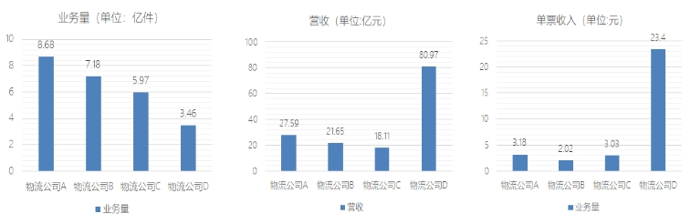
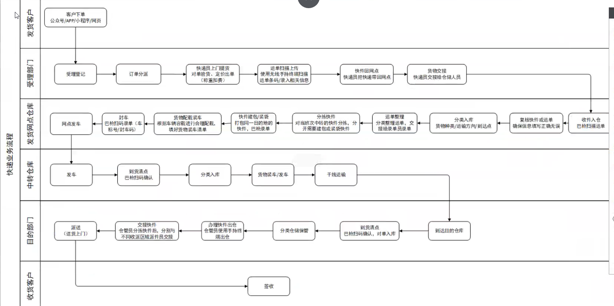
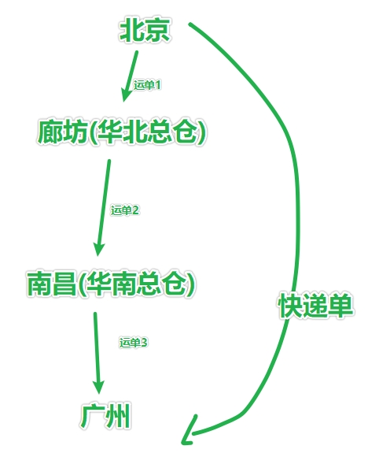
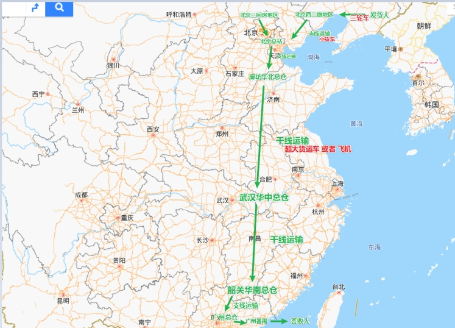
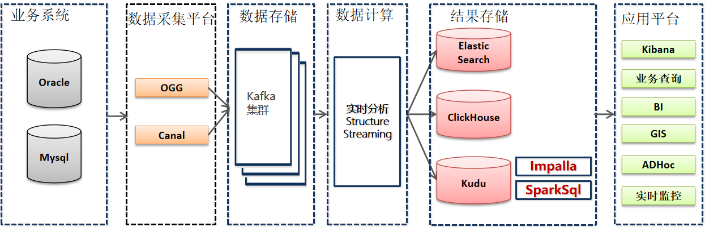
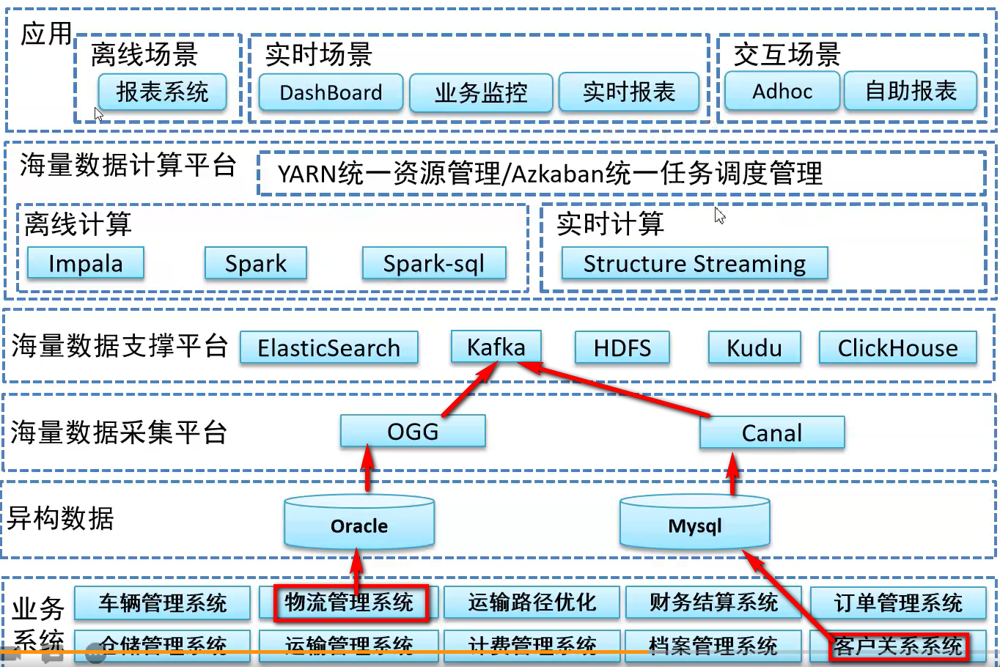
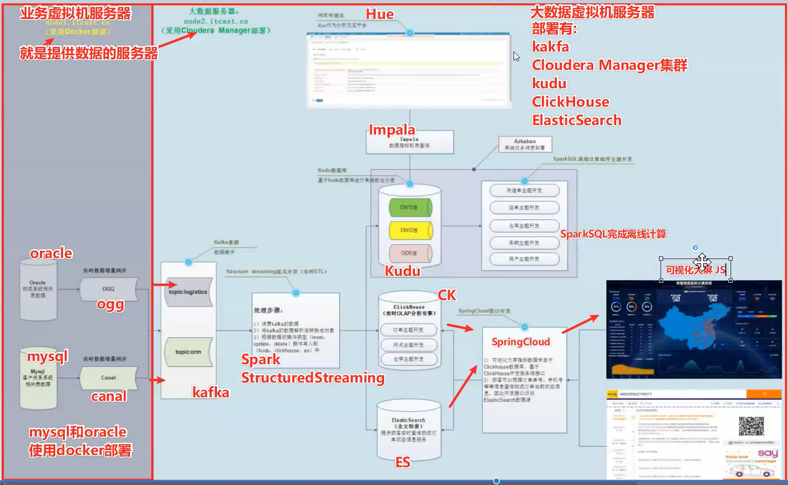
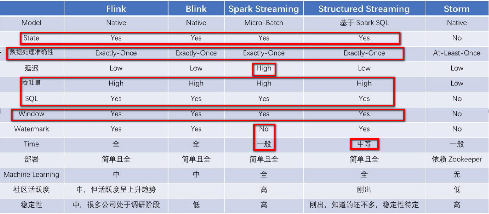

# 1- 项目背景

​		本项目基于一家**大型物流公司**研发的**智慧物流大数据平台**。该物流公司是国内综合性快递、物流服务商，并在全国各地都有覆盖的网点。经过多年的积累、经营以及布局，拥有大规模的客户群，日订单达**上千万**。以下列举了国内的几家物流公司某个月份的数据：

 

 

​		如此规模的业务数据量，传统的数据处理技术已经不能满足企业的经营分析需求。该公司需要基于大数据技术构建数据中心，从而挖掘出隐藏在数据背后的信息价值，为企业提供有益的帮助，带来更大的利润和商机。而自2012年，国家已陆续出台相关的产业规划和政策，也从侧面推动了大数据产业的发展。

​		该大数据项目主要围绕**订单、运输、仓储、搬运装卸、包装以及流通加工**等物流环节中涉及的**数据、信息**等。通过大数据分析可以提高运输以及配送效率、减少物流成本、更有效地满足客户服务要求，实现快速、高效、经济的物流，并针对数据分析结果，提出具有中观指导意义的解决方案。

物流大数据可以根据市场进行数据分析，提高运营管理效率，合理规划分配资源，调整业务结构，确保每个业务均可盈利。根据数据分析结果，规划、预计运输路线和配送路线，环节运输高峰期的物流行为，提高客户的满意度，提高客户粘度。


## 1-1 总结

​		本项目基于多家**大型物流公司**研发的**智慧物流大数据平台**，每个物流公司日订单量已经上千万，传统的数据处理技术已经不能满足企业的经营分析需求。所以需要基于大数据技术构建**数据中心**，从而挖掘出隐藏在数据背后的**信息价值**，为企业提供有益的帮助，带来更大的利润和商机；

- 本大数据项目主要围绕以下维度：
  - **订单;**
  - **运输;**
  - **仓储;**
  - **搬运装卸;**
  - **包装以及流通加工**等物流环节中涉及的**数据、信息**等。
- 通过大数据分析可以达到以下目的：
  - **提高运输以及配送效率**；提高物流的智能化水平
  - **减少物流成本;**
  - **提高用户服务水平**
  - 并针对数据分析结果，提出具有中观指导意义的解决方案。
- 大数据应用场景：
  - **车货匹配；**
    - 比如：今天又多少件订单，有多少类订单，需要什么特殊的车，比如冷冻的订单
  - **运输路线优化；**
  - **库存预测；**
    - 中转站的临时仓库；
  - **设备修理预测；**
    - 比如：车辆上各种传感器、车辆保修......
  - **供应链协同管理；**
    - 比如胶带、袋子、纸盒.......


# 2- 核心业务流程



## 

## 2-1 业务流程总结


## 

## 2-2 业务流程详情

| 序号 | 操作步骤                                   | 说明                                                         |
| ---- | ------------------------------------------ | ------------------------------------------------------------ |
| 1    | **客户下单         **                      | 客户通过微信公众号、微信小程序、App端、官网填写订单，并提交到物流公司的订单管理系统OMS系统。如果通过电话方式下单，将对接到物流公司的呼叫中心，呼叫中心接线员根据客户的描述，在OMS系统中填写订单信息。 |
| 2    | **受理登记订单分派**                       | 快递员收到通知后，联系客户，与客户确认时间、确认要邮寄的货物。快递员上门取件，根据公司的规定，对客户要邮件的货物进行检查、确认 |
| 3    | **快递员上门提货**                         | 快递员收到通知后，联系客户，与客户确认时间、确认要邮寄的货物。快递员上门取件，根据公司的规定，对客户要邮件的货物进行检查、确认 |
| 4    | **运单扫描上传**                           | 快递员收到客户要邮寄的物件后，进行称重，根据要发往的目的地，进行计划，并现场收费（预付款），打印运单凭证。并扫描运单上传到物流公司OMS，运单会自动与订单建立关联。 |
| 5    | **快件回发货网点**                         | 快递员根据收派范围收取快件后，统一将货物运回发货网点         |
| 6    | **发货网点货物交接**                       | 快递员将收到的货物统一移交给仓库管理员，仓库管理员根据该快递员收取的货物逐一清点，确认货物准确无误，并依次录单。 |
| 7    | **发货网点收件入仓**                       | 仓库管理员将快件进行检查确认，放入到仓库临时存放区。         |
| 8    | **发货网点运单复核**                       | 发货物流网点仓库管理员再次清点运单，确保运单与实物匹配。     |
| 9    | **发货网点分类入库**                       | 发货物流网点仓库管理员根据货物的种类、运输方向、到达点进行分类入库。 |
| 10   | **发货网点运单整理（电话下单、网点下单）** | 发货物流网点分类整理运单，并交接给录单员录单。               |
| 11   | **发货网点分拣快件**                       | 对当班次中转的快件分拣，分开需要建包或装袋的快件             |
| 12   | **发货网点快件包装**                       | 将统一目的地的快件，进行打包装袋                             |
| 13   | **发货网点配载装车**                       | 仓库管理员根据车辆容载进行合理配载，填好货物装车清单         |
| 14   | **发货网点封车**                           | 仓库管理员进行扫码录单，需要将车牌号录入到系统，并打印封车码，贴上封条 |
| 15   | **发货网点发车，开始进入干线运输**         |                                                              |
| 16   | **中转物流网点清点**                       | 快递车辆到达中转物流网点后，中转物流网点需要对车辆货物进行清单，确保与运单对应的装车清单货物一致，给回单给发货网点。 |
| 17   | **中转物流网点分类入库**                   |                                                              |
| 18   | **货物装车/发车**                          |                                                              |
| 19   | **干线运输**                               |                                                              |
| 20   | **到达目的仓库**                           |                                                              |
| 21   | **目的地网点到货清点**                     | 目的地仓库管理员通过巴枪扫码确认，并回单给上一个中转物流网点。 |
| 22   | **目的地网点分类仓库保存**                 | 按照类似发货方式分类入库保存                                 |
| 23   | **目的地网点办理快件出仓、交接快件**       | 在OMS系统中，系统根据派送区域分配快递员。目的地仓库管理员使用手持中转办理出仓，根据不同收派区域派送员交接。 |
| 24   | **目的地网点快递员派送**                   | 目的地网点派送员送货上门。                                   |
| 25   | **收货客户签收**                           | 客户签收货物                                                 |
| 26   |                                            |                                                              |
|      |                                            |                                                              |
|      |                                            |                                                              |
|      |                                            |                                                              |


## 2-3名称解释

### 2-3-3 快递单: 

快递单指的是 对货物在从发货到签收的全生命流程中, 针对消费者端的一个唯一标记

 

### 2-3-3 运单:

 货物在运输的过程中 每一个环节所对应的 具体标记. 

因为快递企业内部分了许多的小部门,分公司, 有管运输 有管仓储 ..

不同部门和不同部门 或不同公司和公司之间  进行货物传输的一个唯一标记.

 

一个快递单,从产生到结束, 中间会经过许多的运单.

一个运单 会包含多个快递单

 

### 2-3-3 干线运输: 

干线运输指的是运输的主干线, 在主干线上有最大的运力,一般快件的运行都是由支线去向主干线去汇集, 由主干线运输过去.

好处就是 经由 支线 和干线的运输, 成本最低.

 

 

# 3- 逻辑架构

## 3-1 功能介绍



- 业务系统数据主要存放到Oracle和Mysql数据库中，比如CRM系统数据在Mysql，OMS系统数据存放在Oracle中；
- OGG增量同步Oracle数据库的数据，Canal增量同步Mysql数据库的数据；
- OGG及Canal增量抽取的数据会写入到Kafka集群，供实时分析计算程序消费；
- 实时分析计算程序消费kafka的数据，将消费出来的数据进行ETL操作；
- 为了方便业务部门对各类单据的查询，StructureStreaming流式处理系统将数据经过JOIN处理后，将数据写入到Elastic Search中；
- StructureStreaming流处理会将数据写入到ClickHouse，Java Web后端直接将数据查询出来进行展示；
- StructureStreaming将实时ETL处理后的数据同步更新到Kudu中，方便进行数据的准实时分析、查询。Impala对kudu数据进行分析查询；
- 前端应用对数据进行可视化展示；


## 3-2 架构图




## 3-3 架构说明

### 3-3-1 异构数据源

- 数据源主要有两种方式：
  - Oracle数据库;
  - MySQL数据库;

### 3-3-2 数据采集平台

数据采集平台负责将异构数据源采集到数据存储平台。分为批量导入以及实时采集两个部分：

| 实时采集 | Oracle数据库采用OGG进行实时采集;<br>MySQL数据库采用Canal进行实时采集。<br>采集到的数据会存放到消息队列临时存储中。 |
| -------- | ------------------------------------------------------------ |
|          |                                                              |

### 3-3-3 数据存储平台

本次建设的物流大数据平台存储平台较为丰富。因为不同的业务需要，存储分为以下几个部分：

| **Kafka**         | **作为实时数据的临时存储区，方便进行实时ETL处理**            |
| ----------------- | ------------------------------------------------------------ |
| **Kudu**          | **与Impala mpp计算引擎对接，支持更新，也支持大规模数据的存储** |
| **HDFS**          | **存储温数据、冷数据。大规模的分析将基于HDFS存储进行计算。** |
| **ElasticSearch** | **所有业务数据的查询都将基于ElasticSearch来实现**            |
| **ClickHouse**    | **实时OLAP分析**                                             |

### 3-3-4 数据计算平台

数据计算平台主要分为离线计算和实时计算。

| 离线计算     | Impala：提供准实时的高效率OLAP计算、以及快速的数据查询  |
| ------------ | ------------------------------------------------------- |
| **离线计算** | **Spark/ Spark-SQL：大批量数据的作业将以Spark方式运行** |
| **实时计算** | **采用StructuredStreaming开发实时ETL业务**              |

### 3-3-5 大数据平台应用

| **离 线 场 景** | **报表系统**          |
| --------------- | --------------------- |
| **离 线 场 景** | **小区画像**          |
| **实时  场景**  | **DashBoard**         |
| **实时  场景**  | **业务监控**          |
| **实时  场景**  | **实时报表**          |
| **交互查询**    | **AdHoc（即席查询）** |


# 4- 数据流转

## 4-1 数据流转图




- 业务数据主要存放到Oracle和Mysql数据库中

- **OGG和Canal分别将Oracle和Mysql的增量数据同步到kafka集群**，然后**通过Structure Streaming程序进行实时ETL处理**，将处理的**结果写入到Kudu数据库**中，供应用平台进行分析处理

- 使用Spark与Kudu整合，进行一些ETL处理后，将数据导入到Kudu中，方便进行**数据的准实时分析、查询**。

- 为了将一些要求**监控的业务**实时展示，**Structure Streaming流处理会将数据写入到ClickHouse**，Java Web后端直接将数据查询出来进行展示。

- 为了方便业务部门对**各类单据的查询**，**Structure Streaming流式处理系统同时也将数据经过JOIN处理后，将数据写入到Elastic Search中**，然后基于Spring Cloud开发能够支撑高并发访问的数据服务，方便运营人员、客户的查询。


# 5- 项目的技术选型

## 5-1 流式处理平台

**采用Kafka作为消息传输中间介质(事件总线\消息总线)**

- kafka对比其他MQ的优点

| 可扩展     | Kafka集群可以透明的扩展，增加新的服务器进集群。              |
| ---------- | ------------------------------------------------------------ |
| **高性能** | Kafka性能远超过传统的**ActiveMQ、RabbitMQ**等，Kafka支持Batch操作。 |
| 容错性     | Kafka每个Partition数据会复制到几台服务器，当某个Broker失效时，Zookeeper将通知生产者和消费者从而使用其他的Broker。 |

- kafka对比其他MQ的缺点

| 重复消息 | Kafka保证每条消息至少送达一次，虽然几率很小，但一条消息可能被送达多次。 |
| -------- | ------------------------------------------------------------ |
| 消息乱序 | Kafka某一个固定的Partition内部的消息是保证有序的，如果一个Topic有多个Partition，partition之间的消息送达不保证有序。 |
| 复杂性   | Kafka需要Zookeeper的支持，Topic一般需要人工创建，部署和维护比一般MQ成本更高。 |

- kafka对比其他MQ的使用场景

| Kafka  | 主要用于处理活跃的流式数据,大数据量的数据处理上              |
| ------ | ------------------------------------------------------------ |
| 其他MQ | 用在对数据一致性、稳定性和可靠性要求很高的场景，对性能和吞吐量还在其次，更适合于企业级的开发 |

- 总结

|          | 数据可靠性 | 延迟   | 单机吞吐 | 社区     | 客户端   |
| -------- | ---------- | ------ | -------- | -------- | -------- |
| ActiveMQ | 中         | /      | 万级     | 不太活跃 | 支持全面 |
| RabbitMQ | 高         | 微秒级 | 万级     | 活跃     | 支持全面 |
| Kafka    | 高         | 毫秒级 | 十万级   | 活跃     | 支持全面 |
| RocketMQ | 高         | 毫秒级 | 十万级   | 有待加强 | 有待加强 |

## 5-2  分布式计算平台

**分布式计算采用Spark生态**




- 结论

  ``` properties
  本项目使用Structured Streaming开发实时部分，同时离线计算使用到SparkSQL，而Spark的生态相对于Flink更加成熟，因此采用Spark开发
  ```

  

## 5-3 海量数据存储

- <span style="color:red;background:white;font-size:20px;font-family:楷体;">**ETL后的数据存储到Kudu中，供离线、准实时查询、分析**</span>

- Kudu是一个与hbase类似的列式存储分布式数据库

- 官方给kudu的定位是:<span style="color:red;background:white;font-size:20px;font-family:楷体;">**在更新更及时的基础上实现更快的数据分析**</span>


### 5-3-1 Kudu对比其他列式存储

（Hbase、HDFS）

- HDFS:
  - 使用列式存储格式Apache Parquet，Apache ORC;
  - 适合离线分析;
  - 不支持单条纪录级别的update操作;
  - 随机读写性能差
- HBase:
  - 可以进行高效随机读写;
  - 不适用于基于SQL的数据分析方向;
  - 大批量数据获取时的性能较差。
- Kudu:
  - KUDU较好的解决了HDFS与HBASE的这些缺点;
  - 它不及HDFS批处理快;
  - 不及HBase随机读写能力强;
  - 但是反过来它比HBase批处理快（适用于OLAP的分析场景）;
  - 而且比HDFS随机读写能力强（适用于实时写入或者更新的场景）


HBase和Kudu这一类的数据库, 不是用来做计算的, 而是做**高吞吐存取**的作用

``` properties
比如:有一个非常复杂的业务查询

1. 用SQL写
2. SELECT * 后 用代码处理

不管是OLAP还是OLTP 都是2最好;
```


### 5-3-2 Elastic Search的使用场景

<span style="color:red;background:white;font-size:20px;font-family:楷体;">**Elastic Search作为单据数据的存储介质，供顾客查询订单信息**</span>

ES是一个**文档型的NoSQL数据库**, 特点是: **全文检索**

| 记录和日志分析     | 围绕Elasticsearch构建的生态系统使其成为最容易实施和扩展日志记录解决方案之一，利用这一点来将日志记录添加到他们的主要用例中，或者将我们纯粹用于日志记录。 |
| ------------------ | ------------------------------------------------------------ |
| 采集和组合公共数据 | Elasticsearch可以灵活地接收多个不同的数据源，并能使得这些数据可以管理和搜索 |
| 全文搜索           | **非常强大的全文检索功能，方便顾客查询订单相关的数据**       |
| 事件数据和指标     | Elasticsearch还可以很好地处理时间序列数据，如指标（metrics ）和应用程序事件 |
| 数据可视化         | 凭借大量的图表选项，地理数据的平铺服务和时间序列数据的TimeLion，Kibana是一款功能强大且易于使用的可视化工具。对于上面的每个用例，Kibana都会处理一些可视化组件。 |

 

### 5-3-3 ClickHouse与其他的OLAP框架的比较

<span style="color:red;background:white;font-size:20px;font-family:楷体;">**ClickHouse作为实时数据的指标计算存储数据库**</span>

| 商业OLAP数据库 | 例如：HP Vertica, Actian the Vector。 区别：ClickHouse是开源而且免费的。 |
| -------------- | ------------------------------------------------------------ |
| 云解决方案     | 例如：亚马逊RedShift和谷歌的BigQuery 区别：ClickHouse可以使用自己机器部署，无需为云付费 |
| Hadoop生态软件 | 例如：Cloudera Impala, Spark SQL, Facebook Presto , Apache Drill 区别：ClickHouse支持实时的高并发系统ClickHouse不依赖于Hadoop生态软件和基础ClickHouse支持分布式机房的部署 |
| 开源OLAP数据库 | 例如：InfiniDB, MonetDB, LucidDB 区别：这些项目的应用的规模较小，并没有应用在大型的互联网服务当中，相比之下，ClickHouse的成熟度和稳定性远远超过这些软件 |
| 开源分析       | 例如：Druid , Apache Kylin 区别：ClickHouse可以支持从原始数据的直接查询，ClickHouse支持类SQL语言，提供了传统关系型数据的便利 |


# 6- 框架软件版本

| Centos            | 7.5                |
| ----------------- | ------------------ |
| Cloudera Manager  | 6.2.1              |
| **Hadoop**        | **3.0.0+cdh6.2.1** |
| **ZooKeeper**     | **3.4.5+cdh6.2.1** |
| **Kafka**         | **2.1.0+cdh6.2.1** |
| **Scala**         | **2.11**           |
| **Spark**         | **2.4.0-cdh6.2.1** |
| **Clickhouse**    | **0.22**           |
| Oracle            | 11g                |
| Mysql             | 5.7                |
| **Canal**         | **1.1.2**          |
| **Kudu**          | **1.9.0+cdh6.2.1** |
| **Azkaban**       | **3.71.0**         |
| **ElasticSearch** | **7.6.1**          |
| **Impala**        | **3.2.0+cdh6.2.1** |
| HUE               | 4.3.0+cdh6.2.1     |
| Spring Cloud      | Hoxton.SR6         |
| NodeJS            | 12.18.2            |
| VUE               | 2.13.3             |

**注意：**

在项目实施中，框架版本选型尽可能不要选择最新的版本，选择最新框架半年前左右的稳定版本。

