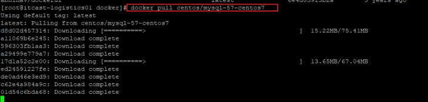

# 1- Docker介绍

## 1-1 什么是虚拟化

- <span style="color:red;background:white;font-size:20px;font-family:楷体;">虚拟化简单讲，就是把一台  物理  计算机虚拟成多台  逻辑  计算机，每个逻辑计算机里面可以运行不同的操作系统，相互不受影响，这样就可以充分利用硬件资源。</span>


## 1-2 初识Docker

- Docker是一种[容器技术]()，解决软件跨环境迁移的问题；
- 轻量级，可移植的[容器]()
- 容器是完全使用沙箱机制，相互隔离；
- 容器性能[开销极低]()


## 1-3 容器与虚拟机的比较


| 特性         | 虚拟机                       | 容器                   |
| ------------ | ---------------------------- | ---------------------- |
| 隔离级别     | 操作系统级                   | [进程级]()             |
| 隔离策略     | 运行于Hypervisor上           | 直接运行在宿主机内核中 |
| 系统资源     | 5-15%                        | [0-5%]()               |
| 启动速度     | 慢，分钟级                   | [快，秒级]()           |
| 占用磁盘空间 | 非常大，GB-TB级              | 小，KB-MB甚至KB级      |
| 并发性       | 一台宿主机十几个，最多几十个 | 上百个，甚至上百上千个 |
| 高可用策略   | 备份、容灾、迁移             | [弹性、负载、动态]()   |


# 2- Docker组件

## 2-1 Docker服务端和客户端

- Docker是一个[客户端-服务端]()（C/S）架构程序
  - 1- Docker客户端只需要向Docker服务端或者守护进程发出请求;
  - 2- 服务端或者守护进程完成所有工作返回结果;
  - 3- Docker提供了一个命令行工具Docker以及一整套的RestfuAPI;
  - 4- 可以在同一台宿主机器上运行Docker守护进程或者客户端;
  - 5- 也可以从本地的Docker客户端连接到运行在另一台宿主机上的远程Docker守护进程


- [四个角色]()
  - [Server]() ：一个常驻进程；
  - REST API： 实现了client和server间的[交互协议]()；
  - [CLI]() ： 实现容器和镜像的管理，为用户提供统一的操作界面；
  - [registry](): [注册中心 / 远端仓库]()，提供所有的images


## 2-2 Docker构架

- [build指令]()构建容器，发送指令给服务器，服务器去寻找image,去构建一个容器；
- 客户端发送[pull指令]()，由服务器去注册中心拉取可用的image,（类似于maven,去远程仓库下载可用的jar包）
- 客户端发送[run指令]()，由服务器端将刚刚构建好的容器运行起来；


### 2-2-1 Docker镜像

- 镜像（Image）就是[一堆只读层（read-only layer）的统一视角]()；
- 对于用户来说, 我们所见到的最终Image 就是顶层被叠加的可读写层, 一切的东西 都在底下被多个只读层叠加完成.


### 2-2-2 Docker容器

- 大白话: <span style="color:red;background:white;font-size:20px;font-family:楷体;">image不运行起来就是一份文件一份数据, [运行起来image 就是一个容器]().</span>

- 容器是从镜像创建的运行实例;
  - 它可以被启动、开始、停止、删除。
- 每个容器都是[相互隔离的、保证安全]()的平台;

- 创建Container首先要有Image，也就是说Container是通过image创建的;
- 每叠加一层叫：[Container layer]()；

#### 2-2-2-1 Image跟Container的职责区别：

- Image负责[APP的存储和分发]();
- Container负责[运行APP]()。

#### 2-2-2-2 结论

- [容器 = 镜像 + 读写层]()。并且容器的定义并没有提及是否要运行容器


### 2-2-3 Registry（注册中心）(公共镜像(image)仓库)

- 官方的Registry的网址是: https://hub.docker.com


# 3- Docker总结

## 3-1 什么是Docker？

- 使用最广泛的开源 [容器引擎]()
- 一种操作系统的虚拟化技术linux内核 (运行的时最精简的Linx内核)
- 依赖于linux内核特性：<span style="color:red;background:white;font-size:20px;font-family:楷体;">NameSpace和Cgroups(限制资源，如：CPU，内核)</span>；
- 一个简单的[应用程序打包工具]()


## 3-2 作用和目的

- 提供简单的应用程序打包工具；

- 开发人员和运维人员[职责逻辑分离]()；

- 多环境保持一致，消除环境的差异；


## 3-3 Docker的应用场景

- 应用程序的打包和发布；

- 应用程序的隔离；

- 持续集成；

- 部署微服务；

- 快速搭建测试环境；

- 提供PaaS平台级别产品；


## 3-4 容器带来的好处有哪些

- 秒级的交付和部署；

- 保证环境一致性；

- 高效的资源利用；

- 弹性的伸缩；

- 动态调度迁移成本低；


## 3-5 需要注意的内容

- <span style="color:red;background:white;font-size:20px;font-family:楷体;">Docker[本身并不是容器]()，它是创建容器的工具，是[应用容器引擎]()</span>

- 第一句，是“Build, Ship and Run”。也就是，<span style="color:red;background:white;font-size:20px;font-family:楷体;">“搭建、发送、运行”</span>，三板斧。

- 第二句口号就是：“Build once，Run anywhere（搭建一次，到处能用）”

- Docker技术的三大核心概念，分别是：

  - 镜像（Image）

  - 容器（Container）

  - 仓库（Repostitory）

# 4- Docker的安装和启动


## 4-1 安装Docker

​		Docker官方建议在 Ubuntu 中安装，因为Docker是基于Unbantu发布的，而且一般Docker出现的问题Ubuntu是最先更新或者打补丁的，在很多版本的Centos中是不支持更新最新的一些补丁包的。

​		由于我们学习的环境都使用的Centos，因此这里将Docker安装到Centos上，注意：建议安装在Centos7.x以上的版本，在Centos6.x的版本中，安装前需要安装其他很多的环境，而且Docker很多补丁不支持更新。

### 4-1-1 验证Linux内核版本

Docker要求Linux的Kernel版本必须大于3.8，推荐使用3.10及更高，所以需要先验证CentOS的内核是否大于3.8。

- 使用uname命令验证

| uname -r                              |
| ------------------------------------- |
|  |

 

### 4-1-2  卸载已安装的Docker

​		如果已经安装过Docker，请先卸载，再重新安装，来确保整体的环境是一致的。由于这个虚拟机是新创建的，所以并没有安装过Docker，但如果同学们使用已有的虚拟机，则需要按照下面的命令卸载。

- 使用yum卸载Docker库

| yum remove docker docker-client docker-client-latest docker-common docker-latest docker-latest-logrotate docker-logrotate docker-engine |
| ------------------------------------------------------------ |
|                         |

### 4-1-3  安装yum工具包和存储驱动

| yum instal-y yum-utils device-mapper-persistent-data lvm2 |
| --------------------------------------------------------- |
|                      |

### 4-1-4  安装Docker的yum源

| yum-config-manager --add-repo https://download.docker.com/linux/centos/docker-ce.repo |
| ------------------------------------------------------------ |
|                                       |
| 如果连接超时，可以使用alibaba源                              |
| yum-config-manager --add-repo http://mirrors.aliyun.com/docker-ce/linux/centos/docker-ce.repo |

### 4-1-5  安装Docker-19.03.5

| yum instaldocker-ce docker-ce-cli containerd.io |
| ----------------------------------------------- |
|                          |

### 4-1-6  启动docker

| sudo service docker start |
| ------------------------- |
|    |

### 4-1-7  设置开机启动

| systemctenable docker   |
| ----------------------- |
|  |

### 4-1-8  将指定用户添加到用户组

| usermod -aG docker root              |
| ------------------------------------ |
|               |
| 退出，然后重新登录，以便让权限生效。 |

 

### 4-1-9  安装后查看Docker版本

| docker version          |
| ----------------------- |
|  |

## 4-2  Docker的启动和停止

| 操作               | 指令                   |
| ------------------ | ---------------------- |
| 启动docker         | systemctstart docker   |
| 停止docker         | systemctstop docker    |
| 重启docker         | systemctrestart docker |
| 查看docker状态     | systemctstatus docker  |
| 开机启动           | systemctenable docker  |
| 查看docker概要信息 | docker info            |
| 查看docker帮助文档 | docker --help          |

### 1.3  配置阿里云镜像加速

操作步骤：

| 操作步骤 | 说明                                                         |
| -------- | ------------------------------------------------------------ |
| 1        | 鉴于国内网络问题，后续拉取 Docker 镜像十分缓慢，我们可以需要配置加速器来解决 |
| 1        | https://help.aliyun.com/product/60716.html                   |
| 2        | 注册一个属于自己的阿里云账户(可复用淘宝账号)                 |
| 2        | 登陆阿里云开发者平台                                         |
| 2        | https://cr.console.aliyun.com/cn-hangzhou/instances/mirrors  |
| 2        | 获取加速器地址                                               |
| 2        |  |
| 3        | 配置本机Docker运行镜像加速器                                 |
| 3        | 阿里云的本人自己账号的镜像地址(需要自己注册有一个属于你自己的)：  https://xxxx.mirror.aliyuncs.comvim /etc/docker/daemon.json |
| 3        |  |
| 4        | 重启daemon服务                                               |
| 4        | systemctdaemon-reload                                        |
| 5        | 重启Docker服务                                               |
| 5        | systemctrestart docker                                       |
| 6        | Linux 系统下配置完加速器需要检查是否生效                     |
| 6        | systemctstatus docker                                        |
| 6        |  |


# 5- Docker常用命令

请查看  文档 ： 02-Docker常用命令


# 6- Docker应用部署

- 总体步骤：
  - 搜索镜像
  - 拉取镜像
  - 查看镜像
  - 启动容器
  - 停止容器
  - 移除容器

## 6-1 MySQL部署

- Docker hub上查找mysql镜像

| docker search mysql      |
| ------------------------ |
|  |

 

- 从docker hub上(阿里云加速器)拉取mysql镜像到本地标签为5.7

| docker pulcentos/mysql-57-centos7 |
| --------------------------------- |
|           |

- 创建容器

| docker run -di --name=tensquare_mysq-p 3306:3306 -e MYSQL_ROOT_PASSWORD=123456 centos/mysql-57-centos7 |
| ------------------------------------------------------------ |
|                                      |
| -p 代表端口映射，格式为宿主机映射端口:容器运行端口           |
| -e 代表添加环境变量，MYSQL_ROOT_PASSWORD是root用户的登录密码 |

- 使用mysql客户端连接

 

 

## 6-2 Nginx部署

- Docker hub上查找nginx镜像

| docker search nginx      |
| ------------------------ |
|  |

 

- 从docker hub上(阿里云加速器)拉取nginx镜像到本地

| docker pulnginx          |
| ------------------------ |
|  |

- 创建nginx容器

| docker run -di --name=mynginx -p 80:80 nginx       |
| -------------------------------------------------- |
|                            |
| -p 代表端口映射，格式为宿主机映射端口:容器运行端口 |

- 打开浏览器访问

| [http://node1.itcast.cn/](http://itcast-logistics01/) |
| ----------------------------------------------------- |
|                               |

## 6-3 Redis部署

- Docker hub上查找redis镜像

| docker search redis:4.0  |
| ------------------------ |
|  |

 

- 从docker hub上(阿里云加速器)拉取redis镜像到本地

| docker pulredis:4.0      |
| ------------------------ |
|  |

- 创建redis容器

| docker run -di --name=myredis -p 6379:6379 redis:4.0 |
| ---------------------------------------------------- |
|                              |
| -p 代表端口映射，格式为宿主机映射端口:容器运行端口   |

- 使用redis-cli连接

| [docker exec -it myredis redis-cli]() |
| ------------------------------------- |
|               |

- 打开redis客户端连接redis服务器

 

- 测试[持久化文件生成]()（挂载目录的方式）

| 在宿主机创建目录                                             |
| ------------------------------------------------------------ |
| mkdir -p /export/docker/myredis/data/<br>mkdir -p /export/docker/myredis/conf/ |
| 在conf创建配置文件redis.conf                                 |
|                                      |
| 启动容器                                                     |
| docker run -p 6379:6379 -v /export/docker/myredis/data/:/data -v /export/docker/myredis/conf/redis.conf:/usr/local/etc/redis/redis.conf -d redis redis-server /usr/local/etc/redis/redis.conf --appendonly yes |
|                                      |
| 查看[持久化文件]()是否生成                                   |
| ls /export/docker/myredis/data/                              |
|                                      |


# 7- Docker迁移与备份

## 7-1 容器保存为镜像 commit

- 可以通过以下命令将[容器保存为镜像]()

| docker commit mynginx mynginx_image:1 |
| ------------------------------------- |
|               |

- 基于新创建的镜像创建容器

docker run -di  --name=mynginx2 -p 81:80 mynginx_image:1 

- 访问81端口

| [http://node1.itcast.cn:81/](http://itcast-logistics01:81/) |
| ----------------------------------------------------------- |
|                                     |

## 7-2 镜像备份打包成tar save -o

- 可以通过以下命令将镜像保存为tar文件

| docker save -o mynginx.tar mynginx_image |
| ---------------------------------------- |
| -o：表示output，输出的意思               |
|                  |


## 7-3 (使用别人的镜像)镜像恢复与迁移 load -i 

- 先删除掉mynginx_image镜像，然后执行此命令进行恢复

| docker rmi mynginx_image                       |
| ---------------------------------------------- |
|                        |
| 因为该镜像存在容器，所以先删除容器，在删除镜像 |

- 使用此命令进行恢复镜像

| docker load -i mynginx.tar                                   |
| ------------------------------------------------------------ |
|                                      |
| -i：表示输入的文件，执行后再次查看镜像，可以看到镜像已经恢复 |


# 8- Docker镜像

## 8-1 Docker镜像是什么

镜像是一种轻量级、可执行的独立软件包，[用来打包软件运行环境和基于运行环境开发的软件]()，它包含运行某个软件所需的所有内容，包括代码、运行时、库、环境变量和配置文件。

### 8-1-1 UnionFS（[联合文件系统]()）

UnionFS（联合文件系统）：Union文件系统（UnionFS）是一种分层、轻量级并且高性能的文件系统，它[支持对文件系统的修改作为一次提交来一层层的叠加]()，同时可以将不同目录挂载到同一个虚拟文件系统下(unite severadirectories into a single virtuafilesystem)。

Union 文件系统是 Docker 镜像的基础。镜像可以通过分层来进行继承，基于基础镜像（没有父镜像），可以制作各种具体的应用镜像。

 

[特性]()：一次同时加载多个文件系统，但从外面看起来，只能看到一个文件系统，联合加载会把各层文件系统叠加起来，这样最终的文件系统会包含所有底层的文件和目录


### 8-1-2 Docker镜像加载原理

docker的镜像实际上由一层一层的文件系统组成，这种[层级的文件系统UnionFS]()。

- [bootfs(boot file system)]()主要包含[bootloader]()和kernel, bootloader主要是引导加载kernel, Linux刚启动时会加载bootfs文件系统，在Docker镜像的最底层是bootfs。这一层与我们典型的Linux/Unix系统是一样的，包含boot加载器和内核。当boot加载完成之后整个内核就都在内存中了，此时内存的使用权已由bootfs转交给内核，此时系统也会卸载bootfs。

- [rootfs (root file system)]() ，在bootfs之上。包含的就是典型 Linux 系统中的 /dev, /proc, /bin, /etc 等标准目录和文件。rootfs就是各种不同的操作系统发行版，比如Ubuntu，Centos等等。

[平时我们安装进虚拟机的CentOS都是好几个G，为什么docker这里才200M？？]()

 

​		对于一个精简的OS，rootfs可以很小，只需要包括最基本的命令、工具和程序库就可以了，因为底层直接用Host的kernel，自己只需要提供 rootfs 就行了。由此可见对于不同的linux发行版, bootfs基本是一致的, rootfs会有差别, 因此不同的发行版可以公用bootfs。

### 8-1-3 分层的镜像

以我们的pull为例，在下载的过程中我们可以看到docker的镜像好像是在一层一层的在下载

 

### 8-1-4 为什么 Docker 镜像要采用这种分层结构

[最大的一个好处就是共享资源]()

比如：有多个镜像都从相同的 base 镜像构建而来，那么宿主机只需在磁盘上保存一份base镜像，

同时内存中也只需加载一份 base 镜像，就可以为所有容器服务了。而且镜像的每一层都可以被共享。


### 8-2 Docker镜像的特点

- Docker镜像都是[只读]()的

- 当容器启动时，一个新的[可写层被加载到镜像的顶部]()

- 这一层通常被称作“[容器层]()”，“容器层”之下的都叫“镜像层”
- docker分层的好处：[资源共享]()

 

# 9- Dockerfile

## 9-1 什么是Dockerfile

### 9-1-1 介绍

- 类似于[MakeFile]()

- [Dockerfile是由一系列命令和参数构成的脚本，这些命令应用于基础镜像并最终创建一个新的镜像]()

- 大白话: [通过Dockerfile 可以被打包成image](), 就类似写的java代码, 可以被打包成jar

- Image运行时容器, 我们打包的jar 运行时一个jvm进程

 

比如：

- 对于开发人员：可以为开发团队提供一个完全一致的开发环境

- 对于测试人员：可以直接拿开发时所构建的镜像或者通过Dockerfile文件构建一个新的镜像开始工作

- 对于运维人员：在部署时，可以实现应用的无缝移植

### 9-1-2 Dockerfile构建步骤

- 编写Dockerfile文件

- docker build

- docker run

### 9-1-3 Dockerfile文件内容

以熟悉的centos为例：

| https://hub.docker.com/_/centos/ |
| -------------------------------- |
|          |
|          |

 

## 9-2 DockerFile构建过程解析

### 9-2-1 Dockerfile内容基础知识

- 每条保留字指令都必须为大写字母且后面要跟随至少一个参数

- 指令按照从上到下，顺序执行

- #表示注释

- 每条指令都会创建一个新的镜像层，并对镜像进行提交

 

### 9-2-2 Docker执行Dockerfile的大致流程

- docker从[基础镜像]()运行一个容器

- 执行一条指令并对容器作出修改

- 执行类似[docker commit]()的操作提交一个[新的镜像层]()

- docker再基于刚提交的镜像运行一个[新容器]()

- 执行dockerfile中的下一条指令直到所有指令都执行完成

### 9-2-3 总结

从应用软件的角度来看，[**Dockerfile 、Docker镜像与Docker容器**]()分别代表软件的三个不同阶段，

- Dockerfile 是软件的[**原材料**]()
- Docker镜像 是软件的[**交付品**]() 
- Docker容器 则可以认为是软件的[**运行状态**]()。

**Dockerfile面向[开发]()，Docker镜像成为[交付标准]()，Docker容器则涉及部署与运维，三者缺一不可，合力充当Docker体系的基石。**

 

Dockerfile，需要定义一个Dockerfile，Dockerfile定义了进程需要的一切东西。Dockerfile涉及的内容包括执行代码或者是文件、环境变量、依赖包、运行时环境、动态链接库、操作系统的发行版、服务进程和内核进程(当应用进程需要和系统服务和内核进程打交道，这时需要考虑如何设计namespace的权限控制)等等;

Docker镜像，在用Dockerfile定义一个文件之后，docker build时会产生一个Docker镜像，当运行 Docker镜像时，会真正开始提供服务;

Docker容器，容器是直接提供服务的。

 

## 9-3 常用命令

 

| 命令                                   | 作用                                                         |
| -------------------------------------- | ------------------------------------------------------------ |
| **FROM** image_name:tag                | 定义了使用哪个[**基础镜像**]()启动构建流程                   |
| **MAINTAINER** user_name               | 声明镜像的[**创建者**]()，创建者的用户名和邮箱地址           |
| **ENV** key value                      | 设置[**环境变量**]()（可以写多条）                           |
| **RUN** command                        | 是Dockerfile的[**核心**]()部分（可以写多条）                 |
| **ADD** source_dir/file dest_dir/file  | 将[**宿主机的文件复制到容器内**]()，如果是一个压缩文件，将会在复制后[**自动解压**]() |
| **COPY** source_dir/file dest_dir/file | 和ADD相似，但是如果有压缩文件并[**不能解压**]()              |
| **WORKDIR** path_dir                   | 设置[**工作目录**]()                                         |

### 9-3-1  FROM

指明构建的新镜像是来自于哪个[**基础镜像**]()，例如：

``` shell
FROM centos: latest
```


### 9-3-2  MAINTAINER

指明镜像维护着及其联系方式（一般是邮箱地址），例如：

``` shell
MAINTAINER JC Zhang <zhangsan@163.com>
```

不过，MAINTAINER并不推荐使用，更推荐使用LABEL来指定镜像作者，例如：

``` shell
LABEmaintainer="zhangsan.cn"
```


### 9-3-3  RUN

**[构建镜像]()**时运行的**[Shell命令]()**，例如：

``` shell
RUN ["yum", "install", "httpd"] 
RUN yum instalhttpd
```


### 9-3-4  CMD 开机启动

**[启动容器]()**时执行的**[Shell命令]()**，例如：

``` shell
## Exec格式
# CMD ["执行命令"，"参数1","参数N"]
CMD ["ls", "/tmp"]   # ls /tmp

# CMD ["参数1","参数N"]  可以将参数传递给ENTRYPOINT,作为它的默认参数，此时ENTRYPOINT必须使用Exec 格式。
CMD ["heihei"]


## shell 格式
# CMD command param1 param2  
CMD ls /tmp
```


### 9-3-5  EXPOSE

声明容器运行的**[服务端口]()**，例如：

``` shell
EXPOSE 80 443
```


### 9-3-6  ENV

设置环境内**[环境变量]()**，例如：

``` shell
ENV MYSQL_ROOT_PASSWORD 123456 

ENV JAVA_HOME /usr/local/jdk1.8.0_45
```


### 9-3-7  ADD

[**拷贝文件或目录到镜像**]()中，例如：

``` shell
ADD <src>...<dest>
ADD html.tar.gz /var/www/html
ADD https://xxx.com/html.tar.gz /var/www/html
```

PS：如果是URL或压缩包，[**会自动下载或自动解压**]()。


### 9-3-8  COPY

[**拷贝文件或目录到镜像中**]()，用法同ADD，只是[**不支持自动下载和解压**]()，例如：

``` shell
COPY ./start.sh /start.sh
```


### 9-3-9  ENTRYPOINT 开机启动

**[启动容器时执行的Shell命令]()**，同CMD类似，只是由ENTRYPOINT启动的程序不会被docker run命令行指定的参数所覆盖，而且，这些命令行[**参数会被当作参数传递给ENTRYPOINT指定指定的程序**]()，例如：

``` shell
## Exec 格式:
ENTRYPOINT ["/bin/bash", "-C", "/start.sh"]

## Shell 格式:
ENTRYPOINT /bin/bash -C '/start.sh'
```

PS：Dockerfile文件中也可以存在多个ENTRYPOINT指令，但仅有**[最后一个会生效。]()**


### 9-3-10  VOLUME

指定容器[**挂载**]()点到宿主机自动生成的目录或其他容器，例如：

``` shell
VOLUME ["/var/lib/mysql"]
```


PS：一般不会在Dockerfile中用到，更常见的还是在[**docker run的时候指定-v去挂载**]()。

### 9-3-11  WORKDIR

为RUN、CMD、ENTRYPOINT以及COPY和AND设置[**工作目录**]()，例如：

``` shell
WORKDIR /data
```


### 9-3-12 CMD 对比 ENTRYPOINT


``` shell
[root@tanghui docker]# vim Dockerfile 
FROM centos:7

#CMD ["echo","heihei"]  exec 格式
CMD ["heihei"]  # 仅参数， 给ENTRYPOINT提供默认参数值

# heihei 是ENTRYPOINT 的默认参数
ENTRYPOINT ["echo"]

```


## 9-4  使用脚本创建JDK镜像

### 9-4-1  编写Dockerfile

- 创建目录

``` shell
mkdir -p /export/docker/jdk8 
```


- 将jdk-8u241-linux-x64.tar.gz上传到服务器（虚拟机）中的/export/docker/jdk8目录

- 创建文件Dockerfile


``` shell
cd /export/docker/jdk8/

vi Dockerfile

#依赖镜像名称和id
FROM centos:7
#指定镜像创建者信息
MAINTAINER tanghui
#切换工作目录
WORKDIR /usr
RUN mkdir /usr/local/java
#ADD 是相对路径jar，把java添加到容器中
ADD jdk-8u241-linux-x64.tar.gz /usr/local/java

#配置java环境变量
ENV JAVA_HOME /usr/local/java/jdk1.8.0_241
ENV JAR_HOME $JAVA_HOME/jre
ENV CLASSPATH $JAVA_HOME/lib/dt.jar:$JAVA_HOME/lib/tools.jar:$JRE_HOME/lib:$CLASSPATH
ENV PATH $JAVA_HOME/bin:$PATH
```


### 9-4-2  构建镜像 build

| 案例                                                      |
| --------------------------------------------------------- |
| docker build -t='jdk1.8' .  <br>docker build -t myjdk:1 . |
| 注意后面的空格和点，不要省略，点表示当前目录              |
|                                   |

### 9-4-3  查看镜像是否构建完成

 

## 9-5  自定义镜像mycentos

### 9-5-1  编写Dockerfile

- Hub默认centos镜像

 

 

- 准备编写DockerFile文件

vim  Dockerfile

``` shell
vim  Dockerfile
FROM centos:latest
MAINTAINER zhangjc<zhangjc@163.com>
 
ENV MYPATH /usr/local
WORKDIR $MYPATH
 
RUN yum -y install vim
RUN yum -y install net-tools
 
EXPOSE 80
 
CMD echo $MYPATH
CMD echo "success--------------ok"
CMD /bin/bash
```


### 9-5-2  构建镜像

| docker build -t mycentos:1.1 . |
| ------------------------------ |
|        |
|        |

### 9-5-3  运行镜像

| docker run -it mycentos:1.1 |
| --------------------------- |
|     |

# 10- Docker私有仓库

​		在 Docker 中，当我们执行 docker pulxxx 的时候 ，它实际上是从 **registry.hub.docker.com**这个地址去查找，这就是Docker公司为我们提供的公共仓库。

在工作中，我们不可能把企业项目push到公有仓库进行管理。所以为了更好的管理镜像，Docker不仅提供了一个中央仓库，同时也允许我们搭建本地私有仓库。这一篇介绍registry、harbor两种私有仓库搭建。

## 10-1  registry 的搭建

### 10-1-1  搭建

- Docker 官方提供了一个搭建私有仓库的镜像 registry ，只需把镜像下载下来，运行容器并暴露5000端口，就可以使用了。

| docker pulregistry:2                                         |
| ------------------------------------------------------------ |
|                                      |
| docker run -di -v /opt/registry:/var/lib/registry -p 5000:5000 --name myregistry registry:2 |
|                                      |
| Registry服务默认会将上传的镜像保存在容器的/var/lib/registry，我们将主机的/opt/registry目录挂载到该目录，即可实现将镜像保存到主机的/opt/registry目录了。 |

浏览器访问[http://node1.itcast.cn:5000/v2/_catalog](http://itcast-logistics01:5000/v2/_catalog)，出现下面情况说明registry运行正常。

| [http://node1.itcast.cn:5000/v2/_catalog](http://itcast-logistics01:5000/v2/_catalog) |
| ------------------------------------------------------------ |
|                                      |

### 10-1-2  **验证**

现在通过push镜像到registry来验证一下。

查看本地镜像：

| docker images            |
| ------------------------ |
|  |

要通过docker tag将该镜像标志为要推送到私有仓库：

| docker tag nginx:latest localhost:5000/nginx:latest |
| --------------------------------------------------- |
|                             |

通过 docker push 命令将 nginx 镜像 push到私有仓库中：

| docker push localhost:5000/nginx:latest |
| --------------------------------------- |
|                 |

访问 [http://node1.itcast.cn:5000/v2/_catalog\](http://itcast-logistics01:5000/v2/_catalog) 查看私有仓库目录，可以看到刚上传的镜像了：

| [http://node1.itcast.cn:5000/v2/_catalog](http://itcast-logistics01:5000/v2/_catalog) |
| ------------------------------------------------------------ |
|                                      |

下载私有仓库的镜像，使用如下命令：

docker pullocalhost:5000/镜像名:版本号 # 例如 docker pullocalhost:5000/nginx:latest

## 10-2 docker镜像推送到阿里云镜像仓库

首先需要有一个阿里云的账号

镜像仓库申请地址：https://cr.console.aliyun.com/cn-hangzhou/instances/repositories

 

### 20-2-1  容器镜像服务控制台概览

 

### 20-2-2  创建镜像仓库

 

### 20-2-3  选择本地仓库

 

### 20-2-4  点击管理

 

 

### 20-2-5  Docker登录阿里云容器镜像仓库

| $ sudo docker login --username=xxx@aliyun.com registry.cn-hangzhou.aliyuncs.com |
| ------------------------------------------------------------ |
|                                      |

### 20-2-6  推送创建的oracle11g_centos7镜像到阿里云镜像仓库

参考如下的命令

