## 任务节点类型和参数设置

### Shell节点

> shell节点，在worker执行的时候，会生成一个临时shell脚本，使用租户同名的linux用户执行这个脚本。

- 点击项目管理-项目名称-工作流定义，点击"创建工作流"按钮，进入DAG编辑页面。

- 工具栏中拖动到画板中，如下图所示：

  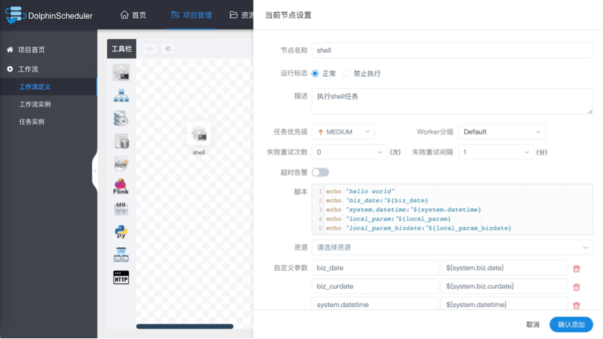

- 节点名称：一个工作流定义中的节点名称是唯一的。

- 运行标志：标识这个节点是否能正常调度,如果不需要执行，可以打开禁止执行开关。

- 描述信息：描述该节点的功能。

- 任务优先级：worker线程数不足时，根据优先级从高到低依次执行，优先级一样时根据先进先出原则执行。

- Worker分组：任务分配给worker组的机器机执行，选择Default，会随机选择一台worker机执行。

- 失败重试次数：任务失败重新提交的次数，支持下拉和手填。

- 失败重试间隔：任务失败重新提交任务的时间间隔，支持下拉和手填。

- 超时告警：勾选超时告警、超时失败，当任务超过"超时时长"后，会发送告警邮件并且任务执行失败.

- 脚本：用户开发的SHELL程序。

- 资源：是指脚本中需要调用的资源文件列表，资源中心-文件管理上传或创建的文件。

- 自定义参数：是SHELL局部的用户自定义参数，会替换脚本中以${变量}的内容。

### 子流程节点

- 子流程节点，就是把外部的某个工作流定义当做一个任务节点去执行。

> 拖动工具栏中的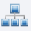任务节点到画板中，如下图所示：

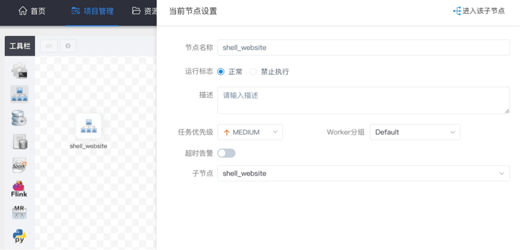

- 节点名称：一个工作流定义中的节点名称是唯一的
- 运行标志：标识这个节点是否能正常调度
- 描述信息：描述该节点的功能
- 超时告警：勾选超时告警、超时失败，当任务超过"超时时长"后，会发送告警邮件并且任务执行失败.
- 子节点：是选择子流程的工作流定义，右上角进入该子节点可以跳转到所选子流程的工作流定义

### 依赖(DEPENDENT)节点

- 依赖节点，就是**依赖检查节点**。比如A流程依赖昨天的B流程执行成功，依赖节点会去检查B流程在昨天是否有执行成功的实例。

> 拖动工具栏中的任务节点到画板中，如下图所示：

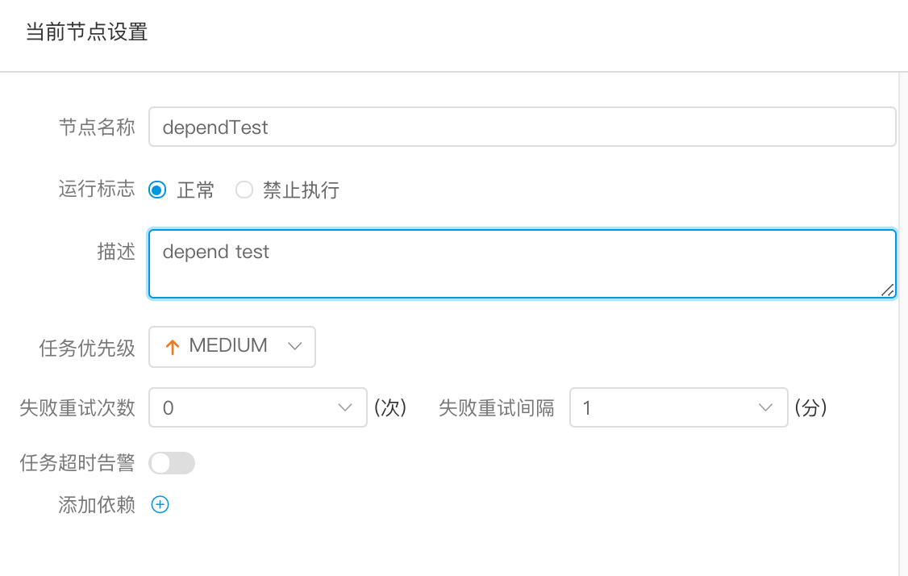

> 依赖节点提供了逻辑判断功能，比如检查昨天的B流程是否成功，或者C流程是否执行成功。

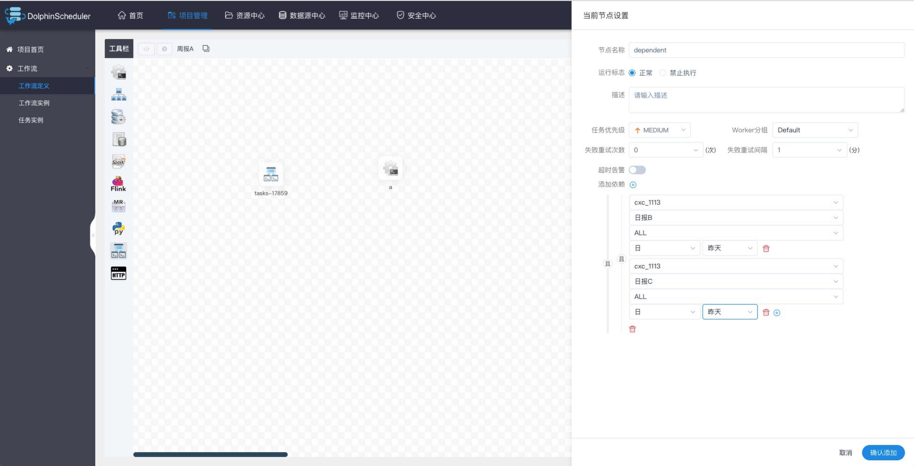

> 例如，A流程为周报任务，B、C流程为天任务，A任务需要B、C任务在上周的每一天都执行成功，如图示：

> 假如，周报A同时还需要自身在上周二执行成功：

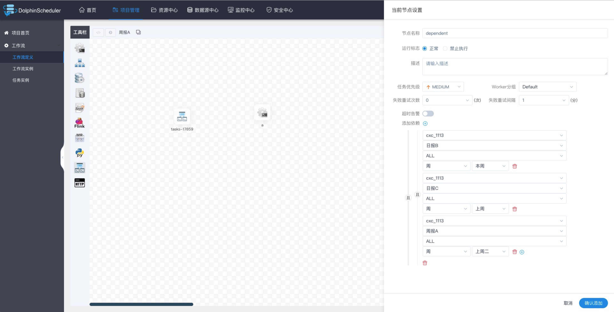

### 存储过程节点

- 根据选择的数据源，执行存储过程。

> 拖动工具栏中的任务节点到画板中，如下图所示：

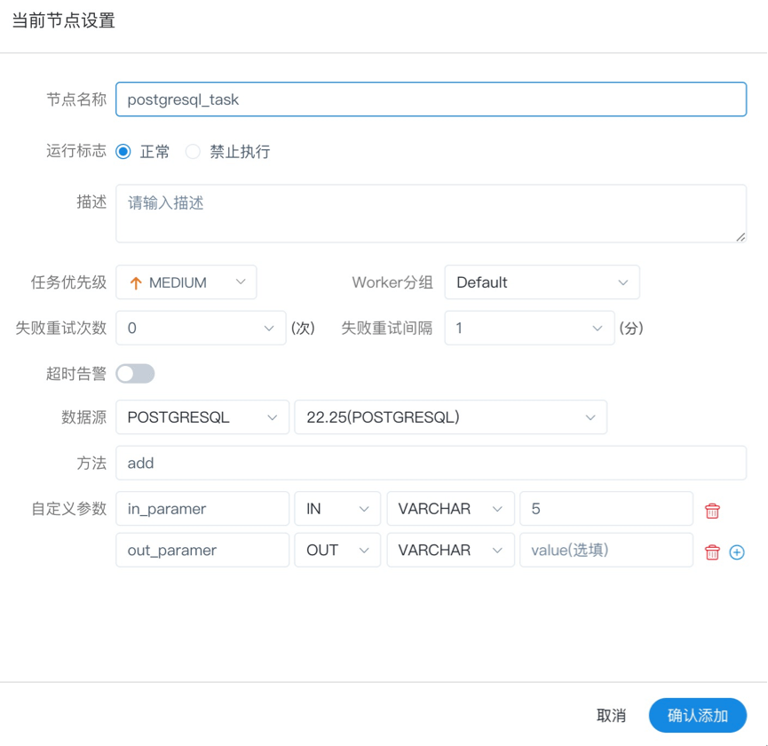

- 数据源：存储过程的数据源类型支持MySQL和POSTGRESQL两种，选择对应的数据源
- 方法：是存储过程的方法名称
- 自定义参数：存储过程的自定义参数类型支持IN、OUT两种，数据类型支持VARCHAR、INTEGER、LONG、FLOAT、DOUBLE、DATE、TIME、TIMESTAMP、BOOLEAN九种数据类型

### 节点

- 拖动工具栏中的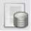任务节点到画板中
- 非查询SQL功能：编辑非查询SQL任务信息，sql类型选择非查询，如下图所示：

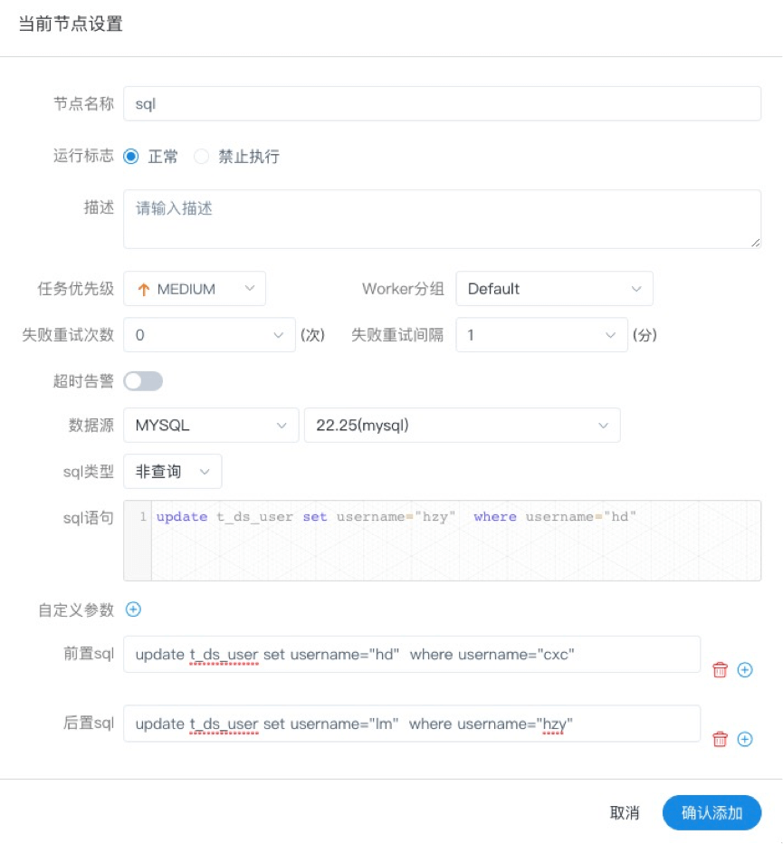

- 查询SQL功能：编辑查询SQL任务信息，sql类型选择查询，选择表格或附件形式发送邮件到指定的收件人，如下图所示。

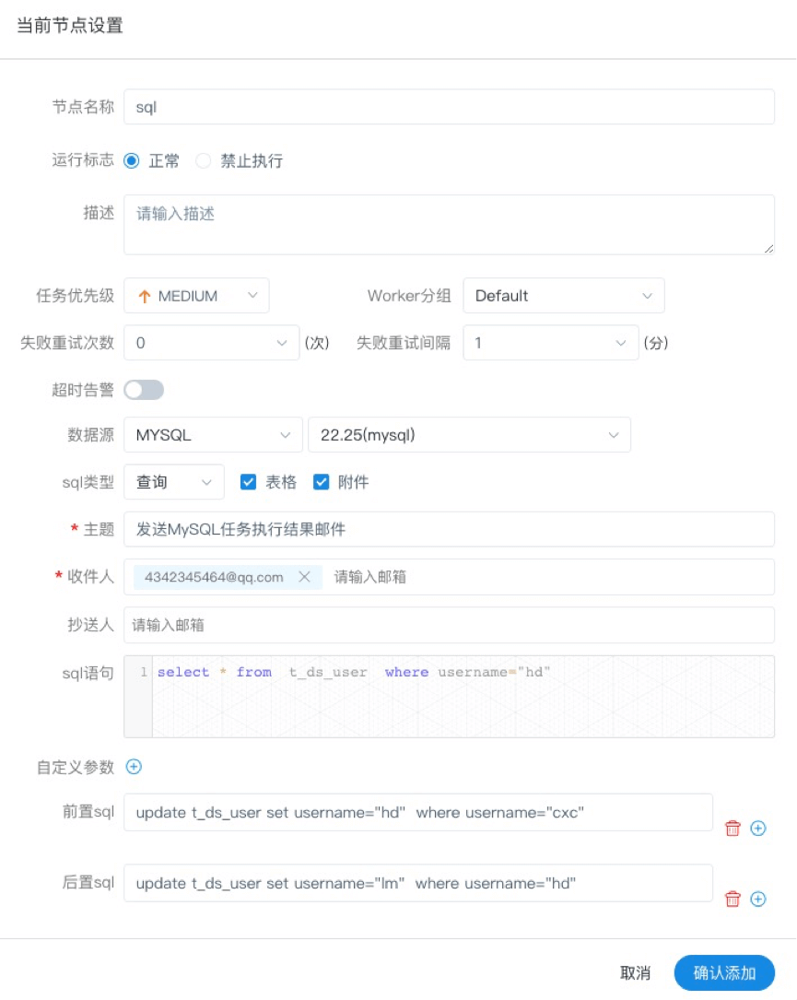

- 数据源：选择对应的数据源
- sql类型：支持查询和非查询两种，查询是select类型的查询，是有结果集返回的，可以指定邮件通知为表格、附件或表格附件三种模板。非查询是没有结果集返回的，是针对update、delete、insert三种类型的操作。
- sql参数：输入参数格式为key1=value1;key2=value2…
- sql语句：SQL语句
- UDF函数：对于HIVE类型的数据源，可以引用资源中心中创建的UDF函数,其他类型的数据源暂不支持UDF函数。
- 自定义参数：SQL任务类型，而存储过程是自定义参数顺序的给方法设置值自定义参数类型和数据类型同存储过程任务类型一样。区别在于SQL任务类型自定义参数会替换sql语句中${变量}。
- 前置sql:前置sql在sql语句之前执行。
- 后置sql:后置sql在sql语句之后执行。

### Spark节点

- 通过Spark节点，可以直接直接执行Spark程序，对于spark节点，worker会使用`spark-submit`方式提交任务

> 拖动工具栏中的任务节点到画板中，如下图所示：

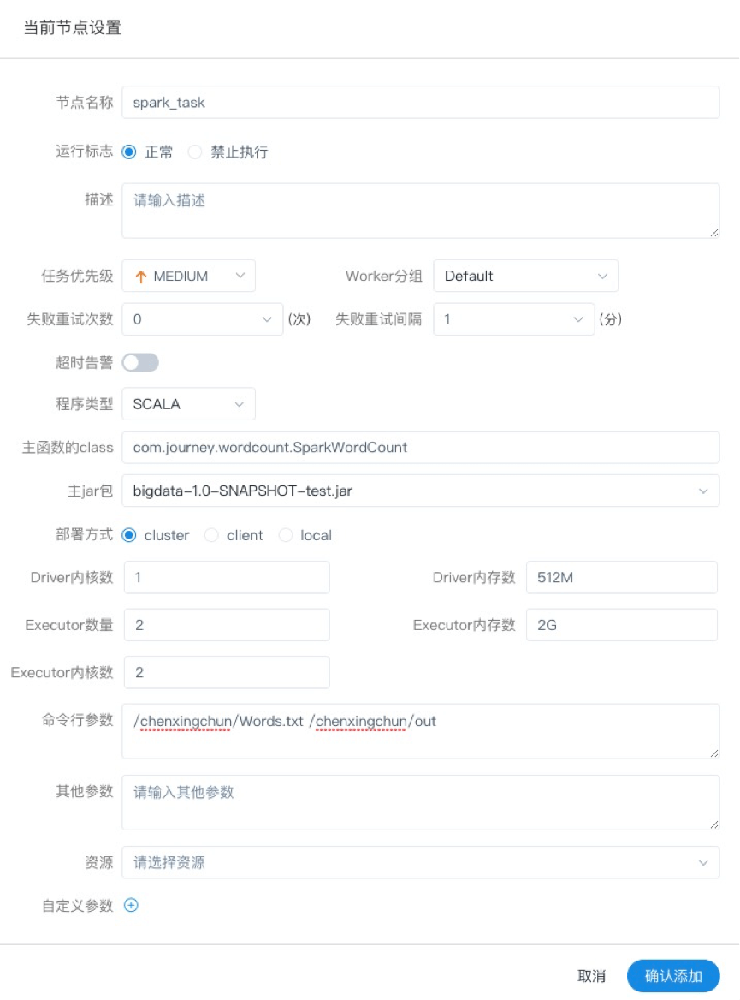

- 程序类型：支持JAVA、Scala和Python三种语言
- 主函数的class：是Spark程序的入口Main Class的全路径
- 主jar包：是Spark的jar包
- 部署方式：支持yarn-cluster、yarn-client和local三种模式
- Driver内核数：可以设置Driver内核数及内存数
- Executor数量：可以设置Executor数量、Executor内存数和Executor内核数
- 命令行参数：是设置Spark程序的输入参数，支持自定义参数变量的替换。
- 其他参数：支持 --jars、--files、--archives、--conf格式
- 资源：如果其他参数中引用了资源文件，需要在资源中选择指定
- 自定义参数：是MR局部的用户自定义参数，会替换脚本中以${变量}的内容

注意：JAVA和Scala只是用来标识，没有区别，如果是Python开发的Spark则没有主函数的class，其他都是一样

### MapReduce(MR)节点

- 使用MR节点，可以直接执行MR程序。对于mr节点，worker会使用`hadoop jar`方式提交任务

> 拖动工具栏中的任务节点到画板中，如下图所示：

1. JAVA程序

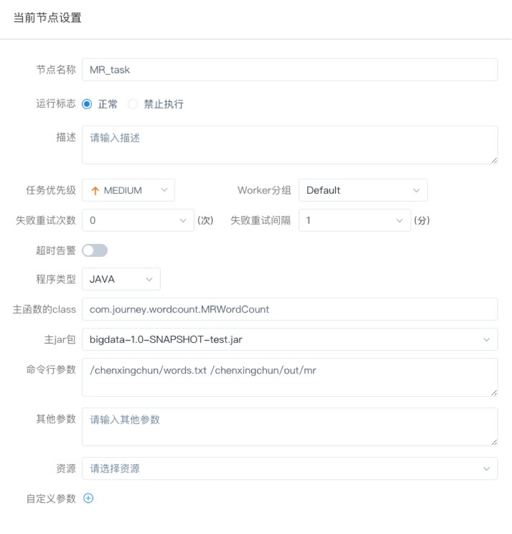

- 主函数的class：是MR程序的入口Main Class的全路径
- 程序类型：选择JAVA语言
- 主jar包：是MR的jar包
- 命令行参数：是设置MR程序的输入参数，支持自定义参数变量的替换
- 其他参数：支持 –D、-files、-libjars、-archives格式
- 资源： 如果其他参数中引用了资源文件，需要在资源中选择指定
- 自定义参数：是MR局部的用户自定义参数，会替换脚本中以${变量}的内容

1. Python程序

- 程序类型：选择Python语言
- 主jar包：是运行MR的Python jar包
- 其他参数：支持 –D、-mapper、-reducer、-input -output格式，这里可以设置用户自定义参数的输入，比如：
- -mapper "[mapper.py](http://mapper.py/) 1" -file [mapper.py](http://mapper.py/) -reducer [reducer.py](http://reducer.py/) -file [reducer.py](http://reducer.py/) –input /journey/words.txt -output /journey/out/mr/${currentTimeMillis}
- 其中 -mapper 后的 [mapper.py](http://mapper.py/) 1是两个参数，[第一个参数是mapper.py](http://xn--mapper-9m7iglm85bf76bbzbb87i.py/)，第二个参数是1
- 资源： 如果其他参数中引用了资源文件，需要在资源中选择指定
- 自定义参数：是MR局部的用户自定义参数，会替换脚本中以${变量}的内容

### Python节点

- 使用python节点，可以直接执行python脚本，对于python节点，worker会使用`python **`方式提交任务。

> 拖动工具栏中的任务节点到画板中，如下图所示：

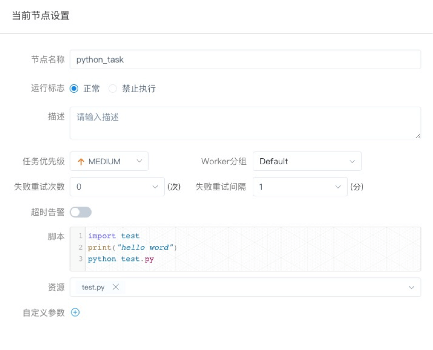

- 脚本：用户开发的Python程序
- 资源：是指脚本中需要调用的资源文件列表
- 自定义参数：是Python局部的用户自定义参数，会替换脚本中以${变量}的内容

### Flink节点

- 拖动工具栏中的任务节点到画板中，如下图所示：

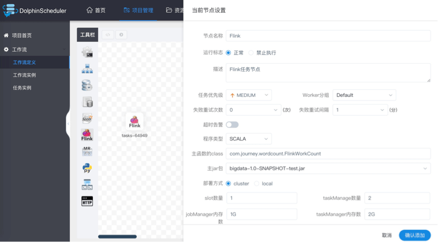

- 程序类型：支持JAVA、Scala和Python三种语言
- 主函数的class：是Flink程序的入口Main Class的全路径
- 主jar包：是Flink的jar包
- 部署方式：支持cluster、local三种模式
- slot数量：可以设置slot数
- taskManage数量：可以设置taskManage数
- jobManager内存数：可以设置jobManager内存数
- taskManager内存数：可以设置taskManager内存数
- 命令行参数：是设置Spark程序的输入参数，支持自定义参数变量的替换。
- 其他参数：支持 --jars、--files、--archives、--conf格式
- 资源：如果其他参数中引用了资源文件，需要在资源中选择指定
- 自定义参数：是Flink局部的用户自定义参数，会替换脚本中以${变量}的内容

注意：JAVA和Scala只是用来标识，没有区别，如果是Python开发的Flink则没有主函数的class，其他都是一样

### Http节点

- 拖动工具栏中的任务节点到画板中，如下图所示：

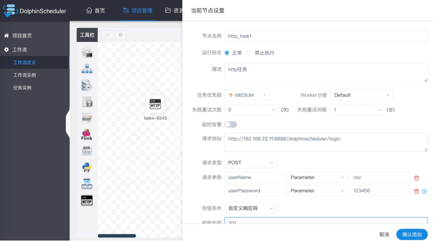

- 节点名称：一个工作流定义中的节点名称是唯一的。
- 运行标志：标识这个节点是否能正常调度,如果不需要执行，可以打开禁止执行开关。
- 描述信息：描述该节点的功能。
- 任务优先级：worker线程数不足时，根据优先级从高到低依次执行，优先级一样时根据先进先出原则执行。
- Worker分组：任务分配给worker组的机器机执行，选择Default，会随机选择一台worker机执行。
- 失败重试次数：任务失败重新提交的次数，支持下拉和手填。
- 失败重试间隔：任务失败重新提交任务的时间间隔，支持下拉和手填。
- 超时告警：勾选超时告警、超时失败，当任务超过"超时时长"后，会发送告警邮件并且任务执行失败.
- 请求地址：http请求URL。
- 请求类型：支持GET、POSt、HEAD、PUT、DELETE。
- 请求参数：支持Parameter、Body、Headers。
- 校验条件：支持默认响应码、自定义响应码、内容包含、内容不包含。
- 校验内容：当校验条件选择自定义响应码、内容包含、内容不包含时，需填写校验内容。
- 自定义参数：是http局部的用户自定义参数，会替换脚本中以${变量}的内容。