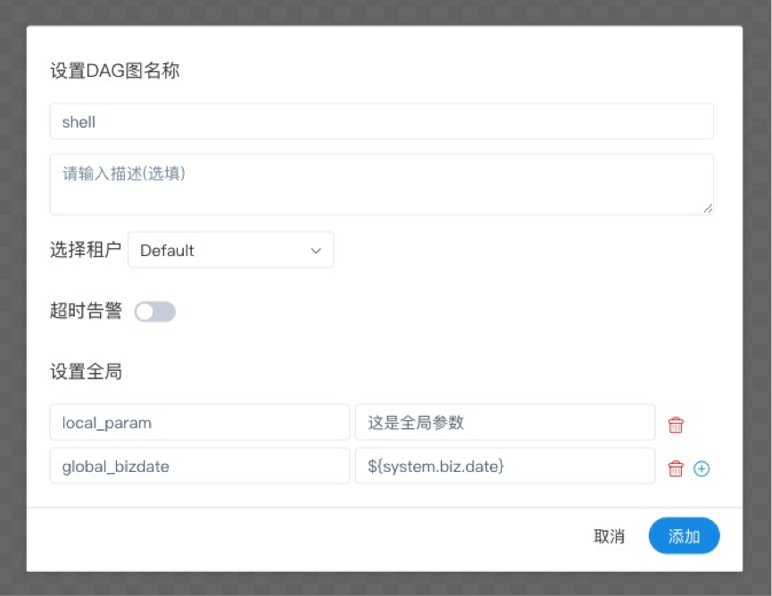
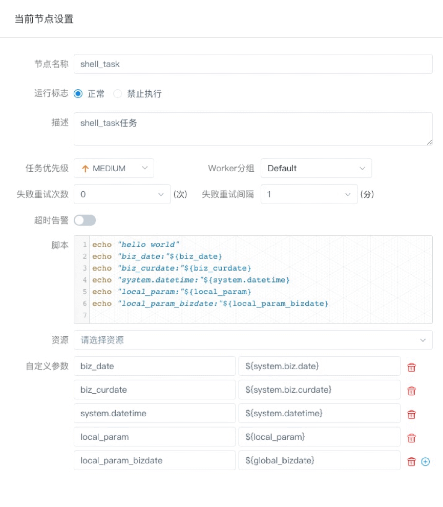

## 参数

###  系统参数

| 变量                  | 含义                                                         |
| --------------------- | ------------------------------------------------------------ |
| ${system.biz.date}    | 日常调度实例定时的定时时间前一天，格式为 yyyyMMdd，补数据时，该日期 +1 |
| ${system.biz.curdate} | 日常调度实例定时的定时时间，格式为 yyyyMMdd，补数据时，该日期 +1 |
| ${system.datetime}    | 日常调度实例定时的定时时间，格式为 yyyyMMddHHmmss，补数据时，该日期 +1 |

#### 时间自定义参数

- 支持代码中自定义变量名，声明方式：${变量名}。可以是引用 "系统参数" 或指定 "常量"。

- 我们定义这种基准变量为 [...] 格式的，[yyyyMMddHHmmss] 是可以任意分解组合的，比如：$[yyyyMMdd], $[HHmmss], $[yyyy-MM-dd] 等

- 也可以使用以下格式：

  ```
  * 后 N 年：$[add_months(yyyyMMdd,12*N)]
  * 前 N 年：$[add_months(yyyyMMdd,-12*N)]
  * 后 N 月：$[add_months(yyyyMMdd,N)]
  * 前 N 月：$[add_months(yyyyMMdd,-N)]
  * 后 N 周：$[yyyyMMdd+7*N]
  * 前 N 周：$[yyyyMMdd-7*N]
  * 后 N 天：$[yyyyMMdd+N]
  * 前 N 天：$[yyyyMMdd-N]
  * 后 N 小时：$[HHmmss+N/24]
  * 前 N 小时：$[HHmmss-N/24]
  * 后 N 分钟：$[HHmmss+N/24/60]
  * 前 N 分钟：$[HHmmss-N/24/60]
  ```

#### 用户自定义参数

- 用户自定义参数分为全局参数和局部参数。全局参数是保存工作流定义和工作流实例的时候传递的全局参数，全局参数可以在整个流程中的任何一个任务节点的局部参数引用。 例如：



- global_bizdate为全局参数，引用的是系统参数。



- 任务中local_param_bizdate通过${global_bizdate}来引用全局参数，对于脚本可以通过${local_param_bizdate}来引全局变量global_bizdate的值，或通过JDBC直接将local_param_bizdate的值set进去