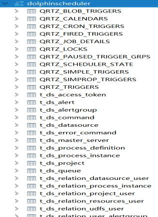
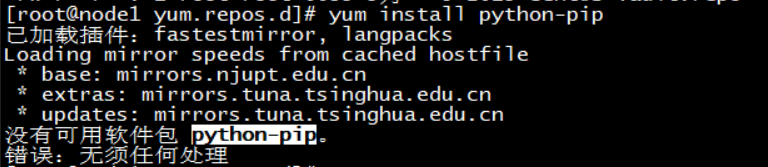
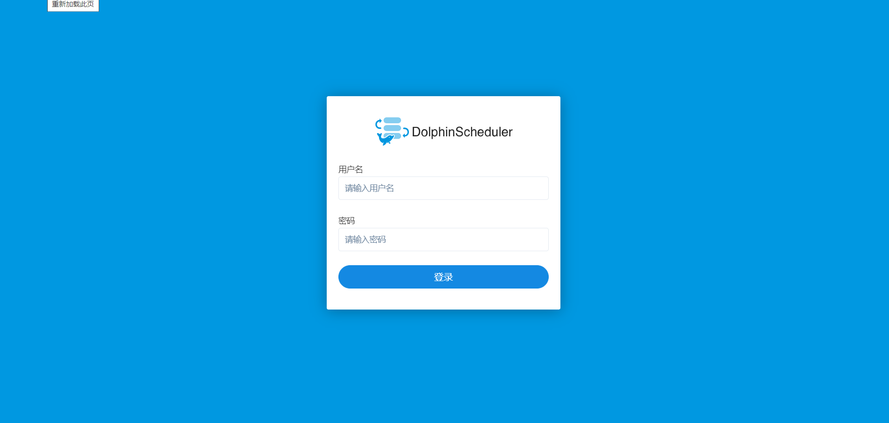
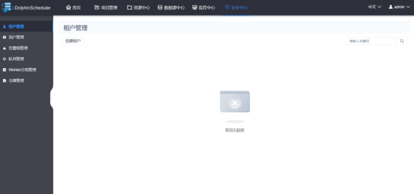

## DolphinScheduler安装

### 后端部署

#### 要求环境

| 软件              | 说明                                                         |
| ----------------- | ------------------------------------------------------------ |
| Mysql(5.5+)       | 必装                                                         |
| JDK(1.8+)         | 必装                                                         |
| ZooKeeper(3.4.6+) | 必装                                                         |
| Hadoop(2.6+)      | 选装，如果需要使用到资源上传功能，MapReduce任务提交则需要配置Hadoop(上传的资源文件目前保存在Hdfs上) |
| Hive(1.2.1)       | 选装，hive任务提交需要安装                                   |
| Spark(1.x,2.x)    | 选装，Spark任务提交需要安装                                  |
| Flink(1.x)        | 选装，Flink任务提交需要安装                                  |

> 注意：DolphinScheduler本身不依赖Hadoop、Hive、Spark、Flink、PostgreSQL,仅是会调用他们的Client，用于对应任务的运行。

##### 上传解压安装文件

1、创建 /export/servers/dolphinscheduler目录

2、将 apache-dolphinscheduler-incubating-1.2.0-dolphinscheduler-backend-bin.tar.gz 解压到 /export/servers/dolphinscheduler/dolphinscheduler-backend-1.2.0目录

tar zxvf apache-dolphinscheduler-incubating-1.2.0-dolphinscheduler-backend-bin.tar.gz -C  /export/servers/dolphinscheduler/dolphinscheduler-backend-1.2.0

##### 数据库初始化

1）创建数据库

```sql
CREATE DATABASE dolphinscheduler DEFAULT CHARACTER SET utf8 DEFAULT COLLATE utf8_general_ci;
SET GLOBAL validate_password_policy=LOW;
SET GLOBAL validate_password_length=1;
GRANT ALL PRIVILEGES ON dolphinscheduler.* TO 'root'@'%' IDENTIFIED BY '123456';
flush privileges;

# 官网:
mysql> CREATE DATABASE dolphinscheduler DEFAULT CHARACTER SET utf8 DEFAULT COLLATE utf8_general_ci;
mysql> GRANT ALL PRIVILEGES ON dolphinscheduler.* TO '{root}'@'%' IDENTIFIED BY '{123456}';
mysql> GRANT ALL PRIVILEGES ON dolphinscheduler.* TO '{root}'@'localhost' IDENTIFIED BY '{123456}';
mysql> flush privileges;
```

2）添加mysql的jar:mysql-connector-java-5.1.47.jar到$HOME/lib目录下

 

3）修改./conf/application-dao.properties中的下列属性

```properties
# mysql
spring.datasource.driver-class-name=com.mysql.jdbc.Driver
spring.datasource.url=jdbc:mysql://node03:3306/dolphinscheduler?useUnicode=true&characterEncoding=UTF-8
spring.datasource.username=root
spring.datasource.password=123456
```

4）建立软链接 （三个节点都需要建立软链接）

```shell
ln -s /export/server/jdk1.8.0_241/bin/java /usr/bin/java
```

5）执行创建表和导入基础数据脚本（$HOME目录下）

``` shell
sh script/create-dolphinscheduler.sh
```


 

##### 环境配置

1、修改conf/env/目录下的.dolphinscheduler_env.sh环境变量

```shell
export HADOOP_HOME=/export/server/hadoop-2.7.5/
export HADOOP_CONF_DIR=/export/server/hadoop-2.7.5/etc/hadoop
export SPARK_HOME1=/export/server/spark-2.4.5
#export SPARK_HOME2=/opt/soft/spark2
export PYTHON_HOME=/usr/bin/python
export JAVA_HOME=/export/server/jdk1.8.0_241
export HIVE_HOME=/export/server/hive-2.1.0
export FLINK_HOME=/export/server/flink-1.12.0
export PATH=$HADOOP_HOME/bin:$SPARK_HOME1/bin:$PYTHON_HOME:$JAVA_HOME/bin:$HIVE_HOME/bin:$FLINK_HOME/bin:$PATH
```

2、修改 install.sh 文件

```shell
# 这里填 mysql or postgresql
dbtype="mysql"
# 数据库连接地址 
dbhost="node03:3306" 
# 数据库名 
dbname="dolphinscheduler"

# 数据库用户名，此处需要修改为上面设置的{user}具体值 
username="root" 
# 数据库密码, 如果有特殊字符，请使用\转义，需要修改为上面设置的{passowrd}具体值 
passowrd="123456"
# conf/config/install_config.conf配置
# 注意：安装路径,不要当前路径(pwd)一样
installPath="/opt/soft/dolphinscheduler"

# 部署用户
# 注意：部署用户需要有sudo权限及操作hdfs的权限，如果开启hdfs，根目录需要自行创建
deployUser="root"

# zk集群
zkQuorum="node01:2181,node02:2181,node03:2181"

# 安装hosts
# 注意：安装调度的机器hostname列表，如果是伪分布式，则只需写一个伪分布式hostname即可
ips="node01,node02,node03"

# conf/config/run_config.conf配置
# 运行Master的机器
# 注意：部署master的机器hostname列表
masters="node01,node02"

# 运行Worker的机器
# 注意：部署worker的机器hostname列表
workers="node02,node03"

# 运行Alert的机器
# 注意：部署alert server的机器hostname列表
alertServer="node03"

# 运行Api的机器
# 注意：部署api server的机器hostname列表
apiServers="node01"

...
resUploadStartupType="HDFS"
defaultFS="hdfs://node01:8020"
# resourcemanager HA配置，如果是单resourcemanager,这里为yarnHaIps=""
yarnHaIps=""

# 如果是单 resourcemanager,只需要配置一个主机名称,如果是resourcemanager HA,则默认配置就好
singleYarnIp="node01"

# hdfs根路径，根路径的owner必须是部署用户。1.1.0之前版本不会自动创建hdfs根目录，需要自行创建
hdfsPath="/dolphinscheduler"

# 拥有在hdfs根路径/下创建目录权限的用户
# 注意：如果开启了kerberos，则直接hdfsRootUser=""，就可以
hdfsRootUser="root"
```

3、创建 hadoop 配置文件链接

```shell
ln -s /export/server/hadoop-2.7.5/etc/hadoop/hdfs-site.xml ./
ln -s /export/server/hadoop-2.7.5/etc/hadoop/core-site.xml ./
```

##### 自动部署

1、安装 pip

`yum -y install python-pip`

报错：

解决方法:

``` properties
// 升级epel源
[root@master yum.repos.d]# yum install https://dl.fedoraproject.org/pub/epel/epel-release-latest-7.noarch.rpm
已加载插件：fastestmirror
epel-release-latest-7.noarch.rpm                                                                   |  15 kB  00:00:00
正在检查 /var/tmp/yum-root-br3D7E/epel-release-latest-7.noarch.rpm: epel-release-7-12.noarch
/var/tmp/yum-root-br3D7E/epel-release-latest-7.noarch.rpm 将作为 epel-release-7-11.noarch 的更新
正在解决依赖关系
--> 正在检查事务
---> 软件包 epel-release.noarch.0.7-11 将被 升级
---> 软件包 epel-release.noarch.0.7-12 将被 更新
--> 解决依赖关系完成


// 重新安装
[root@master yum.repos.d]# yum install python-pip -y
已加载插件：fastestmirror
Loading mirror speeds from cached hostfile
epel/x86_64/metalink                                                                               | 6.1 kB  00:00:00
 * base: mirrors.aliyun.com
 * epel: mirrors.bfsu.edu.cn
 * extras: mirrors.aliyun.com
 * updates: mirrors.aliyun.com
epel                                                                                               | 4.7 kB  00:00:00
(1/3): epel/x86_64/group_gz                                                                        |  95 kB  00:00:00
(2/3): epel/x86_64/updateinfo                                                                      | 1.0 MB  00:00:01
(3/3): epel/x86_64/primary_db                                                                      | 6.9 MB  00:00:30
正在解决依赖关系
--> 正在检查事务
---> 软件包 python2-pip.noarch.0.8.1.2-14.el7 将被 安装
--> 正在处理依赖关系 python-setuptools，它被软件包 python2-pip-8.1.2-14.el7.noarch 需要


// 升级
[root@master yum.repos.d]# pip install --upgrade pip
Collecting pip
  Downloading https://files.pythonhosted.org/packages/cb/28/91f26bd088ce8e22169032100d4260614fc3da435025ff389ef1d396a433/pip-20.2.4-py2.py3-none-any.whl (1.5MB)
    100% |████████████████████████████████| 1.5MB 71kB/s
Installing collected packages: pip
  Found existing installation: pip 8.1.2
    Uninstalling pip-8.1.2:
      Successfully uninstalled pip-8.1.2
Successfully installed pip-20.2.4

```


2、安装kz工具

`pip install kazoo`

3、执行一键部署脚本

`sh install.sh`

##### JPS查看是否安装成功

| node01               | node02       | node03       |
| -------------------- | ------------ | ------------ |
| MasterServer         | MasterServer | AlertServer  |
| ApiApplicationServer | LoggerServer | LoggerServer |
|                      | WorkerServer | WorkerServer |

##### DolphinScheduler启停服务

```shell
bin/stop_all.sh
bin/start-all.sh
```

### 前端部署

#### 上传解压前端部署包

```shell
mkdir /export/servers/dolphinscheduler/dolphinscheduler-front-1.2.0
tar zxvf apache-dolphinscheduler-incubating-1.2.0-dolphinscheduler-front-bin.tar.gz -C /export/servers/dolphinscheduler/dolphinscheduler-front-1.2.0
```

##### 执行自动部署

- 自动部署脚本

  `sh ./install-dolphinscheduler-ui.sh`

- 配置端口为默认端口：8888



##### 登录到DolphinScheduler

URL:<u>http://node01:8888/view/login/index.html</u>

用户名密码：admin/dolphinscheduler123

 

### 启动前端服务（第二次启动dolphinscheduler）

后台：`start-all.sh`

前端:`systemctl restart nginx`

