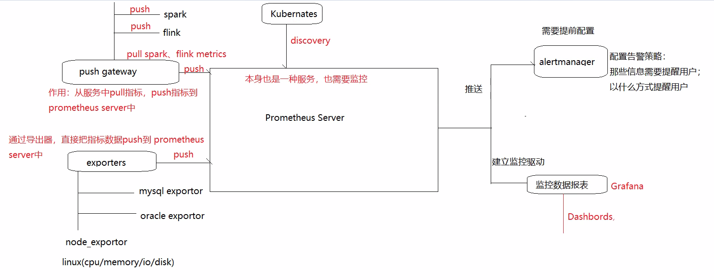
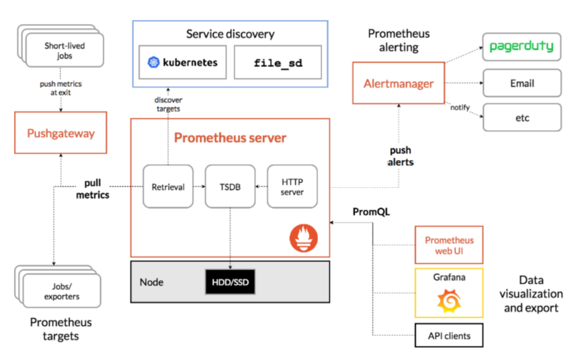
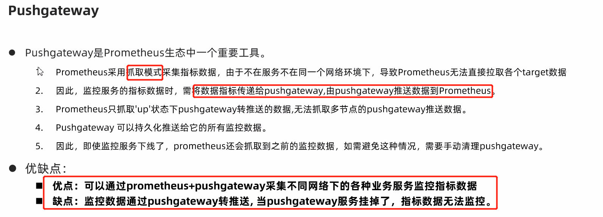
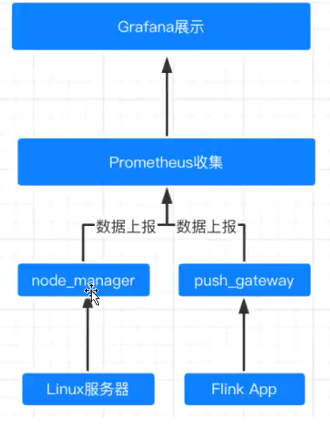

# 1- prometheus概述

- prometheus基于go语言实现的，开源系统监控和报警工具;

# 2- prometheus特征

- 一个**多维数据模型**，包含通过度量标准名称和**键/值对**标识的**时间序列数据**(TSDB) 
- **PromQL**，一种灵活的查询语言，使用此查询语言进行指标查询
- **不依赖分布式存储**，可以实现独立的单节点服务器
- 时间序列集合通过HTTP抓取模型
- 通过中间网关支持推送时间序列
- 通过服务发现或静态配置发现目标
- **支持多种图形和仪表板制作**

# 3- prometheus应用场景

## 3-1 适用场景

- **适用于监控机器、监控动态服务、微服务**
- Prometheus很好地记录任何纯数字时间序列。它既适用于以机器为中心的监视，也适用于高度动态的面向服务的体系结构的监视。在微服务场景下，对多维数据收集和查询的支持有非常大的优势。**适用于监控系统中断服务，快速诊断服务**Prometheus是为可靠性而设计的，它在使用的系统中断的情况下，可让快速诊断问题。每个Prometheus服务器都是独立的，而不依赖于网络存储或其他远程服务。当基础结构的其他部分损坏时，可以依赖它，并且无需设置扩展基础结构即可使用它。

## 3-2 不适用场景

- **不适合进行精确的数据采集与分析**

- Prometheus重视可靠性。即使在故障情况下，始终可以查看有关系统可用的统计信息。如果需要100％的准确性（例如按请求计费），则Prometheus不是很好的选择，因为所收集的数据可能不会足够详细和完整。在这种情况下，最好使用其他系统来收集和分析数据以进行计费，并使用Prometheus进行监视其他操作。

# 4- prometheus 架构图






## 4-1 架构细节

- Node
  - 服务器节点

- Prometheus server 
  - retrieval:恢复
  - TSDB:时序数据库，持久化时序数据
  - HTTP server：提供http访问服务

- Service discovery 
  - kubernetes：待被发现的k8s容器具体服务

- Pushgateway
  - 抓取网关组件：接收短暂任务已存在指标数据和接收监控任务指标数据

- Short-lived jobs
  - 短暂存在的任务，推送已存在的指标数据给pushgateway 

- Jobs exporters
  - 监控任务指标的exporter 

- AlertManger
  - 告警管理组件：推送prometheus服务配置的告警信息，推送到email或其他类型告警接

收服务器

- PromQL 
  - Prometheus查询语言：查询prometheus服务监控指标，使用prometheus web ui、 

grafana、API clients进行可视化


## 4-2 exporters

- 官网手册：**https://prometheus.io/docs/instrumenting/exporters/**

- 支持的exporter 

  - Databases 
    - Clickhouse exporter 
    - Driud exporter 
    - Elasticsearch exporter 
    - MongoDB exporter 
    - Mysql exporter 
    - Oracle DB exporter 
    - Redis exporter 
    - SQL exporter 
    - ... 

  - Hardware related 
    - NVIDIA GPU exporter 
    - IBM Z HMC exporter 
    - Windows exporter 
    - ... 
  - Messaging systems 
    - Kafka exporter 
    - RabbitMQ exporter 
    - ... 
  - Storage
    - Hadoop HDFS FSImage exporter 
    - GPFS exporter 

## 4-3 AlertManager

### 4-3-1 介绍

- AlertManager负责把告警发送给prometheus服务器，负责删除重复数据，分组，抑制，静默，高可用。**定义告警规则**，将报警信息以**邮件**或其他方式通知到用户。
- **报警**：指prometheus将监测到的异常事件发送给alertmanager，设置是否通知用户
- **通知**：指alertmanager发送异常事件的通知（email、webhook等）

### 4-3-2 核心概念

- Grouping
  - **分组**： 将性质类似的警报分类为单个通知。当许多系统同时发生故障，且同时触发数百数千个警报时，此功能特别有用。
- Inhibition
  - **抑制**： 当某些报警已启动，抑制报警通知
- Silences
  - **静默**：在给定的时间内容是报警信息静默，不会针对报警信息发出通知行为
- HighAvailability
  - **高可用**：设置集群模式

## 4-4 Pushgateway




# 5- prometheus安装

- 官网：**https://prometheus.io/**

- 下载prometheus(prometheus-2.26.0.linux-amd64.tar.gz)

  上传prometheus-2.26.0.linux-amd64.tar.gz，并解压

``` shell
# 解压安装包 
tar zxvf prometheus-2.26.0.linux-amd64.tar.gz -C /opt 

# 修改文件名 
mv /opt/prometheus-2.26.0.linux-amd64/ /opt/prometheus-2.26 

# 进入解压后的安装包 
cd /opt/prometheus-2.26
```


- 验证安装

``` shell
./prometheus --version 
```

- prometheus配置
  - prometheus.yml([root@node1 /opt/prometheus-2.26]$ **cat prometheus.yml**) 

``` properties
# 全局配置
# my global config
global:
# Set the scrape interval to every 15 seconds. Default is every 1 minute. 默认抓取间隔, 15秒向目标抓取一次数据
  scrape_interval:     15s 
  evaluation_interval: 15s # Evaluate rules every 15 seconds. The default is every 1 minute.每15秒按抓取规则抓取一次数据，默认每1分钟执行一次
  # scrape_timeout is set to the global default (10s).

# Alertmanager configuration  告警信息
alerting:
  alertmanagers:
  - static_configs:
    - targets:
      # - alertmanager:9093

# Load rules once and periodically evaluate them according to the global 'evaluation_interval'.定期执行抓取配置规则
rule_files:
  # - "first_rules.yml"
  # - "second_rules.yml"

# A scrape configuration containing exactly one endpoint to scrape:抓取对象配 置
# Here it's Prometheus itself.抓取prometheus本身的配置
scrape_configs:
  # The job name is added as a label `job=<job_name>` to any timeseries scraped from this config.
  - job_name: 'prometheus'

    # metrics_path defaults to '/metrics' 抓取默认路径：指标s
    # scheme defaults to 'http'.

    static_configs:
    - targets: ['localhost:9090']

```


# 6- Flink 整合prometheus 和 Grafana

## 6-1 组件结构

- Flink
  - Flink-Job
- prometheus
  - pushgateway
    - 收集Flink App中的metrics;
  - node_exporter
    - 收集Linux服务器中的metrics;
- Grafana 
  - 


## 6-2 架构草图



## 6-3 包下载

### 6-3-1 prometheus

- https://prometheus.io/download/
- https://github.com/prometheus/prometheus/releases/download/v2.40.6/prometheus-2.40.6.linux-amd64.tar.gz


### 6-3-2 pushgateway

- https://prometheus.io/download/
- https://github.com/prometheus/pushgateway/releases/download/v1.5.1/pushgateway-1.5.1.linux-amd64.tar.gz


### 6-3-3 node_exporter

- https://prometheus.io/download/

- https://github.com/prometheus/node_exporter/releases/download/v1.5.0/node_exporter-1.5.0.linux-amd64.tar.gz


## 6-4 Flink整合配置

### 6-4-1 拷贝flink 插件 jar包

- 拷贝flink的prometheus 插件 jar 包到lib

``` shell
cd ${FLINK_HOME}/plugins/metrics-prometheus/
cp flink-metrics-prometheus-1.14.3.jar ${FLINK_HOME}/lib  #如: /opt/apps/flink-1.14.3/lib
```

- 修改flink配置文件

``` shell
cd ${FLINK_HOME}/conf/
vim flink-conf.yaml
```

``` properties
#### 与 Prometheus 集成配置 ####

# pushgateway接口全路径
metrics.reporter.promgateway.class: org.apache.flink.metrics.prometheus.PrometheusPushGatewayReporter

# pushgateway 的主机名
metrics.reporter.promgateway.host: 10.1.10.110

# pushgateway 的端口
metrics.reporter.promgateway.port: 9091

# Flink metric 在前端展示的标签(前缀) 与 随机后缀
metrics.reporter.promgateway.jobName: hzwJob
metrics.reporter.promgateway.randomJobNameSuffix: true
metrics.reporter.promgateway.deleteOnShutdown: true

# 采集数据间隔时间
metrics.reporter.promgateway.interval: 30 SECONDS
```


