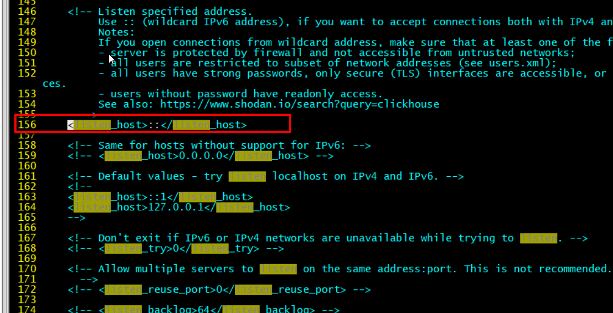
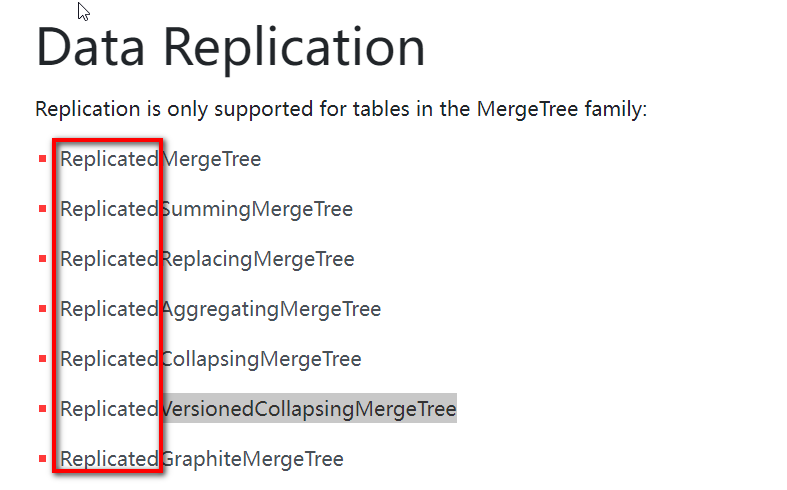

# 1- Clickhouse入门

## 1-1**ClickHouse** 的特点

### 1-1-1列式存储

### 1-1-2 DBMS 的功能

### 1-1-3 多样化引擎

### 1-1-4 高吞吐写入能力

### 1-1-5 数据分区与线程级并行

### 1-1-6 性能对比

# 2- ClickHouse 的安装

## 2-1 准备工作

### 

## 2-2 单机安装

- 打开vim /etc/clickhouse-server/config.xml  中的lister_host   （可以使用第三方可视化软件连接，如: DBeaver）



### 

# 3- 数据类型

- 查看类型 <font color='red'>toTypeName</font>

  ``` properties
  
  hadoop102 :) SELECT [1, 2] AS x, toTypeName(x);
  ```

  

# 4- 表引擎


## 4-1 表引擎的使用

## 4-2 TinyLog

## 4-3 Memory

## 4-4 MergeTree

- 手动合并数据

``` properties
 optimize table t_order_mt(表名) final;
```

## 4-5 ReplacingMergeTree

## 4-6 SummingMergeTree


# 5- SQL 操作


## 5-1 Insert 

## 5-2 Update 和 Delete

## 5-3 查询操作

## 5-3 查询操作

## 5-4 alter操作

## 5-5 导出数据


# 6- 副本


## 6-1 副本写入流程

## 6-2 配置步骤

- 官网:https://clickhouse.com/docs/en/engines/table-engines/mergetree-family/replication/



# 7- 分片集群


## 7-1 集群写入流程（3分片2副本共6个节点）

## 7-2 集群读取流程（3分片2副本共6个节点）


