[TOC]


# 0-上传jar包

## 0-1 登录OSS

https://oss.console.aliyun.com/overview

## 0-2 上传jar包

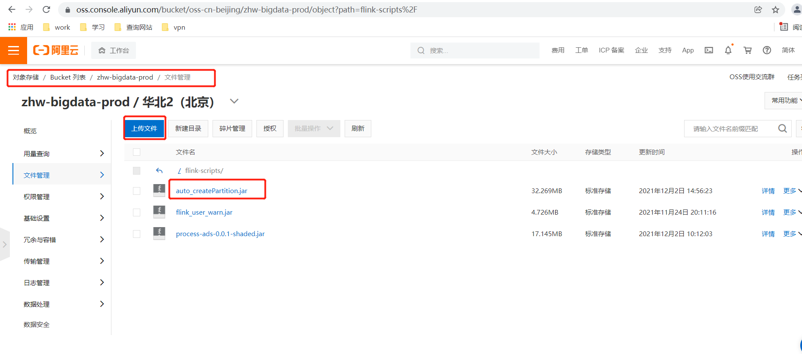

- <font color='red'>**注意: 我这里上传的路径是 flink-scripts** </font>

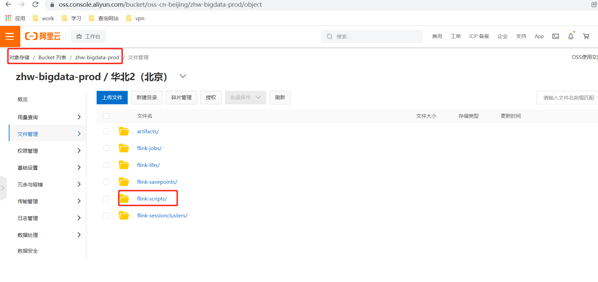

## 0-3 可以直接拖拽上传

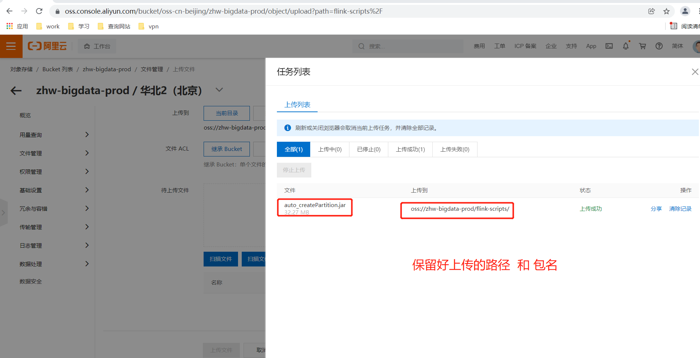

- 路径:    <font color='red'>oss</font>://zzz-bigdata-prod/flink-scripts/
- 报名:    auto_createPartition.jar


# 1- 登录

https://emr.console.aliyun.com/?spm=a2csc.24006655.favorite.demr.68ef28d06Nq5TQ#/cn-beijing


https://emr.console.aliyun.com/?spm=a2cug.25127996.0.0.2a0a24cdNfoO0H#/cn-beijing/data-dev

# 2- 数据开发

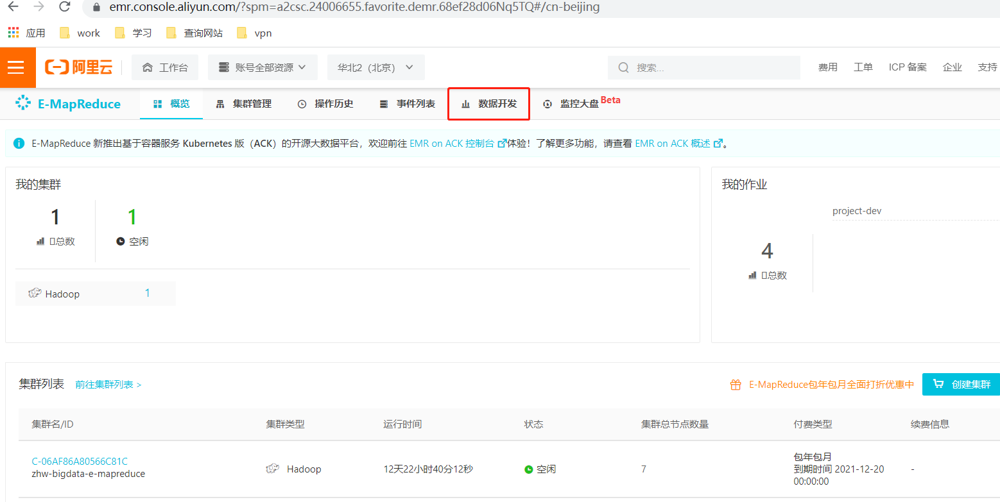


# 3- 选择项目

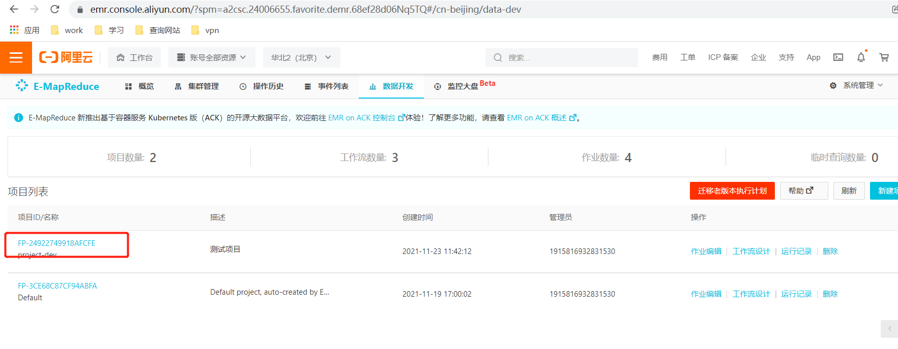

# 4- 作业编辑

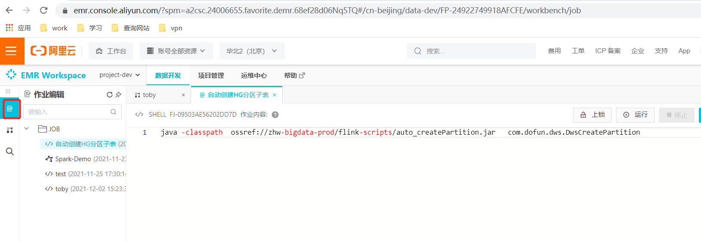


# 5- 新建作业

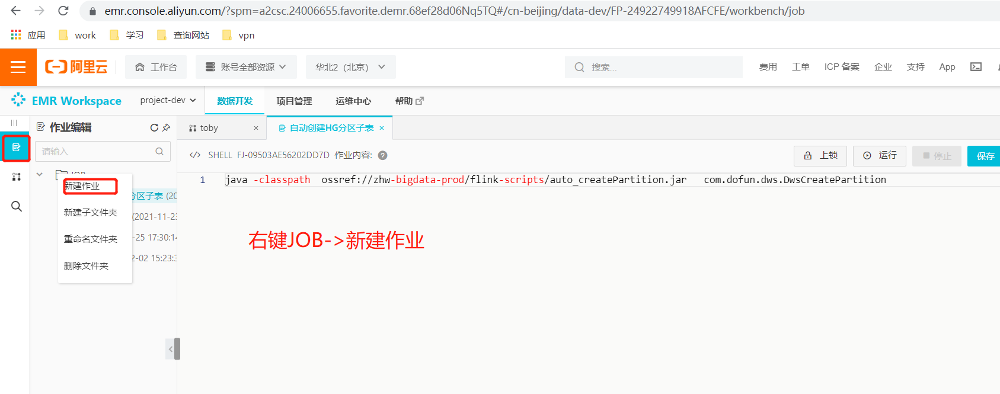


## 5-1 设置名称和作业类型

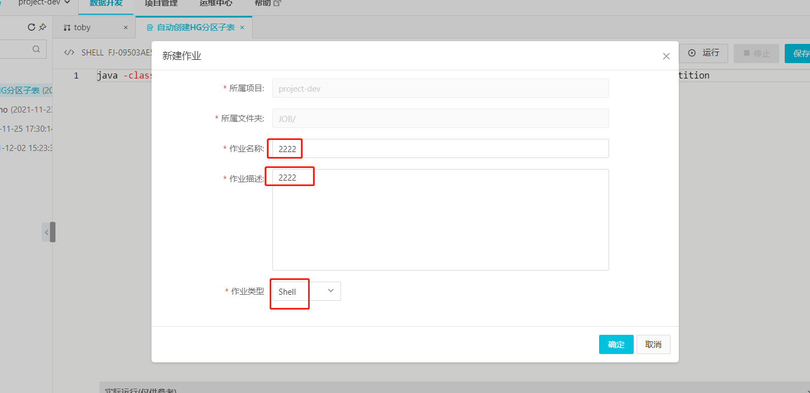


## 5-2 编写Shell 脚本

- **<font color='red'>注意:</font>** 
  1. jar包需要事先上传到oss中去；我这里上传的路径是：zzz-bigdata-prod/flink-scripts/auto_createPartition.jar
  2. 指定jar包的时候使用<font color='red'>ossref://</font> 开头

``` shell
java -classpath  ossref://zhw-bigdata-prod/flink-scripts/auto_createPartition.jar   com.dofun.dws.DwsCreatePartition
```

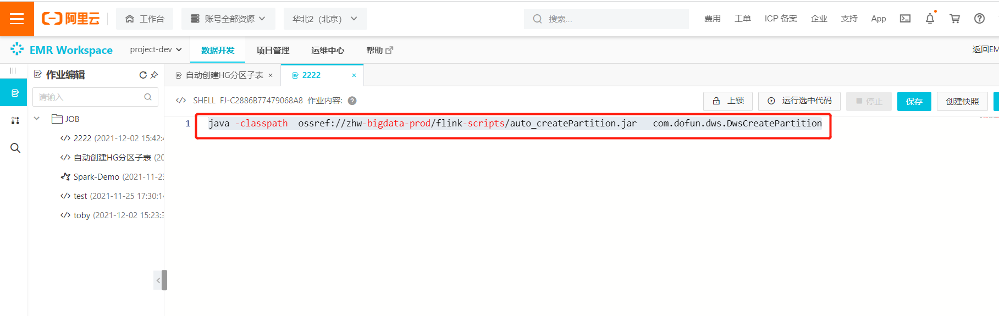

## 5-3 点击 保存 并 运行 查看运行日志

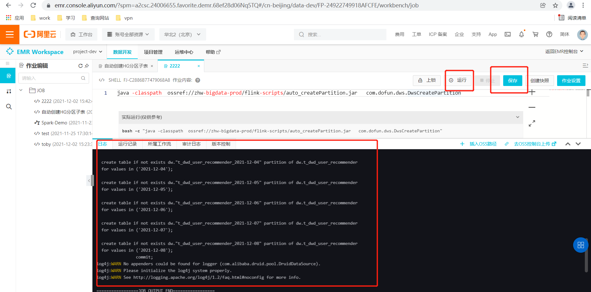


# 6- 工作流设计

## 6-1 新建工作流

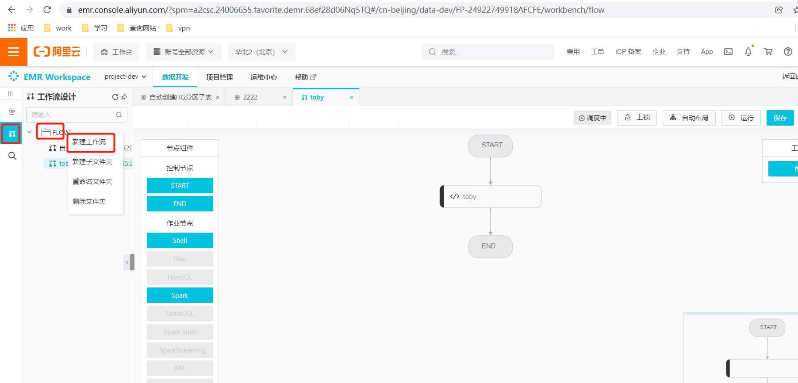

## 6-2 编辑新工作流信息

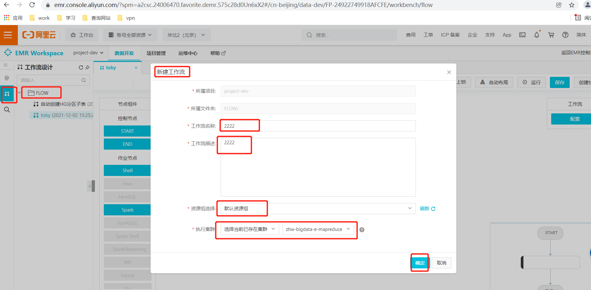


## 6-3 设计工作流

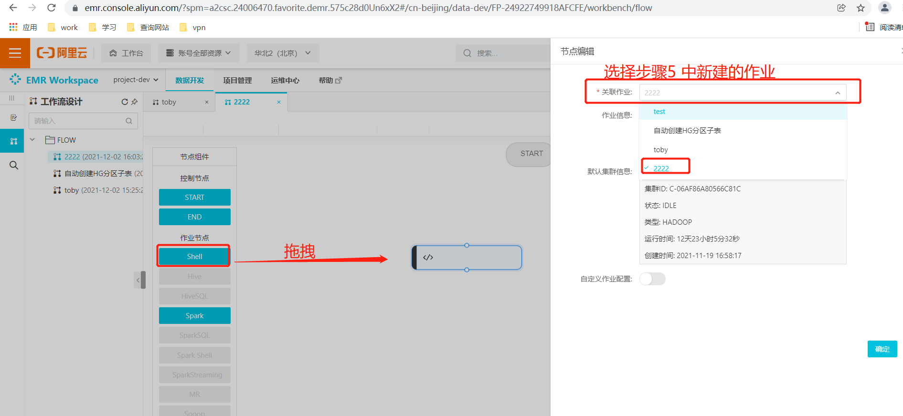

## 6-4 连接各个作业（包括start 、 end）

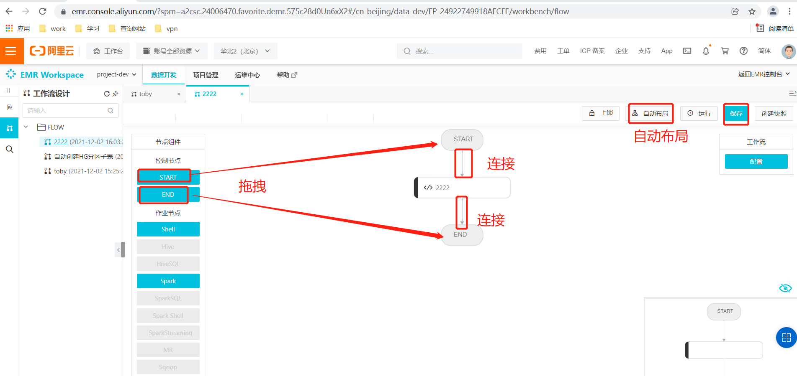


# 7- 定时调度

## 7-1 选择配置

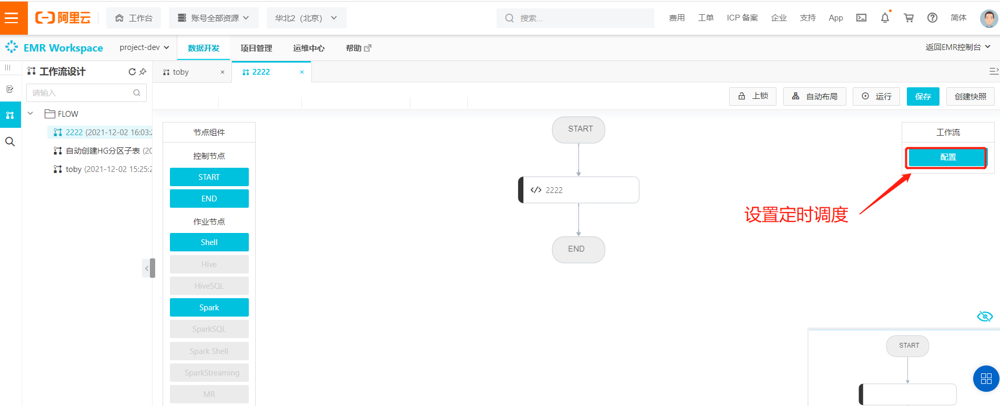


## 7-2 调度属性

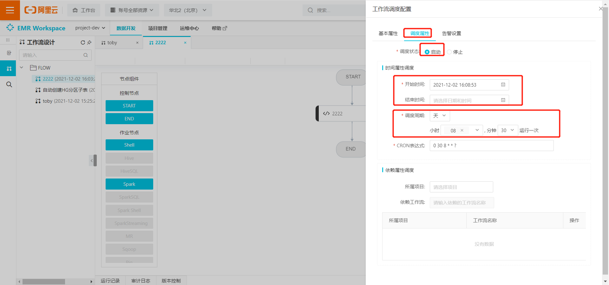

## 7-3 保存 运行 查看日志


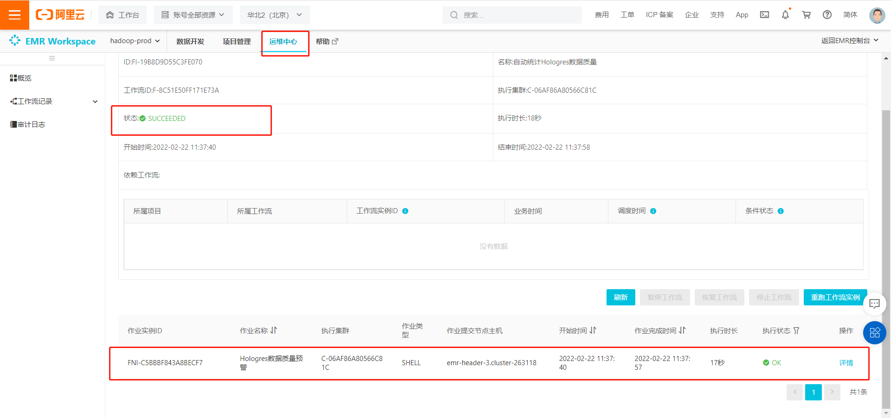


