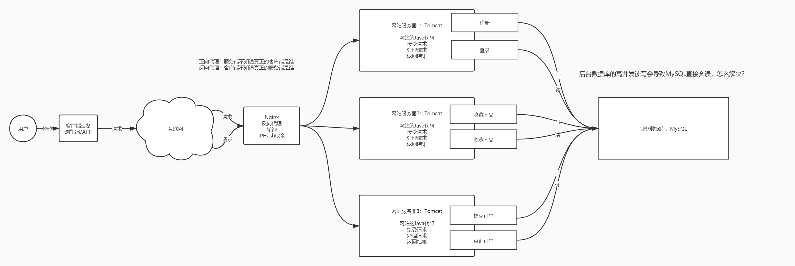

# 内存式NoSQL数据库Redis（一）

## 知识点01：课程目标

1. 学习大数据中存储工具
   - Redis：内存式NOSQL数据库
   - Kafka：分布式实时消息队列
   - Hbase：分布式按列存储NoSQL数据库
   - 综合案例：Flume：实时采集、存储、计算
   - 目标
     - 掌握每个工具在大数据平台中的应用场景：每个工具特点和应用场景
     - 学习每个工具的使用：读写API
       - Spark或者Flink读写Redis、Kafka、Hbase
     - 了解一个实时大数据平台数据传递的流程：采集、存储、计算、应用
2. 今天目标
   - Redis的基本设计思想
     - 功能、特点、==**应用场景**、**持久化机制**==
   - Redis的单节点部署
   - Redis的使用：==**数据类型及常用命令**==


## 知识点02：NoSQL与RDBMS

- **目标**：了解NoSQL的应用场景与RDBMS的区别

- **路径**

  - step1：RDBMS的特点
  - step2：业务架构中的问题
  - step3：NoSQL的特点

- **实施**

  - **RDBMS的特点**：关系型数据库管理系统

    - 工具：MySQL、Oracle、SQL Server……
    - 应用：**业务性数据存储系统**：事务和稳定性
    - 特点：体现数据之间的关系，**支持事务，保证业务完整性和稳定性**，小数据量的性能也比较好
    - 开发：SQL

  - 业务架构中的问题

    - **问题**：以网站后台存储为例，当并发量很大，**所有高并发全部直接请求MySQL，容易导致MySQL奔溃**

      

    - 需求：能实现高并发的数据库，接受高并发请求

  - **NoSQL的特点**：Not Only SQL：非关系型数据库

    - 工具：Redis、HBASE、MongoDB……

    - 应用：一般用于**高并发高性能场景**下的数据缓存或者数据库存储

    - 特点：读写速度特别快，并发量非常高，相对而言**不如RDBMS稳定**，对事务性的支持不太友好

    - 开发：每种NoSQL都有自己的命令语法

    - 解决上面RDBMS的问题：使用高并发缓存实现读写分离

      - 读请求：读请求不读取MySQL，读取Redis
        - 注重并发

      - 写请求：写请求直接写入MySQL
        - 注重安全

      

- **小结**

  - RDBMS和NoSQL的应用特点分别是什么？
  - RDBMS：关系型数据库，稳定性和安全性，事务支持比较完整，业务存储，小数据量性能是比较好
    - MySQL：结果存储、元数据存储【Hive、Oozie、Hue……】
    - NoSQL：非关系型数据库，支持高并发和高性能，支持大数据量的存储
      - Redis：实时结果的存储

  

## 知识点03：Redis的功能与应用场景

- **目标**：掌握Redis的功能与应用场景

- **路径**

  - step1：介绍
  - step2：功能特点
  - step3：应用场景

- **实施**

  - **介绍**

    - 相关网站

      - 官方网站：<https://redis.io/>、<http://download.redis.io/releases/>
      - 中文文档：<http://www.redis.cn/>
      - Redis 命令参考：<http://redisdoc.com/>

    - 官方介绍

      ```properties
      Redis 是一个开源（BSD许可）的，内存中的数据结构存储系统，它可以用作数据库、缓存和消息中间件。 它支持多种类型的数据结构，如 字符串（strings）， 散列（hashes）， 列表（lists）， 集合（sets）， 有序集合（sorted sets） 与范围查询， bitmaps， hyperloglogs 和 地理空间（geospatial） 索引半径查询。 Redis 内置了 复制（replication），LUA脚本（Lua scripting）， LRU驱动事件（LRU eviction），事务（transactions） 和不同级别的 磁盘持久化（persistence）， 并通过 Redis哨兵（Sentinel）和自动 分区（Cluster）提供高可用性（high availability）。
      ```

    - 定义：**基于内存的分布式的NoSQL数据库**

      - **所有数据存储在内存中**，并且有持久化机制
      - 每次redis重启，会从文件中重新加载数据到内存，**所有读写都只基于内存**

  - 功能特点

    - 功能：提供**高性能【快】、高并发【多】**的数据存储读写
    - 特点
      - 基于C语言开发的系统，与硬件的交互性能更好
      - 基于内存实现数据读写，读写性能更快
      - 分布式的：扩展性和稳定性更好
      - KV结构数据库：支持事务、拥有各种丰富的数据类型【String、Hash、List、Set、Zset】

  - **应用场景**

    - 缓存：用于实现大数据量**高并发**的大数据量缓存**【临时性存储】**

      - Java Web领域

    - 数据库：用于实现**高性能**的小数据量读写**【永久性存储】**

      - 大数据领域存储实时处理的结果

        

      - 学习Redis：使用，读写数据

    - 消息中间件：作为消息队列，用于实现消息传递，大数据中一般不用Redis

      - 一般不用，只有一些软件会依赖于Redis之类的工具实现消息队列的传递
      - 大数据中消息队列：Kafka

- **小结**

  - Redis的功能与应用场景是什么？
    - 功能：提供高性能和高并发的数据存储读写
    - 场景
      - 缓存：大数据量高并发的数据缓存，临时性存储，数据允许丢失
      - 数据库：小数据量高性能的数据存储，永久性存储，数据不允许丢失
      - 消息中间件：一般不用


## 知识点04：Redis的Linux版单机部署

- **目标**：实现Redis的Linux版单机部署

- **实施**

  - Windows版本安装及远程工具使用请参考随堂资料《Redis的Windows版安装及远程工具的使用.pdf》

  - **上传**redis-3.2.8源码

    ```
    cd /export/software/
    rz
    ```

    

    

  - **解压**

    ```
    tar -zxvf redis-3.2.8.tar.gz -C /export/server/
    ```

    

    

  - **安装依赖**

    ```
    yum -y install gcc-c++ tcl
    ```

    

    

    - 如果已经安装过，执行命令结果如下：

      

  - **编译安装**

    ```
    #进入源码目录
    cd /export/server/redis-3.2.8/
    #编译
    make
    #安装，并指定安装目录
    make PREFIX=/export/server/redis-3.2.8-bin install
    ```

    

    

  - **修改配置**

    - 复制配置文件

      ```bash
      cp /export/server/redis-3.2.8/redis.conf /export/server/redis-3.2.8-bin/
      ```

    - 创建目录

      ```shell
      #redis日志目录
      mkdir -p /export/server/redis-3.2.8-bin/logs
      #redis数据目录
      mkdir -p /export/server/redis-3.2.8-bin/datas
      ```

    - 修改配置

      ```bash
      cd  /export/server/redis-3.2.8-bin/
      vim redis.conf
      ```

      ```shell
      ## 61行，配置redis服务器接受链接的网卡
      bind node1
      ## 128行，redis是否后台运行，设置为yes
      daemonize yes
      ## 163行，设置redis服务日志存储路径
      logfile "/export/server/redis-3.2.8-bin/logs/redis.log"
      ## 247行，设置redis持久化数据存储目录
      dir /export/server/redis-3.2.8-bin/datas/
      ```

    - 创建软连接

      ```bash
      cd /export/server
      ln -s redis-3.2.8-bin redis
      ```

    - 配置环境变量

      ```bash
      vim /etc/profile
      ```

      ```bash
      # REDIS HOME
      export REDIS_HOME=/export/server/redis
      export PATH=:$PATH:$REDIS_HOME/bin
      ```

      ```bash
      source /etc/profile
      ```

      

  - **启动**

    - **==端口：6379==**

    - 启动服务端

      - 启动命令

        ```bash
        /export/server/redis/bin/redis-server /export/server/redis/redis.conf
        ```

      - 启动脚本

        ```bash
        vim /export/server/redis/bin/redis-start.sh
        ```

        ```shell
        #!/bin/bash 
        
        REDIS_HOME=/export/server/redis
        ${REDIS_HOME}/bin/redis-server ${REDIS_HOME}/redis.conf
        ```

        ```bash
        chmod u+x /export/server/redis/bin/redis-start.sh 
        ```

    - 启动客户端

      ```bash
      /export/server/redis/bin/redis-cli -h node1 -p 6379
      ```

    - 关闭客户端

      - exit：退出客户端

    - 关闭服务端

      - 方式一：客户端中

        ```bash
        shutdown
        ```

      - 方式二：Linux命令行

        ```bash
        kill -9 redis的pid
        ```

      - 方式三：通过客户端命令进行关闭

        ```bash
        bin/redis-cli -h node1 -p 6379  shutdown
        ```

      - 注意：如果软件自带关闭命令，建议使用关闭命令

  - **测试**

    ```
    node1:6379> keys *
    (empty list or set)
    node1:6379> set s1 hadoop
    OK
    node1:6379> keys *
    1) "s1"
    node1:6379> get s1
    "hadoop"
    node1:6379> 
    ```

  - 远程工具的使用：参考Windows安装文档

- **小结**

  - 实现Redis的Linux版单机部署


## 知识点05：Redis的数据结构及数据类型

- **目标**：掌握Redis的数据结构及数据类型

- **路径**

  - step1：数据结构
  - step2：数据类型

- **实施**

  - **数据结构**：整个Reids中**所有数据以KV结构形式**存在

    - K：作为唯一标识符，唯一标识一条数据，**固定为String类型**，写入时指定KV，读取时，根据K读取V

  - V：真正存储的数据，可以有多种类型

    - ==**String、Hash、List、Set、Zset**==、BitMap、HypeLogLog
    - 理解Redis：类似于Java中的一个Map集合，可以存储多个KV，根据K获取V
    - Redis中的每条数据就是一条KV

  - 数据类型

    - 每一种类型的应用场景和命令都是不一样的

    | Key：String      | Value类型             | Value值                              | 应用场景                                                     |
    | ---------------- | --------------------- | ------------------------------------ | ------------------------------------------------------------ |
    | pv_20200101      | String                | 10000                                | 一般用于存储单个数据指标的结果                               |
    | person001        | Hash                  | name：laoer age : 20 sex female      | 用于存储整个对象所有属性值                                   |
    | uv               | List                  | {100,200,300,100,600}                | 有序允许重复的集合，每天获取最后一个值                       |
    | uv_20200101      | Set                   | {userid1,userid2,userid3,userid4……}  | 无序且不重复的集合，直接通过长度得到UV                       |
    | top10_product    | ZSet【score,element】 | {10000-牙膏，9999-玩具，9998-电视……} | 有序不可重复的集合，统计TopN                                 |
    | user_filter      | BitMap                | {0101010101010000000011010}          | 将一个字符串构建位，通过0和1来标记每一位                     |
    | product_20200101 | HypeLogLog            | {productid1，id2……}                  | 类似于Set集合，底层实现原理不一样，数据量大的情况下，性能会更好，结果可能存在一定的误差 |

    - 工作中计算的结果：指标分析

      - PV：页面访问量，用户每访问一个页面，PV就加1
      - UV：用户访问量，每个用户算作一个UV

    - **String：类似于Java中String**，字符串类型，用于存储单个字符串

      - 将某个实时的结果不断存储在String类型的Value中

    - **Hash：类似于Java中HashMap**，KV对，用于存储多个属性的值

      - 20200101：PV、UV、跳出率、二跳率、平均访问时长

      - String存储：每个指标需要一个KV对存在Redis中，到Redis中读取5个KV

      - Hash存储：将这一天常用的基础指标都存储在一个KV汇总，读取1个KV

        - Key：20200101_rs

        - Value

          ```
          pv：10000
          uv:5000
          跳出率：0.5
          ……
          ```

    - **List：类似于Java中List**，特点：有序且可重复，可以存储多个值

      - 特点：有序性

      - 需求：每天显示昨天的总UV

      - String或者Hash：一天一个KV在Redis

      - List：将每天的UV都按照顺序存储在List中，每次只读最新的那个

        - Key：last_UV

        - Value

          ```
          {10000,9000,5000……4500}
          ```

    - **Set：类似于Java中的Set** ，特点：去重，可以存储多个值

      - 特点：去重

      - 需求：统计UV

      - 常规的思路：使用Spark或者Flink对所有用户的用户id去重统计

        ```sql
        select count(distinct userid) as uv from table
        ```

        - 先计算然后存储结果

      - Set来实现：让Flink实时的将用户的id放入Redis的一个Set集合中

        - Key：userids

        - Value

          ```
          {userid1,userid2,userid3……}
          ```

        - 最终这个Value的元素的个数就是UV

        - 利用Redis来完成计算

    - **Zset：类似于Java中的TreeMap**，结合了List和Set的特点，构架了有序且不重复

      - 特点：有序且不重复

      - 需求：实时展示TopN

        ```
        select word,count(1) as cnt from table group by word;
        ```

      - Zset实现

        - Key：topN
        - Value：所有的元素会按照对应的Score评分自动排序，默认升序排序，降序可以反转reverse
          - member：元素
          - score：评分

      - 将排序这个操作交给Redis来做

- **小结**

  - Redis中的数据是什么结构以及有哪些类型？


## 知识点06：Redis的通用命令

- **目标**：**掌握Redis常用的通用命令**

- **实施**

  - ==**keys**==：列举当前数据库中所有Key
    - 语法：keys  通配符
    - 类似于SQL中的show命令
  - ==**del key**==：删除某个KV
    - 语法：del  k1  k2 ……
  - ==**exists key**== ：判断某个Key是否存在
  - ==**type key**==：判断这个K对应的V的类型的
  - ==**expire K**== 过期时间：设置某个K的过期时间，一旦到达过期时间，这个K会被自动删除
  - **ttl K**：查看某个K剩余的存活时间
  - **select N**：切换数据库的
    - Redis默认由16个数据：db0 ~ db15，个数可以通过配置文件修改，名称不能改
    - Redis是一层数据存储结构：**所有KV直接存储在数据库中**

    - 默认进入db0
  - **move key N**：将某个Key移动到某个数据库中

- **flushdb**：清空当前数据库的所有Key

  - **flushall**：清空所有数据库的所有Key

  ```
  node1:6379> keys *
  (empty list or set)
  node1:6379> 
  node1:6379> keys *
  (empty list or set)
  node1:6379> set s1 hadoop
  OK
  node1:6379> keys *
  1) "s1"
  node1:6379> hset p1 name zhangsan
  (integer) 1
  node1:6379> keys *
  1) "p1"
  2) "s1"
  node1:6379> keys s*
  1) "s1"
  node1:6379> del s1
  (integer) 1
  node1:6379> keys *
  1) "p1"
  node1:6379> EXISTS s1
  (integer) 0
  node1:6379> EXISTS p1
  (integer) 1
  node1:6379> 
  node1:6379> keys *
  1) "p1"
  node1:6379> set s1 hue
  OK
  node1:6379> 
  node1:6379> keys *
  1) "p1"
  2) "s1"
  node1:6379> hget p1 name
  "zhangsan"
  node1:6379> get s1
  "hue"
  node1:6379> type p1
  hash
  node1:6379> type s1
  string
  node1:6379> keys *
  1) "p1"
  2) "s1"
  node1:6379> expire s1 20
  (integer) 1
  node1:6379> ttl s1
  (integer) 9
  node1:6379> ttl s1
  (integer) 8
  node1:6379> ttl s1
  (integer) 6
  node1:6379> ttl s1
  (integer) 5
  node1:6379> ttl s1
  (integer) 4
  node1:6379> ttl s1
  (integer) 2
  node1:6379> keys *
  1) "p1"
  node1:6379> 
  node1:6379> keys *
  1) "p1"
  node1:6379> select 1
  OK
  node1:6379[1]> set s2 spark
  OK
  node1:6379[1]> keys *
  1) "s2"
  node1:6379[1]> select 0
  OK
  node1:6379> keys *
  1) "p1"
  node1:6379> set s1 oozie
  OK
  node1:6379> 
  node1:6379> keys *
  1) "p1"
  2) "s1"
  node1:6379> move s1 1
  (integer) 1
  node1:6379> keys *
  1) "p1"
  node1:6379> select 1
  OK
  node1:6379[1]> keys *
  1) "s2"
  2) "s1"
  node1:6379[1]> flushdb 
  OK
  node1:6379[1]> keys *
  (empty list or set)
  node1:6379[1]> select 0
  OK
  node1:6379> keys *
  1) "p1"
  node1:6379> flushall
  OK
  node1:6379> keys *
  (empty list or set)
  node1:6379> 
  node1:6379> set s1 hadoop
  OK
  node1:6379> hsest s1 name lisi
  (error) ERR unknown command 'hsest'
  node1:6379> hset s1 name lisi
  (error) WRONGTYPE Operation against a key holding the wrong kind of value
  node1:6379> 
  node1:6379> keys *
  1) "s1"
  node1:6379> select 1
  OK
  node1:6379[1]> set s1 oozie
  OK
  node1:6379[1]> keys *
  1) "s1"
  node1:6379[1]> get s1
  "oozie"
  node1:6379[1]> select 0
  OK
  node1:6379> get s1
  "hadoop"
  ```

  

- **小结**

  - 掌握Redis常用的通用命令


## 知识点07：String类型的常用命令

- **目标**：掌握String类型的常用命令

- **实施**
  - **==set==**：给String类型的Value的进行赋值或者更新
    - 语法：set  K      V
  - **==get==**：读取String类型的Value的值
    - 语法：get K
  - **==mset==**：用于批量写多个String类型的KV
    - 语法：mset  K1 V1  K2 V2 ……
  - **==mget：==**用于批量读取String类型的Value
    - 语法：mget   K1  K2  K3 ……
  - setnx：只能用于新增数据，当K不存在时可以进行新增
    - 语法：setnx  K  V
    - 应用：构建抢占锁，搭配expire来使用
  - **==incr==**：用于对数值类型的字符串进行递增，递增1,一般用于做计数器
    - 语法：incr  K
  - incrby：指定对数值类型的字符串增长固定的步长
    - 语法：incrby  K   N
  - decr：对数值类型的数据进行递减，递减1
    - 语法：decr K
  - decrby：按照指定步长进行递减
    - 语法：decrby  K  N
  - strlen：统计字符串的长度
    - 语法：strlen  K
  - getrange：用于截取字符串
    - 语法：getrange  s2  start   end


```
node1:6379> keys *
(empty list or set)
node1:6379> set s1 hadoop
OK
node1:6379> keys *
1) "s1"
node1:6379> get s1
"hadoop"
node1:6379> mset s2 hive s3 spark
OK
node1:6379> keys *
1) "s3"
2) "s2"
3) "s1"
node1:6379> get s1
"hadoop"
node1:6379> get s2
"hive"
node1:6379> mget s1 s2
1) "hadoop"
2) "hive"
node1:6379> 
node1:6379> get s1
"hadoop"
node1:6379> set s1 hue
OK
node1:6379> get s1
"hue"
node1:6379> setnx s4 flink
(integer) 1
node1:6379> keys *
1) "s3"
2) "s2"
3) "s4"
4) "s1"
node1:6379> get s4
"flink"
node1:6379> setnx s4 python
(integer) 0
node1:6379> get s4
"flink"
node1:6379> 
node1:6379> set s5 1
OK
node1:6379> get s5
"1"
node1:6379> incr s5
(integer) 2
node1:6379> get s5
"2"
node1:6379> incr s5
(integer) 3
node1:6379> incrby s5 5
(integer) 8
node1:6379> decr s5
(integer) 7
node1:6379> desc s5
(error) ERR unknown command 'desc'
node1:6379> decr s5
(integer) 6
node1:6379> decrby s5 2
(integer) 4
node1:6379> get s5
"4"
node1:6379> get s4
"flink"
node1:6379> strlen s4
(integer) 5
node1:6379> getrange s4 0 2
"fli"
node1:6379> getrange s4 2 2
"i"
node1:6379> 
```

- **小结**

  - 掌握String类型的常用命令


## 知识点08：Hash类型的常用命令

- **目标**：掌握Hash类型的常用命令

- **实施**

  - **==hset==**：用于为某个K添加一个属性
  - 语法：hset  K   k  v
  - **==hget==**：用于获取某个K的某个属性的值
    - 语法：hget K  k
  - **==hmset==**：批量的为某个K赋予新的属性
    - 语法：hmset  K   k1 v1 k2 v2 ……
  - **==hmget==**：批量的获取某个K的多个属性的值
  - 语法：hmget  K  k1 k2 k3……
  - **==hgetall==**：获取所有属性的值
  - 语法：hgetall  K
  - **==hdel==**：删除某个属性
    - 语法：hdel   K   k1 k2 ……
  - hlen：统计K对应的Value总的属性的个数
    - 语法：hlen  K
  - **==hexists==**：判断这个K的V中是否包含这个属性
    - 语法：hexists  K  k
  - hvals：获取所有属性的value的
    - 语法：hvals   K
  - hkeys：获取所有属性
    - 语法：hkeys K

  ```
  node1:6379> hset m1 name lisi
  (integer) 1
  node1:6379> keys *
  1) "s3"
  2) "s2"
  3) "s4"
  4) "m1"
  5) "s5"
  6) "s1"
  node1:6379> hset m1 age 18
  (integer) 1
  node1:6379> keys *
  1) "s3"
  2) "s2"
  3) "s4"
  4) "m1"
  5) "s5"
  6) "s1"
  node1:6379> type m1
  hash
  node1:6379> hget m1 name
  "lisi"
  node1:6379> hget m1 age
  "18"
  node1:6379> hmset m1 add shanghai phone 110 sex male
  OK
  node1:6379> hget m1 phone
  "110"
  node1:6379> hget m1 add
  "shanghai"
  node1:6379> hmget m1 name sex phone
  1) "lisi"
  2) "male"
  3) "110"
  node1:6379> hgetall m1
   1) "name"
   2) "lisi"
   3) "age"
   4) "18"
   5) "add"
   6) "shanghai"
   7) "phone"
   8) "110"
   9) "sex"
  10) "male"
  node1:6379> hkeys m1
  1) "name"
  2) "age"
  3) "add"
  4) "phone"
  5) "sex"
  node1:6379> hvals m1
  1) "lisi"
  2) "18"
  3) "shanghai"
  4) "110"
  5) "male"
  node1:6379> keys *
  1) "s3"
  2) "s2"
  3) "s4"
  4) "m1"
  5) "s5"
  6) "s1"
  node1:6379> hkeys m1
  1) "name"
  2) "age"
  3) "add"
  4) "phone"
  5) "sex"
  node1:6379> hdel m1 sex
  (integer) 1
  node1:6379> hkeys m1
  1) "name"
  2) "age"
  3) "add"
  4) "phone"
  node1:6379> hlen m1
  (integer) 4
  node1:6379> hexists m1 name
  (integer) 1
  node1:6379> hexists m1 sex
  (integer) 0
  node1:6379> 
  ```

- **小结**

  - 掌握Hash类型的常用命令


## 知识点09：List类型的常用命令

- **目标**：掌握List类型的常用命令

- **实施**

  - **==lpush==**：将每个元素放到集合的左边，左序放入
    - 语法：lpush   K    e1  e2  e3……
  - **==rpush==**：将每个元素放到集合的右边，右序放入
    - 语法：rpush   K    e1  e2  e3……
  - **==lrange==**：通过下标的范围来获取元素的数据
    - 语法：lrange  K  start   end
    - 注意：**从左往右的下标从0开始，从右往左的下标从-1开始**，一定是从小的到大的下标

    - lrange K  0  -1：所有元素
  - llen：统计集合的长度
    - 语法：llen   K
  - lpop：删除左边的一个元素

    - 语法：lpop  K
  - rpop：删除右边的一个元素

    - 语法：rpop  K

```
node1:6379> lpush list1 1 2 3 3
(integer) 4
node1:6379> rpush list1 4 5 6 7 7 8
(integer) 10
node1:6379> lrange list1 0 99
 1) "3"
 2) "3"
 3) "2"
 4) "1"
 5) "4"
 6) "5"
 7) "6"
 8) "7"
 9) "7"
10) "8"
node1:6379> llen list1
(integer) 10
node1:6379> lrange list1 0 4
1) "3"
2) "3"
3) "2"
4) "1"
5) "4"
node1:6379> lrange list1 -5 -1
1) "5"
2) "6"
3) "7"
4) "7"
5) "8"
node1:6379> lrange list1 0 -1
 1) "3"
 2) "3"
 3) "2"
 4) "1"
 5) "4"
 6) "5"
 7) "6"
 8) "7"
 9) "7"
10) "8"
node1:6379> llen list1
(integer) 10
node1:6379> lpop list1
"3"
node1:6379> lrange list1 0 -1
1) "3"
2) "2"
3) "1"
4) "4"
5) "5"
6) "6"
7) "7"
8) "7"
9) "8"
node1:6379> rpop list1
"8"
node1:6379> lrange list1 0 -1
1) "3"
2) "2"
3) "1"
4) "4"
5) "5"
6) "6"
7) "7"
8) "7"
node1:6379> 
```

- **小结**
  - 掌握List类型的常用命令


## 知识点10：Set类型的常用命令

- **目标**：掌握Set类型的常用命令

- **实施**

  - **==sadd==**：用于添加元素到Set集合中
    - 语法：sadd  K   e1 e2 e3 e4 e5……

  - **smembers**：用于查看Set集合的所有成员
    - 语法：smembers  K

  - sismember：判断是否包含这个成员

  - 语法：sismember K   e1
  - srem：删除其中某个元素

    - 语法：srem  K  e

  - **==scard==**：统计集合长度
    - 语法：scard  K 

  - sunion：取两个集合的并集

    - 语法：sunion  K1  K2

  - **sinter**：取两个集合的交集
    - 语法：sinter  K1 K2
    - 应用：将两天登录的用户集合取交集，统计连续登陆两天的用户个数

  ```
  node1:6379> sadd set1 1 7 6 3 1 2 1 6
  (integer) 5
  node1:6379> keys *
  1) "s3"
  2) "s2"
  3) "list1"
  4) "s4"
  5) "m1"
  6) "s5"
  7) "set1"
  8) "s1"
  node1:6379> smembers set1
  1) "1"
  2) "2"
  3) "3"
  4) "6"
  5) "7"
  node1:6379> scard set1
  (integer) 5
  node1:6379> sismember set1 1
  (integer) 1
  node1:6379> sismember set1 9
  (integer) 0
  node1:6379> srem set1 2
  (integer) 1
  node1:6379> smembers set1
  1) "1"
  2) "3"
  3) "6"
  4) "7"
  node1:6379> sadd set2 2 2 6 8 9
  (integer) 4
  node1:6379> smembers set2
  1) "2"
  2) "6"
  3) "8"
  4) "9"
  node1:6379> sunion set1 set2
  1) "1"
  2) "2"
  3) "3"
  4) "6"
  5) "7"
  6) "8"
  7) "9"
  node1:6379> sinter set1 set2
  1) "6"
  node1:6379> 
  ```

  

- **小结**

  - 掌握Set类型的常用命令


## 知识点11：Zset类型的常用命令

- **目标**：掌握Zset类型的常用命令

  - 理解：像TreeMap，但是是按照V排序
    - K：元素唯一，不会重复的
    - V：Score，按照Score评分做排序

- **实施**

  - ==**zadd**==：用于添加元素到Zset集合中

- 语法：zadd  K   score1  k1  score2  k2  ……

- ==**zrange**==：范围查询

  - 语法：zrange   K    start   end   [withscores]

- ==**zrevrange**==：倒序查询

  - 语法：zrevrange   K    start   end   [withscores]

- zrem：移除一个元素

  - 语法：zrem  K   k1

- zcard：统计集合长度

  - 语法：zcard K

- zscore：获取评分

  - 语法：zscore  K  k
  - 注意：**Redis中不建议存储浮点值，存在精度问题**，建议转换为整形存储

  ```
  node1:6379> zadd zset1 10000 hadoop 2000 hive 5999 spark 3000 flink
  (integer) 4
  node1:6379> zrange zset1 0 -1
  1) "hive"
  2) "flink"
  3) "spark"
  4) "hadoop"
  node1:6379> zrange zset1 0 -1 withscores
  1) "hive"
  2) "2000"
  3) "flink"
  4) "3000"
  5) "spark"
  6) "5999"
  7) "hadoop"
  8) "10000"
  node1:6379> zrange zset1 0 2 withscores
  1) "hive"
  2) "2000"
  3) "flink"
  4) "3000"
  5) "spark"
  6) "5999"
  node1:6379> zrevrange zset1 0 -1
  1) "hadoop"
  2) "spark"
  3) "flink"
  4) "hive"
  node1:6379> zrevrange zset1 0 2
  1) "hadoop"
  2) "spark"
  3) "flink"
  node1:6379> zrevrange zset1 0 2 withscores
  1) "hadoop"
  2) "10000"
  3) "spark"
  4) "5999"
  5) "flink"
  6) "3000"
  node1:6379> zadd zset1 4000.9 oozie
  (integer) 1
  node1:6379> zrange zset1 0 -1
  1) "hive"
  2) "flink"
  3) "oozie"
  4) "spark"
  5) "hadoop"
  node1:6379> zrange zset1 0 -1 withscores
   1) "hive"
   2) "2000"
   3) "flink"
   4) "3000"
   5) "oozie"
   6) "4000.9000000000001"
   7) "spark"
   8) "5999"
   9) "hadoop"
  10) "10000"
  node1:6379> zrem zset1 oozie
  (integer) 1
  node1:6379> zrange zset1 0 -1 withscores
  1) "hive"
  2) "2000"
  3) "flink"
  4) "3000"
  5) "spark"
  6) "5999"
  7) "hadoop"
  8) "10000"
  node1:6379> zcard zset1
  (integer) 4
  node1:6379> zscore zset1 flink
  "3000"
  node1:6379> 
  ```

  

- **小结**

  - 掌握Zset类型的常用命令


## 知识点12：BitMap类型的常用命令

- **目标**：了解BitMap类型的常用命令

- **实施**

  - 功能：通过一个String对象的存储空间，来构建位图，用每一位0和1来表示状态

    

    

    - Redis中一个String最大支持512M =  2^32次方，1字节 = 8位
    - 使用时，可以指定每一位对应的值，要么为0，要么为1，默认全部为0

    - 用下标来标记每一位，第一个位的下标为0

    

  - 举例：统计UV

    - 一个位图中包含很多位，可以用每一个位表示一个用户id

    - 读取数据，发现一个用户id，就将这个用户id对应的那一位改为1

    - 统计整个位图中所有1的个数，就得到了UV

  - setbit：修改某一位的值

    - 语法：setbit  bit1  位置   0/1

      ```
      setbit bit1 0 1
      ```

      

  - getbit：查看某一位的值

    - 语法：getbit  K  位置

      ```
      getbit bit1 9
      ```

      

  - bitcount：用于统计位图中所有1的个数

    - 语法：bitcount  K [start   end]：表示的是字节

      ```
      bitcount bit1
      #start和end表示的是字节:1 字节 = 8 位
      bitcount bit1 0 10
      ```

      

  - bitop：用于位图的运算：and/or/not/xor

    - 语法：bitop  and/or/xor/not  bitrs   bit1 bit2

      ```
      bitop and bit3 bit1 bit2
      bitop or bit4 bit1 bit2
      ```

      

  

  ```
  node1:6379> setbit bit1 0 1
  (integer) 0
  node1:6379> getbit bit1 0
  (integer) 1
  node1:6379> getbit bit1 1
  (integer) 0
  node1:6379> getbit bit1 2
  (integer) 0
  node1:6379> getbit bit1 3
  (integer) 0
  node1:6379> bitcount bit1 0 10
  (integer) 1
  node1:6379> setbit bit1 9 1
  (integer) 0
  node1:6379> getbit bit1 9
  (integer) 1
  node1:6379> setbit bit 15 1
  (integer) 0
  node1:6379> getbit bit 15
  (integer) 1
  node1:6379> getbit bit1 15
  (integer) 0
  node1:6379> setbit bit1 15 1
  (integer) 0
  node1:6379> getbit bit1 15
  (integer) 1
  node1:6379> bitcount bit1 0 10
  (integer) 3
  node1:6379> bitcount bit1 0 0
  (integer) 1
  node1:6379> bitcount bit1 0 1
  (integer) 3
  node1:6379> keys *
   1) "s3"
   2) "s4"
   3) "m1"
   4) "s5"
   5) "bit1"
   6) "zset1"
   7) "s2"
   8) "list1"
   9) "bit"
  10) "set2"
  11) "s1"
  12) "set1"
  node1:6379> setbit bit2 0 1
  (integer) 0
  node1:6379> setbit bit2 9 1
  (integer) 0
  node1:6379> setbit bit2 16 1
  (integer) 0
  node1:6379> bitop and bit3 bit1 bit2
  (integer) 3
  node1:6379> bitcount bit3 0 10
  (integer) 2
  ```

  

- **小结**

  - 了解BitMap类型的常用命令


## 知识点13：HyperLogLog类型的常用命令

- **目标**：了解HyperLogLog类型的常用命令

- **实施**

  - 功能：**类似于Set集合**，用于实现数据的去重

    - 区别：底层实现原理不一样【去重算法不一样】

- 应用：适合于**数据量比较庞大**的情况下的使用，**存在一定的误差率**
      - Set集合：数据量相对小并且结果要求精准

  - pfadd：用于添加元素

    - 语法：pfadd  K   e1 e2 e3……

      ```
      pfadd pf1 userid1 userid1 userid2 userid3 userid4 userid3 userid4
      pfadd pf2 userid1 userid2 userid2 userid5 userid6
      ```

  - pfcount：用于统计个数

    - 语法：pfcount K

      ```
      pfcount pf1
      ```

  - pfmerge：用于实现集合合并

    - 语法：pfmerge  pfrs  pf1 pf2……

      ```
      pfmerge pf3 pf1 pf2
      ```

  ```
  node1:6379> pfadd pf1 userid1 userid1 userid2 userid3 userid4 userid3 userid4
  (integer) 1
  node1:6379> pfcount pf1
  (integer) 4
  node1:6379> pfadd pf2 userid1 userid2 userid2 userid5 userid6
  (integer) 1
  node1:6379> pfcount pf2
  (integer) 4
  node1:6379> pfmerge pf3 pf1 pf2
  OK
  node1:6379> pfcount pf3
  (integer) 6
  node1:6379> 
  ```

- **小结**

  - 了解HyperLogLog类型的常用命令


## 知识点14：Jedis：使用方式与Jedis依赖

- **目标**：掌握Redis的使用方式及构建Jedis工程依赖

- **路径**

  - step1：Redis的使用方式
  - step2：Jedis依赖

- **实施**

  - Redis的使用方式

    - 命令操作Redis，一般用于测试开发阶段

    - 分布式计算或者Java程序读写Redis，一般用于实际生产开发

      - Spark/Flink读写Redis：Python、Java、Scala

      - 所有数据库使用Java操作方式整体是类似的

        ```java
        //todo:1-构建客户端连接对象
        Connection conn = DriverManager.getConnect(url,username,password)
        //todo:2-执行操作：所有操作都在客户端连接对象中：方法
        prep.execute(SQL)
        //todo:3-释放连接
        conn.close
        ```

  - Jedis依赖

    - 参考附录一添加依赖

- **小结**

  - 掌握Redis的使用方式及构建Jedis工程依赖


## 知识点15：Jedis：构建连接

- **目标**：**实现Jedis的客户端连接**

- **实施**

  ```java
  package bigdata.itcast.cn.redis;
  
  import org.junit.After;
  import org.junit.Before;
  import redis.clients.jedis.Jedis;
  import redis.clients.jedis.JedisPool;
  import redis.clients.jedis.JedisPoolConfig;
  
  /**
   * @ClassName JedisClientTest
   * @Description TODO 实现Jedis的代码测试
   * @Date 2021/11/20 16:46
   * @Create By     Frank
   */
  public class JedisClientTest {
      //todo:1-构建连接
      Jedis jedis = null; //普通的jedis对象
  
      @Before
      //构建jedis实例
      public void getConnection(){
          //方式一：直接实例化，指定服务端地址：机器+端口
  //        jedis = new Jedis("node1",6379);
          //方式二：构建线程池
          //线程池的配置对象
          JedisPoolConfig config = new JedisPoolConfig();
          config.setMaxTotal(10);
          config.setMaxIdle(5);
          config.setMinIdle(2);
          //构建Redis线程池
          JedisPool jedisPool = new JedisPool(config,"node1",6379);
          //从线程池中获取连接
          jedis = jedisPool.getResource();
      }
  
      @After
      //释放连接
      public void closeConnect(){
          jedis.close();
      }
  }
  
  ```

- **小结**

  - 实现Jedis的客户端连接


## 知识点16：Jedis：String操作

- **目标**：Jedis中实现String的操作

- **实施**

  ```
  set/get/incr/exists/expire/setex/ttl
  ```

  ```java
      @Test
      public void testString(){
          //set/get/incr/exists/expire/setex/ttl
  //        jedis.set("s1","hadoop");
  //        System.out.println(jedis.get("s1"));
  //        jedis.set("s2","10");
  //        jedis.incr("s2");
  //        System.out.println(jedis.get("s2"));
  //        Boolean s1 = jedis.exists("s1");
  //        Boolean s3 = jedis.exists("s3");
  //        System.out.println(s1+"\t"+s3);
  //        jedis.expire("s2",20);
  //        while(true){
  //            System.out.println(jedis.ttl("s2"));
  //        }
          jedis.setex("s3",10,"spark");
      }
  ```

  

- **小结**

  - Jedis中实现String的操作


## 知识点17：Jedis：其他类型操作

- **目标**：Jedis中实现其他类型操作

- **实施**

  - **Hash类型**

    ```
    hset/hmset/hget/hgetall/hdel/hlen/hexists
    ```

    ```java
        @Test
        public void testHash(){
            //hset/hmset/hget/hgetall/hdel/hlen/hexists
            jedis.hset("m1","name","zhoujielun");
            Map<String,String> maps = new HashMap<>();
            maps.put("age","30");
            maps.put("add","sh");
            maps.put("sex","male");
            jedis.hmset("m1",maps);
            System.out.println(jedis.hget("m1","name"));
            System.out.println(jedis.hmget("m1","name","age"));
            System.out.println("===========================");
            Map<String, String> m1 = jedis.hgetAll("m1");
            for(Map.Entry<String,String> entry : m1.entrySet()){
                System.out.println(entry.getKey()+"\t"+entry.getValue());
            }
        }
    ```

  - **List类型**

    ```
    lpush/rpush/lrange/llen/lpop/rpop
    ```

    ```java
        @Test
        public void testList(){
            //lpush/rpush/lrange/llen/lpop/rpop
            jedis.lpush("list1","1","2","3","3");
            jedis.rpush("list1","4","5","6","6");
            List<String> list1 = jedis.lrange("list1", 0, -1);
            System.out.println(list1);
        }
    ```

  - **Set类型**

    ```
    sadd/smembers/sismember/scard/srem
    ```

    ```java
        @Test
        public void testSet(){
            //sadd/smembers/sismember/scard/srem
            jedis.sadd("set1","1","9","1","2","4");
            System.out.println(jedis.smembers("set1"));
            System.out.println(jedis.scard("set1"));
        }
    ```

  - **Zset类型**

    ```
    zadd/zrange/zrevrange/zcard/zrem
    ```

      ```java
        @Test
        public void testZset(){
            //zadd/zrange/zrevrange/zcard/zrem
            jedis.zadd("zset1",30,"hadoop");
            jedis.zadd("zset1",10,"hive");
            jedis.zadd("zset1",60,"spark");
            jedis.zadd("zset1",9,"flink");
            System.out.println(jedis.zrange("zset1",0,-1));
            System.out.println(jedis.zrangeWithScores("zset1",0,-1));
            System.out.println(jedis.zrevrange("zset1",0,-1));
        }
      ```

      

- **小结**

  - Jedis中实现其他类型操作


## 知识点18：数据存储设计

- **目标**：**掌握常见数据存储的设计**

- **实施**
- **问题**
  - 数据存储如何保证数据安全？
  - HDFS的数据怎么保证安全性？
  - HDFS的元数据怎么保证安全性？
  - **解决**
    - **磁盘存储**：数据存储在硬盘上
      - 优点：空间大，安全性相对较高
      - 缺点：读写IO性能相对较差
      - 方案：副本机制
        - 硬件副本：RAID1
        - 软件副本：HDFS数据块
    - **内存存储**：数据存储在内存中
      - 优点：读写IO性能相对较高
      - 缺点：空间小，不稳定
      - 方案：内存操作日志，将内存变化追加写入磁盘文件或者将整个内存的数据存储在磁盘一份
    - HDFS的数据怎么保证安全性？
      - Linux磁盘：副本机制，每个文件的每个数据块存储3份
    - HDFS的元数据怎么保证安全性？
      - 元数据产生：格式化的时候元数据文件fsimage【磁盘】
      - 元数据操作：NameNode启动时候读取fsimage文件将元数据加载到内存，所有元数据的操作会直接对内存进行操作
      - 元数据存储
        - NameNode的内存中
        - NameNode节点的磁盘上的fsimage文件
      - 如果NameNode故障重启，怎么恢复内存中的元数据？
        - 将内存元数据的变化记录在edits文件中
        - 每次启动NameNode，将edits文件与fsimage文件合并恢复内存元数据
      - fsimage文件是存储在磁盘的，怎么保证fsimage文件的安全呢？
        - fsiamge可以构建多个副本，dfs.namenode.dir = dir1,dir2
        - 将dir1存在第一个硬盘上
        - 将dir2存在第二个硬盘上

- **小结**
  - 掌握常见数据存储的设计


## 知识点19：Redis持久化：RDB设计

- **目标**：掌握Redis的RDB持久化机制

- **路径**

  - step1：问题
  - step2：RDB方案
  - step3：优缺点

- **实施**

  - **问题**

    ```
    Redis中的数据都存储在内存中，由内存对外提供读写，Redis一旦重启，内存中的数据就会丢失，Redis如何实现持久化？
    ```

    - 写：set/hset/lpush/sadd/zadd
      - 写入内存直接返回
    - 读：get/hget/lrange/smembers/zrange
      - 直接读取内存
    - **每次Redis写入内存，将数据同步到磁盘**
    - 如果重启，**就将磁盘中的数据重新加载到内存，提供读写**

  - **RDB方案**

    - **Redis默认的持久化方案**

    - **思想**

      - 按照**一定的时间内**，如果Redis内存中的数据**产生了一定次数的更新**，就将整个Redis内存中的==**所有数据**==拍摄==一个**全量快照文件存储在硬盘上**==
      - 新的快照会覆盖老的快照文件，**快照是全量快照，包含了内存中所有的内容**，基本与内存一致
      - 如果Redis故障重启，从硬盘的快照文件进行恢复

    - **举例**

      - 配置：save   30   2
      - 解释：如果30s内，redis内存中的数据发生了2条更新【插入、删除、修改】，就将整个Redis内存数据保存到磁盘文件中，作为快照

    - **过程**

      

    - **触发**

      - **手动触发**：当执行某些命令时，会自动拍摄快照【一般不用】

        - save：手动触发拍摄RDB快照的，将内存的所有数据拍摄最新的快照
          - **前端运行**
          - 阻塞所有的客户端请求，等待快照拍摄完成后，再继续处理客户端请求
          - 特点：快照与内存是一致的，数据不会丢失，用户的请求会被阻塞
        - **bgsave**：手动触发拍摄RDB快照的，将内存的所有数据拍摄最新的快照
          - **后台运行**
          - 主进程会fork一个子进程负责拍摄快照，客户端可以正常请求，不会被阻塞
          - 特点：用户请求继续执行，用户的新增的更新数据不在快照中
        - shutdown：执行关闭服务端命令
        - flushall：清空，没有意义

      - **自动触发**：按照一定的时间内发生的更新的次数，拍摄快照

        - 配置文件中有对应的配置，决定什么时候做快照

          ```
          #Redis可以设置多组rdb条件，默认设置了三组，这三组共同交叉作用，满足任何一个都会拍摄快照
          save 900 1
          save 300 10
          save 60 10000
          ```

          - 为什么默认设置3组？
            - 原因：如果只有一组策略，面向不同的写的场景，会导致数据丢失
            - 针对不同读写速度，设置不同策略，进行交叉保存快照，满足各种情况下数据的保存策略

  - **优缺点**

    - 优点
      - rdb方式实现的是**全量快照**，快照文件中的数据与内存中的数据是一致的
      - 快照是**二进制文件**，生成快照加载快照都比较快，体积更小
      - Fork进程实现，**性能更好**
      - 总结：更快、更小、性能更好
    - 缺点
      - 存在一定概率导致部分数据丢失

  - **应用**：希望有一个高性能的读写，不影响业务，允许一部分的数据存在一定概率的丢失**【做缓存】**，**大规模的数据备份和恢复**

- **小结**

  - 什么是RDB机制，优缺点分别是什么？

    - 规则：在一定时间内Redis内存发生一定次数更新，就拍摄一个全量的快照文件存储在磁盘上

- 实现
      - 手动：bgsave
          - 自动：修改配置

    - 优点：全量快照，数据基本与内存一致，二进制文件，加载恢复都比较快
    - 缺点：存在一定概率数据丢失
    - 应用：缓存、数据备份和迁移

    

    

## 知识点20：Redis持久化：RDB测试

- **目标**：**实现RDB持久化的测试**

- **实施**

  - 查看当前快照

    ```
    ll /export/server/redis/datas/
    ```

    

    

  - 配置修改

    ```
    cd /export/server/redis
    vim redis.conf
    #202行
    save 900 1
    save 300 10
    save 60 10000
    save 20 2
    ```

  - 重启redis服务，配置才会生效

    ```
    shutdown
    redis-start.sh
    ```

  - 插入数据

    ```
    set s1 "laoda"
    set s2 "laoliu"
    set s3 "laoliu"
    ```

  - 查看dump的rdb快照

    ```
      ll /export/server/redis/datas/
    ```

    

- **小结**

  - 实现RDB持久化的测试


## 知识点21：Redis持久化：AOF设计

- **目标**：掌握Redis的AOF持久化机制

- **路径**

  - step1：问题
  - step2：AOF方案
  - step3：优缺点
  - step4：持久化方案

- **实施**

  - **问题**

    ```properties
    RDB存在一定概率的数据丢失，如何解决？
    ```

  - **AOF方案**

    - **思想**

      - 按照一定的规则，**将内存数据的操作日志追加写入一个文件中**
      - 当Redis发生故障，重启，**从文件中进行读取所有的操作日志，恢复内存中的数据**
      - 重新对Redis进行执行，用于恢复内存中的数据

    - **过程**

      

    - **实现**：追加的规则

      - appendfsync **always**
        - 每更新一条数据就同步将这个更新操作追加到文件中
        - 优点：数据会相对安全，几乎不会出现数据丢失的情况
        - 缺点：频繁的进行数据的追加，增大磁盘的IO，导致性能较差
      - appendfsync **==everysec==**
        - 每秒将一秒内Redis内存中数据的操作异步追加写入文件
        - 优点：在安全性和性能之间做了权衡，性能要比always高
        - 缺点：有数据丢失风险 ，但最多丢失1秒
      - appendfsync **no**
        - 交给操作系统来做，不由Redis控制
        - 肯定不用的

      

  - **优缺点**

    - 优点：安全性和性能做了折中方案，提供了灵活的机制，如果性能要求不高，安全性可以达到最高

    - 缺点

      - 这个文件是**普通文本文件**，相比于二进制文件来说，每次追加和加载比较慢

      - 数据的变化以追加的方式写入AOF文件

        - 问题：文件会不断变大，文件中会包含不必要的操作【过期的数据】
        - 解决：模拟类似于RDB做全量的方式，定期生成一次全量的AOF文件

  - **应用**：数据持久化安全方案，理论上绝对性保证数据的安全

  - **持久化方案**：两种方案怎么选？

    - 两个都用，两个同时存在，互不影响
    - 问题：如果AOF和RDB两个方案都存在，Redis启动从RDB恢复数据还是从AOF恢复数据？
      - AOF优先级高于RDB

- **小结**

  - 什么是AOF机制？

    - 规则：按照指定方案来实现数据的持久化，将内存的变化日志追加到磁盘文件中
    - 实现
      - always：内存变化一条，追加磁盘一条
      - everysec：每1s追加1次
      - no：交给操作系统来控制，不用
    - 优点：自由灵活选择的方案
    - 缺点：恢复的性能差一点，普通文本文件，数据要定期的全量覆盖
    - 应用：用于运行过程中的数据保障机制 ，一般使用everysec搭配RDB

    

## 知识点22：Redis持久化：AOF实现

- **目标**：实现AOF持久化

- **实施**

  - 开启并配置

    ```shell
    vim redis.conf
    #594行：开启aof
    appendonly yes
    #624行：默认每s刷写一次
    appendfsync everysec
    #665,666
    #增幅100%就重新覆盖一次
    auto-aof-rewrite-percentage 100
    #文件至少要大于64MB，一般建议更改为GB大小
    auto-aof-rewrite-min-size 64mb
    ```

  - 重启Redis

    ```
    shutdown
    redis-start.sh
    ```

  - 查看数据

    ```
      keys *
    ```

    

    - 从AOF文件恢复数据

  - 查看aof文件

    ```shell
      ll /export/server/redis/datas
    ```

    

    

- **小结**

  - 实现AOF持久化

    


## 附录一：Jedis Maven依赖

```xml
    <properties>
        <jedis.version>3.2.0</jedis.version>
    </properties>

    <dependencies>
        <!-- Jedis 依赖 -->
        <dependency>
            <groupId>redis.clients</groupId>
            <artifactId>jedis</artifactId>
            <version>${jedis.version}</version>
        </dependency>
        <!-- JUnit 4 依赖 -->
        <dependency>
            <groupId>junit</groupId>
            <artifactId>junit</artifactId>
            <version>4.13</version>
        </dependency>
    </dependencies>

    <build>
        <plugins>
            <plugin>
                <groupId>org.apache.maven.plugins</groupId>
                <artifactId>maven-compiler-plugin</artifactId>
                <version>3.0</version>
                <configuration>
                    <source>1.8</source>
                    <target>1.8</target>
                    <encoding>UTF-8</encoding>
                </configuration>
            </plugin>
        </plugins>
    </build>
```

