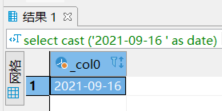
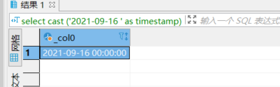
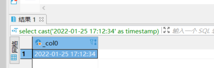

# 1- 强制转成date

``` sql
select  cast ('2021-09-16 ' as date);
```



# 2- 强转成timestamp

``` sql
select  cast ('2021-09-16 ' as timestamp);
select  cast('2022-01-25 17:12:34' as timestamp);
```






# 3- 获取 year-month-day-hour-minute-second

``` sql
select add_time from kudu.zzzdd.zzz_dingdan 
where part_day = '2022-02-07' 
and hour(add_time) = 17 
and minute(add_time) = 37 
limit 10;
```


select add_time from kudu.zzz.zzz_dingdan 
where part_day = '2022-02-07' 
and add_time <= cast('2022-02-07 17:37:00' as timestamp)
order by add_time desc 
limit 10;
