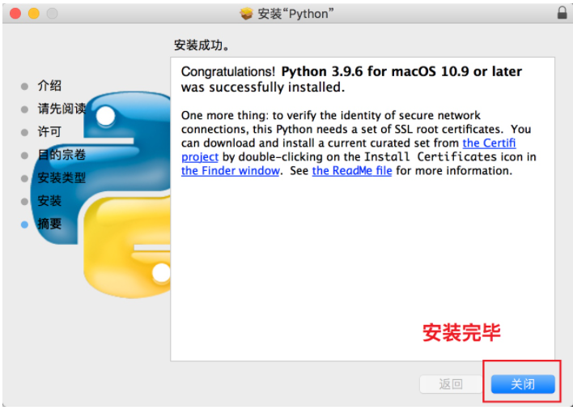
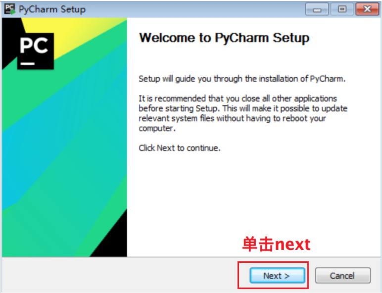

# day01_python基础

## 1. Python基本介绍

​		Python由荷兰数学和计算机科学研究学会的吉多·范罗苏姆于1990 年代初设计，作为一门叫做ABC语言的替代品。Python提供了高效的高级数据结构，还能简单有效地面向对象编程。Python语法和动态类型，以及解释型语言的本质，使它成为多数平台上写脚本和快速开发应用的编程语言，随着版本的不断更新和语言新功能的添加，逐渐被用于独立的、大型项目的开发。

​		Python解释器易于扩展，可以使用C语言或C++（或者其他可以通过C调用的语言）扩展新的功能和数据类型。 Python 也可用于可定制化软件中的扩展程序语言。Python丰富的标准库，提供了适用于各个主要系统平台的源码或机器码。

​		2022年01月，语言流行指数的编译器Tiobe将Python加冕为最受欢迎的编程语言，20年来首次将其置于Java、C和JavaScript之上


### 1.1 Python语言特点

优点:

* 1- 免费、开源、简单、易学、易读,易维护:

```properties
	Python是一种代表简单主义思想的语言。阅读一个良好的Python程序就感觉像是在读英语一样。它使你能够专注于解决问题而不是去搞明白语言本身。
	Python极其容易上手，因为Python有极其简单的说明文档
	风格清晰划一、强制缩进
```

* 2- 高层语言:

```properties
	用Python语言编写程序的时候无需考虑诸如如何管理你的程序使用的内存一类的底层细节。 很多功能已经封装好了, 我们只需要关系业务本身即可
```

* 3- 可移植性:

```properties
	由于它的开源本质，Python已经被移植在许多平台上（经过改动使它能够工作在不同平台上）。这些平台包括Linux、Windows、FreeBSD、Macintosh、Solaris、OS/2、Amiga、AROS、AS/400、BeOS、OS/390、z/OS、Palm OS、QNX、VMS、Psion、Acom RISC OS、VxWorks、PlayStation、Sharp Zaurus、Windows CE、PocketPC、Symbian以及Google基于linux开发的android平台。
```

* 4- 解释性:

```properties
	在计算机内部，Python解释器把源代码转换成称为字节码的中间形式，然后再把它翻译成计算机使用的机器语言并运行。这使得使用Python更加简单。也使得Python程序更加易于移植。
```

* 5- 面向对象

```properties
	Python既支持面向过程的编程也支持面向对象的编程。在“面向过程”的语言中，程序是由过程或仅仅是可重用代码的函数构建起来的。在“面向对象”的语言中，程序是由数据和功能组合而成的对象构建起来的。与其他主要的语言如C++和Java相比，Python以一种非常强大又简单的方式实现面向对象编程。
```

* 6- 可扩展性、可扩充性

```properties
	如果你需要你的一段关键代码运行得更快或者希望某些算法不公开，你可以把你的部分程序用C或C++编写，然后在你的Python程序中使用它们。
```

* 7- 可嵌入性

```properties
	可以把Python嵌入C/C++程序，从而向程序用户提供脚本功能。
```

* 8- 丰富的库

```properties
	Python标准库很庞大。 它可以帮助处理各种工作，包括正则表达式、文档生成、单元测试、线程、数据库、网页浏览器、CGI、FTP、电子邮件、XML、XML-RPC、HTML、WAV文件、密码系统、GUI（图形用户界面）、Tk和其他与系统有关的操作。这被称作Python的“功能齐全”理念。除了标准库以外，还有许多其他高质量的库，如wxPython、Twisted和Python图像库等等。
```

* 9- 规范的代码

```properties
	Python采用强制缩进的方式使得代码具有极佳的可读性。
```


弊端:

```properties
	Python语言非常完善，没有明显的短板和缺点，唯一的缺点就是执行效率慢，这个是解释型语言所通有的，同时这个缺点也将被计算机越来越强大的性能所弥补
```

### 1.2 Python的应用场景


​		目前基于Python的应用场景非常的广泛, 包括web开发, 测试, 爬虫, 机器学习, 数据分析等, 由于是在最近几年python在大数据中应用也是非常的广泛, 比如在 spark中, pyspark库的每月下载量超过500w次


## 2. Python环境的搭建

### 2.1 python解析器安装

* 1- 下载python解析器

  下载地址：https://www.python.org/

  

  * windows为例

  

  * mac版本

  

  

* 2- 安装解析器:

  * windows:

  

  

  

  

  

  ​	打开CMD, 进行校验:

  ​	

  

  * mac系统:

  

  

  

  

  

  

### 2.2 pycharm 安装操作

* 1- 下载pycharm
  * 下载地址: https://www.jetbrains.com/pycharm/


​	下载专业版本:


* 2- 安装pycharm:




​	双击打开即可: 如果弹出一下界面, 选择即可


### 2.3 pycharm绿化操作

​		打开pycharm,选择试用（Evaluate for free）选项，点击Evaluate进入IDE,将资料中提供的jar包, 拖拽即可

* 打开后, 如果弹出激活界面, 请选择试用30天:


此时, 我们就看到以下界面了:


提供30天无限续期的绿化操作: 


如果弹出以下界面:


可以尝试, 先创建一个项目, 然后在重新丢入无限续期的jar包:

丢入后:


然后选择重启即可:


​		此绿化操作, 仅能绿化 2021-2 及以下的版本, 如果 以上的版本目前暂不支持,而且支持jetbrains全套各种软件均可解决


## 3. 开发第一个Python程序

* 1- 打开pycharm. 选择 new project 创建第一个python项目


* 2- 选择 `Location` 表示该项目保存的路径，`Interpreter` 表示使用的Python解释器版本，最后点击`Create` 创建项目


* 3-右击项目 选择new, 在选择python File


* 4- 在弹出的对话框中输入的文件名hello_world，直接回车，表示创建一个Python程序的文本文件，文本文件后缀名默认.py


* 5- 输入以下代码，并右击空白处，选择`Run`运行，表示打印一个字符串"hello world!"

  ```properties
  print("hello world!")
  ```


* 6- 运行成功后，Pycharm Console窗口将显示我们的输出结果


## 4. python基础语法

### 4.1 注释 

* 单行注释: 以#开头，#右边的所有文字当作说明，而不是真正要执行的程序，起辅助说明作用

```properties
# 我是注释，可以在里写一些功能说明之类的哦
print('hello world')
```

* 2- 多行注释
  * """内容""", 三个引号引起来的内容作为对代码的解释说明, 这里的解释往往比较详尽,行数较多(三个单引号或者三个双引号都可以)

```properties
'''
  我是多行注释，可以写很多很多行的功能说明

    下面的代码完成 ，打印一首诗
    名字叫做：春江花月夜
'''
```

### 4.2 定义变量


如何定义变量呢?

* 格式: 变量名=值

```properties
num1 = 100

num2 = 87

result = num1 + num2
```

当我们直接定义值的时候, python会自动推断类型的, 那么如何查看python所推断的类型是什么呢?

```properties
# 定义一个数字类型变量num
num = 10
# 这里使用type就可以查看num的具体类型
print(type(num))
```


### 4.2.2查看变量类型type()

```properties
# 定义一个数字类型变量num
num = 10
# 这里使用type就可以查看num的具体类型
print(type(num))
```


### 4.3 输出操作

* 标准输出操作

```properties
# 输出函数print的使用
print('hello world')
print('萨瓦迪卡---泰语，你好的意思')
```


* 格式化输出

```properties
age = 10
print("我今年%d岁" % age)

age = 11
print("我今年%d岁" % age)

age = 12
print("我今年%d岁" % age)
```

> 看上面的代码可以知道, 只需要改标age的大小, 就可以输出不同的结果而不需要每一次都去修改`"我今年10岁"`

在程序中，看到了`%`这样的操作符，就是Python中格式化输出.

**格式化输出的作用**: 可以在不改变print函数中的数据的情况下就可以输出不同的数据

```properties
age = 18
name = "xiaohua"
print("我的姓名是%s, 年龄是%d" % (name, age))
```


常用的格式符号:

| 格式符号 |            转换            |
| :------: | :------------------------: |
|    %c    |            字符            |
|    %s    |           字符串           |
|    %d    |      有符号十进制整数      |
|    %u    |      无符号十进制整数      |
|    %o    |         八进制整数         |
|    %x    | 十六进制整数（小写字母0x） |
|    %X    | 十六进制整数（大写字母0X） |
|    %f    |           浮点数           |
|    %e    |   科学计数法（小写'e'）    |
|    %E    |   科学计数法（大写“E”）    |
|    %g    |      ％f和％e 的简写       |
|    %G    |       ％f和％E的简写       |

* 换行输出

```properties
    print("1234567890-------") # 会在一行显示

    print("1234567890\n-------") # 一行显示1234567890，另外一行显示-------
```

* f-strings 输出
  * f-strings 提供一种简洁易读的方式, 可以在字符串中包含 Python 表达式. f-strings 以字母 'f' 为前缀, 格式化字符串使用一对单引号、双引号、三单引号、三双引号. 格式化字符串中

```properties
name = '老铁'
age = 33
print('--------------------------------------------------')
print(f'名字:{name},年龄{age}')
print('--------------------------------------------------')
```

结果:

```properties
--------------------------------------------------
名字:老铁,年龄33
--------------------------------------------------
```

### 4.4 输入操作

* input() 函数

```properties
password = input("请输入密码:")
print('您刚刚输入的密码是:%d' % password)
```

运行结果:


>**注意**:
>
>- input()的小括号中放入的是，提示信息，用来在获取数据之前给用户的一个简单提示
>- input()在从键盘获取了数据以后，会存放到等号右边的变量中
>- input()会把用户输入的任何值都作为字符串来对待

### 4.5 运算符

* 1- 算术运算符

| 运算符 |  描述  | 实例                                                         |
| :----: | :----: | :----------------------------------------------------------- |
|   +    |   加   | 两个对象相加 a + b 输出结果 30                               |
|   -    |   减   | 得到负数或是一个数减去另一个数 a - b 输出结果 -10            |
|   *    |   乘   | 两个数相乘或是返回一个被重复若干次的字符串 a * b 输出结果 200 |
|   /    |   除   | b / a 输出结果 2                                             |
|   //   | 取整除 | 返回商的整数部分 9//2 输出结果 4 , 9.0//2.0 输出结果 4.0     |
|   %    |  取余  | 返回除法的余数 b % a 输出结果 0                              |
|   **   |  指数  | a**b 为10的20次方， 输出结果 100000000000000000000           |

>注意：混合运算时，优先级顺序为： `**` 高于 `*` `/` `%` `//` 高于 `+` `-` ，为了避免歧义，建议使用 `()` 来处理运算符优先级。
>
>并且，不同类型的数字在进行混合运算时，整数将会转换成浮点数进行运算。

下面以a=10 ,b=20为例进行计算

```properties
>>> 10 + 5.5 * 2
21.0
>>> 10 + (5.5 * 2)
21.0
```

* 2- 赋值运算符

| 运算符 |    描述    | 实例                                                         |
| :----- | :--------: | ------------------------------------------------------------ |
| =      | 赋值运算符 | 把 = 号右边的结果 赋给 左边的变量，如 num = 1 + 2 * 3，结果num的值为7 |

```properties
# 单个变量赋值
>>> num = 10
>>> num
10

# 多个变量赋值
>>> num1, num2, f1, str1 = 100, 200, 3.14, "hello"
>>> num1
100
>>> num2
200
>>> f1
3.14
>>> str1
"hello"
```

* 3- 复合赋值运算符

| 运算符 |       描述       | 实例                      |
| :----- | :--------------: | ------------------------- |
| +=     |  加法赋值运算符  | c += a 等效于 c = c + a   |
| -=     |  减法赋值运算符  | c -= a 等效于 c = c - a   |
| *=     |  乘法赋值运算符  | c *= a 等效于 c = c * a   |
| /=     |  除法赋值运算符  | c /= a 等效于 c = c / a   |
| %=     |  取模赋值运算符  | c %= a 等效于 c = c % a   |
| **=    |   幂赋值运算符   | c **= a 等效于 c = c ** a |
| //=    | 取整除赋值运算符 | c //= a 等效于 c = c // a |

### 4.6 常用数据类型转换

在程序中往往会出现需要数据类型转化的需求

> 例如:
>
> ​		input()函数默认接受到的是str(字符串)数据类型数据, 而我们需要input()函数给我们一个数字类型的数据. 这时候我们就可以把接受到的数据进行数据类型转化.

| 函数                   | 说明                                                |
| :--------------------- | :-------------------------------------------------- |
| int(x [,base ])        | 将x转换为一个整数                                   |
| float(x )              | 将x转换为一个浮点数                                 |
| complex(real [,imag ]) | 创建一个复数，real为实部，imag为虚部                |
| str(x )                | 将对象 x 转换为字符串                               |
| repr(x )               | 将对象 x 转换为表达式字符串                         |
| eval(str )             | 用来计算在字符串中的有效Python表达式,并返回一个对象 |
| tuple(s )              | 将序列 s 转换为一个元组                             |
| list(s )               | 将序列 s 转换为一个列表                             |
| chr(x )                | 将一个整数转换为一个Unicode字符                     |
| ord(x )                | 将一个字符转换为它的ASCII整数值                     |
| hex(x )                | 将一个整数转换为一个十六进制字符串                  |
| oct(x )                | 将一个整数转换为一个八进制字符串                    |
| bin(x )                | 将一个整数转换为一个二进制字符串                    |

举例:

```properties
>>> # int(): 将数据转换为 int 类型
>>> str1 = "10"
>>> # int() 默认按10进制转换后显示
... num1 = int(str1)
>>> print(num1)
10

>>> # int() 处理浮点数，只留下整数部分，舍弃小数部分（并不是四舍五入操作）
... num2 = int(3.74)
>>> print(num2)
3
```

## 5. 判断语句和循环语句

### 5.1 if判断语句

* if语句是用来进行判断的，其使用格式如下：

```properties
   if 要判断的条件:
        条件成立时，要做的事情
```

- 案例一: 写一个网吧登录的程序, 年满18岁就可以上网,不满18岁就不可以上网, 那么这个程序在编写的时候就需要用到if判断语句

```properties
 	print("------if判断开始------")

    if age >= 18:
        print("我已经成年了")

    print("------if判断结束------")
```

结果:

```properties
    ------if判断开始------
    我已经成年了
    ------if判断结束------
```

注意：

- if判断语句的作用：就是当满足一定条件时才会执行代码块语句，否则就不执行代码块语句。
- 注意：代码的缩进为一个tab键，或者4个空格

----

* if-else的使用格式

```properties
    if 条件:
        满足条件时要做的事情1
        满足条件时要做的事情2
        满足条件时要做的事情3
        ...(省略)...
    else:
        不满足条件时要做的事情1
        不满足条件时要做的事情2
        不满足条件时要做的事情3
        ...(省略)...
```

示例一:

```python
    ticket = 1 # 用1代表有车票，0代表没有车票
    if ticket == 1:
        print("有车票，可以上火车")
        print("终于可以见到Ta了，美滋滋")
    else:
        print("没有车票，不能上车")
        print("亲爱的，那就下次见了"）
```


----

* if-elif-else语法

```python
    if xxx1:
        事情1
    elif xxx2:
        事情2
    elif xxx3:
        事情3
    else:
        其他
```

>说明:
>
>- 当xxx1满足时，执行事情1，然后整个if结束
>- 当xxx1不满足时，那么判断xxx2，如果xxx2满足，则执行事情2，然后整个if结束
>- 当xxx1不满足时，xxx2也不满足，如果xxx3满足，则执行事情3，然后整个if结束
>- 以上都不满足 走 else

案例:

```python
    score = 77

    if score>=90 and score<=100:
        print('本次考试，等级为A')
    elif score>=80 and score<90:
        print('本次考试，等级为B')
    elif score>=70 and score<80:
        print('本次考试，等级为C')
    elif score>=60 and score<70:
        print('本次考试，等级为D')
    else:
        print('本次考试，等级为E')
```

----

* if嵌套使用

```python
    if 条件1:

        满足条件1 做的事情1
        满足条件1 做的事情2

        if 条件2:
            满足条件2 做的事情1
            满足条件2 做的事情2
```

>- 说明
> - 外层的if判断，也可以是if-else
> - 内层的if判断，也可以是if-else
> - 根据实际开发的情况，进行选择

```python
ticket = 1     # 用1代表有车票，0代表没有车票
knief_length = 9     # 刀子的长度，单位为cm

if ticket == 1:
    print("有车票，可以进站")
    if knief_length < 10:
        print("通过安检")
        print("终于可以见到Ta了，美滋滋<font color=Coral size=5>~")
    else:
        print("没有通过安检")
        print("刀子的长度超过规定，等待警察处理...")
else:
    print("没有车票，不能进站")
    print("亲爱的，那就下次见了")
```


### 5.2 比较/逻辑运算符

常见的比较运算符:

| 运算符 | 描述                                                         | 示例                           |
| :----- | :----------------------------------------------------------- | :----------------------------- |
| ==     | 检查两个操作数的值是否相等，如果是则条件变为真。             | 如a=3,b=3，则（a == b) 为 True |
| !=     | 检查两个操作数的值是否相等，如果值不相等，则条件变为真。     | 如a=1,b=3，则(a != b) 为 True  |
| >      | 检查左操作数的值是否大于右操作数的值，如果是，则条件成立。   | 如a=7,b=3，则(a > b) 为 True   |
| <      | 检查左操作数的值是否小于右操作数的值，如果是，则条件成立。   | 如a=7,b=3，则(a < b) 为 False  |
| >=     | 检查左操作数的值是否大于或等于右操作数的值，如果是，则条件成立。 | 如a=3,b=3，则(a >= b) 为 True  |
| <=     | 检查左操作数的值是否小于或等于右操作数的值，如果是，则条件成立。 | 如a=3,b=3，则(a <= b) 为 True  |

```properties
# 关系运算符
# 这里的True代表成立 False代表不成立

>>> # == 等于：表示左右两个操作数是否相等，如果相等则整个表达式的值为 True；不相等则为False
>>> num1 = 15
>>> num2 = 20
>>> print(num1 == num2)
False

>>> # != 不等于
>>> print(num1 != num2)
True

>>> # > 大于
>>> print(num1 > num2)
False

>>> # < 小于
>>> print(num1 < num2)
True

>>> # >= 大于等于: num1 大于 或者 等于 num2 ，条件都成立
>>> print(num1 >= num2)
False

>>> # <= 小于等于： num1 小于 或者 等于 num2 ，条件都成立
>>> print(num1 <= num2)
True
```

常见逻辑运算符:

| 运算符 | 逻辑表达式 | 描述                                                         | 实例                                     |
| :----- | ---------- | :----------------------------------------------------------- | :--------------------------------------- |
| and    | x and y    | 布尔"与"：如果 x 为 False，x and y 返回 False，否则它返回 y 的值。 | True and False， 返回 False。            |
| or     | x or y     | 布尔"或"：如果 x 是 True，它返回 True，否则它返回 y 的值。   | False or True， 返回 True。              |
| not    | not x      | 布尔"非"：如果 x 为 True，返回 False 。如果 x 为 False，它返回 True。 | not True 返回 False, not False 返回 True |

```properties
# 逻辑运算符

>>> # and : 左右表达式都为True，整个表达式结果才为 True
... if (1 == 1) and (10 > 3):
...     print("条件成立！")
... 
条件成立！

>>> # or : 左右表达式有一个为True，整个表达式结果就为 True
... if (1 == 2) or (10 > 3):
...     print("条件成立！")
... 
条件成立！

>>> # not：将右边表达式的逻辑结果取反，Ture变为False，False变为True
... if not (1 == 2):
...     print("条件成立！")
... 
条件成立！
```

### 5.3 三目计算

​		python本身并不支持三目(三元)计算, 但是我们可以通过 if else 变形来解决

````python
if 判断条件1:
    表达式1
else:
    表达式2
    
判断条件成立,执行表达式 1, 条件不成立,执行表达式 2

变量 = 表达式1 if 判断条件 else 表达式2  # 推荐使用扁平化代码

变量最终存储的结构是: 
    判断条件成立,表达式1的值, 
    条件不成立,表达式2的值
````


### 5.4 小案例:  猜拳游戏

需求:

1. 输⼊要出的拳 —— ⽯头（1）／剪⼑（2）／布（3）
2. 电脑 随机 出拳 —— 先假定电脑只会出⽯头，完成整体代码功能
3. ⽐较胜负


如何实现随机操作:

* 在 Python 中，要使⽤随机数，⾸先需要导⼊ 随机数 的 模块 —— “⼯具包”

```properties
import random
```

- 导⼊模块后，可以直接在 模块名称 后⾯敲⼀个 . 然后按 Tab 键，会提示该模块中包含的所有函数
- random.randint(a, b) ，返回 [a, b] 之间的整数，包含 a 和 b
- 例如：

```python
>>> import random
>>> random.randint(1,3)
3
>>> random.randint(1,3)
3
>>> random.randint(1,3)
2
>>> random.randint(1,3)
3
>>> random.randint(1,3)
2
>>> random.randint(1,3)
1
```


代码实现:

```python
import random
"""
需求:
    1. 输⼊要出的拳 —— ⽯头（1）／剪⼑（2）／布（3）
    2. 电脑 随机 出拳 —— 先假定电脑只会出⽯头，完成整体代码功能
    3. ⽐较胜负
"""

# 1) 输⼊要出的拳 —— ⽯头（1）／剪⼑（2）／布（3）


player_user = int(input("请输入: ⽯头（1）／剪⼑（2）／布（3）:"))

# 2)电脑随机出拳:
# 随机产生 一个  1~3之间的数字: 1 或者 2 或者 3
player_pc = random.randint(1,3)

# 3) 比较操作:
if player_user == player_pc:
    print("平局......")
elif ((player_user == 1) and (player_pc == 2)) or ((player_user ==2) and (player_pc == 3)) or ((player_user == 3) and (player_pc == 1)):
    print("我赢了")
else:
    print("我输了")
```

### 5.5 循环语句

#### 5.5.1 while循环

格式:

```python
 while 条件:
        条件满足时，做的事情1
        条件满足时，做的事情2
        条件满足时，做的事情3
        ...(省略)...
```

案例: 循环打印5次

```properties
    i = 0
    while i < 5:
        print("当前是第%d次执行循环" % (i + 1))
        print("i=%d" % i)
        i+=1
```

死循环

```properties
while True:
    print(1)
```


---

综合案例:

* 需求一: 计算1~100 的累加和(包含1~100)

```python
i = 1
sum = 0
while i <= 100:
    sum = sum + i
    i += 1

print("1~100的累加和为:%d" % sum)
```

* 需求二: 计算1~100之间偶数的累加和（包含1和100）

```python
i = 1
sum = 0
while i <= 100:
    if i % 2 == 0:
        sum = sum + i
    i+=1

print("1~100的累加和为:%d" % sum)
```

---

* while嵌套

```python
格式:
	while 条件1:

        条件1满足时，做的事情1
        条件1满足时，做的事情2
        条件1满足时，做的事情3
        ...(省略)...

        while 条件2:
            条件2满足时，做的事情1
            条件2满足时，做的事情2
            条件2满足时，做的事情3
            ...(省略)...
```

案例1:

````python
要求：打印如下图形：
* * * * * 
* * * * * 
* * * * * 
* * * * * 
* * * * *


代码实现:
i = 1
while i <= 5:
    j = 1
    while j <= 5:
        print("*", end=" ")
        j += 1
    print()

    i += 1
````

案例2: 

```properties
要求：打印如下图形：
* 
* * 
* * * 
* * * *  
* * * * *

参考代码：
i = 1
while i <= 5:
    j = 1
    while j <= i:
    	# end 设置 print的结尾内容, 默认是 \n 回车 更改为 空格, 表示不换行
        print("*", end=" ")
        j += 1
    print()

    i += 1
```

#### 5.5.2 for 循环

格式:

```python
for 临时变量 in 列表或者字符串等可迭代对象:
    循环满足条件时执行的代码
```

示例1:

```python
name = 'itheima'

for x in name:
    print(x)
```

示例2:

```python
# 作为刚开始学习python的我们，此阶段仅仅知道range(5)表示可以循环5次即可
for i in range(5):
    print(i)

'''
效果等同于 while 循环的：

i = 0
while i < 5:
    print(i)
    i += 1
'''
```

#### 5.5.3 break 和 continue

break作用: 立刻结束break所在的循环

-----


* break 在for循环中使用

```python
name = 'itheima'

for x in name:
    print('----')
    if x == 'e': 
        break
    print(x)
else:
    print("==for循环过程中，如果没有执行break退出，则执行本语句==")
```


* break 在while循环中使用

```
i = 0

while i<5:
    i = i+1
    print('----')
    if i==3:
        break
    print(i)
else:
    print("==while循环过程中，如果没有执行break退出，则执行本语句==")
```


---

continue作用: 用来结束本次循环，紧接着执行下一次的循环

案例:

```properties
i = 0

while i<5:
    i = i+1
    print('----')
    if i==3:
        continue
    print(i)
```


## 6- python的容器

**`容器`**：容器是一种把多个元素组织在一起的数据结构，容器中的元素可以逐个地迭代获取，可以用各种内置方法对容器中的数据进行增删改查等操作

**`人话`**: 容器就是存储数据的东西, 同时Python为了方便我们对容器中的数据进行增加删除修改查询专门提供了相应的方法便于我们操作

Python中常见容器有如下几种:

- 字符串
- 列表
- 元组
- 字典

### 6.1 字符串

* 定义格式:

```python
 b = "hello itcast.cn"
 或者
 b = 'hello itcast.cn'
   
注意：
	双引号或者单引号中的数据，就是字符串
```

* 字符串的下标:

  * 如有字符串:`name = 'abcdef'`，在内存中的实际存储如下:

  

  如果想取出部分字符，那么可以通过`下标`的方法（**注意python中下标从 0 开始**）

  ```
   name = 'abcdef'
  
  print(name[0])
  print(name[1])
  print(name[2])
  
  结果如下:
  a
  b
  c
  ```

  >- 列表与元组也同样支持下标操作
  >- 下标也叫做索引

* <font color='red'>**字符串的切片**</font>

  * 切片是指对操作的对象截取其中一部分的操作. 比如想要取字符串"888666@qq.com"中的QQ号的时候就可以使用切片
  * **`切片的语法`**：**<font color='red'>[起始  :  结束  :  步长]</font>**   (**包头不包尾**)
  * **`注意`**：选取的区间从"起始"位开始，到"结束"位的前一位结束（不包含结束位本身)，步长表示选取间隔的长度
  * 注意： <font color='red'>**正数表示从前往后，负数表示从后往前；前面从0开始数，后面从-1开始数**  </font>

```python
name = 'abcdef'
print(name[0:3]) # 取 下标0~2 的字符

#运行结果:
abc


name = 'abcdef'
print(name[3:5]) # 取 下标为3、4 的字符

#运行结果:
de


name = 'abcdef'
print(name[2:]) # 取 下标为2开始到最后的字符

#运行结果:
cdef


name = 'abcdef'
print(name[1:-1]) # 取 下标为1开始 到 最后第2个  之间的字符

#运行结果:
bcde
```

>ps:
>
>- **字符串、列表、元组**都支持切片操作
>- 下标/索引是通过下标取某一个元素, 切片是通过下标去某一段元素


---

字符串常见操作

* 1- 查找: 
  * find(子串，**[起始位置],[结束位置]**) 
  * index(子串，**[起始位置],[结束位置]**)
  * 语法:
    * find(): 字符串序列.find(子串, 开始位置下标, 结束位置下标) <font color='red'>当子串不存在就返回-1</font>
    * index()：检测某个子串是否包含在这个字符串中，<font color='red'>返回这个子串开始的位置下标，否则则**报异常**。</font>

```python
mystr = "hello world and itcast and itheima and Python"

print(mystr.find('and'))  # 12
print(mystr.find('and', 15, 30))  # 23
print(mystr.find('ands'))  # -1


print(mystr.index('and'))  # 12
print(mystr.index('and', 15, 30))  # 23
print(mystr.index('ands'))  # 报错
```

* 2- 修改--replace(),split()
  * 格式:
    * **replace**(): 字符串序列.    replace(旧子串, 新子串, **<font color='red'>替换次数</font>**)  <font color='red'>生成一个新的字符串</font>
    * **split**(): 字符串序列.    split(分割字符, **<font color='red'>num</font>**)
      * 注意：num表示的是**<font color='red'>切分次数</font>**，即将来返回数据个数为num+1个。

```python
mystr = "hello world and itcast and itheima and Python"

# 结果：hello world he itcast he itheima he Python
print(mystr.replace('and', 'he'))

# 结果：hello world he itcast he itheima he Python
print(mystr.replace('and', 'he', 10))

# 结果：hello world and itcast and itheima and Python
print(mystr)


# 结果：['hello world ', ' itcast ', ' itheima ', ' Python']
print(mystr.split('and'))

# 结果：['hello world ', ' itcast ', ' itheima and Python']
print(mystr.split('and', 2))

# 结果：['hello', 'world', 'and', 'itcast', 'and', 'itheima', 'and', 'Python']
print(mystr.split(' '))

# 结果：['hello', 'world', 'and itcast and itheima and Python']
print(mystr.split(' ', 2))

```

其他字符串API说明:

```python
<1>capitalize
把字符串的第一个字符大写

mystr.capitalize()

<2>title
把字符串的每个单词首字母大写

>>> a = "hello itcast"
>>> a.title()
'Hello Itcast'
<3>startswith
检查字符串是否是以 hello 开头, 是则返回 True，否则返回 False

mystr.startswith(hello)

<4>endswith
检查字符串是否以obj结束，如果是返回True,否则返回 False.

mystr.endswith(obj)

<5>lower
转换 mystr 中所有大写字符为小写

mystr.lower()   

<6>upper
转换 mystr 中的小写字母为大写

mystr.upper()

<7>ljust
返回一个原字符串左对齐,并使用空格填充至长度 width 的新字符串

mystr.ljust(width)

<8>rjust
返回一个原字符串右对齐,并使用空格填充至长度 width 的新字符串

mystr.rjust(width)

<9>center
返回一个原字符串居中,并使用空格填充至长度 width 的新字符串

mystr.center(width)  

<10>lstrip
删除 mystr 左边的空白字符

mystr.lstrip()

<11>rstrip
删除 mystr 字符串末尾的空白字符

mystr.rstrip()

<12>strip
删除mystr字符串两端的空白字符

>>> a = "\n\t itcast \t\n"
>>> a.strip()
'itcast'

<13>rfind
类似于 find()函数，不过是从右边开始查找.

mystr.rfind(str, start=0,end=len(mystr) )

<14>rindex
类似于 index()，不过是从右边开始.

mystr.rindex( str, start=0,end=len(mystr))

<15>partition
把mystr以str分割成三部分,str前，str和str后

mystr.partition(str)

<16>rpartition
类似于 partition()函数,不过是从右边开始.

mystr.rpartition(str)

<17>splitlines
按照行分隔，返回一个包含各行作为元素的列表

mystr.splitlines()  

<18>isalpha
如果 mystr 所有字符都是字母 则返回 True,否则返回 False

mystr.isalpha()

<19>isdigit
如果 mystr 只包含数字则返回 True 否则返回 False.

mystr.isdigit()

<20>isalnum
如果 mystr 所有字符都是字母或数字则返回 True,否则返回 False

mystr.isalnum() 

<21>isspace
如果 mystr 中只包含空格，则返回 True，否则返回 False.

mystr.isspace()   
```

### 6.2 列表

​		类似于JAVA中的list或者数组

* 定义的格式:

  ```python
   namesList = [值1,值2,值3]
  ```

* 打印列表中某一个

  ```python
   namesList = ['xiaoWang','xiaoZhang','xiaoHua']
   print(namesList[0])
   print(namesList[1])
   print(namesList[2])
  ```

* 基于for循环遍历:

  ```python
  names_list = ['xiaoWang','xiaoZhang','xiaoHua']
  for name in names_list:
      print(name)
     
  结果:
      xiaoWang
      xiaoZhang
      xiaoHua
  ```

* 基于while循环:

  ```python
  names_list = ['xiaoWang','xiaoZhang','xiaoHua']
  
  length = len(names_list)
  
  i = 0
  
  while i<length:
      print(names_list[i])
      i+=1
   
  结果:
      xiaoWang
      xiaoZhang
      xiaoHua
  ```

---

列表相关的API:

* 添加元素:

  * append: 通过append可以向列表添加元素

  ```properties
  #定义变量A，默认有3个元素
  A = ['xiaoWang','xiaoZhang','xiaoHua']
  
  print("-----添加之前，列表A的数据-----")
  for temp_name in A:
      print(temp_name)
  
  #提示、并添加元素
  temp = input('请输入要添加的学生姓名:')
  A.append(temp)
  
  print("-----添加之后，列表A的数据-----")
  for temp_name in A:
      print(temp_name)
  ```

  * extend: 通过extend可以将另一个集合中的元素逐一添加到列表中

  ```python
  >>> a = [1, 2]
  >>> b = [3, 4]
  >>> a.append(b)
  >>> a
  [1, 2, [3, 4]]
  >>> a.extend(b)
  >>> a
  [1, 2, [3, 4], 3, 4]
  ```

  * insert: insert(index, object) 在指定位置index前插入元素object

  ```python
  >>> a = [0, 1, 2]
  >>> a.insert(1, 3)
  >>> a
  [0, 3, 1, 2]
  ```

* 修改元素:

  * 修改元素的时候，要通过下标来确定要修改的是哪个元素，然后才能进行修改

  ```python
  #定义变量A，默认有3个元素
  A = ['xiaoWang','xiaoZhang','xiaoHua']
  
  print("-----修改之前，列表A的数据-----")
  for temp_name in A:
      print(temp_name)
  
  #修改元素
  A[1] = 'xiaoLu'
  
  print("-----修改之后，列表A的数据-----")
  for temp_name in A:
      print(temp_name)
  
      
  结果:
  
      -----修改之前，列表A的数据-----
      xiaoWang
      xiaoZhang
      xiaoHua
      -----修改之后，列表A的数据-----
      xiaoWang
      xiaoLu
      xiaoHua
  ```

* 查找元素 : 看指定的元素是否存在

  * in, not in

    >python中查找的常用方法为：
    >
    >- in（存在）,如果存在那么结果为true，否则为false
    >- not in（不存在），如果不存在那么结果为true，否则false

  ```python
  #待查找的列表
  name_list = ['xiaoWang','xiaoZhang','xiaoHua']
  
  #获取用户要查找的名字
  find_name = input('请输入要查找的姓名:')
  
  #查找是否存在
  if find_name in name_list:
      print('在字典中找到了相同的名字')
  else:
      print('没有找到')
  ```

  * index,count

  ```python
  >>> a = ['a', 'b', 'c', 'a', 'b']
  >>> a.index('a', 1, 3) # 注意是左闭右开区间
  Traceback (most recent call last):
    File "<stdin>", line 1, in <module>
  ValueError: 'a' is not in list
  >>> a.index('a', 1, 4)
  3
  >>> a.count('b')
  2
  >>> a.count('d')
  0
  ```

* 删除元素: 

  * del：根据下标进行删除

  ```python
  movie_name = ['加勒比海盗','骇客帝国','第一滴血','指环王','霍比特人','速度与激情']
  
  print('------删除之前------')
  for temp_name in movie_name:
      print(movie_name)
  
  del movie_name[2]
  
  print('------删除之后------')
  for temp_name in movie_name:
      print(temp_name)
      
  
  结果:
  
      ------删除之前------
      加勒比海盗
      骇客帝国
      第一滴血
      指环王
      霍比特人
      速度与激情
      ------删除之后------
      加勒比海盗
      骇客帝国
      指环王
      霍比特人
      速度与激情
  ```

  

  * pop：删除最后一个元素

  ```python
  movie_name = ['加勒比海盗','骇客帝国','第一滴血','指环王','霍比特人','速度与激情']
  
  print('------删除之前------')
  for temp_name in movie_name:
      print(temp_name)
  
  movie_name.pop()
  
  print('------删除之后------')
  for temp_name in movie_name:
      print(temp_name)
      
  
  结果:
  
  ------删除之前------
  加勒比海盗
  骇客帝国
  第一滴血
  指环王
  霍比特人
  速度与激情
  ------删除之后------
  加勒比海盗
  骇客帝国
  第一滴血
  指环王
  霍比特人
  ```

  

  * remove：根据元素的值进行删除

  ```python
  movie_name = ['加勒比海盗','骇客帝国','第一滴血','指环王','霍比特人','速度与激情']
  
  print('------删除之前------')
  for temp_name in movie_name:
      print(temp_name)
  
  movie_name.remove('指环王')
  
  print('------删除之后------')
  for temp_name in movie_name:
      print(temp_name)
      
    
    
  结果:
  
  ------删除之前------
  加勒比海盗
  骇客帝国
  第一滴血
  指环王
  霍比特人
  速度与激情
  ------删除之后------
  加勒比海盗
  骇客帝国
  第一滴血
  霍比特人
  速度与激情
  ```

* 排序

  * sort(): sort方法是将list按特定顺序重新排列，默认为由小到大，参数reverse=True可改为倒序，由大到小。
  * reverse(): 将list逆置。

  ```python
  >>> a = [1, 4, 2, 3]
  >>> a
  [1, 4, 2, 3]
  >>> a.reverse()
  >>> a
  [3, 2, 4, 1]
  >>> a.sort()
  >>> a
  [1, 2, 3, 4]
  >>> a.sort(reverse=True)
  >>> a
  [4, 3, 2, 1]
  ```

* 列表嵌套:

  * 类似于二维数组

  ```python
  chool_names = [['北京大学','清华大学'],['南开大学','天津大学']]
  
  # 对列表打印及打印结果
  print(school_names[0][0])
  >>> 北京大学
  
  print(school_names[0][1])
  >>> 清华大学
  
  print(school_names[1][0])
  >>> 南开大学
  
  print(school_names[1][1])
  >>> 天津大学
  ```

* 列表推导式:

  * 作用：用一个表达式创建一个有规律的列表或控制一个有规律列表。
  * 列表推导式又叫列表生成式。

  ```
  例如: 创建一个0-10的列表
  
  --------------while做法----------------
  # 1. 准备一个空列表
  list1 = []
  
  # 2. 书写循环，依次追加数字到空列表list1中
  i = 0
  while i < 10:
      list1.append(i)
      i += 1
  
  print(list1)
  
  --------------for做法----------------
  list1 = []
  for i in range(10):
      list1.append(i)
  
  print(list1)
  
  
  --------------推导式----------------
  list1 = [i for i in range(10)]
  print(list1)
  ```

  * 带if的列表推导式

  ```properties
  需求: 生成一个1~10的偶数
  list1 = [i for i in range(10) if i % 2 == 0]
  print(list1)
  ```

  * 带有多个for循环的列表推导式

  ```
  需求：创建列表如下：
  	[(1, 0), (1, 1), (1, 2), (2, 0), (2, 1), (2, 2)]
  
  代码:
  
  list1 = [(i, j) for i in range(1, 3) for j in range(3)]
  print(list1)
  ```

### 6.3 元组

元组特点：定义元组使用小括号，且使用逗号隔开各个数据，数据可以是不同的数据类型。

```python
# 多个数据元组
t1 = (10, 20, 30)

# 单个数据元组
t2 = (10,)
```

​	注意：如果定义的元组只有一个数据，那么这个数据后面也好添加逗号，否则数据类型为唯一的这个数据的数据类型

```python
t2 = (10,)
print(type(t2))  # tuple

t3 = (20)
print(type(t3))  # int

t4 = ('hello')
print(type(t4))  # str
```

----

元组的常见操作:

​		元组数据不支持修改，只支持查找，具体如下：

* 按下标查找数据

```python
tuple1 = ('aa', 'bb', 'cc', 'bb')
print(tuple1[0])  # aa
```

- index()：查找某个数据，如果数据存在返回对应的下标，否则报错，语法和列表、字符串的index方法相同。

```python
tuple1 = ('aa', 'bb', 'cc', 'bb')
print(tuple1.index('aa'))  # 0
```

- count()：统计某个数据在当前元组出现的次数。

```python
tuple1 = ('aa', 'bb', 'cc', 'bb')
print(tuple1.count('bb'))  # 2
```

- len()：统计元组中数据的个数。

```python
tuple1 = ('aa', 'bb', 'cc', 'bb')
print(len(tuple1))  # 4
```

> 注意：元组内的直接数据如果修改则立即报错

```python
tuple1 = ('aa', 'bb', 'cc', 'bb')
tuple1[0] = 'aaa'
```

> 但是如果元组里面有列表，修改列表里面的数据则是支持的，故自觉很重要。

```python
tuple2 = (10, 20, ['aa', 'bb', 'cc'], 50, 30)
print(tuple2[2])  # 访问到列表

# 结果：(10, 20, ['aaaaa', 'bb', 'cc'], 50, 30)
tuple2[2][0] = 'aaaaa'
print(tuple2)
```

### 6.4 字典

​		类似于Java中Map

说明：

- 字典和列表一样，也能够存储多个数据
- 列表中找某个元素时，是根据下标进行的
- 字典中找某个元素时，是根据'名字'（就是冒号:前面的那个值，例如上面代码中的'name'、'id'、'sex'）
- 字典的每个元素由2部分组成，键:值。例如 'name':'班长' ,'name'为键，'班长'为值

基本格式:

```properties
info = {'name':'班长', 'id':100, 'sex':'f', 'address':'地球亚洲中国北京'}
```

基本使用:

```
info = {'name':'班长', 'id':100, 'sex':'f', 'address':'地球亚洲中国北京'}

print(info['name'])
print(info['address'])


结果:

班长
地球亚洲中国北京

若访问不存在的键，则会报错：

>>> info['age']
Traceback (most recent call last):
  File "<stdin>", line 1, in <module>
KeyError: 'age'
```

在我们不确定字典中是否存在某个键而又想获取其值时，可以使用get方法，还可以设置默认值：

```
>>> age = info.get('age')
>>> age #'age'键不存在，所以age为None
>>> type(age)
<type 'NoneType'>
>>> age = info.get('age', 18) # 若info中不存在'age'这个键，就返回默认值18
>>> age
18
```

----

常见的操作:

* 查看元素

  除了使用key查找数据，还可以使用get来获取数据

```python
    info = {'name':'吴彦祖','age':18}

    print(info['age']) # 获取年龄

    # print(info['sex']) # 获取不存在的key，会发生异常

    print(info.get('sex')) # 获取不存在的key，获取到空的内容，不会出现异常
```

* 修改元素

  字典的每个元素中的数据是可以修改的，只要通过key找到，即可修改

```python
    info = {'name':'班长', 'id':100, 'sex':'f', 'address':'地球亚洲中国北京'}

    new_id = input('请输入新的学号')

    info['id'] = int(new_id)

    print('修改之后的id为%d:'%info['id'])
```

* 添加元素

  如果在使用 `变量名['键'] = 数据`时，这个“键”在字典中，不存在，那么就会新增这个元素

```python
    info = {'name':'班长', 'sex':'f', 'address':'地球亚洲中国北京'}

    # print('id为:%d'%info['id'])#程序会终端运行，因为访问了不存在的键

    newId = input('请输入新的学号')

    info['id'] = newId

    print('添加之后的id为:%d'%info['id'])
```

结果:

```
    请输入新的学号188
    添加之后的id为: 188
```

* 删除元素

  对字典进行删除操作，有一下几种：

  * del
  * clear()

```python
    info = {'name':'班长', 'sex':'f', 'address':'地球亚洲中国北京'}

    print('删除前,%s'%info['name'])

    del info['name']

    print('删除后,%s'%info['name'])
```

del删除整个字典

```python
    info = {'name':'monitor', 'sex':'f', 'address':'China'}

    print('删除前,%s'%info)

    del info

    print('删除后,%s'%info)
```

clear清空整个字典

```python
    info = {'name':'monitor', 'sex':'f', 'address':'China'}

    print('清空前,%s'%info)

    info.clear()

    print('清空后,%s'%info)
```


-------

其他的一些操作

* get()

  * 语法

  ```
  字典序列.get(key, 默认值)
  ```

  注意：如果当前查找的key不存在则返回第二个参数(默认值)，如果省略第二个参数，则返回None。

  * 快速体验

  ```
  dict1 = {'name': 'Tom', 'age': 20, 'gender': '男'}
  print(dict1.get('name')) 
  >> Tom
  
  print(dict1.get('id', 110))
  >>> 110
  
  print(dict1.get('id'))
  >>> None
  ```

* keys()

  显示所有的key值

```python
dict1 = {'name': 'Tom', 'age': 20, 'gender': '男'}
print(dict1.keys())
>>>dict_keys(['name', 'age', 'gender'])
```

* values()

  显示所有的value值

```python
dict1 = {'name': 'Tom', 'age': 20, 'gender': '男'}
print(dict1.values())
>>>dict_values(['Tom', 20, '男'])
```

* items()

  显示所有的键值对(key-value形式)

```python
dict1 = {'name': 'Tom', 'age': 20, 'gender': '男'}
print(dict1.items())
>>>dict_items([('name', 'Tom'), ('age', 20), ('gender', '男')])
```

### 6.5 公共方法

1. 运算符

| 运算符 |      描述      |      支持的容器类型      |
| :----: | :------------: | :----------------------: |
|   +    |      合并      |    字符串、列表、元组    |
|   *    |      复制      |    字符串、列表、元组    |
|   in   |  元素是否存在  | 字符串、列表、元组、字典 |
| not in | 元素是否不存在 | 字符串、列表、元组、字典 |

* `+`运算

```python
# 1. 字符串 
str1 = 'aa'
str2 = 'bb'
str3 = str1 + str2
print(str3)  # aabb


# 2. 列表 
list1 = [1, 2]
list2 = [10, 20]
list3 = list1 + list2
print(list3)  # [1, 2, 10, 20]

# 3. 元组 
t1 = (1, 2)
t2 = (10, 20)
t3 = t1 + t2
print(t3)  # (10, 20, 100, 200)
```

* `*`运算

```python
# 1. 字符串
print('-' * 10)  # ----------

# 2. 列表
list1 = ['hello']
print(list1 * 4)  # ['hello', 'hello', 'hello', 'hello']

# 3. 元组
t1 = ('world',)
print(t1 * 4)  # ('world', 'world', 'world', 'world')
```

* `in或not in`

```python
# 1. 字符串
print('a' in 'abcd')  # True
print('a' not in 'abcd')  # False

# 2. 列表
list1 = ['a', 'b', 'c', 'd']
print('a' in list1)  # True
print('a' not in list1)  # False

# 3. 元组
t1 = ('a', 'b', 'c', 'd')
print('aa' in t1)  # False
print('aa' not in t1)  # True
```

2. 公共方法

| 函数         | 描述                 |
| ------------ | -------------------- |
| len()        | 计算容器中元素个数   |
| del 或 del() | 删除                 |
| max()        | 返回容器中元素最大值 |
| min()        | 返回容器中元素最小值 |

* `len()`

```python
# 1. 字符串
str1 = 'abcdefg'
print(len(str1))  # 7

# 2. 列表
list1 = [10, 20, 30, 40]
print(len(list1))  # 4

# 3. 元组
t1 = (10, 20, 30, 40, 50)
print(len(t1))  # 5

# 4. 集合
s1 = {10, 20, 30}
print(len(s1))  # 3

# 5. 字典
dict1 = {'name': 'Rose', 'age': 18}
print(len(dict1))  # 2
```

* `del()`

```python
# 1. 字符串
str1 = 'abcdefg'
del str1
print(str1)

# 2. 列表
list1 = [10, 20, 30, 40]
del(list1[0])
print(list1)  # [20, 30, 40]
```

* `max()`

```python
# 1. 字符串
str1 = 'abcdefg'
print(max(str1))  # g

# 2. 列表
list1 = [10, 20, 30, 40]
print(max(list1))  # 40
```

* `min()`

```python
# 1. 字符串
str1 = 'abcdefg'
print(min(str1))  # a

# 2. 列表
list1 = [10, 20, 30, 40]
print(min(list1))  # 10
```

