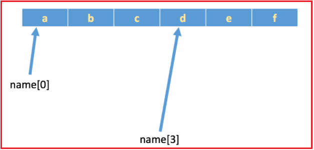
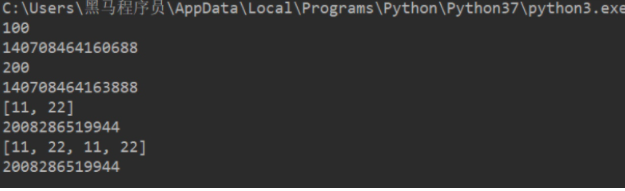

# day02_python基础

## 1- python的容器

**`容器`**：容器是一种把多个元素组织在一起的数据结构，容器中的元素可以逐个地迭代获取，可以用各种内置方法对容器中的数据进行增删改查等操作

**`人话`**: 容器就是存储数据的东西, 同时Python为了方便我们对容器中的数据进行增加删除修改查询专门提供了相应的方法便于我们操作

Python中常见容器有如下几种:

- 字符串
- 列表
- 元组
- 字典

### 1.1 字符串

* 定义格式:

```python
 b = "hello itcast.cn"
 或者
 b = 'hello itcast.cn'
   
注意：
	双引号或者单引号中的数据，就是字符串
```

* 字符串的下标:

  * 如有字符串:`name = 'abcdef'`，在内存中的实际存储如下:

  

  如果想取出部分字符，那么可以通过`下标`的方法（**注意python中下标从 0 开始**）

  ```
   name = 'abcdef'
  
  print(name[0])
  print(name[1])
  print(name[2])
  
  结果如下:
  a
  b
  c
  ```

  >- 列表与元组也同样支持下标操作
  >- 下标也叫做索引

* 字符串的切片

  * 切片是指对操作的对象截取其中一部分的操作. 比如想要取字符串"888666@qq.com"中的QQ号的时候就可以使用切片
  * **`切片的语法`**：[起始:结束:步长]
  * **`注意`**：选取的区间从"起始"位开始，到"结束"位的前一位结束（不包含结束位本身)，步长表示选取间隔的长度

```
name = 'abcdef'
print(name[0:3]) # 取 下标0~2 的字符

运行结果:
abc


name = 'abcdef'
print(name[3:5]) # 取 下标为3、4 的字符

运行结果:
de


name = 'abcdef'
print(name[2:]) # 取 下标为2开始到最后的字符

运行结果:
cdef


name = 'abcdef'
print(name[1:-1]) # 取 下标为1开始 到 最后第2个  之间的字符
运行结果:

bcde
```

>ps:
>
>- **字符串、列表、元组**都支持切片操作
>- 下标/索引是通过下标取某一个元素, 切片是通过下标去某一段元素


---

字符串常见操作

* 1- 查找: find() index()
  * 语法:
    * find(): 字符串序列.find(子串, 开始位置下标, 结束位置下标)
    * index()：检测某个子串是否包含在这个字符串中，如果在返回这个子串开始的位置下标，否则则报异常。

```python
mystr = "hello world and itcast and itheima and Python"

print(mystr.find('and'))  # 12
print(mystr.find('and', 15, 30))  # 23
print(mystr.find('ands'))  # -1


print(mystr.index('and'))  # 12
print(mystr.index('and', 15, 30))  # 23
print(mystr.index('ands'))  # 报错
```

* 2- 修改--replace(),split()
  * 格式:
    * replace(): 字符串序列.replace(旧子串, 新子串, 替换次数)
    * split(): 字符串序列.split(分割字符, num)
      * 注意：num表示的是分割字符出现的次数，即将来返回数据个数为num+1个。

```python
mystr = "hello world and itcast and itheima and Python"

# 结果：hello world he itcast he itheima he Python
print(mystr.replace('and', 'he'))
# 结果：hello world he itcast he itheima he Python
print(mystr.replace('and', 'he', 10))
# 结果：hello world and itcast and itheima and Python
print(mystr)


# 结果：['hello world ', ' itcast ', ' itheima ', ' Python']
print(mystr.split('and'))
# 结果：['hello world ', ' itcast ', ' itheima and Python']
print(mystr.split('and', 2))
# 结果：['hello', 'world', 'and', 'itcast', 'and', 'itheima', 'and', 'Python']
print(mystr.split(' '))
# 结果：['hello', 'world', 'and itcast and itheima and Python']
print(mystr.split(' ', 2))
```

其他字符串API说明:

```python
<1>capitalize
把字符串的第一个字符大写

mystr.capitalize()

<2>title
把字符串的每个单词首字母大写

>>> a = "hello itcast"
>>> a.title()
'Hello Itcast'
<3>startswith
检查字符串是否是以 hello 开头, 是则返回 True，否则返回 False

mystr.startswith(hello)

<4>endswith
检查字符串是否以obj结束，如果是返回True,否则返回 False.

mystr.endswith(obj)

<5>lower
转换 mystr 中所有大写字符为小写

mystr.lower()   

<6>upper
转换 mystr 中的小写字母为大写

mystr.upper()

<7>ljust
返回一个原字符串左对齐,并使用空格填充至长度 width 的新字符串

mystr.ljust(width)

<8>rjust
返回一个原字符串右对齐,并使用空格填充至长度 width 的新字符串

mystr.rjust(width)

<9>center
返回一个原字符串居中,并使用空格填充至长度 width 的新字符串

mystr.center(width)  

<10>lstrip
删除 mystr 左边的空白字符

mystr.lstrip()

<11>rstrip
删除 mystr 字符串末尾的空白字符

mystr.rstrip()

<12>strip
删除mystr字符串两端的空白字符

>>> a = "\n\t itcast \t\n"
>>> a.strip()
'itcast'

<13>rfind
类似于 find()函数，不过是从右边开始查找.

mystr.rfind(str, start=0,end=len(mystr) )

<14>rindex
类似于 index()，不过是从右边开始.

mystr.rindex( str, start=0,end=len(mystr))

<15>partition
把mystr以str分割成三部分,str前，str和str后

mystr.partition(str)

<16>rpartition
类似于 partition()函数,不过是从右边开始.

mystr.rpartition(str)

<17>splitlines
按照行分隔，返回一个包含各行作为元素的列表

mystr.splitlines()  

<18>isalpha
如果 mystr 所有字符都是字母 则返回 True,否则返回 False

mystr.isalpha()

<19>isdigit
如果 mystr 只包含数字则返回 True 否则返回 False.

mystr.isdigit()

<20>isalnum
如果 mystr 所有字符都是字母或数字则返回 True,否则返回 False

mystr.isalnum() 

<21>isspace
如果 mystr 中只包含空格，则返回 True，否则返回 False.

mystr.isspace()   
```

### 1.2 列表

​		类似于JAVA中的list或者数组

* 定义的格式:

  ```python
   namesList = [值1,值2,值3]
  ```

* 打印列表中某一个

  ```python
   namesList = ['xiaoWang','xiaoZhang','xiaoHua']
   print(namesList[0])
   print(namesList[1])
   print(namesList[2])
  ```

* 基于for循环遍历:

  ```python
  names_list = ['xiaoWang','xiaoZhang','xiaoHua']
  for name in names_list:
      print(name)
     
  结果:
      xiaoWang
      xiaoZhang
      xiaoHua
  ```

* 基于while循环:

  ```python
  names_list = ['xiaoWang','xiaoZhang','xiaoHua']
  
  length = len(names_list)
  
  i = 0
  
  while i<length:
      print(names_list[i])
      i+=1
   
  结果:
      xiaoWang
      xiaoZhang
      xiaoHua
  ```

---

列表相关的API:

* 添加元素:

  * append: 通过append可以向列表添加元素

  ```properties
  #定义变量A，默认有3个元素
  A = ['xiaoWang','xiaoZhang','xiaoHua']
  
  print("-----添加之前，列表A的数据-----")
  for temp_name in A:
      print(temp_name)
  
  #提示、并添加元素
  temp = input('请输入要添加的学生姓名:')
  A.append(temp)
  
  print("-----添加之后，列表A的数据-----")
  for temp_name in A:
      print(temp_name)
  ```

  * extend: 通过extend可以将另一个集合中的元素逐一添加到列表中

  ```python
  >>> a = [1, 2]
  >>> b = [3, 4]
  >>> a.append(b)
  >>> a
  [1, 2, [3, 4]]
  >>> a.extend(b)
  >>> a
  [1, 2, [3, 4], 3, 4]
  ```

  * insert: insert(index, object) 在指定位置index前插入元素object

  ```python
  >>> a = [0, 1, 2]
  >>> a.insert(1, 3)
  >>> a
  [0, 3, 1, 2]
  ```

* 修改元素:

  * 修改元素的时候，要通过下标来确定要修改的是哪个元素，然后才能进行修改

  ```python
  #定义变量A，默认有3个元素
  A = ['xiaoWang','xiaoZhang','xiaoHua']
  
  print("-----修改之前，列表A的数据-----")
  for temp_name in A:
      print(temp_name)
  
  #修改元素
  A[1] = 'xiaoLu'
  
  print("-----修改之后，列表A的数据-----")
  for temp_name in A:
      print(temp_name)
  
      
  结果:
  
      -----修改之前，列表A的数据-----
      xiaoWang
      xiaoZhang
      xiaoHua
      -----修改之后，列表A的数据-----
      xiaoWang
      xiaoLu
      xiaoHua
  ```

* 查找元素 : 看指定的元素是否存在

  * in, not in

    >python中查找的常用方法为：
    >
    >- in（存在）,如果存在那么结果为true，否则为false
    >- not in（不存在），如果不存在那么结果为true，否则false

  ```python
  #待查找的列表
  name_list = ['xiaoWang','xiaoZhang','xiaoHua']
  
  #获取用户要查找的名字
  find_name = input('请输入要查找的姓名:')
  
  #查找是否存在
  if find_name in name_list:
      print('在字典中找到了相同的名字')
  else:
      print('没有找到')
  ```

  * index,count

  ```python
  >>> a = ['a', 'b', 'c', 'a', 'b']
  >>> a.index('a', 1, 3) # 注意是左闭右开区间
  Traceback (most recent call last):
    File "<stdin>", line 1, in <module>
  ValueError: 'a' is not in list
  >>> a.index('a', 1, 4)
  3
  >>> a.count('b')
  2
  >>> a.count('d')
  0
  ```

* 删除元素: 

  * del：根据下标进行删除

  ```python
  movie_name = ['加勒比海盗','骇客帝国','第一滴血','指环王','霍比特人','速度与激情']
  
  print('------删除之前------')
  for temp_name in movie_name:
      print(movie_name)
  
  del movie_name[2]
  
  print('------删除之后------')
  for temp_name in movie_name:
      print(temp_name)
      
  
  结果:
  
      ------删除之前------
      加勒比海盗
      骇客帝国
      第一滴血
      指环王
      霍比特人
      速度与激情
      ------删除之后------
      加勒比海盗
      骇客帝国
      指环王
      霍比特人
      速度与激情
  ```

  

  * pop：删除最后一个元素

  ```python
  movie_name = ['加勒比海盗','骇客帝国','第一滴血','指环王','霍比特人','速度与激情']
  
  print('------删除之前------')
  for temp_name in movie_name:
      print(temp_name)
  
  movie_name.pop()
  
  print('------删除之后------')
  for temp_name in movie_name:
      print(temp_name)
      
  
  结果:
  
  ------删除之前------
  加勒比海盗
  骇客帝国
  第一滴血
  指环王
  霍比特人
  速度与激情
  ------删除之后------
  加勒比海盗
  骇客帝国
  第一滴血
  指环王
  霍比特人
  ```

  

  * remove：根据元素的值进行删除

  ```python
  movie_name = ['加勒比海盗','骇客帝国','第一滴血','指环王','霍比特人','速度与激情']
  
  print('------删除之前------')
  for temp_name in movie_name:
      print(temp_name)
  
  movie_name.remove('指环王')
  
  print('------删除之后------')
  for temp_name in movie_name:
      print(temp_name)
      
    
    
  结果:
  
  ------删除之前------
  加勒比海盗
  骇客帝国
  第一滴血
  指环王
  霍比特人
  速度与激情
  ------删除之后------
  加勒比海盗
  骇客帝国
  第一滴血
  霍比特人
  速度与激情
  ```

* 排序

  * sort(): sort方法是将list按特定顺序重新排列，默认为由小到大，参数reverse=True可改为倒序，由大到小。
  * reverse(): 将list逆置。

  ```python
  >>> a = [1, 4, 2, 3]
  >>> a
  [1, 4, 2, 3]
  >>> a.reverse()
  >>> a
  [3, 2, 4, 1]
  >>> a.sort()
  >>> a
  [1, 2, 3, 4]
  >>> a.sort(reverse=True)
  >>> a
  [4, 3, 2, 1]
  ```

* 列表嵌套:

  * 类似于二维数组

  ```python
  chool_names = [['北京大学','清华大学'],['南开大学','天津大学']]
  
  # 对列表打印及打印结果
  print(school_names[0][0])
  >>> 北京大学
  
  print(school_names[0][1])
  >>> 清华大学
  
  print(school_names[1][0])
  >>> 南开大学
  
  print(school_names[1][1])
  >>> 天津大学
  ```

* 列表推导式:

  * 作用：用一个表达式创建一个有规律的列表或控制一个有规律列表。
  * 列表推导式又叫列表生成式。

  ```
  例如: 创建一个0-10的列表
  
  --------------while做法----------------
  # 1. 准备一个空列表
  list1 = []
  
  # 2. 书写循环，依次追加数字到空列表list1中
  i = 0
  while i < 10:
      list1.append(i)
      i += 1
  
  print(list1)
  
  --------------for做法----------------
  list1 = []
  for i in range(10):
      list1.append(i)
  
  print(list1)
  
  
  --------------推导式----------------
  list1 = [i for i in range(10)]
  print(list1)
  ```

  * 带if的列表推导式

  ```properties
  需求: 生成一个1~10的偶数
  list1 = [i for i in range(10) if i % 2 == 0]
  print(list1)
  ```

  * 带有多个for循环的列表推导式

  ```
  需求：创建列表如下：
  	[(1, 0), (1, 1), (1, 2), (2, 0), (2, 1), (2, 2)]
  
  代码:
  
  list1 = [(i, j) for i in range(1, 3) for j in range(3)]
  print(list1)
  ```

### 1.3 元组 - 不可修改

元组特点：定义元组使用小括号，且使用逗号隔开各个数据，数据可以是不同的数据类型。

```python
# 多个数据元组(多元元组)
t1 = (10, 20, 30)

# 单个数据元组
t2 = (10,)
```

​	注意：如果定义的元组只有一个数据，那么这个数据后面也好添加逗号，否则数据类型为唯一的这个数据的数据类型

```python
t2 = (10,)
print(type(t2))  # tuple

t3 = (20)
print(type(t3))  # int

t4 = ('hello')
print(type(t4))  # str
```

----

元组的常见操作:

​		元组数据不支持修改，只支持查找，具体如下：

* 按下标查找数据

```python
tuple1 = ('aa', 'bb', 'cc', 'bb')
print(tuple1[0])  # aa
```

- index()：查找某个数据，**如果数据存在返回对应的下标，否则报错**，语法和列表、字符串的index方法相同。

```python
tuple1 = ('aa', 'bb', 'cc', 'bb')
print(tuple1.index('aa'))  # 0
```

- count()：统计某个数据在当前元组出现的次数。

```python
tuple1 = ('aa', 'bb', 'cc', 'bb')
print(tuple1.count('bb'))  # 2
```

- len()：统计元组中数据的个数。

```python
tuple1 = ('aa', 'bb', 'cc', 'bb')
print(len(tuple1))  # 4
```

> 注意：元组内的直接数据如果修改则立即报错

```python
tuple1 = ('aa', 'bb', 'cc', 'bb')
tuple1[0] = 'aaa'
```

> 但是如果元组里面有列表，修改列表里面的数据则是支持的，故自觉很重要。

```python
tuple2 = (10, 20, ['aa', 'bb', 'cc'], 50, 30)
print(tuple2[2])  # 访问到列表

# 结果：(10, 20, ['aaaaa', 'bb', 'cc'], 50, 30)
tuple2[2][0] = 'aaaaa'
print(tuple2)
```

### 1.4 字典

​		类似于Java中Map

说明：

- 字典和列表一样，也能够存储多个数据
- 列表中找某个元素时，是根据下标进行的
- 字典中找某个元素时，是根据'名字'（就是冒号:前面的那个值，例如上面代码中的'name'、'id'、'sex'）
- 字典的每个元素由2部分组成，键:值。例如 'name':'班长' ,'name'为键，'班长'为值

基本格式:

```properties
info = {'name':'班长', 'id':100, 'sex':'f', 'address':'地球亚洲中国北京'}
```

基本使用:

注意: <font color='red'>通过key 获取value, 如果可以存在则返回value；如果key不存在则报错；</font>

```python
info = {'name':'班长', 'id':100, 'sex':'f', 'address':'地球亚洲中国北京'}

print(info['name'])
print(info['address'])


#结果:
班长
地球亚洲中国北京

#若访问不存在的键，则会报错：

>>> info['age']
Traceback (most recent call last):
  File "<stdin>", line 1, in <module>
KeyError: 'age'
```

在我们不确定字典中是否存在某个键而又想获取其值时，可以使用get方法，还可以设置默认值：

```
>>> age = info.get('age')
>>> age #'age'键不存在，所以age为None
>>> type(age)
<type 'NoneType'>
>>> age = info.get('age', 18) # 若info中不存在'age'这个键，就返回默认值18
>>> age
18
```

----

常见的操作:

* 查看元素-get

  除了使用key查找数据，还可以使用**<font color='red'>get来获取数据</font>**
  
  **<font color='red'>字典序列.get(key, 默认值)</font>**

```python
    info = {'name':'吴彦祖','age':18}

    print(info['age']) # 获取年龄

    # print(info['sex']) # 获取不存在的key，会发生异常

    print(info.get('sex')) # 获取不存在的key，获取到空的内容，不会出现异常
```

* 修改元素 info['key'] = xxx;

  字典的每个元素中的数据是可以修改的，只要通过key找到，即可修改

```python
    info = {'name':'班长', 'id':100, 'sex':'f', 'address':'地球亚洲中国北京'}

    new_id = input('请输入新的学号')

    info['id'] = int(new_id)

    print('修改之后的id为%d:'%info['id'])
```

* 添加元素

  如果在使用 `变量名['键'] = 数据`时，这个“键”在字典中，不存在，那么就会新增这个元素

```python
    info = {'name':'班长', 'sex':'f', 'address':'地球亚洲中国北京'}

    # print('id为:%d'%info['id'])#程序会终端运行，因为访问了不存在的键

    newId = input('请输入新的学号')

    info['id'] = newId

    print('添加之后的id为:%d'%info['id'])
```

结果:

```
    请输入新的学号188
    添加之后的id为: 188
```

* 删除元素

  对字典进行删除操作，有一下几种：

  * del
  * clear()

```python
    info = {'name':'班长', 'sex':'f', 'address':'地球亚洲中国北京'}

    print('删除前,%s'%info['name'])

    del info['name']

    print('删除后,%s'%info['name'])
```

del删除整个字典

```python
    info = {'name':'monitor', 'sex':'f', 'address':'China'}

    print('删除前,%s'%info)

    del info

    print('删除后,%s'%info)
```

clear清空整个字典

```python
    info = {'name':'monitor', 'sex':'f', 'address':'China'}

    print('清空前,%s'%info)

    info.clear()

    print('清空后,%s'%info)
```


-------

其他的一些操作

* get()

  * 语法

  ```
  字典序列.get(key, 默认值)
  ```

  注意：如果当前查找的key不存在则返回第二个参数(默认值)，如果省略第二个参数，则返回None。

  * 快速体验

  ```python
  dict1 = {'name': 'Tom', 'age': 20, 'gender': '男'}
  print(dict1.get('name')) 
  >> Tom
  
  print(dict1.get('id', 110))
  >>> 110
  
  print(dict1.get('id'))
  >>> None
  ```

* **<font color='red'>keys()</font>**

  显示所有的key值

```python
dict1 = {'name': 'Tom', 'age': 20, 'gender': '男'}
print(dict1.keys())
>>>dict_keys(['name', 'age', 'gender'])
```

* **<font color='red'>values()</font>**

  显示所有的value值

```python
dict1 = {'name': 'Tom', 'age': 20, 'gender': '男'}
print(dict1.values())
>>>dict_values(['Tom', 20, '男'])
```

* **<font color='red'>items()</font>**

  显示所有的键值对(key-value形式)

```python
dict1 = {'name': 'Tom', 'age': 20, 'gender': '男'}
print(dict1.items())
>>>dict_items([('name', 'Tom'), ('age', 20), ('gender', '男')])
```

### 1.5 公共方法

1. 运算符

| 运算符 |      描述      |      支持的容器类型      |
| :----: | :------------: | :----------------------: |
|   +    |      合并      |    字符串、列表、元组    |
|   *    |      复制      |    字符串、列表、元组    |
|   in   |  元素是否存在  | 字符串、列表、元组、字典 |
| not in | 元素是否不存在 | 字符串、列表、元组、字典 |

* `+`运算

```python
# 1. 字符串 
str1 = 'aa'
str2 = 'bb'
str3 = str1 + str2
print(str3)  # aabb


# 2. 列表 
list1 = [1, 2]
list2 = [10, 20]
list3 = list1 + list2
print(list3)  # [1, 2, 10, 20]

# 3. 元组 
t1 = (1, 2)
t2 = (10, 20)
t3 = t1 + t2
print(t3)  # (10, 20, 100, 200)
```

* `*`运算

```python
# 1. 字符串
print('-' * 10)  # ----------

# 2. 列表
list1 = ['hello']
print(list1 * 4)  # ['hello', 'hello', 'hello', 'hello']

# 3. 元组
t1 = ('world',)
print(t1 * 4)  # ('world', 'world', 'world', 'world')
```

* `in或not in`

```python
# 1. 字符串
print('a' in 'abcd')  # True
print('a' not in 'abcd')  # False

# 2. 列表
list1 = ['a', 'b', 'c', 'd']
print('a' in list1)  # True
print('a' not in list1)  # False

# 3. 元组
t1 = ('a', 'b', 'c', 'd')
print('aa' in t1)  # False
print('aa' not in t1)  # True
```

2. 公共方法

| 函数         | 描述                 |
| ------------ | -------------------- |
| len()        | 计算容器中元素个数   |
| del 或 del() | 删除                 |
| max()        | 返回容器中元素最大值 |
| min()        | 返回容器中元素最小值 |

* `len()`

```python
# 1. 字符串
str1 = 'abcdefg'
print(len(str1))  # 7

# 2. 列表
list1 = [10, 20, 30, 40]
print(len(list1))  # 4

# 3. 元组
t1 = (10, 20, 30, 40, 50)
print(len(t1))  # 5

# 4. 集合
s1 = {10, 20, 30}
print(len(s1))  # 3

# 5. 字典
dict1 = {'name': 'Rose', 'age': 18}
print(len(dict1))  # 2
```

* `del()`

```python
# 1. 字符串
str1 = 'abcdefg'
del str1
print(str1)

# 2. 列表
list1 = [10, 20, 30, 40]
del(list1[0])
print(list1)  # [20, 30, 40]
```

* `max()`

```python
# 1. 字符串
str1 = 'abcdefg'
print(max(str1))  # g

# 2. 列表
list1 = [10, 20, 30, 40]
print(max(list1))  # 40
```

* `min()`

```python
# 1. 字符串
str1 = 'abcdefg'
print(min(str1))  # a

# 2. 列表
list1 = [10, 20, 30, 40]
print(min(list1))  # 10
```

## 2. python的函数

​		python的函数可以简单理解为java的方法, 但是要比java的方法更加的灵活

### 2.1 函数基本使用

* 定义的格式:

```python
def 函数名(参数):
    代码1
    代码2
    ......
```

* 调用函数:

```python
函数名(参数)
```

>1. 不同的需求，参数可有可无。
>2. 在Python中，函数必须`先定义后使用`

----

简单体验:

* 需求: 定义一个ATM机的功能函数: 
  * 输出: 查询余额   存款  取款 几个内容

```python
# 封装ATM机功能选项 -- 定义函数
def select_func():
    print('-----请选择功能-----')
    print('查询余额')
    print('存款')
    print('取款')
    print('-----请选择功能-----')
    

调用函数:
select_func()
```


### 2.2 函数的参数

```properties
# 定义函数时同时定义了接收用户数据的参数a和b，a和b是形参
def add_num2(a, b):
    result = a + b
    print(result)


# 调用函数时传入了真实的数据10 和 20，真实数据为实参
add_num2(10, 20)
```


### 2.3 函数的返回值

​	在python中, 函数也是可以有返回值的, 我们可以使用return 进行返回

```python
def add2num(a, b):
    c = a+b
    return c

或者:
def add2num(a, b):
    return a+b
```

调用函数时, 我们可以接收其返回值

```python
#定义函数
def add2num(a, b):
    return a+b

#调用函数，顺便保存函数的返回值
result = add2num(100,98)

#因为result已经保存了add2num的返回值，所以接下来就可以使用了
print(result)
```

### 2.4 函数的嵌套使用

例如:

```python
def testB():
    print('---- testB start----')
    print('这里是testB函数执行的代码...(省略)...')
    print('---- testB end----')

def testA():
    print('---- testA start----')
    testB()
    print('---- testA end----')

testA()
```

### 2.5 函数的应用

需求:

1. 写一个函数打印一条横线
2. 打印自定义行数的横线

```python
# 打印一条横线
def print_one_line():
    print("-"*30)

# 打印多条横线
def print_num_line(num):
    i=0

    # 因为printOneLine函数已经完成了打印横线的功能，
    # 只需要多次调用此函数即可
    while i<num:
        print_one_line()
        i+=1

print_num_line(3)
```

需求:

1. 写一个函数求三个数的和
2. 写一个函数求三个数的平均值

```python
# 求3个数的和
def sum3number(a,b,c):
    return a+b+c # return 的后面可以是数值，也可是一个表达式

# 完成对3个数求平均值
def average3number(a,b,c):

    # 因为sum3Number函数已经完成了3个数的就和，所以只需调用即可
    # 即把接收到的3个数，当做实参传递即可
    sum_result = sum3number(a,b,c)
    ave_result = sum_result/3.0
    return ave_result

# 调用函数，完成对3个数求平均值
result = average3number(11,2,55)
print("average is %d"%result)
```

### 2.6 变量的作用域

变量作用域指的是变量生效的范围，主要分为两类：局部变量和全局变量

* 局部变量:
  * 所谓局部变量是定义在函数体内部的变量，即只在函数体内部生效。

```python
def testA():
    a = 100
    print(a)
    
# 调用:
testA()  # 100
# 直接打印变量a
print(a)  # 报错：name 'a' is not defined
```

> 局部变量的作用：在函数体内部，临时保存数据，即当函数调用完成后，则销毁局部变量。

* 全局变量:
  * 所谓全局变量，指的是在函数体内、外都能生效的变量。

```python
# 定义全局变量a
a = 100


def testA():
    print(a)  # 访问全局变量a，并打印变量a存储的数据


def testB():
    print(a)  # 访问全局变量a，并打印变量a存储的数据


testA()  # 100
testB()  # 100
```

思考：`testB`函数需求修改变量a的值为200，如何修改程序？

```python
a = 100


def testA():
    print(a)


def testB():
    a = 200
    print(a)


testA()  # 100
testB()  # 200
print(f'全局变量a = {a}')  # 全局变量a = 100
```

思考：在`testB`函数内部的`a = 200`中的变量a是在修改全局变量`a`吗？

答：不是。观察上述代码发现，15行得到a的数据是100，仍然是定义全局变量a时候的值，而没有返回

`testB`函数内部的200。综上：`testB`函数内部的`a = 200`是定义了一个局部变量。

思考：如何在函数体内部修改全局变量？

```python
a = 100


def testA():
    print(a)


def testB():
    # global 关键字声明a是全局变量
    global a
    a = 200
    print(a)


testA()  # 100
testB()  # 200
print(f'全局变量a = {a}')  # 全局变量a = 200
```

### 2.7 函数返回多个返回值

思考：如果一个函数如些两个return (如下所示)，程序如何执行？

```python
def return_num():
    return 1
    return 2


result = return_num()
print(result)  # 1
```

答：只执行了第一个return，原因是因为return可以退出当前函数，导致return下方的代码不执行。

思考：如果一个函数要有多个返回值，该如何书写代码？

```python
def return_num():
    return 1, 2


result = return_num()
print(result)  # (1, 2)
```

注意：

1. `return a, b`写法，返回多个数据的时候，默认是元组类型。
2. return后面可以连接列表、元组或字典，以返回多个值。

### 2.8 函数的多种参数

* 1- 位置参数
  * 位置参数：调用函数时根据函数定义的参数位置来传递参数。

```python
def user_info(name, age, gender):
    print(f'您的名字是{name}, 年龄是{age}, 性别是{gender}')


user_info('TOM', 20, '男')
```

>  注意：传递和定义参数的顺序及个数必须一致。

* 2- 关键字参数
  * 函数调用，通过“键=值”形式加以指定。可以让函数更加清晰、容易使用，同时也清除了参数的顺序需求。

```python
def user_info(name, age, gender):
    print(f'您的名字是{name}, 年龄是{age}, 性别是{gender}')


user_info('Rose', age=20, gender='女')
user_info('小明', gender='男', age=16)
```

> 注意：**函数调用时，如果有位置参数时，位置参数必须在关键字参数的前面，但关键字参数之间不存在先后顺序。**

* 3- 缺省参数
  * 缺省参数也叫默认参数，用于定义函数，为参数提供默认值，调用函数时可不传该默认参数的值（注意：所有位置参数必须出现在默认参数前，包括函数定义和调用）。

```python
def user_info(name, age, gender='男'):
    print(f'您的名字是{name}, 年龄是{age}, 性别是{gender}')


user_info('TOM', 20)
user_info('Rose', 18, '女')
```

>  注意：函数调用时，如果为缺省参数传值则修改默认参数值；否则使用这个默认值。

* 4- 不定长参数
  * 不定长参数也叫可变参数。用于不确定调用的时候会传递多少个参数(不传参也可以)的场景。此时，可用包裹(packing)位置参数，或者包裹关键字参数，来进行参数传递，会显得非常方便。

```
#包裹位置传递
def user_info(*args):
    print(args)


# ('TOM',)
user_info('TOM')
# ('TOM', 18)
user_info('TOM', 18)


#包裹关键字传递
def user_info(**kwargs):
    print(kwargs)


# {'name': 'TOM', 'age': 18, 'id': 110}
user_info(name='TOM', age=18, id=110)

```

### 2.9 拆包和交换变量值

1. 拆包

- 拆包：元组

```python
def return_num():
    return 100, 200


num1, num2 = return_num()
print(num1)  # 100
print(num2)  # 200
```

2. 交换变量值

   需求：有变量`a = 10`和`b = 20`，交换两个变量的值。

   * 方法一

   借助第三变量存储数据。

   ```python
   # 1. 定义中间变量
   c = 0
   
   # 2. 将a的数据存储到c
   c = a
   
   # 3. 将b的数据20赋值到a，此时a = 20
   a = b
   
   # 4. 将之前c的数据10赋值到b，此时b = 10
   b = c
   
   print(a)  # 20
   print(b)  # 10
   ```

   * 方法二

   ```python
   a, b = 1, 2
   a, b = b, a
   print(a)  # 2
   print(b)  # 1
   ```

3. 可变和不可变类型

   所谓可变类型与不可变类型是指：数据能够直接进行修改，如果能直接修改那么就是可变，否则是不可变.

   * 可变类型
     * 列表
     * 字典
     * 集合
   * 不可变类型
     * 整型
     * 浮点型
     * 字符串
     * 元组

### 2.10 引用

* 了解引用

  在python中，值是靠引用来传递来的。

  **我们可以用`id()`来判断两个变量是否为同一个值的引用。** 我们可以将id值理解为那块内存的地址标识。

```python
# 1. int类型
a = 1
b = a

print(b)  # 1

print(id(a))  # 140708464157520
print(id(b))  # 140708464157520

a = 2
print(b)  # 1,说明int类型为不可变类型 

print(id(a))  # 140708464157552，此时得到是的数据2的内存地址
print(id(b))  # 140708464157520


# 2. 列表
aa = [10, 20]
bb = aa

print(id(aa))  # 2325297783432
print(id(bb))  # 2325297783432


aa.append(30)
print(bb)  # [10, 20, 30], 列表为可变类型

print(id(aa))  # 2325297783432
print(id(bb))  # 2325297783432
```

* 引用当做实参

代码如下：

```python
def test1(a):
    print(a)
    print(id(a))

    a += a

    print(a)
    print(id(a))


# int：计算前后id值不同
b = 100
test1(b)

# 列表：计算前后id值相同
c = [11, 22]
test1(c)
```



### 2.11 匿名函数

* lambda语法

  用lambda关键词能创建小型匿名函数, 这种函数得名于省略了用def声明函数的标准步骤.

```python
lambda 参数列表 ： 表达式
```

> 注意
>
> - lambda表达式的参数可有可无，函数的参数在lambda表达式中完全适用。
> - lambda表达式能接收任何数量的参数但只能返回一个表达式的值。

* 快速入门

```python
# 函数
def fn1():
    return 200


print(fn1)
print(fn1())


# lambda表达式
fn2 = lambda: 100
print(fn2)
print(fn2())
```

> 注意：直接打印lambda表达式，输出的是此lambda的内存地址

* 2. 示例：计算a + b

  函数实现

```python
def add(a, b):
    return a + b


result = add(1, 2)
print(result)
```

> 思考：需求简单，是否代码多？

​        lambda实现

```python
fn1 = lambda a, b: a + b
print(fn1(1, 2))
```

* lambda的应用

> 在之前的参数学习时, 参数只能是一个具体的数值, 字符串. 然而很多时候我们可能需要的参数不仅仅值一个简单的数值而已, 有可能是一种算法, 一个公式, 一种功能. lambda表达式就可以作为参数来使用, 这样去传递参数不仅仅传递的是某个数值.

```python
# func函数相当于一个计算器
def func(count):
    a = 10
    b = 20
    result = count(a, b)
    print(result)

# 传递相加
func(lambda a, b: a + b)
# 传递相减
func(lambda a, b: a - b)
# 传递相乘
func(lambda a, b: a * b)
# 传递相除
func(lambda a, b: a / b)
```

