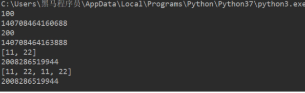
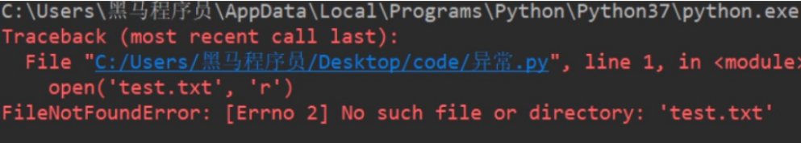
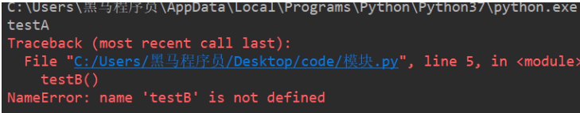

# day03_python基础

## 1. python的函数

​		python的函数可以简单理解为java的方法, 但是要比java的方法更加的灵活

### 1.1 函数基本使用

* 定义的格式:

```python
def 函数名(参数):
    代码1
    代码2
    ......
```

* 调用函数:

```python
函数名(参数)
```

>1. 不同的需求，参数可有可无。
>2. 在Python中，函数必须`先定义后使用`

----

简单体验:

* 需求: 定义一个ATM机的功能函数: 
  * 输出: 查询余额   存款  取款 几个内容

```python
# 封装ATM机功能选项 -- 定义函数
def select_func():
    print('-----请选择功能-----')
    print('查询余额')
    print('存款')
    print('取款')
    print('-----请选择功能-----')
    

调用函数:
select_func()
```


### 1.2 函数的参数

```properties
# 定义函数时同时定义了接收用户数据的参数a和b，a和b是形参
def add_num2(a, b):
    result = a + b
    print(result)


# 调用函数时传入了真实的数据10 和 20，真实数据为实参
add_num2(10, 20)
```


### 1.3 函数的返回值

​	在python中, 函数也是可以有返回值的, 我们可以使用return 进行返回

```python
def add2num(a, b):
    c = a+b
    return c

或者:
def add2num(a, b):
    return a+b
```

调用函数时, 我们可以接收其返回值

```python
#定义函数
def add2num(a, b):
    return a+b

#调用函数，顺便保存函数的返回值
result = add2num(100,98)

#因为result已经保存了add2num的返回值，所以接下来就可以使用了
print(result)
```

### 1.4 函数的嵌套使用

例如:

```python
def testB():
    print('---- testB start----')
    print('这里是testB函数执行的代码...(省略)...')
    print('---- testB end----')

def testA():
    print('---- testA start----')
    testB()
    print('---- testA end----')

testA()
```

### 1.5 函数的应用

需求:

1. 写一个函数打印一条横线
2. 打印自定义行数的横线

```python
# 打印一条横线
def print_one_line():
    print("-"*30)

# 打印多条横线
def print_num_line(num):
    i=0

    # 因为printOneLine函数已经完成了打印横线的功能，
    # 只需要多次调用此函数即可
    while i<num:
        print_one_line()
        i+=1

print_num_line(3)
```

需求:

1. 写一个函数求三个数的和
2. 写一个函数求三个数的平均值

```python
# 求3个数的和
def sum3number(a,b,c):
    return a+b+c # return 的后面可以是数值，也可是一个表达式

# 完成对3个数求平均值
def average3number(a,b,c):

    # 因为sum3Number函数已经完成了3个数的就和，所以只需调用即可
    # 即把接收到的3个数，当做实参传递即可
    sum_result = sum3number(a,b,c)
    ave_result = sum_result/3.0
    return ave_result

# 调用函数，完成对3个数求平均值
result = average3number(11,2,55)
print("average is %d"%result)
```

### 1.6 变量的作用域

变量作用域指的是变量生效的范围，主要分为两类：局部变量和全局变量

* 局部变量:
  * 所谓局部变量是定义在函数体内部的变量，即只在函数体内部生效。

```python
def testA():
    a = 100
    print(a)
    
# 调用:
testA()  # 100
# 直接打印变量a
print(a)  # 报错：name 'a' is not defined
```

> 局部变量的作用：在函数体内部，临时保存数据，即当函数调用完成后，则销毁局部变量。

* 全局变量:
  * 所谓全局变量，指的是在函数体内、外都能生效的变量。

```python
# 定义全局变量a
a = 100


def testA():
    print(a)  # 访问全局变量a，并打印变量a存储的数据


def testB():
    print(a)  # 访问全局变量a，并打印变量a存储的数据


testA()  # 100
testB()  # 100
```

思考：`testB`函数需求修改变量a的值为200，如何修改程序？

```python
a = 100


def testA():
    print(a)


def testB():
    a = 200
    print(a)


testA()  # 100
testB()  # 200
print(f'全局变量a = {a}')  # 全局变量a = 100
```

思考：在`testB`函数内部的`a = 200`中的变量a是在修改全局变量`a`吗？

答：不是。观察上述代码发现，15行得到a的数据是100，仍然是定义全局变量a时候的值，而没有返回

`testB`函数内部的200。综上：`testB`函数内部的`a = 200`是定义了一个局部变量。

思考：如何在函数体内部修改全局变量？

```python
a = 100


def testA():
    print(a)


def testB():
    # global 关键字声明a是全局变量
    global a
    a = 200
    print(a)


testA()  # 100
testB()  # 200
print(f'全局变量a = {a}')  # 全局变量a = 200
```

### 1.7 函数返回多个返回值

思考：如果一个函数如些两个return (如下所示)，程序如何执行？

```python
def return_num():
    return 1
    return 2


result = return_num()
print(result)  # 1
```

答：只执行了第一个return，原因是因为return可以退出当前函数，导致return下方的代码不执行。

思考：如果一个函数要有多个返回值，该如何书写代码？

```python
def return_num():
    return 1, 2


result = return_num()
print(result)  # (1, 2)
```

注意：

1. `return a, b`写法，返回多个数据的时候，默认是元组类型。
2. return后面可以连接列表、元组或字典，以返回多个值。

### 1.8 函数的多种参数

* 1- 位置参数
  * 位置参数：调用函数时根据函数定义的参数位置来传递参数。

```python
def user_info(name, age, gender):
    print(f'您的名字是{name}, 年龄是{age}, 性别是{gender}')


user_info('TOM', 20, '男')
```

>  注意：传递和定义参数的顺序及个数必须一致。

* 2- 关键字参数
  * 函数调用，通过“键=值”形式加以指定。可以让函数更加清晰、容易使用，同时也清除了参数的顺序需求。

```python
def user_info(name, age, gender):
    print(f'您的名字是{name}, 年龄是{age}, 性别是{gender}')


user_info('Rose', age=20, gender='女')
user_info('小明', gender='男', age=16)
```

> 注意：**<font color='red'>函数调用时，如果有位置参数时，位置参数必须在关键字参数的前面，但关键字参数之间不存在先后顺序。</font>**

* 3- 缺省参数(**<font color='red'>默认参数</font>**)
  * 缺省参数也叫默认参数，用于定义函数，为参数提供默认值，调用函数时可不传该默认参数的值（注意：**<font color='red'>所有位置参数必须出现在默认参数前</font>**，包括函数定义和调用）。

```python
def user_info(name, age, gender='男'):
    print(f'您的名字是{name}, 年龄是{age}, 性别是{gender}')


user_info('TOM', 20)
user_info('Rose', 18, '女')
```

>  注意：函数调用时，如果为缺省参数传值则修改默认参数值；否则使用这个默认值。

* 4- 不定长参数(**<font color='red'>参数就是元组 或者 字典</font>**)
  * 不定长参数也叫可变参数。用于不确定调用的时候会传递多少个参数(不传参也可以)的场景。此时，可用包裹(packing)位置参数，或者包裹关键字参数，来进行参数传递，会显得非常方便。

```python
#包裹位置传递
def user_info(*args):
    print(args)


# ('TOM',)
user_info('TOM')

# ('TOM', 18)
user_info('TOM', 18)


#包裹关键字传递
def user_info(**kwargs):
    print(kwargs)


# {'name': 'TOM', 'age': 18, 'id': 110}
user_info(name='TOM', age=18, id=110)

```

### 1.9 拆包和交换变量值

1. 拆包

- **<font color='red'>拆包：元组</font>**

```python
def return_num():
    return 100, 200


num1, num2 = return_num()
print(num1)  # 100
print(num2)  # 200
```

2. 交换变量值

   需求：有变量`a = 10`和`b = 20`，交换两个变量的值。

   * 方法一

   借助第三变量存储数据。

   ```python
   # 1. 定义中间变量
   c = 0
   
   # 2. 将a的数据存储到c
   c = a
   
   # 3. 将b的数据20赋值到a，此时a = 20
   a = b
   
   # 4. 将之前c的数据10赋值到b，此时b = 10
   b = c
   
   print(a)  # 20
   print(b)  # 10
   ```

   * 方法二

   ```python
   a, b = 1, 2
   a, b = b, a
   print(a)  # 2
   print(b)  # 1
   ```

3. 可变和不可变类型

   所谓可变类型与不可变类型是指：数据能够直接进行修改，如果能直接修改那么就是可变，否则是不可变.

   * 可变类型
     * 列表
     * 字典
     * 集合
   * 不可变类型
     * 整型
     * 浮点型
     * 字符串
     * 元组

### 1.10 引用

* 了解引用

  在python中，值是靠引用来传递来的。

  **我们可以用`id()`来判断两个变量是否为同一个值的引用。** 我们可以将id值理解为那块内存的地址标识。

```python
# 1. int类型
a = 1
b = a

print(b)  # 1

print(id(a))  # 140708464157520
print(id(b))  # 140708464157520

a = 2
print(b)  # 1,说明int类型为不可变类型 

print(id(a))  # 140708464157552，此时得到是的数据2的内存地址
print(id(b))  # 140708464157520


# 2. 列表
aa = [10, 20]
bb = aa

print(id(aa))  # 2325297783432
print(id(bb))  # 2325297783432


aa.append(30)
print(bb)  # [10, 20, 30], 列表为可变类型

print(id(aa))  # 2325297783432
print(id(bb))  # 2325297783432
```

* 引用当做实参

代码如下：

```python
def test1(a):
    print(a)
    print(id(a))

    a += a

    print(a)
    print(id(a))


# int：计算前后id值不同
b = 100
test1(b)

# 列表：计算前后id值相同
c = [11, 22]
test1(c)
```



### 1.11 匿名函数

* lambda语法

  用lambda关键词能创建小型匿名函数, 这种函数得名于省略了用def声明函数的标准步骤.

```python
lambda 参数列表 ： 表达式
```

> 注意
>
> - lambda表达式的参数可有可无，函数的参数在lambda表达式中完全适用。
> - lambda表达式能接收任何数量的参数但只能返回一个表达式的值。

* 快速入门

```python
# 函数
def fn1():
    return 200


print(fn1)
print(fn1())


# lambda表达式
fn2 = lambda: 100
print(fn2)
print(fn2())
```

> 注意：直接打印lambda表达式，输出的是此lambda的内存地址

* 2. 示例：计算a + b

  函数实现

```python
def add(a, b):
    return a + b


result = add(1, 2)
print(result)
```

> 思考：需求简单，是否代码多？

​        lambda实现

```python
fn1 = lambda a, b: a + b
print(fn1(1, 2))
```

* lambda的应用

> 在之前的参数学习时, 参数只能是一个具体的数值, 字符串. 然而很多时候我们可能需要的参数不仅仅值一个简单的数值而已, 有可能是一种算法, 一个公式, 一种功能. lambda表达式就可以作为参数来使用, 这样去传递参数不仅仅传递的是某个数值.

```python
# func函数相当于一个计算器
def func(count):
    a = 10
    b = 20
    result = count(a, b)
    print(result)

# 传递相加
func(lambda a, b: a + b)
# 传递相减
func(lambda a, b: a - b)
# 传递相乘
func(lambda a, b: a * b)
# 传递相除
func(lambda a, b: a / b)
```

## 2. 文件的基本操作

文件操作的基本步骤:

1. 打开文件
2. 对文件进行相关的操作
3. 关闭文件

> 注意：可以只打开和关闭文件，不进行任何读写操作

* 打开文件

  在python，使用open函数，可以打开一个已经存在的文件，或者创建一个新文件，语法如下：

  ```python
  open(name, mode)
  ```

  name：是要打开的目标文件名的字符串(可以包含文件所在的具体路径)。

  mode：设置打开文件的模式(访问模式)：只读、写入、追加等。

扩展说明: 打开文件的模式

| 模式 | 描述                                                         |
| :--: | :----------------------------------------------------------- |
|  r   | 以只读方式打开文件。文件的指针将会放在文件的开头。这是默认模式。 |
|  rb  | 以二进制格式打开一个文件用于只读。文件指针将会放在文件的开头。这是默认模式。 |
|  r+  | 打开一个文件用于读写。文件指针将会放在文件的开头。           |
| rb+  | 以二进制格式打开一个文件用于读写。文件指针将会放在文件的开头。 |
|  w   | 打开一个文件只用于写入。如果该文件已存在则打开文件，并从开头开始编辑，即原有内容会被删除。如果该文件不存在，创建新文件。 |
|  wb  | 以二进制格式打开一个文件只用于写入。如果该文件已存在则打开文件，并从开头开始编辑，即原有内容会被删除。如果该文件不存在，创建新文件。 |
|  w+  | 打开一个文件用于读写。如果该文件已存在则打开文件，并从开头开始编辑，即原有内容会被删除。如果该文件不存在，创建新文件。 |
| wb+  | 以二进制格式打开一个文件用于读写。如果该文件已存在则打开文件，并从开头开始编辑，即原有内容会被删除。如果该文件不存在，创建新文件。 |
|  a   | 打开一个文件用于追加。如果该文件已存在，文件指针将会放在文件的结尾。也就是说，新的内容将会被写入到已有内容之后。如果该文件不存在，创建新文件进行写入。 |
|  ab  | 以二进制格式打开一个文件用于追加。如果该文件已存在，文件指针将会放在文件的结尾。也就是说，新的内容将会被写入到已有内容之后。如果该文件不存在，创建新文件进行写入。 |
|  a+  | 打开一个文件用于读写。如果该文件已存在，文件指针将会放在文件的结尾。文件打开时会是追加模式。如果该文件不存在，创建新文件用于读写。 |
| ab+  | 以二进制格式打开一个文件用于追加。如果该文件已存在，文件指针将会放在文件的结尾。如果该文件不存在，创建新文件用于读写。 |

快速体验

```python
f = open('test.txt', 'w')
```

> 注意：此时的`f`是`open`函数的文件对象。

-----

文件的读写

* 写  write()

  * 语法

  ```python
  对象对象.write('内容')
  ```

  * 体验

  ```python
  # 1. 打开文件
  f = open('test.txt', 'w')
  
  # 2.文件写入
  f.write('hello world')
  
  # 3. 关闭文件
  f.close()
  ```

  >注意：
  >
  >1. `w`和`a`模式：如果文件不存在则创建该文件；如果文件存在，`w`模式先清空再写入，`a`模式直接末尾追加。
  >2. `r`模式：如果文件不存在则报错。

* 读read()

  ```python
  文件对象.read(num)
  ```

  > num表示要从文件中读取的数据的长度（单位是字节），如果没有传入num，那么就表示读取文件中所有的数据。

  * readlines()  **<font color='red'>读取每行数据</font>**

  > readlines可以按照行的方式把整个文件中的内容进行一次性读取，并且返回的是一个列表，其中每一行的数据为一个元素。

  ```python
  f = open('test.txt')
  content = f.readlines()
  
  # ['hello world\n', 'abcdefg\n', 'aaa\n', 'bbb\n', 'ccc']
  print(content)
  
  # 关闭文件
  f.close()
  ```

  * readline() : **<font color='red'>一次读取一行内容</font>**。

  ```python
  f = open('test.txt')
  
  content = f.readline()
  print(f'第一行：{content}')
  
  content = f.readline()
  print(f'第二行：{content}')
  
  # 关闭文件
  f.close()
  ```

* 关闭

  ```python
  文件对象.close()
  ```

## 3. 文件备份

​		需求：用户输入当前目录下任意文件名，程序完成对该文件的备份功能(备份文件名为xx[备份]后缀，例如：test[备份].txt)。

步骤

1. 接收用户输入的文件名

2. 规划备份文件名

3. 备份文件写入数据

----

代码实现

1. 接收用户输入目标文件名

```python
old_name = input('请输入您要备份的文件名：')
```

2. 规划备份文件名

   2.1 提取目标文件后缀

   2.2 组织备份的文件名，xx[备份]后缀

```python
# 2.1 提取文件后缀点的下标
index = old_name.rfind('.')

# print(index)  # 后缀中.的下标

# print(old_name[:index])  # 源文件名（无后缀）

# 2.2 组织新文件名 旧文件名 + [备份] + 后缀
new_name = old_name[:index] + '[备份]' + old_name[index:]

# 打印新文件名（带后缀）
# print(new_name)
```

3. 备份文件写入数据

   3.1 打开源文件 和 备份文件

   3.2 将源文件数据写入备份文件

   3.3 关闭文件

```python
# 3.1 打开文件
old_f = open(old_name, 'rb')
new_f = open(new_name, 'wb')

# 3.2 将源文件数据写入备份文件
while True:
    con = old_f.read(1024)
    if len(con) == 0:
        break
    new_f.write(con)

# 3.3 关闭文件
old_f.close()
new_f.close()
```

## 4. 异常

### 1. 了解异常

当检测到一个错误时，解释器就无法继续执行了，反而出现了一些错误的提示，这就是所谓的"异常"。

例如：以`r`方式打开一个不存在的文件。

```python
open('test.txt', 'r')
```



### 2. 异常的写法

* 语法

```python
try:
    可能发生错误的代码
except:
    如果出现异常执行的代码
```

* 快速体验

  需求：尝试以`r`模式打开文件，如果文件不存在，则以`w`方式打开。

```python
try:
    f = open('test.txt', 'r')
except:
    f = open('test.txt', 'w')
```

### 3. 捕获指定异常

* 语法

```python
try:
    可能发生错误的代码
except 异常类型:
    如果捕获到该异常类型执行的代码
```

* 体验

```python
try:
    print(num)
except NameError:
    print('有错误')
```

> 注意：
>
> 1. 如果尝试执行的代码的异常类型和要捕获的异常类型不一致，则无法捕获异常。
> 2. 一般try下方只放一行尝试执行的代码。

* 捕获多个指定异常

  当捕获多个异常时，可以把要捕获的异常类型的名字，放到except 后，并使用元组的方式进行书写。

```python
try:
    print(1/0)

except (NameError, ZeroDivisionError):
    print('有错误')
```

* 捕获异常描述信息

```python
try:
    print(num)
except (NameError, ZeroDivisionError) as result:
    print(result)
```

* 捕获所有异常

  Exception是所有程序异常类的父类。

```python
try:
    print(num)
except Exception as result:
    print(result)
```

### 4. 异常的else

else表示的是如果没有异常要执行的代码。

```python
try:
    print(1)
except Exception as result:
    print(result)
else:
    print('我是else，是没有异常的时候执行的代码')
```

### 5. 异常的finally

finally表示的是无论是否异常都要执行的代码，例如关闭文件。

```python
try:
    f = open('test.txt', 'r')
except Exception as result:
    f = open('test.txt', 'w')
else:
    print('没有异常，真开心')
finally:
    f.close()
```

### 6. 异常处理案例

体验异常传递

需求：

  1. 尝试只读方式打开test.txt文件，如果文件存在则读取文件内容，文件不存在则提示用户即可。

  2. 读取内容要求：尝试循环读取内容，读取过程中如果检测到用户意外终止程序，则`except`捕获异常并提示用户。

```python
import time
try:
    f = open('test.txt')
    try:
        while True:
            content = f.readline()
            if len(content) == 0:
                break
            time.sleep(2)
            print(content)
    except:
        # 如果在读取文件的过程中，产生了异常，那么就会捕获到
        # 比如 按下了 ctrl+c
        print('意外终止了读取数据')
    finally:
        f.close()
        print('关闭文件')
except:
    print("没有这个文件")
```

## 5. 模块

​		Python 模块(Module)，是一个 Python 文件，以 .py 结尾，包含了 Python 对象定义和Python语句。

模块能定义函数，类和变量，模块里也能包含可执行的代码

### 5.1 导入模块

* 导入模块的方式
  * import 模块名
  * from 模块名 import 功能名
  * from 模块名 import *
  * import 模块名 as 别名
  * from 模块名 import 功能名 as 别名

---

导入方式详解

```
import
```

- 语法

```python
# 1. 导入模块
import 模块名
import 模块名1, 模块名2...

# 2. 调用功能
模块名.功能名()
```

- 体验

```python
import math
print(math.sqrt(9))  # 3.0
from..import..
```

- 语法

```python
from 模块名 import 功能1, 功能2, 功能3...
```

- 体验

```python
from math import sqrt
print(sqrt(9))
from .. import *
```

- 语法

```python
from 模块名 import *
```

- 体验

```python
from math import *
print(sqrt(9))
as定义别名
```

- 语法

```python
# 模块定义别名
import 模块名 as 别名

# 功能定义别名
from 模块名 import 功能 as 别名
```

- 体验

```python
# 模块别名
import time as tt

tt.sleep(2)
print('hello')

# 功能别名
from time import sleep as sl
sl(2)
print('hello')
```

### 5.2 制作模块

​		在Python中，每个Python文件都可以作为一个模块，模块的名字就是文件的名字。**也就是说自定义模块名必须要符合标识符命名规则。**

* 定义模块

  新建一个Python文件，命名为`my_module1.py`，并定义`testA`函数。

```python
def testA(a, b):
    print(a + b)
```

* 测试模块

​        在实际开中，当一个开发人员编写完一个模块后，为了让模块能够在项目中达到想要的效果，这个开发人员会自行在py文件中添加一些测试信息.，例如，在`my_module1.py`文件中添加测试代码。

```python
def testA(a, b):
    print(a + b)


testA(1, 1)
```

​		此时，无论是当前文件，还是其他已经导入了该模块的文件，在运行的时候都会自动执行`testA`函数的调用。

​	解决办法如下：

```python
def testA(a, b):
    print(a + b)

# 只在当前文件中调用该函数，其他导入的文件内不符合该条件，则不执行testA函数调用
if __name__ == '__main__':
    testA(1, 1)
```

* 调用模块

```python
import my_module1
my_module1.testA(1, 1)
```

* 注意事项

  如果使用`from .. import ..`或`from .. import *`导入多个模块的时候，且模块内有同名功能。当调用这个同名功能的时候，调用到的是后面导入的模块的功能。

* 体验

```python
# 模块1代码
def my_test(a, b):
    print(a + b)

# 模块2代码
def my_test(a, b):
    print(a - b)

# 导入模块和调用功能代码
from my_module1 import my_test
from my_module2 import my_test

# my_test函数是模块2中的函数
my_test(1, 1)
```

### 5.3  `__all__` 变量

如果一个模块文件中有`__all__`变量，当使用`from xxx import *`导入时，只能导入这个列表中的元素。

- my_module1模块代码

```python
__all__ = ['testA']


def testA():
    print('testA')


def testB():
    print('testB')
```

- 导入模块的文件代码

```python
from my_module1 import *
testA()
testB()
```



### 5.4 包

​		包将有联系的模块组织在一起，即放到同一个文件夹下，并且在这个文件夹创建一个名字为`__init__.py` 文件，那么这个文件夹就称之为包。

* 制作包

  [New] — [Python Package] — 输入包名 — [OK] — 新建功能模块(有联系的模块)。

  注意：新建包后，包内部会自动创建`__init__.py`文件，这个文件控制着包的导入行为。

* 快速体验

  >1. 新建包`mypackage`
  >2. 新建包内模块：`my_module1` 和 `my_module2`
  >3. 模块内代码如下

```python
# my_module1
print(1)


def info_print1():
    print('my_module1')
    
# my_module2
print(2)


def info_print2():
    print('my_module2')
```

* 导入包

  方法一

```python
import 包名.模块名

包名.模块名.目标
```

​		操作:

```python
import my_package.my_module1

my_package.my_module1.info_print1()
```

​		方法二

​		注意：必须在`__init__.py`文件中添加`__all__ = []`，控制允许导入的模块列表。

```python
from 包名 import *
模块名.目标
```

​		操作:

```python
from my_package import *

my_module1.info_print1()
```

### 5.5 常用模块说明

#### 5.5.1 sys模块

​		sys是system的缩写，用来获取操作系统和编译器的一些配置，设置及操作。

* 1- sys.argv
  * 可以用sys.argv获取当前正在执行的命令行参数的参数列表(list)。

```python
import sys
print(sys.argv)
print(sys.argv[0])
print(sys.argv[1])
print("第二个参数:%s"%sys.argv[2])
print("参数个数：%s"%(len(sys.argv)-1))
-------------------结果：
#python /root/mcw.py arg1 arg2
['/root/mcw.py', 'arg1', 'arg2']
/root/mcw.py    #当前程序名
arg1
第二个参数:arg2
参数个数：2
```

* 2- sys.platform
  * 获取当前执行环境的平台，如win32表示是Windows系统，linux2表示是linux平台

```python
print(sys.platform)
-------------结果：
win32  

-------------结果：
[root@xiaoma /root] test!
#python mcw.py 
linux2
```

*  3- sys.exit(n)
   * 调用sys.exit(n)可以中途退出程序，当参数非0时，会引发一个SystemExit异常，从而可以在主程序中捕获该异常。

```python
#vim mcw.py 
import sys
sys.exit(3)
----------结果：
[root@xiaoma /root] test!
#python mcw.py 
[root@xiaoma /root] test!
#echo $?
3
```


#### 5.5.2 os模块

​	**os** 模块提供了非常丰富的方法用来处理文件和目录。但是在我们大数据中后续主要是基于OS来锁定远端环境

例如:

```python
import os

# 目的: 锁定远端操作环境, 避免存在多个版本环境的问题
os.environ["SPARK_HOME"] = "/export/server/spark"
os.environ["PYSPARK_PYTHON"] = "/root/anaconda3/bin/python"
os.environ["PYSPARK_DRIVER_PYTHON"] = "/root/anaconda3/bin/python"
```


#### 5.5.3 time模块

​		Python 提供了一个 time 模块可以用于格式化日期和时间。

* time.time( )
  * 返回当前时间的时间戳（1970纪元后经过的浮点秒数）。
* time.sleep(secs)
  * 推迟调用线程的运行，secs指秒数。


其他的可参考: https://www.runoob.com/python/python-date-time.html


## 6- 装饰器

就是**给已有函数增加额外功能的函数**。

**装饰器的功能特点:**

1. 不修改已有函数的源代码
2. 不修改已有函数的调用方式
3. 给已有函数增加额外的功能

主要用于: 对原有函数进行增强


### 6.1. 装饰器的示例代码

```python
# 添加一个登录验证的功能
def check(fn):
    def inner():
        print("请先登录....")
        fn()
    return inner


def comment():
    print("发表评论")

# 使用装饰器来装饰函数
comment = check(comment)
comment()

# 装饰器的基本雏形
# def decorator(fn): # fn:目标函数.
#     def inner():
#         '''执行函数之前'''
#         fn() # 执行被装饰的函数
#         '''执行函数之后'''
#     return inner
```

**代码说明:**

- 有且只有一个参数，必须是函数类型，这样定义的函数才是装饰器。
- 写代码要遵循开放封闭原则，它规定已经实现的功能代码不允许被修改，但可以被扩展。

**执行结果:**

```py
请先登录....
发表评论
```

### 6.2. 装饰器的语法糖写法

​		如果有多个函数都需要添加登录验证的功能，每次都需要编写func = check(func)这样代码对已有函数进行装饰，这种做法还是比较麻烦。

​		Python给提供了一个装饰函数更加简单的写法，那就是语法糖，语法糖的书写格式是: @装饰器名字，通过语法糖的方式也可以完成对已有函数的装饰

```py
# 添加一个登录验证的功能
def check(fn):
    print("装饰器函数执行了")
    def inner():
        print("请先登录....")
        fn()
    return inner

# 使用语法糖方式来装饰函数
@check
def comment():
    print("发表评论")


comment()
```

**说明:**

- @check 等价于 comment = check(comment)
- 装饰器的执行时间是加载模块时立即执行。

**执行结果:**

```py
请先登录....
发表评论
```

### 6.3. 带有参数的装饰器介绍

带有参数的装饰器就是使用装饰器装饰函数的时候可以传入指定参数，**语法格式: @装饰器(参数,...)**

**错误写法:**

```python
def decorator(fn, flag):
    def inner(num1, num2):
        if flag == "+":
            print("--正在努力加法计算--")
        elif flag == "-":
            print("--正在努力减法计算--")
        result = fn(num1, num2)
        return result
    return inner


@decorator('+')
def add(a, b):
    result = a + b
    return result

result = add(1, 3)
print(result)
```

**执行结果:**

```python
Traceback (most recent call last):
  File "/home/python/Desktop/test/hho.py", line 12, in <module>
    @decorator('+')
TypeError: decorator() missing 1 required positional argument: 'flag'
```

**代码说明:**

- 装饰器只能接收一个参数，并且还是函数类型。

**正确写法:**

在装饰器外面再包裹上一个函数，让最外面的函数接收参数，返回的是装饰器，因为@符号后面必须是装饰器实例。

```python
# 添加输出日志的功能
def logging(flag):

    def decorator(fn):
        def inner(num1, num2):
            if flag == "+":
                print("--正在努力加法计算--")
            elif flag == "-":
                print("--正在努力减法计算--")
            result = fn(num1, num2)
            return result
        return inner

    # 返回装饰器
    return decorator


# 使用装饰器装饰函数
@logging("+")
def add(a, b):
    result = a + b
    return result


@logging("-")
def sub(a, b):
    result = a - b
    return result

result = add(1, 2)
print(result)

result = sub(1, 2)
print(result)
```


## 6. 扩展说明: python的编码规范:PEP8

​		PEP8 提供了 Python 代码的编写约定. 本节知识点旨在提高代码的可读性, 并使其在各种 Python 代码中编写风格保持一致.

1. 缩进使用4个空格, 空格是首选的缩进方式. Python3 不允许混合使用制表符和空格来缩进.

2. 每一行最大长度限制在79个字符以内.

3. 顶层函数、类的定义, 前后使用两个空行隔开.

4. import 导入

   4.1 导入建议在不同的行, 例如:

   ```
   import os
   import sys
   # 不建议如下导包
   import os, sys
   # 但是可以如下:
   from subprocess import Popen, PIPE
   ```

   4.2 导包位于文件顶部, 在模块注释、文档字符串之后, 全局变量、常量之前. 导入按照以下顺序分组:

   ​		4.2.1 标准库导入

   ​		4.2.2 相关第三方导入

   ​		4.2.3 本地应用/库导入

   ​		4.2.4 在每一组导入之间加入空行

5. Python 中定义字符串使用双引号、单引号是相同的, 尽量保持使用同一方式定义字符串. 当一个字符串包含单引号或者双引号时, 在最外层使用不同的符号来避免使用反斜杠转义, 从而提高可读性.

6. 表达式和语句中的空格:

   6.1 避免在小括号、方括号、花括号前跟空格.

   6.2 避免在逗号、分好、冒号之前添加空格.

   6.3 冒号在切片中就像二元运算符, 两边要有相同数量的空格. 如果某个切片参数省略, 空格也省略.

   6.4 避免为了和另外一个赋值语句对齐, 在赋值运算符附加多个空格.

   6.5 避免在表达式尾部添加空格, 因为尾部空格通常看不见, 会产生混乱.

   6.6 总是在二元运算符两边加一个空格, 赋值（=），增量赋值（+=，-=），比较（==,<,>,!=,<>,<=,>=,in,not in,is,is not），布尔（and, or, not)

7. 避免将小的代码块和 if/for/while 放在同一行, 要避免代码行太长.

   ```python
   if foo == 'blah': do_blah_thing()
   for x in lst: total += x
   while t < 10: t = delay()
   ```

8. 永远不要使用字母 'l'(小写的L), 'O'(大写的O), 或者 'I'(大写的I) 作为单字符变量名. 在有些字体里, 这些字符无法和数字0和1区分, 如果想用 'l', 用 'L' 代替.

9. 类名一般使用首字母大写的约定.

10. 函数名应该小写, 如果想提高可读性可以用下划线分隔.

11. 如果函数的参数名和已有的关键词冲突, 在最后加单一下划线比缩写或随意拼写更好. 因此 class_ 比 clss 更好.(也许最好用同义词来避免这种冲突).

12. 方法名和实例变量使用下划线分割的小写单词, 以提高可读性.

