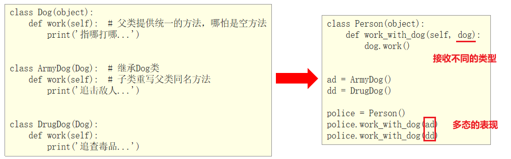

# day04_python基础

## 1. 面向对象基本概念

​		Python是同时支持面向对象和面向过程的编程语言！

* 面向过程:

```properties
传统的面向过程的编程思想总结起来就八个字——自顶向下，逐步细化！
→ 将要实现的功能描述为一个从开始到结束按部就班的连续的“步骤”
→ 依次逐步完成这些步骤，如果某一个步骤的难度较大，又可以将该步骤再次细化为若干个子步骤，以此类推，一直到结尾并得到我们想要的结果

程序的主体是函数，一个函数就是一个封装起来的模块，可以实现特定的功能，程序的各个子步骤也往往就是通过相关的函数来完成的！从而实现代码的重用与模块化编程

举个栗子：大家以来传智教育报名学习这件事情，可以分成哪些步骤？开始 → 学员提出报名，提供相关材料  →  学生缴纳学费，获得缴费凭证  →  教师凭借学生缴费凭证进行分配班级 →  班级增加学生信息  → 结束,所谓的面向过程，就是将上面分析好了的步骤，依次执行就行了！
```

* 面向对象:

```properties
所谓的面向对象，就是在编程的时候尽可能的去模拟现实世界！
在现实世界中，任何一个操作或者业务逻辑的实现都需要一个实体来完成！实体就是动作的支配者，没有实体，也就没有动作发生！

思考：上面的整个报名过程，都有哪些动词？
提出、提供、缴纳、获得、分配、增加

有动词就一定有实现这个动作的实体！
所谓的模拟现实世界，就是使计算机的编程语言在解决相关业务逻辑的时候，与真实的业务逻辑的发生保持一致，需要使任何一个动作的发生都存在一个支配给该动作的一个实体（主体），因为在现实世界中，任何一个功能的实现都可以看做是一个一个的实体在发挥其各自的“功能”（能力）并在内部进行协调有序的调用过程！
```

面向对象的三大特性：封装、继承、多态

* ① 封装
  将属性和方法书写到类的里面的操作即为封装，封装可以为属性和方法添加私有权限。
* ② 继承
  子类默认继承父类的所有属性和方法，与此同时子类也可以重写父类属性和方法。
* ③ 多态
  多态是同一类事物具有的多种形态。不同的对象调用同一个接口（方法），表现出不同的状态，称为多态。


## 2. 类

### 2.1 类的基本定义

​		在python中也是构建类的, python3中支持经典类和新式类

* 经典类: 不由任意内置类型派生出的类, 称之为经典类

```python
class 类名:
    代码
    ......
```

* 新式类:

```python
class 类名():
    代码
    ......
```

​		这就是一个类，只不过里面什么都没有！其中，类名不区分大小写，遵守一般的标识符的命名规则（以字母、数字和下划线构成，并且不能以数字开头），一般为了和方法名相区分，类名的首字母一般大写！（大驼峰法）


案例: 定义一个  '人'  类

```python
class Person():
    def eat(self):
        print('我喜欢吃零食')
    def drink(self):
        print('我喜欢喝果汁')
```

实例化类:

```python
格式:
	对象名 = 类名()
```

案例:  实例化Person类, 生成p1对象

```python
# 创建对象
p1 = Person()

# <__main__.Person object at 0x1013ecf50>
print(p1)

# p1对象调用实例方法
p1.eat()
p1.drink()

```

self 关键词: 在类中，有一个特殊关键字self，其指向类实例化对象本身。

```python
# 1. 定义类
class Person():
    def eat(self):
        print('我喜欢吃零食')
        # <__main__.Person object at 0x1058bced0>
        print(self)


# 2. 创建对象
p1 = Person()
# <__main__.Person object at 0x1058bced0>
print(p1)
p1.eat()

p2 = Person()
# <__main__.Person object at 0x1058bcf50>
print(p2)

注意：打印对象和self得到的结果是一致的，都是当前对象的内存中存储地址。
```

### 2.2 类的添加和获取对象属性

​		属性即是特征，比如：人的姓名、年龄、身高、体重…都是对象的属性。
​		对象属性既可以在类外面添加和获取，也能在类里面添加和获取。

* 类外部添加对象属性:

```python
格式:
	对象名.属性名 = 值


操作: 在类里面获取属性  self.属性名
# 1. 定义类
class Person():
    def print_info(self):
        # 类里面获取实例属性
        print(f'姓名：{self.name}')
        print(f'年龄：{self.age}')
        print(f'地址：{self.address}')


# 2. 创建对象
p1 = Person()
# 3. 添加属性
p1.name = '老王'
p1.age = 18
p1.address = '北京'

p1.print_info()

```

### 2.3 魔术方法

​	在Python中，\__xxx__()的函数叫做魔法方法，指的是具有特殊功能的函数。

* \__init__() 方法

  ​		其作用：实例化对象时，连带其中的参数，会一并传给__init__函数自动并执行它。__init__()函数的参数列表会在开头多出一项，它永远指代新建的那个实例对象，Python语法要求这个参数必须要有，名称为self。

```python
class Person():
    
    # 定义初始化功能的函数
    def __init__(self, name, age, address):
        # 添加实例属性
        self.name = name
        self.age = age
        self.address = address
	
    def print_info(self):
        # 类里面调用实例属性
        print(f'姓名：{self.name}, 年龄：{self.age}，地址：{self.address}')
        
p1 = Person('老王', 18, '北京')
p1.print_info()

p2 = Person('老李', 20, '深圳')
p2.print_info()


注意事项:
① __init__()方法，在创建一个对象时默认被调用，不需要手动调用
② __init__(self)中的self参数，不需要开发者传递，python解释器会自动把当前的对象
引用传递过去。
```

* \__str__() 方法

  ​		当使用print输出对象的时候，默认打印对象的内存地址。如果类定义了`__str__`方法，那么就会打印从在这个方法中 return 的数据。

```python
class Person():
    
    # 定义初始化功能的函数
    def __init__(self, name, age, address):
        # 添加实例属性
        self.name = name
        self.age = age
        self.address = address
	
    def __str__(self):
        """ 返回一个对象的描述信息 """
        return f'姓名：{self.name}，年龄：{self.age}，地址：{self.address}'
    	
        
p1 = Person('老王', 18, '北京')
print(p1)

```

* \__del__()方法

  当删除对象时，python解释器也会默认调用__del__()方法。

```python
class Person():
    
    # 定义初始化功能的函数
    def __init__(self, name, age, address):
        # 添加实例属性
        self.name = name
        self.age = age
        self.address = address
    
    def __del__(self):
        print(f'{self}对象已经被删除')
        
p1 = Person('老王', 18, '北京')

# <__main__.Person object at 0x101af8f90>对象已经被删除
del p1

```

### 2.4 私有属性和私有方法

​		在Python中，可以为实例属性和方法设置私有权限，即设置某个实例属性或实例方法不继承给子类。
​		设置私有属性和私有方法的方式非常简单：在属性名和方法名 前面 加上两个下划线 "__" 即可。

* 案例1：私有属性和私有方法设置方式

```python
class Girl():
    def __init__(self):
        self.name = '小美'
        self.__age = 18

    def __showinfo(self):
        print('姓名：%s，年龄：%d' % (self.name, self.__age))

girl = Girl()
print(girl.name)
# 外界不能直接访问私有属性和私有方法
print(girl.__age)
girl.__showinfo()

```

* 外部获取与设置私有属性值:

  在Python中，一般定义函数名' get_xx '用来获取私有属性，定义' set_xx '用来修改私有属性值。

```python
class Girl():
    def __init__(self):
        self.name = '小美'
        self.__age = 18
        
    def get_age(self):
        return self.__age
    
    def set_age(self, age):
        self.__age = age


girl = Girl()
girl.set_age(19)
print(girl.get_age())
```

### 2.5 类的单继承

基本语法:

```python
# 父类B
class B(object):
	pass

# 子类A
class A(B):
    pass
```

>  在Python中，所有类默认继承object类，object类是顶级类或基类；其他子类叫做派生类。

概念说明:

```properties
继承：一个类从另一个已有的类获得其成员的相关特性，就叫作继承！
派生：从一个已有的类产生一个新的类，称为派生！
很显然，继承和派生其实就是从不同的方向来描述的相同的概念而已，本质上是一样的！

父类：也叫作基类，就是指已有被继承的类！
子类：也叫作派生类或扩展类

扩展：在子类中增加一些自己特有的特性，就叫作扩展，没有扩展，继承也就没有意义了！
单继承：一个类只能继承自一个其他的类，不能继承多个类，单继承也是大多数面向对象语言的特性！
多继承：一个类同时继承了多个父类， （C++、Python等语言都支持多继承）
```

案例:

```python
class Animal(object):
    def eat(self):
        print('吃...')

    def sleep(self):
        print('睡...')

    def call(self):
        print('叫...')


class Dog(Animal):
    pass


class Cat(Animal):
    pass

…

```

重写父类属性和方法

```python
# 演示 python类的继承操作
# 1- 单继承:
class Animal(object):
    def __init__(self,name,age):
        self.name = name
        self.age = age

    def sleep(self):
        print("动物都是要睡觉的")

    def eat(self):
        print("动物都是要吃饭的")

class Dog(Animal):
    def __init__(self,name,age,address):
        super().__init__(name,age)
        self.address = address


    def eat(self):
        # 希望在调用当前方法的时候, 先调用父类的方法
        super().eat()

        print("狗爱吃骨头")

class Cat(Animal):
    def eat(self):
        print("猫爱吃鱼")


# 构建子类对象
d1 = Dog('小爱',3,'昌平区')
d1.eat()
d1.sleep()
print(d1.address)

c1 = Cat('小猫',5)
c1.eat()


```

发现, 调用的, 默认调用的是当前重写后的函数, 如果想调用之前的, 需要使用super()来处理

````python
class Animal():
    def __init__(self, name, age):
        self.name = name
        self.age = age


    def eat(self):
        print('吃...')


    def sleep(self):
        print('睡...')


    def call(self):
        print('叫...')


…


class Dog(Animal):
    def __init__(self, name, age, sex):
        super().__init__(name, age)
        self.sex = sex


    def __str__(self):
        return f'{self.name}，今年{self.age}岁了，我会汪汪叫...'


class Cat(Animal):
    def __init__(self, name, age, sex):
        super().__init__(name, age)
        self.sex = sex

    def __str__(self):
        return f'{self.name}，今年{self.age}岁了，我会喵喵叫...'

…

````

### 2.6 类的多继承

​		多继承：一个类同时继承了多个父类，并且同时具有所有父类的属性和方法例如：孩子会继承父亲 和 母亲的方法。

```python
class Father(object):
    pass


class Mother(object):
    pass


class Child(Father, Mother):
    pass

```


### 2.7 多态体现

​		类具有继承关系，并且子类类型可以向上转型看做父类类型，如果我们从 Animal 派生出 Cat和 Dog，并都写了一个 call() 方法，如下示例：

```python
class Animal(object):  
   def __init__(self, name, age):
       self.name = name
       self.age = age
   def call(self):
       print(self.name, '会叫')

class Cat(Animal):
   def __init__(self, name, age, sex):
       super(Cat, self).__init__(name, age)
       self.sex = sex

   def call(self):
       print(self.name, '会“喵喵”叫')

class Dog(Animal):
   def __init__(self, name, age, sex):
       super(Dog, self).__init__(name, age)
       self.sex = sex
   def call(self):
       print(self.name, '会“汪汪”叫')


接下来, 定义一个do函数, 接收一个变量 'all', 如下:
def do(all):
   all.call()

A = Animal('小黑',4)
C = Cat('喵喵', 2, '男')
D = Dog('旺财', 5, '女')

for x in (A,C,D):
   do(x)

```

​		这种行为称为多态。也就是说，方法调用将作用在 all 的实际类型上。C 是 Cat 类型，它实际上拥有自己的 call() 方法以及从 Animal 继承的 call 方法，但调用 C .call() 总是先查找它自身的定义，如果没有定义，则顺着继承链向上查找，直到在某个父类中找到为止。传递给函数 do(all) 的参数 all 不一定是 Animal 或 Animal 的子类型。任何数据类型的实例都可以，只要它有一个 call() 的方法即可。其他类不继承于 Animal，具备 call 方法也可以使用 do 函数。这就是动态语言，动态语言调用实例方法，不检查类型，只要方法存在，参数正确，就可以调用。


例子:



### 2.8 静态方法

​		静态方法需要用修饰器 "@staticmethod" 来标识，告诉解释器这是一个静态方法。
​		通过类名.调用 静态方法

```python
class Game:
 
  @staticmethod
  def menu():
    print('------')
    print('开始[1]')
    print('暂停[2]')
    print('退出[3]')
 
 
Game.menu()

```

