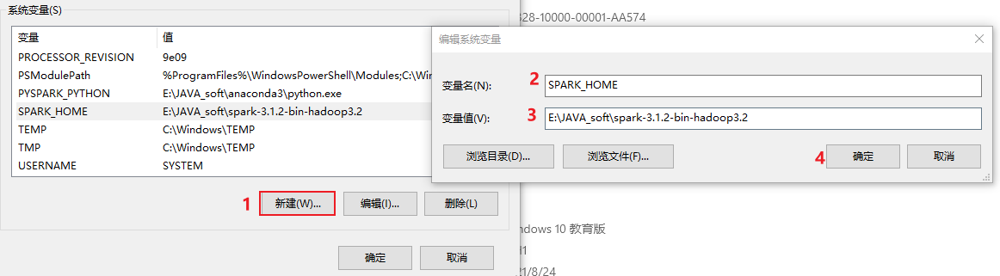

# day01_SparkBase


## 1.  spark的基本介绍

### 1.1 spark的基本介绍

* MapReduce:  分布式计算引擎

```
	MR 分布式计算引擎, 可以用来处理大规模数据, 主要是用于批处理, 用于离线处理

MR存在弊端: 
	1- 执行效率比较低
	2- API相对比较低级, 开发效率慢
	3- 执行迭代计算不方便
```

也正因为MR存在这样的一些弊端 在一些场景中, 希望能够有一款执行效率更加高效, 能够更好支持迭代计算, 同时还能够处理大规模数据的一款新的软件, 而spark就是在这样的背景下产生了


Apache spark 是一款用于处理大规模数据的分布式计算引擎, 基于内存计算, 整个spark的核心数据结构: RDD

RDD: 弹性的分布式数据集

Spark 最早期是来源于 加州大学伯克莱分析一帮博士发布的论文,而产生的, 后期贡献给了apache 称为apache的顶级项目:  http://spark.apache.org

Spark采用Scala语言编写的


为什么Spark的执行速度快:

```properties
原因一: spark 提供了一个全新的数据结构: RDD
	通过这个数据结构, 让分布式执行引擎能够在内存中进行计算, 同时能够更好的进行迭代计算操作
	对于MR来说, 主要是基于磁盘来计算, 而且迭代计算的时候, 需要将多个MR程序串联, 执行效率低

原因二: Spark是基于线程运行的, MR是基于进程运行的
	线程的启动和销毁的速度, 要远远高于进程的启动和销毁
```


### 1.2 spark的发展史


关注:

```properties
	spark是一个分布式计算引擎, pyspark是一个python的库  专门用于操作spark的库
```


### 1.3 spark的特点

* 1- 运行速度快

```properties
方面一: 基于内存计算的 采用DAG 有向无环图 进行计算操作 中间的结果是保存在内存中

方面二: spark是基于线程来运行的, 线程的启动和销毁要高于进程
```

* 2- 易用性

```properties
方面一: spark提供多种语言的客户端, 可以基于多种语言来运行spark: 比如 python SQL scala java R ...

方面二: spark提供了更加高阶的API, 而且这些API在不同的语言上, 基本上都是一样的, 大大的降低了程序员学习成本
```

* 3- 通用型强

```properties
spark提供了多种工具库, 用于满足各种计算的场景

spark core: spark的核心库,  次重点, 它是学习的基础
	主要是用于放置spark的核心API, 内存管理API,包括维护RDD的数据结构

spark SQL: 通过SQL操作spark计算框架  最为重要的

spark streaming:  spark的流式处理, 主要是用于支持流式计算(实时计算) (目前不使用, 整个实时主要是基于flink来完成的) 

spark MLlib: spark的机器学习库, 主要包括相关算法:  回归  聚类 .... (针对于特点人群)

spark graphX: spark的图计算库 比如导航行程规划 (针对于特点人群)
```


* 4- 随处运行:

```properties
方面一: 编写的spark程序可以运行在不同的资源调度平台:  local yarn平台  spark集群 , 云上的调度平台

方面二: spark程序可以和大数据生态圈中各种软件进行集成, 让我们更加方便使用spark对接各个软件
```


## 2. spark环境安装

### 2.1 local模式搭建

local 模式主要是用于本地代码测试操作

本质上就是一个单进程程序, 在一个进程中运行多个线程

类似于pandas , 都是一个单进程程序, 无法处理大规模数据, 只需要处理小规模数据


安装操作, 可以直接参考课件中 部署文档 

注意事项:

* 上传安装包:

```properties
	要求: 只要能够上传到 linux的 /export/software 下 那么就是OK的, 用什么方式无所谓

如果想使用rz上传:
	请先安装: 
		yum -y install lrzsz
```

* 注意: 如果使用 浏览器访问 node1:4040 无法访问的时候, 尝试去看一下windows本地hosts文件是否有以下配置:

  hosts文件所在位置:  C:\Windows\System32\drivers\etc

```properties
192.168.88.161 node1 node1.itcast.cn
192.168.88.162 node2 node2.itcast.cn
192.168.88.163 node3 node3.itcast.cn
```

退出客户端, 禁止使用 ctrl + z  (本质挂载后台) 

```properties
尝试使用以下方式退出: 
	ctrl + c
	ctrl + d
	:quit
	quit
	:exit
	exit
```

### 2.2 PySpark库安装

安装pyspark ,其实就是在python上安装pyspark的库, 要求首先必须先有python环境


```
发现在虚拟机上, python环境为 2.7.5 , 但是实际是3.8的版本, 需要先安装 python3环境
```


安装 python环境和pyspark环境, 可以直接参考部署文档即可


扩展: anaconda的常用命令

```properties
安装库: 
	conda install  包名    
	pip  install 包名  

卸载库: 
	conda uninstall  包名 
	pip  uninstall 包名


设置anaconda下载的库的镜像地址:
conda config --add channels https://mirrors.tuna.tsinghua.edu.cn/anaconda/pkgs/free/
conda config --set show_channel_urls yes


如何使用anaconda构建虚拟环境: 
-- 查看当前有那些虚拟环境(沙箱环境)
conda env list
-- 创建一个新的虚拟环境:
conda create 虚拟环境名称 python=python版本号 #创建python3.8.8环境

-- 激活当前环境
source activate 虚拟环境名称
或者
conda activate 虚拟环境名称

-- 退出当前环境
deactivate 虚拟环境名称 #退出环境
或者
conda deactivate

-- 删除环境
canda remove -n env名称 
```


如何将spark程序, 提交给spark local模式进行执行运行呢?

```properties
使用命令:
	spark-submit
	
简单使用
	cd /export/server/spark/bin
	./spark-submit --master local[*] 指定python的spark程序文件 [args参数]
	
案例演示:
	./spark-submit --master local[2] /export/server/spark/examples/src/main/python/pi.py 10
```

### 2.3 spark集群模式架构


## 3. 基于pycharm完成pySpark入门案例

### 3.1 pycharm连接远端环境

背景说明:

```properties
	一般在企业中, 会存在两套线上环境, 一套环境是用于开发(测试)环境, 一套环境是用于生产环境, 首先一般都是先在开发测试环境上进行编写代码, 并且在此环境上进行测试, 当整个项目全部开发完成后, 需要将其上传到生产环境, 面向用于使用
	
	如果说还是按照之前的本地模式开发方案, 每个人的环境有可能都不一致, 导致整个团队无法统一一套开发环境进行使用, 从而导致后续在进行测试 上线的时候, 出现各种各样环境问题
	
	pycharm提供了一些解决方案: 远程连接方案, 允许所有的程序员都去连接远端的测试环境的, 确保大家的环境都是统一, 避免各种环境问题发生, 而且由于连接的远程环境, 所有在pycharm编写代码, 会自动上传到远端环境中, 在执行代码的时候, 相当于是直接在远端环境上进行执行操作
```

操作实现: 本次这里配置远端环境, 指的连接虚拟机中虚拟环境, 可以配置为 base环境, 也可以配置为 pyspark_env虚拟环境, 但是建议配置为 base环境, 因为base环境自带python包更全面一些


创建项目后, 设置自动上传操作


校验是否有pyspark


ok 后, 就可以在项目上创建子项目进行干活了: 最终项目效果图


最后, 就可以在 main中编写今日代码了, 比如WordCount代码即可


-----

扩展: 关于pycharm 专业版 高级功能

* 1- 直接连接远端虚拟机, 进行文件上传, 下载 查看等等操作


* 2- 可以模拟shell控制台:


* 3- 模拟datagrip操作:


### 3.2  WordCount代码实现_local

#### 3.2.1 WordCount案例流程分析


高清图 查看 今日下发图片目录: 

#### 3.2.2  编写代码实现

代码实现:

```python
from pyspark import SparkContext,SparkConf
import os
# pyspark的入门案例:

os.environ['SPARK_HOME'] = '/export/server/spark'
os.environ["PYSPARK_PYTHON"]="/root/anaconda3/bin/python"
os.environ["PYSPARK_DRIVER_PYTHON"]="/root/anaconda3/bin/python"

# 程序的入口:
# 快捷键  main + 回车
if __name__ == '__main__':
    # 1) 创建SparkContext对象
    conf = SparkConf().setAppName('WordCount').setMaster('local[*]')
    sc = SparkContext(conf=conf)

    # 2) 读取数据
    # 路径格式:  协议://路径地址
    # 本地文件协议: file:///
    # HDFS协议:  hdfs://node1:8020/
    # 注意: 由于使用远端环境的操作, 此处所说的本地指的远端环境的本地目录(linux的目录)
    # 这里在获取数据的时候, 是一行一行的获取操作
    rdd_init = sc.textFile('file:///export/data/workspace/ky03_pyspark_parent/_01_pyspark_base/data/words.txt')
    # 读取到的内容:
    # ['hadoop hadoop hive hive hive', 'sqoop hadoop hive oozie sqoop', 'hive hive sqoop zookeeper hadoop','zookeeper hue oozie']

    # 3) 对数据执行切割操作
    # 希望得到结果:
    # [hadoop, hadoop, hive, hive, hive, sqoop, hadoop, hive, oozie, sqoop, hive, hive, sqoop, zookeeper, hadoop,zookeeper, hue, oozie]
    # 特点: 一对多
    rdd_flapMap = rdd_init.flatMap(lambda line: line.split(' '))

    # flatMap: 扁平化操作
    #  本质上是两个步操作:  一步执行map 一个执行 flap
    # map算子: 负责一对一转换操作
    # 例如:
    #       ['hadoop hadoop hive','zookeeper hue oozie'] 原来是两个元素
    # 经过map转换后:
    #       [
    #           [hadoop ,hadoop,hive],[zookeeper,hue,oozie]
    #       ]  转换后, 还是两个元素
    #

    # 接着在经过flat操作, 对数据进行扁平化 : 目前 大的列表套了一个个小的列表, 非常的胖,, flat操作, 进行扁平化处理, 将其压扁操作
    #         [
    #             hadoop ,hadoop,hive,zookeeper,hue,oozie
    #         ]


    # 4) 将每一个单词, 转换为 (单词,1)形式:  一对一转换操作
    #希望结果:
    #         [
    #             (hadoop,1) ,(hadoop,1),(hive,1),(zookeeper,1),(hue,1),(oozie,1)
    #         ]
    rdd_map = rdd_flapMap.map(lambda word: (word,1))

    # 5) 分组聚合统计操作
    # reduceByKey : 根据key进行分组, 然后对每组内的value进行聚合统计
    #  其中 函数中  agg 表示局部聚合的结果 , curr 表示每组内的每一个value的值
    #         [
    #             (hadoop,1) ,(hadoop,1),(hive,1),(hive,1),(hadoop,1),(hive,1)
    #         ]
    #  根据key返分组:
    #     [
    #       [(hadoop,1) ,(hadoop,1),(hadoop,1)] ,
    #       [(hive,1),(hive,1),(hive,1)]
    #     ]
    # 一个组一个组进行处理:对每个组内数据, 进行遍历处理
    #   第一个组:   [(hadoop,1) ,(hadoop,1),(hadoop,1)]
    #        分组后:  [1,1,1]  函数中所处理的数据, 都是value的数据, 而key仅仅是用于分组
    #        执行lambda表达式:   agg初始值为 组内的第一个值  也就是为 1  curr 为第二个数据
    #              agg+curr =  1 + 1 结果为 2  将2 赋值给 agg即可
    #             接下来,  curr切换为第三个数据, 然后再和之前的agg进行聚合:  2 + 1 = 3 将3赋值给agg
    #             整个组全部完成, 将agg的结果返回即可. 此时agg的结果就是整个组的最终结果了
    rdd_res = rdd_map.reduceByKey(lambda agg,curr : agg+curr)

    # 6) 输出打印结果
    arr = rdd_res.collect()

    for i in arr:
        print(i[0])
        print(i[1])
        print("-----")


    # 7) 关闭 sc对象
    sc.stop()


```


可能存在异常:


```properties
异常:  JAVA_HOME is not set

出现位置: 当pycharm采用SSH连接远程Python环境时, 启动执行spark程序可能报出

原因:  加载不到jdk的位置

解决方案:
         第一步:  可以在linux的 /root/.bashrc 文件中, 添加以下两行内容  (注意需要三台都添加)
              export JAVA_HOME=/export/server/jdk1.8.0_241
              export PYSPARK_PYTHON=/root/anaconda3/bin/python
        
        第二步: 在代码中, 指定linux中spark所在目录, spark中配置文件, 即可自动加载到: 锁定远端操作环境, 避免存在多个版本环境的问题
               os.environ['SPARK_HOME'] = '/export/server/spark'
               os.environ["PYSPARK_PYTHON"]="/root/anaconda3/bin/python"
               os.environ["PYSPARK_DRIVER_PYTHON"]="/root/anaconda3/bin/python"
```


### 3.3 (扩展)部署windows开发环境(不需要做)

* 1- 第一步: 需要安装Python 环境 , 建议使用anaconda 来安装即可 

* 2- 第二步: 在Python安装pySpark

```properties
执行:
	pip install pyspark==3.1.2
```


* 3- 第三步: 配置 hadoop的环境


```properties
首先, 需要将 hadoop-3.3.0 放置到一个没有中文, 没有空格的目录下

接着将目录中bin目录下有一个 hadoop.dll文件, 放置在c:/windows/system32 目录下  (配置后, 需要重启电脑)

最后, 将这个hadoop3.3.0 配置到环境变量中: 
```


配置后, 一定一直点确定退出, 否则就白配置了....

* 4-第四步: 配置spark本地环境


```properties
首先, 需要将 spark-3.1.2... 放置到一个没有中文, 没有空格的目录下

最后, 将这个 spark-3.1.2... 配置到环境变量中:
```




配置后, 一定一直点确定退出, 否则就白配置了....

* 5-配置pySpark环境

```properties
需要修改环境变量
```


配置后, 一定一直点确定退出, 否则就白配置了....


* 6- 配置 jdk的环境:


```
首先: 需要将 jdk1.8 放置在一个没有中文, 没有空格的目录下

接着:要在环境变量中配置 JAVA_HOME, 并在path设置
```


​	

