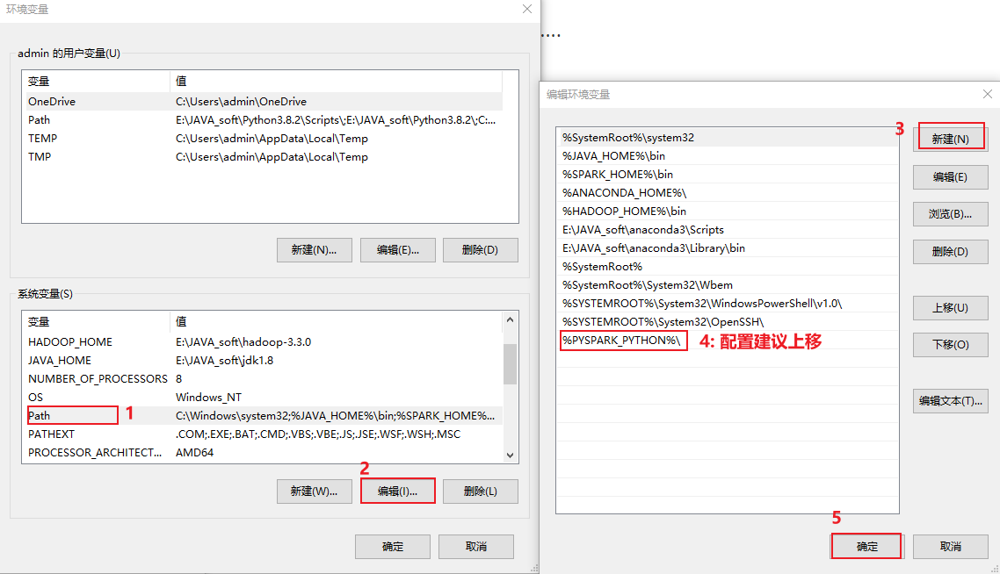

# day02-pySpark课程笔记


## 1. 基于pycharm完成pySpark入门案例

### 1.1 pycharm连接远端环境

背景说明:

```properties
	一般在企业中, 会存在两套线上环境, 一套环境是用于开发(测试)环境, 一套环境是用于生产环境, 首先一般都是先在开发测试环境上进行编写代码, 并且在此环境上进行测试, 当整个项目全部开发完成后, 需要将其上传到生产环境, 面向用于使用
	
	如果说还是按照之前的本地模式开发方案, 每个人的环境有可能都不一致, 导致整个团队无法统一一套开发环境进行使用, 从而导致后续在进行测试 上线的时候, 出现各种各样环境问题
	
	pycharm提供了一些解决方案: 远程连接方案, 允许所有的程序员都去连接远端的测试环境的, 确保大家的环境都是统一, 避免各种环境问题发生, 而且由于连接的远程环境, 所有在pycharm编写代码, 会自动上传到远端环境中, 在执行代码的时候, 相当于是直接在远端环境上进行执行操作
```

操作实现: 本次这里配置远端环境, 指的连接虚拟机中虚拟环境, 可以配置为 base环境, 也可以配置为 pyspark_env虚拟环境, 但是建议配置为 base环境, 因为base环境自带python包更全面一些


创建项目后, 设置自动上传操作


校验是否有pyspark


ok 后, 就可以在项目上创建子项目进行干活了: 最终项目效果图


最后, 就可以在 main中编写今日代码了, 比如WordCount代码即可


-----

扩展: 关于pycharm 专业版 高级功能

* 1- 直接连接远端虚拟机, 进行文件上传, 下载 查看等等操作


* 2- 可以模拟shell控制台:


* 3- 模拟datagrip操作:


### 1.2  WordCount代码实现_local

#### 1.2.1 WordCount案例流程分析


#### 1.2.2  编写代码实现

代码实现:

```python
from pyspark import SparkContext,SparkConf
import os
# pyspark的入门案例:

os.environ['SPARK_HOME'] = '/export/server/spark'
os.environ["PYSPARK_PYTHON"]="/root/anaconda3/bin/python"
os.environ["PYSPARK_DRIVER_PYTHON"]="/root/anaconda3/bin/python"

# 程序的入口:
# 快捷键  main + 回车
if __name__ == '__main__':
    # 1) 创建SparkContext对象
    conf = SparkConf().setAppName('WordCount').setMaster('local[*]')
    sc = SparkContext(conf=conf)

    # 2) 读取数据
    # 路径格式:  协议://路径地址
    # 本地文件协议: file:///
    # HDFS协议:  hdfs://node1:8020/
    # 注意: 由于使用远端环境的操作, 此处所说的本地指的远端环境的本地目录(linux的目录)
    # 这里在获取数据的时候, 是一行一行的获取操作
    rdd_init = sc.textFile('file:///export/data/workspace/ky03_pyspark_parent/_01_pyspark_base/data/words.txt')
    # 读取到的内容:
    # ['hadoop hadoop hive hive hive', 'sqoop hadoop hive oozie sqoop', 'hive hive sqoop zookeeper hadoop','zookeeper hue oozie']

    # 3) 对数据执行切割操作
    # 希望得到结果:
    # [hadoop, hadoop, hive, hive, hive, sqoop, hadoop, hive, oozie, sqoop, hive, hive, sqoop, zookeeper, hadoop,zookeeper, hue, oozie]
    # 特点: 一对多
    rdd_flapMap = rdd_init.flatMap(lambda line: line.split(' '))

    # flatMap: 扁平化操作
    #  本质上是两个步操作:  一步执行map 一个执行 flap
    # map算子: 负责一对一转换操作
    # 例如:
    #       ['hadoop hadoop hive','zookeeper hue oozie'] 原来是两个元素
    # 经过map转换后:
    #       [
    #           [hadoop ,hadoop,hive],[zookeeper,hue,oozie]
    #       ]  转换后, 还是两个元素
    #

    # 接着在经过flat操作, 对数据进行扁平化 : 目前 大的列表套了一个个小的列表, 非常的胖,, flat操作, 进行扁平化处理, 将其压扁操作
    #         [
    #             hadoop ,hadoop,hive,zookeeper,hue,oozie
    #         ]


    # 4) 将每一个单词, 转换为 (单词,1)形式:  一对一转换操作
    #希望结果:
    #         [
    #             (hadoop,1) ,(hadoop,1),(hive,1),(zookeeper,1),(hue,1),(oozie,1)
    #         ]
    rdd_map = rdd_flapMap.map(lambda word: (word,1))

    # 5) 分组聚合统计操作
    # reduceByKey : 根据key进行分组, 然后对每组内的value进行聚合统计
    #  其中 函数中  agg 表示局部聚合的结果 , curr 表示每组内的每一个value的值
    #         [
    #             (hadoop,1) ,(hadoop,1),(hive,1),(hive,1),(hadoop,1),(hive,1)
    #         ]
    #  根据key返分组:  
    #     [ 
    #       [(hadoop,1) ,(hadoop,1),(hadoop,1)] , 
    #       [(hive,1),(hive,1),(hive,1)]   
    #     ]
    # 一个组一个组进行处理:  
    #   第一个组:   [(hadoop,1) ,(hadoop,1),(hadoop,1)] 
    #        分组后:  [1,1,1]  函数中所处理的数据, 都是value的数据, 而key仅仅是用于分组
    #        执行lambda表达式:   agg初始值为 组内的第一个值  也就是为 1  curr 为第二个数据
    #              agg+curr =  1 + 1 结果为 2  将2 赋值给 agg即可
    #             接下来,  curr切换为第三个数据, 然后再和之前的agg进行聚合:  2 + 1 = 3 将3赋值给agg
    #             整个组全部完成, 将agg的结果返回即可. 此时agg的结果就是整个组的最终结果了
    rdd_res = rdd_map.reduceByKey(lambda agg,curr : agg+curr)

    # 6) 输出打印结果
    print(rdd_res.collect())

    # 7) 关闭 sc对象
    sc.stop()
```


可能存在异常:


```properties
异常:  JAVA_HOME is not set

出现位置: 当pycharm采用SSH连接远程Python环境时, 启动执行spark程序可能报出

原因:  加载不到jdk的位置

解决方案:
         第一步:  可以在linux的 /root/.bashrc 文件中, 添加以下两行内容  (注意需要三台都添加)
              export JAVA_HOME=/export/server/jdk1.8.0_241
              export PYSPARK_PYTHON=/root/anaconda3/bin/python
        
        第二步: 在代码中, 指定linux中spark所在目录, spark中配置文件, 即可自动加载到: 锁定远端操作环境, 避免存在多个版本环境的问题
               os.environ['SPARK_HOME'] = '/export/server/spark'
               os.environ["PYSPARK_PYTHON"]="/root/anaconda3/bin/python"
               os.environ["PYSPARK_DRIVER_PYTHON"]="/root/anaconda3/bin/python"
```


### 1.3 (扩展)部署windows开发环境(不需要做)

* 1- 第一步: 需要安装Python 环境 , 建议使用anaconda 来安装即可 

* 2- 第二步: 在Python安装pySpark

```properties
执行:
	pip install pyspark==3.1.2
```


* 3- 第三步: 配置 hadoop的环境


```properties
首先, 需要将 hadoop-3.3.0 放置到一个没有中文, 没有空格的目录下

接着将目录中bin目录下有一个 hadoop.dll文件, 放置在c:/windows/system32 目录下  (配置后, 需要重启电脑)

最后, 将这个hadoop3.3.0 配置到环境变量中: 
```


配置后, 一定一直点确定退出, 否则就白配置了....

* 4-第四步: 配置spark本地环境


```properties
首先, 需要将 spark-3.1.2... 放置到一个没有中文, 没有空格的目录下

最后, 将这个 spark-3.1.2... 配置到环境变量中:
```


配置后, 一定一直点确定退出, 否则就白配置了....

* 5-配置pySpark环境

```properties
需要修改环境变量
```




配置后, 一定一直点确定退出, 否则就白配置了....


* 6- 配置 jdk的环境:


```
首先: 需要将 jdk1.8 放置在一个没有中文, 没有空格的目录下

接着:要在环境变量中配置 JAVA_HOME, 并在path设置
```


​	


## 2. 基于pycharm完成pySpark入门案例


### 2.1 从HDFS上读取文件并实现排序

#### 2.1.1从HDFS上读写数据

并执行WordCount, 打印输出结果:

```properties
from pyspark import SparkConf, SparkContext
import os

# 锁定远端环境, 避免出现问题
os.environ['SPARK_HOME'] = '/export/server/spark'
os.environ["PYSPARK_PYTHON"] = "/root/anaconda3/bin/python"
os.environ["PYSPARK_DRIVER_PYTHON"] = "/root/anaconda3/bin/python"

if __name__ == '__main__':
    print('实现WordCount案例, 从HDFS中读取数据, 将结果数据写出到HDFS中')
    # 1) 创建 SparkContext对象:
    conf = SparkConf().setMaster("local[*]").setAppName('WordCount_02')
    sc = SparkContext(conf=conf)

    # 2) 从HDFS中读取数据
    rdd_init = sc.textFile('hdfs://node1:8020/wd/input/words.txt')

    # 3) 对数据执行切割操作
    rdd_flatMap = rdd_init.flatMap(lambda line: line.split(' '))

    # 4) 将一个个单词转换为 (单词,1)
    rdd_map = rdd_flatMap.map(lambda word: (word, 1))

    # 5) 执行分组聚合统计
    rdd_res = rdd_map.reduceByKey(lambda agg, curr: agg + curr)

    # 6) 将结果数据输出到HDFS中
    # 输出的路径一定是一个不存在的路径, 而且是一个目录
    rdd_res.saveAsTextFile('hdfs://node1:8020/wd/output1')

    print(rdd_res.collect())

    #7) 关闭sc对象
    sc.stop()

```

#### 2.1.2 排序操作:

```properties
from pyspark import SparkContext, SparkConf
import os

# 锁定远端环境, 避免出现问题
os.environ['SPARK_HOME'] = '/export/server/spark'
os.environ["PYSPARK_PYTHON"] = "/root/anaconda3/bin/python"
os.environ["PYSPARK_DRIVER_PYTHON"] = "/root/anaconda3/bin/python"

if __name__ == '__main__':
    print('将统计的结果按照单词的数量进行排序操作')
    # 1) 创建 SparkContext对象:
    conf = SparkConf().setMaster("local[*]").setAppName('WordCount_03')
    sc = SparkContext(conf=conf)

    # 2) 从HDFS中读取数据
    rdd_init = sc.textFile('hdfs://node1:8020/wd/input/words.txt')

    # 3) 对数据执行切割操作
    rdd_flatMap = rdd_init.flatMap(lambda line: line.split(' '))

    # 4) 将一个个单词转换为 (单词,1)
    rdd_map = rdd_flatMap.map(lambda word: (word, 1))

    # 5) 执行分组聚合统计
    rdd_res = rdd_map.reduceByKey(lambda agg, curr: agg + curr)

    # -----------添加排序的逻辑------------------
    # 方式一:
    rdd_sort = rdd_res.sortBy(lambda kv: kv[1],ascending=False)
    # 方式二: 此种方式仅能对key进行排序操作, 如果需要对value排序, 不建议使用这种方式, 仅仅演示
    # 进行 kv 互换位置
    #rdd_res = rdd_res.map(lambda wd_tup: (wd_tup[1],wd_tup[0]) )
    #rdd_sort = rdd_res.sortByKey(ascending=False)
    #rdd_sort = rdd_sort.map(lambda wd_tup:(wd_tup[1],wd_tup[0]))

    # 6) 输出打印结果
    # print(rdd_sort.collect())
    # 方式三: 此种方式适合排序后, 直接使用, 没有其他操作场景(使用场景不是特别多)
    # print(rdd_res.top(10,lambda wd_tup:wd_tup[1])) # 默认是对key进行倒序排序的,  仅支持倒序排序
    print(rdd_sort.take(3)) # 获取前三个数据, 类似于SQL中 limit 3 操作
    # 7) 关闭 sc对象
    sc.stop()

```


---

## 如何设置 python脚本模板:


模板内容:

```properties
from pyspark import SparkContext,SparkConf
import os

# 锁定远端操作环境, 避免存在多个版本环境的问题
os.environ['SPARK_HOME'] = '/export/server/spark'
os.environ["PYSPARK_PYTHON"]="/root/anaconda3/bin/python"
os.environ["PYSPARK_DRIVER_PYTHON"]="/root/anaconda3/bin/python"

# 快捷键:  main 回车
if __name__ == '__main__':
    print("pyspark模板")
```


#### 2.1.3 链式编程操作:

```properties
from pyspark import SparkContext, SparkConf
import os

# 锁定远端环境, 避免出现问题
os.environ['SPARK_HOME'] = '/export/server/spark'
os.environ["PYSPARK_PYTHON"] = "/root/anaconda3/bin/python"
os.environ["PYSPARK_DRIVER_PYTHON"] = "/root/anaconda3/bin/python"

if __name__ == '__main__':
    print("python模板")

    # 1) 创建sparkContext对象
    conf = SparkConf().setMaster("local[*]").setAppName('WordCount_04')
    sc = SparkContext(conf=conf)

    # 2) 执行WordCount数据操作
    print(sc.textFile('hdfs://node1:8020/wd/input').flatMap(lambda line: line.split(' ')).map(lambda word: (word, 1)).reduceByKey(lambda agg, curr: agg + curr).collect())


    # 3) 关闭sc
    sc.stop()

```


## 异常说明:


```properties
在执行代码的时候, 
	报 No such file or directory   找不到文件或者目录
	或者: 直接在pycharm下方提示一个红色: 连接ssh 出现问题

大概率的原因:
	配置远端环境出现问题(发生在 多次配置远端后, 可能会遇到)
	
	导致pycharm无法识别具体要使用那个远端环境
解决方案: 
```

**解决方式一**: 

先查看远端是否有当前执行的文件, 以及文件内容, 和本地文件内容是否一致,如果有问题, 手动上传一下到远端（手动同步到远端）


有了以后, 尝试在运行一次, 看看是否OK, 如果有问题, 尝试方案二


方案二: 


同时, 如果发现映射的位置有问题, 如何修改呢? 


如何查看当前正在使用那个远端呢?


最后, 在重新手动同步一下本地的项目到远端


### 2.2 基于spark-submit方式运行

* 1- 将本地spark程序文件上传到linux的 /root 目录下 (方便后续指定文件的时候, 比较好寻找)
* 2- 执行 spark-submit 命令:

```properties
./spark-submit --master local[*] /root/_02_wordCount.py


说明:
	spark-submit 脚本  主要是用于将spark程序提交到指定的资源平台上, 例如: local, spark集群, yarn环境等
		在提交spark任务过程中, 可以设置任务的资源的参数配置, 如果不设置, 都是采用默认值
```


## 3. 环境搭建-spark on yarn


### 3.1 spark on yarn的本质

本质: 将spark程序 运行在 yarn集群中, 由yarn完成任务的调度


### 3.2 配置spark on yarn

​		关于整个配置, 大家直接参考新增的 <<spark on yarn 配置文档>>

node1: 启动后的样子


node2: 启动后样子:


node3: 启动后样子


### 3.3 提交应用测试

案例一:  提交 之前spark提供默认的 pi.py 脚本 (计算圆周率)

```properties
cd /export/server/spark/bin/
./spark-submit \
--master yarn \
--conf "spark.pyspark.driver.python=/root/anaconda3/bin/python3" \
--conf "spark.pyspark.python=/root/anaconda3/bin/python3" \
/export/server/spark/examples/src/main/python/pi.py \
10
```

案例二: 提交 WordCount的脚本

```properties
cd /export/server/spark/bin/
./spark-submit \
--master yarn \
--conf "spark.pyspark.driver.python=/root/anaconda3/bin/python3" \
--conf "spark.pyspark.python=/root/anaconda3/bin/python3" \
/root/_02_WordCount_hdfs.py


注意:
	如果要将spark程序运行在yarn上, 需要注意在代码中 setMaster("yarn")
```


说明点:

```properties
	spark程序在运行的时候, 主要有二大进程来执行: Driver程序  和 executor程序
	
	Driver程序: 类似于 applicationMaster
    	主要负责任务的资源的申请, 任务分配, 与任务相关的工作 都是由Driver进程负责的
    
    Executor程序:  执行器  理解为是一个线程池, 负责Task线程管理和执行
    	spark是基于线程来运行的 spark最终执行的线程都是运行在executor中
```


### 3.4 两种部署方式说明

​		在提交spark程序到spark集群中或者yarn集群中, 有两种部署方案: client(客户端模式),cluster(集群模式)

```properties
两种模式本质区别:  Driver程序具体运行在哪里的问题
	client模式(默认): Driver程序是允许运行在客户端(在哪个节点提交的任务, Driver程序就运行在哪个节点上) 
		好处: 直接在客户端看到程序运行的结果, 方便测试
		弊端: 由于client在客户端本地运行, executor是运行在集群中, executor在执行完成后, 需要将结果返回给Driver程序, 而Driver在本地客户端, 这样就会导致大量的数据会经过网络传输给Driver, 造成大量的网络IO, 影响执行效率
		一般此种模式仅用于测试环境, 生产中一般不使用
		
	cluster模式: Driver程序运行在集群中, 比如说 提交到yarn集群中, Driver程序会运行在某一个nodemanager节点上
		好处: Driver程序运行在集群中, 和executor都在同一个集群环境中, 数据传输大部分都可以基于内网传输, 传输效率会比较高 提升执行效率,  生产中比较常用的
		弊端: 无法直接看到执行结果, 需要通过日志查看的
```

如何配置不同的部署方式呢?

```properties
cd /export/server/spark/bin/
./spark-submit \
--master yarn \
--deploy-mode cluster | client \
--conf "spark.pyspark.driver.python=/root/anaconda3/bin/python3" \
--conf "spark.pyspark.python=/root/anaconda3/bin/python3" \
/root/_02_WordCount_hdfs.py


设置为集群模式: cluster

cd /export/server/spark/bin/
./spark-submit \
--master yarn \
--deploy-mode cluster \
--conf "spark.pyspark.driver.python=/root/anaconda3/bin/python3" \
--conf "spark.pyspark.python=/root/anaconda3/bin/python3" \
/root/_02_WordCount_hdfs.py

设置为client模式:
cd /export/server/spark/bin/
./spark-submit \
--master yarn \
--deploy-mode client \
--conf "spark.pyspark.driver.python=/root/anaconda3/bin/python3" \
--conf "spark.pyspark.python=/root/anaconda3/bin/python3" \
/root/_02_WordCount_hdfs.py
```


* client模式: on  yarn


* cluster模式:  on  yarn


如何查看日志:  

```
必须要启动yarn的history 日志服务 以及 spark的日志服务, 否则无法查看

查看日志信息, 主要有两个渠道: 
	 1) 基于 8088 yarn集群, 查看对应任务的执行日志
	 2) 基于spark提供 18080 查看 spark任务的相关日志信息
```

* 8088界面:


* 18080界面


## 4. spark程序与pySpark交互流程


## 5.spark-submit相关参数说明

​		spark-submit 这个命令 是我们spark提供的一个专门用于提交spark程序的客户端, 可以将spark程序提交到各种资源调度平台上: 比如说 **local(本地)**, spark集群,**yarn集群**, 云上调度平台(k8s ...)

​		spark-submit在提交的过程中, 设置非常多参数, 调整任务相关信息

* 基本参数设置


* Driver的资源配置参数


* executor的资源配置参数


