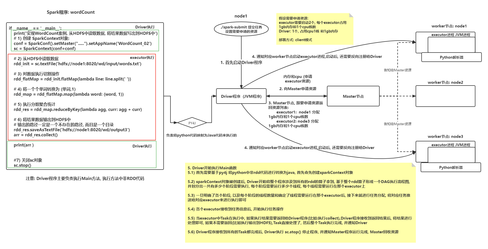
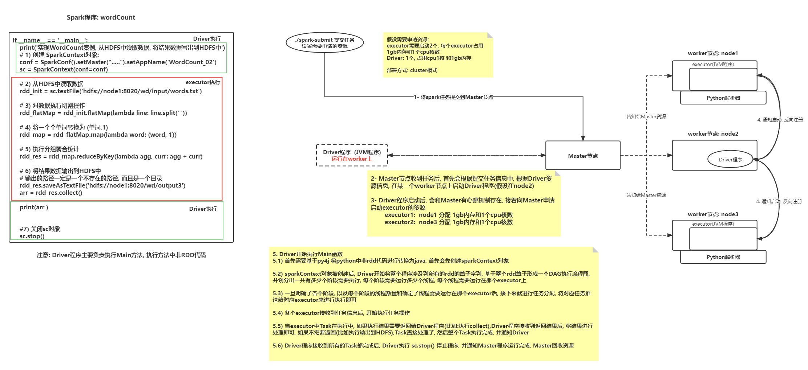
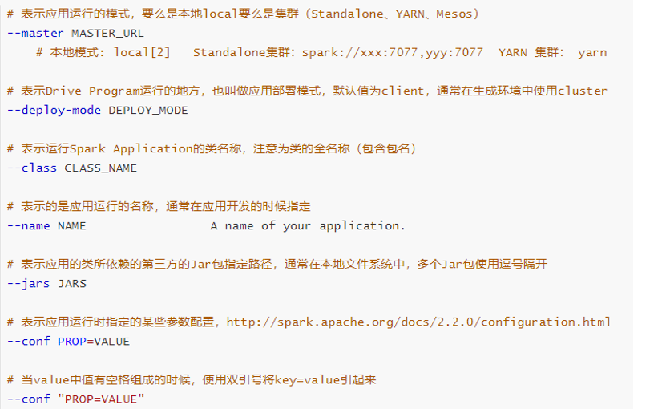
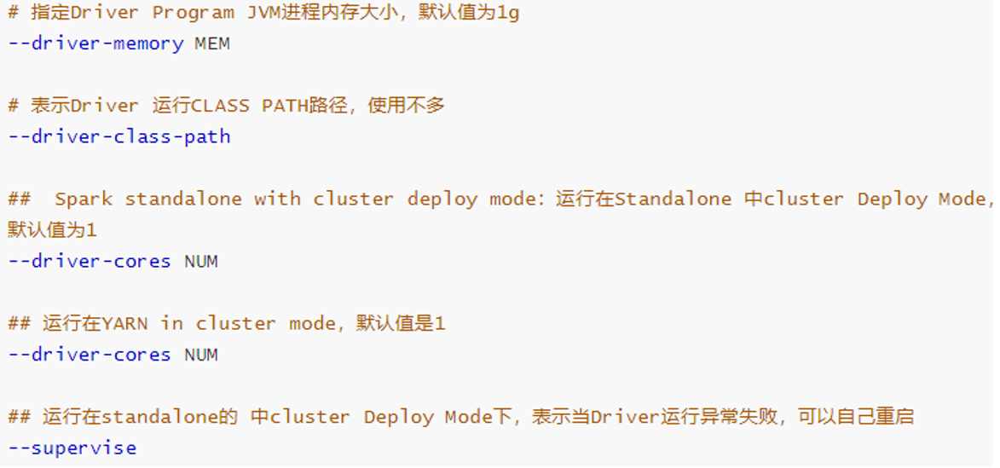
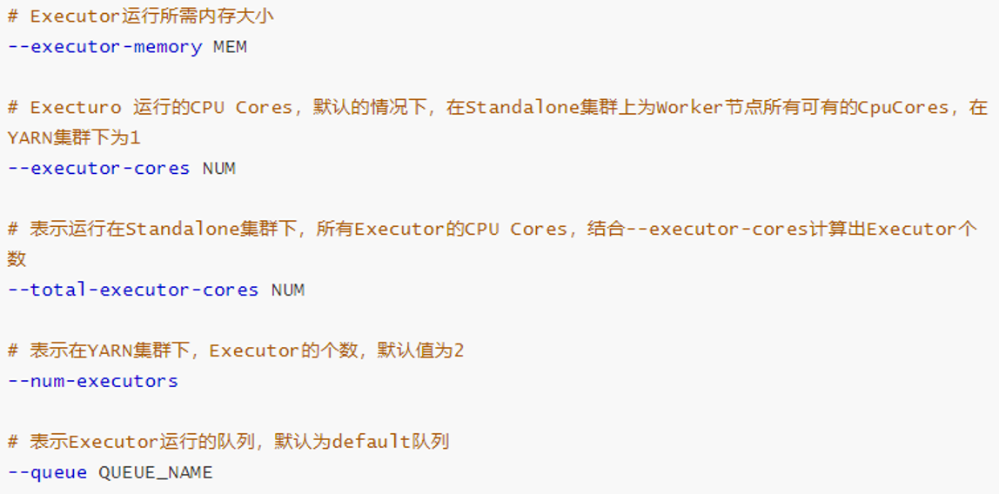
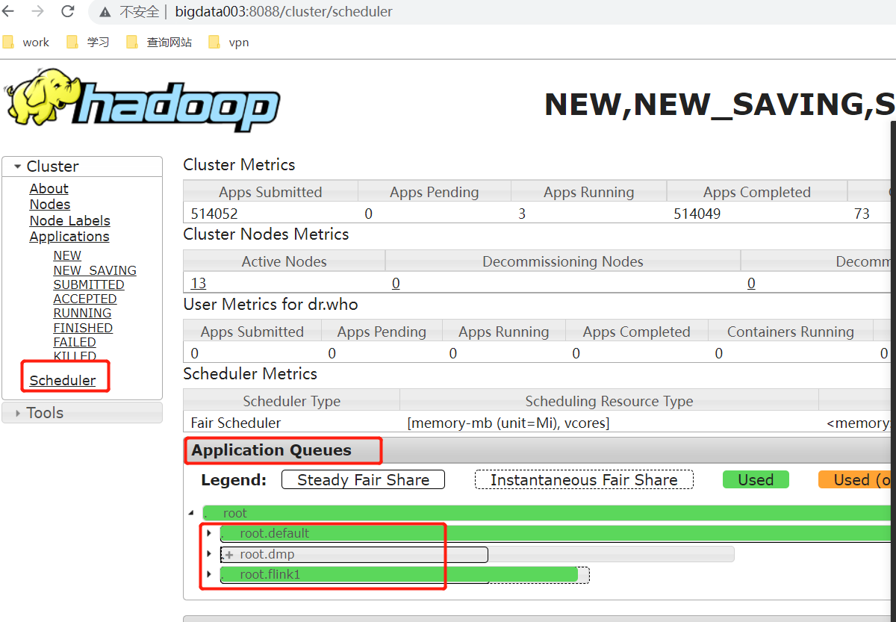
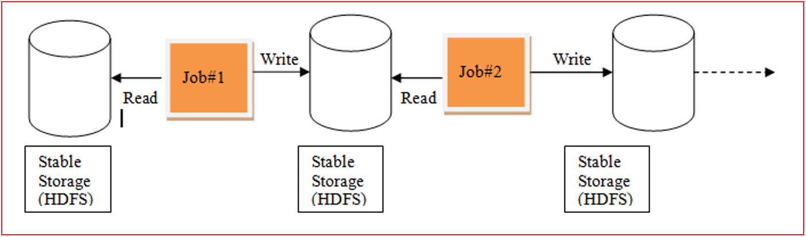
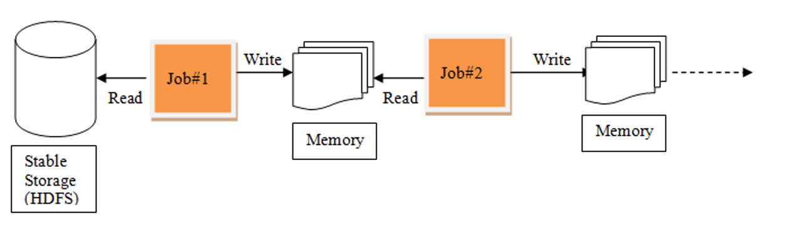
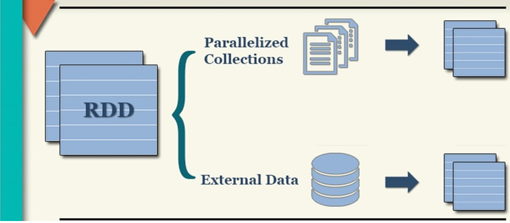

# day03_pySpark课程笔记


## 1.spark程序与pySpark交互流程



* on Spark 集群(client模式)

```properties
1. 首先启动Driver程序
2. 向Master申请资源 (内存和cpu (申请executor资源))
3. Master节点, 跟要申请资源返回资源列表:        
		executor1:  node1 分配 1gb内存和1个cpu核数      
        executor2:  node3 分配 1gb内存和1个cpu核数
4. 通知对应worker节点启动executor进程,启动后, 还需要反向注册给Driver
5. Driver开始执行Main函数
	5.1) 首先需要基于py4j 将python中非rdd代码进行转换为java, 首先会先创建sparkContext对象
	5.2) sparkContext对象被创建后, Driver开始将整个程序涉及到所有的rdd的算子拿到, 基于整个rdd算子形成一个DAG执行流程图, 并划分出一共有多少个阶段需要执行, 每个阶段需要运行多少个线程, 每个线程需要运行在那个executor上
	5.3) 一旦明确了各个阶段, 以及每个阶段的线程数量和确定了线程需要运行在那个executor后, 接下来就进行任务分配, 将对应任务推送给对应executor来进行执行即可
	5.4) 各个executor接收到任务信息后, 开始执行任务操作
	5.5) 当executor中Task在执行中, 如果执行结果需要返回给Driver程序(比如:执行collect),Driver程序接收到返回结果后, 将结果进行处理即可, 如果不需要返回(比如执行输出到HDFS),Task直接处理了, 然后整个Task执行完成, 并通知Driver
	5.6) Driver程序接收到所有的Task都完成后, Driver执行 sc.stop() 停止程序, 并通知Master程序运行完成, Master回收资源
```



* spark集群 on Cluster部署方式

```properties
1- 将spark任务提交到Master节点
2- Master节点收到任务后, 首先会根据提交任务信息中, 根据Driver资源信息, 在某一个worker节点上启动Driver程序(假设在node2)
3- Driver程序启动后, 会和Master有心跳机制存在, 接着向Master申请启动executor的资源        
	executor1:  node1 分配 1gb内存和1个cpu核数        
	executor2:  node3 分配 1gb内存和1个cpu核数
4. 通知对应worker节点启动executor进程,启动后, 还需要反向注册给Driver
5. Driver开始执行Main函数
	5.1) 首先需要基于py4j 将python中非rdd代码进行转换为java, 首先会先创建sparkContext对象
	5.2) sparkContext对象被创建后, Driver开始将整个程序涉及到所有的rdd的算子拿到, 基于整个rdd算子形成一个DAG执行流程图, 并划分出一共有多少个阶段需要执行, 每个阶段需要运行多少个线程, 每个线程需要运行在那个executor上
	5.3) 一旦明确了各个阶段, 以及每个阶段的线程数量和确定了线程需要运行在那个executor后, 接下来就进行任务分配, 将对应任务推送给对应executor来进行执行即可
	5.4) 各个executor接收到任务信息后, 开始执行任务操作
	5.5) 当executor中Task在执行中, 如果执行结果需要返回给Driver程序(比如:执行collect),Driver程序接收到返回结果后, 将结果进行处理即可, 如果不需要返回(比如执行输出到HDFS),Task直接处理了, 然后整个Task执行完成, 并通知Driver
	5.6) Driver程序接收到所有的Task都完成后, Driver执行 sc.stop() 停止程序, 并通知Master程序运行完成, Master回收资源
```

------

on Yarn模式:

```properties
在client部署模式下, on yarn 和 on spark集群之间有什么区别?  
1- Driver程序中资源申请功能被appMaster替代了
2- 在client模式下, 虽然也是要先启动Driver程序, 但是Driver启动后, 会向Yarn提交任务; Yarn会先在某一个节点启动appMaster, 并负责executor资源的申请和启动(原因: 向Yarn申请资源, 必须有appMaster来负责)
3- executor一旦启动后, 依然要反向注册给Driver程序,最终也是由Driver程序来进行任务的分配工作
4- 当任务运行完成后, Driver告知给Yarn的resourcemanager程序运行完成, resourceManager会通知appMaster关闭程序, 回收相关的资源

总结说明:
	除了executor申请资源的权利被appMaster剥夺外, 其余的和spark集群的client是一模一样的
	
	

在cluster部署模式下, on yarn 和 on spark集群 之间有什么区别呢?
     Driver程序 和 appMaster程序合二为一,Driver所有的功能都和appMaster集成在一起了
```


小作业:  尝试将on yarn 的client模式和cluster模式的交互流程说明描述出来


## 2.spark-submit相关参数说明

spark-submit.sh 脚本作用:

* 用于将spark程序提交到指定的资源调度平台上进行运行, 并且在提交的过程中, 可以对资源, 相关配置信息, 任务的信息进行相关的设置操作

**<font color='red'>基本参数</font>**:

```properties
-- master  :  用于指定提交到那个资源调度平台 (可选择: local| spark | yarn ....)
-- deploy-mode:  用于指定提交部署方式(可选择: client 和 cluster)
--conf : 用于设置相关配置信息
python-file : 指定spark的python脚本
args:  添加程序入口参数, 如果没有参数是可以不配置的
```




- **<font color='red'>资源参数</font>**:







## 3.RDD的基本介绍

### 3.1 什么是RDD

RDD: 弹性的分布式数据集

RDD的出现目的: 主要是用于支持更加高效的迭代计算

----

背景说明:

```properties
在早期的计算模型:  单机模型
	比如:  pandas , mysql
	依赖于单个节点的性能
	适用于: 少量数据集统计分析处理
	在计算过程中, 数据都是在一个进程中, 不断的进行各种迭代计算操作

当数据量大了以后, 单机这种计算模式无法支撑的, 此时需要分布式计算模型
	核心: 让多个节点参与计算, 将计算任务进行划分, 将这个部分交给各个节点进行运行, 运算后, 将结果进行汇总
	比如: MapReduce. spark
	
	MapReduce计算模型:
		在计算过程中, 每一个MR都是有两部分组成: map  和 reduce
		在计算过程中, 需要将数据从磁盘读取内存中, 从内存落入磁盘, 再从磁盘读取到内存中, 这样导致整个IO变大, 不断的与磁盘进行交互, 整个执行效率 也是比较低的
		由于一个MR只有map和reduce节点, map进行分布式计算, 计算reduce汇总统计, 如果需要进行多次的分布式计算和多次聚合统计(迭代计算), 对于MR来说, 必须使用多个MR进行串行执行了,而这样的执行导致每一个MR都需要重新申请资源, 回收资源, 大量的时候都消耗在了资源申请和回收上, 而且这种操作中间结果只能保存在磁盘中, 导致效率比较低
	
	正因为有了这个MR问题后, 此时想办法解决问题,解决问题思路: 
		1) 是否可以让中间结果都保存在内存中, 这样效率是不是就比较高了
		2) 是否可以在一个程序中完成多次的不断迭代计算操作
	这种思路, 谁提供了具体的解决方案呢? spark提供了,spark的RDD的产生就是为了解决这样的问题
```

MR的迭代计算操作:



spark的迭代计算流程:




### 3.2 RDD的五大特性(明确知道)

五大特性:

```properties
1- (必须的)可分区的: 每一个分区对应就是一个Task线程
2- (必须的)计算函数(对每个分区进行计算操作)
3- (必须的)存在依赖关系
4- (可选的)对于key-value数据存在分区计算函数
5- (可选的)移动数据不如移动计算(将计算程序运行在离数据越近越好)
```

### 3.3 RDD的五大特点(了解)

```properties
1- 可分区的: 分区是抽象的分区, 仅仅是定义分区的信息规则
2- 只读特性: 一个RDD对象中数据是不可变的
3- 依赖: RDD与RDD之间是存在依赖关系: 依赖关系越长, 整个血缘关系越长
		血缘关系越长,重新计算的代价就会越大
		依赖中可以分为: 宽依赖和窄依赖
4- 缓存: 当需要对一个RDD的结果进行重复使用的时候, 可以将这个RDD的计算结果缓存起来, 减少后续重新计算的资源和时间消耗

5- checkpoint: 检测点
	当依赖链条比较长的时候, 如果其中一个算子计算失败, 重新计算一次的代价是很大的, 需要重新将整个依赖关系全部重塑, 非常耗费资源, 可以同检测点将血缘关系打断, 在对应打断点上记录当前结果数据, 这样后续即使使用了, 也不需要重塑全部依赖流程  提升容错能留
```


## 4.如何构建RDD

构建RDD对象的方式主要有二种:

```
通过 parallelize('''') API 来构建RDD对象
通过加载外部数据集的方式构建:  textFile(....)
```





### 4.1 通过并行化方式来构建RDD

代码演示:

```python
from pyspark import SparkContext, SparkConf
import os

# 锁定远端环境, 避免出现问题
os.environ['SPARK_HOME'] = '/export/server/spark'
os.environ["PYSPARK_PYTHON"] = "/root/anaconda3/bin/python"
os.environ["PYSPARK_DRIVER_PYTHON"] = "/root/anaconda3/bin/python"
# 注意  在执行spark代码的时候, 必须先将hadoop集群启动好 (因为日志需要记录在HDFS中)
if __name__ == '__main__':
    print("演示: 构建RDD的第一种方式: ")

    # 1) 构建sparkContext对象
    conf = SparkConf().setMaster("local[3]").setAppName("create_rdd_01")
    sc = SparkContext(conf=conf)

    # 2) 读取数据: parallelize
    rdd_init = sc.parallelize(['张三','李四','王五','赵六','田七'],7)

    # 思考: 想查看一下, 当前这个RDD, 是否存在多个分区呢? glom()
    print(rdd_init.glom().collect()) 结果: [[], ['张三'], ['李四'], [], ['王五'], ['赵六'], ['田七']]
    # 用于获取一共有多少的分区
    print(rdd_init.getNumPartitions())  结果为 7
    print("以上为分区的结果数据")
    # 3) 对数据进行处理
    #   需求: 要将每一个元素变更为 (name,1)
    rdd_map = rdd_init.map(lambda name:(name,1))

    # 4) 输出数据: 直接打印
    print(rdd_map.collect())

    # 5) 关闭sc对象
    sc.stop()
```

说明:

```properties
1) 默认情况下, 分区数量取决于 setMaster参数设置, 以及Linux服务器的CPU的核心数量
2) 支持手动设置数据的分区数量: 
	sc.parallelize(初始化数据集,分区数量)
3) 如何获取每个分区中数据: rdd.glom().collect()
4) 如果获取分区数量: rdd.getNumPartitions()
```


