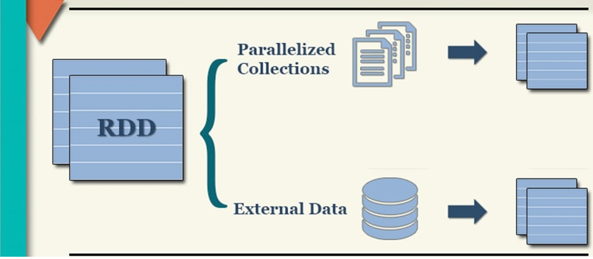
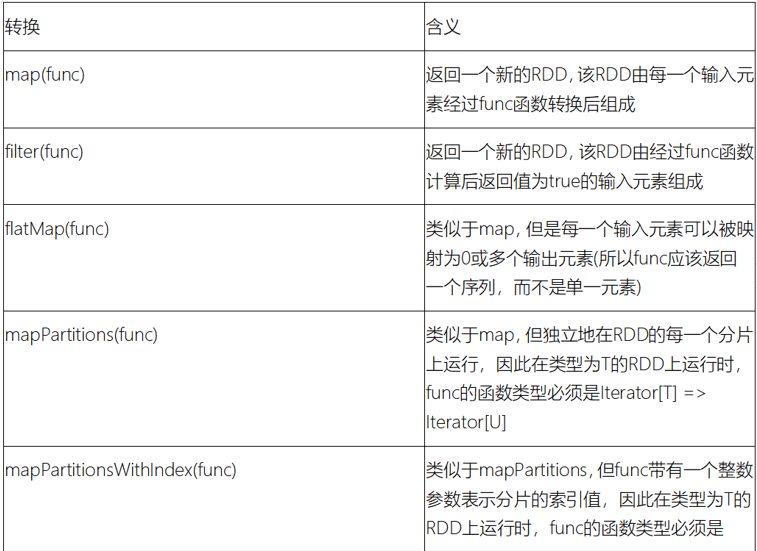
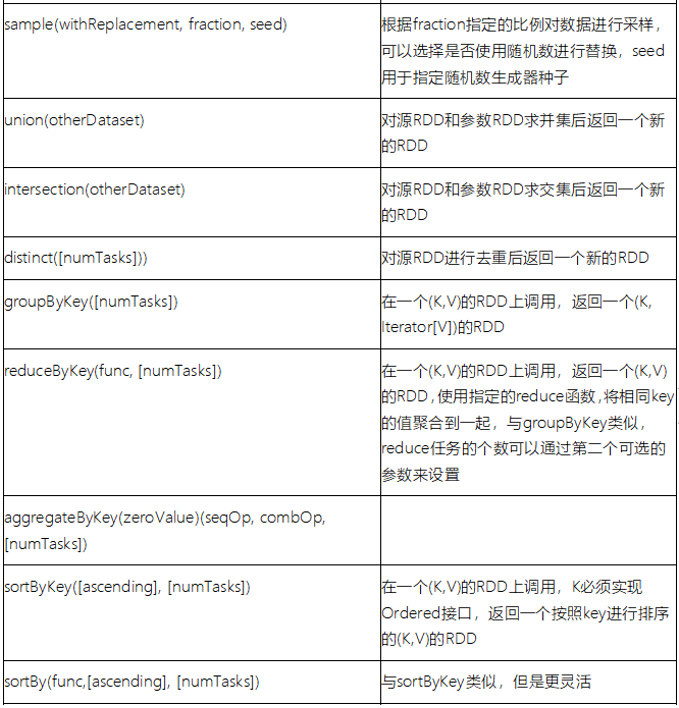
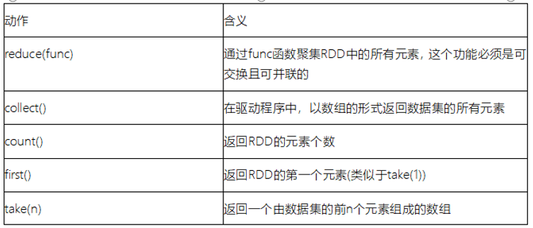
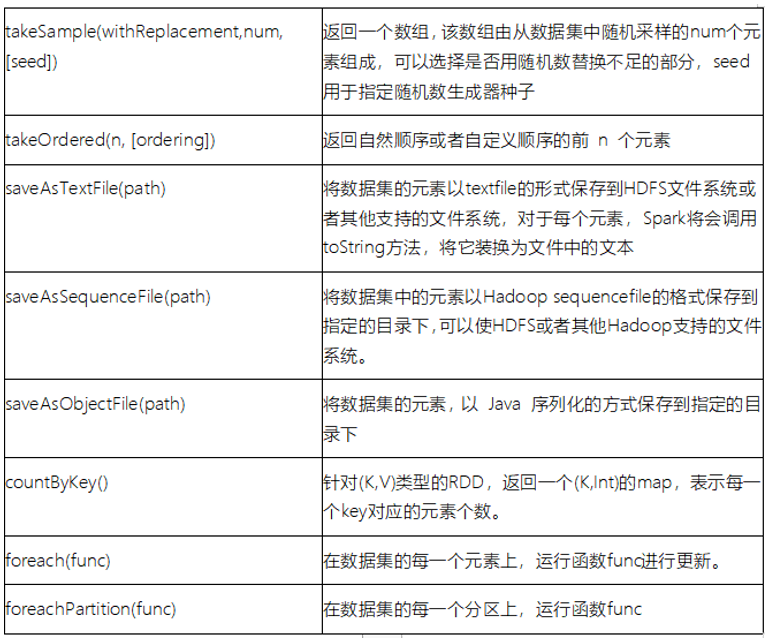

# day04_sparkCore课程笔记

spark on yarn的 流程:

```properties
client流程: 
1. 首先启动Driver程序
2. Driver程序会向yarn的resourceManager提交任务
3. 当resourceManager收到任务后, 开始在任意的一个节点上启动一个appMaster, 有这个appMaster负责整个任务(对于Yarn来说)-- 次任务主要是executor资源申请, 以及启动和释放等
4. appMaster启动后会和resourceManager建立心跳连接(告知rm启动成功了),然后将需要申请的资源通过心跳包的形式发送给resourceManager
5. resourceManager收到资源后, 开始进行资源的分配, 将资源分配完成后, 等待appMaster来拉取资源
6. appMaster每隔一段时间就会询问一下resourceManager是否将资源准备完成了, 一旦发现准备好了, 直接拉取过来
7. 根据资源信息, 通知对应nodemanager启动executor程序, executor启动后, 还需要反向注册给Driver(同时也会通知appMaster启动成功了)

8. Driver开始执行Main函数
	8.1) 首先需要基于py4j 将python中非rdd代码进行转换为java, 首先会先创建sparkContext对象
	8.2) sparkContext对象被创建后, Driver开始将整个程序涉及到所有的rdd的算子拿到, 基于整个rdd算子形成一个DAG执行流程图, 并划分出一共有多少个阶段需要执行, 每个阶段需要运行多少个线程, 每个线程需要运行在那个executor上
	8.3) 一旦明确了各个阶段, 以及每个阶段的线程数量和确定了线程需要运行在那个executor后, 接下来就进行任务分配, 将对应任务推送给对应executor来进行执行即可
	8.4) 各个executor接收到任务信息后, 开始执行任务操作
	8.5) 当executor中Task在执行中, 如果执行结果需要返回给Driver程序(比如:执行collect),Driver程序接收到返回结果后, 将结果进行处理即可, 如果不需要返回(比如执行输出到HDFS),Task直接处理了, 然后整个Task执行完成, 并通知Driver
	8.6) Driver程序接收到所有的Task都完成后, Driver执行 sc.stop() 停止程序, 并通知resourceManager程序执行完成, resourceManager通知appMaster关闭, 并且回收资源

```

cluster模式: (Driver就是appMaster, appMaster就是Driver)

```properties
1- 将spark任务提交到resourceManager节点
2. 当resourceManager收到任务后, 开始在任意的一个节点上启动一个appMaster(Driver), 由这个appMaster负责整个任务(对于Yarn来说)-- 此时整个任务包含所有内容
3. appMaster启动后会和resourceManager建立心跳连接(告知rm启动成功了),然后将需要申请的资源通过心跳包的形式发送给resourceManager
4. resourceManager收到资源后, 开始进行资源的分配, 将资源分配完成后, 等待appMaster来拉取资源
5. appMaster每隔一段时间就会询问一下resourceManager是否将资源准备完成了, 一旦发现准备好了, 直接拉取过来
6. 根据资源信息, 通知对应nodemanager启动executor程序, executor启动后, 还需要反向注册给Driver(appMaster)

7. Driver开始执行Main函数
	7.1) 首先需要基于py4j 将python中非rdd代码进行转换为java, 首先会先创建sparkContext对象
	7.2) sparkContext对象被创建后, Driver开始将整个程序涉及到所有的rdd的算子拿到, 基于整个rdd算子形成一个DAG执行流程图, 并划分出一共有多少个阶段需要执行, 每个阶段需要运行多少个线程, 每个线程需要运行在那个executor上
	7.3) 一旦明确了各个阶段, 以及每个阶段的线程数量和确定了线程需要运行在那个executor后, 接下来就进行任务分配, 将对应任务推送给对应executor来进行执行即可
	7.4) 各个executor接收到任务信息后, 开始执行任务操作
	7.5) 当executor中Task在执行中, 如果执行结果需要返回给Driver程序(比如:执行collect),Driver程序接收到返回结果后, 将结果进行处理即可, 如果不需要返回(比如执行输出到HDFS),Task直接处理了, 然后整个Task执行完成, 并通知Driver
	7.6) Driver程序接收到所有的Task都完成后, Driver执行 sc.stop() 停止程序, 并通知resourceManager运行完成, resourceManager回收资源
```


## 1.如何构建RDD

构建RDD对象的方式主要有二种:

```properties
通过 parallelize('''') API 来构建RDD对象
通过加载外部数据集的方式构建:  textFile(....)
```





### 1.1 通过并行化方式来构建RDD

代码演示:

```python
from pyspark import SparkContext, SparkConf
import os

# 锁定远端环境, 避免出现问题
os.environ['SPARK_HOME'] = '/export/server/spark'
os.environ["PYSPARK_PYTHON"] = "/root/anaconda3/bin/python"
os.environ["PYSPARK_DRIVER_PYTHON"] = "/root/anaconda3/bin/python"
# 注意  在执行spark代码的时候, 必须先将hadoop集群启动好 (因为日志需要记录在HDFS中)
if __name__ == '__main__':
    print("演示: 构建RDD的第一种方式: ")

    # 1) 构建sparkContext对象
    conf = SparkConf().setMaster("local[3]").setAppName("create_rdd_01")
    sc = SparkContext(conf=conf)

    # 2) 读取数据: parallelize
    rdd_init = sc.parallelize(['张三','李四','王五','赵六','田七'],7)

    # 思考: 想查看一下, 当前这个RDD, 是否存在多个分区呢? glom()
    print(rdd_init.glom().collect()) 结果: [[], ['张三'], ['李四'], [], ['王五'], ['赵六'], ['田七']]
    # 用于获取一共有多少的分区
    print(rdd_init.getNumPartitions())  结果为 7
    print("以上为分区的结果数据")
    # 3) 对数据进行处理
    #   需求: 要将每一个元素变更为 (name,1)
    rdd_map = rdd_init.map(lambda name:(name,1))

    # 4) 输出数据: 直接打印
    print(rdd_map.collect())

    # 5) 关闭sc对象
    sc.stop()
```

说明:

```properties
1) 默认情况下, 分区数量取决于 setMaster参数设置, 以及Linux服务器的CPU的核心数量
2) 支持手动设置数据的分区数量: 
	sc.parallelize(初始化数据集,分区数量)
3) 如何获取每个分区中数据: rdd.glom().collect()
4) 如果获取分区数量: rdd.getNumPartitions()
```


### 1.2 通过读取外部数据方式构建RDD

代码实现:

```python
from pyspark import SparkContext, SparkConf
import os

# 锁定远端环境, 避免出现问题
os.environ['SPARK_HOME'] = '/export/server/spark'
os.environ["PYSPARK_PYTHON"] = "/root/anaconda3/bin/python"
os.environ["PYSPARK_DRIVER_PYTHON"] = "/root/anaconda3/bin/python"

if __name__ == '__main__':
    print("演示通过读取外部文件的方式, 来构建RDD")

    # 1) 创建 sparkContext对象
    conf = SparkConf().setAppName("create_rdd_02").setMaster("local[2]")
    sc = SparkContext(conf=conf)

    # 2) 构建RDD对象: 加载外部数据集
    # 本地路径(指的linux的本地路径): file:///    hdfs协议: hdfs://node1:8020
    # 注意:
    #    在加载外部数据集的时候, 如果数据是本地路径, 默认情况下, 文件有多少个, 自动划分为多少个分区数量 
    #                         如果数据在HDFS路径, 默认情况下, 有多少个block块, 对应有多少个分区数量
    rdd_init = sc.textFile('file:///export/data/workspace/ky03_pyspark_parent/_02_pyspark_core/data/')

    # ---------查看每个分区中数据,以及分区的数量---------------
    print(rdd_init.getNumPartitions())

    print(rdd_init.glom().collect())

    print("--------------")
    # 3) 收集打印数据结果
    print(rdd_init.collect())

    # 4) 释放sc对象
    sc.stop()
```

思考点: 如果有大量的小文件, 按照目前这种有多少个文件, 就会启动多少个分区数, 一个分区最终在spark程序就会对应着一个线程, 会导致线程数量变多, 浪费资源, 影响效率, 如何解决呢?  **<font color='red'>wholeTextFiles()</font>**

```properties
from pyspark import SparkContext, SparkConf
import os

# 锁定远端环境, 避免出现问题
os.environ['SPARK_HOME'] = '/export/server/spark'
os.environ["PYSPARK_PYTHON"] = "/root/anaconda3/bin/python"
os.environ["PYSPARK_DRIVER_PYTHON"] = "/root/anaconda3/bin/python"

if __name__ == '__main__':
    print("演示: 如何处理小文件的问题")

    # 1) 构建SparkContext对象
    conf = SparkConf().setMaster("local[*]").setAppName("create_rdd_03")
    sc = SparkContext(conf=conf)

    # 2) 构建RDD对象: 加载外部数据集
    # 原则: 尽可能减少分区的数量, 同时保证效率, 如果处理后不满意, 可以通过手动方式设置最小的分区数量
    rdd_init = sc.wholeTextFiles('file:///export/data/workspace/ky03_pyspark_parent/_02_pyspark_core/data/')

    # 3) 打印RDD分区数量和分区内容
    print(rdd_init.getNumPartitions())
    print(rdd_init.glom().collect())

    # 4) 释放sc对象
    sc.stop()
```

注意:

```properties
   返回的结果中, 为一个二元元组数据, 其中key为文件的路径, value为文件中数据内容
```


## 2. RDD算子相关操作

​			在spark中, 将支持传递函数的或者说具有一些特殊功能的方法或者函数称为算子

### 2.1 RDD算子分类:

​		在整个RDD中主要有二类算子:  **一类是转换(transformation)算子, 另一类动作(action)算子**

```properties
转换算子: transformation
	1) 所有的转换算子执行都会返回一个新的RDD对象
	2) 转换算子的特性是lazy(惰性), 只有遇到action动作算子后才会执行
	3) 不负责数据的存储, 仅仅是定义了计算规则

动作算子: action
	1) 立即执行(生成一个DAG有向无环图, 执行任务): 一个spark程序中, 有多少个action算子, 那么也就代表着会运行多少个任务
	2) action算子不会返回RDD对象: 要不就是没有返回值(saveAsTextFile). 要不返回其他的具体内容(collect)
```

转换算子信息:





动作算子:





官方所有算子的查看文档: https://spark.apache.org/docs/3.1.2/api/python/reference/pyspark.html#rdd-apis

### 2.2 RDD的Transformation算子操作

* 第一类: 值类型的算子(只对value数据进行处理)

  * map算子(F) 算子
    * 指的: 根据用户传入的自定义函数, 将数据进行一对一的转换操作

  ```properties
  需求:  初始化一个 1~10 数据, 让每个数据都 +1 操作
  rdd_init = sc.parallelize([1,2,3,4,5,6,7,8,9,10])
  rdd_init.map(lambda num:num+1).collect()
  
  结果: 
  [2, 3, 4, 5, 6, 7, 8, 9, 10, 11]
  
  说明: 使用lambda方式, 使用python匿名函数, 除了可以使用匿名函数以外, 也可以先定义函数, 然后使用
  
  def f1(x):
      return x + 1
  
  rdd_init.map(f1).collect()  
  
  结果: 
  [2, 3, 4, 5, 6, 7, 8, 9, 10, 11]
  ```

  * groupBy(F)算子: 
    * 作用: 根据用户传入的自定义函数, 对数据进行分组操作

  ```properties
  需求:  初始化一个 1~10 数据, 将奇数和偶数区分开, 分为两组数据
  rdd_init = sc.parallelize([1,2,3,4,5,6,7,8,9,10])
  rdd_g = rdd_init.groupBy(lambda num: 'o' if(num % 2 == 0) else 'j')
  rdd_g.collect()
  结果: 
  [
  	('j', <pyspark.resultiterable.ResultIterable object at 0x7fc9978842b0>), 
  	('o', <pyspark.resultiterable.ResultIterable object at 0x7fc997890970>)]
  
  发现: 返回的结果中, key为组名字, value为这个组的数据, 此数据目前是一个迭代器(Iterable)
  
  如果处理迭代器中数据:  
  	mapValues() 算子: 用于对value数据进行转换处理
  
  操作:
  rdd_g.mapValues(list).collect()
  
  结果:
  	[('j', [1, 3, 5, 7, 9]), ('o', [2, 4, 6, 8, 10])]
  ```

  * filter(F) 算子
    * 作用:  用于对数据进行过滤操作, 将需要的数据保留下来, 不需要的数据剔除掉
    * 传入函数, 函数表示一个判断条件, 必须返回boolean类型值, 如果为True 表示保留, 为False 表示剔除

  ```properties
  需求: 初始化一个 1~10 数据, 将大于5的数据, 过滤掉
  rdd_init = sc.parallelize([1,2,3,4,5,6,7,8,9,10])
  rdd_init.filter(lambda num: num <= 5).collect()
  
  结果为:
  	[1, 2, 3, 4, 5]
  ```

  * flatMap算子: 扁平化处理
    * 作用: 对数据先执行map操作, 然后执行flat扁平化

  ```properties
  需求: 初始化相关的数据, 对数据执行切割操作, 得到一个更大的列表
  rdd_init = sc.parallelize(['张三 李四 王五','赵六 田七 周八 李九'])
  
  演示 Map算子: 
  rdd_init.map(lambda el:el.split(' ')).collect()
  	[
  		['张三', '李四', '王五'], 
  		['赵六', '田七', '周八', '李九']
  	]
  
  演示flatMap算子:
  rdd_init.flatMap(lambda el:el.split()).collect() 
  
  结果: 
  	['张三', '李四', '王五', '赵六', '田七', '周八', '李九']
  ```

* 第二类: 双值类型的算子

  * union(并集) 和 intersection(交集)

  ```properties
  需求:  创建两个数据集, 分别计算其并集和交集
  rdd_a = sc.parallelize([1,2,3,4,5])
  rdd_b = sc.parallelize([4,5,6,9,10])
  
  -- 求并集:
  rdd_a.union(rdd_b).collect()
  
  结果:
  	[1, 2, 3, 4, 5, 4, 5, 6, 9, 10]
  
  rdd_a.union(rdd_b).distinct().collect()
  [4, 1, 5, 9, 2, 6, 10, 3]
  
  -- 求交集:
  rdd_a.intersection(rdd_b).collect()
  
  结果:
  	[4, 5]
  ```

* 第三类: kv类型的算子

  * groupByKey算子:
    * 作用: 根据key进行分组操作, 分组后, 每组都是一个迭代器

  ```properties
  需求:  创建一个数据集, 按照 key 进行分组操作
  rdd_init = sc.parallelize([('c01','张三'),('c02','李四'),('c01','王五'),('c03','赵六'),('c02','田七'),('c01','周八')])
  
  rdd_init.groupByKey().mapValues(list).collect()
  [('c01', ['张三', '王五', '周八']), ('c02', ['李四', '田七']), ('c03', ['赵六'])]
  ```

  * reduceByKey(F)算子:
    * 作用: 根据key进行分组 , 根据用户传入的自定义函数进行聚合统计计算

  ```properties
  需求: 创建一个数据集, 请按照key进行分组操作, 统计每组有多少个?
  rdd_init = sc.parallelize([('c01','张三'),('c02','李四'),('c01','王五'),('c03','赵六'),('c02','田七'),('c01','周八')])
  
  rdd_init.map(lambda tup: (tup[0],1)).reduceByKey(lambda agg,curr: agg + curr).collect()
  
  结果:
  	[('c01', 3), ('c02', 2), ('c03', 1)]
  
  ```

  * sortByKey() 算子:
    * 作用:  根据key进行排序操作, 默认升序, 可以通过 asc参数设置为False, 进行倒序排序

  ```properties
  需求:   根据key进行排序, 完成 升序和倒序的排序操作
  rdd_init = sc.parallelize([(3,'c01'), (1,'c02'), (2,'c03')])
  
  rdd_init.sortByKey().collect()
  结果: 
  [(1, 'c02'), (2, 'c03'), (3, 'c01')]
  
  rdd_init.sortByKey(False).collect()
  结果:
  [(3, 'c01'), (2, 'c03'), (1, 'c02')]
  ```

  * countByValue 算子(了解)
    * 作用: 根据value进行分组, 并统计出相同value有多少个, 可以直接返回结果

  ```properties
  需求:  对以下数据集进行分组操作, 求每个数据有多少个
  rdd_init = sc.parallelize([1,2,3,1,5,1,7,2,2,10])
  
  结果:
  	defaultdict(<class 'int'>, {1: 3, 2: 3, 3: 1, 5: 1, 7: 1, 10: 1})
  ```

  

### 2.3 RDD的action算子


### 2.4 RDD的重要算子


