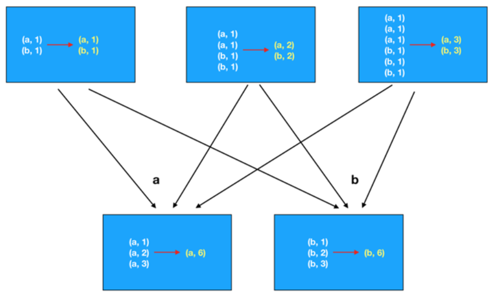

# day05 sparkCore

## 1. RDD算子相关操作

​			在spark中, 将支持传递函数的或者说具有一些特殊功能的方法或者函数称为算子

### 1.1 RDD算子分类:

​		在整个RDD中主要有二类算子:  一类是转换(transformation)算子, 另一类动作(action)算子

```properties
转换算子: transformation
	1) 所有的转换算子执行都会返回一个新的RDD对象
	2) 转换算子的特性是lazy(惰性), 只有遇到action动作算子后才会执行
	3) 不负责数据的存储, 仅仅是定义了计算规则

动作算子: action
	1) 立即执行(生成一个DAG有向无环图, 执行任务): 一个spark程序中, 有多少个action算子, 那么也就代表着会运行多少个任务
	2) action算子不会返回RDD对象: 要不就是没有返回值(saveAsTextFile). 要不返回其他的具体内容(collect)
```

转换算子信息:


动作算子:


官方所有算子的查看文档: https://spark.apache.org/docs/3.1.2/api/python/reference/pyspark.html#rdd-apis

### 1.2 RDD的Transformation算子操作

* 第一类: 值类型的算子(只对value数据进行处理)

  * map算子(F) 算子
    * 指的: 根据用户传入的自定义函数, 将数据进行一对一的转换操作

  ```properties
  需求:  初始化一个 1~10 数据, 让每个数据都 +1 操作
  rdd_init = sc.parallelize([1,2,3,4,5,6,7,8,9,10])
  rdd_init.map(lambda num:num+1).collect()
  
  结果: 
  [2, 3, 4, 5, 6, 7, 8, 9, 10, 11]
  
  说明: 使用lambda方式, 使用python匿名函数, 除了可以使用匿名函数以外, 也可以先定义函数, 然后使用
  
  def f1(x):
      return x + 1
  
  rdd_init.map(f1).collect()  
  
  结果: 
  [2, 3, 4, 5, 6, 7, 8, 9, 10, 11]
  ```

  * groupBy(F)算子: 
    * 作用: 根据用户传入的自定义函数, 对数据进行分组操作

  ```properties
  需求:  初始化一个 1~10 数据, 将奇数和偶数区分开, 分为两组数据
  rdd_init = sc.parallelize([1,2,3,4,5,6,7,8,9,10])
  rdd_g = rdd_init.groupBy(lambda num: 'o' if(num % 2 == 0) else 'j')
  rdd_g.collect()
  结果: 
  [
  	('j', <pyspark.resultiterable.ResultIterable object at 0x7fc9978842b0>), 
  	('o', <pyspark.resultiterable.ResultIterable object at 0x7fc997890970>)]
  
  发现: 返回的结果中, key为组名字, value为这个组的数据, 此数据目前是一个迭代器(Iterable)
  
  如果处理迭代器中数据:  
  	mapValues() 算子: 用于对value数据进行转换处理
  
  操作:
  rdd_g.mapValues(list).collect()
  
  结果:
  	[('j', [1, 3, 5, 7, 9]), ('o', [2, 4, 6, 8, 10])]
  ```

  * filter(F) 算子
    * 作用:  用于对数据进行过滤操作, 将需要的数据保留下来, 不需要的数据剔除掉
    * 传入函数, 函数表示一个判断条件, 必须返回boolean类型值, 如果为True 表示保留, 为False 表示剔除

  ```properties
  需求: 初始化一个 1~10 数据, 将大于5的数据, 过滤掉
  rdd_init = sc.parallelize([1,2,3,4,5,6,7,8,9,10])
  rdd_init.filter(lambda num: num <= 5).collect()
  
  结果为:
  	[1, 2, 3, 4, 5]
  ```

  * flatMap算子: 扁平化处理
    * 作用: 对数据先执行map操作, 然后执行flat扁平化

  ```properties
  需求: 初始化相关的数据, 对数据执行切割操作, 得到一个更大的列表
  rdd_init = sc.parallelize(['张三 李四 王五','赵六 田七 周八 李九'])
  
  演示 Map算子: 
  rdd_init.map(lambda el:el.split(' ')).collect()
  	[
  		['张三', '李四', '王五'], 
  		['赵六', '田七', '周八', '李九']
  	]
  
  演示flatMap算子:
  rdd_init.flatMap(lambda el:el.split()).collect() 
  
  结果: 
  	['张三', '李四', '王五', '赵六', '田七', '周八', '李九']
  ```

* 第二类: 双值类型的算子

  * union(并集) 和 intersection(交集)

  ```properties
  需求:  创建两个数据集, 分别计算其并集和交集
  rdd_a = sc.parallelize([1,2,3,4,5])
  rdd_b = sc.parallelize([4,5,6,9,10])
  
  -- 求并集:
  rdd_a.union(rdd_b).collect()
  
  结果:
  	[1, 2, 3, 4, 5, 4, 5, 6, 9, 10]
  
  rdd_a.union(rdd_b).distinct().collect()
  [4, 1, 5, 9, 2, 6, 10, 3]
  
  -- 求交集:
  rdd_a.intersection(rdd_b).collect()
  结果:
  	[4, 5]
  	
  -- 求差集
  rdd_a.subtract(rdd_b)
  结果: 
  	[1,2,3]
  ```

* 第三类: kv类型的算子

  * groupByKey算子:
    * 作用: 根据key进行分组操作, 分组后, 每组都是一个迭代器

  ```properties
  需求:  创建一个数据集, 按照 key 进行分组操作
  rdd_init = sc.parallelize([('c01','张三'),('c02','李四'),('c01','王五'),('c03','赵六'),('c02','田七'),('c01','周八')])
  
  rdd_init.groupByKey().mapValues(list).collect()
  [('c01', ['张三', '王五', '周八']), ('c02', ['李四', '田七']), ('c03', ['赵六'])]
  ```

  * reduceByKey(F)算子:
    * 作用: 根据key进行分组 , 根据用户传入的自定义函数进行聚合统计计算

  ```properties
  需求: 创建一个数据集, 请按照key进行分组操作, 统计每组有多少个?
  rdd_init = sc.parallelize([('c01','张三'),('c02','李四'),('c01','王五'),('c03','赵六'),('c02','田七'),('c01','周八')])
  
  rdd_init.map(lambda tup: (tup[0],1)).reduceByKey(lambda agg,curr: agg + curr).collect()
  
  结果:
  	[('c01', 3), ('c02', 2), ('c03', 1)]
  
  ```

  * sortByKey() 算子:
    * 作用:  根据key进行排序操作, 默认升序, 可以通过 asc参数设置为False, 进行倒序排序

  ```properties
  需求:   根据key进行排序, 完成 升序和倒序的排序操作
  rdd_init = sc.parallelize([(3,'c01'), (1,'c02'), (2,'c03')])
  
  rdd_init.sortByKey().collect()
  结果: 
  [(1, 'c02'), (2, 'c03'), (3, 'c01')]
  
  rdd_init.sortByKey(False).collect()
  结果:
  [(3, 'c01'), (2, 'c03'), (1, 'c02')]
  ```

  * countByValue 算子(了解)
    * 作用: 根据value进行分组, 并统计出相同value有多少个, 可以直接返回结果

  ```properties
  需求:  对以下数据集进行分组操作, 求每个数据有多少个
  rdd_init = sc.parallelize([1,2,3,1,5,1,7,2,2,10])
  rdd_init.countByValue()
  
  结果:
  	defaultdict(<class 'int'>, {1: 3, 2: 3, 3: 1, 5: 1, 7: 1, 10: 1})
  ```

### 1.3 RDD的action算子

- collect 算子:
  - 作用: 用于将各个分区的数据收集在一起进行返回, 得到一个列表数据
- reduce算子:
  * 作用: 用于对数据进行聚合统计操作, 根据自定义函数;

``` properties
需求: 对以下结果, 进行求和统计
rdd = sc.parallelize([1,2,3,4,5,6,7,8,9,10])

rdd.reduce(lambda agg,curr:agg+curr)
结果:
55

```


* first算子:
  * 作用: 用于获取第一个数据

```properties
需求: 对以下结果, 获取第一个
rdd = sc.parallelize([1,2,3,4,5,6,7,8,9,10])
rdd.first()
结果
1
```

* take算子:
  * 作用: 返回前N个数据

```properties
需求: 对以下结果, 获取前5个
rdd = sc.parallelize([1,2,3,4,5,6,7,8,9,10])
rdd.take(5)
结果
[1, 2, 3, 4, 5]
```

* top算子:
  * 作用: 获取前N个数据, 会自动对数据进行从大到小排序, 同时支持自定义排序数据

```properties
需求:  对以下数据进行排序, 取TOP3
rdd = sc.parallelize([4,1,2,3,6,7,4,2])
rdd.top(3)
[7, 6, 4]

需求: 对以下数据进行排序, 取TOP3
rdd = sc.parallelize([('c01',3), ('c02',2), ('c03',10), ('c04',1)])
rdd.top(3)
结果:  默认是根据key进行倒序排序
[('c04', 1), ('c03', 10), ('c02', 2)]

希望其能够按照value进行排序操作
rdd.top(3,lambda tuple: tuple[1])
结果:
[('c03', 10), ('c01', 3), ('c02', 2)]

rdd = sc.parallelize([(3,'c01'), (2,'c02'), (10,'c03'), (1,'c04')])
rdd.top(3)
结果: 
[(10, 'c03'), (3, 'c01'), (2, 'c02')]

```

* count算子;
  * 作用: 获取有多少个元素

```properties
需求: 获取一下数据集中, 一共有多少个
rdd = sc.parallelize([1,2,3,4,5,6,7,8,9,10])
rdd.count()

结果:
	10

除了count算子以外, 还有 sum() max() min() mean()
>>> rdd.sum()
55

>>> rdd.max()
10
>>> rdd.min()
1
>>> rdd.mean()
5.5
```

* takeSample: 
  * 用于对数据进行采样(随机获取一些数据)

```properties
需求: 对以下的数据进行采样操作
rdd = sc.parallelize([1,2,3,4,5])

参数说明:
参数1: 是否有放回(是否允许重复采样)
参数2: 采样的数量(当参数1为False的时候, 采样数据最多和数据集的数据是相同的)
参数3: 种子值 (一旦确定了,每次采样结果也是一样的)

rdd.takeSample(True,10,2)
结果:
[1, 3, 1, 2, 1, 1, 5, 3, 3, 3]
```

* foreach算子:
  * 用于对数据进行遍历操作

```properties
需求: 将一下数据进行遍历打印操作
rdd = sc.parallelize([1,2,3,4,5])
list = rdd.collect()
for i in list:
    print(i)
结果: 
1
2
3
4
5

采用foreach
rdd.foreach(lambda x:print(x))
1
2
3
4
5
```


### 1.4 RDD的重要算子

* 基本函数:


#### 1.4.0 RDD分区数

- 在讲解 RDD 属性时，多次提到了分区（partition）的概念。分区是一个偏物理层的概念，也是 RDD 并行计算的单位。
  数据在 RDD 内部被切分为多个子集合，每个子集合可以被认为是一个分区，运算逻辑最小会被应用在每一个分区上，每个分区是由一个单独的任务（task）来运行的，所以分区数越多，整个应用的并行度也会越高。
- 获取RDD分区数目方式，如下： rdd.getNumPartitions   或者 rdd.partitions.length


##### RDD分区的数据取决于哪些因素？

第一点：RDD分区的原则是使得分区的个数尽量等于集群中的**<font color='red'>CPU核心(core)数目</font>**，这样可以充分利用CPU的计算资源；
第二点：在实际中为了更加充分的压榨CPU的计算资源，<font color='red'>会把并行度设置为cpu核数的2~3倍</font>；
第三点：RDD分区数和启动时指定的核数、调用方法时指定的分区数、如文件本身分区数有关系，具体如下说明：

- 启动的时候指定的CPU核数确定了一个参数值:
- spark.default.parallelism=指定的CPU核数(集群模式最小2)

- 思考：尝试spark.default.parallelism设置小一些，查看分区数
- **对于Scala集合调用parallelize(集合,分区数)方法**
- <font color='orange'>如果没有指定分区数，就使用spark.default.parallelism</font>
- <font color='orange'>如果指定了就使用指定的分区数(建议不要指定大于spark.default.parallelism)</font>

##### 读文件RDD分区数据

- 对于textFile(文件, 分区数)
  - 指定最小分区数: **<font color='red'>defaultMinPartitions</font>**
  - 如果没有指定分区数sc.defaultMinPartitions=**<font color='red'>min</font>**(defaultParallelism,2) 
  - 如果指定了就使用指定的分区数sc.defaultMinPartitions=指定的分区数rdd的分区数
  - rdd的分区数
  - **对于本地文件**
    - rdd的分区数 = **<font color='red'>max</font>**(本地file的分片数， 	sc.defaultMinPartitions)
    - 注意：这里即便自定义设置分区个数也不行，如sc.textFile(“”,3)
  - **对于HDFS文件**
    - rdd的分区数 = **<font color='red'>max</font>**(<font color='orange'>hdfs文件的block数目</font>， sc.defaultMinPartitions)
    - 所以如果分配的核数为多个，且从文件中读取数据创建RDD，即使hdfs文件只有1个切片，最后的Spark的RDD的partition数也有可能是2


#### 1.4.1 分区操作函数: mapPartitions foreachPartitions

```properties
分区计算函数: 指的是对每个分区执行对应函数操作
普通计算函数: 指的是对每个分区中每个数据执行对应计算函数操作


分区计算函数有什么好处呢? 
	当我们在自定义函数中, 需要连接第三方的软件, 进行相关的操作, 比如说连接mysql数据库, 这个时候需要在自定义函数中, 构建与mysql的连接, 处理后, 将连接释放掉
	如果使用普通计算函数(有多少条数据, 执行多少次), 连接和释放的次数大幅提升, 而分区计算函数, 有多少个分区, 执行多少次即可, 相当于会少很多很多
	次数变少了, 减少了创建连接和释放连接的所消耗的时间, 从而提升效率


注意:
	分区计算函数, 传入到自定义函数中是一个列表, 包含了整个分区所有的数据, 而普通的计算函数传入的是一个个数据
```


那么有那些分区计算函数呢?   mapPartitions()  和 foreachPartition()

<font color='red'>注意： 推导式yield</font>

```properties
需求一: 通过 foreach 和 foreachPartition() 分别对数据进行打印输出操作
rdd_init = sc.parallelize(["张三","李四","王五","赵六","田七"],3)

rdd_init.glom().collect()
[['张三'], ['李四', '王五'], ['赵六', '田七']]


def f1(name):
	# 假设: 在此处连接mysql数据库
	
	# 将数据保存到mysql中
	print(name)
	
	# 将连接释放掉
	

rdd_init.foreach(f1)
赵六
田七
张三
李四
王五

rdd_init.foreachPartition(lambda name:print(name))   
<itertools.chain object at 0x7f15c8d76910>
<itertools.chain object at 0x7f15c8d76910>
<itertools.chain object at 0x7f15c8d76910>

此处代表的是三个分区的数量


def f2(iter):
	# 假设: 在此处连接mysql数据库
	for name in iter:
		# 将数据保存到mysql中
		print(name)
	
	# 将连接释放掉

rdd_init.foreachPartition(f2)                    
张三
赵六
田七
李四
王五


需求二: 使用 map算子 和 mapPartitions 算子完成对数据进行 +1 操作
rdd_init = sc.parallelize(range(10),3)

rdd_init.glom().collect()
[[0, 1, 2], [3, 4, 5], [6, 7, 8, 9]]


map算子:

def f1(num):
	return num +1

rdd_init.map(f1).collect()
结果: 
[1, 2, 3, 4, 5, 6, 7, 8, 9, 10]


[[0, 1, 2], [3, 4, 5], [6, 7, 8, 9]]

mapPartitions() 算子:

def f2(iter):
	for num in iter:
		yield num + 1
	

rdd_init.mapPartitions(f2).collect()
结果: 
[1, 2, 3, 4, 5, 6, 7, 8, 9, 10]
```


#### 1.4.2 重分区函数

```properties
重分区函数作用: 
	用于对RDD的分区数量进行重新划分, 可以通过重分区函数对分区数量进行增加 或者 减少

分区多了, 线程变多了, 对应并行的线程也会变多了, 提高并行度


什么时候, 需要增加分区呢?
	当我们原有分区中,每个分区的数据量非常大的时候, 这个时候我们可以尝试将分区数量变得多一些, 提高线程数量, 提升并行度, 让更多的线程参与处理


什么时候, 需要减少分区数量呢?
	当每个分区的数据量比较少的时候, 或者说对每个分区中数据进行了大量的过滤, 导致分区中数据急剧减少了, 此时需要减少分区
	当需要将数据输出到某个目标点的时候, 为了防止输出多个文件, 可以减少分区的数量
```

##### repartition() 算子:  

- 功能:用于增加分区 和 减少分区

- 注意: 不管增加  还是减少 都是存在shuffle的

```properties
此算子会触发shuffle的操作


需求: 将以下的数据 从2个分区 扩展5个分区
rdd_init = sc.parallelize(range(10),2)

rdd_init.glom().collect()
结果:
[[0, 1, 2, 3, 4], [5, 6, 7, 8, 9]]

增加分区:
rdd_re = rdd_init.repartition(5)
rdd_re.getNumPartitions()
结果为: 
5

减少分区: 
rdd_re2 = rdd_re.repartition(3)
rdd_re2.getNumPartitions()
结果为: 
3


发现: 在增加分区或者减少分区后, 发现增加出来的分区都是 空的, 减少分区的时候, 将多个分区直接合并在一起
	虽然效果不是特别好, 但是可以实现操作
	
注意: 不管增加  还是减少 都是存在shuffle的
```

##### coalesce函数: 

- 可以用于减少分区;
- 当参数2 为 Ture 可以增加分区；

```properties
rdd_init = sc.parallelize(range(10),3)

rdd_init.glom().collect()
结果: 
[[0, 1, 2], [3, 4, 5], [6, 7, 8, 9]]

减少分区: 
rdd_init.coalesce(2).glom().collect()
结果:
[[0, 1, 2], [3, 4, 5, 6, 7, 8, 9]]

增加分区: 
rdd_init.coalesce(5).glom().collect()
结果: 发现还是3个分区, 无法增加分区
[[0, 1, 2], [3, 4, 5], [6, 7, 8, 9]]

通过给 coalesce的参数2设置为True , 发现可以增加分区了
rdd_init.coalesce(5,True).glom().collect()
[[], [0, 1, 2], [6, 7, 8, 9], [3, 4, 5], []]

说明:
	参数2: 表示是是否可以进行shuffle操作, 默认是False , 在Flase情况下, 只能减少分区, 不能增加分区
	
	reparation() == coalesce(N,True)  
		可以认为  reparation()其实是  coalesce(N,True)   简写
```

##### partitionBy(N) 算子: 

- 调整分区的函数, 也会触发shuffle操作；
- partitionBy在分区的时候, **会根据key进行hash分区操作**

```properties
spark专门提供对kv类型的数据进行分区调整的函数

rdd_init = sc.parallelize([('c01','张三'),('c02','李四'),('c03','王五'),('c01','赵六'),('c01','田七'),('c03','周八'),('c02','李九')],2)

rdd_init.glom().collect()
结果: 
[
	[('c01', '张三'), ('c02', '李四'), ('c03', '王五')], 
	[('c01', '赵六'), ('c01', '田七'), ('c03', '周八'), ('c02', '李九')]
]

增加分区: 
rdd_init.partitionBy(5).glom().collect()
结果:

[
	[('c02', '李四'), ('c02', '李九')], 
	[], 
	[('c01', '张三'), ('c01', '赵六'), ('c01', '田七')], 
	[], 
	[('c03', '王五'), ('c03', '周八')]
]

减少分区:
rdd_init.partitionBy(1).glom().collect()
结果: 
[[('c01', '张三'), ('c02', '李四'), ('c03', '王五'), ('c01', '赵六'), ('c01', '田七'), ('c03', '周八'), ('c02', '李九')]]


说明: partitionBy在分区的时候, 会根据key进行hash分区操作
```

##### 聚合函数:

###### reduce() 

###### fold()  

###### aggregate()

```properties
第一类: 单列值聚合函数: 
	reduce() fold()  aggregate()  其中 aggregate是 reduce算子和fold算子底层实现
	
rdd_init = sc.parallelize([1,2,3,4,5,6,7,8,9,10])
需求: 将 1~10数据累加在一起
# reduce(F)算子 
rdd_init.glom().collect()
[[1, 2, 3], [4, 5, 6], [7, 8, 9, 10]]

rdd_init.reduce(lambda agg,curr: agg + curr)
55

计算逻辑: 先对每个分区进行计算求和, 然后将每个分区的结果合并在一起 

#fold(初始值, F)算子 
rdd_init.fold(0,lambda agg,curr:agg+curr)
55

说明: 
	fold的初始值为 0  的时候, 其实就是 reduce的操作, reduce可以是一种初始值为0的简写
rdd_init.fold(10,lambda agg,curr:agg+curr) 
结果:
95

原因:  数据集共有三个分区, 首先 先计算每个分区的聚合结果, 计算累加3回, 然后每个分区结果还要再次进行全局汇总, 此时还要累加一次, 最终累加了4次

# aggregate(初始值, F1,F2)算子

初始值是用于给agg赋值的

参数2: 是用于执行对每个分区内数据操作

参数3: 用于执行参数2计算完的每个分区结果进行汇总


def f1(agg,curr):
	return agg + curr

def f2(agg,curr):
	return agg + curr


rdd_init.aggregate(10,f1,f2)                       
95


说明:
	在进行单列值聚合统计的时候, 优先使用reduce 和fold 如果满足不了尝试使用aggregate 试一试
	
	

```

###### reduceBykey()

###### foldByKey()

###### aggregateByKey()

``` properties
第二类: kv类型聚合操作: 
	reduceBykey(), foldByKey(), aggregateByKey()
	
	使用上都是一样的, 只不过针对kv类型的时候, 在聚合的基础上 增加了分组操作
	
	先分组, 在对每个组内的value进行聚合操作
	
	groupByKey() 只有分组没有聚合操作
	
	
面试题: 
	请问: groupByKey() + reduce() 和  reduceBykey() 都可能完成分组聚合统计, 请问两则之间那个效率更高呢? 
	效率是快的是 reduceBykey, 它是在每个分区内, 之间进行分组聚合统计, 然后汇总会再次进行分组聚合统计
	
	groupByKey() + reduce(): 先将所有的数据进行分组, 分好组后, 在进行聚合统计
	
	groupByKey() + reduce() 中间传输的数据量要大于 reduceBykey(), 所以效率低
```

reduceBykey:  存在类似于MR中combiner的操作




groupByKey() + reduce():


##### 关联操作

```properties
相关的API:
	join: 内连接
	leftOuterJoin:  左关联
	rightOuterJoin: 右关联
	fullOuterJoin:  全外关联(满外关联)
	

需求: 构建两个数据集, 分别演示各个join操作:

rdd1 = sc.parallelize([('c01','张三'),('c02','李四'),('c03','王五'),('c01','赵六'),('c01','田七'),('c03','周八'),('c05','李九')])

rdd2 = sc.parallelize([('c01','老张'),('c02','老李'),('c03','老王'),('c04','老田')])

#join结果:
rdd1.join(rdd2).collect()
结果:
[
	('c01', ('张三', '老张')), 
	('c01', ('赵六', '老张')), 
	('c01', ('田七', '老张')), 
	('c02', ('李四', '老李')), 
	('c03', ('王五', '老王')), 
	('c03', ('周八', '老王'))
]

# leftOuterJoin结果
rdd1.leftOuterJoin(rdd2).collect() 
结果:
[
	('c05', ('李九', None)), 
	('c01', ('张三', '老张')), 
	('c01', ('赵六', '老张')),
    ('c01', ('田七', '老张')), 
    ('c02', ('李四', '老李')), 
    ('c03', ('王五', '老王')), 
    ('c03', ('周八', '老王'))
]

# rightOuterJoin 右关联
rdd1.rightOuterJoin(rdd2).collect() 
结果:
[
	('c04', (None, '老田')), 
	('c01', ('张三', '老张')), 
	('c01', ('赵六', '老张')), 
	('c01', ('田七', '老张')), 
	('c02', ('李四', '老李')), 
	('c03', ('王五', '老王')), 
	('c03', ('周八', '老王'))
]

# fullOuterJoin:  全外关联(满外关联)
rdd1.fullOuterJoin(rdd2).collect() 
结果:
[
	('c05', ('李九', None)), 
	('c04', (None, '老田')), 
	('c01', ('张三', '老张')), 
	('c01', ('赵六', '老张')), 
	('c01', ('田七', '老张')), 
	('c02', ('李四', '老李')), 
	('c03', ('王五', '老王')), 
	('c03', ('周八', '老王'))
]
```


## 2. 综合案例

### 2.1 搜狗案例

数据集介绍:


```properties
访问时间    用户id           []里面是用户输入搜索内容   url结果排名 用户点击页面排序  用户点击URL


字段与字段之间的分隔符号为 \t和空格 (制表符号)

需求一:  统计每个关键词出现了多少次

需求二:  统计每个用户每个搜索词点击的次数

需求三:  统计每个小时点击次数
```


* 第一步:  需要将数据读取到spark环境中, 对数据进行切割处理, 将切割后一列列的数据放置到tuple对象中, 方便后续获取执行列的数据

```properties
from pyspark import SparkContext, SparkConf
import os

# 锁定远端环境, 避免出现问题
os.environ['SPARK_HOME'] = '/export/server/spark'
os.environ["PYSPARK_PYTHON"] = "/root/anaconda3/bin/python"
os.environ["PYSPARK_DRIVER_PYTHON"] = "/root/anaconda3/bin/python"

if __name__ == '__main__':
    print("搜狗案例实现")

    # 1- 创建 SparkContext对象
    conf = SparkConf().setMaster("local[*]").setAppName("sougou")
    sc = SparkContext(conf=conf)

    # 2- 读取数据
    rdd_init = sc.textFile("file:///export/data/workspace/ky03_pyspark_parent/_02_pyspark_core/data/SogouQ.reduced")

    # 3- 对数据进行相关的处理
    # 3.1: 数据清洗操作: 将不满足六列的数据全部清除, 以及空行数据
    #  line.strip()  去除左右空格
    rdd_filter = rdd_init.filter(lambda line: len(line.strip()) > 0).filter(lambda line : len(line.split()) == 6)

    # 3.2 对每一行的数据执行切割操作 , 将每一行的数据封装为Tuple对象
    rdd_tup = rdd_filter.map(lambda line: (
            line.split()[0],
            line.split()[1],
            line.split()[2][1:-1],
            line.split()[3],
            line.split()[4],
            line.split()[5]
        )
    )

    print(rdd_tup.take(10))
```

需求一:  统计每个关键词出现了多少次:

```properties
说明:
	关键词是包含在用户输入的搜索词中,  用户输入搜索词中可能包含了多个关键词, 如果想要进行关键词的统计操作, 必须要对用户输入的搜索词进行拆分(分词),从而找到关键词
	
比如说: 
	今天天气很不错 >> 拆解后 >  [今天  天气  很 很不错  不错 天天]

请问如何实施呢?  分词操作中, 中文的分词是最难的, 英文分词是最简单

为了解决中文的分词问题, 一般都是需要借鉴第三方的分词库, 从而实现中文分词:
	python:  jieba 分词库
	JAVA :  IK分词器
```

如何使用 jieba分词器呢?

```properties
第一步:  需要在python环境中安装jieba库  (local默认仅需要第一台即可, 如果集群运行, 需要三个节点都安装)
pip install  jieba

第二步: 直接进行编码操作: 
from pyspark import SparkContext, SparkConf
import jieba
import os

# 锁定远端环境, 避免出现问题
os.environ['SPARK_HOME'] = '/export/server/spark'
os.environ["PYSPARK_PYTHON"] = "/root/anaconda3/bin/python"
os.environ["PYSPARK_DRIVER_PYTHON"] = "/root/anaconda3/bin/python"

if __name__ == '__main__':
    print("jieba 分词器测试")

    print(list(jieba.cut('我来自清华大学')))  # 默认方式 ['我', '来自', '清华大学']

    print(list(jieba.cut('我来自清华大学',cut_all=True))) # 全模式: 最细粒度分词方案 ['我', '来自', '清华', '清华大学', '华大', '大学']

    print(list(jieba.cut_for_search('我来自清华大学'))) # 搜索引擎模式 ['我', '来自', '清华', '华大', '大学', '清华大学']

```

完成需求一代码实现:

```properties
def xuqiu1():
    # 3.3 完成需求一: 统计每个关键词出现了多少次
    # 3.3.1 获取到搜索词: 360安全卫士 , 哄抢救灾物资 ....
    rdd_search = rdd_tup.map(lambda line_tup: line_tup[2])
    # 3.3.2 对搜索词进行分词, 得到一个个的关键词:
    rdd_keywords = rdd_search.flatMap(lambda search: jieba.cut(search))
    # 3.3.3 统计每个关键词出现了多少次
    rdd_res = rdd_keywords.map(lambda kw: (kw, 1)).reduceByKey(lambda agg, curr: agg + curr)

    # 3.3.4 获取即可: 前10个关键词
    print(rdd_res.top(10, lambda res: res[1]))
```


* 需求二:  统计每个用户每个搜索词点击的次数

```properties
select
	用户, 搜索词, 
	count(1)
from  搜狗表
group by  用户, 搜索词;
```

```properties
def xuqiu2():
    # 3.4.1:  从数据集中获取用户列和搜索词
    rdd_user_seo = rdd_tup.map(lambda line_tup: (line_tup[1], line_tup[2]))
    # 3.4.2: 基于这个用户和搜索词进行分组统计有多少个
    rdd_res = rdd_user_seo.map(lambda user_seo: (user_seo, 1)).reduceByKey(lambda agg, curr: agg + curr)
    # 3.4.3 对结果数据进行排序操作: 从大到小排序
    rdd_res_sort = rdd_res.sortBy(lambda res: res[1], ascending=False)
    # 3.4.4 打印即可
    print(rdd_res_sort.take(10))
```

* 需求三:  统计每个小时点击次数

```
作为作业
```


### 2.2 点击流日志分析

点击流日志数据结构说明:


```properties
1- ip地址: 
2- 用户标识cookie信息(- - 标识没有)
3- 访问时间(时间,时区)
4- 请求方式(get / post /Head ....)
5- 请求的URL路径
6- 请求的协议
7- 请求状态码: 200 成功
8- 响应的字节长度
9- 来源的URL( - 标识直接访问, 不是从某个页面跳转来的)
10- 访问的浏览器标识
```

* 需求一: 统计pv 和 uv

```
pv: 指的点击网页的次数
uv: 在某个时间段内容, 一共有多少个数据访问了
```

```properties
from pyspark import SparkContext, SparkConf
import os

# 锁定远端环境, 避免出现问题
os.environ['SPARK_HOME'] = '/export/server/spark'
os.environ["PYSPARK_PYTHON"] = "/root/anaconda3/bin/python"
os.environ["PYSPARK_DRIVER_PYTHON"] = "/root/anaconda3/bin/python"

if __name__ == '__main__':
    print("点击流日志的统计分析")

    # 1-  创建SparkContext对象
    conf = SparkConf().setMaster("local[*]").setAppName("web_click")
    sc = SparkContext(conf=conf)

    # 2- 读取外部数据集
    rdd_init = sc.textFile('file:///export/data/workspace/ky03_pyspark_parent/_02_pyspark_core/data/access.log')

    # 3- 处理数据集:
    # 3.1- 过滤掉为空的数据
    rdd_filter = rdd_init.filter(lambda line: line.strip() != '')

    # 3.2 需求一: 统计 pv 和 uv
    print(rdd_filter.count()) # pv

    rdd_ips = rdd_filter.map(lambda line: line.split()[0])
    print(rdd_ips.distinct().count()) # uv

```

* 需求二: 统计每个访问的URL的次数, 找到前10个

```properties
    # 3.3.2 统计每个URL出现了多少次
    rdd_res = rdd_urls.map(lambda url:(url,1)).reduceByKey(lambda agg,curr: agg + curr)
    # 3.3.3 对统计结果数据进行排序操作  倒序
    rdd_res_sort = rdd_res.sortBy(lambda res:res[1],ascending=False)
    # 3.3.4 输出前10个
    print(rdd_res_sort.take(10))
```


## 3. RDD的持久化


### 3.1 RDD的缓存

```properties
缓存: 
	一般是当一个RDD的计算非常的耗时(计算规则比较复杂), 并且这个RDD需要被重复的(多方)使用,可以尝试将这个RDD计算完的结果缓存起来, 便于后续的使用, 从而提升效率
	
注意: 
	缓存是一种临时保存, 支持可以保存到内存 和 磁盘上
	由于临时保存, 可能会存在丢失, 所以缓存操作, 并不会将RDD之间的依赖关系给截断掉, 因为当缓存失效后, 需要重新计算
	缓存的API是lazy的, 如果需要触发缓存操作, 必须后续跟一个action算子, 建议使用count()
```

如何使用缓存呢?

```properties
设置缓存:
   cache(): 执行缓存操作, 将数据缓存到内存中
   persist(缓存位置): 执行缓存操作, 默认也是缓存到内存中, 当然支持自定义缓存的位置

手动清理缓存:
   unpersist()


常用缓存的级别:
	MEMORY_ONLY: 仅缓存到内存中, 适用于缓存数据比较少的情况
	MEMORY_ONLY_SER: 仅缓存到内存中, 在缓存的时候, 对数据进行序列化操作, 目的最大化节省内存占用空间
	
	MEMORY_AND_DISK: 
	MEMORY_AND_DISK_2:  优先数据缓存到内存中, 当内存不足的时候, 会将数据缓存到磁盘上(本地磁盘), 带2 表示将数据存储二份
	
	MEMORY_AND_DISK_SER:
	MEMORY_AND_DISK_SER_2: 优先数据缓存到内存中, 当内存不足的时候, 会将数据缓存到磁盘上(本地磁盘), 带2 表示将数据存储二份, 并且对内存中数据进行序列化操作
	
	
	
	序列化:  在spark运行中, RDD对应数据一般都是一个对象, 序列化目的将对象转换为字节来存储, 转换后, 可以更加节省一些空间, 但是弊端会导致提升CPU占用率,  当cpu性能比较OK的时候 建议使用带有ser操作, 否则不使用
	
	空间比较充足, 建议选择带有 _2 保存二份, 可靠性更高一些
	

注意: 如果缓存没有手动清理, 当程序运行完成后, 程序会自动清除缓存
```


案例: 演示缓存的使用操作:

```properties
import jieba
from pyspark import SparkContext, SparkConf, StorageLevel
import os
import time

# 锁定远端环境, 避免出现问题
os.environ['SPARK_HOME'] = '/export/server/spark'
os.environ["PYSPARK_PYTHON"] = "/root/anaconda3/bin/python"
os.environ["PYSPARK_DRIVER_PYTHON"] = "/root/anaconda3/bin/python"


def xuqiu1():
    # 3.3 完成需求一: 统计每个关键词出现了多少次
    # 3.3.1 获取到搜索词: 360安全卫士 , 哄抢救灾物资 ....
    rdd_search = rdd_tup.map(lambda line_tup: line_tup[2])
    # 3.3.2 对搜索词进行分词, 得到一个个的关键词:
    rdd_keywords = rdd_search.flatMap(lambda search: jieba.cut(search))
    # 3.3.3 统计每个关键词出现了多少次
    rdd_res = rdd_keywords.map(lambda kw: (kw, 1)).reduceByKey(lambda agg, curr: agg + curr)

    # 3.3.4 获取即可: 前10个关键词
    print(rdd_res.top(10, lambda res: res[1]))


def xuqiu2():
    # 3.4.1:  从数据集中获取用户列和搜索词
    rdd_user_seo = rdd_tup.map(lambda line_tup: (line_tup[1], line_tup[2]))
    # 3.4.2: 基于这个用户和搜索词进行分组统计有多少个
    rdd_res = rdd_user_seo.map(lambda user_seo: (user_seo, 1)).reduceByKey(lambda agg, curr: agg + curr)
    # 3.4.3 对结果数据进行排序操作: 从大到小排序
    rdd_res_sort = rdd_res.sortBy(lambda res: res[1], ascending=False)
    # 3.4.4 打印即可
    print(rdd_res_sort.take(10))


if __name__ == '__main__':
    print("搜狗案例实现")

    # 1- 创建 SparkContext对象
    conf = SparkConf().setMaster("local[*]").setAppName("sougou")
    sc = SparkContext(conf=conf)

    # 2- 读取数据
    rdd_init = sc.textFile("file:///export/data/workspace/ky03_pyspark_parent/_02_pyspark_core/data/SogouQ.reduced")

    # 3- 对数据进行相关的处理
    # 3.1: 数据清洗操作: 将不满足六列的数据全部清除, 以及空行数据
    #  line.strip()  去除左右空格
    rdd_filter = rdd_init.filter(lambda line: len(line.strip()) > 0).filter(lambda line : len(line.split()) == 6)

    # 3.2 对每一行的数据执行切割操作 , 将每一行的数据封装为Tuple对象
    rdd_tup = rdd_filter.map(lambda line: (
            line.split()[0],
            line.split()[1],
            line.split()[2][1:-1],
            line.split()[3],
            line.split()[4],
            line.split()[5]
        )
    )

    # ---------开启缓存---------------
    rdd_tup.persist(storageLevel=StorageLevel.MEMORY_AND_DISK).count()

    # 快捷抽取方法快捷键:  alt + shirt + M  抽取
    xuqiu1()

    # 清除缓存
    rdd_tup.unpersist().count()

    # 需求二: 统计每个用户每个搜索词点击的次数
    xuqiu2()

    time.sleep(1000)

    # 关闭sc
    sc.stop()

```

查看webUI界面 发现后续任务都是有一个小绿点, 说明缓存生效了, 在走缓存


### 3.2 RDD的checkpoint检查点

```properties
#checkpoint 概率
	checkpoint 比较类似于缓存操作, 只不过cache缓存是将数据保存到内存或者磁盘上, 而checkpoint是将数据保存到HDFS上

	checkpoint提供了更加可靠安全的持久化方案, 确保缓存的数据不会发生丢失, 一旦构建checkpoint操作后, 会将RDD之间的依赖关系(血缘关系)进行切断,后续如果计算出现了问题, 可以直接从HDFS上恢复数据
	
	所以可以将checkpoint看做是一种阶段快照的功能
	
	主要作用: 容错  也可以在一定程度上提升性能(不如缓存)
		在后续计算失败的时候, 从检查点直接恢复数据 不需要在重新计算了

# CheckPoint 与 Cache的区别
	1- 存储位置不同: checkpoint(HDFS)	, cache (内存+本地磁盘)
	2- 是否切断依赖关系: checkpoint(是)	, cache (否)
	3- checkpoint 更加安全但是效率更低; cache 效率更高但是安全性较低
	4- 生命周期: checkpoint:永久	, cache :unpersist 或者 程序停止;

#如何使用checkpoint呢?  
	第一步:  设置检查点保存数据的路径(只能HDFS)
	sc.setCheckpointDir('路径')
	
	第二步: 在需要进行设置检查点RDD上执行设置检查点
	rdd.checkpoint()
	rdd.count()  -- 触发执行
	
	第三步: 后续在使用这个RDD的时候, 就可以直接从检查点使用了
	
```

案例演示: 

```properties
from pyspark import SparkContext, SparkConf
import os
import time

# 锁定远端环境, 避免出现问题
os.environ['SPARK_HOME'] = '/export/server/spark'
os.environ["PYSPARK_PYTHON"] = "/root/anaconda3/bin/python"
os.environ["PYSPARK_DRIVER_PYTHON"] = "/root/anaconda3/bin/python"

if __name__ == '__main__':
    print("点击流日志的统计分析")

    # 1-  创建SparkContext对象
    conf = SparkConf().setMaster("local[*]").setAppName("web_click")
    sc = SparkContext(conf=conf)

    # ------- 设置checkpoint检查点存储数据路径 -----
    #  注意: 此路径虽然没有写 hdfs://node1:8020/  但是依然表示是HDFS
    sc.setCheckpointDir('/checkpoint')

    # 2- 读取外部数据集
    rdd_init = sc.textFile('file:///export/data/workspace/ky03_pyspark_parent/_02_pyspark_core/data/access.log')

    # 3- 处理数据集:
    # 3.1- 过滤掉为空的数据
    rdd_filter = rdd_init.filter(lambda line: line.strip() != '').filter(lambda line: len(line.split()) >= 11 )

    # ------------  设置checkpoint --------
    # 开启checkpoint
    rdd_filter.checkpoint()
    rdd_filter.count()
    # ---------------------------------


    # 3.2 需求一: 统计 pv 和 uv
    print(rdd_filter.count()) # pv

    rdd_ips = rdd_filter.map(lambda line: line.split()[0])
    print(rdd_ips.distinct().count()) # uv

    # 3.3: 统计每个访问URL的次数, 找到前10个
    # 3.3.1 获取每一行中URL
    rdd_urls = rdd_filter.map(lambda line: line.split()[6])

    # 3.3.2 统计每个URL出现了多少次
    rdd_res = rdd_urls.map(lambda url:(url,1)).reduceByKey(lambda agg,curr: agg + curr)
    # 3.3.3 对统计结果数据进行排序操作  倒序
    rdd_res_sort = rdd_res.sortBy(lambda res:res[1],ascending=False)
    # 3.3.4 输出前10个
    print(rdd_res_sort.take(10))


    time.sleep(100000)

    # 释放sc
    sc.stop()
```


没有添加checkpoint之前效果:


添加checkpoint后效果: 


```properties
面试题:  spark提供持久化方案有二种, 一种为缓存操作, 一种为checkpoint, 请问有什么区别呢? 

1) 存储位置上
	缓存: 存储在内存 , 本地磁盘 或者 堆外内存(executor以外的系统内存)
	checkpoint: 将数据保存到HDFS上, 进行持久化存储

2) 生命周期: 
	缓存: 当我们手动调度unpersist 或者程序停止后, 缓存数据都会被自动清除掉
	checkpoint: 即使程序停止后, 保存到HDFS上数据也不会自动清理, 需要手动删除
	
3) 依赖关系: 
	缓存: 不会截断依赖关系, 因为缓存所保存的位置是不可靠, 可能存在数据丢失问题, 需要进行回溯计算
	checkpoint: 会截断依赖关系, 因为将数据保存到HDFS上, 进行持久化安全可靠存储, 不会丢失, 不需要进行回溯计算
```

**在实际使用中, 应该使用那种持久化方案呢?**  

​	<font color='red'>一般是将两种方案全部混合在一起, 一起作用在整个应用中</font>

```properties
注意: 先进行checkpoint, 然后进行缓存操作

这样 后续在使用的时候, 就会优先 先到缓存中查找数据, 如果缓存中没有 那么再从检查点中恢复数据 整体效率更高
```

```properties
from pyspark import SparkContext, SparkConf, StorageLevel
import os
import time

# 锁定远端环境, 避免出现问题
os.environ['SPARK_HOME'] = '/export/server/spark'
os.environ["PYSPARK_PYTHON"] = "/root/anaconda3/bin/python"
os.environ["PYSPARK_DRIVER_PYTHON"] = "/root/anaconda3/bin/python"

if __name__ == '__main__':
    print("点击流日志的统计分析")

    # 1-  创建SparkContext对象
    conf = SparkConf().setMaster("local[*]").setAppName("web_click")
    sc = SparkContext(conf=conf)

    # ------- 设置checkpoint检查点存储数据路径 -----
    #  注意: 此路径虽然没有写 hdfs://node1:8020/  但是依然表示是HDFS
    sc.setCheckpointDir('/checkpoint')

    # 2- 读取外部数据集
    rdd_init = sc.textFile('file:///export/data/workspace/ky03_pyspark_parent/_02_pyspark_core/data/access.log')

    # 3- 处理数据集:
    # 3.1- 过滤掉为空的数据
    rdd_filter = rdd_init.filter(lambda line: line.strip() != '').filter(lambda line: len(line.split()) >= 11 )

    # ------------  设置checkpoint --------

    # 先开启checkpoint
    rdd_filter.checkpoint()
    # 再开启缓存
    rdd_filter.persist(storageLevel=StorageLevel.MEMORY_AND_DISK).count()
    # ---------------------------------


    # 3.2 需求一: 统计 pv 和 uv
    print(rdd_filter.count()) # pv

    rdd_ips = rdd_filter.map(lambda line: line.split()[0])
    print(rdd_ips.distinct().count()) # uv

    # 3.3: 统计每个访问URL的次数, 找到前10个
    # 3.3.1 获取每一行中URL
    rdd_urls = rdd_filter.map(lambda line: line.split()[6])

    # 3.3.2 统计每个URL出现了多少次
    rdd_res = rdd_urls.map(lambda url:(url,1)).reduceByKey(lambda agg,curr: agg + curr)
    # 3.3.3 对统计结果数据进行排序操作  倒序
    rdd_res_sort = rdd_res.sortBy(lambda res:res[1],ascending=False)
    # 3.3.4 输出前10个
    print(rdd_res_sort.take(10))


    time.sleep(100000)

    # 释放sc
    sc.stop()
```

