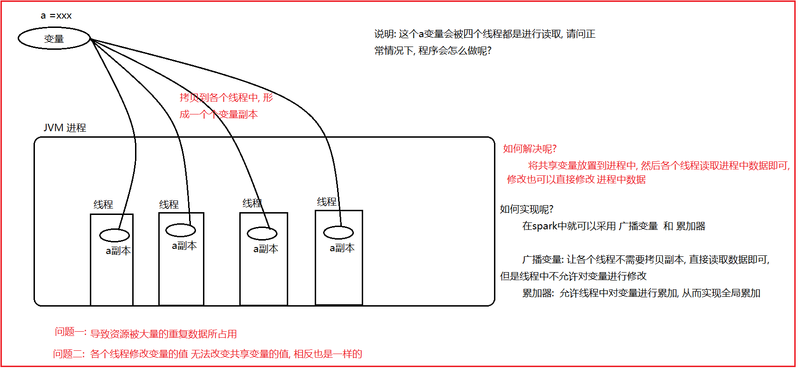
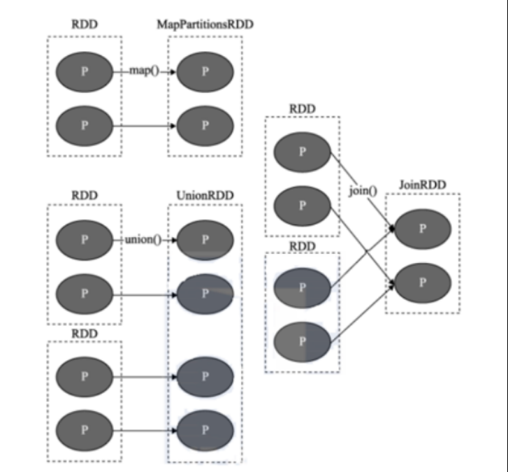
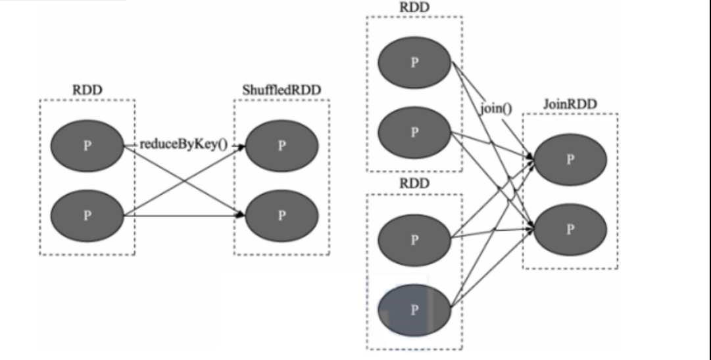
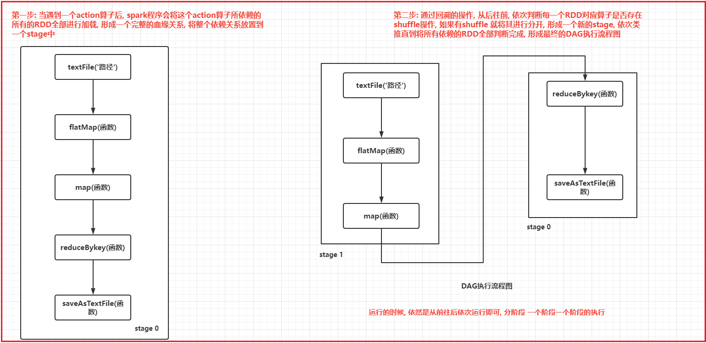
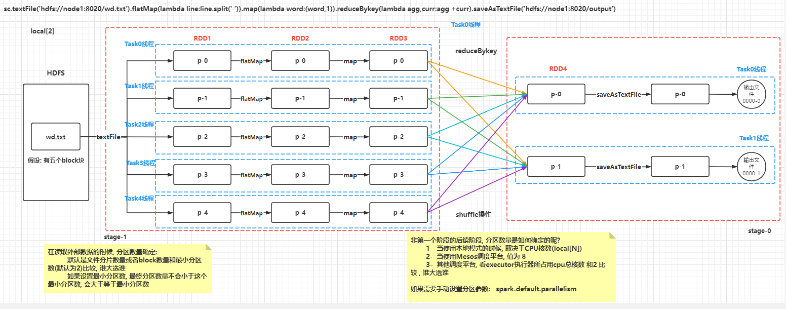

# day06 spark课程笔记

## 1. RDD的共享变量




### 1.1 广播变量

```properties
广播变量: 
	在Driver端定义一个共享的变量, 如果不使用广播变量, 各个Task在运行使用的时候, 都需要将这个变量拷贝各个Task中, 主要对网络传输, 以及内存的使用都是一种浪费, 
	如果使用广播变量, 会将变量在每个executor上放置一份, 各个Task直接读取executor上的变量即可, 不需要拉取到Task中, 这样减少拉取次数, 对网络传输以及内存都是减少了, 提升性能

广播变量是只读, 各个Task只能读取数据, 不能修改


相关的API:
	设置广播变量:  broad = sc.broadcast(变量信息)
	
	获取广播变量: broad.value (一般都是在RDD中获取即可)
```

代码

```properties
from pyspark import SparkContext, SparkConf
from pyspark.sql import SparkSession
import os

# 锁定远端操作环境, 避免存在多个版本环境的问题
os.environ['SPARK_HOME'] = '/export/server/spark'
os.environ["PYSPARK_PYTHON"] = "/root/anaconda3/bin/python"
os.environ["PYSPARK_DRIVER_PYTHON"] = "/root/anaconda3/bin/python"

# 快捷键:  main 回车
if __name__ == '__main__':
    print("演示广播变量")

    # 1- 创建SparkContext对象
    conf = SparkConf().setMaster('local[*]').setAppName('_04')
    sc = SparkContext(conf=conf)

    # 定义一个变量
    # num = 100
    broadcast = sc.broadcast(100) # 设置广播变量

    # 2- 初始化一份数据集
    rdd_init = sc.parallelize([1, 2, 3, 4, 5, 6, 7, 8, 9, 10])

    # 需求: 将数据集中每一个数据 都和 num进行累加处理, 将最终结果返回来
    # 3- 处理数据
    rdd_map = rdd_init.map(lambda code: code + broadcast.value) # 使用广播变量

    # 4- 打印结果
    print(rdd_map.collect())

    # 5- 关闭 sc对象
    sc.stop()

```

### 1.2 累加器

```properties
spark提供累加器, 可以用于实现全局累加计算操作, 比如全局计算共计操作了多少个数据, 可以使用累加器实现

累加器是有Driver负责设置初始值, 由Task进行累加操作, 最终在由Driver进行获取最终结果即可

Task只能进行累加, 无法获取值 


相关的API:
	第一步: 在Driver设置累加器初始值
		acc = sc.accumulator(初始值)
	第二步: 在Task中(RDD中): 执行 acc.add(累加值)
	
	第三步: acc.value 获取值即可 (不能在RDD中使用)
```

代码实现:

```properties
from pyspark import SparkContext, SparkConf
from pyspark.sql import SparkSession
import os

# 锁定远端操作环境, 避免存在多个版本环境的问题
os.environ['SPARK_HOME'] = '/export/server/spark'
os.environ["PYSPARK_PYTHON"] = "/root/anaconda3/bin/python"
os.environ["PYSPARK_DRIVER_PYTHON"] = "/root/anaconda3/bin/python"

# 快捷键:  main 回车
if __name__ == '__main__':
    print("累加器的基本使用")

    # 1- 创建SparkContext对象
    conf = SparkConf().setMaster('local[*]').setAppName('_04')
    sc = SparkContext(conf=conf)

    # 设置累加器
    acc = sc.accumulator(0)

    # 2- 读取外部的文件:
    rdd_init = sc.textFile('file:///export/data/workspace/ky03_pyspark_parent/_02_pyspark_core/data/a.txt')

    # 3- 对数据进行处理(WordCount案例)
    # 需求: 希望能够在进行WordCount案例统计的时候, 帮我一并统计一下, 共计处理了多少个单词
    rdd_flatMap = rdd_init.flatMap(lambda line:line.split(' '))

    def f1(word):
        acc.add(1)
        return (word,1)


    rdd_map = rdd_flatMap.map(f1)
    rdd_res= rdd_map.reduceByKey(lambda agg,curr:agg + curr)

    # 4- 打印结果
    print(rdd_res.collect())
    # print(rdd_flatMap.count()) # 导致整个程序多了一个action算子, 从而导致整个spark任务多了一个
    print(acc.value)
    # 5- 关闭sc
    sc.stop()
```

说明:

```properties
	累加器小问题: 如果后续多次调度action算子, 会导致累加器重复累加操作
	
	主要原因: 
		每一次调用action算子, 都会触发一个job任务的执行, 每一个job都要重新计算整个操作, 导致累加器重复累加操作
	
	解决方案: 
		在调用累加器后的RDD上, 对这个RDD设置缓存或者checkpoint 或者 两个都设置, 即可解决问题
```


## 2.RDD的内核调度

```properties
RDD 的内核调度主要任务:
1- 确定需要构建多少个分区(线程)
2- 如何构建DAG执行流程图
3- 如何划分stage阶段
4- 如何进行任务调度操作

目的:
	用最小资源 高效的完成整个计算任务
```

### 2.1 RDD的依赖

​	RDD依赖:  指的一个RDD的形成可能有一个或者多个RDD来得出的, 此时这个RDD和之前的RDD之间产生了依赖关系

​	在spark中, RDD之间的依赖关系, 主要有二种依赖关系:

* 窄依赖:

```properties
	目的: 为了实现并行计算操作
	指的: 一个RDD上的一个分区的数据, 只能完整的交付给下一个RDD的一个分区(完全继承),不能分隔
```



* 宽依赖:

```properties
	目的: 为了后续进行划分stage的依据
	指的: 上一个RDD的某一个分区的数据会被下一个RDD的多个分区进行接收, 中间必然存在shuffle操作(是否存在shuffle也是判定宽窄依赖的依据)
	
	注意: 一旦有了shuffle操作, 后续RDD的执行必须等待前序的shuffle执行完成后, 才能执行
```



说明:

```properties
	在spark中, 每一个算子是否会执行shuffle的操作, 其实spark在设计算子的时候, 就已经规划好了, 比如说 map算子就不会触发shuffle, 比如说reduceBykey一定会触发shuffle
	
	如果想知道这个算子会不会触发shuffle操作, 可以通过运行的时候, 查看 4040 webUI界面. 在界面中DAG执行流程图, 如果流程图被划分为多个stage阶段, 说明是存在shuffle操作, 如果只有一个阶段, 说明一定没有shuffle
	
	在实际使用中, 不需要纠结到底那个算子有shuffle, 那个算子没有shuffle, 以需求为目标, 虽然shuffle出现可能会影响效率, 但是依然以完成任务为标准, 该用哪个算子, 就用哪个算子即可, 不要过分纠结
```


### 2.2 DAG与stage

DAG:

```
	有向无环图, 主要描述一段流程, 从开始一直往后走, 不允许出现回调的操作
```

---

**如何形成DAG执行流程图呢?**

```properties
第一步: 当遇到一个action算子后, spark程序会将这个action算子所依赖的所有的RDD全部进行加载, 形成一个完整的血缘关系, 将整个依赖关系放置到一个stage中

第二步: 通过回溯的操作, 从后往前, 依次判断每一个RDD对应算子是否存在shuffle操作, 如果有shuffle 就将其进行分开, 形成一个新的stage, 依次类推直到将所有依赖的RDD全部判断完成, 形成最终的DAG执行流程图
```




细化剖析内部流程:




