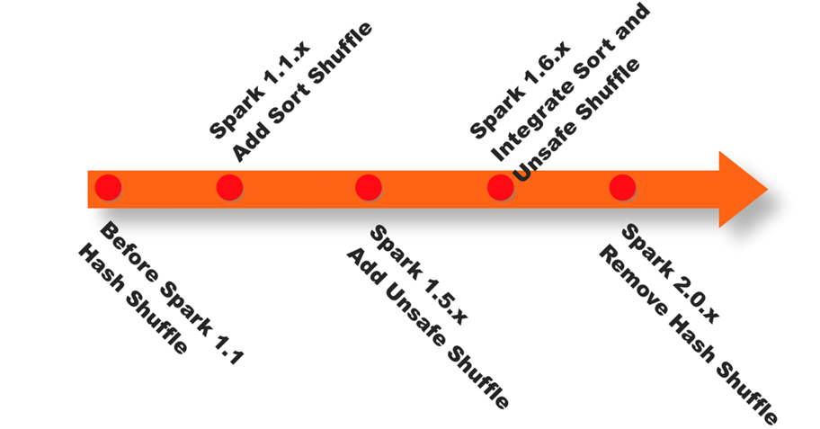

# day07_pyspark课程笔记

## 1.RDD的内核调度

```properties
RDD 的内核调度主要任务:
1- 确定需要构建多少个分区(线程)
2- 如何构建DAG执行流程图
3- 如何划分stage阶段
4- 如何进行任务调度操作

目的:
	用最小资源 高效的完成整个计算任务
```

### 1.1 RDD的依赖

​	RDD依赖:  指的一个RDD的形成可能有一个或者多个RDD来得出的, 此时这个RDD和之前的RDD之间产生了依赖关系

​	在spark中, RDD之间的依赖关系, 主要有二种依赖关系:

* 窄依赖:

```properties
	目的: 为了实现并行计算操作
	指的: 一个RDD上的一个分区的数据, 只能完整的交付给下一个RDD的一个分区(完全继承),不能分隔
```


* 宽依赖:

```properties
	目的: 为了后续进行划分stage的依据
	指的: 上一个RDD的某一个分区的数据会被下一个RDD的多个分区进行接收, 中间必然存在shuffle操作(是否存在shuffle也是判定宽窄依赖的依据)
	
	注意: 一旦有了shuffle操作, 后续RDD的执行必须等待前序的shuffle执行完成后, 才能执行
```


说明:

```properties
	 	 
	
	如果想知道这个算子会不会触发shuffle操作, 可以通过运行的时候, 查看 4040 webUI界面. 在界面中DAG执行流程图, 如果流程图被划分为多个stage阶段, 说明是存在shuffle操作, 如果只有一个阶段, 说明一定没有shuffle
	
	在实际使用中, 不需要纠结到底那个算子有shuffle, 那个算子没有shuffle, 以需求为目标, 虽然shuffle出现可能会影响效率, 但是依然以完成任务为标准, 该用哪个算子, 就用哪个算子即可, 不要过分纠结
```


### 1.2 DAG与stage

DAG:

```
	有向无环图, 主要描述一段流程, 从开始一直往后走, 不允许出现回调的操作
```

---

如何形成DAG执行流程图呢?

```properties
第一步: 当遇到一个action算子后, spark程序会将这个action算子所依赖的所有的RDD全部进行加载, 形成一个完整的血缘关系, 将整个依赖关系放置到一个stage中

第二步: 通过回溯的操作, 从后往前, 依次判断每一个RDD对应算子是否存在shuffle操作, 如果有shuffle 就将其进行分开, 形成一个新的stage, 依次类推直到将所有依赖的RDD全部判断完成, 形成最终的DAG执行流程图
```


细化剖析内部流程:


### 1.3 RDD的shuffle

shuffle经历阶段:  <font color='red'>Hash </font>-> <font color='red'>sort </font>-> <font color='orange'>钨丝计划(CPU,内存优化)</font> -> **<font color='red'>sort+钨丝(普通模式、bypass模式)</font>**；

```properties
1- 在1.1版本以前, shuffle主要采用 Hash shuffle 方案, 完成数据分发操作
2- 在1.1版本的时候, 引入sort shuffle方案, 本质对Hash shuffle优化操作,增加 合并,以及排序
3- 在1.5版本的时候, 引入钨丝计划, 提升cpu以及内存的效率(优化操作)
4- 在2.0版本的时候, spark将Hash shuffle方案删除了, 将整个方案全部移植到Sort shuffle中, 包括钨丝计划(1.6版本引入)整合到sort shuffle中
```



* 未优化前 Hash shuffle方案:


```properties
	早期版本中, 上一个stage中每一个Task都会输出与下一个stage相同分区数量的文件, 每一个文件对应着下一个stage中一个分区的数据

弊端: 
	一旦数据量比较大, 上一个stage中Task线程比较多的时候, 就会导致产生大量的小文件, 对磁盘 对后续读取数据操作, 都是非常的不方便, 增大IO 影响效率, 频繁打开文件和关闭文件操作
```

* 经过优化后HashShuffle操作:


```properties
	经过优化后Hash Shuffle, 增加了合并的操作, 原来是每个Task都会输出等量文件对应下游分区, 优化后, 形成一个文件组, 将一个执行器划定为一个组, 一个组只会形成与下游等量的文件数与之对象, 这样就可以降低分区文件数量, 降低磁盘IO, 减少打开文件的次数, 提升效率
```

* sortShuffle流程方案:


```properties
	整个完整的过程, 基本跟MR是非常的相似的

	都是先将数据写入到内存中, 然后当内存中数据达到阈值后, 开始进行溢写操作, 在溢写的时候, 对数据进行排序操作, 将排序好的数据写入到磁盘上(分批次), 形成一个个的小文件, 最后将多个小文件进行合并, 形成一个大的文件, 同时为了提升后续读取数据的效率, 每一个大的文件, 配置了一个索引文件, 方便后续进行读取数据
```


说明: <font color='orange'>sortShuffle在执行过程中, 主要有二种执行机制:</font>  **<font color='red'>普通模式</font>**  **<font color='red'>bypass模式</font>**

```properties
#1- 普通模式 : 内存-> 溢写排序-> 小文件 -> 大文件 -> 索引文件;
	先将数据写入到 内存 中, 然后当内存中数据达到阈值后, 开始进行溢写操作, 在溢写的时候, 对数据进行 排序 操作, 将排序好的数据写入到磁盘上(分批次), 形成一个个的 小文件 , 最后将多个小文件进行合并, 形成一个 大的文件 , 同时为了提升后续读取数据的效率, 每一个大的文件, 配置了一个 索引文件 , 方便后续进行读取数据
	

# 如果想使用bypass模式, 必须满足相关的条件: 
	条件一: 上游的Task分区数量不能超过200个
	条件二: 上游不能进行提前聚合操作
	
spark在运行的时候, 会判断, 是否走bypass, 如果条件不满足, 只会走普通模式, 不需要人为干预

# 2- bypass模式 : 没有排序过程 条件:1- 数据量小（分区小于200） ; 2- 不能提前聚合操作;
	在普通模式的基础上, 去除了排序操作, 直接将内存中数据写入到磁盘上
	
	因为byPass缺少了排序操作, bypass模式执行效率要高于普通模式, 前提是数据量不能太大了, 太大了, 对后续的聚合处理会有一定的影响
	
	排序的主要目的为了后续更好的更加有效率的进行分组聚合统计操作
```

### 1.4 JOB调度流程

* Driver内部的调度方案:

```properties
整个JOB调度流程, 都是发生在Driver中: DAGScheduler 和 TaskScheduler   SchedulerBackend(资源平台)

1- 当遇到action算子, 触发任务的执行, 此时就会产生一个Job任务, Driver程序首先会创建SparkContext对象, 在构建好这个对象的同时, 在底层也同时会创建两个新的对象:  DAGScheduler 和 TaskScheduler

2- DAGScheduler主要负责对整个任务形成DAG执行流程图, 并且进行stage划分操作, 并确定每一个stage中需要运行多少个线程(分区), 最后将每个stage中Task放置在一个TaskSet集合中, 统一提交给TaskScheduler

3- TaskScheduler接收到DAGScheduler提交过来的TaskSet线程信息后, 将这些线程提交给SchedulerBackend(资源平台)申请资源, 进行运行操作, 当确定每一个线程需要运行在那个executor后, 将Task任务发送给对应executor进行运行执行即可

4- Driver程序负责后续的任务的监听, 以及数据返回接收等....
```


### 1.5 spark的并行度

spark的并行度影响的因素:

* 资源因素: 指的运行**executor的数量** 和 **占用CPU以及内存的大小**
* 数据因素: 指的**Task的数量** 或者 **分区的数量**

```properties
目的:	希望在合适的资源上, 运行合适的数据

说明: 
	当资源比较多的时候, 而数据量比较少的时候, 导致资源的浪费,但是不会影响执行效率
	当资源量比较小的时候, 而数据量比较多的时候, 由于资源不足, 本应该可以并行运行的操作, 也被迫变成串行执行, 导致运行的效率降低了
	

实际运行中, 给出推荐方案: (初始化数据源需要划定多少的分区)
	每一个CPU核数上, 运行 2~3倍线程任务运行, 不推荐一个CPU运行一个线程操作(资源浪费)
```


```properties
说明:
	此值设置会在shuffle后生效, 设置的值越大, shuffle后分区的数量越多, 对应并行度越高, 但是也会导致最终结果文件数量越多
```


### 1.6 了解<font color='red'>combinerByKey</font>

combinerByKey是aggregateByKey底层实现, foldByKey底层实现是aggregateBykey, reduceBykey底层实现是foldByKey

**<font color='red'>reduceBykey >> foldByKey >> aggregateByKey >> combinerByKey</font>**

```properties
底层关系:
reduceBykey 
	foldByKey 
    	aggregateByKey 
    		combinerByKey
格式:
	combinerByKey(F1,F2,F3)
	
    f1: 进行初始化的函数
    f2: 对每个分区执行聚合操作
    f3: 将各个分区的聚合后结果再次汇总在一起
    
注意:
	参数2和参数3 相当于aggregateByKey中参数2和参数3
	参数1主要用于初始化的操作,以及类型转换的操作
```

案例:

```properties
from pyspark import SparkContext, SparkConf
from pyspark.sql import SparkSession
import os

# 锁定远端操作环境, 避免存在多个版本环境的问题
os.environ['SPARK_HOME'] = '/export/server/spark'
os.environ["PYSPARK_PYTHON"] = "/root/anaconda3/bin/python"
os.environ["PYSPARK_DRIVER_PYTHON"] = "/root/anaconda3/bin/python"

# 快捷键:  main 回车
if __name__ == '__main__':
    print("演示combinerByKey相关的操作:")

    # 1) 创建sparkContext对象
    conf = SparkConf().setMaster("local[3]").setAppName("combinerByKey_test")
    sc = SparkContext(conf=conf)

    # 2) 初始化数据集
    rdd_init = sc.parallelize(
        [('c01', 'A'), ('c02', 'B'), ('c01', 'C'), ('c01', 'D'), ('c03', 'E'), ('c02', 'F'), ('c03', 'G')], 3)

    # 需求:
    #   请按照 key进行分组, 将value汇总在一起得出结果为:
    #       [ ('c01',['A','C','D']),('c02',['B','F']), ('c03',['E','G']) ]
    # 3) 处理数据
    # print(rdd_init.groupByKey().collect())
    def f1(v):
        return [v]

    def f2(agg,curr):
        agg.append(curr)  # 将一个元素 添加到一个列表中
        return agg

    def f3(agg,curr):
        agg.extend(curr)  # 将一个列表和另一个列表合并在一起
        return agg

    rdd_res = rdd_init.combineByKey(f1,f2,f3)

    # 打印结果
    print(rdd_res.collect())

```


## 2. sparkSQL的基本概念

### 2.1 了解什么是spark SQL

sparkSQL 是spark提供一个模块, 主要是用于处理海量的**结构化的数据**

什么是结构化数据呢?

```
	每一行数据都具有相同列, 每一列都是固定的类型, 将这样的数据称为结构化的数据, 比如说 表数据 

例如:
1 张三 20
2 李四 38
3 王五 20
4 赵六 15
```

而spark core是可以处理任意结构的数据的


为什么要学习sparkSQL:

```properties
1- SQL易于上手(会SQL一定比会大数据的人多), 降低学习难度
2- 底层运行spark RDD, 执行效率比较高, 要优于使用MR或者hive
3- 提供多种使用方案: 可以将 代码 和 SQL混杂一起
4- 兼容HIVE, 可以直接和HIVE集成, 将HIVE执行引擎替换为 spark
5- 目前整个市场上, 主要是通过HIVE 整合spark, 通过编写spark SQL方式进行干活
```


spark SQL的特点:

```properties
1- 融合性:  
	在spark SQL中, 既可以书写 SQL语句 也可以直接编写DSL代码, 可以让两种进行混用, 提升书写便利性
	
2- 统一数据访问
	spark SQL提供一套统一的API 不管连接什么数据源, 只要是spark支持的, 都可以通过这一套API进行数据处理

3- HIVE兼容
	spark SQL可以和HIVE进行整合操作, 基于sparkSQL支持操作hive上表

4- 标准化的连接操作
	支持JDBC/ODBC连接协议, 可以方便的和各种数据源进行连接交互
```

### 2.2 spark SQL的发展史


### 2.3 spark SQL与 hive的异同

相同点:

```properties
1- 都是分布式SQL计算引擎
2- 都可以处理大规模的数据
3- 都可以提交运行在Yarn上
```

不同点:

```properties
1- spark SQL基于内存迭代计算, 而hive基于磁盘迭代计算
2- spark SQL可以让代码和SQL混合使用, 而hive只能使用SQL
3- spark SQL没有元数据管理服务,需要自己维护, 而hive提供metastore元数据服务
4- spark SQL 是基于 RDD计算, 而HIVE是基于 MR计算
```


### 2.4 spark SQL 的数据结构对比


```properties
pandas 的DF对象, 代表是二维表数据结构(结构化数据). 只能单机运行, 适合于处理小规模数据分析

Spark Core的RDD: 任何数据结构都是可以处理的, 分布式集合, 可以处理大规模数据, 但是 API相对复杂

spark Sql的DF对象:  代表是二维表数据结构(结构化数据) 可以分布式运行, 可以处理大规模的数据, 而且SQL和代码都是可以混用的


生产环境中:
	如果数据规模必须小, 比如只有几十兆 或者 几百兆  都是可以pandas直接解决的, 可以不使用大数据
	如果达到几个G 或者 几百G 或者多少TB, 必须使用大数据的方案来解决了
```


```properties
说明: 
	spark框架在2.0以后, spark SQL 只有一种数据类型: dataSet
		将dataFrame 和dataSet都合并在一起,叫做dataset
	
	但是dataSet存在泛型的, 而某些语言不支持泛型的, 所以spark为了能够兼容各种语言使用, 比如在python的spark的客户端中依然保留了DF操作, 但是最终到达spark中,还是把DF转换为dataSet的


说明:
	如果语言角度来看, 使用java或者scala来操作spark 要比python操作spark效率会更高一些, 这个效率从整体角度看, 几乎可以忽略
```


