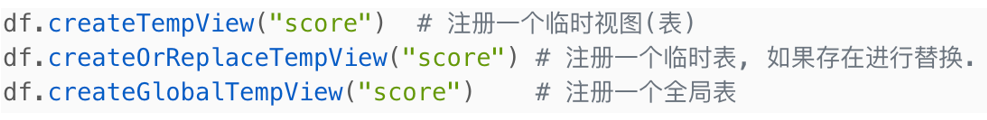
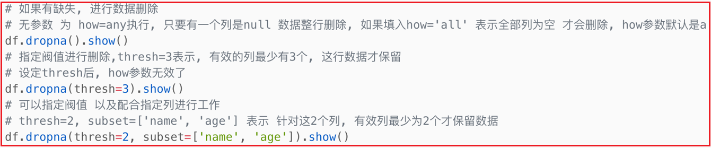

# day08_spark课程笔记

## 1. sparkSQL的基本概念

### 1.1 了解什么是spark SQL

sparkSQL 是spark提供一个模块, 主要是用于处理海量的**结构化的数据**

什么是结构化数据呢?

```properties
	每一行数据都具有相同列, 每一列都是固定的类型, 将这样的数据称为结构化的数据, 比如说 表数据 

例如:
1 张三 20
2 李四 38
3 王五 20
4 赵六 15
```

而spark core是可以处理任意结构的数据的


为什么要学习sparkSQL:

```properties
1- SQL易于上手(会SQL一定比会大数据的人多), 降低学习难度
2- 底层运行spark RDD, 执行效率比较高, 要优于使用MR或者hive
3- 提供多种使用方案: 可以将 代码 和 SQL混杂一起
4- 兼容HIVE, 可以直接和HIVE集成, 将HIVE执行引擎替换为 spark
5- 目前整个市场上, 主要是通过HIVE 整合spark, 通过编写spark SQL方式进行干活
```


spark SQL的特点:

```properties
1- 融合性:  
	在spark SQL中, 既可以书写 SQL语句 也可以直接编写DSL代码, 可以让两种进行混用, 提升书写便利性
	
2- 统一数据访问
	spark SQL提供一套统一的API 不管连接什么数据源, 只要是spark支持的, 都可以通过这一套API进行数据处理

3- HIVE兼容
	spark SQL可以和HIVE进行整合操作, 基于sparkSQL支持操作hive上表

4- 标准化的连接操作
	支持JDBC/ODBC连接协议, 可以方便的和各种数据源进行连接交互
```

### 1.2 spark SQL的发展史


### 1.3 spark SQL与 hive的异同

相同点:

```properties
1- 都是分布式SQL计算引擎
2- 都可以处理大规模的数据
3- 都可以提交运行在Yarn上
```

不同点:

```properties
1- spark SQL基于内存迭代计算, 而hive基于磁盘迭代计算
2- spark SQL可以让代码和SQL混合使用, 而hive只能使用SQL
3- spark SQL没有元数据管理服务,需要自己维护, 而hive提供metastore元数据服务
4- spark SQL 是基于 RDD计算, 而HIVE是基于 MR计算
```


### 1.4 spark SQL 的数据结构对比


```properties
pandas 的DF对象, 代表是二维表数据结构(结构化数据). 只能单机运行, 适合于处理小规模数据分析

Spark Core的RDD: 任何数据结构都是可以处理的, 分布式集合, 可以处理大规模数据, 但是 API相对复杂

spark Sql的DF对象:  代表是二维表数据结构(结构化数据) 可以分布式运行, 可以处理大规模的数据, 而且SQL和代码都是可以混用的


生产环境中:
	如果数据规模必须小, 比如只有几十兆 或者 几百兆  都是可以pandas直接解决的, 可以不使用大数据
	如果达到几个G 或者 几百G 或者多少TB, 必须使用大数据的方案来解决了
```


```properties
说明: 
	spark框架在2.0以后, spark SQL 只有一种数据类型: dataSet
		将dataFrame 和dataSet都合并在一起,叫做dataset
	
	但是dataSet存在泛型的, 而某些语言不支持泛型的, 所以spark为了能够兼容各种语言使用, 比如在python的spark的客户端中依然保留了DF操作, 但是最终到达spark中,还是把DF转换为dataSet的


说明:
	如果语言角度来看, 使用java或者scala来操作spark 要比python操作spark效率会更高一些, 这个效率从整体角度看, 几乎可以忽略
```


## 2. spark SQL的入门案例

### 2.1 spark SQL的统一入口 <font color='red'>SparkSession</font>

​			从spark SQL开始, 编码的入口要从sparkContext对象切换为SparkSession对象, 同时此对象依然可以帮助获取sparkContext对象.

​			因为SparkSession是sparkSQL专门提供一个针对spark编码的入口类, 支持SQL编码的, 而sparkContext仅支持sparkCore


如何构建SparkSession对象呢?

```properties
from pyspark import SparkContext, SparkConf
from pyspark.sql import SparkSession
import os

# 锁定远端操作环境, 避免存在多个版本环境的问题
os.environ['SPARK_HOME'] = '/export/server/spark'
os.environ["PYSPARK_PYTHON"] = "/root/anaconda3/bin/python"
os.environ["PYSPARK_DRIVER_PYTHON"] = "/root/anaconda3/bin/python"

# 快捷键:  main 回车
if __name__ == '__main__':
    print("spark session对象的创建")

    # 1- 创建SparkSession对象:
    # SparkSession.builder : 表示获取SparkSession的构建器对象
    # .master('local[*]').appName('_01_init') 用于向构建器设置相关的配置操作
    # .getOrCreate() : 从构建器中获取或者创建SparkSession
    # 在使用SparkSession的时候, 需要在代码的前面导入对应库:   from pyspark.sql import SparkSession
    spark = SparkSession.builder.master('local[*]').appName('_01_init').getOrCreate()
    
    # 2- 如何获取之前的SparkContext对象呢?
    sc = spark.sparkContext
    
    
    # 3- 释放资源:
    spark.stop()
    sc.stop()
```


### 2.2 spark SQL的入门案例

* 1- 在spark SQL的项目的data目录下, 创建stu.txt文件, 并添加一下内容:

```properties
s01 张三 25 北京
s02 李四 30 上海
s03 王五 28 广州
s04 赵六 27 北京
s05 田七 23 武汉
```

* 2- 编写spark SQL的代码完成需求:

  需求: 查询来自于北京的用户有那些

```properties
from pyspark import SparkContext, SparkConf
from pyspark.sql import SparkSession
import os

# 锁定远端操作环境, 避免存在多个版本环境的问题
os.environ['SPARK_HOME'] = '/export/server/spark'
os.environ["PYSPARK_PYTHON"] = "/root/anaconda3/bin/python"
os.environ["PYSPARK_DRIVER_PYTHON"] = "/root/anaconda3/bin/python"

# 快捷键:  main 回车
if __name__ == '__main__':
    print("spark SQL的入门代码: ")

    # 1- 创建SparkSession对象:
    spark = SparkSession.builder.master('local[*]').appName('_02_init').getOrCreate()

    # 2- 读取外部文件数据
    df = spark.read.csv(
        path='file:///export/data/workspace/ky03_pyspark_parent/_03_pyspark_sql/data/stu.txt',sep=' ')

    # 3- 处理数据
    # 3.1 设置数据中各个字段的名字:
    df1 = df.toDF('id','name','age','address')

    # 3.2  查询来自于北京地区的用户:
    #3.2.1 方式一:  通过 spark SQL的 API(DSL)形式
    res_df = df1.where("address='北京'")
    # 打印结果
    res_df.show()

    print('---------------------------')
    # 3.2.2 方式二: 通过 SQL方式:
    # 3.2.2.1 设置数据的表名
    df1.createTempView('stu')

    # 3.2.2.2 编写SQL 实现操作:
    spark.sql("select *  from stu where address='北京'").show()
    
    
    # 4- 关闭spark
    spark.stop()
```


## 3. dataFrame详解

### 3.1 dataFrame基本介绍

​		dataFrame表示的是一个二维的表, 一个的二维表主要有: 行 列  表结构信息(字段名, 类型)

```properties
在dataFrame中是如何描述这些信息呢? 
	结构中:
		structType:  用于定义整个表的结构信息
		structField: 用于定义列信息(列名, 列的数据类型, 列是否可以为空)
		一般一个structType对象中包含了多个structField
	
	数据中: 
		ROW对象:  表示一行数据
		column对象: 表示一列数据
```


### 3.2 dataFrame的构建方式

#### 3.2.1 方式一：RDD->DataFrame

* 方式一: 将RDD对象转换为dataFrame对象:
  * spark.createDataFrame(rdd,schema)
  * rdd.toDF(schema)

```properties
from pyspark import SparkContext, SparkConf
from pyspark.sql import SparkSession
from pyspark.sql.types import StructType, StringType,IntegerType
import os

# 锁定远端操作环境, 避免存在多个版本环境的问题
os.environ['SPARK_HOME'] = '/export/server/spark'
os.environ["PYSPARK_PYTHON"] = "/root/anaconda3/bin/python"
os.environ["PYSPARK_DRIVER_PYTHON"] = "/root/anaconda3/bin/python"

# 快捷键:  main 回车
if __name__ == '__main__':
    print("方式一: 通过RDD转换得到一个dataFrame对象")

    # 1- 创建SparkSession对象:
    spark = SparkSession.builder.master('local[*]').appName('_03').getOrCreate()

    # 2) 通过 spark获取SparkContext对象
    sc = spark.sparkContext

    # 3) 基于sparkContext 获取一个RDD对象, 并对数据进行相关处理
    rdd_init = sc.parallelize([('张三',20),('李四',25),('王五',28),('赵六',30),('田七',23)])

    #  通过RDD过滤掉年龄小于23的数据:
    rdd_filter = rdd_init.filter(lambda tup: tup[1] >= 23 )

    # 4- 如何将 rdd对象 转换为 dataFrame对象呢?
    # 4.1 设置表结构信息:
    schema = StructType().add('name',StringType(),False).add('age',IntegerType(),False)

	# 方法一: spark.createDataFrame(rdd,schema)
    # df = spark.createDataFrame(data=rdd_filter,schema=schema)
    # df = spark.createDataFrame(data=rdd_filter, schema=['name','age'])  # 此时 DF会自动推断类型
    
    # 方法二: rdd.toDF(schema)
    # df = rdd_filter.toDF(schema=schema)
    df = rdd_filter.toDF(schema=['name','age'])
    # 5 基于DF执行操作:
    df.printSchema() # 打印结构信息
    df.show() # 显示数据
```

​		rdd转换为DF操作在后续有时候可能读取的数据半结构化的数据, 或者存在结构不完整的数据, 首先可以使用sparkCore来通过RDD算子完成数据清洗转换处理的操作, 将处理后的干净的结构化的数据转换为DF, 然后通过SQL来进行处理


---

#### 3.2.2 方式二: pandas DF -> DataFrame

将pandas的DF的对象 转换为spark的dataFrame对象呢? 

```properties
import pandas as pd
from pyspark import SparkContext, SparkConf
from pyspark.sql import SparkSession
import os

# 锁定远端操作环境, 避免存在多个版本环境的问题
os.environ['SPARK_HOME'] = '/export/server/spark'
os.environ["PYSPARK_PYTHON"] = "/root/anaconda3/bin/python"
os.environ["PYSPARK_DRIVER_PYTHON"] = "/root/anaconda3/bin/python"

# 快捷键:  main 回车
if __name__ == '__main__':
    print("演示: 如何将pandas的DF对象 转换为 spark SQL的 DF对象")

    # 1) 构建SparkSession对象:
    spark = SparkSession.builder.master('local[*]').appName('_04').getOrCreate()

    # 2) 创建一个pandas的DF对象:
    pd_df = pd.DataFrame({'id':[1,2,3],'name':['张三','李四','王五'],'address':['北京','上海','深圳']})

    # 3) 如何将pandas的DF转换为 spark DF对象呢?
    df = spark.createDataFrame(data=pd_df)
    
    # 4) 打印结构信息和数据
    df.printSchema()
    df.show()
```


----

#### 3.2.3 read外部数据源

通过读取外部数据源的方式, 直接得到一个DF对象:


* 通过text方式来读取一个普通文件数据
  * **<font color='red'>注意</font>**: 通过**<font color='red'>text方式</font>**读取文件, <font color='orange'>仅支持一列数据</font>, <font color='orange'>其中文件中每一行数据 反应在表中 一行一列的数据</font>
  * 默认列名为 value  如果想修改列名 可以定义schema信息

```properties
from pyspark import SparkContext, SparkConf
from pyspark.sql import SparkSession
import os

# 锁定远端操作环境, 避免存在多个版本环境的问题
from pyspark.sql.types import StructType, StringType, IntegerType

os.environ['SPARK_HOME'] = '/export/server/spark'
os.environ["PYSPARK_PYTHON"] = "/root/anaconda3/bin/python"
os.environ["PYSPARK_DRIVER_PYTHON"] = "/root/anaconda3/bin/python"

# 快捷键:  main 回车
if __name__ == '__main__':
    print("通过外部文件来获取DF对象: text方式")

    # 1- 创建SparkSession对象:
    spark = SparkSession.builder.master('local[*]').appName('_05').getOrCreate()

    # 2- 读取外部数据集: text方式
    schema = StructType().add('ccc', StringType(), False)

    df = spark\
        .read\
        .format('text')\
        .schema(schema=schema)\
        .load(path='file:///export/data/workspace/ky03_pyspark_parent/_03_pyspark_sql/data/stu.txt')


    # 3- 处理数据
    df.printSchema()
    df.show()

    # 4- 释放资源
    spark.stop()
    
结果:
root
 |-- ccc: string (nullable = true)

+----------------+
|             ccc|
+----------------+
|s01 张三 25 北京|
|s02 李四 30 上海|
|s03 王五 28 广州|
|s04 赵六 27 北京|
|s05 田七 23 武汉|
+----------------+

```

* 通过 CSV 方案, 读取外部文件数据

  * 默认:
    * 1- 默认会通过**<font color='red'>逗号</font>**对文件数据进行切割操作, 形成多列的数据
    * 2- 默认数据的类型都是**<font color='red'>String</font>**

  * 常用可选的选项:
    * sep:  设置分隔符号, 默认为逗号
    * header: 设置是否包含头信息, 默认为Flase , 如果为True 将数据第一行作为表字段的名字
    * inferSchema: 可以用于自动识别每个字段的数据类型, 默认值为Flase (如果推断不满意, 依然可以通过schema自定义类型)

```properties
from pyspark import SparkContext, SparkConf
from pyspark.sql import SparkSession
import os

# 锁定远端操作环境, 避免存在多个版本环境的问题
os.environ['SPARK_HOME'] = '/export/server/spark'
os.environ["PYSPARK_PYTHON"] = "/root/anaconda3/bin/python"
os.environ["PYSPARK_DRIVER_PYTHON"] = "/root/anaconda3/bin/python"

# 快捷键:  main 回车
if __name__ == '__main__':
    print("演示通过 CSV方式来读取外部文件, 得到一个DF对象")

    # 1- 创建SparkSession对象:
    spark = SparkSession.builder.master('local[*]').appName('_05').getOrCreate()

    # 2) 读取外部数据
    # .schema('id string,name string,age int,address string')

    df = spark\
        .read\
        .format('csv') \
        .option('sep', '|') \
        .option('header', True) \
        .option('inferSchema', True) \
        .schema(schema='id string,name string,age long,address string') \
        .load('file:///export/data/workspace/ky03_pyspark_parent/_03_pyspark_sql/data/stu2.txt')

    # 3) 处理数据
    df.printSchema()
    df.show()
    # 4) 释放资源
    spark.stop()
```

*  通过JSON方式来读取数据操作:

```
{'id':'s01','name': '张三'}
{'id':'s02','name': '李四'}
{'id':'s03','name': '王五'}
{'id':'s04','name': '赵六'}
```


```properties
from pyspark import SparkContext, SparkConf
from pyspark.sql import SparkSession
import os

# 锁定远端操作环境, 避免存在多个版本环境的问题
os.environ['SPARK_HOME'] = '/export/server/spark'
os.environ["PYSPARK_PYTHON"] = "/root/anaconda3/bin/python"
os.environ["PYSPARK_DRIVER_PYTHON"] = "/root/anaconda3/bin/python"

# 快捷键:  main 回车
if __name__ == '__main__':
    print("演示通过 JSON方式来读取外部文件, 得到一个DF对象")

    # 1- 创建SparkSession对象:
    spark = SparkSession.builder.master('local[*]').appName('_05').getOrCreate()

    # 2) 读取外部数据
    df = spark\
        .read\
        .format('json')\
        .load('file:///export/data/workspace/ky03_pyspark_parent/_03_pyspark_sql/data/stu.json')


    # 3) 处理数据
    df.printSchema()
    df.show()
    # 4) 释放资源
    spark.stop()
```

目前, 大致给演示text, csv 和 json的方式, 其实spark还支持很多其他的方式: orc  parquet 以及JDBC ...


所有的读取方式都是有简单的写法的:

```properties
	spark.read.text()
	spark.read.csv()
	spark.read.json()
	
例如:
	 df = spark.read.json(path='file:///export/data/workspace/ky03_pyspark_parent/_03_pyspark_sql/data/stu.json')

	df = spark.read.csv(
        path='file:///export/data/workspace/ky03_pyspark_parent/_03_pyspark_sql/data/stu2.txt',
        sep='|',
        header=True,
        inferSchema=True,
        encoding='utf-8'
    )
```


### 3.3 dataFrame的相关API

​		在DF中, 主要支持两种编码的方式: **<font color='red'>DSL 和 SQL</font>**

```properties
DSL: 特定领域语言
	在当前指的就是DF的相关API, 而且DF所提供的这些API基本都是SQL的关键词
	
SQL:  
	直接通过SQL的方式操作DF中数据
	

注意: 
	在生产环境中, 大多数使用的也是SQL的方式, 因为比较简单 大家都比较熟悉  而DSL编写格式琢磨不透,支持好多种不同的格式, 花样比较多, 导致很多程序员不愿意使用
	但是官方建议多使用DSL操作,  觉得DSL比较好处理, 不需要再次解析, 而SQL, 需要解释(解析)
```

DSL相关的API:

* show(参数1, 参数2):

  

  * 一般都是直接show() 不需要做什么设置

* printSchema(): 打印DF的表结构信息(字段信息, 数据类型, 是否允许为空) , 类似于 desc 表

* select() : 此API主要是用于设置 select之后和from之前的内容的语句

  * 作用: 用于选择DF中指定列, 以及在select后编写聚合函数操作...

```properties
注意: 
	在使用DSL的API的时候, 有些API需要传递相关参数信息, 而这个参数信息一般支持三种传递方式: 
		第一种: 直接传递字符串
			比如: df.select('id','name')
		
		第二种:  传递 column对象
			比如: df.select(df['id'],df['name'])
		
		第三种:  传递列表, 在列表中可以放置字符串 或者也可以放置column
			比如:  
				df.select(['id','name'])
				df.select([df['id'],df['name']])
	
	这些传递方式, 有些API支持其中一种方式, 有些API支持两种, 有些三种都支持, 如何判断支持那些方式呢? 
		传递的时候, 需要点进去, 查看一下支持传递的方案
```


* filter() 和 where() :  对DF的数据进行过滤操作
* groupBy() 用于为指定的列进行分组操作, 分组后可以调度一些聚合函数, 完成聚合统计
  * 注意: 分组必聚合


如果在DSL中使用SQL的函数, 必须导入一个函数包: pyspark.sql.functions

```properties
import pyspark.sql.functions as F
```

----

SQL的风格: 



```properties
注意:
	如果要使用SQL的风格, 必须要先将我们的DF注册为一个表才可以使用
	
	临时视图, 仅能在当前的sparkSession会话中使用, 如果需要跨越多个会话, 需要注册为一个全局表, 在使用全局表的时候必须加上:  global_temp.表名
	

此操作, 在后续 可以直接通过SQL的方式构建临时的视图 和永久的视图: 
	create   view 视图 ... 
```

​		操作的API:  spark.sql('编写SQL语句')


----

关于一些数据清洗的API: 

* dropDuplicates

  * 功能: 对DF的数据进行去重操作, 如果重复数据有多条, 取第一条, 其他都删除

  

* dropna: 

  * 功能:  如果数据中包含NULL 通过dropna来进行判断, 符号条件就删除这一行数据

  

* fillna:

  * 功能:  根据参数的规则, 来进行NULL值的替换操作

  

  

### 3.4 综合案例

#### 3.4.1 词频统计分析案例

方式一: 基于RDD转换为DF的形式来实现WordCount

```properties
from pyspark import SparkContext, SparkConf
from pyspark.sql import SparkSession
from pyspark.sql.types import  StructType,StringType
import os

# 锁定远端操作环境, 避免存在多个版本环境的问题
os.environ['SPARK_HOME'] = '/export/server/spark'
os.environ["PYSPARK_PYTHON"] = "/root/anaconda3/bin/python"
os.environ["PYSPARK_DRIVER_PYTHON"] = "/root/anaconda3/bin/python"

# 快捷键:  main 回车
if __name__ == '__main__':
    print("综合案例: WordCount案例")

    # 1- 创建SparkSession对象:
    spark = SparkSession.builder.master('local[*]').appName('wd_01').getOrCreate()

    # 2- 读取外部的word.txt文件:
    # 方式一: 尝试使用RDD转换为DF的方式来处理, 使用RDD, 将单词转换为一列
    sc = spark.sparkContext
    rdd_init = sc.textFile('file:///export/data/workspace/ky03_pyspark_parent/_03_pyspark_sql/data/word.txt')

    rdd_map = rdd_init.flatMap(lambda line:line.split(' ')).map(lambda word:(word,))

    #print(rdd_map.collect())
    # 将RDD转换为DF对象
    #schema = StructType().add('words',StringType(),False)
    #df = spark.createDataFrame(data=rdd_map,schema=schema)
    df = rdd_map.toDF(schema=['words'])

    #DSL形式:  对单词进行分组操作, 然后进行统计即可:
    df.groupby(df['words']).count().show()

    # SQL方式:
    df.createTempView('wd_tab')
    spark.sql('select  words,count(1) from wd_tab group by words').show()
```

方式二: 直接通过sparkSession读取文件, 然后处理呢? SQL实现

```properties
from pyspark import SparkContext, SparkConf
from pyspark.sql import SparkSession
from pyspark.sql.types import  StructType,StringType
import os

# 锁定远端操作环境, 避免存在多个版本环境的问题
os.environ['SPARK_HOME'] = '/export/server/spark'
os.environ["PYSPARK_PYTHON"] = "/root/anaconda3/bin/python"
os.environ["PYSPARK_DRIVER_PYTHON"] = "/root/anaconda3/bin/python"

# 快捷键:  main 回车
if __name__ == '__main__':
    print("综合案例: WordCount案例")

    # 1- 创建SparkSession对象:
    spark = SparkSession.builder.master('local[*]').appName('wd_01').getOrCreate()

    # 2- 读取外部的word.txt文件:
    df = spark\
        .read\
        .text(paths='file:///export/data/workspace/ky03_pyspark_parent/_03_pyspark_sql/data/word.txt')

    # 3- 处理数据: 完成WordCount统计
    # 演示 SQL形式
    df.createTempView('word_tab')
    df_explode = spark.sql("select  explode(split(value,' ')) as words from word_tab")

    df_explode.createTempView('wd_tab')
    spark.sql('select words,count(1) from wd_tab group by words').show()

    # 是否可以通过一条SQL语句实现呢?
    spark.sql("""select 
                    words,
                    count(1) 
                  from (select  explode(split(value,' ')) as words from word_tab) as wd_tab 
                  group by words""").show()

    # 思考 还有其他的方案吗?
    spark.sql("select words,count(1) from word_tab lateral view explode(split(value,' ')) t1 as words group by words").show()

    
```

采用DSL + SQL 混用 以及 纯粹的DSL的方案:

```properties
from pyspark import SparkContext, SparkConf
from pyspark.sql import SparkSession
from pyspark.sql.types import  StructType,StringType
import pyspark.sql.functions as F
import os

# 锁定远端操作环境, 避免存在多个版本环境的问题
os.environ['SPARK_HOME'] = '/export/server/spark'
os.environ["PYSPARK_PYTHON"] = "/root/anaconda3/bin/python"
os.environ["PYSPARK_DRIVER_PYTHON"] = "/root/anaconda3/bin/python"

# 快捷键:  main 回车
if __name__ == '__main__':
    print("综合案例: WordCount案例")

    # 1- 创建SparkSession对象:
    spark = SparkSession.builder.master('local[*]').appName('wd_01').getOrCreate()

    # 2- 读取外部的word.txt文件:
    df = spark\
        .read\
        .text(paths='file:///export/data/workspace/ky03_pyspark_parent/_03_pyspark_sql/data/word.txt')

    # 3- 处理数据: 完成WordCount统计
    # 演示 SQL + DSL 混用形式
    df.createTempView('word_tab')
    df_explode = spark.sql("select  explode(split(value,' ')) as words from word_tab")
    df_explode.groupby(df_explode['words']).count().show()

    # 演示 DSL 使用:
    df.select(
        F.explode(F.split(df['value'],' ')).alias('words')
    ).groupby(F.col('words') 或者 'words').count().show()


```


#### 3.4.2 电影分析案例

数据集介绍:


```properties
userId(String)	movieId(int)	rating(int)	timestamp(string)

数据中, 字段与字段之间的分隔符号为 \t
```

数据集放置的位置: 


需求说明:


进行代码操作: 

* 1- 将数据集放置到spark SQL项目的data目录下
* 2- 完成需求一: 查询用户的平均分:

```properties
from pyspark import SparkContext, SparkConf
from pyspark.sql import SparkSession
from pyspark.sql.types import *
import pyspark.sql.functions as F
import os

# 锁定远端操作环境, 避免存在多个版本环境的问题
os.environ['SPARK_HOME'] = '/export/server/spark'
os.environ["PYSPARK_PYTHON"] = "/root/anaconda3/bin/python"
os.environ["PYSPARK_DRIVER_PYTHON"] = "/root/anaconda3/bin/python"

# 快捷键:  main 回车
if __name__ == '__main__':
    print("计算电影评分相关需求")

    # 1- 创建SparkSession对象:
    spark = SparkSession.builder.master('local[*]').appName('movie_demo').getOrCreate()

    # 2- 读取外部数据:
    # userId(String)	movieId(int)	rating(int)	timestamp(string)
    schema = StructType()\
        .add('userId',StringType())\
        .add('movieId',IntegerType())\
        .add('rating',IntegerType())\
        .add('timestamp',StringType())

    df = spark\
        .read\
        .format('csv')\
        .option('sep','\t')\
        .schema(schema=schema)\
        .load('file:///export/data/workspace/ky03_pyspark_parent/_03_pyspark_sql/data/u.data')

    # 3- 处理数据
    # 需求一: 查询用户的平均分: 统计每个用户的评分的平均分是多少
    # SQL方式实现:
    df.createTempView('movie_tab')
    spark.sql('select userId,round(avg(rating),2) as avg_cnt from movie_tab group by userId').show()

    # DSL方式实现:
    # withColumn 可以用于给DF新增列的操作 如果列已经存在, 直接将原有列覆盖掉
    df\
        .groupby(df['userId'])\
        .avg('rating')\
        .withColumnRenamed('avg(rating)','avg_cnt')\
        .withColumn('avg_cnt',F.round('avg_cnt',2))\
        .show()

    df \
        .groupby(df['userId']) \
        .avg('rating') \
        .select('userId',F.round('avg(rating)',2).alias('avg_cnt'))\
        .show()

    # agg:  是提供进行聚合的函数,  在此函数中, 可以定义多个聚合方案
    # select  sum(),avg() from xx  group by xx;
    df \
        .groupby(df['userId']) \
        .agg(
            F.round(F.avg('rating'),2).alias('avg_cnt'),
            F.sum('rating').alias('sum_cnt')
        )\
        .show()

    # 4- 释放资源
    spark.stop()
```

* 需求四:  查询高分电影中(>3)打分次数最多的用户, 并求出此人打的平均分:

```properties
# 需求四: 查询高分电影中(>3分)打分次数最多的用户, 并求出此人打的平均分:
    # SQL方式:
    #  求出大于三分的高分电影有那些?
    df_topMovie = spark.sql("""
        select  
            movieId 
        from  movie_tab  
        group by movieId having round(avg(rating),2) > 3
    """)
    df_topMovie.createTempView('topMovie_tab')
    # 求这些高分电影中, 每个用户打了多少次分 , 并获取最高的用户
    df_topUser = spark.sql("""
        select
            t1.userId
        from movie_tab t1 join topMovie_tab t2 on t1.movieId = t2.movieId
        group by  t1.userId order by  count(1)  desc limit 1
    
    """)

    df_topUser.createTempView('topUser_tab')
    # 求这个最高用户的平均分:
    spark.sql("""
        select 
            round(avg(movie_tab.rating),2) as avg_cnt
        from movie_tab join topUser_tab on movie_tab.userId = topUser_tab.userId
    
    """).show()
    # 或者
    spark.sql("""
           select 
               round(avg(rating),2) as avg_cnt
           from movie_tab where userId = (select
                    t1.userId
                from movie_tab t1 join topMovie_tab t2 on t1.movieId = t2.movieId
                group by  t1.userId order by  count(1)  desc limit 1)

       """).show()

    # DSL方式实现:
    # 计算高分电影
    df_topMovie = df.groupby(df['movieId']).agg(
       F.round( F.avg('rating'),2).alias('avg_m_cnt')
    ).where('avg_m_cnt>3').select('movieId')

    # 从所有数据中, 将高分电影数据筛选出来, 求各个用户打分的次数, 找到最高打分次数用户
    df_topUser = df\
        .join(df_topMovie,df['movieId'] == df_topMovie['movieId'] )\
        .groupby(df['userId'])\
        .count()\
        .orderBy('count',ascending=False)\
        .limit(1)\
        .select('userId')

    #  求最高用户的打分平均分
    df.join(df_topUser,'userId').agg(
        F.round(F.avg('rating'),2).alias('avg_cnt')
    ).show()

    df.where(df['userId'] == df_topUser.first()['userId']).agg(
        F.round(F.avg('rating'), 2).alias('avg_cnt')
    ).show()
```


后续的需求, 作为作业, 大家可以自己尝试编写: 

### 3.4 spark SQL的shuffle分区设置

​		在默认情况表, spark SQL程序在运行的时候, 需要将SQL翻译为RDD, 将RDD提交到集群中运行, 生成DAG 划分stage, 然后执行运行

​		在执行过程中, 中间可能会产生shuffle操作, 默认情况下, sparkSQL的shuffle的分区数量为200个, 但是有时候完全不需要这么多的分区, 或者有时候可能需要比默认值的分区数更多, 这个时候就需要调整分区的数量


如何调整分区的数量呢?

```properties
	方式一: 全局配置(全局有效, 如果不设置, 采用此设置值的默认值, 默认值为200)  -- 一般不推荐
		修改 spark-defaults.conf 配置文件:  
			spark.sql.shuffle.partitions N
	
	方式二: 在提交spark程序到集群运行的时候, 可以进行设置shuffle分区  -- 推荐
		./spark-submit --conf "spark.sql.shuffle.partitions=N"
		
	方式三:  直接在sparkSession对象中进行设置, 设置后, 只对当前会话有效  -- 推荐
		sparkSession.builder.config("spark.sql.shuffle.partitions",N)
		
		
	方式二和方式三都可以使用, 如果代码中忘记设置了, 也可以在提交任务的时候, 进行设置, 如果代码中设置了, 优先会现在代码中(方式三)设置
	
	建议:
		测试中, 不需要提交 可以使用方式三, 在上线的时候, 建议删除, 使用方式二来处理
```


### 3.5 spark SQL的数据写出操作:

统一的写出API:


* 完成基础类型的数据写出操作

```properties
from pyspark import SparkContext, SparkConf
from pyspark.sql import SparkSession
import time
import os

# 锁定远端操作环境, 避免存在多个版本环境的问题
os.environ['SPARK_HOME'] = '/export/server/spark'
os.environ["PYSPARK_PYTHON"] = "/root/anaconda3/bin/python"
os.environ["PYSPARK_DRIVER_PYTHON"] = "/root/anaconda3/bin/python"

# 快捷键:  main 回车
if __name__ == '__main__':
    print("演示数据写出操作: ")

    # 1- 创建SparkSession对象:
    spark = SparkSession.builder.master('local[*]').appName('writer_01').getOrCreate()

    # 2- 读取数据:
    df = spark.read\
        .format('csv')\
        .option('sep',' ')\
        .schema(schema='id string,name string,age int,address string')\
        .load('file:///export/data/workspace/ky03_pyspark_parent/_03_pyspark_sql/data/stu.txt')


    # 3- 处理数据:  过滤出北京地区用户
    df_where = df.where(df['address'] == '北京')


    # 4- 将结果写出到HDFS上:
    df_where.write\
        .mode('overwrite')\
        .format('csv')\
        .option('sep','|')\
        .option('header',True)\
        .save(path='hdfs://node1:8020/spark_sql/output1')

    df_where.write \
        .mode('overwrite') \
        .format('json') \
        .save(path='hdfs://node1:8020/spark_sql/output2')

    #time.sleep(10000)
    # 5- 释放资源
    spark.stop()
```


将数据写出到HIVE中:

```properties
df.write.mode("append|overwrite|ignore|error").saveAsTable(参数1,参数2)

参数1:  表名   一般写法: 数据库.表名
参数2: 输出格式   推荐使用parquet|orc


说明:
	此操作, 目前无法演示, 目前spark SQL 还没有和HIVE整合
```


将数据写出到Mysql. 或者从MySQL中读取数据:

```properties
写出格式: 
	df.writer.mode('append|overwrite|ignore|error')\
		.format('jdbc')\
		.option('url','数据库连接的路径')\
		.option('dbtable','对接的表名')\
		.option('user','用户名')\
		.option('password','密码')\
		.save()
		
读取格式:
	df.read.format('jdbc')\
		.option('url','数据库连接的路径')\
		.option('dbtable','对接的表名')\
		.option('user','用户名')\
		.option('password','密码')\
		.load()
```


在mysql中创建目标表:

```properties
create database day08_sparksql;
use day08_sparksql
create  table stu(
    id varchar(10),
    name varchar(10),
    age int,
    address varchar(10)
)
```

代码实现:  

```properties
from pyspark import SparkContext, SparkConf
from pyspark.sql import SparkSession
import time
import os

# 锁定远端操作环境, 避免存在多个版本环境的问题
os.environ['SPARK_HOME'] = '/export/server/spark'
os.environ["PYSPARK_PYTHON"] = "/root/anaconda3/bin/python"
os.environ["PYSPARK_DRIVER_PYTHON"] = "/root/anaconda3/bin/python"

# 快捷键:  main 回车
if __name__ == '__main__':
    print("演示数据写出操作: ")

    # 1- 创建SparkSession对象:
    spark = SparkSession.builder.master('local[*]').appName('writer_01').getOrCreate()

    # 2- 读取数据:
    df = spark.read\
        .format('csv')\
        .option('sep',' ')\
        .schema(schema='id string,name string,age int,address string')\
        .load('file:///export/data/workspace/ky03_pyspark_parent/_03_pyspark_sql/data/stu.txt')


    # 3- 处理数据:  过滤出北京地区用户
    df_where = df.where(df['address'] == '北京')

    # 4- 输出到mysql中
    df_where.write\
        .mode('overwrite')\
        .format('jdbc') \
        .option('url', 'jdbc:mysql://192.168.88.161:3306/day08_sparksql?useSSL=false&useUnicode=true') \
        .option('dbtable', 'stu') \
        .option('user', 'root') \
        .option('password', '123456') \
        .save()

    #time.sleep(10000)
    # 5- 释放资源
    spark.stop()
```

在执行写入后, 可能会出现写不进去的情况:  no  Driver(没有驱动) 错误 

```properties
错误的原因:
	要将数据写入到mysql 必须配置mysql的连接驱动包, 如果没有驱动包, 无法连接mysql
	

解决方案:  添加驱动包
	将资料中提供的mysql的驱动包拷贝到 linux的环境中
	
	需要拷贝的位置有三个: 
		1- anaconda的路径:
			base 环境: /root/anaconda3/lib/python3.8/site-packages/pyspark/jars/
			虚拟环境: /root/anaconda3/envs/虚拟环境名称/lib/python3.8/site-packages/pyspark/jars/
		
		2- spark的路径: 
			/export/server/spark/jars
			
		3- hdfs的 /spark/jars
```


