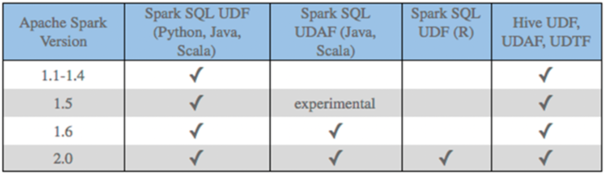
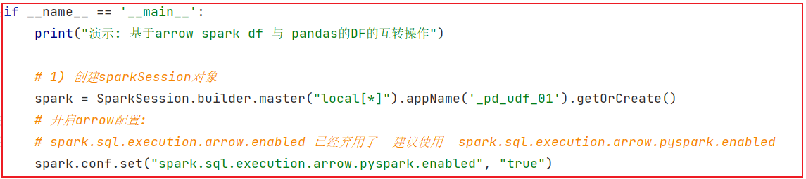
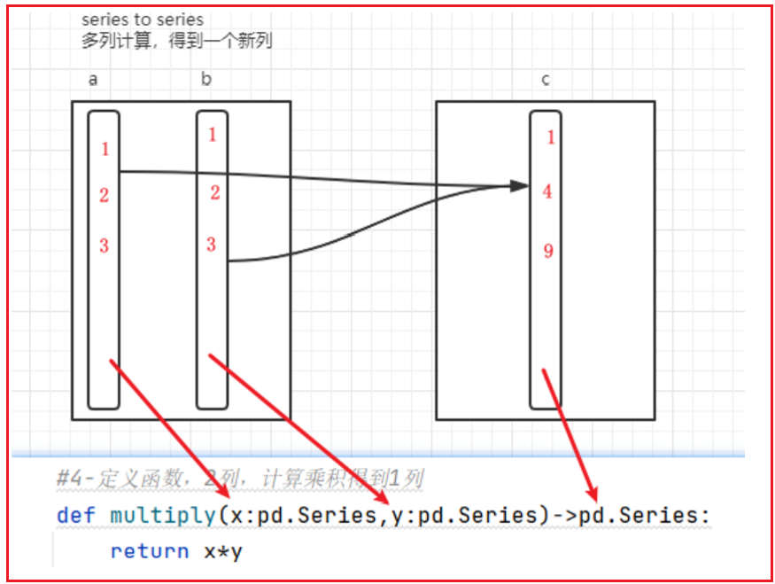

# day09 spark SQL 课程笔记

* 1- 如何在spark SQL中使用窗口函数  (掌握)
* 2- 函数的分类说明 (了解)
* 3- spark的原生UDF函数定义 (了解, 更多学习使用方式)
* 4- pandas的UDF函数定义 (掌握)

## 1. sparkSql函数定义

### 1.1 如何使用窗口函数

开窗函数的格式: 

```properties
分析函数  over(partition by xxx  order by xxx [desc|asc] [rows between])
 
常见的分析函数: 
	1) 可以和 row_number() rank() dense_rank() ntile()
	2) 聚合函数: sum() max() min()...
	3) 可以和 lead() lag() first_value() last_value()
```


如何使用: 

* 通过 SQL 的方式来使用: 
  * 几乎与hive没有太大的区别

```properties
from pyspark import SparkContext, SparkConf
from pyspark.sql import SparkSession
import os

# 锁定远端操作环境, 避免存在多个版本环境的问题
os.environ['SPARK_HOME'] = '/export/server/spark'
os.environ["PYSPARK_PYTHON"] = "/root/anaconda3/bin/python"
os.environ["PYSPARK_DRIVER_PYTHON"] = "/root/anaconda3/bin/python"

# 快捷键:  main 回车
if __name__ == '__main__':
    print("演示: 窗口函数使用:")

    # 1- 创建 spark session 对象
    spark = SparkSession.builder.master('local[*]').appName('_02_init').getOrCreate()

    # 2) 读取外部文件数据
    df = spark.read.csv(
        path='file:///export/data/workspace/ky03_pyspark_parent/_03_pyspark_sql/data/cookie.txt',
        schema='cookie string,timestr string,pv int'
    )

    # 3) 数据处理:
    # 演示 基于 SQL的方式如何处理
    df.createTempView('cookie_tab')

    spark.sql("""
        select
            cookie,
            timestr,
            pv,
            row_number() over (partition by cookie order by pv desc) as rank1,
            rank() over (partition by cookie order by pv desc) as rank2,
            dense_rank() over (partition by cookie order by pv desc) as rank3
        from cookie_tab
    
    """).show()

    # 4- 释放资源
    spark.stop()
```

* 尝试使用 DSL 方式实现窗口函数:

```properties
from pyspark import SparkContext, SparkConf
from pyspark.sql import SparkSession
import os

# 锁定远端操作环境, 避免存在多个版本环境的问题
os.environ['SPARK_HOME'] = '/export/server/spark'
os.environ["PYSPARK_PYTHON"] = "/root/anaconda3/bin/python"
os.environ["PYSPARK_DRIVER_PYTHON"] = "/root/anaconda3/bin/python"

# 快捷键:  main 回车
if __name__ == '__main__':
    print("演示: 窗口函数使用:")

    # 1- 创建 spark session 对象
    spark = SparkSession.builder.master('local[*]').appName('_02_init').getOrCreate()

    # 2) 读取外部文件数据
    df = spark.read.csv(
        path='file:///export/data/workspace/ky03_pyspark_parent/_03_pyspark_sql/data/cookie.txt',
        schema='cookie string,timestr string,pv int'
    )

    # 3) 数据处理:
    # 演示 基于 SQL的方式如何处理
    import pyspark.sql.functions as F
    from pyspark.sql import Window as win
    df.select(
        df['cookie'],df['timestr'],df['pv'],
        F.row_number().over(win.partitionBy('cookie').orderBy(F.desc('pv'))).alias('rank1'),
        F.rank().over(win.partitionBy('cookie').orderBy(F.desc('pv'))).alias('rank2'),
        F.dense_rank().over(win.partitionBy('cookie').orderBy(F.desc('pv'))).alias('rank3'),
    ).show()


    # 4- 释放资源
    spark.stop()
```


### 1.2 函数的分类说明

回顾 SQL 函数的分类:

* UDF:   用户自定义函数
  * 特点: 一进一出  大部分的内置函数都是属于UDF函数  
  * 比如  substr()  
* UDAF:  用户自定义聚合函数
  * 特点: 多进一出 
  * 比如: sum()  count() avg()....
* UDTF: 用户自定义表生成函数
  * 特点:  一进多出  (给一个数据, 返回多行或者多列的数据)
  * 比如: explode()  爆炸函数


其实不管是spark SQL中  内置函数, 还是hive中内置函数, 其实也都是属于这三类中其中一类


自定义函数目的: 

* 扩充函数, 因为在进行业务分析的时候, 有时候会使用某些功能, 但是内置函数并没有提供这样的功能, 此时需要进行自定义函数来解决

目前支持自定义函数:

```
	对于spark SQL  目前支持定义 UDF 和 UDAF , 但是对于python语言 仅支持定义UDF函数, 如果想要定义UDAF函数, 需要使用pandas UDF实现
```




注意点:

```properties
	在使用python 原生 spark SQL的 UDF方案, 整个执行效率不是特别高, 因为整个内部运算是一个来处理., 一个个返回, 这样会导致频繁进行 序列化和反序列化的操作 从而影响效率
	后续改进版本: 采用java 或者scala来定义, 然后python调用即可
	
	目前主要使用版本: 是采用pandas的UDF函数解决, 同时采用apache arrow 内存数据结构框架 来实现, 提升整个执行效率
```

### 1.3 spark原生自定义UDF函数

如何自定义原生UDF函数:

```properties
第一步: 在python中定义一个python的函数

第二步: 将这个函数注册到spark SQL中:
	方式一: 
			udf对象 = sparkSession.udf.register(参数1,参数2,参数3)
			
			参数说明:
				参数1: 定义UDF函数的名字, 此名字可以在后续的SQL中使用
				参数2: 设置Python的函数名称(需要将哪个python函数进行注册, 写上函数名称)
				参数3: python函数的返回值
				udf对象: 此对象可以在DSL中使用
	
	方式二: 
		udf对象 = F.udf(参数1,参数2)
		
		参数说明:
			参数1: 设置Python的函数名称(需要将哪个python函数进行注册, 写上函数名称)
			参数2: python函数的返回值
			udf对象: 此对象可以在DSL中使用

第三步: 在DSL中或者SQL中使用即可
```

案例实施:

```properties
需求: 构建一个函数, 完成给传递数据,统一添加一个后缀名 _itcast

from pyspark import SparkContext, SparkConf
from pyspark.sql import SparkSession
import pyspark.sql.functions   as F
import os

# 锁定远端操作环境, 避免存在多个版本环境的问题
from pyspark.sql.types import StringType

os.environ['SPARK_HOME'] = '/export/server/spark'
os.environ["PYSPARK_PYTHON"] = "/root/anaconda3/bin/python"
os.environ["PYSPARK_DRIVER_PYTHON"] = "/root/anaconda3/bin/python"

# 快捷键:  main 回车
if __name__ == '__main__':
    print("需求: 构建一个函数, 完成给传递数据,统一添加一个后缀名 _itcast")

    # 1- 创建 spark session 对象
    spark = SparkSession.builder.master('local[*]').appName('_02_init').getOrCreate()

    # 2) 初始化一个数据源:
    df = spark.createDataFrame(
        data=[('c01','张三','北京'),('c01','李四','北京'),('c02','王五','北京')],
        schema= 'cid string,name string,address string'
    )


    # 3) 处理数据:
    # 需求: 构建一个函数, 完成给传递数据,统一添加一个后缀名 _itcast
    # 3.1 定义一个python的函数, 此函数根据传递的参数, 添加一个固定后缀名
    def add_post(data):
       return  data + '_itcast'

    # 3.2 将python注册为spark SQL的 UDF函数:
    # 方式一: 支持在SQL 和 DSL中使用
    udf_dsl = spark.udf.register('add_p',add_post,StringType())

    # 如何使用呢?
    # SQL中用法
    df.createTempView('t1')
    spark.sql('select cid,name,add_p(address)  from t1').show()
    # DSL中如何使用
    df.select(df['cid'],df['name'],udf_dsl('address')).show()

    # 方式二: 仅支持在 DSL中使用
    udf_dsl2 = F.udf(add_post,StringType())
    # DSL中使用
    df.select(df['cid'], df['name'], udf_dsl2('address')).show()
    
    # 方式三: 通过注解的方式完成注册
    @F.udf(StringType())  # 此种注册 只能在DSL中使用  底层走python装饰器方案(对函数进行增强)
    def add_post_1(data):
        return data + '_itcast'

    df.select(df['cid'], df['name'], add_post_1('address')).show()
```

如果想让函数返回复杂类型: 比如 字典类型的

```properties
from pyspark import SparkContext, SparkConf
from pyspark.sql import SparkSession
import pyspark.sql.functions   as F
from pyspark.sql.types import *
import os

# 锁定远端操作环境, 避免存在多个版本环境的问题
from pyspark.sql.types import StringType

os.environ['SPARK_HOME'] = '/export/server/spark'
os.environ["PYSPARK_PYTHON"] = "/root/anaconda3/bin/python"
os.environ["PYSPARK_DRIVER_PYTHON"] = "/root/anaconda3/bin/python"

# 快捷键:  main 回车
if __name__ == '__main__':
    print("自定义UDF函数, 返回字典类型的")

    # 1- 创建 spark session 对象
    spark = SparkSession.builder.master('local[*]').appName('_02_init').getOrCreate()

    # 2) 初始化一个数据源:
    df = spark.createDataFrame(
        data=[('c01','张三 北京'),('c01','李四 上海'),('c02','王五 深圳')],
        schema= 'cid string,name_address string'
    )


    # 3) 处理数据:
    # 需求: 将数据切割开
    # 定义一个函数: 返回字典类型
    def my_split(d1):
        return {'name':d1.split(' ')[0],'address':d1.split(' ')[1]}

    # 将函数注册为spark SQL的函数
    # 方式一: 支持 SQL 和 DSL
    schema =  StructType().add('name',StringType()).add('address',StringType())
    mysplit_dsl = spark.udf.register('mysplit',my_split,schema)

    # 使用
    df.createTempView('t1')
    spark.sql("""
        select 
            cid, 
            mysplit(name_address)['name'] as name,
            mysplit(name_address)['address'] as address  
        from t1
    """).show()
    
    df2 = df.select(
        df['cid'],
        df['name_address'],
        mysplit_dsl('name_address').alias('map'),
        mysplit_dsl('name_address')['name'].alias('name'),
        mysplit_dsl('name_address')['address'].alias('address')
    )
   
```

如果想让函数返回复杂类型: 比如 列表或者元组

```properties
from pyspark import SparkContext, SparkConf
from pyspark.sql import SparkSession
import pyspark.sql.functions   as F
from pyspark.sql.types import *
import os

# 锁定远端操作环境, 避免存在多个版本环境的问题
from pyspark.sql.types import StringType

os.environ['SPARK_HOME'] = '/export/server/spark'
os.environ["PYSPARK_PYTHON"] = "/root/anaconda3/bin/python"
os.environ["PYSPARK_DRIVER_PYTHON"] = "/root/anaconda3/bin/python"

# 快捷键:  main 回车
if __name__ == '__main__':
    print("自定义UDF函数, 返回字典类型的")

    # 1- 创建 spark session 对象
    spark = SparkSession.builder.master('local[*]').appName('_02_init').getOrCreate()

    # 2) 初始化一个数据源:
    df = spark.createDataFrame(
        data=[('c01','张三 北京'),('c01','李四 上海'),('c02','王五 深圳')],
        schema= 'cid string,name_address string'
    )


    # 3) 处理数据:
    # 需求: 将数据切割开
    # 定义一个函数: 返回列表
    def my_split(d1):
        return d1.split(' ')

    # 将函数注册为spark SQL的函数
    # 方式一: 支持 SQL 和 DSL
    schema =  StructType().add('name',StringType()).add('address',StringType())
    mysplit_dsl = spark.udf.register('mysplit',my_split,schema)

    # 使用
    df.createTempView('t1')
    spark.sql("""
        select 
            cid, 
            mysplit(name_address)['name'] as name,
            mysplit(name_address)['address'] as address  
        from t1
    """).show()
    
    df2 = df.select(
        df['cid'],
        df['name_address'],
        mysplit_dsl('name_address').alias('map'),
        mysplit_dsl('name_address')['name'].alias('name'),
        mysplit_dsl('name_address')['address'].alias('address')
    )

    df2.show()
    df2.printSchema()
```


### 1.4 pandas的UDF函数

#### 1.4.1 apache arrow基本介绍

​		apache arrow 是apache旗下的一款顶级的项目, 是一个跨平台的在内存中以列式存储的数据层, 它设计的目的是作为一个跨平台的数据层, 来加快大数据分析项目的运行效率

​		pandas与pyspark SQL 进行交互的时候, 建立在apache arrow上, 带来低开销 高性能的UDF函数

​		arrow 并不会自动使用, 需要对配置以及代码做一定小的更改才可以使用并兼容


如何安装?

```properties
	pip install pyspark[sql]
	
	说明: 三个节点要求要安装, 如果使用除base虚拟环境以外的环境, 需要先切换到对应虚拟环境下
	
	注意: 
		如果安装比较慢, 可以添加一下 清华镜像源
			pip install -i https://pypi.tuna.tsinghua.edu.cn/simple pyspark[sql]
			
		不管是否使用我的虚拟机, 都建议跑一次, 看一下是否存在
```

如何使用呢?

````properties
	 spark.conf.set("spark.sql.execution.arrow.pyspark.enabled", "true")
````



#### 1.4.2 如何基于arrow完成 pandas DF 与 spark DF的互转操作

说明:

```properties
	pandas DF 到 spark DF: 
		spark_df = spark.createDataFrame(pd_df)
	
	spark df 到 panda df: 
		pd_df = spark_df.toPandas()
```

代码演示:

```properties
from pyspark import SparkContext, SparkConf
from pyspark.sql import SparkSession
import pyspark.sql.functions   as F
from pyspark.sql.types import *
import os

# 锁定远端操作环境, 避免存在多个版本环境的问题
from pyspark.sql.types import StringType

os.environ['SPARK_HOME'] = '/export/server/spark'
os.environ["PYSPARK_PYTHON"] = "/root/anaconda3/bin/python"
os.environ["PYSPARK_DRIVER_PYTHON"] = "/root/anaconda3/bin/python"

# 快捷键:  main 回车
if __name__ == '__main__':
    print("自定义UDF函数, 返回字典类型的")

    # 1- 创建 spark session 对象
    spark = SparkSession.builder.master('local[*]').appName('_02_init').getOrCreate()

    spark.conf.set("spark.sql.execution.arrow.pyspark.enabled", "true")

    # 2) 初始化一个数据源:
    spark_df = spark.createDataFrame(
        data=[('c01','张三 北京'),('c01','李四 上海'),('c02','王五 深圳')],
        schema= 'cid string,name_address string'
    )

    # 3) 处理数据:
    # spark df 转换为pd_df
    pd_df = spark_df.toPandas()
    print(pd_df)

    #  pd df 转换  spark df
    sp_df = spark.createDataFrame(pd_df)
    sp_df.show()
```

#### 1.4.3 pandas UDF

​		pandas UDF 是用户自定义函数, 有spark来执行, 使用arrow传输数据, pandas函数处理数据(py函数),arrow支持向量化(充分的利用计算机的并行能力)操作, pandas UDF是使用 pandas_udf() 作为装饰器进行函数注册. 将pandas 函数转换为spark的函数来进行使用, 而且 pandas_udf()通过类似于注解方式进行使用, 当然也支持API方案: F.pandas_udf()	

​		当使用pandas的UDF后可以模拟出  UDF函数 和 UDAF函数


* 基于pandas实现UDF函数: 

  * 要求: 函数传入类型必须是series类型, 函数返回值类型必须是 series类型

  

```properties
需求:  计算两列的乘积

import pandas as pd
from pyspark import SparkContext, SparkConf
from pyspark.sql import SparkSession
import pyspark.sql.functions  as F
from pyspark.sql.types import *
import os

# 锁定远端操作环境, 避免存在多个版本环境的问题
from pyspark.sql.types import StringType

os.environ['SPARK_HOME'] = '/export/server/spark'
os.environ["PYSPARK_PYTHON"] = "/root/anaconda3/bin/python"
os.environ["PYSPARK_DRIVER_PYTHON"] = "/root/anaconda3/bin/python"

# 快捷键:  main 回车
if __name__ == '__main__':
    print("自定义UDF函数, 返回字典类型的")

    # 1- 创建 spark session 对象
    spark = SparkSession.builder.master('local[*]').appName('_02_init').getOrCreate()

    spark.conf.set("spark.sql.execution.arrow.pyspark.enabled", "true")

    # 2) 初始化一个数据源:
    df = spark.createDataFrame(
        data=[(1,5),(3,2),(2,2),(3,5),(6,3),(3,8)],
        schema= 'a int,b int'
    )

    # 3) 处理数据:
    # 3.1 定义 pandas UDF函数
    @F.pandas_udf(IntegerType())
    def ab_CJ(a:pd.Series,b:pd.Series) -> pd.Series:
        return a * b


    # 3.2 注册函数
    # 仅支持DSL方案, 此种方式也是可以简写的
    # ab_CJ_dsl = F.pandas_udf(ab_CJ,IntegerType())  # 必须通过这种先注册 将pandas 函数 转换为 spark 函数

    # 如果要使用SQL, 必须在使用SQL的方式, 注册一次
    spark.udf.register('ab_CJ',ab_CJ) # 此处也不需要指定返回值类型, 因为 在pandas_udf中已经指定过了

    # 3.3 使用

    df.select('a','b',ab_CJ('a','b')).show()

    df.createTempView('t1')

    spark.sql("select a,b,ab_CJ(a,b)  from t1").show()
```

* 基于pandas UDF 实现 自定义 UDAF函数: 
  * 函数定义要求:  函数传入的类型为 series类型  函数返回的类型为 标量类型(基本类型: string int double...)

```properties
import pandas as pd
from pyspark import SparkContext, SparkConf
from pyspark.sql import SparkSession
import pyspark.sql.functions  as F
from pyspark.sql.types import *
import os

# 锁定远端操作环境, 避免存在多个版本环境的问题
from pyspark.sql.types import StringType

os.environ['SPARK_HOME'] = '/export/server/spark'
os.environ["PYSPARK_PYTHON"] = "/root/anaconda3/bin/python"
os.environ["PYSPARK_DRIVER_PYTHON"] = "/root/anaconda3/bin/python"

# 快捷键:  main 回车
if __name__ == '__main__':
    print("pandas的UDAF函数定义")

    # 1- 创建 spark session 对象
    spark = SparkSession.builder.master('local[*]').appName('_02_init').getOrCreate()

    spark.conf.set("spark.sql.execution.arrow.pyspark.enabled", "true")

    # 2) 初始化一个数据源:
    df = spark.createDataFrame(
        data=[('A',5),('A',2),('A',2),('B',5),('B',3),('B',8)],
        schema= 'a string,b int'
    )

    # 3) 处理数据: 需求 计算每组的平均值

    #3.1 定义 pandas 函数: UDAF
    @F.pandas_udf('float')
    def udf_avg(b:pd.Series) -> float:
        return b.mean()  # pandas中用于计算平均值操作

    spark.udf.register('udf_avg',udf_avg)

    #3.2 使用
    df.groupby(df['a']).agg(
        F.round(udf_avg('b'),2).alias('name')
    ).show()

    # SQL
    df.createTempView('t1')

    spark.sql('select a,udf_avg(b) from t1 group by a').show()

    # 同样自定义的聚合函数, 也是可以应用在窗口函数中
    spark.sql("""
        select
            a,
            b,
            udf_avg(b) over (partition by a order by b desc rows between unbounded preceding and current row ) as rank1
        from t1
    
    """).show()
```


#### 1.4.4 pandas UDF函数案例 作业

数据说明:

```properties
_c0,对手,胜负,主客场,命中,投篮数,投篮命中率,3分命中率,篮板,助攻,得分
0,勇士,胜,客,10,23,0.435,0.444,6,11,27
1,国王,胜,客,8,21,0.381,0.286,3,9,28
2,小牛,胜,主,10,19,0.526,0.462,3,7,29
3,火箭,负,客,8,19,0.526,0.462,7,9,20
4,快船,胜,主,8,21,0.526,0.462,7,9,28
5,热火,负,客,8,19,0.435,0.444,6,11,18
6,骑士,负,客,8,21,0.435,0.444,6,11,28
7,灰熊,负,主,10,20,0.435,0.444,6,11,27
8,活塞,胜,主,8,19,0.526,0.462,7,9,16
9,76人,胜,主,10,21,0.526,0.462,7,9,28
```

需求说明: 要求每一个都要使用 自定义函数方式

```properties
1- 助攻这列 +10 操作:  自定义 UDF

2- 篮板 + 助攻 的次数:  自定义 UDF
 
3- 统计 胜负的平均分:  自定义 UDAF
```

代码实现:

