# day10_spark课程笔记


## 0 周二的作业答案:

数据说明:

```properties
_c0,对手,胜负,主客场,命中,投篮数,投篮命中率,3分命中率,篮板,助攻,得分
0,勇士,胜,客,10,23,0.435,0.444,6,11,27
1,国王,胜,客,8,21,0.381,0.286,3,9,28
2,小牛,胜,主,10,19,0.526,0.462,3,7,29
3,火箭,负,客,8,19,0.526,0.462,7,9,20
4,快船,胜,主,8,21,0.526,0.462,7,9,28
5,热火,负,客,8,19,0.435,0.444,6,11,18
6,骑士,负,客,8,21,0.435,0.444,6,11,28
7,灰熊,负,主,10,20,0.435,0.444,6,11,27
8,活塞,胜,主,8,19,0.526,0.462,7,9,16
9,76人,胜,主,10,21,0.526,0.462,7,9,28
```

需求说明: 要求每一个都要使用 自定义函数方式

```properties
1- 助攻这列 +10 操作:  自定义 UDF

2- 篮板 + 助攻 的次数:  自定义 UDF
 
3- 统计 胜负的平均分:  自定义 UDAF
```

代码实现:

```properties
第一步: 将资料中 data.csv 数据放置到 spark sql的项目的data目录下


第二步: 编码实现操作:
import pandas as pd
from pyspark import SparkContext, SparkConf
from pyspark.sql import SparkSession
from pyspark.sql.types import *
import pyspark.sql.functions  as F
import os

# 目的: 锁定远端操作环境, 避免存在多个版本环境的问题
os.environ["SPARK_HOME"] = "/export/server/spark"
os.environ["PYSPARK_PYTHON"] = "/root/anaconda3/bin/python"
os.environ["PYSPARK_DRIVER_PYTHON"] = "/root/anaconda3/bin/python"

if __name__ == '__main__':
    print("pd 函数的案例")

    # 1) 创建 sparkSession对象
    spark = SparkSession.builder.master("local[*]").appName("_02_pd_udf").getOrCreate()

    # 开启 arrow方案:
    spark.conf.set("spark.sql.execution.arrow.pyspark.enabled", True)

    # 2) 读取数据:
    df = spark.read.format("csv").option("header",True).option("inferSchema",True).load("file:///export/data/workspace/_03_pyspark_sql/data/data.csv")

    # 3) 为每一个需求 定义一个函数, 并通过装饰者方案注册即可:
    # 需求1 - 助攻这列 + 10  UDF
    @F.pandas_udf(returnType=LongType())
    def add_zg(n:pd.Series) -> pd.Series:
        return n + 10
    # 需求2 - 篮板 + 助攻的次数:   udf
    @F.pandas_udf(returnType=LongType())
    def add_lb_zg(lb:pd.Series,zg:pd.Series) -> pd.Series:
        return lb + zg
    # 需求3 - 统计胜负的平均分:   UDAF
    @F.pandas_udf(returnType=DoubleType())
    def mean_sf(score:pd.Series) -> float:
        return score.mean()

    # 4) 使用函数完成对应需求
    df.withColumn('助攻+10',add_zg('助攻')).show()

    df.withColumn('助攻+篮板',add_lb_zg('篮板','助攻')).show()

    df.groupby(df['胜负']).agg(mean_sf('得分')).show()
```


## 1. spark on hive

### 1.1 集成原理说明

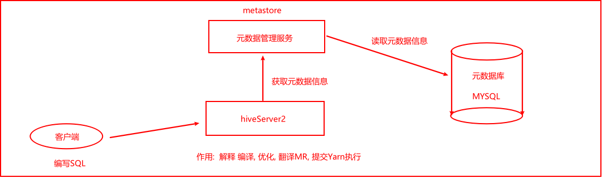

```properties
说明:
	hiveserver2 本质上就是将SQL 翻译为MR  然后将MR提交到Yarn执行
	

思考:  spark ON hive的目的:  将HIVE的执行引擎从MR运行 变更为 spark执行引擎


那么也就意味着, 一旦spark 和 HIVE集成在一起, 这个Hive的hiveserver2这个服务器没有任何意义了, 所以说, spark on hive 本质: 
	让spark去集成hive的metastore的元数据服务即可, 集成后, 可以让spark的执行引擎, 结合元数据信息, 将SQL翻译为spark应用程序, 基于spark执行运行, 从而提交效率
	

核心目的:
	结合HIVE的元数据服务, 由spark进行执行, 避免每一次都需要自己来构建元数据信息, 导致元数据信息不一致, 不统一的问题,  一旦使用HIVE的元数据服务, 表的元数据信息就可以被固定, 不管是谁通过spark SQL来分析, 不需要定义schema信息, 直接对数据分析即可
	
```


### 1.2 配置操作

大前提:  要保证之前hive的配置没有问题

```properties
建议:
	在on hive配置前, 尝试先单独启动hive 看看能不能启动成功, 并连接

启动hive的命令:
cd /export/server/hive/bin
启动metastore: 
	nohup ./hive --service metastore &
启动hiveserver2:
	nohup ./hive --service hiveserver2 &
	
基于beeline连接: 
	./beeline 进入客户端
	输入: !connect jdbc:hive2://node1:10000
	输入用户名: root
	输入密码: 密码可以不用输入

注意:
	启动hive的时候, 要保证 hadoop肯定是启动良好了
```


配置操作:

```properties
1) 确保 hive的conf目录下的hive-site.xml中配置了metastore服务地址
	<property>
        <name>hive.metastore.uris</name>
        <value>thrift://node1:9083</value>
    </property>

2) 需要将hive的conf目录下的hive-site.xml 拷贝到 spark的 conf 目录下
	如果spark没有配置集群版本, 只需要拷贝node1即可 
	如果配置spark集群, 需要将文件拷贝每一个spark节点上


3) 启动 hive的metastore服务:  
	cd /export/server/hive/bin
	nohup ./hive --service metastore &
	
	启动后, 一定要看到有runjar的出现
	
4) 启动 hadoop集群, 以及spark集群(如果采用local模式, 此集群不需要启动)

5) 使用spark的bin目录下: spark-sql 脚本 或者 pyspark 脚本打开一个客户端, 进行测试即可


测试小技巧:
	同时也可以将hive的hiveserver2服务启动后, 然后通过hive的beeline连接hive, 然后通过hive创建一个库, 在 spark-sql 脚本 或者 pyspark 脚本 通过 show databases 查看, 如果能看到, 说明集成成功了...


测试完成后, 可以将hive的hiveserver2 直接杀掉即可, 因为后续不需要这个服务:

首先查看hiveserver2服务的进程id是多少: 
	ps -ef | grep hiveserver2  或者 jps -m
	查看后,直接通过 kill -9  杀死对应服务即可
```


### 1.3 如何在代码中集成HIVE

```properties
from pyspark import SparkContext, SparkConf
from pyspark.sql import SparkSession
import os

# 锁定远端操作环境, 避免存在多个版本环境的问题
os.environ['SPARK_HOME'] = '/export/server/spark'
os.environ["PYSPARK_PYTHON"] = "/root/anaconda3/bin/python"
os.environ["PYSPARK_DRIVER_PYTHON"] = "/root/anaconda3/bin/python"

# 快捷键:  main 回车
if __name__ == '__main__':
    print("spark on hive代码集成操作:")

    # 1- 创建SparkSession对象:
    # enableHiveSupport : 此配置开启与hive支持
    spark = SparkSession.builder\
        .master('local[*]')\
        .appName('sparkonhive')\
        .config('spark.sql.shuffle.partitions','4') \
        .config('spark.sql.warehouse.dir', 'hdfs://node1:8020/user/hive/warehouse') \
        .config('hive.metastore.uris','thrift://node1:9083')\
        .enableHiveSupport()\
        .getOrCreate()

    # 2- 执行相关的操作:
    spark.sql('show databases').show()


    # 3- 释放资源
    spark.stop()
```


## 2. spark SQL分布式执行引擎

​		目前, 我们已经完成了spark集成hive的操作, 但是目前集成后, 如果需要连接hive, 此时需要启动一个spark的客户端(pyspark,spark-sql, 或者代码形式)才可以, 这个客户端底层, 相当于启动服务项, 用于连接hive服务, 进行处理操作,  一旦退出了这个客户端, 相当于这个服务也不存在了, 同样也就无法使用了

​		此操作非常类似于在hive部署的时候, 有一个本地模式部署(在启动hive客户端的时候, 内部自动启动了一个hive的hiveserver2服务项)

```properties
大白话: 
	目前后台没有一个长期挂载的spark的服务(spark hiveserver2 服务), 导致每次启动spark客户端,都行在内部构建一个服务项, 这种方式 ,仅仅适合于测试, 不适合后续开发
```


如何启动spark的分布式执行引擎呢?  这个引擎可以理解为 spark的hiveserver2服务

```properties
cd /export/server/spark

./sbin/start-thriftserver.sh \
--hiveconf hive.server2.thrift.port=10000 \
--hiveconf hive.server2.thrift.bind.host=node1 \
--hiveconf spark.sql.warehouse.dir=hdfs://node1:8020/user/hive/warehouse \
--master local[*]
```

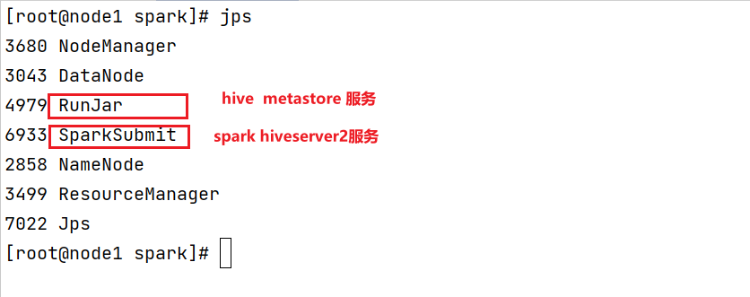

启动后: 可以通过 beeline的方式, 连接这个服务, 直接编写SQL即可:

```
cd /export/server/spark/bin
./beeline

输入:
!connect jdbc:hive2://node1:10000
```

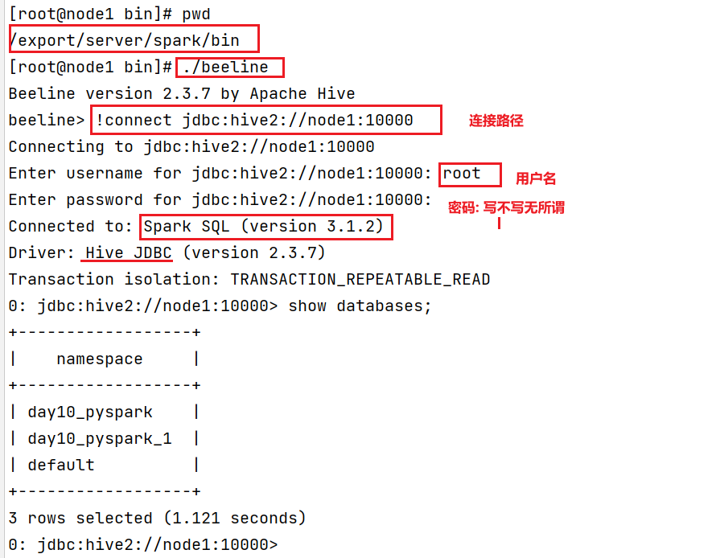

相当于模拟了一个HIVE的客户端, 但是底层运行是spark SQL 将其转换为RDD来运行的


方式二:  如何通过 datagrip 或者 pycharm 连接 spark进行操作:

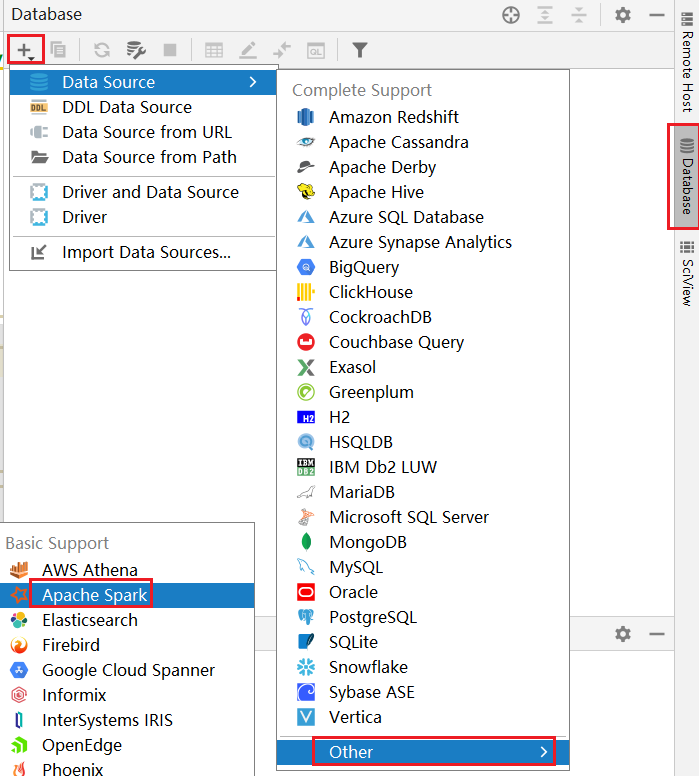

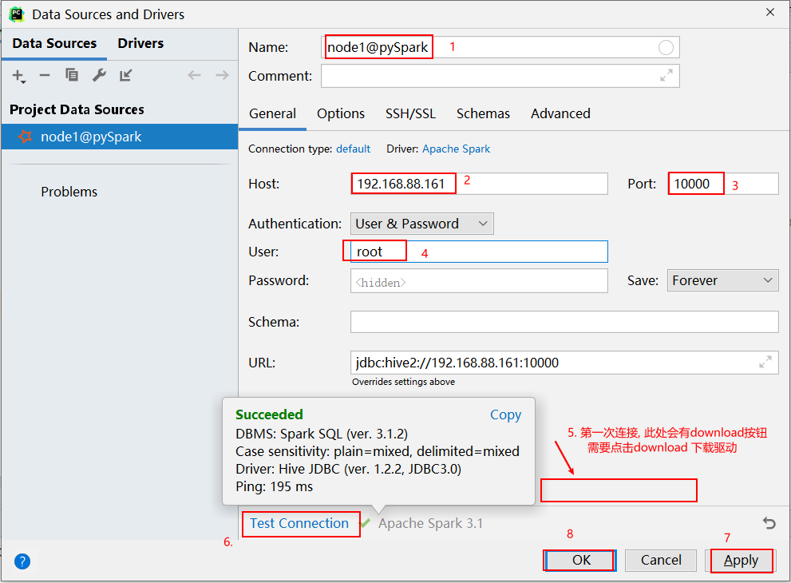

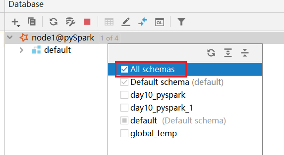

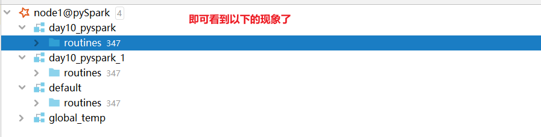


注意事项:   在使用download下载驱动的时候, 可能下载比较慢, 此时可以通过手动方式, 设置一个驱动:

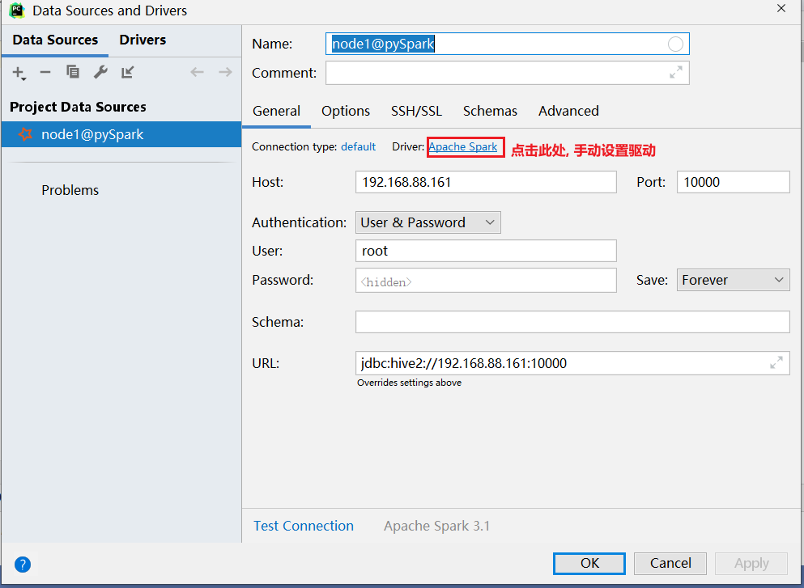

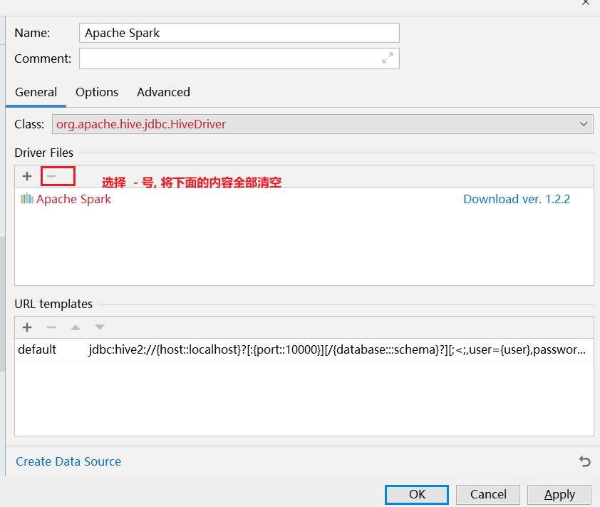

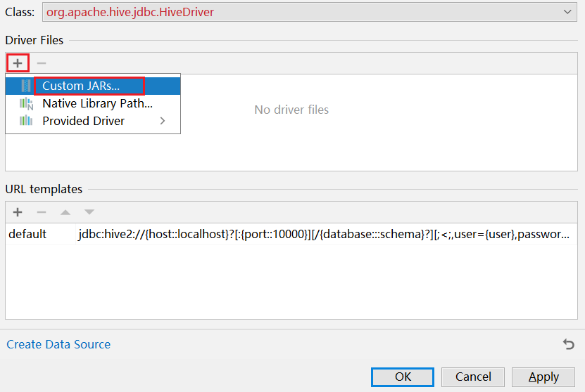

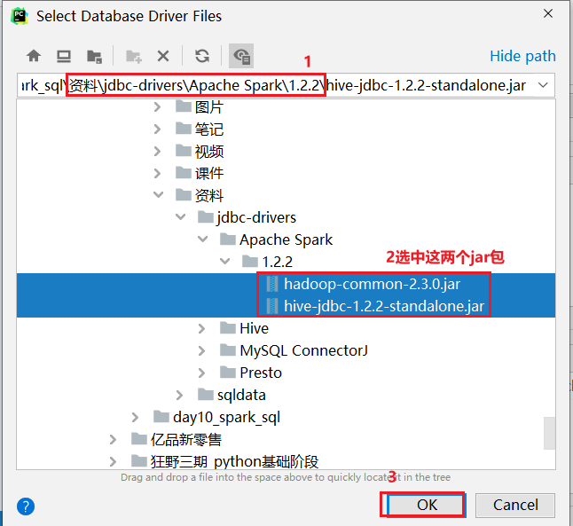

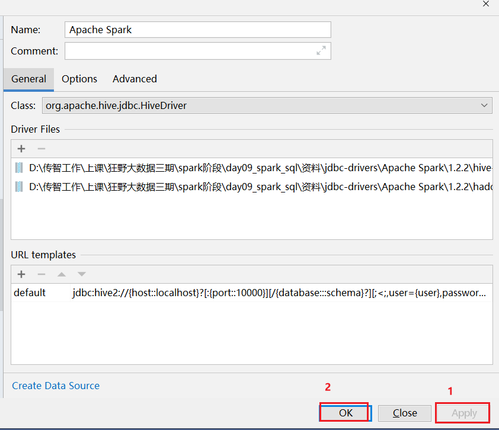


## 3. spark SQL的运行机制

回顾: spark RDD的执行流程:

```properties
整个spark应用分为一下几个部分:  JOB  DAGSchedule  TaskSchedule  ScheduleBackend(资源中心)

1) 整个spark应用进行执行启动, 当遇到action算子后, 启动一个Job任务, 一旦启动Job任务, 也就是启动Driver程序, Driver启动, 就会创建SparkContext对象, 同时这个对象一旦创建后, 其背后的 DAGSchedule和TaskSchedule 也就被创建好了

2) Driver就会将JOB任务交给DAGSchedule, 由 DAGSchedule进行DAG流程图生成, 以及划分各个stage阶段, 同时标注好, 每一个stage中运行多少个Task线程, 将每个阶段Task封装到一个TaskSet列表中, 最后将这些TaskSet提交给TaskSchedule

3) TaskSchedule 接收到TaskSet后, 依次运行每一个TaskSet中Task线程, 首先向ScheduleBackend申请资源, 申请到资源后, 然后到对应的executor执行器中执行Task线程, 最后将各个Task运行在对应executor中即可

4) 后续Driver程序不断监控这些线程执行状态, 当所有Task执行完成后, 整个程序退出...

```

​		spark SQL底层 也是要将SQL翻译为RDD来运行的, 所以说, spark SQL执行流程中, 依然是包含以上的流程的, 只不过就是在上述的流程中, 添加了一个SQL的解析 优化 翻译的操作

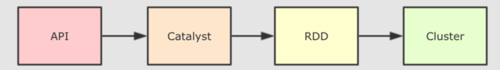

整个执行流程(大白话):  理解 并且能够拿自己的话讲的出来

```properties
	1) 书写 DSL的API  或者 SQL, 将这些内容提交到Spark SQL来执行
	2) Spark SQL在执行的时候, 会将其交给spark SQL的优化器(catalyst), 后续就整个 RBO过程:
		先将SQL生成一个未解析逻辑计划(仅仅是纯粹的对SQL进行解析而已, 描述SQL的执行流程)
		然后根据元数据对未解析逻辑计划添加相关的元数据信息(有那些字段, 字段类型, 数据从哪里读....), 形成一个优化前的逻辑计算
		最后根据相关的优化规则, 对逻辑计算进行优化处理, 形成一个优化后的逻辑计划
	3) 进入CBO流程: 翻译为物理计划
		将优化后逻辑计划, 转换为多个物理执行计划(因为有不同的优化方案, 可能会导致形成多个物理计划), 根据代价函数(得到最优方案), 选择一个最好的物理计划
	4) 将这个物理计划通过代码生成器(codeGeneration),生成RDD代码. 将这个代码提交到集群中运行即可
	
	提交后, 整个RDD执行流程, 其实就是之前讲述的内容.....
```

专业话语:

```properties
1- sparkSQL底层解析是有RBO 和 CBO优化完成的
2- RBO是基于规则优化, 对于SQL或DSL的语句通过执行引擎得到未执行逻辑计划, 在根据元数据得到逻辑计算, 之后加入列值裁剪或谓词下推等优化手段形成优化的逻辑计划
3- CBO是基于优化的逻辑计划得到多个物理执行计划, 根据代价函数选择出最优的物理执行计划
4- 通过codegenaration代码生成器完成RDD的代码构建
5- 底层依赖于DAGScheduler 和TaskScheduler 完成任务计算执行
```


如何查看物理执行计划呢?  

* 方式一:  通过 访问 web UI  查看 SQL目录下 detail(详细内容): 此处放置物理计划

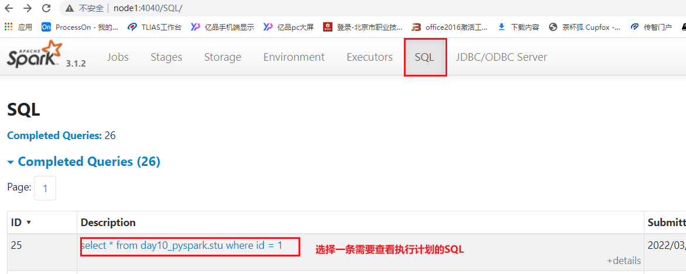

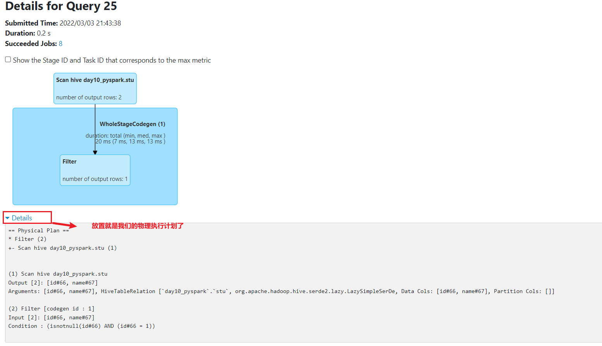

* 方式二: 通过SQL方式查看

```properties
格式: 
	explain sql
```

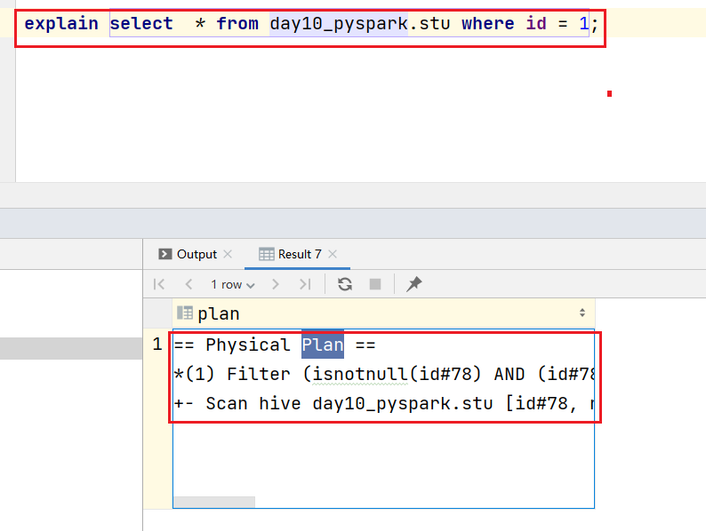


## 4. 综合案例-今日作业

### 4.1 新零售综合案例

数据结构介绍:  

```properties
InvoiceNo  string  订单编号(退货订单以C 开头)
StockCode  string  产品代码
Description string  产品描述
Quantity integer  购买数量(负数表示退货)
InvoiceDate string   订单日期和时间   12/1/2010 8:26
UnitPrice  double  商品单价
CustomerID  integer  客户编号
Country string  国家名字

字段与字段之间的分隔符号为 逗号
```

E_Commerce_Data.csv


拿到数据之后, 首先需要对数据进行过滤清洗操作:  清洗目的是为了得到一个更加规整的数据

```properties
清洗需求:
	需求一: 将客户id(CustomerID) 为 0的数据过滤掉 
	需求二: 将商品描述(Description) 为空的数据过滤掉
	需求三: 将日期格式进行转换处理:
		原有数据信息: 12/1/2010 8:26
		转换为: 2010-01-12 08:26
```

相关的需求(DSL和SQL):

```properties
(1) 客户数最多的10个国家
(2) 销量最高的10个国家
(3) 各个国家的总销售额分布情况
(4) 销量最高的10个商品
(5) 商品描述的热门关键词Top300
(6) 退货订单数最多的10个国家
(7) 月销售额随时间的变化趋势
(8) 日销量随时间的变化趋势
(9) 各国的购买订单量和退货订单量的关系
(10) 商品的平均单价与销量的关系
```

#### 2.1.1 完成数据清洗过滤的操作


#### 2.1.2 需求统计分析操作


### 4.2 在线教育案例

数据结构基本介绍:

```properties
student_id  string  学生id
recommendations string   推荐题目(题目与题目之间用逗号分隔)
textbook_id  string  教材id
grade_id  string   年级id
subject_id string  学科id
chapter_id strig   章节id
question_id string  题目id
score  integer  点击次数
answer_time  string  注册时间
ts  timestamp   时间戳


字段与字段之间的分隔符号为 \t
```

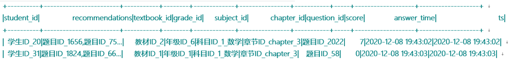

需求:

```properties
需求一: 找到TOP50热点题对应科目. 然后统计这些科目中, 分别包含几道热点题目

需求二:  找到Top20热点题对应的饿推荐题目. 然后找到推荐题目对应的科目, 并统计每个科目分别包含推荐题目的条数
```

数据存储在 资料中: eduxxx.csv

