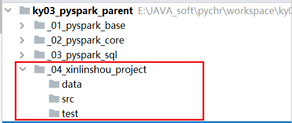
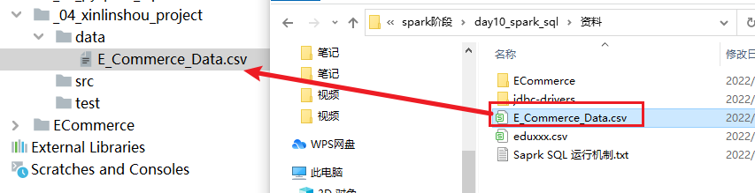
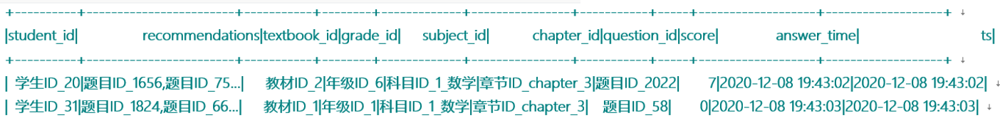
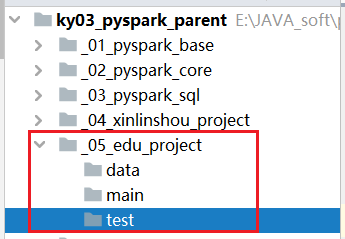
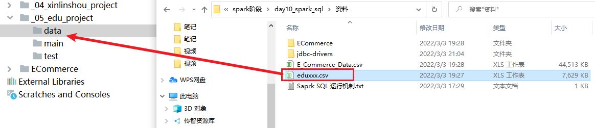

## 1. 综合案例

### 1.1 新零售综合案例 (作业)

数据结构介绍:  

```properties
InvoiceNo  string  订单编号(退货订单以C 开头)
StockCode  string  产品代码
Description string  产品描述
Quantity integer  购买数量(负数表示退货)
InvoiceDate string   订单日期和时间   12/1/2010 8:26
UnitPrice  double  商品单价
CustomerID  integer  客户编号
Country string  国家名字

字段与字段之间的分隔符号为 逗号
```

E_Commerce_Data.csv


拿到数据之后, 首先需要对数据进行过滤清洗操作:  清洗目的是为了得到一个更加规整的数据

```properties
清洗需求:
	需求一: 将客户id(CustomerID) 为 0的数据过滤掉 
	需求二: 将商品描述(Description) 为空的数据过滤掉
	需求三: 将日期格式进行转换处理:
		原有数据信息: 12/1/2010 8:26
		转换为: 2010-01-12 08:26
```

相关的需求(DSL和SQL):

```properties
(1) 客户数最多的10个国家
(2) 销量最高的10个国家
(3) 各个国家的总销售额分布情况
(4) 销量最高的10个商品
(5) 商品描述的热门关键词Top300
(6) 退货订单数最多的10个国家
(7) 月销售额随时间的变化趋势
(8) 日销量随时间的变化趋势
(9) 各国的购买订单量和退货订单量的关系
(10) 商品的平均单价与销量的关系
```

#### 1.1.1 完成数据清洗过滤的操作

* 1- 创建一个子项目




* 2- 将资料中 数据文件, 放置到 data目录下



* 3- 在main下, 创建一个python脚本, 进行数据清洗代码实现:

```properties
from pyspark import SparkContext, SparkConf
from pyspark.sql import SparkSession
import pyspark.sql.functions as F
import os

# 锁定远端操作环境, 避免存在多个版本环境的问题
os.environ['SPARK_HOME'] = '/export/server/spark'
os.environ["PYSPARK_PYTHON"] = "/root/anaconda3/bin/python"
os.environ["PYSPARK_DRIVER_PYTHON"] = "/root/anaconda3/bin/python"

# 快捷键:  main 回车
if __name__ == '__main__':
    print("完成新零售案例数据清洗操作:")

    # 1) 创建 SparkSession对象:
    spark = SparkSession.builder\
        .master('local[*]') \
        .config('spark.sql.shuffle.partitions', '2') \
        .appName('clear_init')\
        .getOrCreate()

    # 2) 加载CSV 数据集:
    df = spark.read.csv(
        path = 'file:///export/data/workspace/ky03_pyspark_parent/_04_xinlinshou_project/data/E_Commerce_Data.csv',
        header= True,
        inferSchema= True
    )

    # df.printSchema()
    # df.show()
    # print(df.count())  # 541909

    # 3） 处理数据操作:  清洗数据
    df_clear = df.where("CustomerID != 0 and Description != '' and Description is not null ")
    #print(df_clear.count()) # 406829
    # 完成对日期格式转换操作:
    # 做法: 先将原有格式日期数据, 按照指定格式先转换为时间戳, 然后将时间戳转换为指定格式的日期即可
    df_clear_f = df_clear.select(
        'InvoiceNo',
        'StockCode',
        'Description',
        'Quantity',
        F.from_unixtime(F.unix_timestamp('InvoiceDate','M/d/yyyy H:m'),'yyyy-MM-dd HH:mm').alias('InvoiceDate'),
        'UnitPrice',
        'CustomerID',
        'Country'
    )

    # 4- 将清洗转换后的数据, 保存到 HDFS上:
    df_clear_f.write.mode('overwrite')\
        .format('csv')\
        .option('header',True)\
        .save('hdfs://node1:8020/xinlinshou_clear/output')


    # 5- 释放资源
    spark.stop()
```

#### 1.1.2 需求统计分析操作

* (1) 客户数最多的10个国家
  * 大白话: 统计每个国家有多少个客户数, 求出前10个

```properties
from pyspark import SparkContext, SparkConf
from pyspark.sql import SparkSession
import pyspark.sql.functions as F
import os

# 锁定远端操作环境, 避免存在多个版本环境的问题
os.environ['SPARK_HOME'] = '/export/server/spark'
os.environ["PYSPARK_PYTHON"] = "/root/anaconda3/bin/python"
os.environ["PYSPARK_DRIVER_PYTHON"] = "/root/anaconda3/bin/python"

# 快捷键:  main 回车
if __name__ == '__main__':
    print("完成新零售的需求分析实现:")

    # 1) 创建 SparkSession对象:
    spark = SparkSession.builder \
        .master('local[*]') \
        .config('spark.sql.shuffle.partitions', '2') \
        .appName('clear_init') \
        .getOrCreate()

    # 2) 读取数据: 读取的是清洗过后数据
    df_init = spark.read.csv(
        path='hdfs://node1:8020/xinlinshou_clear/output',
        header=True,
        inferSchema=True
    )
    df_init.createTempView('t1')

    # 3) 数据处理:
    # 3.1- 需求一: 统计每个国家有多少个客户数, 求出前10个
    # 基于 SQL实现:
    spark.sql("""
        select
            Country,
            count( distinct CustomerID) as c_cnt
        from t1 
        group by Country 
        order by c_cnt desc 
        limit 10
    """).show()  # show 默认显示20个数据

    # 基于 DSL方式:
    df_res = df_init.groupby(df_init['Country']).agg(
        F.countDistinct('CustomerID').alias('c_cnt')
    ).orderBy('c_cnt',ascending=False).limit(10)

    df_res.show()

```

* (2) 销量最高的10个国家
  * 大白话: 统计各个国家销量, 并取出前10个
* (3) 各个国家的总销售额分布情况
  * 大白话: 统计各个国家的总销售额: 

```properties
def xuqiu3():
    spark.sql("""
        select
            Country,
            round(sum(Quantity * UnitPrice),2)  as total_price
        from t1 
        group by Country
        order by  total_price desc limit 10
    """).show()
    # DSL实现:
    df_res3 = df_init.groupby(df_init['Country']).agg(
        F.round(F.sum(df_init['Quantity'] * df_init['UnitPrice']), 2).alias('total_price')
    ).orderBy('total_price', ascending=False).limit(10)
    df_res3.show()
```


* (4) 销量最高的10个商品
  * 大白话: 统计每个商品的销售数量, 求前10个
* (5) 商品描述的热门关键词Top300
  * 说明:  商品描述中每一个单词就是一个关键词
  * 大白话:  统计每个关键词出现了多少次, 求前300个

```properties
def xuqiu4():
    # SQL实现:
    spark.sql("""
        select
            words,
            count(1) as w_cnt
        from t1 lateral view  explode(split(Description,' ')) t2 as words
        group by words
        order by w_cnt desc
        limit 300
    """).show(300)
    # DSL写法:
    df_init.withColumn('words', F.explode(F.split('Description', ' '))) \
        .groupby('words') \
        .count() \
        .orderBy('count', ascending=False) \
        .limit(300) \
        .show(300)
```


* (6) 退货订单数最多的10个国家
  * 大白话:  统计每个国家的退货订单数量, 找出前10个

```properties
def xuqiu6():
    # SQL实现:
    spark.sql("""
        select
            Country,
            count(distinct InvoiceNo) as t_cnt
        from t1 where InvoiceNo like 'C%' 
        group by Country
        order by t_cnt desc limit 10
    """).show()
    # DSL方案: 
    df_init.where(df_init['InvoiceNo'].like('C%')) \
        .groupby('Country') \
        .agg(
        F.countDistinct('InvoiceNo').alias('t_cnt')
    ) \
        .orderBy('t_cnt', ascending=False) \
        .limit(10) \
        .show()
```


* (7) 月销售额随时间的变化趋势
  * 大白话: 统计每年每个月销售额
* (8) 日销量随时间的变化趋势
  * 大白话: 统计每年每月每日的销量
* (9) 各国的购买订单量和退货订单量的关系
  * 大白话:  分别统计各个国家购买订单量和退货订单量

```properties
def xuqiu9():
    # SQL实现:
    spark.sql("""
        select
            Country,
            count(distinct 
                if(
                    InvoiceNo like 'C%',
                    NULL,
                    InvoiceNo
                ) 
            ) total_cnt,
            count( distinct 
                if(
                    InvoiceNo like 'C%',
                    InvoiceNo,
                    NULL
                )
            ) as t_cnt
        from t1 
        group by  Country
    """).show()
    # DSL实现:
    df_init.groupby('Country').agg(
        F.countDistinct(F.expr("if(InvoiceNo like 'C%',NULL,InvoiceNo)")).alias('total_cnt'),
        F.countDistinct(F.expr("if(InvoiceNo like 'C%',InvoiceNo,NULL)")).alias('t_cnt')
    ).show()
```


* (10) 商品的平均单价与销量的关系
  * 大白话: 分别统计各个商品的平均价格 和 销量

### 1.2 在线教育案例 (作业)

数据结构基本介绍:

```properties
student_id  string  学生id
recommendations string   推荐题目(题目与题目之间用逗号分隔)
textbook_id  string  教材id
grade_id  string   年级id
subject_id string  学科id
chapter_id strig   章节id
question_id string  题目id
score  integer  点击次数
answer_time  string  注册时间
ts  timestamp   时间戳


字段与字段之间的分隔符号为 \t
```



需求:

```properties
需求一: 找到TOP50热点题对应科目. 然后统计这些科目中, 分别包含几道热点题目

需求二:  找到Top20热点题对应的饿推荐题目. 然后找到推荐题目对应的科目, 并统计每个科目分别包含推荐题目的条数
```

数据存储在 资料中: eduxxx.csv


----

* 1-  创建子项目 _05_edu_project, 并初始化项目目录结构




* 2- 将资料中 eduxxx.csv, 导入到项目的data目录下



* 3- 在mian下, 创建python脚本, 编写代码:

```properties
from pyspark import SparkContext, SparkConf
from pyspark.sql import SparkSession
import pyspark.sql.functions as F
import os

# 锁定远端操作环境, 避免存在多个版本环境的问题
os.environ['SPARK_HOME'] = '/export/server/spark'
os.environ["PYSPARK_PYTHON"] = "/root/anaconda3/bin/python"
os.environ["PYSPARK_DRIVER_PYTHON"] = "/root/anaconda3/bin/python"

# 快捷键:  main 回车
if __name__ == '__main__':
    print("教育案例的需求分析操作: ")

    # 1) 创建 SparkSession对象:
    spark = SparkSession.builder \
        .master('local[*]') \
        .config('spark.sql.shuffle.partitions', '2') \
        .appName('clear_init') \
        .getOrCreate()

    # 2- 读取数据:
    df_init = spark.read.csv(
        path='file:///export/data/workspace/ky03_pyspark_parent/_05_edu_project/data/eduxxx.csv',
        header=True,
        inferSchema=True,
        sep='\t'
    )

    df_init.createTempView('t1')
    # 3- 需求实现: 找到TOP50热点题对应科目. 然后统计这些科目中, 分别包含几道热点题目
    # 拆解需求: 找到 TOP50 热点题
    df_top50 = spark.sql("""
        select 
            question_id,
            sum(score) as q_cnt
        from t1 
        group by question_id
        order by q_cnt desc
        limit 50
    """)

    df_top50.createTempView('t2')
    # 根据这50个热点题, 对应对应的科目, 然后统计这些科目中, 分别包含几道热点题目
    spark.sql("""
        select
            t1.subject_id,
            count(distinct t1.question_id) as s_cnt
        from t2  join t1 on t1.question_id = t2.question_id
        group by  t1.subject_id
    """).show()

    # DSL实现:
    # 1- 计算前50道热点题:
    df_dsl_top50 = df_init.groupby('question_id').agg(
        F.sum('score').alias('q_cnt')
    ).orderBy('q_cnt',ascending=False).limit(50)

    # 2- 找到题目对应科目, 以及计算每个科目下有多少个热点题
    df_init.join(df_dsl_top50,'question_id')\
            .groupby(df_init['subject_id'])\
            .agg(
                F.countDistinct(df_init['question_id']).alias('s_cnt')
            )\
            .show()


```

