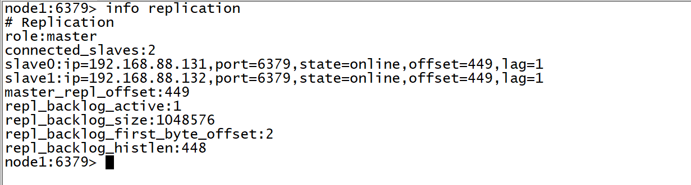
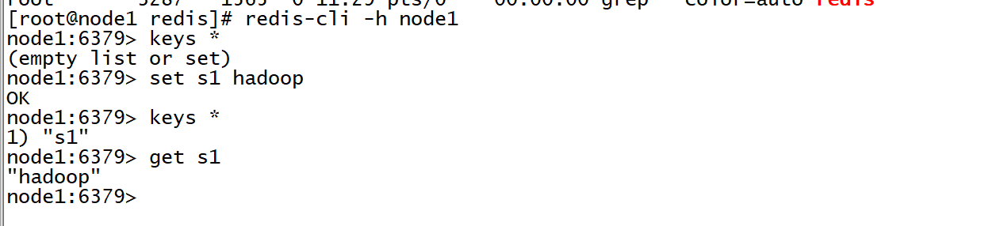
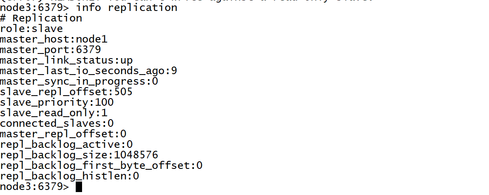
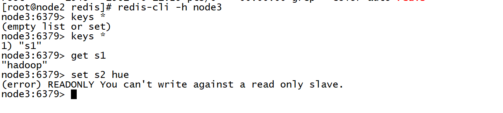
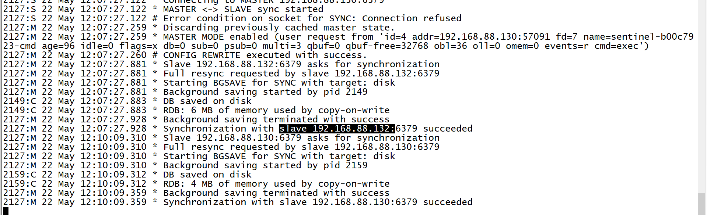
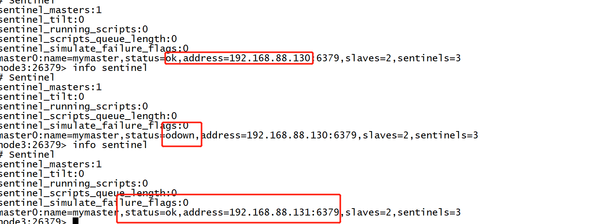

## Redis架构：主从复制集群的搭建

- **目标**：实现Redis主从复制集群的搭建测试

- **实施**

  - **配置三台Redis**

    - 复制到第二台和第三台

      ```
      cd /export/server/
      scp -r redis-3.2.8-bin node2:$PWD
      scp -r redis-3.2.8-bin node3:$PWD
      ```

    - 配置node2和node3

    - 创建链接

      ```
      cd /export/server/
      ln -s redis-3.2.8-bin redis
      ```

    - 配置环境变量

      ```
      vim /etc/profile
      ```

      ```
      # REDIS HOME
      export REDIS_HOME=/export/server/redis
      export PATH=:$PATH:$REDIS_HOME/bin
      ```

      ```
      source /etc/profile
      ```

    - 修改配置文件

      ```
      cd /export/server/redis
      vim redis.conf
      ```

      - node2

        ```shell
        #61行
        bind node2
        #266行
        slaveof node1 6379
        ```

      - node3

        ```shell
        #61行
        bind node3
        #266行
        slaveof node1 6379
        ```

    - 三台机器都执行

      ```
      cd /export/server/redis
      rm -rf ./datas/* ./logs/*
      ```

  - **启动测试**

    - 依次启动三台Redis

      ```
      redis-start.sh
      ```

    - 连接服务端

      ```
      redis-cli -h node1
      info replication
      ```

    - 读写测试

      - 主节点

        

        

        

      - 从

        

        

        

        

      

- **小结**

  - 实现Redis主从复制集群的搭建测试


## Redis架构：哨兵集群的搭建

- **目标**：实现哨兵模式的搭建测试

- **实施**

  - **==注意：先搭建主从复制，哨兵模式是基于主从复制的==**

  - **配置哨兵服务**

    - 第一台机器复制哨兵配置文件：sentinel.conf

      ```
      cp /export/server/redis-3.2.8/sentinel.conf /export/server/redis/
      ```

    - 修改配置文件

      ```
      vim sentinel.conf
      ```

      ```
      #18行
      bind 0.0.0.0
      protected-mode no
      daemonize yes
      logfile "/export/server/redis-3.2.8-bin/logs/sentinel.log"
      #73行
      sentinel monitor mymaster node1 6379 2
      ```

    - 分发给第二台和第三台

      ```
      cd /export/server/redis
      scp -r sentinel.conf root@node2:$PWD
      scp -r sentinel.conf root@node3:$PWD
      ```

  - **启动**

    - 启动三台Redis服务

      ```
      redis-start.sh
      ```

    - 启动三台哨兵服务

      ```
      redis-sentinel /export/server/redis/sentinel.conf
      ```

  - **测试**

    - 连接Redis

      ```
      redis-cli -h node1
      ```

      

    - 连接哨兵

      ```
      redis-cli -h node3 -p 26379
      info sentinel
      ```

    - kill当前的Master，观察哨兵信息

      

      

  - **Jedis中哨兵的连接**

    ```java
    //方案三：构建哨兵连接池：第一个参数是master的逻辑名称，第二个参数是哨兵列表，第三个是连接池的配置
    HashSet<String> sets = new HashSet<>();
    sets.add("node1:26379");
    sets.add("node2:26379");
    sets.add("node3:26379");
    JedisSentinelPool mymaster = new JedisSentinelPool("mymaster", sets, jedisPoolConfig);
    //从连接池中获取连接
    jedis = mymaster.getResource();
    ```

    

- **小结**

  - 实现哨兵模式的搭建测试