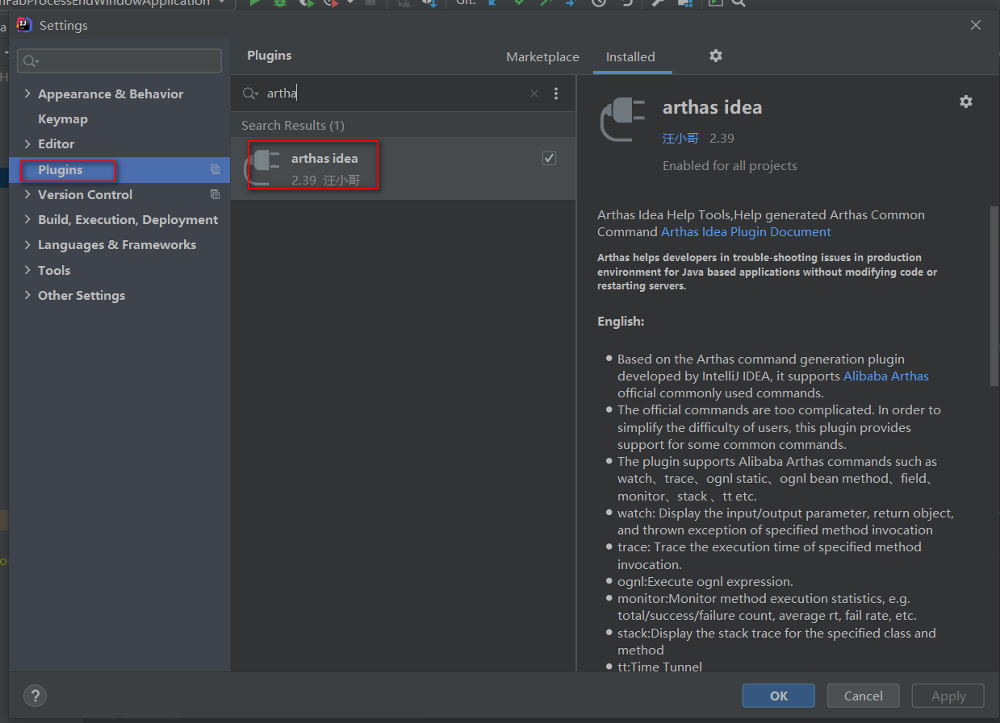
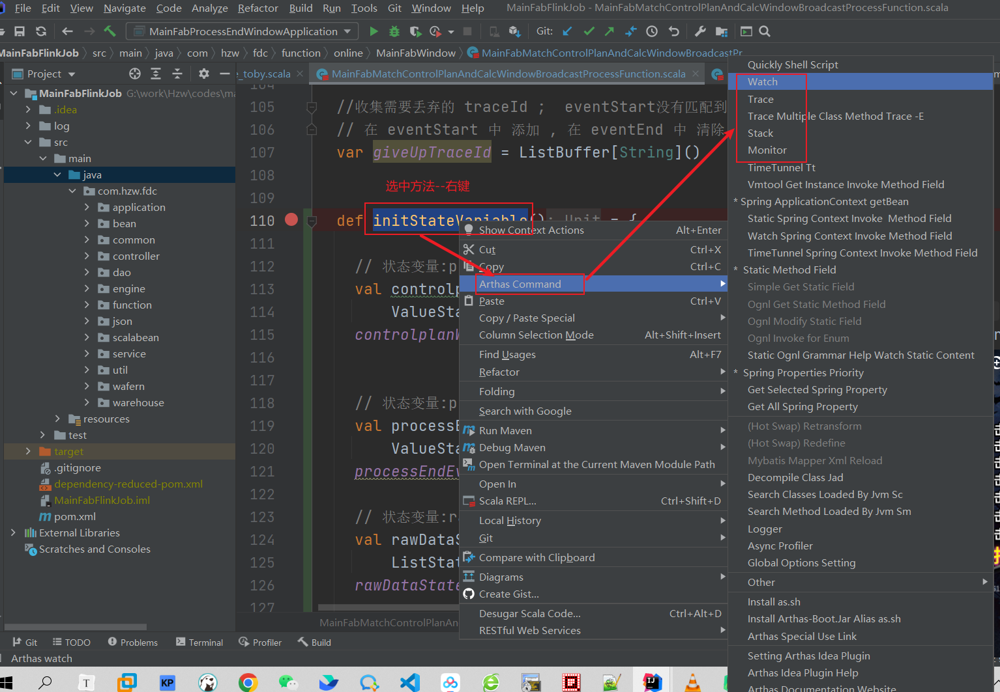

## 安装插件




## 使用arthas command




## 使用插件生成watch 命令

``` shell
watch com.hzw.fdc.function.online.MainFabWindow.MainFabMatchControlPlanAndCalcWindowBroadcastProcessFunction initStateVariable '{params,returnObj,throwExp}'  -n 5  -x 3 
```


