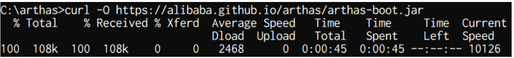
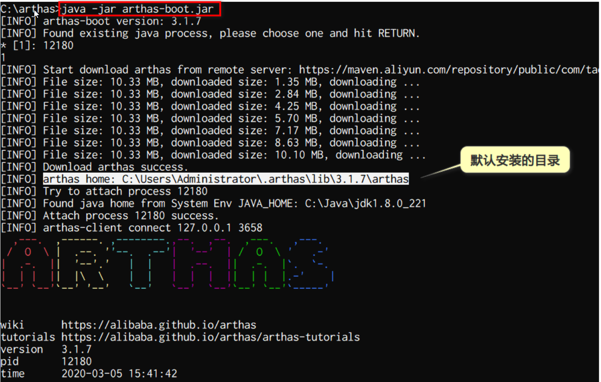

# 简介

## Arthas（阿尔萨斯）能为你做什么？

- `Arthas` 是 Alibaba 开源的 Java 诊断工具，深受开发者喜爱。

- 当你遇到以下类似问题而束手无策时，`Arthas`可以帮助你解决：
  1. 这个类从哪个 jar 包加载的？为什么会报各种类相关的 Exception？
  2. 我改的代码为什么没有执行到？难道是我没 commit？分支搞错了？
  3. 遇到问题无法在线上 debug，难道只能通过加日志再重新发布吗？
  4. 线上遇到某个用户的数据处理有问题，但线上同样无法 debug，线下无法重现！
  5. 是否有一个全局视角来查看系统的运行状况？
  6. 有什么办法可以监控到 JVM 的实时运行状态？
  7. 怎么快速定位应用的热点，生成火焰图？
  8. 怎样直接从 JVM 内查找某个类的实例？


- 官方文档：https://arthas.aliyun.com/doc/


# 快速安装

- 下载 arthas-boot.jar ，然后用 java -jar 的方式启动：

## 命令

``` shell
curl -O https://alibaba.github.io/arthas/arthas-boot.jar
java -jar arthas-boot.jar
```

如果下载速度比较慢，可以使用aliyun的镜像：

``` shell
java -jar arthas-boot.jar --repo-mirror aliyun --use-htt
```

## Windows下安装

- 在c:\下创建目录arthas，在windows命令窗口下，使用curl命令下载阿里服务器上的jar包，大小 108k



- 使用java启动arthas-boot.jar，来安装arthas，大小约10M。运行此命令会发现java进程，输入1 按回车。则自动从远程主机上下载arthas到本地目录



- 查看安装好的目录

``` shell
C:\Users\Administrator\.arthas\lib\3.1.7\arthas\
```


