# JVM相关命令

## 1- dashboard

### 1-1 作用

- 显示当前系统的实时数据面板，按q或ctrl+c退出

### 1-2 效果

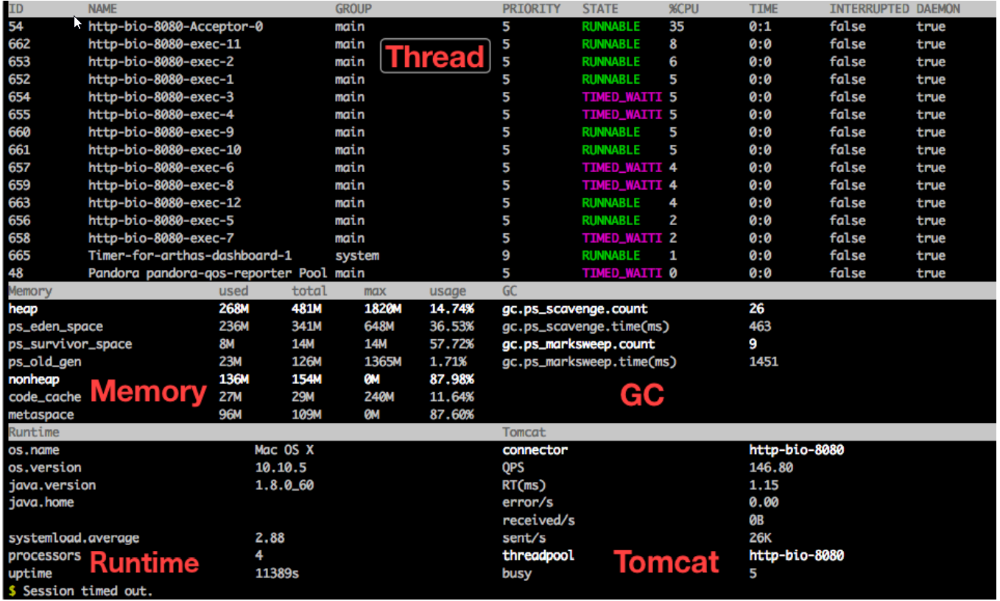

### 1-3 数据说明

- ID: Java级别的线程ID，注意这个ID不能跟jstack中的nativeID一一对应 
- NAME: 线程名 
- GROUP: 线程组名 
- PRIORITY: 线程优先级, 1~10之间的数字，越大表示优先级越高 
- STATE: 线程的状态 
- CPU%: 线程消耗的cpu占比，采样100ms，将所有线程在这100ms内的cpu使用量求和，再算出 每个线程的cpu使用占比。 
- TIME: 线程运行总时间，数据格式为 分：秒 
- INTERRUPTED: 线程当前的中断位状态 
- DAEMON: 是否是守护线程

## 2- thread

### 2-1 作用

- 查看当前 JVM 的线程堆栈信息

### 2-2 参数说明

| 参数名称        | 参数说明                              |
| --------------- | ------------------------------------- |
| d               | 线程ID                                |
| [n:]            | 指定最忙的前N个线程并打印堆栈         |
| [b]             | 找出当前阻塞其他线程的线程            |
| [i  <value> ]   | 指定cpu占比统计的采样间隔，单位为毫秒 |
| --state WAITING | 查看处于等待状态的线程                |

### 2-3 举例

- 展示当前最忙的前3个线程并打印堆栈 thread -n 3

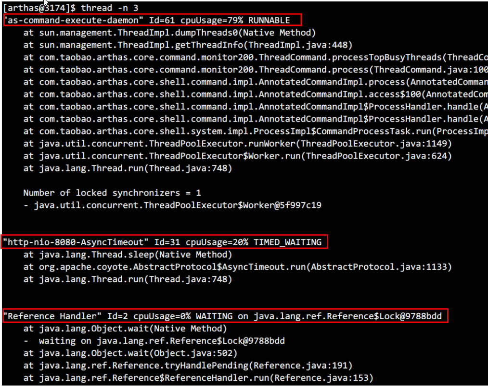
- 当没有参数时，显示所有线程的信息 thread

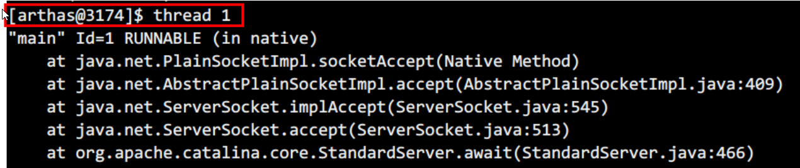
- 找出当前阻塞其他线程的线程，有时候我们发现应用卡住了， 通常是由于某个线程拿住了某个锁， 并且 其他线程都在等待这把锁造成的。 为了排查这类问题， arthas提供了thread -b， 一键找出那个罪魁 祸首。 thread -b

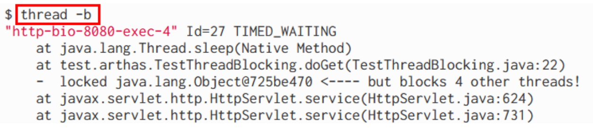
- 指定采样时间间隔，每过1000毫秒采样，显示最占时间的3个线程 thread -i 1000 -n 3

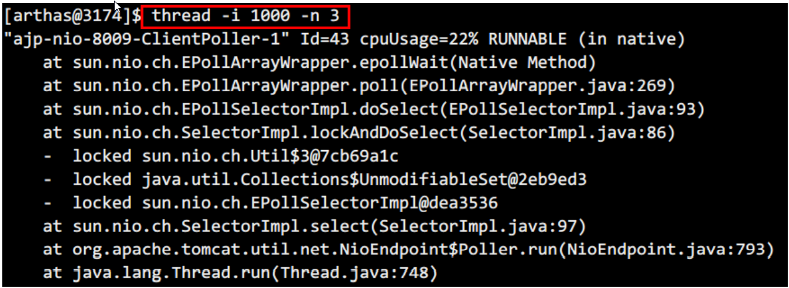

- 查看处于等待状态的线程 thread --state WAITING

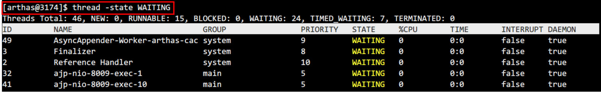


## 3- jvm

### 3-1 作用：

- 查看当前 JVM 的信息

### 3-2 效果

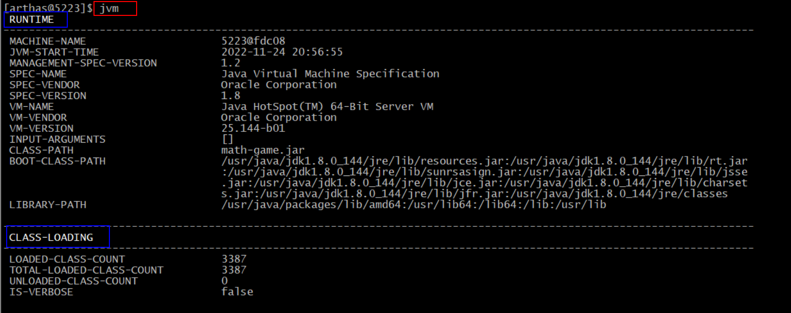

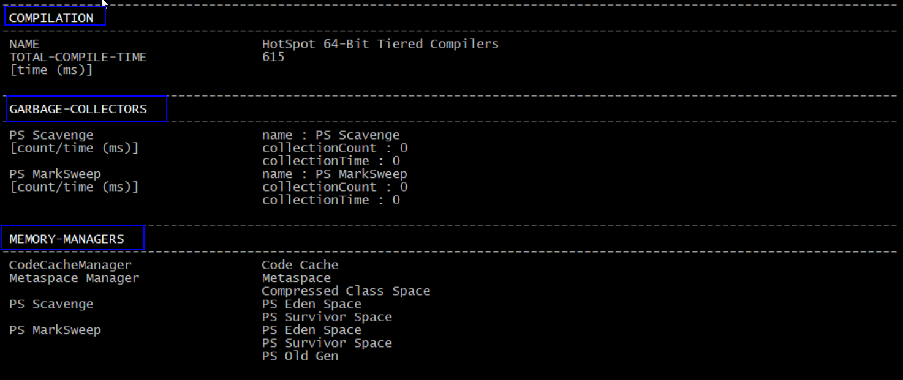

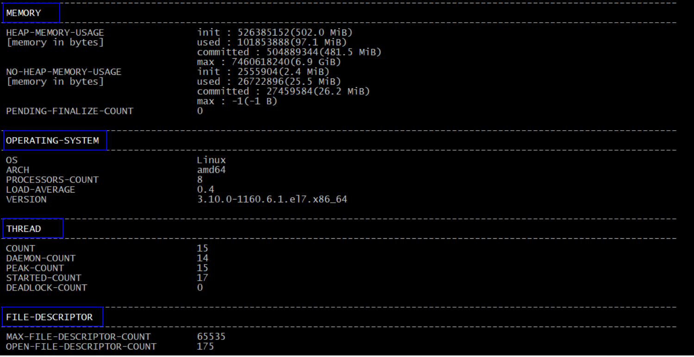

### 3-3 数据说明

- THREAD相关
  - COUNT: JVM**当前活跃**的线程数 
  - DAEMON-COUNT: JVM**当前活跃**的**守护**线程数 
  - PEAK-COUNT: 从JVM启动开始**曾经活着的最大**线程数 
  - STARTED-COUNT: 从JVM启动开始**总共**启动过的线程次数 
  - DEADLOCK-COUNT: JVM当前**死锁**的线程数

- 文件描述符相关
  - MAX-FILE-DESCRIPTOR-COUNT：JVM进程**最大**可以打开的文件描述符数 
  - OPEN-FILE-DESCRIPTOR-COUNT：JVM**当前打开**的文件描述符数

## 4- sysprop

### 4-1作用

- 查看和修改JVM的系统属性

### 4-2 举例

- 查看所有属性 sysprop
- 查看单个属性，支持通过tab补全 sysprop java.version

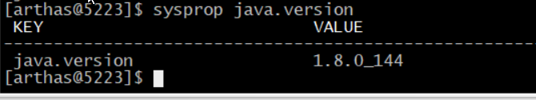

- 修改单个属性 

``` shell
sysprop user.country 
user.country=US 

sysprop user.country CN 
Successfully changed the system property. 
user.country=CN
```

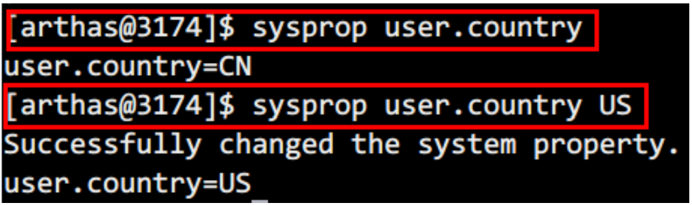


## 5- sysenv

### 5-1 作用

- 查看当前JVM的环境属性( System Environment Variables )

### 5-2 举例

``` shell
查看所有环境变量
sysenv

查看单个环境变量
sysenv USER
```

### 5-3 效果

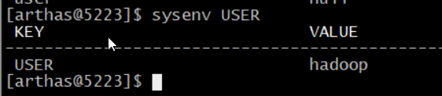

## 6- vmoption

### 6-1 作用

- 查看，更新VM诊断相关的参数

### 6-2 举例

``` shell
查看所有的选项
vmoption
查看指定的选项
vmoption PrintGCDetails
```

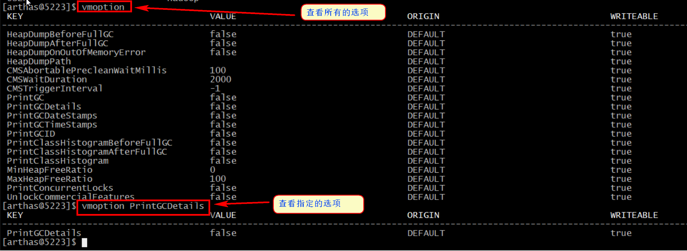

``` shell
更新指定的选项
vmoption PrintGCDetails true

```

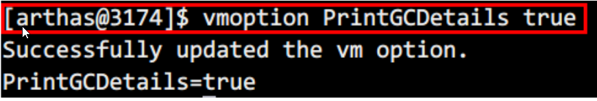


## 7- getstatic

### 7-1 作用

- 通过getstatic命令可以方便的查看类的静态属性

### 7-2 语法

- getstatic 类名 属性名

### 7-3 举例

``` shell
显示demo.MathGame类中静态属性random
getstatic demo.MathGame random
```

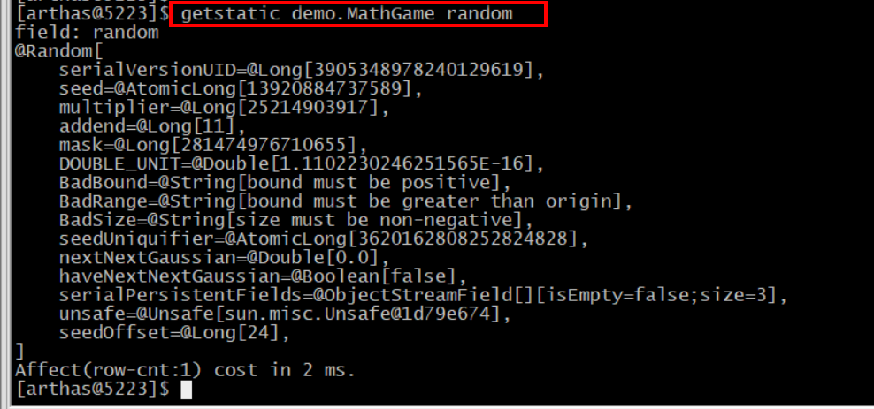

## 8- ognl

### 8-1 作用

- 执行ognl表达式，这是从3.0.5版本新增的功能

### 8-2 参数说明

| 参数名称 | 参数说明                                                     |
| -------- | ------------------------------------------------------------ |
| express  | 执行的表达式                                                 |
| [c:]     | 执行表达式的 ClassLoader 的 hashcode，默认值是SystemClassLoader |
| [x]      | 结果对象的展开层次，默认值1                                  |
|          |                                                              |

### 8-3 举例

``` shell
调用静态函数
ognl '@java.lang.System@out.println("hello")'
获取静态类的静态字段
ognl '@demo.MathGame@random'
执行多行表达式，赋值给临时变量，返回一个List
ognl '#value1=@System@getProperty("java.home"),
#value2=@System@getProperty("java.runtime.name"), {#value1, #value2}'

```


## 9- 总结

| 命令      | 说明 |
| --------- | ---- |
| dashboard |      |
| thread    |      |
| jvm       |      |
| sysprop   |      |
| sysenv    |      |
| vmoption  |      |
| getstatic |      |
| ognl      |      |
|           |      |
|           |      |

