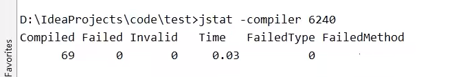

# Jstat

## 作用

- 监视虚拟机各种运行状态信息；
  - 进程中的类装载、内存、垃圾收集、JIT编译等运行数据；


## 第一个参数常用参数

- class : 类加载器统计信息

  

  - Loaded:已加载的类数；
  - Bytes:加载的kB数；
  - Unloaded：卸载的类数；
  - Bytes: 卸载的KB数；
  - Time:执行类加载和卸载操作所花费的时间；

- compiler： java HotSpot VM即时编译器统计信息

  

  - Compiled:执行的编译任务数；
  - Failed: 编译任务数失败；
  - Invalid: 无效的编译任务数；
  - Time:执行编译任务所花费的时间；
  - FailedType:上次失败的编译的编译类型；
  - FailedMethod: 上次失败的编译的类名和方法；

- gc : 垃圾收集的堆统计信息

  - 设置JVM参数

  ```properties
  -Xms20M -Xmx20M -Xmn10M --XX:+UseSerialGC --XX:+PrintGcDetails verbose:gc
  # -Xms20M
  	指定堆的最小容量
  # -Xmx20M
  	指定堆的最大容量(最大容量 == 最小容量 表示指定了堆的大小)
  # -Xmn10M
  	指定年轻代的大小
  # --XX:+UseSerialGC
  	指定垃圾收集器
  # --XX:+PrintGcDetails verbose:gc
  	打印GC的详细信息
  	
  ```

  样例：

  

  - S0C:当前幸存者空间0容量（kB）

  - S1C:当前生存空间1的容量（kB）

  - S0U:幸存者空间0使用大小（kB）

  - S1U:幸存者空间1使用大小（kB）

  - EC: E 电源区容量(kB)

  - EU：E 电源区内存的占用(kB)

  - OC : 当前老年代容量(kB)

  - OU : 老年代使用大小(kB)

  - MC: 元空间容量(kB)

  - MU:元空间使用大小(kB)

  - CCSC ：压缩的类空间容量(kB)

  - CCSU:  使用的压缩类空间(kB)

  - YGC ： Young GC次数

  - YGCT : Young GC时间

  - FGC ： Full GC 次数

  - FGCT：Full GC时间

  - GCT:总垃圾收集时间

    

- -gcutil

  

  


## 第二个参数

- 如果本地虚拟机进程，vmid和本地虚拟机唯一ID是一致的；

## 第三个参数

- 采样间隔，单位为秒（s）或者毫秒(ms);
- 默认单位是毫秒，必须为正整数；
- 指定后，该jstat命令讲在每个间隔产生器输出


## 第四个参数

- 要显示的样本数；


## 注意： 

- 参数interval 和 count 代表查询间隔和次数；
- 如果省略这两个参数，说明只查询一次；
- 如：查询一次进程8888的垃圾情况；
  - jstat -gc 8888


