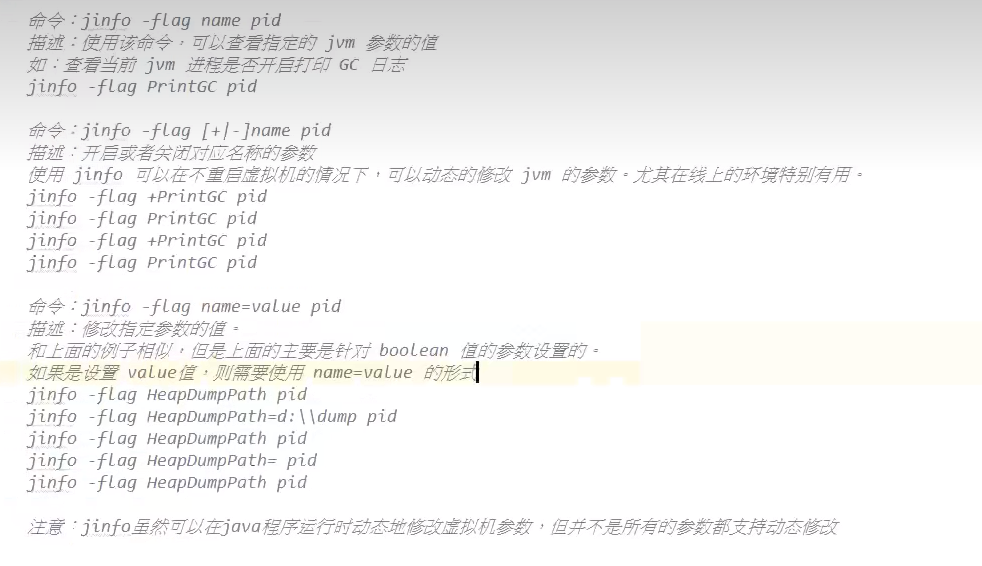
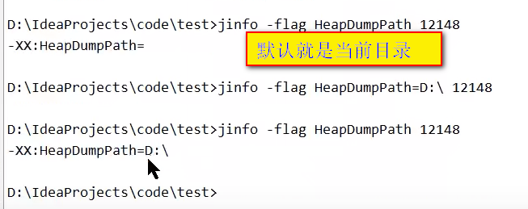

# Jinfo

## 1- 作用：

- 实时的查看和调整虚拟机各项参数；

## 2- 命令格式

jinfo [options] <pid>

## 3- 参数解释

- no option : 输出全部的**参数**和系统**属性**；
- -flag name ： 输出对应名称的**参数**；
- -flag [+|-] name : 开启或者关闭对应名称的**参数**；
- -flag name = value : 设定对应名称的**参数**；
- -flags : 输出全部的**参数**；
- -sysprops : 输出**系统属性**；

## 4- 演示

- **注意：** *`jinfo虽然可以在java程序运行时动态地修改虚拟机参数，但并不是所有的参数都支持动态修改；`*

- jinfo pid

  - 输出当前jvm进程的全部参数和系统属性；

- jinfo -flags pid 

  - 输出全部的虚拟机参数；

- jinfo -sysprops pid

  - 输出虚拟机进程全部的系统属性；

- jinfo -flag name pid 

  - 使用该命令可以查看指定的jvm参数的值；
  - 如：查看当前jvm进程是否开启打印 GC日志；
  - jinfo -flag PrintGC pid;

- jinfo -flag [+|-]name pid  (**只用于boolean 类型的参数**)

  - 开启或者关闭对应名称的参数；
  - 使用jinfo可以在**不重启虚拟机的情况下**，可以动态的修改jvm的参数，尤其在线上的环境特别有用；
  - 如：
    - jinfo -flag +PrintGC pid
    - jinfo -flag PrintGC pid
    - jinfo -flag -PrintGC pid
    - jinfo -flag PrintGC pid

- jinfo -flag name = value pid

  - 修改指定参数的值;
  - 如果设置value值，则需要使用 name = value 的形式
  - 如：
    - jinfo -flag HeapDumpPath pid
    - jinfo -flag HeapDumpPath=d:\\dump pid
    - jinfo -flag HeapDumpPath pid
    - jinfo -flag HeapDumpPath= pid
    - jinfo -flag HeapDumpPath pid

- jinfo -flag HeapDumpPath pid 

  - 保存一个HeapDump文件，保存在哪个目录下；

  - 默认当前目录

  - HeapDumpPath=路径    指定dump文件保存在哪里

    

