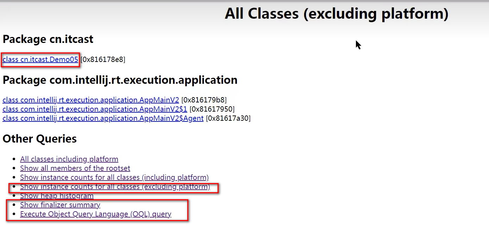

# Jhat

## 1- 作用

- 与jmap搭配使用来分析jmap 生成的堆转储快照；
- jhat内置了一个微型的http/html服务器；
- 生成dump文件的分析结果后可以使用浏览器查看；
- **注意**： 
  - **这个工具一般除非实在没有其它工具，否则不会使用**。
  - 原因1： 一般不会在部署应用程序的服务器上直接分析dump文件；即使可以这样做，也会尽量将dump文件拷贝到其它机器上进行分析，**因为分析工作是一个耗时耗资源的过程**。既然都要在其它机器上进行，就没有必要受到命令工具的限制了；
  - 原因2：jhat的分析功能相对来说比较简陋，其它有较好的替代工具，比如：**VisualVM**,以及专业用于分析dump文件的 Eclipse Memory Analyzer,IBM HeapAnalyzer等工具都能实现笔jhat更强大更专业的分析能力；

## 2- 命令格式

- jhat [options] 堆转储文件

## 3- 参数解释

- -port ： 设置jhat HTTP server 的端口号，默认值： 7000

## 4- 命令演示

- jhat D:\jmap.bin 
  - 通过 http://ip:7000访问；
  - 如果dump文件很大，在启动时会报堆空间不足；
  - 可加堆内存参数 jhat -J-Xmx512m dump文件 ;

