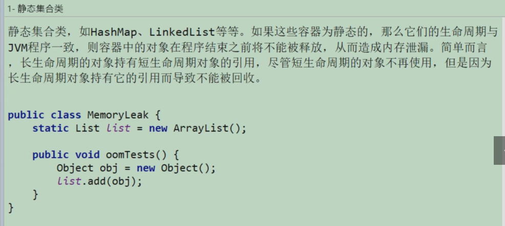
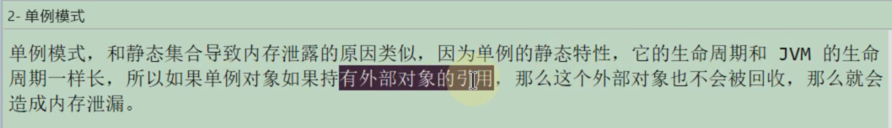
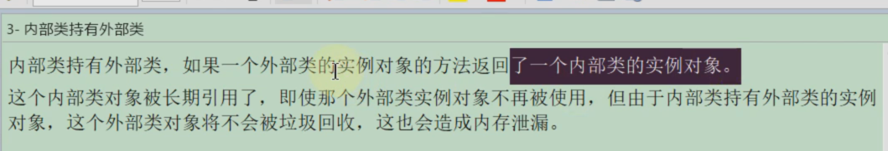
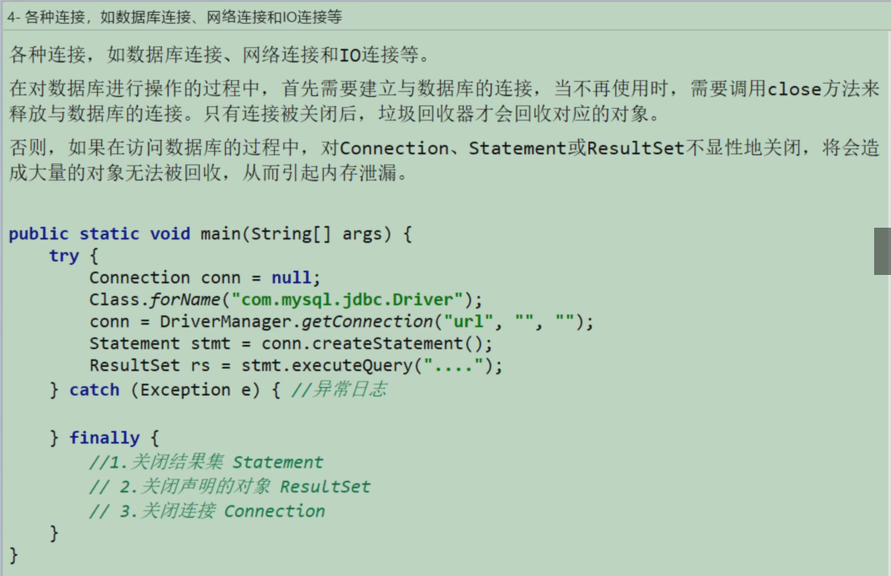
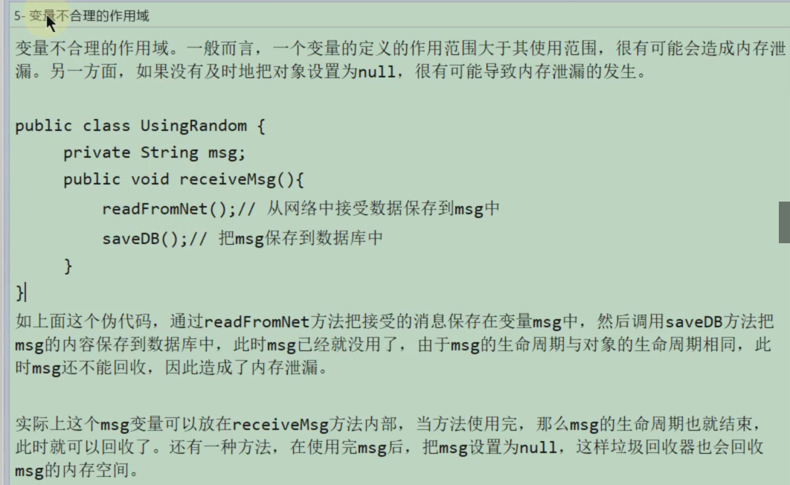
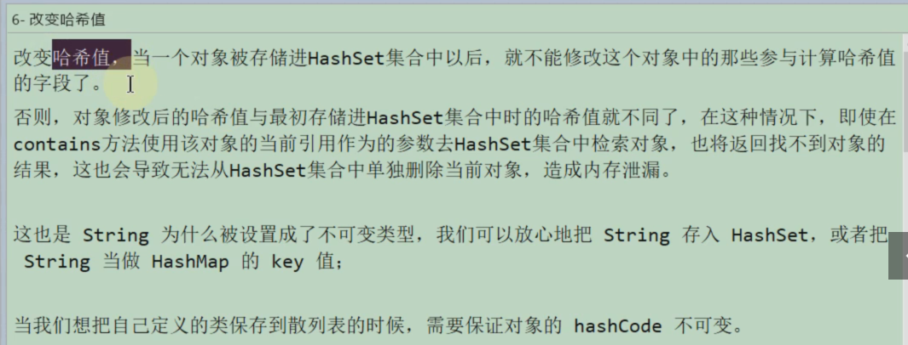
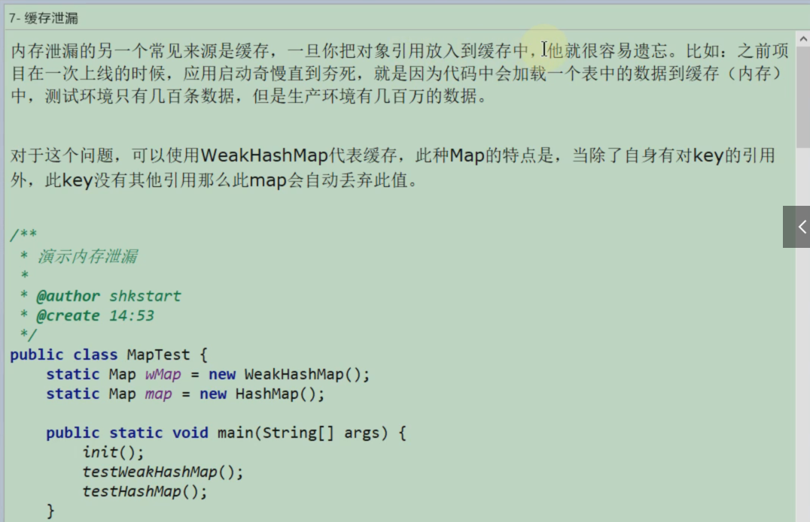
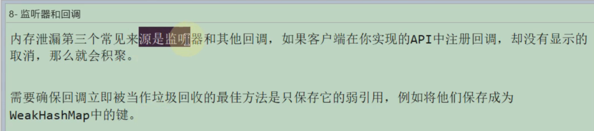

# 1- 静态集合类




# 2- 单例模式




# 3- 内部类持有外部类



# 4- 各种连接，数据库连接，网络/IO连接



# 5- 变量不合理的作用域



# 6- 改变哈希值



- 代码样例1

```java
package com.atguigu.memoryleak;

import java.util.HashSet;

/**
 * 演示内存泄漏
 *
 * @author shkstart
 * @create 14:43
 */
public class ChangeHashCode {
    public static void main(String[] args) {
        HashSet set = new HashSet();
        Person p1 = new Person(1001, "AA");
        Person p2 = new Person(1002, "BB");

        set.add(p1);
        set.add(p2);

        p1.name = "CC";//导致了内存的泄漏
        set.remove(p1); //删除失败

        System.out.println(set);

        set.add(new Person(1001, "CC"));
        System.out.println(set);

        set.add(new Person(1001, "AA"));
        System.out.println(set);

    }
}

class Person {
    int id;
    String name;

    public Person(int id, String name) {
        this.id = id;
        this.name = name;
    }

    @Override
    public boolean equals(Object o) {
        if (this == o) return true;
        if (!(o instanceof Person)) return false;

        Person person = (Person) o;

        if (id != person.id) return false;
        return name != null ? name.equals(person.name) : person.name == null;
    }

    @Override
    public int hashCode() {
        int result = id;
        result = 31 * result + (name != null ? name.hashCode() : 0);
        return result;
    }

    @Override
    public String toString() {
        return "Person{" +
                "id=" + id +
                ", name='" + name + '\'' +
                '}';
    }
}
```

- 代码样例2

```java
package com.atguigu.memoryleak;

import java.util.HashSet;

/**
 * 演示内存泄漏
 * @author shkstart
 * @create 14:47
 */
public class ChangeHashCode1 {
    public static void main(String[] args) {
        HashSet<Point> hs = new HashSet<Point>();
        Point cc = new Point();
        cc.setX(10);//hashCode = 41
        hs.add(cc);

        cc.setX(20);//hashCode = 51  此行为导致了内存的泄漏

        System.out.println("hs.remove = " + hs.remove(cc));//false
        hs.add(cc);
        System.out.println("hs.size = " + hs.size());//size = 2

        System.out.println(hs);
    }

}

class Point {
    int x;

    public int getX() {
        return x;
    }

    public void setX(int x) {
        this.x = x;
    }

    @Override
    public int hashCode() {
        final int prime = 31;
        int result = 1;
        result = prime * result + x;
        return result;
    }

    @Override
    public boolean equals(Object obj) {
        if (this == obj) return true;
        if (obj == null) return false;
        if (getClass() != obj.getClass()) return false;
        Point other = (Point) obj;
        if (x != other.x) return false;
        return true;
    }

    @Override
    public String toString() {
        return "Point{" +
                "x=" + x +
                '}';
    }
}

```


# 7- 缓存泄漏



- 代码样例

```java
package com.atguigu.memoryleak;

import java.util.HashMap;
import java.util.Map;
import java.util.WeakHashMap;
import java.util.concurrent.TimeUnit;

/**
 * 演示内存泄漏
 *
 * @author shkstart
 * @create 14:53
 */
public class MapTest {
    static Map wMap = new WeakHashMap();
    static Map map = new HashMap();

    public static void main(String[] args) {
        init();
        testWeakHashMap();
        testHashMap();
    }

    public static void init() {
        String ref1 = new String("obejct1");
        String ref2 = new String("obejct2");
        String ref3 = new String("obejct3");
        String ref4 = new String("obejct4");
        wMap.put(ref1, "cacheObject1");
        wMap.put(ref2, "cacheObject2");
        map.put(ref3, "cacheObject3");
        map.put(ref4, "cacheObject4");
        System.out.println("String引用ref1，ref2，ref3，ref4 消失");

    }

    public static void testWeakHashMap() {

        System.out.println("WeakHashMap GC之前");
        for (Object o : wMap.entrySet()) {
            System.out.println(o);
        }
        try {
            System.gc();
            TimeUnit.SECONDS.sleep(5);
        } catch (InterruptedException e) {
            e.printStackTrace();
        }
        System.out.println("WeakHashMap GC之后");
        for (Object o : wMap.entrySet()) {
            System.out.println(o);
        }
    }

    public static void testHashMap() {
        System.out.println("HashMap GC之前");
        for (Object o : map.entrySet()) {
            System.out.println(o);
        }
        try {
            System.gc();
            TimeUnit.SECONDS.sleep(5);
        } catch (InterruptedException e) {
            e.printStackTrace();
        }
        System.out.println("HashMap GC之后");
        for (Object o : map.entrySet()) {
            System.out.println(o);
        }
    }

}
/**
 * 结果
 * String引用ref1，ref2，ref3，ref4 消失
 * WeakHashMap GC之前
 * obejct2=cacheObject2
 * obejct1=cacheObject1
 * WeakHashMap GC之后
 * HashMap GC之前
 * obejct4=cacheObject4
 * obejct3=cacheObject3
 * Disconnected from the target VM, address: '127.0.0.1:51628', transport: 'socket'
 * HashMap GC之后
 * obejct4=cacheObject4
 * obejct3=cacheObject3
 **/

```


# 8- 监听器和回调




# 9- 内存泄漏案例

## 9-1 Stack案例

- 代码

```java
package com.atguigu.memoryleak;

import java.util.Arrays;
import java.util.EmptyStackException;

/**
 * @author shkstart
 * @create 15:05
 */
public class Stack {
    private Object[] elements;
    private int size = 0;
    private static final int DEFAULT_INITIAL_CAPACITY = 16;

    public Stack() {
        elements = new Object[DEFAULT_INITIAL_CAPACITY];
    }

    public void push(Object e) { //入栈
        ensureCapacity();
        elements[size++] = e;
    }
    //存在内存泄漏
//    public Object pop() { //出栈
//        if (size == 0)
//            throw new EmptyStackException();
//        return elements[--size];
//    }

    public Object pop() {
        if (size == 0)
            throw new EmptyStackException();
        Object result = elements[--size];
        elements[size] = null;
        return result;
    }

    private void ensureCapacity() {
        if (elements.length == size)
            elements = Arrays.copyOf(elements, 2 * size + 1);
    }
}

```


