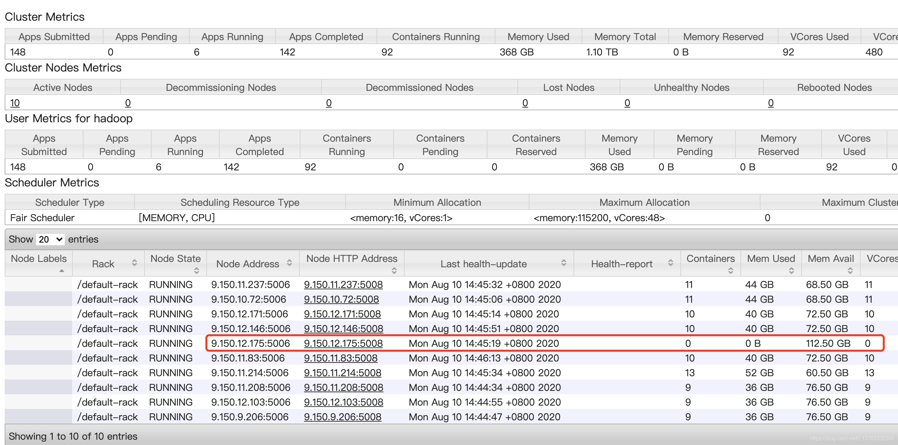
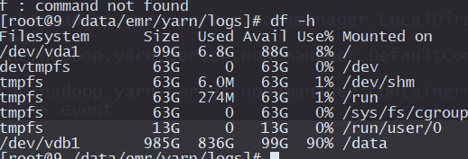

- 报错1

  - 信息：org.apache.flink.runtime.io.network.netty.exception.RemoteTransportException: Connection unexpectedly closed by remote task manager '/**9.150.12.175:39365**'. This might indicate that the remote task manager was lost.
    

  - 原因：一般常见的是内存不足、磁盘空间不足，或者其他问题。 

    

     

    

- 