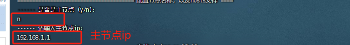

## 目录结构

```
/
├── services                    服务构建文件和配置文件目录
│   ├── nginx                   Nginx 配置文件目录
│   ├── redis                   Redis 数据目录
├── sh                          脚本存放目录
├── logs                        日志目录
├── yaml                        (configmap,service,deployment).yaml
├── www                         项目代码目录
└── local-k8s.sh                Kubernetes 集群服务创建脚本
```

## 1. 环境准备

#### 1. 本地安装

- VMware
- Centos 镜像下载 [CentOS-7-x86_64-Minimal-2009.iso](https://gitee.com/link?target=https%3A%2F%2Fmirrors.aliyun.com%2Fcentos%2F7.9.2009%2Fisos%2Fx86_64%2FCentOS-7-x86_64-Minimal-2009.iso)
- FinalShell SSH工具 [finalshell_install.exe](https://gitee.com/link?target=http%3A%2F%2Fwww.hostbuf.com%2Fdownloads%2Ffinalshell_install.exe)

#### 2. 环境准备

###### 2.1 创建三台虚拟机

| 角色   | 节点   | ip          |
| ------ | ------ | ----------- |
| master | master | 192.168.1.1 |
| node01 | node1  | 192.168.1.2 |
| node02 | node2  | 192.168.1.3 |

###### 2.2 配置虚拟机网络、内存、网络适配器

 

###### 2.3 设置静态网络ip

 

###### 2.4 设置主机名(节点名称) 虚拟机内可通过 `hostnamectl set-hostname node` 更改


###### 2.5 虚拟机共享文件目录设置


###### 2.6 开启sshd 服务，finalshell 远程连接

`yum install sshd -y && systemctl start sshd`

###### 2.7 配置/etc/hosts

```
127.0.0.1   localhost  localhost6.localdomain6
192.168.1.1 master
192.168.1.2 node1
192.168.1.3 node1
```

###### 2.8 设置win主机与虚拟机文件共享

- Linux 虚拟机中使用 Open VM Tools [官方文档说明](https://gitee.com/link?target=https%3A%2F%2Fdocs.vmware.com%2Fcn%2FVMware-Workstation-Pro%2F16.0%2Fcom.vmware.ws.using.doc%2FGUID-08BB9465-D40A-4E16-9E15-8C016CC8166F.html)
- 安装 open-vm-tools `yum install open-vm-tools && reboot` 

## 3. [local-k8s.sh](https://gitee.com/dev-linhu/local-k8s/raw/master/local-k8s.sh) 脚本使用

###### 3.1 master节点创建

- 运行脚本

```
chmod +x local-k8s.sh && ./local-k8s.sh
```

- 节点类型选择、masterip设置 
- master创建成功
- node注册命令

```
kubeadm join 192.168.100.251:6443 --token {token} --discovery-token-ca-cert-hash sha256:{sign} 
```

- token过期, master重新生成

```
 kubeadm token create &&  openssl x509 -pubkey -in /etc/kubernetes/pki/ca.crt | openssl rsa -pubin -outform der 2>/dev/null | openssl dgst -sha256 -hex | sed 's/^.* //'
```


###### 3.2 node节点创建

- 运行脚本

```
chmod +x local-k8s.sh && ./local-k8s.sh
```



- 复制master /etc/kubernetes/admin.conf 到node /etc/kubernetes 下
- 
- 注册 `kubeadm join 192.168.100.251:6443 --token {token} --discovery-token-ca-cert-hash sha256:{sign}`
- 查看node STATUS ? Ready `kubectl get nodes`

## 4. 常用命令

- journalctl

```
 journalctl -f -u kubelet  
 journalctl -f -u docker
```

- Docker

```
# docker系统操作
# 启动、关闭、重启docker
systemctl start docker
systemctl stop docker
systemctl restart docker
# 设置docker开机自启动
systemctl enable docker

# 为镜像打标签
docker tag imageName:imageTag IP:Port/tagedImageName:tagedImageTag
# 向私有仓库推送镜像
docker push IP:Port/tagedImageName:tagedImageTag

# 查看正在运行的容器
docker ps
# 查看所有容器
docker ps -a
```

- Kubernetes

```
# 查看节点
kubectl get nodes

#查看pod的具体运行情况
kubectl describe pod {podid} -n heu  

# 进入容器
kubectl exec -it {podid} -n heu /bin/bash

# 删除所有
kubectl delete deployment --all -n heu
kubectl delete service --all -n heu
kubectl delete configmap --all -n heu
```