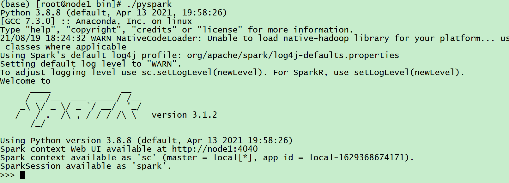
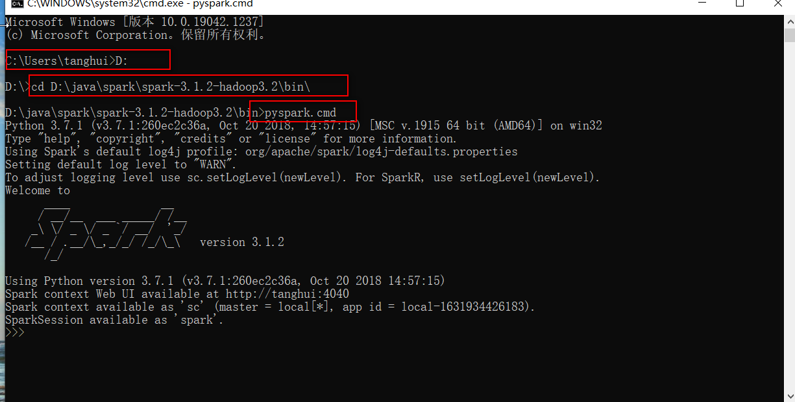
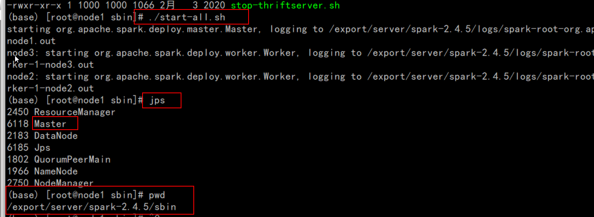
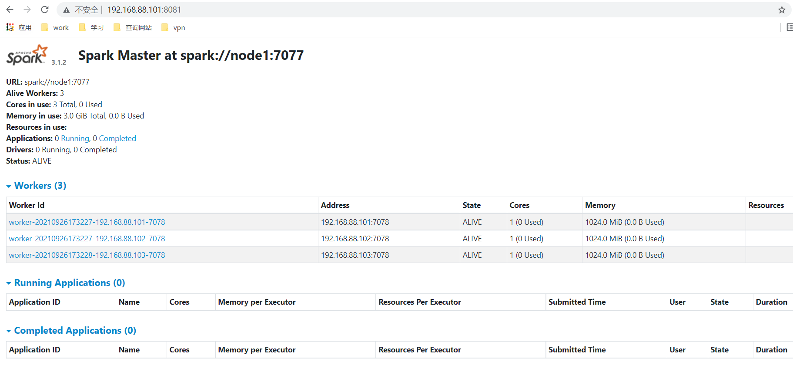
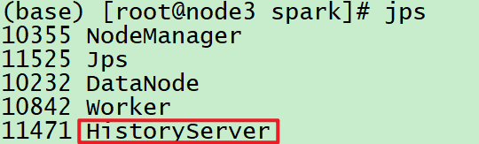
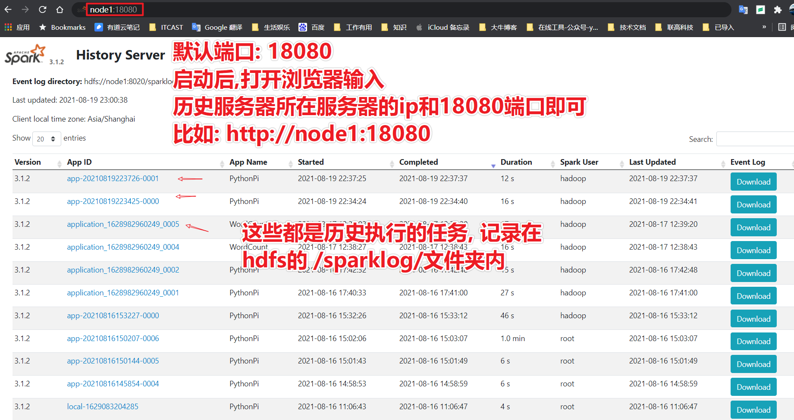

## 集群


### Hadoop 集群

| 主机组件          | node1(192.168.88.161) | node2(192.168.88.162) | node3(192.168.88.163) |
| ----------------- | --------------------- | --------------------- | --------------------- |
| NameNode          | 是                    | 否                    | 否                    |
| SecondaryNamenode | 否                    | 是                    | 否                    |
| DataNode          | 是                    | 是                    | 是                    |
| ResourceManager   | 是                    | 否                    | 否                    |
| NodeManager       | 是                    | 是                    | 是                    |
| Historyserver     | 否                    | 否                    | 是                    |
|                   |                       |                       |                       |

### Hadoop 高可用集群

|             | node1       | node2           | node3            |
| ----------- | ----------- | --------------- | ---------------- |
| zookeeper   | zk          | zk              | zk               |
| HDFS        | JournalNode | JournalNode     | JournalNode      |
| NameNode    | NameNode    |                 |                  |
| ZKFC        | ZKFC        |                 |                  |
| DataNode    | DataNode    | DataNode        |                  |
| YARN        |             | ResourceManager | ResourceManager  |
| NodeManager | NodeManager | NodeManager     |                  |
| MapReduce   |             |                 | JobHistoryServer |

### Hadoop + Hive 集群

| 主机组件            | node1(192.168.88.161) | node2(192.168.88.162) | node3(192.168.88.163) |
| ------------------- | --------------------- | --------------------- | --------------------- |
| NameNode            | 是                    | 否                    | 否                    |
| SecondaryNamenode   | 否                    | 是                    | 否                    |
| DataNode            | 是                    | 是                    | 是                    |
| ResourceManager     | 是                    | 否                    | 否                    |
| NodeManager         | 是                    | 是                    | 是                    |
| Historyserver       | 否                    | 否                    | 是                    |
| Hive                | 是                    | 是                    | 是                    |
| Hive（Mysql）       | 否                    | 否                    | 是                    |
| Hive（metastore）   | 否                    | 否                    | 是                    |
| Hive（hiveserver2） | 否                    | 否                    | 是                    |
|                     |                       |                       |                       |
|                     |                       |                       |                       |


### Hadoop+Hive+HBase+HBase+Spark高可用集群

| 主机组件                     | node1(192.168.88.161) | node2(192.168.88.162) | node3(192.168.88.163) |
| ---------------------------- | --------------------- | --------------------- | --------------------- |
| NameNode                     | 是                    | 否                    | 否                    |
| SecondaryNamenode            | 否                    | 是                    | 否                    |
| DataNode                     | 是                    | 是                    | 是                    |
| ResourceManager              | 是                    | 否                    | 否                    |
| NodeManager                  | 是                    | 是                    | 是                    |
| Historyserver                | 否                    | 否                    | 是                    |
| Hive                         | 是                    | 是                    | 是                    |
| Hive（Mysql）                | 否                    | 否                    | 是                    |
| Hive（metastore）            | 否                    | 否                    | 是                    |
| Hive（hiveserver2）          | 否                    | 否                    | 是                    |
| Hbase(HMaster)               | 是                    | 否                    | 否                    |
| Hbase(HRegionServer)         | 是                    | 是                    | 是                    |
| Hbase高可用（HMaster）       | 是                    | 是                    | 是                    |
| Hbase高可用（HRegionServer） | 是                    | 是                    | 是                    |
| SparkMaster                  | 是                    | 否                    | 否                    |
| Sparkworker                  | 否                    | 是                    | 是                    |


## 各个组件启动命令

### zookeeper

#### 三台机器分别启动zookeeper服务

- 这个命令三台机器都要执行

``` shell
/export/server/zookeeper-3.4.6/bin/zkServer.sh start
```

- 三台主机分别查看启动状态


``` shell
/export/server/zookeeper-3.4.6/bin/zkServer.sh  status
```

- 停止命令


``` shell
/export/server/zookeeper-3.4.6/bin/zkServer.sh stop
```

- 查看版本命令


``` shell
[root@node1 ~]# /export/server/zookeeper-3.4.6/bin/zkServer.sh  -version
JMX enabled by default
Using config: /export/server/zookeeper-3.4.6/bin/../conf/zoo.cfg
Usage: /export/server/zookeeper-3.4.6/bin/zkServer.sh {start|start-foreground|stop|restart|status|upgrade|print-cmd}
[root@node1 ~]# 
```


#### 自定义脚本一键启动

``` sql
start-zookeepers 
```

- 脚本

``` shell
#!/bin/bash

## 所有zookeeper 服务列表
myArrNodes=("node1" "node2" "node3")

echo "欢迎使用一键安装zookeeper集群"
PS3="Please enter you choice:"
select operation in "start" "status" "stop"
do
	case ${operation} in 
	"start")
		echo "you have chose "${operation}
		;;
		
	"status")
		echo "you have chose "${operation}
		;;
		
	"stop")
		echo "you have chose "${operation}
		;;
		
	*)
		echo "You have chose error , Please try again!"
		continue
		;;
		
	esac

break;
done

echo "*****************${operation}*****************"

# source /etc/profile 命令
commandSource="source /etc/profile"

# ZK 命令
commandZKServer="zkServer.sh"

# 判断环境变量中是否有ZK的命令
if ! grep "ZOOKEEPER_HOME" /etc/profile
then
	# 如果没有配置环境变量需要使用全路径执行命令
	commandZKServer="/export/server/zookeeper-3.4.6/bin/"${commandZKServer}
fi

# 遍历所有服务并执行命令
for node in ${myArrNodes[@]} 
do 
	ssh ${node} "${commandSource} ; ${commandZKServer} ${operation}"	
	echo "----------${operation} ${node} ok----------"
done

echo "*****************end ${operation}*****************"


```


### Hadoop

#### 单节点逐个启动

- 在node1主机上使用以下命令启动HDFS NameNode：

``` shell
hadoop-daemon.sh start namenode
```

- 在node1、node2、node3三台主机上，分别使用以下命令启动HDFS DataNode：

``` shell
hadoop-daemon.sh start datanode
```

- 在node1主机上使用以下命令启动YARN ResourceManager：

``` shell
yarn-daemon.sh  start resourcemanager
```

- 在node1、node2、node3三台主机上使用以下命令启动YARN nodemanager：

``` shell
yarn-daemon.sh start nodemanager
```

以上脚本位于/export/server/hadoop-2.7.5/sbin目录下。如果想要停止某个节点上某个角色，只需要把命令中的 **start** 改为 **stop** 即可。

#### 脚本启动 hdfs  、 yarn 和 historyserver

- 启动、关闭HDFS

``` shell
start-dfs.sh
stop-dfs.sh
```

- 启动、关闭Yarn

``` shell
start-yarn.sh
stop-yarn.sh
```

- 启动、关闭历史任务服务进程

``` shell
mr-jobhistory-daemon.sh start historyserver
mr-jobhistory-daemon.sh stop historyserver
```

#### 一键启动、关闭hdfs和yarn

注意： **这两个命令可以一键启动HDFS和 YARN , 但是无法启动 启动历史任务服务进程**

- 启动 start-all.sh

``` shell
[root@node1 bin]# start-all.sh
This script is Deprecated. Instead use start-dfs.sh and start-yarn.sh
Starting namenodes on [node1]
node1: starting namenode, logging to /export/server/hadoop-2.7.5/logs/hadoop-root-namenode-node1.out
node1: starting datanode, logging to /export/server/hadoop-2.7.5/logs/hadoop-root-datanode-node1.out
node3: starting datanode, logging to /export/server/hadoop-2.7.5/logs/hadoop-root-datanode-node3.out
node2: starting datanode, logging to /export/server/hadoop-2.7.5/logs/hadoop-root-datanode-node2.out
Starting secondary namenodes [node2]
node2: starting secondarynamenode, logging to /export/server/hadoop-2.7.5/logs/hadoop-root-secondarynamenode-node2.out
starting yarn daemons
starting resourcemanager, logging to /export/server/hadoop-2.7.5/logs/yarn-root-resourcemanager-node1.out
node3: starting nodemanager, logging to /export/server/hadoop-2.7.5/logs/yarn-root-nodemanager-node3.out
node2: starting nodemanager, logging to /export/server/hadoop-2.7.5/logs/yarn-root-nodemanager-node2.out
node1: starting nodemanager, logging to /export/server/hadoop-2.7.5/logs/yarn-root-nodemanager-node1.out
[root@node1 bin]# 

```


- 关闭 stop-all.sh

``` shell
[root@node1 bin]# stop-all.sh
This script is Deprecated. Instead use stop-dfs.sh and stop-yarn.sh
Stopping namenodes on [node1]
node1: stopping namenode
node1: stopping datanode
node3: stopping datanode
node2: stopping datanode
Stopping secondary namenodes [node2]
node2: stopping secondarynamenode
stopping yarn daemons
stopping resourcemanager
node1: stopping nodemanager
node3: stopping nodemanager
node2: stopping nodemanager
no proxyserver to stop
```


#### 启动yarn historyserver

``` properties
mr-jobhistory-daemon.sh start historyserver
mr-jobhistory-daemon.sh stop historyserver
```


#### yarn 查看日志：

``` properties
http://node1:8088/cluster
```


点击<font color='red'>ID</font> - >点击<font color='red'>logs</font> -> 点击<font color='red'>here</font>


### kafka

#### 启动kafka集群: 

``` shell
cd /export/server/kafka_2.12-2.4.1/bin
	./kafka-server-start.sh ../config/server.properties
```


#### 一键化启动脚本: 

- **start-kafkas**

``` shell
[root@node1 shell]# start-kafkas 
欢迎使用一键安装kafka集群
1) start
2) stop
Please enter you choice:1
you have chose start
*****************start*****************
kafka-server-start.sh
----------------------------- start kafka ----------------------------
node1 : nohup kafka-server-start.sh /export/server/kafka_2.12-2.4.1/config/server.properties >/dev/nul* 2>&1 & 
----------start node1 ok----------
node2 : nohup kafka-server-start.sh /export/server/kafka_2.12-2.4.1/config/server.properties >/dev/nul* 2>&1 & 
----------start node2 ok----------
node3 : nohup kafka-server-start.sh /export/server/kafka_2.12-2.4.1/config/server.properties >/dev/nul* 2>&1 & 
----------start node3 ok----------
************************************end start all node*******************************
[root@node1 shell]# 
```


- 脚本

``` shell

#!/bin/bash

## 所有 kafka 服务列表
myArrNodes=("node1" "node2" "node3")

#kafkaPath="/export/server/kafka_2.12-2.4.1/"
kafkaServerProperties=${KAFKA_HOME}"/config/server.properties"

echo "欢迎使用一键安装kafka集群"
PS3="Please enter you choice:"
select operation in "start" "stop"
do
	case ${operation} in 
	"start")
		echo "you have chose "${operation}
		;;
		
		
	"stop")
		echo "you have chose "${operation}
		;;
		
	*)
		echo "You have chose error , Please try again!"
		continue
		;;
		
	esac

break;
done

echo "*****************${operation}*****************"

# source /etc/profile 命令
commandSource="source /etc/profile"

# kafka 命令
commandKafkaServer="kafka-server-"${operation}".sh"

echo ${commandKafkaServer}

# 判断是 start 还是 stop 
if [ ${operation} = "start" ] ;then 
	## 启动 kafka
	echo "----------------------------- start kafka ----------------------------"
	
	startKafkaServerCommand="nohup ${commandKafkaServer} ${kafkaServerProperties} >/dev/nul* 2>&1 & "
	
	
	# 遍历所有服务并执行命令
	for node in ${myArrNodes[@]} 
	do 
		echo "${node} : ${startKafkaServerCommand}"
		ssh ${node} "${commandSource} ; export JMX_PORT=9988; ${startKafkaServerCommand}"	
		sleep 1
		echo "----------${operation} ${node} ok----------"
	done


elif [ ${operation} = "stop" ] ; then 
		
	echo "----------------------------- stop kafka ----------------------------"
	
	# 遍历所有服务并执行命令
	for node in ${myArrNodes[@]} 
	do 
		echo "${node} : ${commandKafkaServer}"
		ssh ${node} "${commandSource} ; ${commandKafkaServer}"	
		sleep 1
		echo "----------${operation} ${node} ok----------"
		
	done
	
else	
	## 目录不存在
	echo "error! "
	
fi

echo "************************************end ${operation} all node*******************************"


```


### Hive

- <font color='red'>注意: hive 启动需要依赖hadoop</font>

#### 第一种交互方式：hive命令

- 先启动两个服务

```shell
nohup /export/server/hive-2.1.0/bin/hive --service metastore &

nohup /export/server/hive-2.1.0/bin/hive --service hiveserver2 &

或者
nohup /export/server/hive/bin/hive --service metastore &
nohup /export/server/hive/bin/hive --service hiveserver2 &

```

- 进入hive安装包启动hive

``` shell
[root@node3 ~]# cd /export/server/hive-2.1.0/
[root@node3 ~]# hive
which: no hbase in (:/export/server/hive-2.1.0/bin::/export/server/hadoop-2.7.5/bin:/export/server/hadoop-2.7.5/sbin::/export/shell/bin::/export/server/zookeeper-3.4.6/bin::/export/server/jdk1.8.0_241/bin:/usr/local/sbin:/usr/local/bin:/usr/sbin:/usr/bin:/export/server/mysql-5.7.29/bin:/root/bin)
SLF4J: Class path contains multiple SLF4J bindings.
SLF4J: Found binding in [jar:file:/export/server/hive-2.1.0/lib/hive-jdbc-2.1.0-standalone.jar!/org/slf4j/impl/StaticLoggerBinder.class]
SLF4J: Found binding in [jar:file:/export/server/hive-2.1.0/lib/log4j-slf4j-impl-2.4.1.jar!/org/slf4j/impl/StaticLoggerBinder.class]
SLF4J: Found binding in [jar:file:/export/server/hadoop-2.7.5/share/hadoop/common/lib/slf4j-log4j12-1.7.10.jar!/org/slf4j/impl/StaticLoggerBinder.class]
SLF4J: See http://www.slf4j.org/codes.html#multiple_bindings for an explanation.
SLF4J: Actual binding is of type [org.apache.logging.slf4j.Log4jLoggerFactory]

Logging initialized using configuration in jar:file:/export/server/hive-2.1.0/lib/hive-common-2.1.0.jar!/hive-log4j2.properties Async: true
Hive-on-MR is deprecated in Hive 2 and may not be available in the future versions. Consider using a different execution engine (i.e. spark, tez) or using Hive 1.X releases.
hive> show databases;  # 查看所有数据库
OK
default
didi
myhive
Time taken: 0.536 seconds, Fetched: 3 row(s)
hive> 

```


#### 第二种交互方式：hive -e 或 hive -f

##### hive -e

``` shell
cd /export/server/hive-2.1.0/
bin/hive -e "create database mytest2"  # 创建一个数据库
```


##### hive -f

- 我们可以将我们的hql语句写成一个sql脚本然后执行

``` shell
cd /export/server
vim  hive.sql
```

- hive.sql内容

``` sql
create database mytest3;
use mytest3;
create table stu(id int , name string);
insert into stu values(1,"Tom");

```

- 通过hive -f  来执行我们的sql脚本

``` shell
[root@node3 bin]# hive -f ./hive.sql 
```


#### 第三种交互方式：Beeline Client

``` properties
方式一：交互式命令行（CLI）
	bin/hive，编写SQL语句及DDL语句

方式二：启动服务HiveServer2（Hive ThriftServer2)
	将Hive当做一个服务启动(类似MySQL数据库，启动一个服务)，端口为10000
	1)、交互式命令行，bin/beeline，CDH 版本HIVE建议使用此种方式，CLI方式过时
	2)、JDBC/ODBC方式，类似MySQL中JDBC/ODBC方式

```


- hive经过发展，推出了第二代客户端beeline，但是beeline客户端不是直接访问metastore服务的，而是需要单独启动hiveserver2服务 ;

- hiveserver2 提供了 一个服务thrift, **默认端口是10000**。(hiveserver2: thrift:10000端口)

  

- 在node1的/export/server/hadoop-2.7.5/etc/hadoop目录下，修改core-site.xml，在该文件中添加以下配置,实现用户代理:

``` xml
<property>
    <name>hadoop.proxyuser.root.hosts</name>
    <value>*</value>
</property>
<property>
    <name>hadoop.proxyuser.root.groups</name>
    <value>*</value>
</property>
```

- 将修改好的core-site.xml文件分发到node2和node3,然后重启Hadoop（stop-all.sh start-all.sh）

  

- 在hive运行的服务器上，首先启动metastore服务，然后启动hiveserver2服务。

``` properties
nohup /export/server/hive-2.1.0/bin/hive --service metastore &
nohup /export/server/hive-2.1.0/bin/hive --service hiveserver2 &
# nohup 和 & 表示后台启动
```


- 查看两个服务是否启动

``` shell
[root@node3 ~]# jps
63655 NodeManager
41720 QuorumPeerMain
63544 DataNode
63816 JobHistoryServer
59229 RunJar   # metastore
75279 Jps
59311 RunJar	# hiveserver2
[root@node3 ~]# 
```


- 在node3上使用beeline客户端进行连接访问

``` properties
beeline
```

根据提醒进行以下操作:

``` shell
[root@node3 hive-2.1.0]# beeline
which: no hbase in (:/export/server/hive-2.1.0/bin::/export/server/hadoop-2.7.5/bin:/export/server/hadoop-2.7.5/sbin::/export/shell/bin::/export/server/zookeeper-3.4.6/bin::/export/server/jdk1.8.0_241/bin::/export/server/hive-2.1.0/bin::/export/server/hadoop-2.7.5/bin:/export/server/hadoop-2.7.5/sbin::/export/shell/bin::/export/server/zookeeper-3.4.6/bin::/export/server/jdk1.8.0_241/bin:/usr/local/sbin:/usr/local/bin:/usr/sbin:/usr/bin:/export/server/mysql-5.7.29/bin:/root/bin:/export/server/mysql-5.7.29/bin)
Beeline version 2.1.0 by Apache Hive
beeline> !connect jdbc:hive2://node3:10000  # 输入：  !connect jdbc:hive2://node3:10000
Connecting to jdbc:hive2://node3:10000
Enter username for jdbc:hive2://node3:10000: root  # 输入 root
Enter password for jdbc:hive2://node3:10000: ******  # 输入 123456
SLF4J: Class path contains multiple SLF4J bindings.
SLF4J: Found binding in [jar:file:/export/server/hive-2.1.0/lib/hive-jdbc-2.1.0-standalone.jar!/org/slf4j/impl/StaticLoggerBinder.class]
SLF4J: Found binding in [jar:file:/export/server/hive-2.1.0/lib/log4j-slf4j-impl-2.4.1.jar!/org/slf4j/impl/StaticLoggerBinder.class]
SLF4J: Found binding in [jar:file:/export/server/hadoop-2.7.5/share/hadoop/common/lib/slf4j-log4j12-1.7.10.jar!/org/slf4j/impl/StaticLoggerBinder.class]
SLF4J: See http://www.slf4j.org/codes.html#multiple_bindings for an explanation.
SLF4J: Actual binding is of type [org.apache.logging.slf4j.Log4jLoggerFactory]
Connected to: Apache Hive (version 2.1.0)
Driver: Hive JDBC (version 2.1.0)
21/01/20 14:18:22 [main]: WARN jdbc.HiveConnection: Request to set autoCommit to false; Hive does not support autoCommit=false.
Transaction isolation: TRANSACTION_REPEATABLE_READ
0: jdbc:hive2://node3:10000> 
0: jdbc:hive2://node3:10000> 

```

- 连接成功之后，出现以下内容，可以在提示符后边输入hive sql命令

``` sql
0: jdbc:hive2://node3:10000> show databases;
+----------------+--+
| database_name  |
+----------------+--+
| default        |
| didi           |
| myhive         |
| mytest3        |
+----------------+--+
4 rows selected (0.867 seconds)
0: jdbc:hive2://node3:10000> 

```


#### Hive一键启动脚本

- 我们写一个expect脚本，可以一键启动beenline，并登录到hive。expect是建立在tcl基础上的一个自动化交互套件, 在一些需要交互输入指令的场景下, 可通过脚本设置自动进行交互通信。


##### 1- 安装expect

``` shell
yum  -y install expect
```


##### 2- 创建脚本

``` shell
cd /export/shell/expect
vim /export/shell/expect/beenline.exp
```

- 添加以下内容

``` shell
#!/bin/expect
spawn beeline 
set timeout 5

# 在 beeline>  后面输入 !connect jdbc:hive2://node3:10000  回车
expect "beeline>"   
send "!connect jdbc:hive2://node3:10000\r"

# 在 Enter username for jdbc:hive2://node3:10000:  后面输入  root 回车
expect "Enter username for jdbc:hive2://node3:10000:"
send "root\r"

# 在 Enter password for jdbc:hive2://node3:10000: 后面输入 123456 回车
expect "Enter password for jdbc:hive2://node3:10000:"
send "123456\r"
interact
```


##### 3- 修改脚本权限

``` shell
chmod 777 beenline.exp
```


##### 4- 启动beeline  脚本

``` expect
expect beenline.exp
```


##### 5- 编写shell 脚本启动 beeline.exp 脚本

``` shell
[root@node3 bin]# vim /export/shell/bin/start-beeline
```

- 内容：

``` shell
#!/bin/bash
nohup /export/server/hive-2.1.0/bin/hive --service metastore &
sleep 5s;
nohup /export/server/hive-2.1.0/bin/hive --service hiveserver2 &
sleep 5s;
expect /export/shell/expect/beeline.exp

```


##### 6- 最后直接使用shell 脚本mybeeline启动beeline

``` shell
[root@node3 bin]# start-beeline 
nohup: 把输出追加到"nohup.out"
nohup: 把输出追加到"nohup.out"
spawn beeline
which: no hbase in (:/export/server/hive-2.1.0/bin::/export/server/hadoop-2.7.5/bin:/export/server/hadoop-2.7.5/sbin::/export/shell/bin::/export/server/zookeeper-3.4.6/bin::/export/server/jdk1.8.0_241/bin::/export/server/hive-2.1.0/bin::/export/server/hadoop-2.7.5/bin:/export/server/hadoop-2.7.5/sbin::/export/shell/bin::/export/server/zookeeper-3.4.6/bin::/export/server/jdk1.8.0_241/bin:/usr/local/sbin:/usr/local/bin:/usr/sbin:/usr/bin:/export/server/mysql-5.7.29/bin:/root/bin:/export/server/mysql-5.7.29/bin)
Beeline version 2.1.0 by Apache Hive
beeline> !connect jdbc:hive2://node3:10000
Connecting to jdbc:hive2://node3:10000
Enter username for jdbc:hive2://node3:10000: root
Enter password for jdbc:hive2://node3:10000: ******
SLF4J: Class path contains multiple SLF4J bindings.
SLF4J: Found binding in [jar:file:/export/server/hive-2.1.0/lib/hive-jdbc-2.1.0-standalone.jar!/org/slf4j/impl/StaticLoggerBinder.class]
SLF4J: Found binding in [jar:file:/export/server/hive-2.1.0/lib/log4j-slf4j-impl-2.4.1.jar!/org/slf4j/impl/StaticLoggerBinder.class]
SLF4J: Found binding in [jar:file:/export/server/hadoop-2.7.5/share/hadoop/common/lib/slf4j-log4j12-1.7.10.jar!/org/slf4j/impl/StaticLoggerBinder.class]
SLF4J: See http://www.slf4j.org/codes.html#multiple_bindings for an explanation.
SLF4J: Actual binding is of type [org.apache.logging.slf4j.Log4jLoggerFactory]
Connected to: Apache Hive (version 2.1.0)
Driver: Hive JDBC (version 2.1.0)
21/01/20 14:29:05 [main]: WARN jdbc.HiveConnection: Request to set autoCommit to false; Hive does not support autoCommit=false.
Transaction isolation: TRANSACTION_REPEATABLE_READ
0: jdbc:hive2://node3:10000> 
0: jdbc:hive2://node3:10000> 
0: jdbc:hive2://node3:10000> 

```


### Hbase

* 首先要先启动 zookeeper, 同时必须保证zookeeper集群是启动良好的

  * 一键启动

    

  * 通过 ./zkServer.sh status  查看状态  (启动一个zookeeper不算启动集群)

* 接着启动 hadoop集群, 同时必须保证hadoop是启动良好的

  * 一键启动

    

  * 第一步: 通过 jps 判断各个节点是否启动  

    

  * 第二步： node3启动history

    

  * 第三部: 通过浏览器 查看是否退出安装模式, 各个节点是否激活良好状态

* 3) 启动Hbase:  start-hbase.sh   (此命令在node1执行即可, 任意位置)

* 4. 进入hbase shell   :  hbase shell

* 5) 退出hbase shell ： quit

### Spark

#### Local模式

<font color='red'>pyspark</font>: bin/pyspark ;

<font color='red'>scala</font> : bin/spark-shell;



<font color='red'>spark-submit 工具</font>

- 工具用来<font color='red'>提交Spark任务</font>。
- 这个工具 会连接到指定的Master上( 如果是Local, 会启动一个临时的Local环境)  然后运行你提供的代码.
- 以后我们会通过这个工具向集群提交任务执行

示例:

``` properties
spark-submit --master local[*] /export/server/spark/examples/src/main/python/pi.py 1000

# 如上命令, 提交了Spark官方提供的 计算PI(圆周率)的实例代码. 我们通过SparkSubmit工具 提交它运行.
```


#### windonw 跑spark 环境（local模式）

- 解压 到D:\java\spark
- cmd  界面 进入 D:\java\spark\spark-3.1.2-hadoop3.2\bin\
- 执行pyspark.cmd




#### StandAlone模式

- 一键启动集群

``` properties
cd /export/server/spark-2.4.5/sbin
./start-all.sh   	# 一键启动集群
./stop-all.sh 		# 一键停止集群
```


- 提交任务1-  <font color='red'>bin/spark-submit --master spark://node1:7077</font>

  ``` properties
   # 1- 不带参数
   ./bin/spark-submit --master spark://node1:7077 /home/myPython/demo01.py 
   
   # 2- 带参数
   ./bin/spark-submit --master spark://node1:7077 /home/myPython/demo01.py hdfs://192.168.88.101:8020/input/order.text
  ```

  ``` python
  from pyspark import  SparkConf, SparkContext
  import json
  import  sys
  
  if __name__ == '__main__':
  
      conf = SparkConf().setAppName("demo01")
          #.setMaster("spark://192.168.88.101:7077") 在spark-submit 中指定
      sc = SparkContext(conf = conf)
  
      # 1- 读取数据文件
      file_rdd = sc.textFile(sys.argv[1])
      # file_rdd = sc.textFile("hdfs://192.168.88.101:8020/input/order.text")
  
      # 2- 将json提前出来
      json_rdd = file_rdd.flatMap(lambda line : line.split("|"))
      print(json_rdd.collect())
  
      # 3- 将json 字符串转换成字典数据
      dict_rdd = json_rdd.map(lambda  json_str : json.loads(json_str))
      print(dict_rdd.collect())
  
      # 4- 过滤北京
      beijing_rdd = dict_rdd.filter(lambda dict : dict['areaName'] == '北京')
      print(beijing_rdd.collect())
  
      # 5- 组合结果
      def city_category(data):
          city = data['areaName']
          category = data['category']
          return city + "_" + category
  
      result = beijing_rdd.map(city_category)
      print(result.collect() )
  
  
      result2 = beijing_rdd.map(lambda dict: dict['areaName'] + "_" + dict['category'])
      print(result2.collect())
  
      sc.stop()
  ```

  

- 提交任务2- <font color='red'>bin/spark-shell --master spark://node1:7077</font>

  ``` properties
  sc.textFile("hdfs://node1:8020/wordcount/input/words.txt")
  .flatMap(_.split(" ")).map((_, 1)).reduceByKey(_ + _)
  .saveAsTextFile("hdfs://node1:8020/wordcount/output2")
  ```

#### SparkWeb 8081 

web地址: <font color='red'>192.168.88.101:8081</font>




#### 历史服务器的启动

- 历史服务器 不仅能看历史任务状态, 而且看到的更加详细, 所以一般启动它最好.


- 启动命令:

  ``` properties
  $SPARK_HOME/sbin/start-history-server.sh
  ```



- 访问地址： ip:18080




### Flink

#### Flink run 提交任务

``` shell
/export/server/flink-1.12.0/bin/flink run    	## 主命令
-m yarn-cluster 								## 模式
-yjm 1024 										## jobmanager 内存
-ytm 1024 										## taskManager 内存
-c com.fiberhome.flink.yarn.WordCount /export/data/flinkData/wc.jar   	## 包名和jar 包路径
--output hdfs://node1:8020/wordcount/output424_		## 额外的参数信息
```


#### Local模式：

- 启动 : /export/server/flink-1.12.0/bin/start-cluster.sh
- 停止 : /export/server/flink-1.12.0/bin/stop-cluster.sh

#### Standalone独立集群模式:

- 先启动hadoop

  ``` properties
  start-all.sh
  ```

  

- 启动集群 :  /export/server/flink-1.12.0/bin/start-cluster.sh

- 启动历史服务器 : /export/server/flink-1.12.0/bin/historyserver.sh start

- 观察webUI

  http://node1:8081/#/overview   ---Flink集群管理界面

  http://node1:8082/#/overview   ---Flink历史服务器管理界面

- 停止集群 : /export/server/flink-1.12.0/bin/stop-cluster.sh

#### Standalone-HA高可用集群模式:

- 启动zookeeper;

  ``` properties
  /export/server/zookeeper/bin/zkServer.sh start
  或者一键启动
  start-zookeepers
  ```

- 先启动hadoop

  ``` properties
  start-all.sh
  ```

  

- 启动集群 :  /export/server/flink-1.12.0/bin/start-cluster.sh

- 启动历史服务器 : /export/server/flink-1.12.0/bin/historyserver.sh start

- 观察webUI

  http://node1:8081/#/overview   ---Flink集群管理界面

  http://node2:8081/#/overview   ---Flink集群管理界面

  http://node1:8082/#/overview   ---Flink历史服务器管理界面

- 停止集群 : /export/server/flink-1.12.0/bin/stop-cluster.sh


