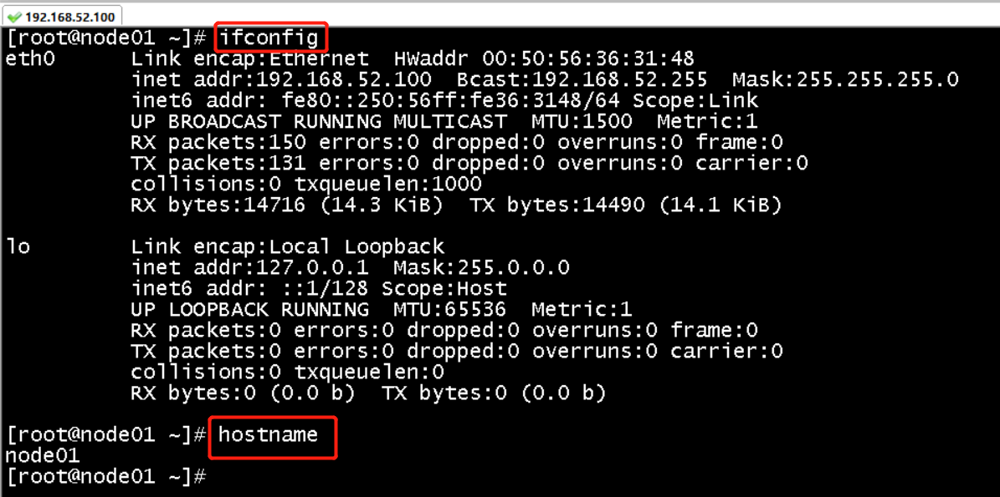
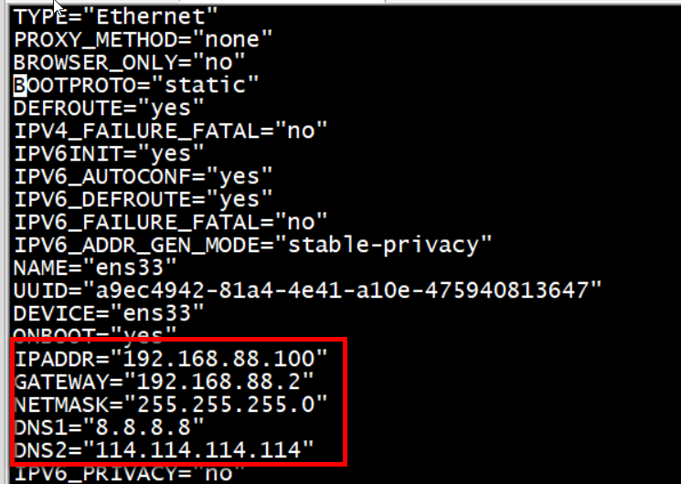
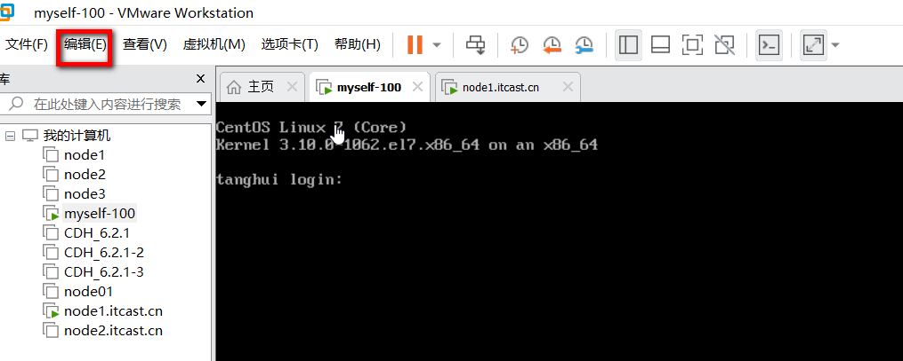
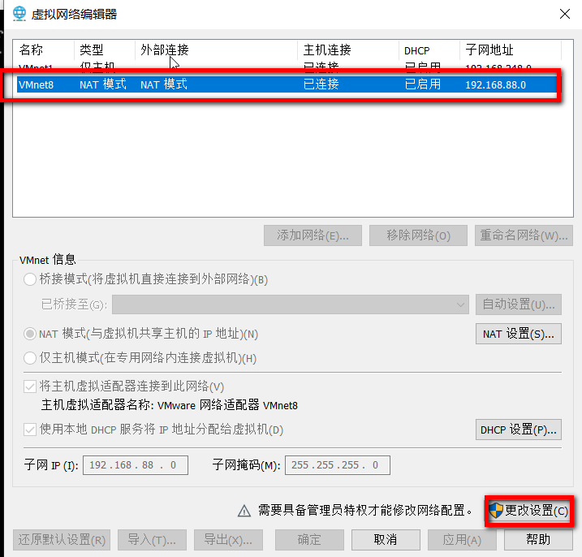
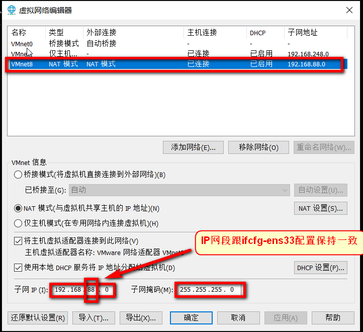
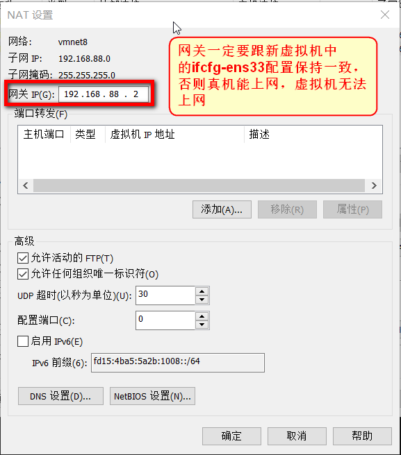
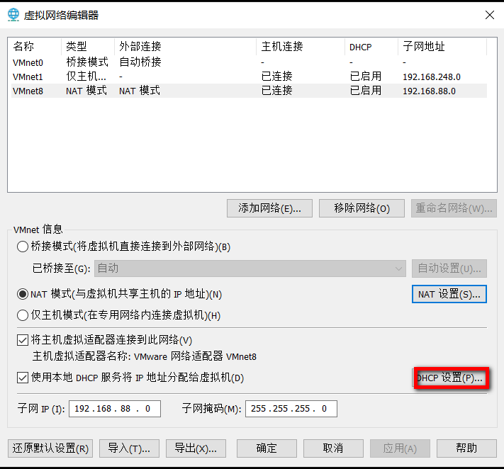
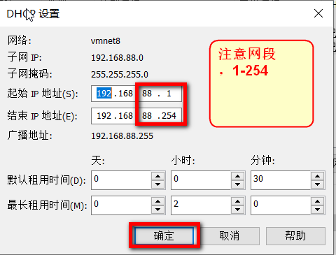
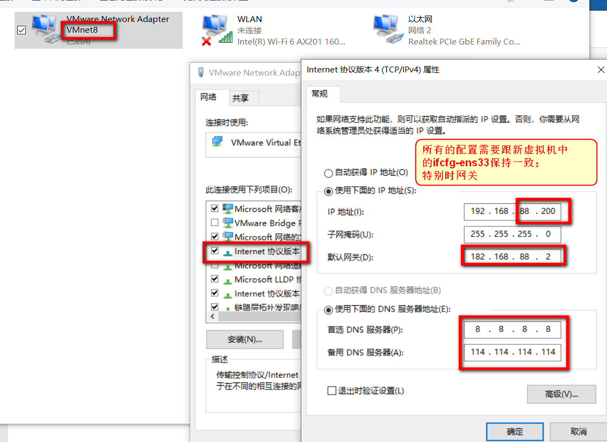

# 第一次启动新的虚拟机

- 点击启动虚拟机，弹出会话框：【已移动此虚拟机】和【已复制此虚拟机】，**选择【已移动】**。

  

# 虚拟机关闭防火墙

``` properties
systemctl stop firewalld
```


# 在真机上配置主机名与IP映射

- 在Windows中配置映射，配置路径：**C:\Windows\System32\drivers\etc\hosts**

``` properties
#学习自搭环境
#192.168.88.161 node1  
#192.168.88.162 node2  
#192.168.88.163 node3 

#项目一
192.168.52.150 hadoop01 hadoop01.itcast.cn
192.168.52.151 hadoop02 hadoop02.itcast.cn
192.168.52.152 hadoop03 hadoop03.itcast.cn

#项目二
192.168.52.100 node01.hadoop.com node01

#项目三
192.168.88.10 node1 node1.itcast.cn
192.168.88.20 node2 node2.itcast.cn
```





# 查看新虚拟机网络配置

vim  /etc/sysconfig/network-scripts/ifcfg-ens33



# 配置VMware网络



- **编译->虚拟网络编辑器**



- **选择VMnet8 -> 点击更改设置**
- **重新加载后**，再次选择VMnet8 



- **点击NAT设置**



- **确定后**，在点击**DHCP设置**
- 



- **最后一路确定并完成；**


# 配置真机

- 关闭防火墙；否则会出现虚拟机无法ping通真机，而真机能ping通虚拟机的情况；
- 